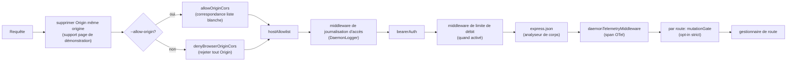
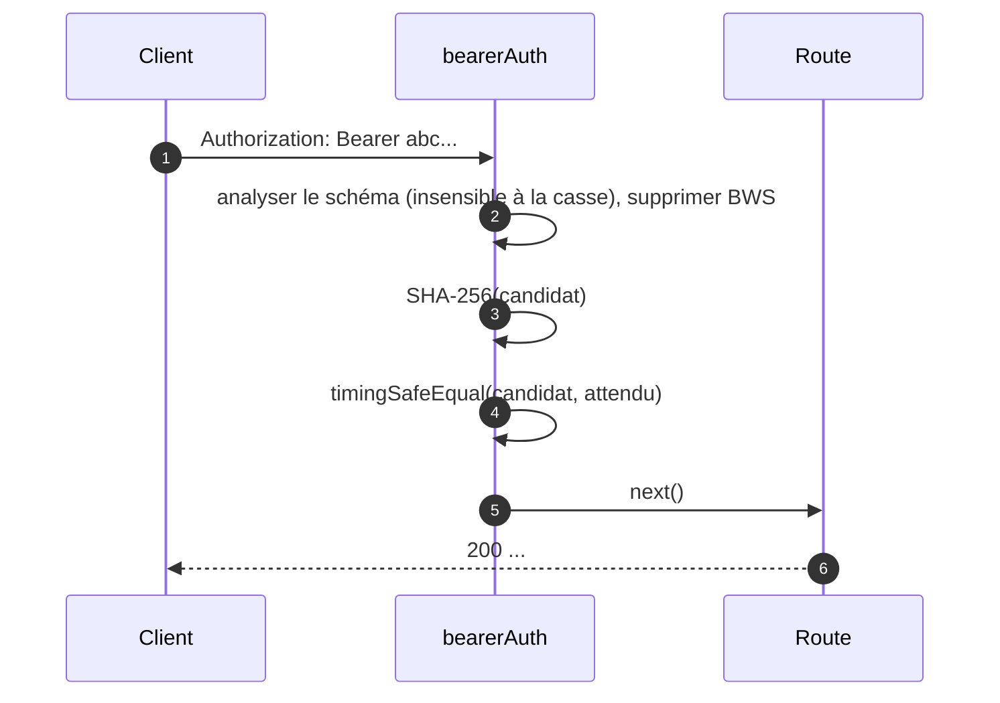
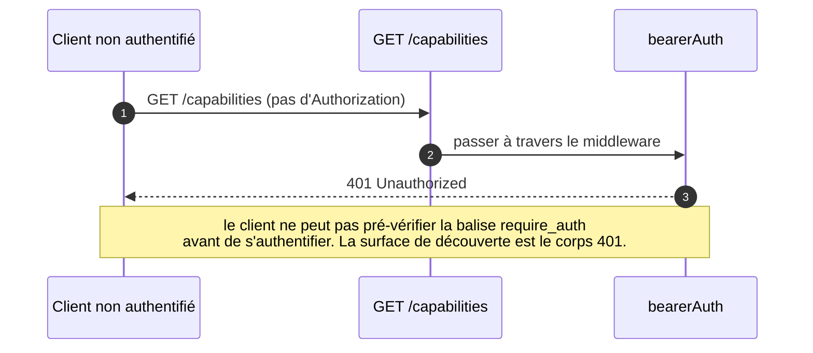
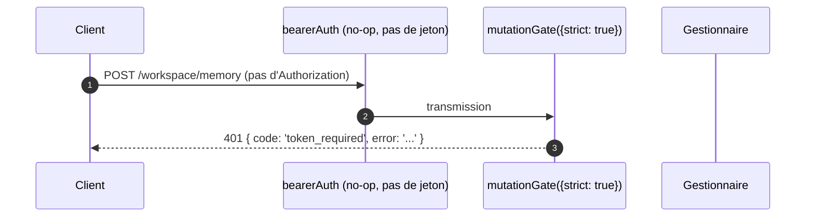

# Modèle d'authentification et de sécurité

## Présentation

`qwen serve` est un démon local par défaut et une surface exposée dans une mauvaise configuration. Son modèle de sécurité est **en couches** afin qu'une mauvaise configuration échoue de manière sécurisée :

1. **Bind** — une liaison non-loopback sans jeton bearer **refuse de démarrer**.
2. **Authentification Bearer** — middleware `bearerAuth` avec comparaison SHA-256 à temps constant protège chaque route sauf `/health` sur loopback (`require_auth` étend cela à loopback et `/health` aussi).
3. **Liste blanche d'en-têtes Host** — sur loopback, seuls `localhost`, `127.0.0.1`, `[::1]`, `host.docker.internal` (plus le port) sont acceptés ; défense contre le DNS rebinding.
4. **Contrôle d'origine** — par défaut, toute requête avec un en-tête `Origin` est rejetée avec 403. Quand `--allow-origin <pattern>` est configuré, le démon passe en mode liste blanche CORS (`allowOriginCors`) et n'autorise que les origines correspondantes.
5. **Porte de mutation par route** — les routes mutantes de Wave 4 peuvent opter pour des réponses `401` même sur loopback quand aucun jeton n'est configuré, en utilisant une erreur distincte `code: 'token_required'`.
6. **Authentification par flux d'appareil** — surface OAuth séparée pour les fournisseurs (`POST /workspace/auth/device-flow` + GET/DELETE sur `/:id`).

Ce document décrit chaque couche et les invariants explicites que le chemin de démarrage applique.

## Responsabilités

- Refuser de démarrer dans des configurations dangereuses.
- Filtrer chaque requête HTTP via bearer (lorsqu'il est configuré) + host (loopback) + origines.
- Fournir une porte de mutation par route que les routes Wave 4 peuvent adopter.
- Héberger le registre de flux d'appareil qui pilote les flux OAuth des fournisseurs visibles via les événements SSE.

## Architecture

### Règles de refus au démarrage

Dans `run-qwen-serve.ts` :

```ts
if (!isLoopbackBind(opts.hostname) && !token) {
  throw new Error('Refusing to bind <host>:<port> without a bearer token. ...');
}
if (opts.requireAuth && !token) {
  throw new Error(
    'Refusing to start with --require-auth set but no bearer token configured. ...',
  );
}
```

Le wildcard allow-origin a sa propre règle de refus :

```ts
const parsed = parseAllowOriginPatterns(opts.allowOrigins);
if (parsed.allowAny && !token) {
  throw new Error(
    "Refusing to start with --allow-origin '*' but no bearer token configured. ...",
  );
}
```

Ces trois refus sont des échecs de démarrage explicites (visibles dans stderr / envoyés à l'intégrateur), jamais silencieux. Le modèle de menace de #3803 interdit explicitement de laisser silencieusement un démon se lier au-delà de loopback.

### Chaîne de middleware (ordre des requêtes HTTP)



`mutationGate` est une fabrique de middleware par route (`createMutationGate` retourne `mutate()`) ; les routes appellent `mutate()` ou `mutate({strict: true})` au moment de l'enregistrement. Ce n'est pas un middleware global `app.use()`. La journalisation d'accès est enregistrée avant `bearerAuth` pour que les rejets 401 soient tout de même journalisés. La limitation de débit s'exécute après `bearerAuth` et avant `express.json()`, ainsi seules les requêtes authentifiées comptent et les gros corps sont rejetés avant analyse quand une limite est dépassée.

### `bearerAuth`

- **Aucun jeton configuré** → le middleware est un no-op (loopback, développement par défaut).
- **Jeton configuré** → SHA-256 du jeton configuré une fois à la construction ; sur chaque requête, hacher le candidat et comparer avec `timingSafeEqual`. Pas de court-circuit par égalité de chaîne ; pas de fuite temporelle.
- **Analyse du schéma** : `Bearer` insensible à la casse selon RFC 7235 §2.1 ; tolérant `SP\tHTAB` entre schéma et identifiants selon RFC 7230 §3.2.6 BWS ; rejette le pure-HTAB comme séparateur.
- **Renforcement CodeQL** : analyse manuelle avec `indexOf` plutôt qu'une regex avec `\s+` / `.+` en concurrence (pas de risque polynomial de regex).

### `hostAllowlist`

Uniquement loopback. Maintient un `Set<string>` indexé par port. Hôtes autorisés :

- `localhost:<port>`, `127.0.0.1:<port>`, `[::1]:<port>`, `host.docker.internal:<port>`.
- Plus les formes sans port (`localhost`, `127.0.0.1`, `[::1]`, `host.docker.internal`) **uniquement** quand lié au port 80 (selon RFC 7230 §5.4 omission du port par défaut).

La comparaison d'hôte est **insensible à la casse** — Express normalise les noms d'en-tête mais pas les valeurs, donc les proxys Docker qui mettent en majuscule les Hosts (`Localhost:4170`, `HOST.docker.internal`) obtiendraient un 403 avec une comparaison de chaîne exacte.

Les liaisons non-loopback contournent ce middleware (l'opérateur a choisi la surface d'attaque ; le jeton bearer protège plutôt contre l'usurpation Host).

### `denyBrowserOriginCors`

Rejette toute requête avec un en-tête `Origin`. Les CLI/SDK ne définissent jamais Origin ; seuls les navigateurs le font. Retourne un `403 { error: 'Request denied by CORS policy' }` déterministe plutôt que le 500 HTML que produirait le callback d'erreur du paquet `cors`.

Exception : les XHR de même origine de la page de démonstration sont gérées par un middleware séparé (dans `server.ts`) qui supprime `Origin` quand il correspond à l'adresse du démon lui-même.

### `allowOriginCors` (mode `--allow-origin`)

Quand `--allow-origin <pattern>` est configuré, `denyBrowserOriginCors` est
remplacé par `allowOriginCors(parsedPatterns)` :

- Les valeurs `Origin` correspondantes reçoivent `Access-Control-Allow-Origin`,
  `Access-Control-Allow-Headers`, et `Access-Control-Allow-Methods` ; le pré-vol `OPTIONS`
  retourne `204`.
- Les valeurs `Origin` non correspondantes reçoivent le même
  `403 { error: 'Request denied by CORS policy' }` déterministe qu'en mode refus.
- `--allow-origin '*'` nécessite `--token` ; sinon le démarrage refuse.
- `parseAllowOriginPatterns()` valide la syntaxe du motif au démarrage.
- La balise de capacité `allow_origin` n'est annoncée que lorsque ce mode est
  configuré.

### `createMutationGate`

Porte opt-in par route. Matrice de comportement :

| configuration du démon    | options de route | résultat                         |
| ------------------------- | ---------------- | -------------------------------- |
| `requireAuth=true`        | quelconque       | transmission¹                     |
| `token` configuré         | quelconque       | transmission²                     |
| pas de jeton (loopback dev) | `strict: false` | transmission                      |
| pas de jeton (loopback dev) | `strict: true`  | `401 { code: 'token_required' }` |

¹ `--require-auth` démarre uniquement avec un jeton, donc le `bearerAuth` global a déjà renvoyé 401 aux appelants non authentifiés.
² Toute configuration de jeton fait que le `bearerAuth` global impose bearer-required-partout ; la porte est redondante mais inoffensive.

La forme `code: 'token_required'` est distincte du simple `Unauthorized` de `bearerAuth` pour que les clients SDK puissent afficher une astuce "configurer --token / --require-auth" plutôt qu'un 401 générique.

**Routes strictes Wave 4+** : `/workspace/memory`, `/workspace/agents/*`,
`/workspace/agents/generate`, `/file/write`, `/file/edit`,
`/workspace/tools/:name/enable`, `/workspace/mcp/:server/restart`,
`/workspace/mcp/:server/{enable,disable,authenticate,clear-auth}`,
`/workspace/mcp/servers` (POST/DELETE), `/workspace/auth/device-flow`,
`/workspace/init`, `/session/:id/approval-mode`.

### Exemption `/health`

Sur les liaisons loopback, `/health` est enregistrée **avant** le middleware bearer de sorte que les sondes de santé dans le pod n'aient pas besoin de porter le jeton. Les liaisons non-loopback protègent `/health` derrière bearer comme toutes les autres routes. `--require-auth` supprime l'exemption : `/health` nécessite `Authorization: Bearer <token>` même sur loopback.

### L'identité client v1 (`X-Qwen-Client-Id`) est auto-déclarée

Le démon valide uniquement le format de `X-Qwen-Client-Id`
(`[A-Za-z0-9._:-]{1,128}`) et suit les identifiants clients attachés par session. Il n'effectue
actuellement pas de preuve de possession. Un client qui observe
`originatorClientId` sur SSE peut ré-enregistrer le même identifiant et usurper cet
initiateur dans des requêtes ultérieures.

Impact :

- `designated` — un appelant distant peut usurper l'initiateur et voter sur une
  requête destinée uniquement à l'initiateur de l'invite.
- `consensus` — si l'identifiant usurpé était déjà dans l'instantané `votersAtIssue`,
  il peut voter.
- `local-only` n'est pas affecté car il se base sur `fromLoopback`, que le
  démon appose à partir de l'adresse distante de la connexion.
- `first-responder` n'est pas affecté car il est indépendant de l'identité.

Un futur mécanisme de paire de jetons délivrera un secret par session depuis
`POST /session` ; les votes `designated` / `consensus` devront le présenter. En attendant,
les déploiements qui ont besoin d'une politique désignée renforcée devraient se lier à loopback
ou fonctionner derrière un proxy inverse authentifié. Voir
[`04-permission-mediation.md`](./04-permission-mediation.md) pour les détails au niveau des politiques.

### Authentification par flux d'appareil

Surface OAuth séparée pour l'authentification des fournisseurs. L'identifiant de fournisseur v1 est
`qwen-oauth`, mais le niveau gratuit de Qwen OAuth a été interrompu le 2026-04-15 ; les nouvelles
configurations devraient utiliser un fournisseur d'authentification actuellement pris en charge quand il est disponible.

- `POST /workspace/auth/device-flow` — démarrer un flux ; retourne `{deviceFlowId, providerId, expiresAt, verificationUrl, userCode}`.
- `GET /workspace/auth/device-flow/:id` — interroger l'état.
- `DELETE /workspace/auth/device-flow/:id` — annuler.
- `GET /workspace/auth/status` — instantané du compte / fournisseur actuel.

Les événements SSE `auth_device_flow_{started, throttled, authorized, failed, cancelled}` diffusent l'état du flux à tous les abonnés afin que les interfaces multi-clients restent synchronisées. Voir [`09-event-schema.md`](./09-event-schema.md).

Implémentation : `packages/cli/src/serve/auth/device-flow.ts` + `qwen-device-flow-provider.ts`.

**Défense contre l'injection de logs / Trojan Source** : `sanitizeForStderr(value)`
(`device-flow.ts`) remplace les caractères de contrôle ASCII et les caractères de contrôle
Unicode par `?`. Un IdP malveillant pourrait autrement falsifier des lignes de log ou cacher
des charges utiles :

| Plage                            | Pourquoi elle est supprimée                                                                                                                                                                                                                                          |
| -------------------------------- | -------------------------------------------------------------------------------------------------------------------------------------------------------------------------------------------------------------------------------------------------------------------- |
| `\x00–\x1f`, `\x7f`, `\x80–\x9f` | Contrôles ASCII C0 / DEL / C1, séquences d'échappement terminal, et falsification de lignes de log.                                                                                                                                                                 |
| U+200B-U+200F                    | Caractères de largeur nulle plus LRM / RLM ; invisibles mais peuvent modifier le rendu du terminal.                                                                                                                                                                  |
| U+2028-U+2029                    | SÉPARATEUR DE LIGNE / PARAGRAPHE ; de nombreux terminaux compatibles Unicode les traitent comme des sauts de ligne.                                                                                                                                                 |
| U+202A-U+202E                    | Contrôles d'incorporation / d'override bidirectionnels.                                                                                                                                                                                                              |
| U+2066-U+2069                    | Contrôles d'isolation bidirectionnelle (LRI / RLI / FSI / PDI), le principal vecteur [CVE-2021-42574 "Trojan Source"](https://trojansource.codes/). Un IdP utilisant U+2066 (LRI) au lieu de U+202D (LRO) peut contourner les filtres uniquement EMBEDDING/OVERRIDE avec un réordonnancement visuel similaire. |
| U+FEFF                           | BOM / espace insécable de largeur nulle.                                                                                                                                                                                                                             |

La longueur est préservée en remplaçant chaque point de code supprimé par `?` plutôt
que de le supprimer, afin que les opérateurs puissent toujours voir que quelque chose était présent à cet
index. Les deux couches utilisent le sanitizer : `qwenDeviceFlowProvider` nettoie l'IdP
`oauthError`, et l'observateur de sondage tardif du registre nettoie les valeurs
contrôlées par le fournisseur interpolées dans les indices d'audit (`latePollResult.kind` / `lateErr.name`).

La balise de capacité `auth_device_flow` est annoncée **inconditionnellement** ; les routes elles-mêmes retournent `400 unsupported_provider` si le démon ne peut satisfaire un fournisseur spécifique. La liste des fournisseurs pris en charge se trouve sur `/workspace/auth/status` plutôt que sur `/capabilities` pour garder une forme uniforme du descripteur.

## Workflow

### Requête réussie avec authentification Bearer



### Modes d'échec de l'authentification Bearer

Tous retournent `401 { error: 'Unauthorized' }` (uniforme entre `en-tête manquant` / `mauvais schéma` / `mauvais jeton` afin que le sondage ne puisse pas distinguer).

### Ombrage `--require-auth`



Après authentification, `caps.features.includes('require_auth')` confirme que le déploiement est renforcé.

### Porte de mutation Wave 4 sur loopback sans jeton



## État & Cycle de vie

- Le jeton Bearer est lu au démarrage et tronqué (les nouvelles lignes de `cat token.txt` casseraient autrement la comparaison silencieusement).
- L'ensemble des hôtes autorisés est mis en cache par port ; reconstruit en cas de changement de port (`0` éphémère → port réel après `listen`).
- La porte de mutation construit `passthrough` et `strictDenier` une fois par construction d'application ; l'appel par route retourne la fermeture mise en cache (pas d'allocation par requête).
- Le registre de flux d'appareil est supprimé lors de `shutdown()` Phase 1 afin que les flux en attente se résolvent en `cancelled` avant le démontage HTTP.

## Dépendances

- `node:crypto` — `createHash`, `timingSafeEqual`.
- `packages/cli/src/serve/loopback-binds.ts` — `isLoopbackBind`.
- `packages/cli/src/serve/auth/device-flow.ts` — machine à états du flux d'appareil.
- `@qwen-code/acp-bridge` — expose les événements de flux d'appareil sur le bus SSE par session.

## Configuration

| Source          | Bouton                                                                                 | Effet                                                                   |
| --------------- | -------------------------------------------------------------------------------------- | ----------------------------------------------------------------------- |
| Env             | `QWEN_SERVER_TOKEN`                                                                    | Jeton Bearer (tronqué).                                                 |
| Drapeau         | `--token`                                                                              | Jeton Bearer (remplace l'environnement).                                |
| Drapeau         | `--require-auth`                                                                       | Étend bearer à loopback + `/health`. Démarre uniquement avec un jeton.  |
| Drapeau         | `--hostname`                                                                           | Liaison non-loopback nécessite `--token` (ou env).                      |
| Drapeau         | `--allow-origin <pattern>`                                                             | Passer en mode liste blanche CORS. `'*'` nécessite un jeton.            |
| Balises de capacité | `require_auth` (conditionnel), `auth_device_flow` (toujours), `allow_origin` (conditionnel) | Voir [`11-capabilities-versioning.md`](./11-capabilities-versioning.md). |

## Mises en garde & Limites connues

- **L'ombrage `--require-auth` empêche la pré-découverte des fonctionnalités.** Les clients non authentifiés ne peuvent pas découvrir la balise `require_auth` ; leur surface de découverte est le corps 401 lui-même.
- **Ordre analyseur de corps / porte de mutation** : les réponses 401 de `mutationGate({strict: true})` sont déclenchées **après** que `express.json()` a analysé le corps. Dans le pire cas sur un écouteur loopback saturé : `--max-connections × express.json({limit: '10mb'})` ≈ 2,5 Go transitoires. Surface d'attaque loopback uniquement, intentionnellement acceptée.
- **Suppression de l'en-tête Origin de même origine** dans `server.ts` a lieu _avant_ `denyBrowserOriginCors`. Si un changement futur déplace la suppression ailleurs, la page de démonstration se casse.
- **La comparaison du jeton se fait sur le digest SHA-256**, pas le jeton brut. Réduit les fuites temporelles en réduisant la comparaison de jetons de longueur variable à une comparaison de digest de taille fixe.
- Le démon **ne porte pas** mTLS, signature de requête, ou preuve de possession par paire de jetons aujourd'hui. `--rate-limit` fournit une limitation de débit HTTP par clé client-id / IP ; ce n'est pas une authentification d'identité client.

## Références

- `packages/cli/src/serve/auth.ts` (fichier entier)
- `packages/cli/src/serve/run-qwen-serve.ts` (règles de refus)
- `packages/cli/src/serve/loopback-binds.ts`
- `packages/cli/src/serve/auth/device-flow.ts`
- `packages/cli/src/serve/auth/qwen-device-flow-provider.ts`
- Modèle de menace pour l'utilisateur : [`../../users/qwen-serve.md`](../../users/qwen-serve.md).
- Référence filaire : [`../qwen-serve-protocol.md`](../qwen-serve-protocol.md).