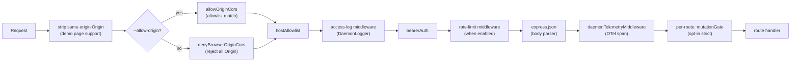
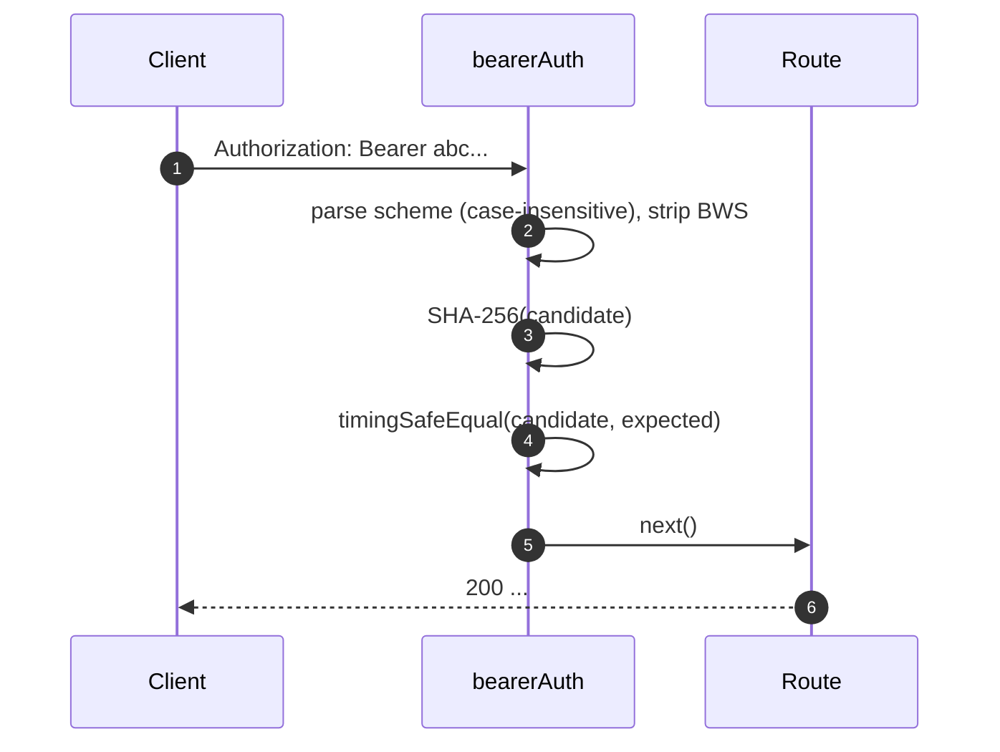
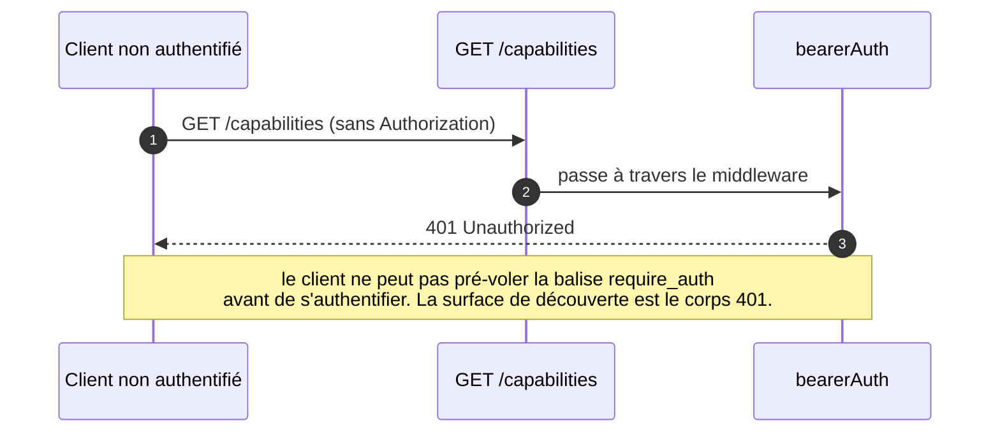
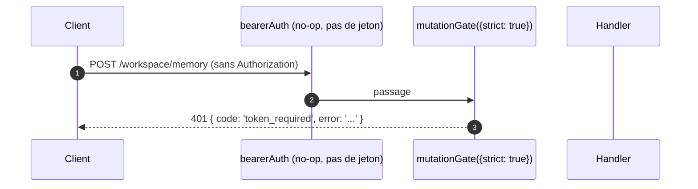

# Modèle d'authentification et de sécurité

## Aperçu

`qwen serve` est un démon local par défaut et une surface exposée en cas de mauvaise configuration. Son modèle de sécurité est **en couches** afin qu'une mauvaise configuration échoue de manière sécurisée :

1. **Liaison** — une liaison non-loopback sans jeton porteur **refuse de démarrer**.
2. **Authentification par jeton porteur** — le middleware `bearerAuth` avec comparaison SHA-256 en temps constant protège toutes les routes sauf `/health` sur loopback (`require_auth` étend ceci à loopback et `/health` également).
3. **Liste blanche d'en-têtes Host** — sur loopback, seuls `localhost`, `127.0.0.1`, `[::1]`, `host.docker.internal` (plus le port) sont acceptés ; défense contre le rebinding DNS.
4. **Contrôle d'origine** — par défaut, toute requête avec un en-tête `Origin` est rejetée avec un 403. Lorsque `--allow-origin <pattern>` est configuré, le démon passe en mode liste blanche CORS (`allowOriginCors`) et n'autorise que les origines correspondantes.
5. **Porte de mutation par route** — Les routes mutantes de Wave 4 peuvent opter pour des réponses `401` même sur loopback lorsqu'aucun jeton n'est configuré, en utilisant une erreur distincte `code: 'token_required'`.
6. **Authentification par flux d'appareil** — surface OAuth séparée pour les fournisseurs (`POST /workspace/auth/device-flow` + GET/DELETE sur `/:id`).

Ce document parcourt chaque couche et les invariants explicites que le chemin de démarrage applique.

## Responsabilités

- Refuser de démarrer dans des configurations dangereuses.
- Contrôler chaque requête HTTP via le jeton porteur (quand configuré) + hôte (loopback) + vérifications d'origine.
- Fournir une porte de mutation par route dans laquelle les routes Wave 4 peuvent s'inscrire.
- Héberger le registre de flux d'appareil qui pilote les flux OAuth des fournisseurs visibles via des événements SSE.

## Architecture

### Règles de refus au démarrage

Dans `run-qwen-serve.ts` :

```ts
if (!isLoopbackBind(opts.hostname) && !token) {
  throw new Error('Refusing to bind <host>:<port> without a bearer token. ...');
}
if (opts.requireAuth && !token) {
  throw new Error(
    'Refusing to start with --require-auth set but no bearer token configured. ...',
  );
}
```

La règle de refus pour le wildcard d'origine a sa propre règle :

```ts
const parsed = parseAllowOriginPatterns(opts.allowOrigins);
if (parsed.allowAny && !token) {
  throw new Error(
    "Refusing to start with --allow-origin '*' but no bearer token configured. ...",
  );
}
```

Ces trois refus sont des échecs explicites au démarrage (visibles dans stderr / lancés à l'encapsuleur), jamais silencieux. Le modèle de menace de #3803 interdit explicitement de laisser silencieusement un démon se lier au-delà de loopback en ouvert.

### Chaîne de middleware (ordre des requêtes HTTP)



`mutationGate` est une fabrique de middleware par route (`createMutationGate` renvoie `mutate()`) ; les routes appellent `mutate()` ou `mutate({strict: true})` au moment de l'enregistrement. Ce n'est pas un middleware global `app.use()`. La journalisation d'accès est enregistrée avant `bearerAuth` pour que les rejets 401 soient également enregistrés. La limitation de débit s'exécute après `bearerAuth` et avant `express.json()`, de sorte que seules les requêtes authentifiées comptent et que les corps volumineux sont rejetés avant l'analyse lorsqu'une limite est dépassée.

### `bearerAuth`

- **Aucun jeton configuré** → le middleware est une opération nulle (par défaut développeur sur loopback).
- **Jeton configuré** → SHA-256 du jeton configuré une fois à la construction ; à chaque requête, hacher le candidat et comparer avec `timingSafeEqual`. Pas de court-circuit d'égalité de chaîne ; pas de fuite temporelle.
- **Analyse du schéma** : `Bearer` insensible à la casse selon RFC 7235 §2.1 ; tolérant de `SP\tHTAB` entre le schéma et les identifiants selon RFC 7230 §3.2.6 BWS ; rejette le pur-HTAB comme séparateur.
- **Renforcement CodeQL** : analyse manuelle avec `indexOf` plutôt qu'expression régulière avec chevauchement `\s+` / `.+` (pas de risque d'expression régulière polynomiale).

### `hostAllowlist`

Uniquement sur loopback. Maintient un `Set<string>` indexé par port. Hôtes autorisés :

- `localhost:<port>`, `127.0.0.1:<port>`, `[::1]:<port>`, `host.docker.internal:<port>`.
- Plus les formulaires sans port (`localhost`, `127.0.0.1`, `[::1]`, `host.docker.internal`) **uniquement** lorsqu'ils sont liés au port 80 (selon RFC 7230 §5.4 omission du port par défaut).

La comparaison des hôtes est **insensible à la casse** — Express normalise les noms d'en-tête mais pas les valeurs, donc les proxys Docker qui mettent en majuscule les Hôtes (`Localhost:4170`, `HOST.docker.internal`) obtiendraient un 403 avec une comparaison exacte de chaîne.

Les liaisons non-loopback contournent ce middleware (l'opérateur a choisi la surface ; le jeton porteur contrôle l'usurpation d'hôte à la place).

### `denyBrowserOriginCors`

Rejeter toute requête avec un en-tête `Origin`. Le CLI/SDK ne définit jamais Origin ; seuls les navigateurs le font. Renvoie un `403 { error: 'Request denied by CORS policy' }` déterministe plutôt que le HTML 500 que le callback d'erreur du package `cors` produirait.
Exception : les XHR de même origine de la page de démonstration sont gérées par un middleware séparé (dans `server.ts`) qui supprime `Origin` lorsqu'elle correspond à l'adresse propre du démon.

### `allowOriginCors` (mode `--allow-origin`)

Lorsque `--allow-origin <pattern>` est configuré, `denyBrowserOriginCors` est
remplacé par `allowOriginCors(parsedPatterns)` :

- Les valeurs `Origin` correspondantes reçoivent `Access-Control-Allow-Origin`,
  `Access-Control-Allow-Headers` et `Access-Control-Allow-Methods` ; le pré-vol
  `OPTIONS` renvoie `204`.
- Les valeurs `Origin` non correspondantes reçoivent le même
  `403 { error: 'Request denied by CORS policy' }` déterministe qu'en mode "deny".
- `--allow-origin '*'` nécessite `--token` ; sinon le démarrage est refusé.
- `parseAllowOriginPatterns()` valide la syntaxe des motifs au démarrage.
- La balise de capacité `allow_origin` n'est annoncée que lorsque ce mode est
  configuré.

### `createMutationGate`

Porte d'activation par route. Matrice de comportement :

| configuration du démon      | options de route | résultat                          |
| --------------------------- | ---------------- | -------------------------------- |
| `requireAuth=true`          | any              | pass-through¹                     |
| `token` configuré           | any              | pass-through²                     |
| aucun jeton (dév. boucle locale) | `strict: false`  | pass-through                      |
| aucun jeton (dév. boucle locale) | `strict: true`   | `401 { code: 'token_required' }` |

¹ `--require-auth` démarre uniquement avec un jeton, donc le `bearerAuth` global renvoie déjà 401 pour les appelants non authentifiés.
² Toute configuration de jeton fait que le `bearerAuth` global impose l'authentification bearer partout ; la porte est redondante mais inoffensive.

La forme `code: 'token_required'` est distincte du simple `Unauthorized` de `bearerAuth` afin que les clients SDK puissent afficher une indication `"configure --token / --require-auth"` au lieu d'un 401 générique.

**Routes strictes Wave 4+** : `/workspace/memory`, `/workspace/agents/*`,
`/workspace/agents/generate`, `/file/write`, `/file/edit`,
`/workspace/tools/:name/enable`, `/workspace/mcp/:server/restart`,
`/workspace/mcp/:server/{enable,disable,authenticate,clear-auth}`,
`/workspace/mcp/servers` (POST/DELETE), `/workspace/auth/device-flow`,
`/workspace/init`, `/session/:id/approval-mode`.

### Exemption `/health`

Sur les liaisons en boucle locale, `/health` est enregistrée **avant** le middleware bearer afin que les sondes de vivacité dans le pod n'aient pas besoin de porter le jeton. Les liaisons hors boucle locale gardent `/health` derrière bearer comme toute autre route. `--require-auth` supprime l'exemption : `/health` nécessite `Authorization: Bearer <token>` également sur la boucle locale.

### Identité client v1 (`X-Qwen-Client-Id`) auto-déclarée

Le démon ne valide que le format de `X-Qwen-Client-Id`
(`[A-Za-z0-9._:-]{1,128}`) et suit les identifiants clients attachés par session. Il n'effectue pas actuellement de preuve de possession. Un client qui observe `originatorClientId` sur SSE peut réenregistrer le même identifiant et usurper l'identité de l'initiateur dans les requêtes ultérieures.

Impact :

- `designated` — un appelant distant peut usurper l'identité de l'initiateur et voter sur une requête destinée uniquement à l'initiateur de la demande.
- `consensus` — si l'identifiant usurpé était déjà dans l'instantané `votersAtIssue`, il peut voter.
- `local-only` n'est pas affecté car il se base sur `fromLoopback`, que le démon appose depuis l'adresse distante de la connexion.
- `first-responder` n'est pas affecté car il est indépendant de l'identité.

Un futur mécanisme de jeton de paire générera un secret par session à partir de `POST /session` ; les votes `designated` / `consensus` devront le présenter. D'ici là, les déploiements qui nécessitent une politique désignée renforcée doivent se lier en boucle locale ou passer par un proxy inverse authentifié. Voir [`04-permission-mediation.md`](./04-permission-mediation.md) pour les détails de politique.

### Authentification par flux d'appareil

Surface OAuth séparée pour l'authentification du fournisseur. L'identifiant v1 du fournisseur est `qwen-oauth`, mais le niveau gratuit de Qwen OAuth a été abandonné le 15 avril 2026 ; les nouvelles configurations devraient utiliser un fournisseur d'authentification actuellement pris en charge lorsqu'il est disponible.

- `POST /workspace/auth/device-flow` — démarrer un flux ; renvoie `{deviceFlowId, providerId, expiresAt, verificationUrl, userCode}`.
- `GET /workspace/auth/device-flow/:id` — interroger l'état.
- `DELETE /workspace/auth/device-flow/:id` — annuler.
- `GET /workspace/auth/status` — instantané du compte / fournisseur actuel.

Les événements SSE `auth_device_flow_{started, throttled, authorized, failed, cancelled}` diffusent l'état du flux à tous les abonnés afin que les interfaces multi-client restent synchronisées. Voir [`09-event-schema.md`](./09-event-schema.md).

Implémentation : `packages/cli/src/serve/auth/device-flow.ts` + `qwen-device-flow-provider.ts`.

**Défense contre l'injection de logs / Trojan Source** : `sanitizeForStderr(value)`
(`device-flow.ts`) remplace les caractères de contrôle ASCII et les caractères de
contrôle Unicode par `?`. Un IdP malveillant pourrait autrement forger des lignes de
log ou masquer des charges utiles :

| Plage                            | Raison du retrait                                                                                                                                                                                                                                                  |
| -------------------------------- | ----------------------------------------------------------------------------------------------------------------------------------------------------------------------------------------------------------------------------------------------------------------- |
| `\x00–\x1f`, `\x7f`, `\x80–\x9f` | Contrôles ASCII C0 / DEL / C1, échappements de terminal et falsification de lignes de log.                                                                                                                                                                                               |
| U+200B-U+200F                    | Caractères de largeur nulle ainsi que LRM / RLM ; invisibles mais peuvent modifier le rendu du terminal.                                                                                                                                                                                  |
| U+2028-U+2029                    | SÉPARATEUR DE LIGNE / PARAGRAPHE ; de nombreux terminaux compatibles Unicode les traitent comme des sauts de ligne.                                                                                                                                                                                 |
| U+202A-U+202E                    | Contrôles d'encastrement / d'override bidirectionnels.                                                                                                                                                                                                                        |
| U+2066-U+2069                    | Contrôles d'isolation bidirectionnelle (LRI / RLI / FSI / PDI), le principal vecteur [CVE-2021-42574 "Trojan Source"](https://trojansource.codes/). Un IdP utilisant U+2066 (LRI) au lieu de U+202D (LRO) peut contourner les filtres basés uniquement sur EMBEDDING/OVERRIDE avec un réordonnancement visuel similaire. |
| U+FEFF                           | BOM / espace insécable de largeur nulle.                                                                                                                                                                                                                        |
La longueur est préservée en remplaçant chaque point de code supprimé par `?` plutôt qu'en le supprimant, afin que les opérateurs puissent encore voir que quelque chose était présent à cet index. Les deux couches utilisent le sanitizer : `qwenDeviceFlowProvider` nettoie l'IdP `oauthError`, et l'observer de sondage tardif du registre nettoie les valeurs contrôlées par le fournisseur interpolées dans les indices d'audit (`latePollResult.kind` / `lateErr.name`).

La balise de capacité `auth_device_flow` est annoncée **inconditionnellement** ; les routes elles-mêmes renvoient `400 unsupported_provider` si le démon ne peut pas satisfaire un fournisseur spécifique. La liste des fournisseurs pris en charge se trouve sur `/workspace/auth/status` plutôt que sur `/capabilities` pour garder la forme du descripteur uniforme.

## Flux de travail

### Requête réussie avec authentification Bearer



### Modes d'échec de l'authentification Bearer

Tous renvoient `401 { error: 'Unauthorized' }` (uniforme pour `en-tête manquant` / `mauvais schéma` / `mauvais jeton` afin que le sondage ne puisse pas distinguer).

### Ombre de `--require-auth`



Après authentification, `caps.features.includes('require_auth')` confirme que le déploiement est renforcé.

### Porte de mutation Wave 4 sur loopback sans jeton



## État et Cycle de vie

- Le jeton Bearer est lu au démarrage et tronqué (les nouvelles lignes de `cat token.txt` casseraient silencieusement la comparaison).
- L'ensemble des hôtes autorisés est mis en cache par port ; reconstruit lors d'un changement de port (`0` éphémère → port réel après `listen`).
- La porte de mutation construit `passthrough` et `strictDenier` une fois par construction de l'application ; l'appel par route renvoie la fermeture mise en cache (pas d'allocation par requête).
- Le registre du flux de périphérique est libéré lors de la phase 1 de `shutdown()` afin que les flux en attente soient résolus comme `cancelled` avant le démontage HTTP.

## Dépendances

- `node:crypto` — `createHash`, `timingSafeEqual`.
- `packages/cli/src/serve/loopback-binds.ts` — `isLoopbackBind`.
- `packages/cli/src/serve/auth/device-flow.ts` — machine à états du flux de périphérique.
- `@qwen-code/acp-bridge` — expose les événements du flux de périphérique sur le bus SSE par session.

## Configuration

| Source          | Paramètre                                                                            | Effet                                                                  |
| --------------- | --------------------------------------------------------------------------------------- | ----------------------------------------------------------------------- |
| Environnement   | `QWEN_SERVER_TOKEN`                                                                     | Jeton Bearer (tronqué).                                                 |
| Option (flag)   | `--token`                                                                               | Jeton Bearer (remplace la variable d'environnement).                    |
| Option (flag)   | `--require-auth`                                                                        | Étend le Bearer au loopback + `/health`. Ne démarre qu'avec un jeton.   |
| Option (flag)   | `--hostname`                                                                            | Une liaison non-loopback nécessite `--token` (ou variable d'environnement). |
| Option (flag)   | `--allow-origin <pattern>`                                                              | Bascule en mode liste blanche CORS. `'*'` nécessite un jeton.           |
| Balises de capacité | `require_auth` (conditionnelle), `auth_device_flow` (toujours), `allow_origin` (conditionnelle) | Voir [`11-capabilities-versioning.md`](./11-capabilities-versioning.md). |

## Mises en garde et Limites connues

- **`--require-auth` masque le prévol de fonctionnalité.** Les clients non authentifiés ne peuvent pas découvrir la balise `require_auth` ; leur surface de découverte est le corps 401 lui-même.
- **Ordre du body-parser de la porte de mutation** : Les réponses 401 de `mutationGate({strict: true})` sont émises **après** que `express.json()` a analysé le corps. Pire cas sur un écouteur loopback saturé : `--max-connections × express.json({limit: '10mb'})` ≈ 2,5 Go transitoires. Surface d'attaque loopback uniquement, intentionnellement acceptée.
- **Le stripping de l'origine same-origin** dans `server.ts` se produit _avant_ `denyBrowserOriginCors`. Si un changement futur déplace le stripping ailleurs, la page de démonstration se casse.
- **La comparaison des jetons se fait sur le digest SHA-256**, pas sur le jeton brut. Réduit les fuites temporelles en transformant les comparaisons de jetons de longueur variable en une comparaison de digest de taille fixe.
- Le démon ne supporte **pas** actuellement mTLS, la signature de requête, ou la preuve de possession de jeton de paire. `--rate-limit` fournit une limitation de débit HTTP par clé client-id / IP ; ce n'est pas une authentification d'identité client.
## Références

- `packages/cli/src/serve/auth.ts` (fichier entier)
- `packages/cli/src/serve/run-qwen-serve.ts` (règles de refus)
- `packages/cli/src/serve/loopback-binds.ts`
- `packages/cli/src/serve/auth/device-flow.ts`
- `packages/cli/src/serve/auth/qwen-device-flow-provider.ts`
- Modèle de menace pour l'utilisateur : [`../../users/qwen-serve.md`](../../users/qwen-serve.md).
- Référence du protocole : [`../qwen-serve-protocol.md`](../qwen-serve-protocol.md).
