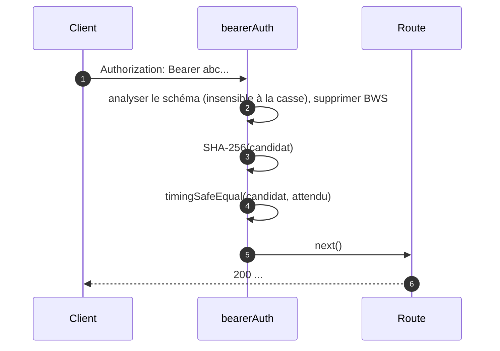
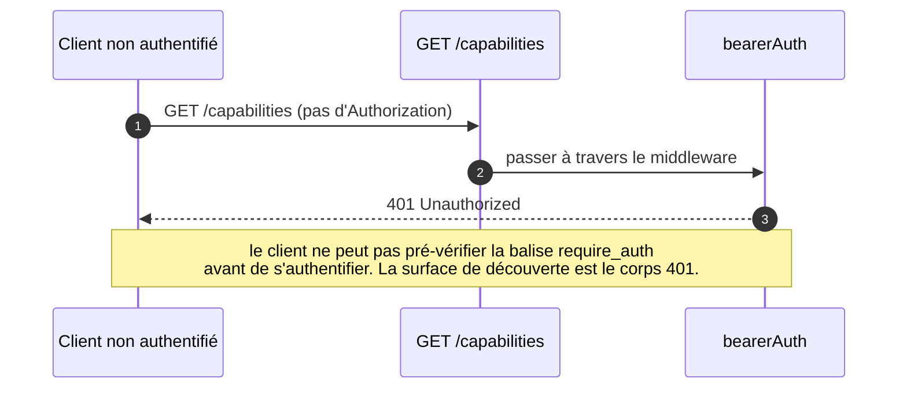
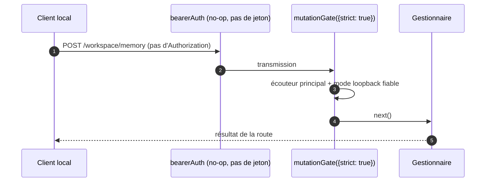

# Modèle d'authentification et de sécurité

## Présentation

`qwen serve` est un démon local par défaut et une surface exposée dans une mauvaise configuration. Son modèle de sécurité est **en couches** afin qu'une mauvaise configuration échoue de manière sécurisée (fail closed) :

1. **Bind** — une liaison non-loopback sans jeton bearer **refuse de démarrer**.
2. **Authentification Bearer** — le middleware `bearerAuth` avec comparaison SHA-256 à temps constant protège les routes API normales sauf `/health` sur une liaison loopback ordinaire (`require_auth` place également ce point d'accès derrière le bearer). L'entrée webhook de canal est une route pré-bearer séparée authentifiée par `x-qwen-webhook-secret`. Les routes de documents et d'assets du Web Shell restent pré-auth dans tous les modes.
3. **Liste blanche d'en-têtes Host** — sur loopback, seuls `localhost`, `127.0.0.1`, `[::1]`, `host.docker.internal`, ou l'adresse loopback liée exacte (plus le port) sont acceptés ; les formes sans port correspondantes sont également acceptées lors de l'écoute sur 80 ou 443. La liste blanche protège contre le DNS rebinding. L'écouteur LAN Local Control est l'exception qui applique toujours sa vérification Host d'autorité annoncée, quelle que soit la liaison principale.
4. **Contrôle d'origine** — l'application runtime installe toujours `allowOriginCors` sur une liste blanche mutable (`MutableOriginAllowlist`) : les entrées `--allow-origin <pattern>` l'initialisent, et Local Control ajoute l'origine LAN lorsqu'il est activé. Les origines non correspondantes reçoivent l'enveloppe de refus 403. Le mur de refus inconditionnel (`denyBrowserOriginCors`) ne survit que dans l'application bootstrap qui répond avant le démarrage du runtime.
5. **Porte de mutation par route** — les routes strictes requièrent une autorité opérateur. Un écouteur principal loopback sans jeton est fiable ; les requêtes authentifiées par bearer et les requêtes Local Control appariées sont également qualifiées. Une requête principale sans jeton qui atteint cette porte sans autorité fiable reçoit l'erreur distincte `code: 'token_required'`. Les identifiants configurés manquants ou invalides et les identifiants Local Control non appariés sont rejetés plus tôt par leur middleware bearer limité à l'écouteur avec un simple `401 Unauthorized`.
6. **Authentification par flux d'appareil** — surface OAuth séparée pour les fournisseurs (`POST /workspace/auth/device-flow` + GET/DELETE sur `/:id`).

Ce document décrit chaque couche et les invariants explicites que le chemin de démarrage applique.

## Responsabilités

- Refuser de démarrer dans des configurations dangereuses.
- Filtrer les requêtes API normales via le bearer lorsqu'il est configuré, sous réserve de l'exemption loopback `/health` ; garder l'entrée webhook de canal derrière sa porte de secret partagé indépendante, et garder les vérifications Host loopback et Origin navigateur devant les routes authentifiées et exemptées.
- Fournir une porte de mutation par route que les routes Wave 4 peuvent adopter.
- Héberger le registre de flux d'appareil qui pilote les flux OAuth des fournisseurs visibles via les événements SSE.

## Architecture

### Règles de refus au démarrage

Dans `run-qwen-serve.ts` :

```ts
if (!isLoopbackBind(opts.hostname) && !token) {
  throw new Error('Refusing to bind <host>:<port> without a bearer token. ...');
}
if (opts.requireAuth && !token) {
  throw new Error(
    'Refusing to start with --require-auth set but no bearer token configured. ...',
  );
}
```

La configuration allow-origin sans jeton est limitée aux origines HTTP(S) loopback ;
les entrées non-HTTP(S) conservent leur gestion existante :

```ts
const parsed = parseAllowOriginPatterns(opts.allowOrigins);
if (parsed.allowAny && !token) {
  throw new Error(
    "Refusing to start with --allow-origin '*' but no bearer token configured. ...",
  );
}
if (findNonLoopbackHttpOrigin(parsed) && !token) {
  throw new Error(
    'Refusing to start with a non-loopback HTTP(S) --allow-origin but no bearer token configured. ...',
  );
}
```

Ces refus sont des échecs de démarrage explicites (visibles dans stderr / envoyés à l'intégrateur), jamais silencieux. Le modèle de menace de #3803 interdit explicitement de laisser silencieusement un démon se lier au-delà de loopback à découvert.

`runQwenServe()` résout `localhost` une fois, épingle l'écouteur à cette adresse, et vérifie l'adresse réelle de l'écouteur avant de publier l'autorité loopback fiable ; si le résultat est en dehors de `127.0.0.0/8` ou `::1`, le démarrage sans jeton échoue et ferme l'écouteur. `createServeApp()` ne possède pas de socket, donc son appelant reste responsable de s'assurer qu'un nom d'hôte loopback déclaré n'est lié qu'à loopback. Un embed non-loopback déclaré conserve les routes strictes, le shell de session, et le matériel d'appariement Local Control en fail closed. Il rejette également `requireAuth: true` sans un jeton non vide à la construction afin que les routes non strictes ne puissent pas accidentellement rester ouvertes sous une configuration durcie invalide.

### Chaîne de middleware (ordre des requêtes HTTP)


```mermaid
flowchart LR
    REQ[Requête] --> SO["supprimer Origin même origine<br/>(support Web Shell)"]
    SO --> AO["allowOriginCors<br/>(liste blanche mutable : motifs<br/>--allow-origin<br/>+ origine LAN Local Control)"]
    AO --> HA["hostAllowlist"]
    HA --> LOG["middleware de journalisation d'accès<br/>(DaemonLogger)"]
    LOG --> WH{"Webhook de canal ?"}
    WH -->|oui| WS["x-qwen-webhook-secret<br/>+ limites débit/corps webhook"]
    WH -->|non| BA["bearerAuth"]
    BA --> RL["middleware de limite de débit<br/>(quand activé)"]
    RL --> JSON["express.json<br/>(analyseur de corps)"]
    JSON --> TEL["daemonTelemetryMiddleware<br/>(span OTel)"]
    TEL --> MG["par route: mutationGate<br/>(opt-in strict)"]
    MG --> HANDLER["gestionnaire de route"]
```

`mutationGate` est une fabrique de middleware par route (`createMutationGate` retourne `mutate()`) ; les routes appellent `mutate()` ou `mutate({strict: true})` au moment de l'enregistrement. Ce n'est pas un middleware global `app.use()`. La journalisation d'accès est enregistrée avant `bearerAuth` pour que les rejets 401 soient tout de même journalisés. La limitation de débit API normale s'exécute après `bearerAuth` et avant `express.json()`, ainsi seules les requêtes authentifiées comptent et les gros corps sont rejetés avant analyse quand une limite est dépassée. L'entrée webhook de canal bifurque avant l'authentification bearer et applique sa propre vérification de secret partagé, sa vérification de débit de niveau mutation, et son analyseur de 1 MiB.

### `bearerAuth`

- **Aucun jeton configuré** → le middleware est un no-op (loopback, développement par défaut). Exception : l'**écouteur LAN** Local Control est limité à l'écouteur et exige toujours son identifiant de paire (`CredentialStore.isOpen` n'est jamais vrai pour `local-control`), donc il n'est jamais ouvert même sur un démon sans jeton.
- **Jeton configuré** → SHA-256 du jeton configuré une fois à la construction ; sur chaque requête, hacher le candidat et comparer avec `timingSafeEqual`. Pas de court-circuit par égalité de chaîne ; pas de fuite temporelle.
- **Analyse du schéma** : `Bearer` insensible à la casse selon RFC 7235 §2.1 ; tolérant `SP\tHTAB` entre schéma et identifiants selon RFC 7230 §3.2.6 BWS ; rejette le pure-HTAB comme séparateur.
- **Renforcement CodeQL** : analyse manuelle avec `indexOf` plutôt qu'une regex avec `\s+` / `.+` en concurrence (pas de risque polynomial de regex).

### `hostAllowlist`

Uniquement loopback. Maintient un `Set<string>` indexé par port. Hôtes autorisés :

- `localhost:<port>`, `127.0.0.1:<port>`, `[::1]:<port>`, `host.docker.internal:<port>`, et l'adresse loopback liée exacte avec le même port. Cette dernière forme couvre la plage loopback IPv4 supportée complète (`127.0.0.0/8`) sans admettre des Hosts sans rapport.
- Plus les formes sans port correspondantes **uniquement** quand lié au port 80 ou 443 (selon RFC 7230 §5.4 omission du port par défaut).

La comparaison d'hôte est **insensible à la casse** — Express normalise les noms d'en-tête mais pas les valeurs, donc les proxys Docker qui mettent en majuscule les Hosts (`Localhost:4170`, `HOST.docker.internal`) obtiendraient un 403 avec une comparaison de chaîne exacte.

Les liaisons non-loopback contournent la porte principale (l'opérateur a choisi la surface d'attaque ; le jeton bearer protège plutôt contre l'usurpation Host). L'écouteur LAN Local Control est l'exception : il applique toujours sa vérification Host d'autorité annoncée, quelle que soit la liaison principale.

### `denyBrowserOriginCors` (application bootstrap uniquement)

Rejette toute requête avec un en-tête `Origin`. Les CLI/SDK ne définissent jamais Origin ; seuls les navigateurs le font. Retourne un `403 { error: 'Request denied by CORS policy' }` déterministe plutôt que le 500 HTML que produirait le callback d'erreur du paquet `cors`. L'application runtime n'installe plus ce mur — elle exécute `allowOriginCors` sur la liste blanche mutable (ci-dessous) ; le comportement de refus y survit comme la branche des origines sans correspondance. Le mur reste dans l'application bootstrap (run-qwen-serve.ts) qui sert les requêtes avant le démarrage du runtime.

Exception : les XHR de même origine du Web Shell sur une liaison **loopback** sont gérées par un middleware séparé (dans `server/self-origin.ts`) qui supprime `Origin` lorsqu'il correspond à l'une des auto-origines loopback canoniques (`127.0.0.1`, `localhost`, `[::1]`, `host.docker.internal`) ou l'adresse loopback liée exacte. Les origines sans port correspondant au schéma sont acceptées uniquement pour leur port par défaut (`http` sur 80, `https` sur 443). Sur les liaisons non-loopback, les XHR du shell portent un `Origin` sans correspondance et nécessitent `--allow-origin` pour l'origine du démon.

### `allowOriginCors` (application runtime, toujours installé)

L'application runtime installe `allowOriginCors(originAllowlist)` de manière
inconditionnelle ; la liste blanche est une `MutableOriginAllowlist` initialisée
à partir des entrées `--allow-origin <pattern>` (possiblement aucune) et étendue
au runtime lorsque Local Control est activé (l'origine LAN est
ajoutée/supprimée avec l'écouteur) :

- Les valeurs `Origin` correspondantes reçoivent `Access-Control-Allow-Origin`,
  `Access-Control-Allow-Headers`, et `Access-Control-Allow-Methods` ; le pré-vol `OPTIONS`
  retourne `204`.
- Les valeurs `Origin` non correspondantes reçoivent le même
  `403 { error: 'Request denied by CORS policy' }` déterministe qu'en mode refus.
- `--allow-origin '*'` nécessite `--token` ; sinon le démarrage refuse.
- Sans jeton, les valeurs HTTP(S) `--allow-origin` sont limitées aux hôtes loopback. Une origine navigateur non-loopback nécessite un jeton car elle pourrait autrement exercer l'API opérateur complète, y compris l'exécution de code en tant qu'utilisateur du démon.
- Les origines explicites d'extensions de navigateur conservent leur chemin d'automatisation locale sans jeton. Les logs de démarrage indiquent que toute origine navigateur autorisée sans jeton reçoit l'autorité opérateur complète.
- `parseAllowOriginPatterns()` valide la syntaxe du motif au démarrage.
- La balise de capacité `allow_origin` n'est annoncée que lorsque ce mode est
  configuré.

### `createMutationGate`

Porte opt-in par route. Matrice de comportement :

| autorité du démon/de la requête                             | options de route | résultat                           |
| ----------------------------------------------------------- | ---------------- | ---------------------------------- |
| jeton configuré                                             | quelconque       | transmission¹                      |
| écouteur principal loopback fiable                          | quelconque       | transmission                       |
| écouteur Local Control apparié                              | `strict: true`   | transmission                       |
| requête principale sans jeton sans autorité loopback fiable | `strict: true`   | `401 { code: 'token_required' }`   |
| tout déploiement sans jeton                                 | `strict: false`  | transmission                       |

¹ Toute configuration de jeton fait que le `bearerAuth` global impose l'authentification bearer avant la porte sur les routes API normales, sauf `/health` loopback sauf si `--require-auth` est défini. L'entrée webhook de canal s'authentifie avec son propre secret partagé avant ce middleware. La porte est redondante mais inoffensive sur les routes qu'elle protège. `--require-auth` n'est pas en soi une authentification et n'est valide qu'avec un jeton.

Le mode loopback fiable est dérivé une fois de `loopback bind && no configured token && !requireAuth`. Il n'autorise que les requêtes arrivant par l'écouteur principal. Il n'appose pas le marqueur interne authentifié par bearer, donc les identifiants d'écouteur et l'autorité de déploiement restent des faits distincts. La forme `code: 'token_required'` reste pour les anciens démons et les embeds non fiables sans jeton dont les requêtes atteignent la porte stricte, afin que les clients SDK puissent afficher une astuce de configuration plutôt qu'un 401 générique. Les échecs d'identifiants de jeton configuré et de Local Control conservent la réponse antérieure simple `401 Unauthorized`.

Les réponses de statut et d'activation Local Control exposent leur URL d'appariement et leur QR uniquement aux appelants ayant une autorité opérateur : les appelants fiables de l'écouteur principal, les appelants principaux authentifiés par bearer, et les clients LAN déjà appariés. Les appelants LAN non appariés et les embeds non fiables ne peuvent pas la récupérer. L'activation nécessite toujours l'écouteur principal ; les clients LAN peuvent accéder après appariement ou demander la désactivation selon les règles existantes.

**Routes strictes Wave 4+** : `/workspace/memory`, `/workspace/agents/*`,
`/workspace/agents/generate`, `/file/write`, `/file/edit`,
`/workspace/tools/:name/enable`, `/workspace/mcp/:server/restart`,
`/workspace/mcp/:server/{enable,disable,authenticate,clear-auth}`,
`/workspace/mcp/servers` (POST/DELETE), `/workspace/auth/device-flow`,
`/workspace/init`, `/session/:id/approval-mode`, `/session/:id/rewind`, et
`/session/:id/shell`.

Le rewind reste REST-only dans le SDK TypeScript même lorsqu'un transport ACP est
configuré. Cela préserve la porte de mutation stricte et les en-têtes bearer/identité client ;
la table de routes ACP n'a intentionnellement pas de mapping de rewind. Le routage propriétaire
revérifie aussi la confiance du workspace avant que le rewind ou le shell n'atteigne un bridge
de runtime secondaire. Les IDs de session live dupliqués échouent en fail closed avec
`ambiguous_session_owner` au lieu de revenir au runtime primaire.

### Exemption `/health`

Sur les liaisons loopback, `/health` est enregistrée **avant** le middleware bearer de sorte que les sondes de santé dans le pod n'aient pas besoin de porter le jeton. Les liaisons non-loopback protègent `/health` derrière bearer comme toutes les autres routes. `--require-auth` supprime l'exemption : `/health` nécessite `Authorization: Bearer <token>` même sur loopback. L'entrée webhook de canal reste en dehors de l'authentification bearer dans tous les modes et nécessite son propre `x-qwen-webhook-secret`.

### L'identité client v1 (`X-Qwen-Client-Id`) est auto-déclarée

Le démon valide uniquement le format de `X-Qwen-Client-Id`
(`[A-Za-z0-9._:-]{1,128}`) et suit les identifiants clients attachés par session. Il n'effectue
actuellement pas de preuve de possession. Un client qui observe
`originatorClientId` sur SSE peut ré-enregistrer le même identifiant et usurper cet
initiateur dans des requêtes ultérieures.

Impact :

- `designated` — un appelant distant peut usurper l'initiateur et voter sur une
  requête destinée uniquement à l'initiateur de l'invite.
- `consensus` — si l'identifiant usurpé était déjà dans l'instantané `votersAtIssue`,
  il peut voter.
- `local-only` n'est pas affecté car il se base sur `fromLoopback`, que le
  démon appose à partir de l'adresse distante de la connexion.
- `first-responder` n'est pas affecté car il est indépendant de l'identité.

Un futur mécanisme de paire de jetons délivrera un secret par session depuis
`POST /session` ; les votes `designated` / `consensus` devront le présenter. En attendant,
les déploiements qui ont besoin d'une politique désignée renforcée devraient se lier à loopback
ou fonctionner derrière un proxy inverse authentifié. Voir
[`04-permission-mediation.md`](./04-permission-mediation.md) pour les détails au niveau des politiques.

### Authentification par flux d'appareil

Surface OAuth séparée pour l'authentification des fournisseurs. L'identifiant de fournisseur v1 est
`qwen-oauth`, mais le niveau gratuit de Qwen OAuth a été interrompu le 2026-04-15 ; les nouvelles
configurations devraient utiliser un fournisseur d'authentification actuellement pris en charge quand il est disponible.

- `POST /workspace/auth/device-flow` — démarrer un flux ; retourne `{deviceFlowId, providerId, expiresAt, verificationUrl, userCode}`.
- `GET /workspace/auth/device-flow/:id` — interroger l'état.
- `DELETE /workspace/auth/device-flow/:id` — annuler.
- `GET /workspace/auth/status` — instantané du compte / fournisseur actuel.

Les événements SSE `auth_device_flow_{started, throttled, authorized, failed, cancelled}` diffusent l'état du flux à tous les abonnés afin que les interfaces multi-clients restent synchronisées. Voir [`09-event-schema.md`](./09-event-schema.md).

Implémentation : `packages/cli/src/serve/auth/device-flow.ts` + `qwen-device-flow-provider.ts`.

**Défense contre l'injection de logs / Trojan Source** : `sanitizeForStderr(value)`
(`device-flow.ts`) remplace les caractères de contrôle ASCII et les caractères de contrôle
Unicode par `?`. Un IdP malveillant pourrait autrement falsifier des lignes de log ou cacher
des charges utiles :

| Plage                            | Pourquoi elle est supprimée                                                                                                                                                                                                                                          |
| -------------------------------- | -------------------------------------------------------------------------------------------------------------------------------------------------------------------------------------------------------------------------------------------------------------------- |
| `\x00–\x1f`, `\x7f`, `\x80–\x9f` | Contrôles ASCII C0 / DEL / C1, séquences d'échappement terminal, et falsification de lignes de log.                                                                                                                                                                 |
| U+200B-U+200F                    | Caractères de largeur nulle plus LRM / RLM ; invisibles mais peuvent modifier le rendu du terminal.                                                                                                                                                                  |
| U+2028-U+2029                    | SÉPARATEUR DE LIGNE / PARAGRAPHE ; de nombreux terminaux compatibles Unicode les traitent comme des sauts de ligne.                                                                                                                                                 |
| U+202A-U+202E                    | Contrôles d'incorporation / d'override bidirectionnels.                                                                                                                                                                                                              |
| U+2066-U+2069                    | Contrôles d'isolation bidirectionnelle (LRI / RLI / FSI / PDI), le principal vecteur [CVE-2021-42574 "Trojan Source"](https://trojansource.codes/). Un IdP utilisant U+2066 (LRI) au lieu de U+202D (LRO) peut contourner les filtres uniquement EMBEDDING/OVERRIDE avec un réordonnancement visuel similaire. |
| U+FEFF                           | BOM / espace insécable de largeur nulle.                                                                                                                                                                                                                             |

La longueur est préservée en remplaçant chaque point de code supprimé par `?` plutôt
que de le supprimer, afin que les opérateurs puissent toujours voir que quelque chose était présent à cet
index. Les deux couches utilisent le sanitizer : `qwenDeviceFlowProvider` nettoie l'IdP
`oauthError`, et l'observateur de sondage tardif du registre nettoie les valeurs
contrôlées par le fournisseur interpolées dans les indices d'audit (`latePollResult.kind` / `lateErr.name`).

La balise de capacité `auth_device_flow` est annoncée **inconditionnellement** ; les routes elles-mêmes retournent `400 unsupported_provider` si le démon ne peut satisfaire un fournisseur spécifique. La liste des fournisseurs pris en charge se trouve sur `/workspace/auth/status` plutôt que sur `/capabilities` pour garder une forme uniforme du descripteur.

## Workflow

### Requête réussie avec authentification Bearer


```mermaid
sequenceDiagram
    autonumber
    participant C as Client
    participant BA as bearerAuth
    participant R as Route

    C->>BA: Authorization: Bearer abc...
    BA->>BA: analyser le schéma (insensible à la casse), supprimer BWS
    BA->>BA: SHA-256(candidat)
    BA->>BA: timingSafeEqual(candidat, attendu)
    BA->>R: next()
    R-->>C: 200 ...
```

### Modes d'échec de l'authentification Bearer

Tous retournent `401 { error: 'Unauthorized' }` (uniforme entre `en-tête manquant` / `mauvais schéma` / `mauvais jeton` afin que le sondage ne puisse pas distinguer).

### Ombrage `--require-auth`


```mermaid
sequenceDiagram
    autonumber
    participant C as Client non authentifié
    participant CAPS as GET /capabilities
    participant BA as bearerAuth

    C->>CAPS: GET /capabilities (pas d'Authorization)
    CAPS->>BA: passer à travers le middleware
    BA-->>C: 401 Unauthorized
    Note over C,BA : le client ne peut pas pré-vérifier la balise require_auth<br/>avant de s'authentifier. La surface de découverte est le corps 401.
```

Après authentification, `caps.features.includes('require_auth')` confirme que le déploiement est renforcé.

### Mutation stricte sur loopback fiable


```mermaid
sequenceDiagram
    autonumber
    participant C as Client local
    participant BA as bearerAuth (no-op, pas de jeton)
    participant MG as mutationGate({strict: true})
    participant R as Gestionnaire

    C->>BA: POST /workspace/memory (pas d'Authorization)
    BA->>MG: transmission
    MG->>MG: écouteur principal + mode loopback fiable
    MG->>R: next()
    R-->>C: résultat de la route
```

## État & Cycle de vie

- Le jeton Bearer est lu au démarrage et tronqué (les nouvelles lignes de `cat token.txt` casseraient autrement la comparaison silencieusement).
- Le mode CLI `--open-with-auth` s'exécute avant le démarrage : après les vérifications déterministes loopback/Web Shell, il applique la même sélection option-sur-environnement et remplit `ServeOptions.token` avec 32 octets aléatoires encodés en base64url uniquement lorsqu'aucun jeton sélectionné non vide n'existe. L'identifiant généré a une durée de vie processus, n'est pas écrit dans `process.env` ni persisté par le démon, et atteint le navigateur via le fragment URL existant. Le Web Shell conserve sa copie navigateur dans le `sessionStorage` par onglet. Le `--open` nu et les appelants directs de `runQwenServe()` ne le génèrent jamais.
- L'ensemble des hôtes autorisés est mis en cache par port ; reconstruit en cas de changement de port (`0` éphémère → port réel après `listen`).
- La porte de mutation construit `passthrough` et `strictDenier` une fois par construction d'application ; l'appel par route retourne la fermeture mise en cache (pas d'allocation par requête).
- Le registre de flux d'appareil est supprimé lors de `shutdown()` Phase 1 afin que les flux en attente se résolvent en `cancelled` avant le démontage HTTP.

## Dépendances

- `node:crypto` — `createHash`, `timingSafeEqual`.
- `packages/cli/src/serve/loopback-binds.ts` — `isLoopbackBind`.
- `packages/cli/src/serve/auth/device-flow.ts` — machine à états du flux d'appareil.
- `@qwen-code/acp-bridge` — expose les événements de flux d'appareil sur le bus SSE par session.

## Configuration

| Source          | Knob                                                                                   | Effet                                                                   |
| --------------- | -------------------------------------------------------------------------------------- | ----------------------------------------------------------------------- |
| Env             | `QWEN_SERVER_TOKEN`                                                                    | Jeton Bearer (tronqué).                                                 |
| Drapeau         | `--token`                                                                              | Jeton Bearer (remplace l'environnement).                                |
| Flags CLI       | `--open-with-auth`                                                                     | Réutiliser ou générer un bearer Web Shell loopback avant le démarrage du démon. |
| Drapeau         | `--require-auth`                                                                       | Étend bearer à loopback + `/health`. Démarre uniquement avec un jeton.  |
| Drapeau         | `--hostname`                                                                           | Liaison non-loopback nécessite `--token` (ou env).                      |
| Drapeau         | `--allow-origin <pattern>`                                                              | Passer en mode liste blanche CORS. Le wildcard et les origines HTTP(S) non-loopback nécessitent un jeton. |
| Balises de capacité | `require_auth` (conditionnel), `auth_device_flow` (toujours), `allow_origin` (conditionnel) | Voir [`11-capabilities-versioning.md`](./11-capabilities-versioning.md). |

## Mises en garde & Limites connues

- **L'ombrage `--require-auth` empêche la pré-découverte des fonctionnalités.** Les clients non authentifiés ne peuvent pas découvrir la balise `require_auth` ; leur surface de découverte est le corps 401 lui-même.
- **Ordre analyseur de corps / porte de mutation** : les réponses 401 de `mutationGate({strict: true})` sont déclenchées **après** que `express.json()` a analysé le corps. Dans le pire cas sur un écouteur saturé : `--max-connections × express.json({limit: '10mb'})` ≈ 2,5 Go transitoires. Les points d'entrée production non-loopback requièrent déjà l'authentification bearer avant l'analyseur API normal ; l'entrée webhook de canal vérifie plutôt son secret partagé avant son analyseur séparé de 1 MiB. Les embeds directs non fiables possèdent leur exposition d'écouteur.
- **Suppression de l'en-tête Origin de même origine** dans `server.ts` a lieu _avant_ `allowOriginCors`. Si un changement futur déplace la suppression ailleurs, le Web Shell se casse.
- **La comparaison du jeton se fait sur le digest SHA-256**, pas le jeton brut. Réduit les fuites temporelles en réduisant la comparaison de jetons de longueur variable à une comparaison de digest de taille fixe.
- Le démon **ne porte pas** mTLS, signature de requête, ou preuve de possession par paire de jetons aujourd'hui. `--rate-limit` fournit une limitation de débit HTTP par clé client-id / IP ; ce n'est pas une authentification d'identité client.

## Références

- `packages/cli/src/serve/auth.ts` (fichier entier)
- `packages/cli/src/serve/run-qwen-serve.ts` (règles de refus)
- `packages/cli/src/serve/loopback-binds.ts`
- `packages/cli/src/serve/auth/device-flow.ts`
- `packages/cli/src/serve/auth/qwen-device-flow-provider.ts`
- Modèle de menace pour l'utilisateur : [`../../users/qwen-serve.md`](../../users/qwen-serve.md).
- Référence filaire : [`../qwen-serve-protocol.md`](../qwen-serve-protocol.md).
