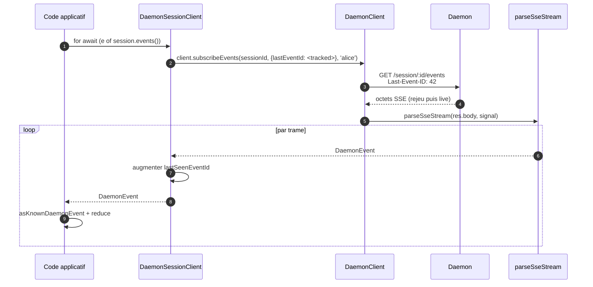
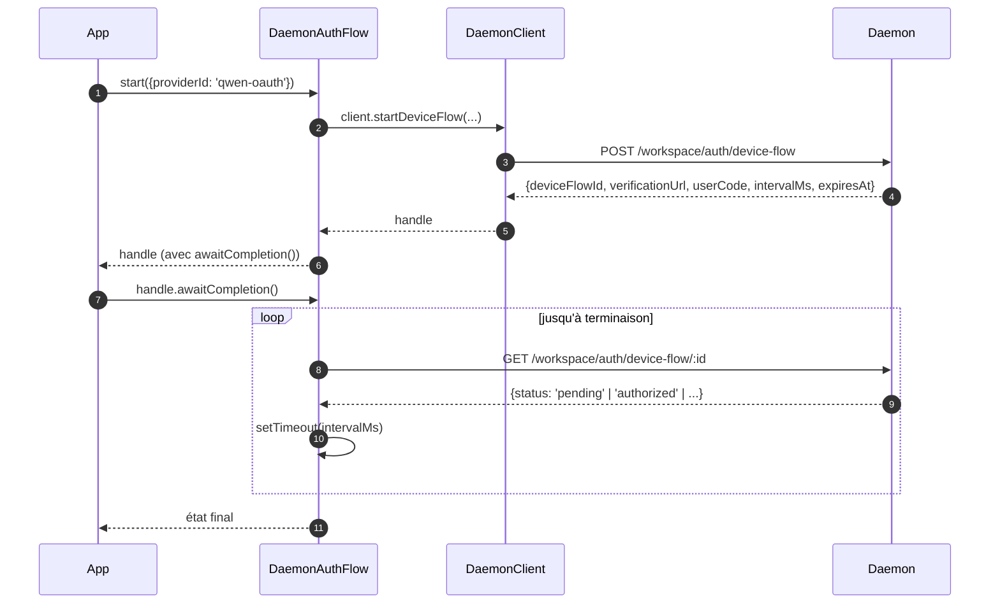

# Client SDK TypeScript Daemon

## Présentation générale

`packages/sdk-typescript/src/daemon/` est le **client daemon du SDK TypeScript**. C'est la méthode canonique pour se connecter à un daemon `qwen serve` en cours d'exécution depuis n'importe quel hôte TypeScript / JavaScript (l'adaptateur TUI du CLI lui-même, les bots de canal, le compagnon IDE VS Code, les scripts personnalisés et les backends web côté serveur). Tous les autres adaptateurs en dépendent.

La structure du paquet est intentionnellement réduite :

| Fichier                   | Surface                                                                                                                                                                                              |
| ------------------------- | ---------------------------------------------------------------------------------------------------------------------------------------------------------------------------------------------------- |
| `index.ts`                | Baril public (`DaemonClient`, `DaemonSessionClient`, `DaemonAuthFlow`, `parseSseStream`, réducteurs d'événements, types).                                                                             |
| `DaemonClient.ts`         | Façade HTTP/SSE bas niveau — une méthode par route du `qwen-serve-protocol.md`.                                                                                                                       |
| `DaemonSessionClient.ts`  | Wrapper avec scope de session et suivi de rejeu SSE.                                                                                                                                                 |
| `DaemonAuthFlow.ts`       | Helper haut niveau pour le flux OAuth device.                                                                                                                                                        |
| `sse.ts`                  | `parseSseStream` (analyseur de trames NDJSON / SSE).                                                                                                                                                 |
| `events.ts`               | `asKnownDaemonEvent`, `reduceDaemonSessionEvent`, `reduceDaemonAuthEvent` (voir [`09-event-schema.md`](./09-event-schema.md)).                                                                       |
| `types.ts`                | `DaemonCapabilities`, `DaemonSession`, `DaemonEvent`, `PermissionResponse`, `PromptResult`, types MCP / agent / mémoire / auth.                                                                      |

L'exemple pas à pas se trouve à [`../examples/daemon-client-quickstart.md`](../examples/daemon-client-quickstart.md) ; ce document est la référence d'architecture et de contrat.

## Responsabilités

- Fournir une méthode TypeScript par route HTTP du daemon.
- Apposer correctement le bearer token + `X-Qwen-Client-Id` sur chaque requête.
- Composer les timeouts par appel avec le `AbortSignal` fourni par l'appelant (sans tuer les SSE longue durée).
- Diffuser et analyser les trames SSE en `DaemonEvent`s typés.
- Suivre `lastSeenEventId` par session pour que les reconnexions rejouent correctement.
- Exposer une surface d'authentification par flux device qui interroge selon les intervalles fournis par le daemon.

## Architecture

### `DaemonClient` (`DaemonClient.ts`)

Constructeur :

```ts
new DaemonClient({
  baseUrl: string,                  // défaut 'http://127.0.0.1:4170'
  token?: string,
  fetch?: typeof globalThis.fetch,  // injectable pour les tests
  fetchTimeoutMs?: number,          // 0 = désactivé ; défaut DEFAULT_FETCH_TIMEOUT_MS
});
```

Groupes de méthodes (chaque méthode prend un `clientId` optionnel pour apposer `X-Qwen-Client-Id`) :

| Groupe                | Méthodes                                                                                                                                                                                                                              |
| --------------------- | ------------------------------------------------------------------------------------------------------------------------------------------------------------------------------------------------------------------------------------- |
| Infrastructure        | `health()`, `capabilities()`, `auth` (accesseur paresseux `DaemonAuthFlow`)                                                                                                                                                            |
| Sessions              | `createOrAttachSession`, `loadSession`, `resumeSession`, `listSessions`, `closeSession`, `setSessionMetadata`, `getSessionContext`, `getSessionSupportedCommands`, `setSessionApprovalMode`, `setSessionModel`                          |
| Invites               | `prompt`, `cancel`, `heartbeat`                                                                                                                                                                                                       |
| Événements            | `subscribeEvents` (générateur SSE), `subscribeEventsStream` (réponse brute)                                                                                                                                                           |
| Permissions           | `respondToPermission`, `respondToSessionPermission`                                                                                                                                                                                   |
| Instantanés workspace | `getWorkspaceMcp`, `getWorkspaceSkills`, `getWorkspaceProviders`, `getWorkspaceEnv`, `getWorkspacePreflight`                                                                                                                          |
| Mutations workspace   | `writeWorkspaceMemory`, `readWorkspaceMemory`, `listWorkspaceAgents`, `getWorkspaceAgent`, `createWorkspaceAgent`, `updateWorkspaceAgent`, `deleteWorkspaceAgent`, `toggleWorkspaceTool`, `restartMcpServer`, `initializeWorkspace` |
| Fichiers              | `readFile`, `readFileBytes`, `writeFile`, `editFile`, `listDirectory`, `globPaths`, `statPath`                                                                                                                                        |
| Auth                  | `startDeviceFlow`, `pollDeviceFlow`, `cancelDeviceFlow`, `getAuthStatus`                                                                                                                                                              |

### `fetchWithTimeout`

Chaque requête passe par `fetchWithTimeout`. Détails critiques :

- **La lecture du corps est dans la portée du timer.** Les implémentations précédentes effaçaient le timer à l'arrivée des en-têtes ; si un proxy stallait au milieu du corps, `await res.json()` pouvait bloquer au-delà de `fetchTimeoutMs`. La forme actuelle passe le code de lecture du corps comme un callback afin que le timer couvre à la fois l'arrivée des en-têtes ET la consommation du corps.
- **`perCallTimeoutMs`** permet à un seul appel de remplacer le timeout par défaut du client. L'appelant le plus visible est `restartMcpServer` : le SDK utilise `MCP_RESTART_DEFAULT_TIMEOUT_MS = 330_000` (5 min 30 s). Le `MCP_RESTART_TIMEOUT_MS` propre au daemon est exactement 300 s ; si le client correspondait à cette valeur, un redémarrage qui se termine près de 300 s pourrait perdre la course pendant que le daemon sérialise et envoie sa réponse structurée, provoquant une fausse `TimeoutError`. Les 30 s supplémentaires couvrent la sérialisation, le transfert réseau et le décodage des deux côtés. Les appelants qui ont besoin d’un budget plus serré peuvent passer `timeoutMs`; passer `0` désactive le timeout.
- **`AbortSignal.any`** compose le signal fourni par l'appelant avec le signal du timer par appel, de sorte que l'annulation par l'appelant et le timeout par appel se terminent proprement.
- **`AbortController` + `setTimeout` annulable** au lieu de `AbortSignal.timeout()` afin que les requêtes à résolution rapide ne laissent pas de timers en attente sur la boucle d'événements. Le timer est effacé dans `finally`.
- **Les points de terminaison de streaming (`subscribeEvents`) contournent le timeout** — les SSE longue durée ne doivent pas être tués par celui-ci.

### `DaemonSessionClient` (`DaemonSessionClient.ts`)

Lie une session et suit automatiquement `lastSeenEventId` afin que le rejeu SSE et la reconnexion fonctionnent sans état supplémentaire de l'appelant.

```ts
class DaemonSessionClient {
  readonly client: DaemonClient;
  readonly session: DaemonSession;
  readonly state: DaemonSessionState;
  private lastSeenEventId: number | undefined;

  static createOrAttach(client, req?): Promise<DaemonSessionClient>;
  static load(client, sessionId, req?): Promise<DaemonSessionClient>;
  static resume(client, sessionId, req?): Promise<DaemonSessionClient>;

  events(opts?: DaemonSessionSubscribeOptions): AsyncIterable<DaemonEvent>;
  prompt(req: PromptRequest): Promise<PromptResult>;
  cancel(): Promise<void>;
  respondToPermission(...): Promise<PermissionResponse>;
  setModel(modelServiceId): Promise<SetModelResult>;
  heartbeat(): Promise<HeartbeatResult>;
  setMetadata(metadata): Promise<SessionMetadataResult>;
  close(): Promise<void>;
}
```

`events()` fait office de proxy pour `client.subscribeEvents` avec `resume: true` par défaut — il transmet le `lastSeenEventId` suivi afin que les reconnexions rejouent à partir de l'endroit où l'abonnement précédent s'est arrêté. Chaque événement produit augmente `lastSeenEventId`.

### `DaemonAuthFlow` (`DaemonAuthFlow.ts`)

```ts
class DaemonAuthFlow {
  start(opts: { providerId, ... }): Promise<DaemonAuthFlowHandle>;
}
interface DaemonAuthFlowHandle {
  deviceFlowId: string;
  providerId: string;
  expiresAt: string;
  verificationUrl: string;
  userCode: string;
  awaitCompletion(opts?): Promise<DaemonAuthDeviceFlowState>;
  cancel(): Promise<void>;
}
```

`awaitCompletion()` interroge `GET /workspace/auth/device-flow/:id` à l'`intervalMs` fourni par le daemon jusqu'à ce que le flux devienne `authorized`, `failed` ou `cancelled`. Il est construit paresseusement via `client.auth` afin que les clients qui n'utilisent jamais l'authentification n'aient aucun coût d'allocation.

### `parseSseStream` (`sse.ts`)

Transforme un `Response.body` (`ReadableStream<Uint8Array>`) en `AsyncIterable<DaemonEvent>`. Gère :

- Le tramage LF et CRLF.
- La limite de dépassement de tampon (16 Mio) — limite défensive contre un daemon émettant une seule trame anormalement grande.
- Le câblage `AbortSignal` — l'abandon ferme le flux et l'itérateur.
- Les trames ne contenant que des commentaires et les types d'événements inconnus (transmis en tant que `DaemonEvent` ; les consommateurs du SDK affinent en aval via `asKnownDaemonEvent`).

### Types (`types.ts`)

Exportations notables : `DaemonCapabilities`, `DaemonSession` (`{ sessionId, workspaceCwd, attached, clientId?, createdAt? }`), `DaemonEvent`, `DaemonSessionState`, `DaemonSessionContextStatus`, `DaemonSessionSupportedCommandsStatus`, `PermissionResponse`, `PromptResult`, `HeartbeatResult`, `SetModelResult`, `SessionMetadataResult`, ainsi que les types de résultats MCP / agent / mémoire / auth.

## Workflow

### Créer-ou-attacher + première invite


### Abonnement avec rejeu



### Authentification par flux device



`qwen-oauth` est l'identifiant de fournisseur hérité v1. Le niveau gratuit de l'authentification OAuth Qwen a été interrompu le 2026-04-15. Les nouveaux clients doivent donc privilégier un fournisseur d'authentification actuellement pris en charge lorsque cela est possible.

## État et cycle de vie

- `DaemonClient` est sans connexion ; rien ne se passe à la construction. Chaque méthode ouvre un nouveau `fetch`.
- `DaemonSessionClient` conserve `lastSeenEventId` entre les appels à `events()` ; les reconnexions rejouent à partir du dernier vu.
- `DaemonAuthFlow` est paresseux — `client.auth` le construit au premier accès.
- L'itérateur SSE se ferme lorsque (a) le daemon termine le flux, (b) `AbortSignal.abort()` est déclenché, (c) le consommateur sort du `for await`, ou (d) la limite de dépassement de tampon (16 Mio) est atteinte.

## Dépendances

- `globalThis.fetch` (intégré Node 18+, navigateur, undici, etc.). Injectable par `DaemonClient` pour les tests.
- `AbortController` / `AbortSignal.any` / `setTimeout` natifs.
- Aucune dépendance transitive envers `@qwen-code/qwen-code-core` ou `@qwen-code/acp-bridge` — le paquet SDK est totalement découplé afin que les consommateurs externes n'importent pas les internes du daemon.

## Sous-paquet `ui/*` ([#4328](https://github.com/QwenLM/qwen-code/pull/4328) + [#4353](https://github.com/QwenLM/qwen-code/pull/4353))

Le SDK exporte également `packages/sdk-typescript/src/daemon/ui/`, un ensemble
de primitives neutres par rapport à l'hôte qui transforment les événements du
daemon en blocs de transcription :

- `normalizeDaemonEvent(evt)` fait correspondre les 43 événements filaires connus du daemon en 37 valeurs `DaemonUiEventType` adaptées à l'interface utilisateur ; les événements non modélisés ou mal formés sont normalisés en `debug`.
- `createDaemonTranscriptState()` plus `reduceDaemonTranscriptEvents(state, events)` projette les événements UI en `DaemonTranscriptBlock[]`.
- `createDaemonTranscriptStore()` encapsule subscribe / dispatch.
- `render.ts` / `terminal.ts` fournissent des moteurs de rendu HTML et terminal de base, tandis que `toolPreview.ts` produit des résumés d'appels d'outils.
- Les sélecteurs incluent `selectTranscriptBlocksOrderedByEventId`, `selectPendingPermissionBlocks`, `selectCurrentTool`, `selectApprovalMode`, `selectToolProgress`, `selectSubagentChildBlocks`, `formatMissedRange` et `formatBlockTimestamp`.
- Les constantes publiques incluent `DAEMON_PLAN_TOOL_CALL_ID`.
- `conformance.ts` contient la suite de tests de cohérence inter-hôtes.

Le premier consommateur en production est `packages/webui/src/daemon/` via le
`DaemonSessionProvider` de React. Voir [`14-cli-tui-adapter.md`](./14-cli-tui-adapter.md)
pour l'architecture détaillée, le glossaire, la table des sélecteurs et la relation avec
l'ancien `DaemonTuiAdapter`.

Le sous-paquet est exporté depuis le sous-chemin `@qwen-code/sdk/daemon`. Le
code existant qui fait `import { DaemonClient }` n'est pas affecté.

## Configuration

| Réglage              | Où                                    | Effet                                                                                              |
| -------------------- | ------------------------------------- | -------------------------------------------------------------------------------------------------- |
| `baseUrl`            | Constructeur `DaemonClient`           | URL du daemon ; les barres obliques finales sont supprimées.                                       |
| `token`              | Constructeur `DaemonClient`           | Apposé comme `Authorization: Bearer`.                                                              |
| `fetch`              | Constructeur `DaemonClient`           | Point d'injection pour les tests.                                                                  |
| `fetchTimeoutMs`     | Constructeur `DaemonClient`           | Timeout par appel ; `0` = désactivé.                                                               |
| `clientId`           | Argument optionnel par méthode        | En-tête `X-Qwen-Client-Id` (voir [`08-session-lifecycle.md`](./08-session-lifecycle.md)).          |
| `lastEventId`        | Constructeur `DaemonSessionClient`    | Curseur de rejeu initial.                                                                          |
| `maxQueued`          | Option par abonnement                 | `?maxQueued=N` pour la route SSE ; vérifier d'abord `caps.features.slow_client_warning` en amont. |
| `perCallTimeoutMs`   | Par méthode (ex. `restartMcpServer`)  | Remplace le timeout global du client.                                                              |

## Mises en garde et limites connues

- **`fetchTimeoutMs` est par appel, pas au niveau de la connexion.** Les longues lectures du corps partagent le timer. Un daemon qui diffuse des réponses doit remplacer le timeout par appel ou le définir à `0`.
- **Le SSE contourne le timeout fetch** — les connexions SSE longue durée ne sont pas tuées par `fetchTimeoutMs`. Utilisez `AbortSignal` pour une annulation contrôlée par l'appelant.
- **La limite de tampon de `parseSseStream` est de 16 Mio** comme limite défensive. Une trame unique plus grande que cela abandonne l'itérateur (le daemon n'émet jamais légitimement de telles trames).
- **`asKnownDaemonEvent` renvoie `undefined` pour les types d'événements non reconnus.** Les consommateurs du SDK doivent gérer cette branche plutôt que de supposer que l'union est exhaustive ; c'est le contrat de compatibilité ascendante. Les événements non reconnus incrémentent `DaemonSessionViewState.unrecognizedKnownEventCount`.
- **`client_evicted`, `slow_client_warning`, `stream_error` ne sont pas dans l'anneau de rejeu.** Se reconnecter après une expulsion reprend à partir de l'anneau du daemon ; vous ne verrez pas à nouveau la trame d'expulsion.
- **`DaemonClient` ne réessaie pas automatiquement.** Les échecs réseau sont signalés par des rejets ; la stratégie de reconnexion/rejeu est la responsabilité de l'appelant (`DaemonSessionClient.events()` facilite le rejeu mais la reconnexion reste par appel).

## Références

- `packages/sdk-typescript/src/daemon/DaemonClient.ts`
- `packages/sdk-typescript/src/daemon/DaemonSessionClient.ts`
- `packages/sdk-typescript/src/daemon/DaemonAuthFlow.ts`
- `packages/sdk-typescript/src/daemon/sse.ts`
- `packages/sdk-typescript/src/daemon/events.ts`
- `packages/sdk-typescript/src/daemon/types.ts`
- Exemple pas à pas complet : [`../examples/daemon-client-quickstart.md`](../examples/daemon-client-quickstart.md).