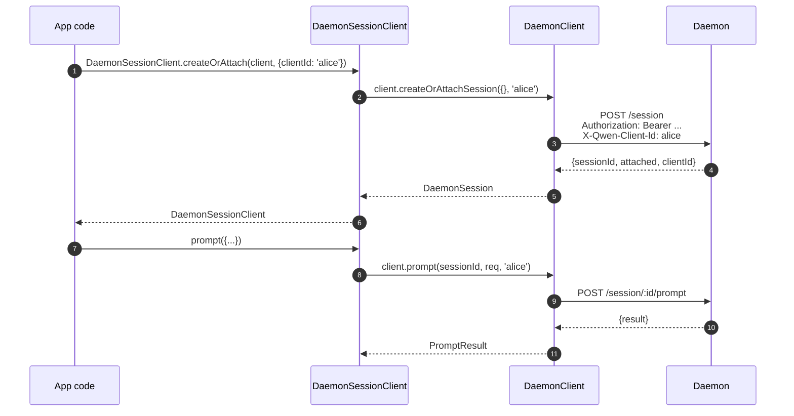
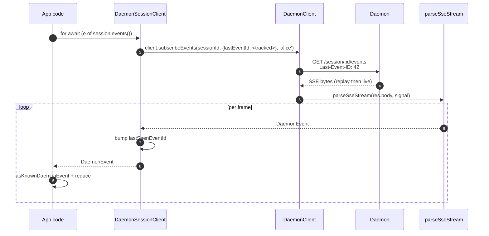
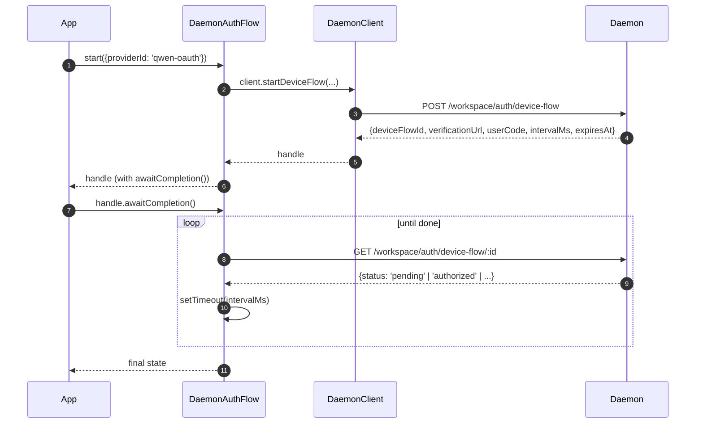

# Client Daemon du SDK TypeScript

## Vue d'ensemble

`packages/sdk-typescript/src/daemon/` est le **client daemon du SDK TypeScript**. C'est la manière canonique de se connecter à un daemon `qwen serve` en cours d'exécution depuis n'importe quel hôte TypeScript / JavaScript (l'adaptateur TUI du CLI lui-même, les backends de bots de salon, le compagnon IDE VS Code, les scripts personnalisés et les backends web côté serveur). Tous les autres adaptateurs en dépendent.

La structure du paquet est intentionnellement petite :

| Fichier                 | Surface                                                                                                                                                                                                                             |
| ----------------------- | ----------------------------------------------------------------------------------------------------------------------------------------------------------------------------------------------------------------------------------- |
| `index.ts`              | Baril public (`DaemonClient`, `DaemonSessionClient`, `DaemonAuthFlow`, `parseSseStream`, réducteurs d'événements, types).                                                                                                            |
| `DaemonClient.ts`       | Façade HTTP/SSE bas niveau — une méthode par route de `qwen-serve-protocol.md`.                                                                                                                                                     |
| `DaemonSessionClient.ts`| Wrapper limité à une session avec suivi de rejeu SSE.                                                                                                                                                                               |
| `DaemonAuthFlow.ts`     | Assistant OAuth de haut niveau pour le flux d'appareil.                                                                                                                                                                             |
| `sse.ts`                | `parseSseStream` (analyseur de trames NDJSON / SSE).                                                                                                                                                                                |
| `events.ts`             | `asKnownDaemonEvent`, `reduceDaemonSessionEvent`, `reduceDaemonAuthEvent` (voir [`09-event-schema.md`](./09-event-schema.md)).                                                                                                       |
| `types.ts`              | `DaemonCapabilities`, `DaemonSession`, `DaemonEvent`, `PermissionResponse`, `PromptResult`, types MCP / agent / mémoire / auth.                                                                                                      |

L'exemple pas à pas se trouve dans [`../examples/daemon-client-quickstart.md`](../examples/daemon-client-quickstart.md) ; ce document est la référence d'architecture et de contrat.

## Responsabilités

- Fournir une méthode TypeScript par route HTTP du daemon.
- Apposer correctement le jeton Bearer + `X-Qwen-Client-Id` sur chaque requête.
- Composer des délais d'attente par appel avec `AbortSignal` fourni par l'appelant (sans interrompre les SSE longue durée).
- Diffuser et analyser les trames SSE en `DaemonEvent` typés.
- Suivre `lastSeenEventId` par session pour que les reconnexions rejouent correctement.
- Exposer une surface d'authentification par flux d'appareil qui interroge à intervalles fournis par le daemon.

## Architecture

### `DaemonClient` (`DaemonClient.ts`)

Constructeur :

```ts
new DaemonClient({
  baseUrl: string,                  // par défaut 'http://127.0.0.1:4170'
  token?: string,
  fetch?: typeof globalThis.fetch,  // injectable pour les tests
  fetchTimeoutMs?: number,          // 0 = désactivé ; par défaut DEFAULT_FETCH_TIMEOUT_MS
});
```

Groupes de méthodes (chaque méthode accepte un `clientId` optionnel pour apposer `X-Qwen-Client-Id`) :

| Groupe                        | Méthodes                                                                                                                                                                                                                             |
| ----------------------------- | ----------------------------------------------------------------------------------------------------------------------------------------------------------------------------------------------------------------------------------- |
| Plomberie                     | `health()`, `capabilities()`, `auth` (accesseur paresseux `DaemonAuthFlow`)                                                                                                                                                         |
| Sessions                      | `createOrAttachSession`, `loadSession`, `resumeSession`, `listSessions`, `closeSession`, `setSessionMetadata`, `getSessionContext`, `getSessionSupportedCommands`, `setSessionApprovalMode`, `setSessionModel`                      |
| Invites                       | `prompt`, `cancel`, `heartbeat`                                                                                                                                                                                                     |
| Événements                    | `subscribeEvents` (générateur SSE), `subscribeEventsStream` (réponse brute)                                                                                                                                                          |
| Permissions                   | `respondToPermission`, `respondToSessionPermission`                                                                                                                                                                                  |
| Instantanés d'espace de travail| `getWorkspaceMcp`, `getWorkspaceSkills`, `getWorkspaceProviders`, `getWorkspaceEnv`, `getWorkspacePreflight`                                                                                                                         |
| Mutations d'espace de travail | `writeWorkspaceMemory`, `readWorkspaceMemory`, `listWorkspaceAgents`, `getWorkspaceAgent`, `createWorkspaceAgent`, `updateWorkspaceAgent`, `deleteWorkspaceAgent`, `toggleWorkspaceTool`, `restartMcpServer`, `initializeWorkspace` |
| Fichiers                      | `readFile`, `readFileBytes`, `writeFile`, `editFile`, `listDirectory`, `globPaths`, `statPath`                                                                                                                                      |
| Authentification              | `startDeviceFlow`, `pollDeviceFlow`, `cancelDeviceFlow`, `getAuthStatus`                                                                                                                                                            |
### `fetchWithTimeout`

Toutes les requêtes passent par `fetchWithTimeout`. Détails importants :

- **La lecture du corps est dans la portée du minuteur.** Les implémentations précédentes effaçaient le minuteur lorsque les en-têtes arrivaient ; si un proxy bloquait au milieu du corps, `await res.json()` pouvait rester bloqué au-delà de `fetchTimeoutMs`. La forme actuelle passe le code de lecture du corps en tant que callback afin que le minuteur couvre à la fois l'arrivée des en-têtes ET la consommation du corps.
- **`perCallTimeoutMs`** permet à un seul appel de remplacer la valeur par défaut du client. L'appelant le plus visible est `restartMcpServer` : le SDK utilise `MCP_RESTART_DEFAULT_TIMEOUT_MS = 330_000` (5 min 30s). Le `MCP_RESTART_TIMEOUT_MS` propre au daemon est exactement de 300s ; si le client correspondait à cette valeur, un redémarrage qui se termine près de 300s pourrait perdre la course pendant que le daemon sérialise et envoie sa réponse structurée, provoquant une `TimeoutError` faussement positive. Les 30s supplémentaires couvrent la sérialisation, le transfert réseau et le décodage des deux côtés. Les appelants qui ont besoin d'un budget plus serré peuvent passer `timeoutMs` ; passer `0` désactive le délai d'attente.
- **`AbortSignal.any`** compose le signal fourni par l'appelant avec le signal du minuteur par appel, de sorte que l'annulation de l'appelant et le délai d'attente par appel soient tous deux annulés proprement.
- **`AbortController` + `setTimeout` annulable** au lieu de `AbortSignal.timeout()` afin que les requêtes à résolution rapide ne laissent pas de minuteurs en attente sur la boucle d'événements. Le minuteur est effacé dans `finally`.
- **Les endpoints de streaming (`subscribeEvents`) contournent le délai d'attente** — les SSE de longue durée ne doivent pas être interrompus par celui-ci.

### `DaemonSessionClient` (`DaemonSessionClient.ts`)

Lie une session et suit automatiquement `lastSeenEventId` afin que la relecture SSE et la reconnexion fonctionnent sans état supplémentaire de l'appelant.

```ts
class DaemonSessionClient {
  readonly client: DaemonClient;
  readonly session: DaemonSession;
  readonly state: DaemonSessionState;
  private lastSeenEventId: number | undefined;

  static createOrAttach(client, req?): Promise<DaemonSessionClient>;
  static load(client, sessionId, req?): Promise<DaemonSessionClient>;
  static resume(client, sessionId, req?): Promise<DaemonSessionClient>;

  events(opts?: DaemonSessionSubscribeOptions): AsyncIterable<DaemonEvent>;
  prompt(req: PromptRequest): Promise<PromptResult>;
  cancel(): Promise<void>;
  respondToPermission(...): Promise<PermissionResponse>;
  setModel(modelServiceId): Promise<SetModelResult>;
  heartbeat(): Promise<HeartbeatResult>;
  setMetadata(metadata): Promise<SessionMetadataResult>;
  close(): Promise<void>;
}
```

`events()` est un proxy pour `client.subscribeEvents` avec `resume: true` par défaut — il passe le `lastSeenEventId` suivi afin que les reconnexions rejouent à partir de l'endroit où l'abonnement précédent s'est arrêté. Chaque événement généré incrémente `lastSeenEventId`.

### `DaemonAuthFlow` (`DaemonAuthFlow.ts`)

```ts
class DaemonAuthFlow {
  start(opts: { providerId, ... }): Promise<DaemonAuthFlowHandle>;
}
interface DaemonAuthFlowHandle {
  deviceFlowId: string;
  providerId: string;
  expiresAt: string;
  verificationUrl: string;
  userCode: string;
  awaitCompletion(opts?): Promise<DaemonAuthDeviceFlowState>;
  cancel(): Promise<void>;
}
```

`awaitCompletion()` interroge `GET /workspace/auth/device-flow/:id` à l'`intervalMs` fourni par le daemon jusqu'à ce que le flux devienne `authorized`, `failed` ou `cancelled`. Il est construit paresseusement via `client.auth` afin que les clients qui n'utilisent jamais l'authentification n'encourent aucun coût d'allocation.

### `parseSseStream` (`sse.ts`)

Transforme un `Response.body` (`ReadableStream<Uint8Array>`) en `AsyncIterable<DaemonEvent>`. Gère :

- Le découpage LF et CRLF.
- Limite de débordement de tampon (16 Mio) — borne défensive contre un daemon émettant une seule trame absurdement grande.
- Câblage d'`AbortSignal` — l'abandon ferme le flux et l'itérateur.
- Trames contenant uniquement des commentaires et types d'événements inconnus (transmis tels quels en tant que `DaemonEvent` ; les consommateurs du SDK affinent en aval via `asKnownDaemonEvent`).

### Types (`types.ts`)

Exportations notables : `DaemonCapabilities`, `DaemonSession` (`{ sessionId, workspaceCwd, attached, clientId?, createdAt? }`), `DaemonEvent`, `DaemonSessionState`, `DaemonSessionContextStatus`, `DaemonSessionSupportedCommandsStatus`, `PermissionResponse`, `PromptResult`, `HeartbeatResult`, `SetModelResult`, `SessionMetadataResult`, ainsi que les types de résultats MCP / agent / mémoire / authentification.

## Workflow

### Create-or-attach + first prompt



### Subscribe with replay


### Authentification par flux d'appareil



`qwen-oauth` est l'identifiant du fournisseur hérité v1. L'offre gratuite Qwen OAuth a été interrompue le 15 avril 2026, donc les nouveaux clients devraient préférer un fournisseur d'authentification actuellement pris en charge lorsqu'il est disponible.

## État et cycle de vie

- `DaemonClient` est sans connexion ; rien ne se passe à la construction. Chaque méthode ouvre une nouvelle `fetch`.
- `DaemonSessionClient` conserve `lastSeenEventId` entre les appels de `events()` ; les reconnexions rejouent à partir du dernier événement vu.
- `DaemonAuthFlow` est paresseux — `client.auth` le construit au premier accès.
- L'itérateur SSE se ferme lorsque (a) le daemon termine le flux, (b) `AbortSignal.abort()` est déclenché, (c) le consommateur sort du `for await`, ou (d) la limite de saturation du tampon (16 Mio) est atteinte.

## Dépendances

- `globalThis.fetch` (intégré Node 18+, navigateur, undici, etc.). Injectable par `DaemonClient` pour les tests.
- `AbortController` / `AbortSignal.any` / `setTimeout` natifs.
- Aucune dépendance transitive envers `@qwen-code/qwen-code-core` ou `@qwen-code/acp-bridge` — le paquet SDK est complètement découplé afin que les consommateurs externes n'importent pas les internes du daemon.

## Sous-package `ui/*` ([#4328](https://github.com/QwenLM/qwen-code/pull/4328) + [#4353](https://github.com/QwenLM/qwen-code/pull/4353))

Le SDK exporte également `packages/sdk-typescript/src/daemon/ui/`, un ensemble de primitives neutres vis-à-vis de l'hôte qui transforment les événements du daemon en blocs de transcription :

- `normalizeDaemonEvent(evt)` associe les 43 événements filaires connus du daemon à 37 valeurs `DaemonUiEventType` adaptées à l'interface ; les événements non modélisés ou mal formés sont normalisés en `debug`.
- `createDaemonTranscriptState()` plus `reduceDaemonTranscriptEvents(state, events)` projette les événements UI dans `DaemonTranscriptBlock[]`.
- `createDaemonTranscriptStore()` encapsule subscribe / dispatch.
- `render.ts` / `terminal.ts` fournissent des rendus HTML et terminal de base, tandis que `toolPreview.ts` produit des résumés d'appels d'outils.
- Les sélecteurs incluent `selectTranscriptBlocksOrderedByEventId`, `selectPendingPermissionBlocks`, `selectCurrentTool`, `selectApprovalMode`, `selectToolProgress`, `selectSubagentChildBlocks`, `formatMissedRange` et `formatBlockTimestamp`.
- Les constantes publiques incluent `DAEMON_PLAN_TOOL_CALL_ID`.
- `conformance.ts` contient la suite de tests de cohérence inter-hôtes.

Le premier consommateur en production est `packages/webui/src/daemon/` via le `DaemonSessionProvider` de React. Voir [`14-cli-tui-adapter.md`](./14-cli-tui-adapter.md) pour l'architecture détaillée, le glossaire, le tableau des sélecteurs et la relation avec l'ancien `DaemonTuiAdapter`.

Le sous-package est exporté depuis le sous-chemin `@qwen-code/sdk/daemon`. Le code existant qui fait `import { DaemonClient }` n'est pas affecté.

## Configuration

| Option                | Emplacement                        | Effet                                                                                                  |
| --------------------- | ---------------------------------- | ------------------------------------------------------------------------------------------------------ |
| `baseUrl`             | Constructeur de `DaemonClient`     | URL du daemon ; les barres obliques de fin sont supprimées.                                            |
| `token`               | Constructeur de `DaemonClient`     | Apposé comme `Authorization: Bearer`.                                                                  |
| `fetch`               | Constructeur de `DaemonClient`     | Point d'injection de test.                                                                             |
| `fetchTimeoutMs`      | Constructeur de `DaemonClient`     | Délai d'attente par appel ; `0` = désactivé.                                                           |
| `clientId`            | Argument optionnel par méthode     | En-tête `X-Qwen-Client-Id` (voir [`08-session-lifecycle.md`](./08-session-lifecycle.md)).              |
| `lastEventId`         | Constructeur de `DaemonSessionClient` | Curseur de rejeu d'amorçage.                                                                         |
| `maxQueued`           | Option par abonnement              | `?maxQueued=N` pour la route SSE ; pré-vérifier d'abord `caps.features.slow_client_warning`.           |
| `perCallTimeoutMs`    | Par méthode (ex. `restartMcpServer`) | Remplace le délai d'attente global du client.                                                        |

## Mises en garde et limitations connues

- **`fetchTimeoutMs` est par appel, pas au niveau connexion.** Les longues lectures du corps partagent le même minuteur. Un daemon qui diffuse des réponses en flux doit remplacer le délai d'attente par appel ou le mettre à `0`.
- **Le SSE contourne le délai d'attente fetch** — les longues connexions SSE ne sont pas interrompues par `fetchTimeoutMs`. Utilisez `AbortSignal` pour une annulation contrôlée par l'appelant.
- **La limite du tampon de `parseSseStream` est de 16 Mio** comme borne défensive. Une trame unique plus grande que cela interrompt l'itérateur (le daemon n'émet jamais légitimement de telles trames).
- **`asKnownDaemonEvent` renvoie `undefined` pour les types d'événements non reconnus.** Les consommateurs du SDK doivent gérer cette branche plutôt que de supposer que l'union est exhaustive ; c'est le contrat de compatibilité ascendante. Les événements non reconnus incrémentent `DaemonSessionViewState.unrecognizedKnownEventCount`.
- **`client_evicted`, `slow_client_warning`, `stream_error` ne sont pas dans l'anneau de rejeu.** Se reconnecter après une éviction reprend à partir de l'anneau du daemon ; vous ne reverrez pas la trame d'éviction.
- **`DaemonClient` ne réessaie pas automatiquement.** Les échecs réseau se manifestent par des rejets ; la stratégie de reconnexion/rejeu est la responsabilité de l'appelant (`DaemonSessionClient.events()` facilite le rejeu mais la reconnexion reste par appel).
## Références

- `packages/sdk-typescript/src/daemon/DaemonClient.ts`
- `packages/sdk-typescript/src/daemon/DaemonSessionClient.ts`
- `packages/sdk-typescript/src/daemon/DaemonAuthFlow.ts`
- `packages/sdk-typescript/src/daemon/sse.ts`
- `packages/sdk-typescript/src/daemon/events.ts`
- `packages/sdk-typescript/src/daemon/types.ts`
- Guide pas à pas complet : [`../examples/daemon-client-quickstart.md`](../examples/daemon-client-quickstart.md).
