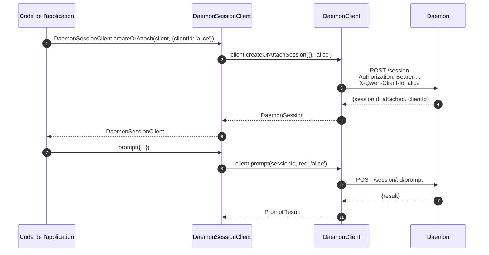
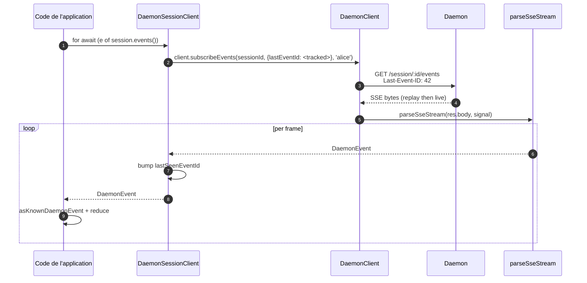
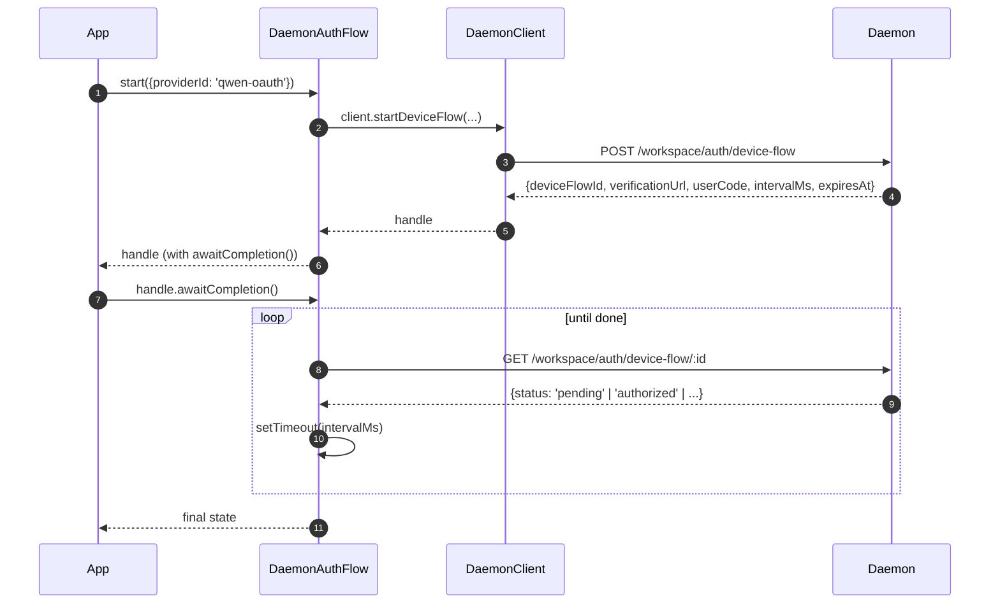

# Client Daemon du SDK TypeScript

## Vue d'ensemble

`packages/sdk-typescript/src/daemon/` est le **client daemon du SDK TypeScript**. C'est la méthode canonique pour se connecter à un daemon `qwen serve` en cours d'exécution depuis n'importe quel hôte TypeScript / JavaScript (l'adaptateur TUI de la CLI, les backends de bots de canal, le compagnon IDE VS Code, les scripts personnalisés et les backends web côté serveur). Tous les autres adaptateurs en dépendent.

La structure du package est volontairement minimaliste :

| Fichier                  | Surface                                                                                                                        |
| ------------------------ | ------------------------------------------------------------------------------------------------------------------------------ |
| `index.ts`               | Barrel public (`DaemonClient`, `DaemonSessionClient`, `DaemonAuthFlow`, `parseSseStream`, réducteurs d'événements, types).     |
| `DaemonClient.ts`        | Facade HTTP/SSE bas niveau — une méthode par route de `qwen-serve-protocol.md`.                                                |
| `DaemonSessionClient.ts` | Wrapper limité à la session avec suivi de la relecture SSE.                                                                    |
| `DaemonAuthFlow.ts`      | Assistant haut niveau pour le device-flow OAuth.                                                                               |
| `sse.ts`                 | `parseSseStream` (parseur de tramage NDJSON / SSE).                                                                            |
| `events.ts`              | `asKnownDaemonEvent`, `reduceDaemonSessionEvent`, `reduceDaemonAuthEvent` (voir [`09-event-schema.md`](./09-event-schema.md)). |
| `types.ts`               | `DaemonCapabilities`, `DaemonSession`, `DaemonEvent`, `PermissionResponse`, `PromptResult`, types MCP / agent / mémoire / auth. |

L'exemple de guide pratique se trouve dans [`../examples/daemon-client-quickstart.md`](../examples/daemon-client-quickstart.md) ; ce document est la référence de l'architecture et du contrat.

## Responsabilités

- Fournir une méthode TypeScript par route HTTP du daemon.
- Appliquer correctement le bearer token et le header `X-Qwen-Client-Id` sur chaque requête.
- Composer les timeouts par appel avec l'`AbortSignal` fourni par l'appelant (sans interrompre les SSE de longue durée).
- Streamer et parser les trames SSE en `DaemonEvent` typés.
- Suivre le `lastSeenEventId` par session afin que les reconnexions rejouent correctement les événements.
- Exposer une API d'authentification par device-flow qui interroge (poll) à des intervalles fournis par le daemon.

## Architecture

### `DaemonClient` (`DaemonClient.ts`)

Constructeur :

```ts
new DaemonClient({
  baseUrl: string,                  // default 'http://127.0.0.1:4170'
  token?: string,
  fetch?: typeof globalThis.fetch,  // injectable for tests
  fetchTimeoutMs?: number,          // 0 = disabled; default DEFAULT_FETCH_TIMEOUT_MS
});
```

Groupes de méthodes (chaque méthode prend un `clientId` optionnel pour appliquer le header `X-Qwen-Client-Id`) :

| Groupe                | Méthodes                                                                                                                                                                                                                          |
| --------------------- | --------------------------------------------------------------------------------------------------------------------------------------------------------------------------------------------------------------------------------- |
| Plumbing              | `health()`, `capabilities()`, `auth` (accesseur lazy `DaemonAuthFlow`)                                                                                                                                                            |
| Sessions              | `createOrAttachSession`, `loadSession`, `resumeSession`, `listSessions`, `closeSession`, `setSessionMetadata`, `getSessionContext`, `getSessionSupportedCommands`, `setSessionApprovalMode`, `setSessionModel`                    |
| Prompting             | `prompt`, `cancel`, `heartbeat`                                                                                                                                                                                                   |
| Événements            | `subscribeEvents` (générateur SSE), `subscribeEventsStream` (réponse brute)                                                                                                                                                       |
| Permissions           | `respondToPermission`, `respondToSessionPermission`                                                                                                                                                                               |
| Snapshots de workspace| `getWorkspaceMcp`, `getWorkspaceSkills`, `getWorkspaceProviders`, `getWorkspaceEnv`, `getWorkspacePreflight`                                                                                                                      |
| Mutations de workspace| `writeWorkspaceMemory`, `readWorkspaceMemory`, `listWorkspaceAgents`, `getWorkspaceAgent`, `createWorkspaceAgent`, `updateWorkspaceAgent`, `deleteWorkspaceAgent`, `toggleWorkspaceTool`, `restartMcpServer`, `initializeWorkspace`|
| Fichiers              | `readFile`, `readFileBytes`, `writeFile`, `editFile`, `listDirectory`, `globPaths`, `statPath`                                                                                                                                    |
| Auth                  | `startDeviceFlow`, `pollDeviceFlow`, `cancelDeviceFlow`, `getAuthStatus`                                                                                                                                                          |

### `fetchWithTimeout`

Chaque requête passe par `fetchWithTimeout`. Détails critiques :

- **La lecture du body est dans le scope du timer.** Les implémentations précédentes annulaient le timer à la réception des headers ; si un proxy bloquait au milieu du body, `await res.json()` pouvait rester en attente au-delà de `fetchTimeoutMs`. La forme actuelle passe le code de lecture du body en callback afin que le timer couvre à la fois l'arrivée des headers ET la consommation du body.
- **`perCallTimeoutMs`** permet à un appel unique de surcharger le timeout par défaut du client. L'appelant le plus visible est `restartMcpServer` : le SDK utilise `MCP_RESTART_DEFAULT_TIMEOUT_MS = 330_000` (5 min 30s). Le `MCP_RESTART_TIMEOUT_MS` du daemon est exactement de 300s ; si le client utilisait cette même valeur, un redémarrage se terminant vers 300s pourrait perdre la course pendant que le daemon sérialise et envoie sa réponse structurée, provoquant une `TimeoutError` faussement positive. Les 30s supplémentaires couvrent la sérialisation, le transfert réseau et le décodage des deux côtés. Les appelants qui ont besoin d'un budget plus serré peuvent passer `timeoutMs` ; passer `0` désactive le timeout.
- **`AbortSignal.any`** compose le signal fourni par l'appelant avec le signal du timer par appel, afin que l'annulation par l'appelant et le timeout par appel interrompent proprement l'opération.
- **`AbortController` + `setTimeout` annulable** au lieu de `AbortSignal.timeout()` pour éviter que les requêtes à résolution rapide ne laissent des timers en attente dans l'event loop. Le timer est effacé dans le bloc `finally`.
- **Les endpoints de streaming (`subscribeEvents`) contournent le timeout** — les SSE de longue durée ne doivent pas être interrompues par celui-ci.

### `DaemonSessionClient` (`DaemonSessionClient.ts`)

Lie une session et suit automatiquement le `lastSeenEventId` afin que la relecture et la reconnexion SSE fonctionnent sans état supplémentaire côté appelant.

```ts
class DaemonSessionClient {
  readonly client: DaemonClient;
  readonly session: DaemonSession;
  readonly state: DaemonSessionState;
  private lastSeenEventId: number | undefined;

  static createOrAttach(client, req?): Promise<DaemonSessionClient>;
  static load(client, sessionId, req?): Promise<DaemonSessionClient>;
  static resume(client, sessionId, req?): Promise<DaemonSessionClient>;

  events(opts?: DaemonSessionSubscribeOptions): AsyncIterable<DaemonEvent>;
  prompt(req: PromptRequest): Promise<PromptResult>;
  cancel(): Promise<void>;
  respondToPermission(...): Promise<PermissionResponse>;
  setModel(modelServiceId): Promise<SetModelResult>;
  heartbeat(): Promise<HeartbeatResult>;
  setMetadata(metadata): Promise<SessionMetadataResult>;
  close(): Promise<void>;
}
```

`events()` proxyfie `client.subscribeEvents` avec `resume: true` par défaut — il passe le `lastSeenEventId` suivi afin que les reconnexions rejouent les événements depuis l'endroit où l'abonnement précédent s'est arrêté. Chaque événement généré incrémente le `lastSeenEventId`.

### `DaemonAuthFlow` (`DaemonAuthFlow.ts`)

```ts
class DaemonAuthFlow {
  start(opts: { providerId, ... }): Promise<DaemonAuthFlowHandle>;
}
interface DaemonAuthFlowHandle {
  deviceFlowId: string;
  providerId: string;
  expiresAt: string;
  verificationUrl: string;
  userCode: string;
  awaitCompletion(opts?): Promise<DaemonAuthDeviceFlowState>;
  cancel(): Promise<void>;
}
```

`awaitCompletion()` interroge (poll) `GET /workspace/auth/device-flow/:id` à l'intervalle `intervalMs` fourni par le daemon jusqu'à ce que le flux passe à `authorized`, `failed` ou `cancelled`. Il est construit paresseusement (lazy) via `client.auth` afin que les clients qui n'utilisent jamais l'authentification n'aient aucun coût d'allocation.

### `parseSseStream` (`sse.ts`)

Transforme un `Response.body` (`ReadableStream<Uint8Array>`) en `AsyncIterable<DaemonEvent>`. Gère :

- Le tramage LF et CRLF.
- La limite de débordement de buffer (16 MiB) — une borne défensive contre un daemon émettant une seule trame absurdement grande.
- Le câblage de l'AbortSignal — l'abort ferme le stream et l'itérateur.
- Les trames contenant uniquement des commentaires et les types d'événements inconnus (transmis en tant que `DaemonEvent` ; les consommateurs du SDK filtrent en aval via `asKnownDaemonEvent`).

### Types (`types.ts`)

Exports notables : `DaemonCapabilities`, `DaemonSession` (`{ sessionId, workspaceCwd, attached, clientId?, createdAt? }`), `DaemonEvent`, `DaemonSessionState`, `DaemonSessionContextStatus`, `DaemonSessionSupportedCommandsStatus`, `PermissionResponse`, `PromptResult`, `HeartbeatResult`, `SetModelResult`, `SessionMetadataResult`, ainsi que les types de résultats MCP / agent / mémoire / auth.

## Workflow

### Création ou rattachement + premier prompt



### Abonnement avec relecture



### Authentification par device-flow



`qwen-oauth` est l'identifiant legacy du fournisseur v1. Le niveau gratuit de Qwen OAuth a été interrompu le 15/04/2026, les nouveaux clients doivent donc préférer un fournisseur d'authentification actuellement pris en charge lorsqu'il y en a un de disponible.

## État et cycle de vie

- `DaemonClient` est sans connexion (connection-less) ; rien ne se passe à la construction. Chaque méthode ouvre un nouveau `fetch`.
- `DaemonSessionClient` conserve le `lastSeenEventId` entre les invocations de `events()` ; les reconnexions rejouent depuis le dernier événement vu.
- `DaemonAuthFlow` est paresseux (lazy) — `client.auth` le construit lors du premier accès.
- L'itérateur SSE se ferme lorsque (a) le daemon termine le stream, (b) `AbortSignal.abort()` est déclenché, (c) le consommateur sort de la boucle `for await`, ou (d) la limite de débordement de buffer (16 MiB) est atteinte.

## Dépendances

- `globalThis.fetch` (natif dans Node 18+, navigateur, undici, etc.). Injectible par `DaemonClient` pour les tests.
- `AbortController` / `AbortSignal.any` / `setTimeout` natifs.
- Aucune dépendance transitive sur `@qwen-code/qwen-code-core` ou `@qwen-code/acp-bridge` — le package SDK est entièrement découplé afin que les consommateurs externes n'embarquent pas les internes du daemon.

## Sous-package `ui/*` ([#4328](https://github.com/QwenLM/qwen-code/pull/4328) + [#4353](https://github.com/QwenLM/qwen-code/pull/4353))

Le SDK exporte également `packages/sdk-typescript/src/daemon/ui/`, un ensemble de primitives neutres vis-à-vis de l'hôte qui transforment les événements du daemon en blocs de transcription :

- `normalizeDaemonEvent(evt)` mappe les 47 événements wire connus du daemon en 42 valeurs `DaemonUiEventType` conviviales pour l'UI ; les événements non modélisés ou malformés sont normalisés en `debug`.
- `createDaemonTranscriptState()` ainsi que `reduceDaemonTranscriptEvents(state, events)` projettent les événements UI dans un `DaemonTranscriptBlock[]`.
- `createDaemonTranscriptStore()` encapsule subscribe / dispatch.
- `render.ts` / `terminal.ts` fournissent des renderers de base pour HTML et le terminal, tandis que `toolPreview.ts` produit des résumés d'appels d'outils.
- Les sélecteurs incluent `selectTranscriptBlocksOrderedByEventId`, `selectPendingPermissionBlocks`, `selectCurrentTool`, `selectApprovalMode`, `selectToolProgress`, `selectSubagentChildBlocks`, `formatMissedRange` et `formatBlockTimestamp`.
- Les constantes publiques incluent `DAEMON_PLAN_TOOL_CALL_ID`.
- `conformance.ts` contient la suite de tests de cohérence multi-hôtes.

Le premier consommateur en production est `packages/webui/src/daemon/` via le `DaemonSessionProvider` de React. Voir [`14-cli-tui-adapter.md`](./14-cli-tui-adapter.md) pour l'architecture détaillée, le glossaire, le tableau des sélecteurs et la relation avec le `DaemonTuiAdapter` legacy.

Le sous-package est exporté depuis le subpath `@qwen-code/sdk/daemon`. Le code existant qui fait `import { DaemonClient }` n'est pas affecté.

## Reconnexion `Last-Event-ID` avec le SDK

### Suivi automatique via `DaemonSessionClient`

`DaemonSessionClient` suit le `lastSeenEventId` en interne. Chaque événement généré avec un `id` numérique incrémente le curseur. Les appels suivants à `events()` passent automatiquement l'id suivi en tant que `Last-Event-ID`, afin que la reconnexion avec relecture fonctionne sans état supplémentaire côté appelant :

```ts
import { DaemonClient, DaemonSessionClient } from '@qwen-code/sdk/daemon';

const client = new DaemonClient({ baseUrl: 'http://127.0.0.1:4170', token });
const session = await DaemonSessionClient.createOrAttach(client);

// Premier abonnement — démarre en direct (ou depuis le début du ring pour les nouvelles sessions).
for await (const event of session.events()) {
  console.log(event.type, event.id);
  // session.lastEventId est incrémenté sur chaque trame portant un id.
  if (shouldStop(event)) break;
}

// Reconnexion — envoie automatiquement Last-Event-ID: <dernier id vu>.
// Le daemon rejoue les événements manqués depuis le ring, puis passe en direct.
for await (const event of session.events()) {
  // Les trames de relecture arrivent en premier, puis un replay_complete synthétique,
  // puis les événements en direct.
  handleEvent(event);
}
```

### Reconnexion manuelle avec `DaemonClient`

Pour un contrôle plus bas niveau, utilisez `DaemonClient.subscribeEvents` directement et gérez le curseur vous-même :

```ts
const client = new DaemonClient({ baseUrl: 'http://127.0.0.1:4170', token });

let cursor: number | undefined; // undefined = direct uniquement lors de la première connexion

async function* subscribe(sessionId: string, signal: AbortSignal) {
  for await (const event of client.subscribeEvents(sessionId, {
    lastEventId: cursor,
    signal,
  })) {
    // Seules les trames portant un id avancent le curseur.
    if (event.id !== undefined) {
      cursor = event.id;
    }
    // Gérer le trou dû à l'éviction du ring.
    if (event.type === 'state_resync_required') {
      // L'état est obsolète — recharger l'état complet de la session.
      await client.loadSession(sessionId);
      continue;
    }
    yield event;
  }
}
```

### Reconnexion avec boucle de retry

Le SDK ne retry **pas** automatiquement en cas d'échec réseau. Implémentez une boucle de retry autour de `events()` :

```ts
async function resilientSubscribe(session: DaemonSessionClient) {
  const MAX_RETRIES = 10;
  const BASE_DELAY_MS = 1000;

  for (let attempt = 0; attempt < MAX_RETRIES; attempt++) {
    try {
      // `resume: true` (par défaut) passe le lastSeenEventId suivi.
      for await (const event of session.events()) {
        attempt = 0; // réinitialiser lors d'un événement réussi
        handleEvent(event);
      }
      break; // fin propre du stream
    } catch (err) {
      const delay = BASE_DELAY_MS * 2 ** Math.min(attempt, 5);
      await new Promise((r) => setTimeout(r, delay));
    }
  }
}
```

Lors de la reconnexion, le daemon rejoue les événements avec `id > lastSeenEventId` depuis son ring borné (par défaut 8000 événements). Si le trou dépasse la capacité du ring, une trame `state_resync_required` signale au client d'appeler `loadSession` pour une reconstruction complète de l'état.

### Initialisation de `lastEventId` à la construction

Les appelants qui persistent le curseur entre les redémarrages de processus peuvent l'initialiser (seed) :

```ts
const session = new DaemonSessionClient({
  client,
  session: { sessionId, workspaceCwd, attached: true },
  lastEventId: persistedCursor, // reprendre depuis la position persistée
});
```

La valeur doit être un entier fini et non négatif (validé à la construction). Les valeurs invalides lèvent une erreur.

## Configuration

| Paramètre            | Où                                   | Effet                                                                                   |
| -------------------- | ------------------------------------ | --------------------------------------------------------------------------------------- |
| `baseUrl`            | Constructeur `DaemonClient`          | URL du daemon ; les slashes finaux sont retirés.                                        |
| `token`              | Constructeur `DaemonClient`          | Appliqué en tant que `Authorization: Bearer`.                                           |
| `fetch`              | Constructeur `DaemonClient`          | Point d'injection pour les tests.                                                       |
| `fetchTimeoutMs`     | Constructeur `DaemonClient`          | Timeout par appel ; `0` = désactivé.                                                    |
| `clientId`           | Arg optionnel par méthode            | Header `X-Qwen-Client-Id` (voir [`08-session-lifecycle.md`](./08-session-lifecycle.md)).|
| `lastEventId`        | Constructeur `DaemonSessionClient`   | Initialiser le curseur de relecture.                                                    |
| `maxQueued`          | Option par abonnement                | `?maxQueued=N` pour la route SSE ; vérifier d'abord `caps.features.slow_client_warning` en pré-vol. |
| `perCallTimeoutMs`   | Par méthode (ex. `restartMcpServer`) | Surcharger le timeout global du client.                                                 |

## Mises en garde et limites connues

- **`fetchTimeoutMs` est par appel, pas au niveau de la connexion.** Les lectures de body longues partagent le timer. Un daemon qui streame des réponses doit surcharger le timeout par appel ou le définir à `0`.
- **Les SSE contournent le fetch timeout** — les connexions SSE de longue durée ne sont pas tuées par `fetchTimeoutMs`. Utilisez `AbortSignal` pour une annulation contrôlée par l'appelant.
- **La limite de buffer de `parseSseStream` est de 16 MiB** en tant que borne défensive. Une seule trame plus grande que cela interrompt l'itérateur (le daemon n'émet jamais légitimement de telles trames).
- **`asKnownDaemonEvent` retourne `undefined` pour les types d'événements non reconnus.** Les consommateurs du SDK doivent gérer cette branche plutôt que de supposer que l'union est exhaustive ; c'est le contrat de compatibilité ascendante (forward-compatibility). Les événements non reconnus incrémentent `DaemonSessionViewState.unrecognizedKnownEventCount`.
- **`client_evicted`, `slow_client_warning`, `stream_error` ne sont pas dans le ring de relecture.** Se reconnecter après une éviction reprend depuis le ring du daemon ; vous ne reverrez pas la trame d'éviction.
- **`DaemonClient` ne retry pas automatiquement.** Les échecs réseau se manifestent par des rejets ; la stratégie de reconnexion / relecture est de la responsabilité de l'appelant (`DaemonSessionClient.events()` facilite la relecture, mais la reconnexion reste par appel).
## Références

- `packages/sdk-typescript/src/daemon/DaemonClient.ts`
- `packages/sdk-typescript/src/daemon/DaemonSessionClient.ts`
- `packages/sdk-typescript/src/daemon/DaemonAuthFlow.ts`
- `packages/sdk-typescript/src/daemon/sse.ts`
- `packages/sdk-typescript/src/daemon/events.ts`
- `packages/sdk-typescript/src/daemon/types.ts`
- Guide de bout en bout : [`../examples/daemon-client-quickstart.md`](../examples/daemon-client-quickstart.md).