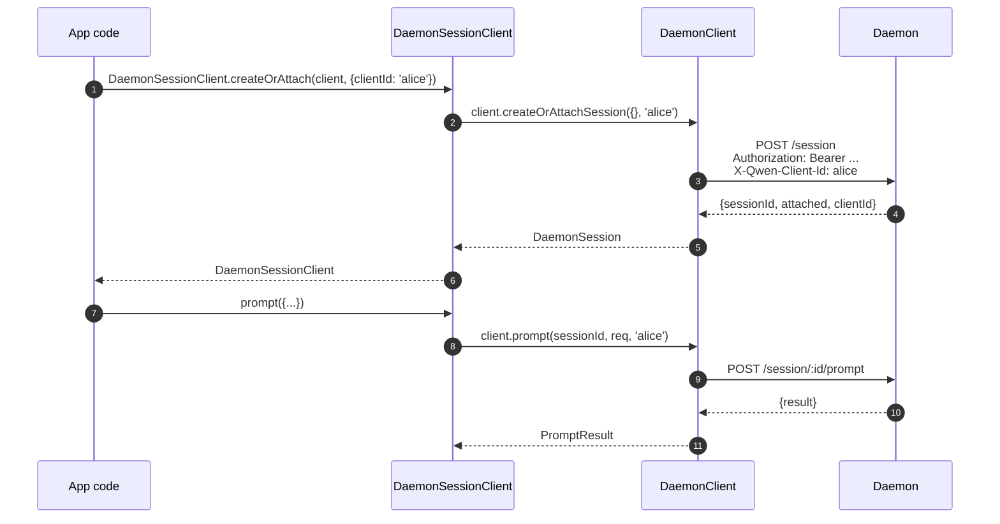
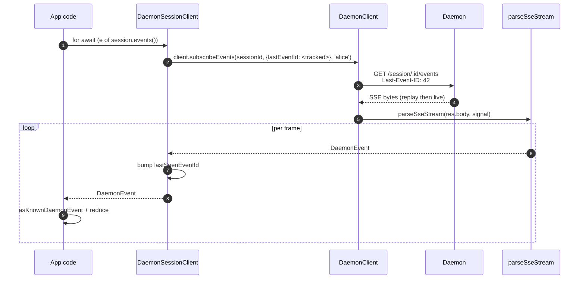
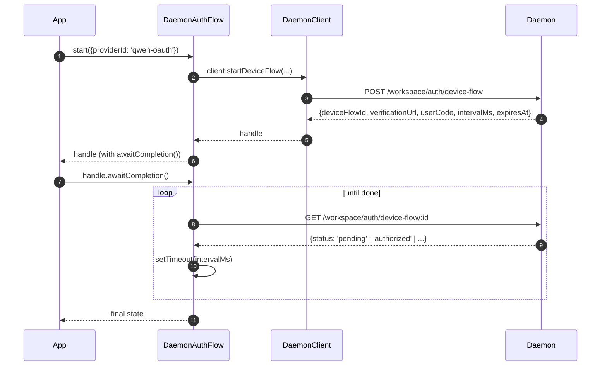

# Client Daemon du SDK TypeScript

## Vue d'ensemble

`packages/sdk-typescript/src/daemon/` est le **client daemon du SDK TypeScript**. C'est la méthode canonique pour se connecter à un daemon `qwen serve` en cours d'exécution depuis n'importe quel hôte TypeScript / JavaScript (l'adaptateur TUI du CLI, les backends de bots de canal, le compagnon IDE VS Code, les scripts personnalisés et les backends web côté serveur). Tous les autres adaptateurs en dépendent.

La structure du package est volontairement minimaliste :

| Fichier                  | Surface                                                                                                                        |
| ------------------------ | ------------------------------------------------------------------------------------------------------------------------------ |
| `index.ts`               | Point d'entrée public (barrel) (`DaemonClient`, `DaemonSessionClient`, `DaemonAuthFlow`, `parseSseStream`, réducteurs d'événements, types).              |
| `DaemonClient.ts`        | Facade HTTP/SSE de bas niveau — une méthode par route de `qwen-serve-protocol.md`.                                                     |
| `DaemonSessionClient.ts` | Wrapper limité à une session avec suivi de la relecture SSE.                                                                               |
| `DaemonAuthFlow.ts`      | Assistant de haut niveau pour le flux d'appareil OAuth (device-flow).                                                                                           |
| `sse.ts`                 | `parseSseStream` (analyseur de tramage NDJSON / SSE).                                                                                |
| `events.ts`              | `asKnownDaemonEvent`, `reduceDaemonSessionEvent`, `reduceDaemonAuthEvent` (voir [`09-event-schema.md`](./09-event-schema.md)).  |
| `types.ts`               | `DaemonCapabilities`, `DaemonSession`, `DaemonEvent`, `PermissionResponse`, `PromptResult`, types MCP / agent / mémoire / auth. |

L'exemple de prise en main se trouve dans [`../examples/daemon-client-quickstart.md`](../examples/daemon-client-quickstart.md) ; ce document est la référence de l'architecture et du contrat.

## Responsabilités

- Fournir une méthode TypeScript par route HTTP du daemon.
- Appliquer correctement le bearer token et le `X-Qwen-Client-Id` sur chaque requête.
- Composer les timeouts par appel avec l'`AbortSignal` fourni par l'appelant (sans interrompre les SSE de longue durée).
- Streamer et analyser les trames SSE en `DaemonEvent` typés.
- Suivre le `lastSeenEventId` par session afin que les reconnexions rejouent correctement.
- Exposer une surface d'authentification par device-flow qui interroge à des intervalles fournis par le daemon.

## Architecture

### `DaemonClient` (`DaemonClient.ts`)

Constructeur :

```ts
new DaemonClient({
  baseUrl: string,                  // default 'http://127.0.0.1:4170'
  token?: string,
  fetch?: typeof globalThis.fetch,  // injectable for tests
  fetchTimeoutMs?: number,          // 0 = disabled; default DEFAULT_FETCH_TIMEOUT_MS
});
```

Groupes de méthodes (chaque méthode prend un `clientId` optionnel pour appliquer le `X-Qwen-Client-Id`) :

| Groupe               | Méthodes                                                                                                                                                                                                                                                                                                                                                                                                                                                                       |
| ------------------- | ----------------------------------------------------------------------------------------------------------------------------------------------------------------------------------------------------------------------------------------------------------------------------------------------------------------------------------------------------------------------------------------------------------------------------------------------------------------------------- |
| Plumbing            | `health()`, `capabilities()`, `auth` (accesseur lazy `DaemonAuthFlow`)                                                                                                                                                                                                                                                                                                                                                                                                         |
| Sessions            | `createOrAttachSession`, `loadSession`, `resumeSession`, `listSessions`, `closeSession`, `setSessionMetadata`, `getSessionContext`, `getSessionSupportedCommands`, `setSessionApprovalMode`, `setSessionModel`                                                                                                                                                                                                                                                                |
| Prompting           | `prompt`, `cancel`, `heartbeat`                                                                                                                                                                                                                                                                                                                                                                                                                                               |
| Événements              | `subscribeEvents` (générateur SSE), `subscribeEventsStream` (réponse brute)                                                                                                                                                                                                                                                                                                                                        |
| Permissions         | `respondToPermission`, `respondToSessionPermission`                                                                                                                                                                                                                                                                                                                                                                                                                           |
| Snapshots de workspace | `getWorkspaceMcp`, `getWorkspaceSkills`, `getWorkspaceProviders`, `getWorkspaceEnv`, `getWorkspacePreflight`                                                                                                                                                                                                                                                                                                                                                                  |
| Mutations de workspace | `addWorkspace`, `updateWorkspace`, `writeWorkspaceMemory`, `readWorkspaceMemory`, `rememberWorkspaceMemory`, `getWorkspaceMemoryRememberTask`, `forgetWorkspaceMemory`, `getWorkspaceMemoryForgetTask`, `dreamWorkspaceMemory`, `getWorkspaceMemoryDreamTask`, `listWorkspaceAgents`, `getWorkspaceAgent`, `createWorkspaceAgent`, `updateWorkspaceAgent`, `deleteWorkspaceAgent`, `setWorkspaceToolEnabled`, `setWorkspaceSkillEnabled`, `restartMcpServer`, `initWorkspace` |
| Fichiers               | `readFile`, `readFileBytes`, `writeFile`, `editFile`, `listDirectory`, `globPaths`, `statPath`                                                                                                                                                                                                                                                                                                                                                                                |
| Auth                | `startDeviceFlow`, `pollDeviceFlow`, `cancelDeviceFlow`, `getAuthStatus`                                                                                                                                                                                                                                                                                                                                                                                                      |

### `fetchWithTimeout`

Chaque requête passe par `fetchWithTimeout`. Détails critiques :

- **La lecture du body se trouve dans le scope du timer.** Les implémentations précédentes effaçaient le timer à l'arrivée des headers ; si un proxy stagnait au milieu du body, `await res.json()` pouvait bloquer au-delà de `fetchTimeoutMs`. La forme actuelle passe le code de lecture du body en callback afin que le timer couvre à la fois l'arrivée des headers ET la consommation du body.
- **`perCallTimeoutMs`** permet à un appel unique de surcharger le défaut global du client. L'appelant le plus visible est `restartMcpServer` : le SDK utilise `MCP_RESTART_DEFAULT_TIMEOUT_MS = 330_000` (5 min 30s). Le `MCP_RESTART_TIMEOUT_MS` propre au daemon est exactement de 300s ; si le client correspondait à cette valeur, un redémarrage se terminant vers 300s pourrait perdre la course pendant que le daemon sérialise et envoie sa réponse structurée, provoquant une `TimeoutError` faussement positive. Les 30s supplémentaires couvrent la sérialisation, le transfert réseau et le décodage des deux côtés. Les appelants qui ont besoin d'un budget plus strict peuvent passer `timeoutMs` ; passer `0` désactive le timeout.
- **`AbortSignal.any`** compose le signal fourni par l'appelant avec le signal du timer par appel, de sorte que l'annulation par l'appelant et le timeout par appel interrompent proprement l'opération.
- **`AbortController` + `setTimeout` annulable** au lieu de `AbortSignal.timeout()`, afin que les requêtes à résolution rapide ne fuient pas de timers en attente sur la boucle d'événements. Le timer est effacé dans le `finally`.
- **Les endpoints de streaming (`subscribeEvents`) contournent le timeout** — les SSE de longue durée ne doivent pas être tuées par celui-ci.

### `DaemonSessionClient` (`DaemonSessionClient.ts`)

Lie une session et suit automatiquement le `lastSeenEventId` afin que la relecture et la reconnexion SSE fonctionnent sans état supplémentaire de la part de l'appelant.

```ts
class DaemonSessionClient {
  readonly client: DaemonClient;
  readonly session: DaemonSession;
  readonly state: DaemonSessionState;
  private lastSeenEventId: number | undefined;

  static createOrAttach(client, req?): Promise<DaemonSessionClient>;
  static load(client, sessionId, req?): Promise<DaemonSessionClient>;
  static resume(client, sessionId, req?): Promise<DaemonSessionClient>;

  events(opts?: DaemonSessionSubscribeOptions): AsyncIterable<DaemonEvent>;
  prompt(req: PromptRequest): Promise<PromptResult>;
  cancel(): Promise<void>;
  respondToPermission(...): Promise<PermissionResponse>;
  setModel(modelServiceId): Promise<SetModelResult>;
  heartbeat(): Promise<HeartbeatResult>;
  setMetadata(metadata): Promise<SessionMetadataResult>;
  close(): Promise<void>;
}
```

`events()` proxyfie `client.subscribeEvents` avec `resume: true` par défaut — il passe le `lastSeenEventId` suivi afin que les reconnexions rejouent depuis l'endroit où l'abonnement précédent s'est arrêté. Chaque événement émis incrémente le `lastSeenEventId`.

### `DaemonAuthFlow` (`DaemonAuthFlow.ts`)

```ts
class DaemonAuthFlow {
  start(opts: { providerId, ... }): Promise<DaemonAuthFlowHandle>;
}
interface DaemonAuthFlowHandle {
  deviceFlowId: string;
  providerId: string;
  expiresAt: string;
  verificationUrl: string;
  userCode: string;
  awaitCompletion(opts?): Promise<DaemonAuthDeviceFlowState>;
  cancel(): Promise<void>;
}
```

`awaitCompletion()` interroge `GET /workspace/auth/device-flow/:id` à l'intervalle `intervalMs` fourni par le daemon jusqu'à ce que le flux devienne `authorized`, `failed` ou `cancelled`. Il est construit de manière paresseuse via `client.auth` afin que les clients qui ne touchent jamais à l'auth n'encourent aucun coût d'allocation.

### `parseSseStream` (`sse.ts`)

Transforme un `Response.body` (`ReadableStream<Uint8Array>`) en `AsyncIterable<DaemonEvent>`. Gère :

- Le tramage LF et CRLF.
- La limite de débordement de buffer (16 MiB) — borne défensive contre un daemon émettant une trame absurdement grande.
- Le câblage de l'AbortSignal — l'abort ferme le stream et l'itérateur.
- Les trames de commentaires uniquement et les types d'événements inconnus (transmis en tant que `DaemonEvent` ; les consommateurs du SDK les restreignent en aval via `asKnownDaemonEvent`).

### Types (`types.ts`)

Exports notables : `DaemonCapabilities`, `DaemonSession` (`{ sessionId, workspaceCwd, attached, clientId?, createdAt? }`), `DaemonEvent`, `DaemonSessionState`, `DaemonSessionContextStatus`, `DaemonSessionSupportedCommandsStatus`, `PermissionResponse`, `PromptResult`, `HeartbeatResult`, `SetModelResult`, `SessionMetadataResult`, ainsi que les types de résultats MCP / agent / mémoire / auth. Les types de tâches de mémoire de workspace gérée incluent `DaemonWorkspaceMemoryRememberTask`, `DaemonWorkspaceMemoryForgetTask` et `DaemonWorkspaceMemoryDreamTask`.

Assistants de tâches de mémoire gérée du workspace :

```ts
await client.rememberWorkspaceMemory('Use strict TypeScript.', {
  contextMode: 'workspace',
});
await client.getWorkspaceMemoryRememberTask('remember-...');

await client.forgetWorkspaceMemory('old preference');
await client.getWorkspaceMemoryForgetTask('forget-...');

await client.dreamWorkspaceMemory();
await client.getWorkspaceMemoryDreamTask('dream-...');
```

Les toggles de skill de workspace sont disponibles sur les deux formes du client :

```ts
await client.setWorkspaceSkillEnabled('review', false, {
  clientId: 'dashboard-1',
});
await client
  .workspaceByCwd('/work/secondary')
  .setWorkspaceSkillEnabled('review', true, { clientId: 'dashboard-1' });
```

Pré-vérifiez `capabilities.features.includes('workspace_skill_settings_toggle')`. Le `DaemonSkillToggleResult` typé rapporte le `skillName` demandé après tronquage, si l'état disque a `changed`, l'état d'activation (`applied`, `deferred` ou `partial`), et les comptes de sessions rafraîchies/échouées. L'écriture est limitée aux paramètres et ne nécessite pas que le nom apparaisse dans `DaemonWorkspaceSkillStatus` ; le champ optionnel false-only `userInvocable` de ce type de statut reste utile pour afficher le catalogue live mais ne conditionne pas la persistance. Le tag obsolète `workspace_skill_toggle` décrivait le comportement antérieur validé par le catalogue et n'est pas annoncé pour ce contrat.

Pour les modifications par lot, pré-vérifiez `workspace_skill_settings_batch_toggle` et appelez l'une ou l'autre forme du client avec le même contrat. Les routes et les corps de requête sont inchangés :

```ts
await client.setWorkspaceSkillsEnabled(['review', 'deploy'], false, {
  clientId: 'dashboard-1',
});
await client
  .workspaceByCwd('/work/secondary')
  .setWorkspaceSkillsEnabled(['review', 'deploy'], true);
```

`DaemonSkillBatchToggleResult` contient les `results` ordonnés, un tableau `errors` de compatibilité, et les comptes d'activation/rafraîchissement de session au niveau du lot. Les démons actuels traitent chaque nom structurellement valide dans l'ordre de la requête, persistent ensemble toutes les modifications de déclaration résultantes en au plus une écriture de paramètres verrouillée, rafraîchissent les sessions actives une seule fois si quelque chose a changé, et renvoient un tableau `errors` vide sans consulter le catalogue de skills chargé. Activer un nom sans déclaration de workspace existante et sans entrée effective `skills.defaultDisabled` renvoie `changed: false` et n'effectue aucune écriture. Les types d'éléments d'erreur restent disponibles afin que le SDK puisse toujours décoder les réponses des anciens démons. La méthode lève une erreur en cas de réponse non-200.

L'activation par lot d'extensions V2 conserve le modèle opérationnel asynchrone des extensions. Pré-vérifiez `extension_batch_activation_v2`, soumettez un lot global par défaut ou un lot de surcharge pour un workspace sélectionné, puis interrogez-le avec l'assistant d'opération existant :

```ts
const globalHandle = await client.setExtensionDefaultActivations(
  ['formatter', 'review-tools'],
  'disabled',
  'dashboard-1',
);
const workspaceHandle = await client
  .workspaceByCwd('/work/secondary')
  .setExtensionActivations(
    ['formatter', 'review-tools'],
    'inherit',
    'dashboard-1',
  );
const operation = await client.waitForExtensionOperation(workspaceHandle);
```

Le résultat terminal de l'opération contient les `results` ordonnés. Les cibles n'ont pas besoin d'être installées lors de la définition de `enabled` ou `disabled` : le daemon stocke une déclaration de nom et préserve cette politique d'activation lorsqu'une extension portant ce nom est installée ultérieurement. Toutes les cibles modifiées partagent une génération de store d'extensions et une passe de réconciliation. Les lots globaux par défaut réconcilient chaque runtime enregistré ; les lots de workspace résolvent et réconcilient uniquement le runtime fiable sélectionné. Le `inherit` de workspace efface la surcharge exacte mais ne crée pas de déclaration pour un nom inconnu ; un effacement tout-inconnu réussit comme une opération vide sans réconciliation. Les méthodes d'activation singulières restent limitées aux installations.

Les noms d'affichage de workspace sont des métadonnées de présentation optionnelles. Pré-vérifiez `capabilities.features.includes('workspace_display_name')` ; les IDs de workspace et les chemins canoniques restent les seuls sélecteurs, et les noms d'affichage dupliqués sont valides.

```ts
const workspace = await client.addWorkspace('/srv/repos/payments', {
  persist: true,
  displayName: 'Payments Production',
});

await client.updateWorkspace(workspace.id, {
  displayName: 'Payments',
});
await client.updateWorkspace(workspace.id, { displayName: null });
```

`addWorkspace` accepte `displayName?: string` et le renvoie lorsqu'il est défini. `updateWorkspace` accepte un sélecteur par ID ou cwd et `{ displayName: string | null }` ; `null` efface le nom. Les noms sont limités à 256 caractères après tronquage et rejettent les caractères de contrôle C0/DEL internes. Un workspace local au processus ne conserve son nom que pour le processus daemon en cours ; les enregistrements persistants correspondants sont mis à jour via le store existant. `DaemonWorkspaceCapability.displayName` reste optionnel pour que le SDK continue d'interopérer avec les anciens démons.

## Workflow

### Création ou rattachement + premier prompt


```mermaid
sequenceDiagram
    autonumber
    participant App as App code
    participant SC as DaemonSessionClient
    participant DC as DaemonClient
    participant D as Daemon

    App->>SC: DaemonSessionClient.createOrAttach(client, {clientId: 'alice'})
    SC->>DC: client.createOrAttachSession({}, 'alice')
    DC->>D: POST /session<br/>Authorization: Bearer ...<br/>X-Qwen-Client-Id: alice
    D-->>DC: {sessionId, attached, clientId}
    DC-->>SC: DaemonSession
    SC-->>App: DaemonSessionClient

    App->>SC: prompt({...})
    SC->>DC: client.prompt(sessionId, req, 'alice')
    DC->>D: POST /session/:id/prompt
    D-->>DC: {result}
    DC-->>SC: PromptResult
```

### Abonnement avec relecture


```mermaid
sequenceDiagram
    autonumber
    participant App as App code
    participant SC as DaemonSessionClient
    participant DC as DaemonClient
    participant D as Daemon
    participant P as parseSseStream

    App->>SC: for await (e of session.events())
    SC->>DC: client.subscribeEvents(sessionId, {lastEventId: <tracked>}, 'alice')
    DC->>D: GET /session/:id/events<br/>Last-Event-ID: 42
    D-->>DC: SSE bytes (replay then live)
    DC->>P: parseSseStream(res.body, signal)
    loop per frame
        P-->>SC: DaemonEvent
        SC->>SC: bump lastSeenEventId
        SC-->>App: DaemonEvent
        App->>App: asKnownDaemonEvent + reduce
    end
```

### Authentification par device-flow


```mermaid
sequenceDiagram
    autonumber
    participant App as App
    participant AF as DaemonAuthFlow
    participant DC as DaemonClient
    participant D as Daemon

    App->>AF: start({providerId: 'qwen-oauth'})
    AF->>DC: client.startDeviceFlow(...)
    DC->>D: POST /workspace/auth/device-flow
    D-->>DC: {deviceFlowId, verificationUrl, userCode, intervalMs, expiresAt}
    DC-->>AF: handle
    AF-->>App: handle (with awaitCompletion())
    App->>AF: handle.awaitCompletion()
    loop until done
        AF->>D: GET /workspace/auth/device-flow/:id
        D-->>AF: {status: 'pending' | 'authorized' | ...}
        AF->>AF: setTimeout(intervalMs)
    end
    AF-->>App: final state
```

`qwen-oauth` est l'identifiant du fournisseur hérité v1. Le niveau gratuit de Qwen OAuth a été interrompu le 2026-04-15, les nouveaux clients devraient donc préférer un fournisseur d'authentification actuellement pris en charge lorsqu'il y en a un de disponible.

## État et cycle de vie

- `DaemonClient` est sans connexion persistante ; rien ne se passe lors de la construction. Chaque méthode ouvre un nouveau `fetch`.
- `DaemonSessionClient` conserve `lastSeenEventId` entre les appels à `events()` ; les reconnexions rejouent les événements depuis le dernier vu.
- `DaemonAuthFlow` est paresseux (lazy) — `client.auth` le construit lors du premier accès.
- L'itérateur SSE se ferme lorsque (a) le daemon termine le flux, (b) `AbortSignal.abort()` est déclenché, (c) le consommateur sort de la boucle `for await`, ou (d) la limite de débordement du tampon (16 MiB) est atteinte.

## Dépendances

- `globalThis.fetch` (intégré à Node 18+, navigateur, undici, etc.). Injectable par `DaemonClient` pour les tests.
- `AbortController` / `AbortSignal.any` / `setTimeout` natifs.
- Aucune dépendance transitive sur `@qwen-code/qwen-code-core` ou `@qwen-code/acp-bridge` — le package SDK est entièrement découplé afin que les consommateurs externes n'embarquent pas les composants internes du daemon.

## Sous-package `ui/*` ([#4328](https://github.com/QwenLM/qwen-code/pull/4328) + [#4353](https://github.com/QwenLM/qwen-code/pull/4353))

Le SDK exporte également `packages/sdk-typescript/src/daemon/ui/`, un ensemble de primitives indépendantes de l'hôte qui transforment les événements du daemon en blocs de transcription :

- `normalizeDaemonEvent(evt)` mappe les 53 événements wire connus du daemon en 43 valeurs `DaemonUiEventType` adaptées à l'UI ; les événements non modélisés ou malformés sont normalisés en `debug`.
- `createDaemonTranscriptState()` ainsi que `reduceDaemonTranscriptEvents(state, events)` projettent les événements UI dans `DaemonTranscriptBlock[]`.
- `createDaemonTranscriptStore()` encapsule subscribe / dispatch.
- `render.ts` / `terminal.ts` fournissent des rendus de base pour HTML et le terminal, tandis que `toolPreview.ts` produit des résumés d'appels d'outils.
- Les sélecteurs incluent `selectTranscriptBlocksOrderedByEventId`, `selectPendingPermissionBlocks`, `selectCurrentTool`, `selectApprovalMode`, `selectToolProgress`, `selectSubagentChildBlocks`, `formatMissedRange` et `formatBlockTimestamp`.
- Les constantes publiques incluent `DAEMON_PLAN_TOOL_CALL_ID`.
- `conformance.ts` contient la suite de tests de cohérence multi-hôtes.

Le premier consommateur en production est `packages/webui/src/daemon/` via le `DaemonSessionProvider` de React. Consultez [`14-cli-tui-adapter.md`](./14-cli-tui-adapter.md) pour l'architecture détaillée, le glossaire, le tableau des sélecteurs et la relation avec l'ancien `DaemonTuiAdapter`.

Le sous-package est exporté depuis le sous-chemin `@qwen-code/sdk/daemon`. Le code existant qui fait `import { DaemonClient }` n'est pas affecté.

## Reconnexion `Last-Event-ID` avec le SDK

### Suivi automatique via `DaemonSessionClient`

`DaemonSessionClient` suit `lastSeenEventId` en interne. Chaque événement généré avec un `id` numérique fait avancer le curseur. Les appels suivants à `events()` transmettent automatiquement l'identifiant suivi en tant que `Last-Event-ID`, ce qui permet la reconnexion avec relecture sans état supplémentaire de la part de l'appelant :

```ts
import { DaemonClient, DaemonSessionClient } from '@qwen-code/sdk/daemon';

const client = new DaemonClient({ baseUrl: 'http://127.0.0.1:4170', token });
const session = await DaemonSessionClient.createOrAttach(client);

// First subscription — starts live (or from ring start for new sessions).
for await (const event of session.events()) {
  console.log(event.type, event.id);
  // session.lastEventId is bumped on each id-bearing frame.
  if (shouldStop(event)) break;
}

// Reconnect — automatically sends Last-Event-ID: <last seen id>.
// The daemon replays missed events from the ring, then goes live.
for await (const event of session.events()) {
  // Replay frames arrive first, then a synthetic `replay_complete`,
  // then live events.
  handleEvent(event);
}
```

### Reconnexion manuelle avec `DaemonClient`

Pour un contrôle de plus bas niveau, utilisez `DaemonClient.subscribeEvents` directement et gérez le curseur vous-même :

```ts
const client = new DaemonClient({ baseUrl: 'http://127.0.0.1:4170', token });

let cursor: number | undefined; // undefined = live-only on first connect

async function* subscribe(sessionId: string, signal: AbortSignal) {
  for await (const event of client.subscribeEvents(sessionId, {
    lastEventId: cursor,
    signal,
  })) {
    // Only id-bearing frames advance the cursor.
    if (event.id !== undefined) {
      cursor = event.id;
    }
    // Handle ring-eviction gap.
    if (event.type === 'state_resync_required') {
      // State is stale — reload the daemon's bounded replay snapshot window.
      await client.loadSession(sessionId);
      continue;
    }
    if (event.type === 'history_truncated') {
      // Informational only. Render a status notice, then continue applying
      // the retained replay events; do not trigger another reload.
    }
    yield event;
  }
}
```

### Reconnexion avec boucle de retry

Le SDK ne tente **pas** de retry automatiquement en cas d'échec réseau. Implémentez une boucle de retry autour de `events()` :

```ts
async function resilientSubscribe(session: DaemonSessionClient) {
  const MAX_RETRIES = 10;
  const BASE_DELAY_MS = 1000;

  for (let attempt = 0; attempt < MAX_RETRIES; attempt++) {
    try {
      // `resume: true` (default) passes the tracked lastSeenEventId.
      for await (const event of session.events()) {
        attempt = 0; // reset on successful event
        handleEvent(event);
      }
      break; // clean stream end
    } catch (err) {
      const delay = BASE_DELAY_MS * 2 ** Math.min(attempt, 5);
      await new Promise((r) => setTimeout(r, delay));
    }
  }
}
```

Lors de la reconnexion, le daemon rejoue les événements avec `id > lastSeenEventId` depuis son ring borné (par défaut 8000 événements). Si l'écart dépasse la taille du ring, une trame `state_resync_required` signale au client d'appeler `loadSession` et de reconstruire depuis la fenêtre de snapshot de relecture bornée actuelle. Ce snapshot peut commencer par `history_truncated` ; traitez-le comme un marqueur de statut visible par l'opérateur, pas comme une autre demande de resync.

`history_truncated.fullTranscriptAvailable` est un flag de capacité booléen. Lorsqu'il est `true`, les appelants peuvent paginer la relecture persistée active complète avec `DaemonClient.getSessionTranscriptPage(sessionId, { cursor, limit })` ; lorsqu'il est `false`, les clients doivent continuer à afficher la relecture bornée normalement.

Lorsque `workspace_persisted_transcript` est annoncé, `client.workspaceById(workspaceId).getSessionTranscriptPage(sessionId, { cursor, limit })` lit le workspace enregistré sélectionné sans s'attacher à l'ACP. La méthode qualifiée par workspace utilise toujours le REST natif même si le client a un transport remplaçable ; son curseur expire lors du redémarrage du daemon.

Lorsque `workspace_session_export` est annoncé, `client.workspaceById(workspaceId).exportSession(sessionId, { format })` ou `client.workspaceByCwd(workspaceCwd).exportSession(...)` exporte la transcription persistée active du workspace fiable sélectionné. Elle renvoie le `DaemonSessionExportResult` existant, préserve l'identité client optionnelle et le comportement de timeout de fetch global du client, et utilise toujours le REST natif même si le client a un transport remplaçable. Ne déduisez pas la prise en charge serveur de cette méthode depuis `session_export` ou `workspace_qualified_rest_core` ; les anciens démons conservent l'export primaire uniquement.

Lorsque `workspace_archived_session_export` est annoncé, utilisez `client.workspaceById(workspaceId).exportArchivedSession(sessionId, { format })` ou la méthode `workspaceByCwd` correspondante pour exporter uniquement la transcription persistée archivée du workspace sélectionné. La méthode utilise le même type de résultat et le même comportement REST natif que l'export actif, mais elle ne revient jamais à une session active ; la prise en charge ne peut pas être déduite d'une quelconque capacité d'export actif.

Lorsque `workspace_session_live_state` est annoncé, `client.getWorkspaceSessionLiveState(workspaceCwd)` ou les variantes qualifiées `client.workspaceById(workspaceId).getSessionLiveState()` / `client.workspaceByCwd(workspaceCwd).getSessionLiveState()` lisent l'instantané mémoire des sessions actives du workspace fiable sélectionné ainsi que sa version de catalogue, et renvoient `DaemonWorkspaceSessionLiveState` (`{ v: 1, catalogVersion: DaemonSessionCatalogVersion, sessions: DaemonSessionLiveState[] }`). Ces méthodes utilisent toujours le REST natif avec une authentification bearer et un sélecteur de workspace encodé, préservent l'identité client optionnelle et utilisent le timeout de requête courte existant. Elles n'appellent pas `requireCapability()` — une vérification de capacité à chaque interrogation doublerait le volume de requêtes — donc les consommateurs pré-vérifient `workspace_session_live_state` une seule fois depuis leurs capacités déjà chargées et se rabattent sur le polling de catalogue existant lorsque le tag est absent. Ne déduisez pas la prise en charge depuis `workspace_qualified_rest_core`. Chaque `DaemonSessionLiveState` porte un watermark d'activité optionnel `updatedAt` qui permet au consommateur de rafraîchir la récence d'une ligne de catalogue déjà en sa possession au lieu de recharger le catalogue après un tour terminé ; il est absent avant le premier terminal de tour en cours dans le bridge actuel et après un remplacement de daemon ou de runtime, donc le consommateur doit conserver son fallback de catalogue existant pour une valeur absente plutôt que de traiter l'absence comme une non-prise en charge.

### Initialisation de `lastEventId` à la construction

Les appelants qui persistent le curseur entre les redémarrages de processus peuvent l'initialiser :

```ts
const session = new DaemonSessionClient({
  client,
  session: { sessionId, workspaceCwd, attached: true },
  lastEventId: persistedCursor, // resume from persisted position
});
```

La valeur doit être un entier fini et non négatif (validé à la construction). Les valeurs invalides lèvent une erreur.

## Configuration

| Knob | Où | Effet |
| ------------------ | ------------------------------------ | --------------------------------------------------------------------------------------- |
| `baseUrl` | Constructeur `DaemonClient` | URL du daemon ; les slashes finaux sont supprimés. |
| `token` | Constructeur `DaemonClient` | Injecté en tant que `Authorization: Bearer`. |
| `fetch` | Constructeur `DaemonClient` | Point d'injection pour les tests. |
| `fetchTimeoutMs` | Constructeur `DaemonClient` | Timeout par appel ; `0` = désactivé. |
| `clientId` | Argument optionnel par méthode | En-tête `X-Qwen-Client-Id` (voir [`08-session-lifecycle.md`](./08-session-lifecycle.md)). |
| `lastEventId` | Constructeur `DaemonSessionClient` | Initialise le curseur de relecture. |
| `maxQueued` | Option par abonnement | `?maxQueued=N` pour la route SSE ; vérifiez préalablement `caps.features.slow_client_warning`. |
| `perCallTimeoutMs` | Par méthode (ex. `restartMcpServer`) | Remplace le timeout global du client. |

## Mises en garde et limites connues

- **`fetchTimeoutMs` s'applique par appel, et non au niveau de la connexion.** Les lectures longues du corps de la réponse partagent le même timer. Un daemon qui stream des réponses doit remplacer le timeout par appel ou définir le timeout à `0`.
- **SSE contourne le fetch timeout** — les connexions SSE de longue durée ne sont pas tuées par `fetchTimeoutMs`. Utilisez `AbortSignal` pour une annulation contrôlée par l'appelant.
- **La limite du tampon de `parseSseStream` est de 16 MiB** par mesure de sécurité. Une seule trame plus grande que cela interrompt l'itérateur (le daemon n'émet jamais légitimement de telles trames).
- **`asKnownDaemonEvent` retourne `undefined` pour les types d'événements non reconnus.** Les consommateurs du SDK doivent gérer cette branche plutôt que de supposer que l'union est exhaustive ; c'est le contrat de compatibilité ascendante. Les événements non reconnus incrémentent `DaemonSessionViewState.unrecognizedKnownEventCount`.
- **`client_evicted`, `slow_client_warning`, `stream_error` ne font pas partie du ring de relecture.** Se reconnecter après une expulsion reprend depuis le ring du daemon ; vous ne reverrez pas la trame d'expulsion.
- **`DaemonClient` ne fait pas de retry automatique.** Les échecs réseau se manifestent par des rejets ; la stratégie de reconnexion / relecture relève de la responsabilité de l'appelant (`DaemonSessionClient.events()` facilite la relecture, mais la reconnexion reste à faire par appel).

## Références

- `packages/sdk-typescript/src/daemon/DaemonClient.ts`
- `packages/sdk-typescript/src/daemon/DaemonSessionClient.ts`
- `packages/sdk-typescript/src/daemon/DaemonAuthFlow.ts`
- `packages/sdk-typescript/src/daemon/sse.ts`
- `packages/sdk-typescript/src/daemon/events.ts`
- `packages/sdk-typescript/src/daemon/types.ts`
- Guide de bout en bout : [`../examples/daemon-client-quickstart.md`](../examples/daemon-client-quickstart.md).
