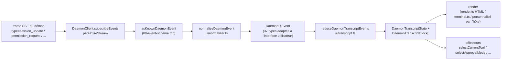

# Couche de transcription d'interface utilisateur partagée

> **Statut actuel** : `packages/cli/src/ui/daemon/daemon-tui-adapter.ts` est toujours présent sur `main` en tant qu'adaptateur CLI expérimental hérité. Ce document décrit la nouvelle couche de transcription d'interface utilisateur partagée côté SDK : normalisation réutilisable des événements du démon et primitives de transcription que tout hôte d'interface utilisateur peut consommer, y compris Web, TUI, IDE et canaux de messagerie instantanée. Les migrations de la TUI CLI, des canaux et de l'IDE VS Code sont des travaux ultérieurs.

## Présentation

`packages/sdk-typescript/src/daemon/ui/` ajoute un sous-paquet `ui/*` au SDK. Il transforme le flux d'événements SSE du démon en blocs de transcription affichables dans l'interface utilisateur via des primitives réutilisables :

- **Normalisation** (`normalizer.ts`) : mappe les 43 types d'événements connus du schéma filaire du démon (voir [`09-event-schema.md`](./09-event-schema.md)) en 37 événements sémantiques `DaemonUiEventType` adaptés à l'interface utilisateur, tels que `assistant.text.delta`, `tool.update` et `session.metadata.changed`.
- **Machine à états** (`transcript.ts`, `store.ts`) : un réducteur pur ainsi qu'un store subscribable qui projettent les événements d'interface utilisateur dans un tableau ordonné `DaemonTranscriptBlock[]`.
- **Renders** (`render.ts`, `terminal.ts`, `toolPreview.ts`) : conversion des blocs de transcription en HTML, texte de terminal et chaînes d'aperçu d'outil. Les hôtes peuvent les utiliser ou les remplacer.
- **Conformité** (`conformance.ts`) : tests de cohérence inter-hôtes utilisés lors de la migration des surfaces canal, TUI et IDE vers ces primitives.

Le premier consommateur en production est **`packages/webui/src/daemon/`** ([#4328](https://github.com/QwenLM/qwen-code/pull/4328)). Son `DaemonSessionProvider` React et son adaptateur de transcription permettent à l'interface utilisateur web de se connecter directement au démon HTTP+SSE au lieu de seulement traiter le trafic `postMessage` de l'hôte. La TUI CLI, la base des canaux et l'IDE VS Code pourront réutiliser la même couche plus tard ; [`../daemon-ui/MIGRATION.md`](../daemon-ui/MIGRATION.md) documente le guide de migration incrémentale v2.

## Responsabilités

- Normaliser les 43 événements filaires du démon en un vocabulaire d'interface utilisateur stable (`DaemonUiEventType`) afin que les rendus n'inspectent pas `rawEvent.data`.
- Conserver le `eventId` SSE monotone du démon comme **clé de classement principale** pour que différents clients rendent les transcriptions dans le même ordre.
- Utiliser un réducteur pur pour produire des blocs de transcription, avec des sélecteurs pour les permissions en attente, l'outil actuel, le mode d'approbation, la progression des outils et les sous-agents enfants.
- Fournir des rendus HTML et terminal de base tout en permettant un rendu spécifique à l'hôte.
- Exposer des constantes publiques comme `DAEMON_PLAN_TOOL_CALL_ID` pour les panneaux de plan.
- Préserver la compatibilité filaire additive : les types d'événements inconnus sont normalisés en `debug` au lieu d'être ignorés.

## Architecture

### Structure du paquet

| Fichier                                                | Exportations                                                                                                                                                           | Objectif                      |
| ------------------------------------------------------ | ---------------------------------------------------------------------------------------------------------------------------------------------------------------------- | ----------------------------- |
| `packages/sdk-typescript/src/daemon/ui/index.ts`       | Barillet du sous-paquet                                                                                                                                               | Point d'entrée public         |
| `ui/types.ts`                                          | `DaemonUiEventType`, interfaces `DaemonUiEvent*` par type, `DaemonTranscriptBlock`, `DaemonTranscriptState`, `DaemonUiToolProvenance`, `DAEMON_PLAN_TOOL_CALL_ID`    | Types                         |
| `ui/normalizer.ts`                                     | `normalizeDaemonEvent(evt) -> DaemonUiEvent`, `getSessionUpdatePayload(evt)`                                                                                          | Mappage filaire vers interface |
| `ui/transcript.ts`                                     | `createDaemonTranscriptState()`, `appendLocalUserTranscriptMessage()`, `reduceDaemonTranscriptEvents()`, `rebuildDaemonTranscriptBlockIndex()`, sélecteurs             | Machine à états et sélecteurs |
| `ui/store.ts`                                          | `createDaemonTranscriptStore(initial?)`                                                                                                                               | Store subscribable du réducteur|
| `ui/toolPreview.ts`                                    | `createDaemonToolPreview(toolEvent)`                                                                                                                                  | Texte récapitulatif d'appel d'outil |
| `ui/render.ts`                                         | `DaemonHtmlRenderOptions`, `DaemonRenderOptions`, fonctions de rendu                                                                                                  | Rendu HTML et générique       |
| `ui/terminal.ts`                                       | Rendu spécifique au terminal                                                                                                                                          | Préparation TUI               |
| `ui/conformance.ts`                                    | Suite de conformité inter-hôtes                                                                                                                                       | Tests de parité de migration  |
| `ui/utils.ts`                                          | Utilitaires comme `DaemonUiContentPart`                                                                                                                               | Utilitaires partagés internes |

### Vocabulaire `DaemonUiEventType`

`ui/types.ts` définit 37 types d'événements d'interface utilisateur, regroupés par domaine.

**Flux de chat (Étape 1)**

- `user.text.delta`, `user.image.delta`, `user.shell.command`, `assistant.text.delta`, `assistant.done`, `thought.text.delta`
- `tool.update`, `shell.output`, `user.shell.output`
- `permission.request`, `permission.resolved`
- `model.changed`, `status`, `error`, `debug`

**Métadonnées de session**

- `session.metadata.changed`, `session.approval_mode.changed`
- `session.available_commands`, `session.state_resync_required`, `session.replay_complete`

**Cycle de vie des invites (multi-client)**

- `prompt.cancelled`, `followup.suggestion`

**Espace de travail (Vague 3-4)**

- `workspace.memory.changed`, `workspace.agent.changed`
- `workspace.tool.toggled`, `workspace.settings.changed`, `workspace.initialized`
- `workspace.mcp.budget_warning`, `workspace.mcp.child_refused`
- `workspace.mcp.server_restarted`, `workspace.mcp.server_restart_refused`

**Flux d'authentification (OAuth vague 4)**

- `auth.device_flow.started`, `auth.device_flow.throttled`, `auth.device_flow.authorized`
- `auth.device_flow.failed`, `auth.device_flow.cancelled`

`normalizeDaemonEvent` mappe les 43 événements filaires connus du démon dans ce vocabulaire. Les types d'événements inconnus, non modélisés ou mal formés sont normalisés en `debug` et conservent `rawEvent` pour le diagnostic de l'hôte.

### Réducteur et sélecteurs

```ts
// Crée l'état initial.
const state = createDaemonTranscriptState();

// Applique une séquence d'événements SSE.
const next = reduceDaemonTranscriptEvents(state, daemonUiEvents);

// Sélecteurs.
selectTranscriptBlocks(state); // tous les blocs
selectTranscriptBlocksOrderedByEventId(state); // ordonnés par eventId ; clé préférée
selectPendingPermissionBlocks(state);
selectCurrentTool(state);
selectApprovalMode(state);
selectToolProgress(state, toolCallId);
selectSubagentChildBlocks(state, parentBlockId);
isSubagentChildBlock(block);
formatBlockTimestamp(block);
formatMissedRange(state); // texte "vous avez manqué X" après state_resync_required
```

### Store

`createDaemonTranscriptStore()` fournit les méthodes subscribe et dispatch :

```ts
const store = createDaemonTranscriptStore();
store.subscribe(() => render(store.getState()));
store.dispatch(uiEvents); // exécute le réducteur en interne
```

Le `DaemonSessionProvider` de l'interface utilisateur web construit son contexte React au-dessus de ce store.

## Flux

### Un seul événement SSE de bout en bout



Les hôtes peuvent s'arrêter à `(E)` et implémenter leur propre réducteur, ou consommer `(G)` et les sélecteurs fournis. L'interface utilisateur web utilise le chemin complet `(B) -> (H)`. Une TUI migrée peut consommer `(G)` et effectuer le rendu avec des composants Ink.

### `state_resync_required`

`session.state_resync_required` se mappe en un marqueur de « plage manquée » dans la transcription. Le code d'interface utilisateur peut appeler `formatMissedRange(state)` pour afficher un texte tel que « événements X-Y manqués ». Le réducteur **continue d'appliquer les événements suivants**, mais marque les blocs affectés avec `resyncRecovery: true` afin que les rendus puissent ajouter un contexte visuel. Voir [`10-event-bus.md`](./10-event-bus.md) pour les sémantiques d'éviction circulaire et `state_resync_required`.

## Consommateurs

### `packages/webui/src/daemon/`

Ceci a été livré dans [#4328](https://github.com/QwenLM/qwen-code/pull/4328).

| Fichier                       | Exportations                                                                                                                                                                                                                                                                                                                       |
| ----------------------------- | --------------------------------------------------------------------------------------------------------------------------------------------------------------------------------------------------------------------------------------------------------------------------------------------------------------------------------- |
| `DaemonSessionProvider.tsx`   | Composant React `<DaemonSessionProvider />` ; hooks `useDaemonSession()`, `useDaemonTranscriptStore()`, `useDaemonTranscriptState()`, `useDaemonTranscriptBlocks()`, `useDaemonPendingPermissions()`, `useDaemonActions()`, `useDaemonConnection()` ; types `DaemonConnectionStatus`, `DaemonConnectionState`, `DaemonSessionContextValue` |
| `transcriptAdapter.ts`        | Adapte `DaemonTranscriptBlock` du SDK en `UnifiedMessage` de l'interface utilisateur web, y compris la fusion des morceaux de flux Markdown et les résumés d'appels d'outil                                                                                                                                                        |
| `index.ts`                    | Barillet du sous-paquet                                                                                                                                                                                                                                                                                                           |

L'interface utilisateur web peut désormais se connecter directement au démon HTTP+SSE et afficher une transcription. L'ancien chemin `ACPAdapter` basé sur `postMessage` de l'hôte reste disponible.

### Migrations ultérieures

[`../daemon-ui/MIGRATION.md`](../daemon-ui/MIGRATION.md) fournit un guide incrémental v2 pour les adaptateurs de chat web et de terminal web. Il précise explicitement que **la TUI CLI, la base des canaux et l'IDE VS Code ne sont pas migrés par cette PR** ; chacun le sera dans des PR ultérieures et utilisera la suite de conformité pour préserver la parité de rendu.

## Relation avec l'ancien `daemon-tui-adapter.ts`

| Dimension         | Ancien `DaemonTuiAdapter` CLI                                   | Nouvelle couche de transcription partagée                          |
| ----------------- | --------------------------------------------------------------- | ------------------------------------------------------------------ |
| Paquet            | `packages/cli/src/ui/daemon/`                                   | `packages/sdk-typescript/src/daemon/ui/`                           |
| Surface publique  | `DaemonTuiAdapter`, `DaemonTuiUpdate`, `DaemonTuiSessionClient` | `DaemonUiEventType`, `reduceDaemonTranscriptEvents`, sélecteurs   |
| Périmètre         | TUI CLI Ink uniquement                                          | Web, TUI, IDE ou interface de messagerie instantanée              |
| Forme de l'état   | Union de mises à jour locales à la TUI                          | Liste de blocs de transcription pure + champs d'état              |
| Classement        | `createdAt`                                                     | `eventId` (monotone pour le démon, cohérent entre clients)        |
| Type filaire inconnu | Ignoré dans `reduceDaemonEventToTuiUpdates`                     | Normalisé en `debug` et conservé                                   |
| Tests             | Tests unitaires d'un seul paquet                                | Suite de conformité globale pour la parité inter-hôtes            |

## Dépendances

- Types filaires amont : `packages/sdk-typescript/src/daemon/events.ts` (voir [`09-event-schema.md`](./09-event-schema.md)).
- Consommateur aval réel : `packages/webui/src/daemon/`.
- Cibles de migration ultérieures : `packages/cli/src/ui/`, `packages/channels/base/`, et `packages/vscode-ide-companion/src/services/daemonIdeConnection.ts`.
- Références parallèles : [`../daemon-ui/README.md`](../daemon-ui/README.md), [`../daemon-ui/MIGRATION.md`](../daemon-ui/MIGRATION.md), et [`../daemon-client-adapters/web-ui.md`](../daemon-client-adapters/web-ui.md).

## Configuration

- Aucune configuration à l'exécution. Les réducteurs et les sélecteurs sont des fonctions pures.
- Les hôtes choisissent leur rendu : HTML (`render.ts`), terminal (`terminal.ts`), ou rendu personnalisé.
- Pour le débogage, `render.ts` prend en charge `includeRawEvent: true` pour inclure la trame filaire brute dans la sortie rendue.

## Mises en garde et limites connues

- **`daemon-tui-adapter.ts` existe toujours**. Il s'agit de l'adaptateur expérimental hérité du paquet CLI. Le nouveau code devrait préférer le SDK `ui/*` : `normalizeDaemonEvent`, `reduceDaemonTranscriptEvents` et `DaemonTranscriptBlock`.
- **La TUI CLI, la base des canaux et l'IDE VS Code ne sont pas encore migrés**. Ils conservent encore leur propre logique de rendu. Le répertoire `docs/developers/daemon-client-adapters/` contient toujours `ide.md`, `channel-web.md` et l'ébauche historique `tui.md` ; le plus récent `web-ui.md` couvre la conception de l'adaptateur d'interface utilisateur web.
- **`eventId` est la clé de classement principale**. `createdAt` reste comme alias obsolète (`clientReceivedAt`). Le nouveau code doit utiliser `selectTranscriptBlocksOrderedByEventId(state)`. `MIGRATION.md` montre le diff de code pour passer du classement par `createdAt` au classement par `eventId`.
- **Les types filaires inconnus sont normalisés en `debug`**. Ils ne sont plus ignorés comme dans l'ancien adaptateur. Les rendus n'affichent pas `debug` par défaut ; les hôtes doivent s'y inscrire explicitement pour l'afficher.
- **Taille du bundle** : le sous-paquet `ui/*` est exporté via un sous-chemin ESM à travers `@qwen-code/sdk/daemon` et n'importe pas de dépendances React ou DOM. L'intégration React n'est chargée que lorsqu'un consommateur d'interface utilisateur web utilise `DaemonSessionProvider`.

## Références

- `packages/sdk-typescript/src/daemon/ui/types.ts` (vocabulaire `DaemonUiEventType`)
- `packages/sdk-typescript/src/daemon/ui/transcript.ts` (réducteur et sélecteurs)
- `packages/sdk-typescript/src/daemon/ui/normalizer.ts` (mappage filaire vers interface)
- `packages/sdk-typescript/src/daemon/ui/store.ts`, `render.ts`, `terminal.ts`, `toolPreview.ts`, `conformance.ts`
- `packages/sdk-typescript/src/daemon/index.ts` (bloc de réexportation `ui/*`)
- `packages/webui/src/daemon/DaemonSessionProvider.tsx`, `transcriptAdapter.ts`
- Documentation amont : [`../daemon-ui/README.md`](../daemon-ui/README.md), [`../daemon-ui/MIGRATION.md`](../daemon-ui/MIGRATION.md), [`../daemon-client-adapters/web-ui.md`](../daemon-client-adapters/web-ui.md)
- PRs de contexte : [#4328](https://github.com/QwenLM/qwen-code/pull/4328) (couche de transcription v1 et fournisseur web UI), [#4353](https://github.com/QwenLM/qwen-code/pull/4353) (suivi d'exhaustivité unifiée v2)