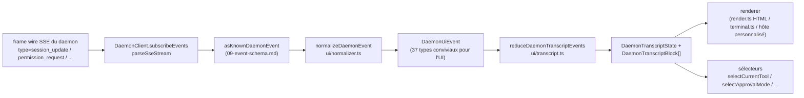

# Couche de transcript UI partagée

> **Statut actuel** : `packages/cli/src/ui/daemon/daemon-tui-adapter.ts` est toujours présent sur `main` en tant qu'adaptateur CLI expérimental hérité (legacy). Ce document décrit la nouvelle couche de transcript UI partagée côté SDK : une normalisation réutilisable des événements du daemon et des primitives de transcript que n'importe quel hôte UI peut consommer, y compris les canaux Web, TUI, IDE et IM. Les migrations du CLI TUI, du canal de base et de l'IDE VS Code font l'objet de travaux ultérieurs.

## Vue d'ensemble

`packages/sdk-typescript/src/daemon/ui/` ajoute un sous-package `ui/*` au SDK. Il transforme le flux d'événements SSE du daemon en blocs de transcript rendables par l'UI via des primitives réutilisables :

- **Normalisation** (`normalizer.ts`) : mappe les 47 types d'événements connus du schéma wire du daemon (voir [`09-event-schema.md`](./09-event-schema.md)) en 37 événements sémantiques `DaemonUiEventType` conviviaux pour l'UI, tels que `assistant.text.delta`, `tool.update` et `session.metadata.changed`.
- **Machine à états** (`transcript.ts`, `store.ts`) : reducer pur et store subscribable qui projettent les événements UI dans un tableau ordonné `DaemonTranscriptBlock[]`.
- **Renderers** (`render.ts`, `terminal.ts`, `toolPreview.ts`) : convertissent les blocs de transcript en HTML, texte de terminal et chaînes de prévisualisation d'outils. Les hôtes peuvent les utiliser ou les remplacer.
- **Conformité** (`conformance.ts`) : tests de cohérence inter-hôtes utilisés lors de la migration des surfaces de canal, TUI et IDE vers ces primitives.

Le premier consommateur en production est **`packages/webui/src/daemon/`** ([#4328](https://github.com/QwenLM/qwen-code/pull/4328)). Son `DaemonSessionProvider` React et son adaptateur de transcript permettent à l'UI web de se connecter directement au daemon HTTP+SSE au lieu de se limiter au rendu du trafic `postMessage` de l'hôte. Le CLI TUI, le canal de base et l'IDE VS Code pourront réutiliser cette même couche ultérieurement ; [`../daemon-ui/MIGRATION.md`](../daemon-ui/MIGRATION.md) documente le guide de migration incrémentale v2.

## Responsabilités

- Normaliser les 47 événements wire du daemon en un vocabulaire UI stable (`DaemonUiEventType`) afin que les renderers n'aient pas à inspecter `rawEvent.data`.
- Conserver le `eventId` SSE monotone du daemon comme **clé de tri principale** afin que les différents clients rendent les transcripts dans le même ordre.
- Utiliser un reducer pur pour produire les blocs de transcript, avec des sélecteurs pour les permissions en attente, l'outil actuel, le mode d'approbation, la progression de l'outil et les enfants de sous-agents.
- Fournir des renderers HTML et terminal de base tout en permettant un rendu spécifique à l'hôte.
- Exposer des constantes publiques telles que `DAEMON_PLAN_TOOL_CALL_ID` pour les panneaux de plan.
- Préserver la compatibilité wire additive : les types d'événements inconnus sont normalisés en `debug` au lieu d'être ignorés.

## Architecture

### Structure du package

| Fichier                                            | Exports                                                                                                                                                           | Objectif                    |
| ------------------------------------------------ | ----------------------------------------------------------------------------------------------------------------------------------------------------------------- | --------------------------- |
| `packages/sdk-typescript/src/daemon/ui/index.ts` | Barrel du sous-package                                                                                                                                                 | Point d'entrée public          |
| `ui/types.ts`                                    | `DaemonUiEventType`, interfaces `DaemonUiEvent*` par type, `DaemonTranscriptBlock`, `DaemonTranscriptState`, `DaemonUiToolProvenance`, `DAEMON_PLAN_TOOL_CALL_ID` | Types                       |
| `ui/normalizer.ts`                               | `normalizeDaemonEvent(evt) -> DaemonUiEvent`, `getSessionUpdatePayload(evt)`                                                                                      | Mapping wire vers UI          |
| `ui/transcript.ts`                               | `createDaemonTranscriptState()`, `appendLocalUserTranscriptMessage()`, `reduceDaemonTranscriptEvents()`, `rebuildDaemonTranscriptBlockIndex()`, sélecteurs         | Machine à états et sélecteurs |
| `ui/store.ts`                                    | `createDaemonTranscriptStore(initial?)`                                                                                                                           | Store de reducer subscribable  |
| `ui/toolPreview.ts`                              | `createDaemonToolPreview(toolEvent)`                                                                                                                              | Texte de résumé d'appel d'outil      |
| `ui/render.ts`                                   | `DaemonHtmlRenderOptions`, `DaemonRenderOptions`, fonctions de rendu                                                                                                | Rendu HTML et générique  |
| `ui/terminal.ts`                                 | Rendu spécifique au terminal                                                                                                                                       | Préparation TUI             |
| `ui/conformance.ts`                              | Suite de conformité inter-hôtes                                                                                                                                      | Tests de parité de migration      |
| `ui/utils.ts`                                    | Helpers tels que `DaemonUiContentPart`                                                                                                                             | Utilitaires internes partagés   |

### Vocabulaire de `DaemonUiEventType`

`ui/types.ts` définit 37 types d'événements UI, regroupés par domaine.

**Flux de chat (Étape 1)**

- `user.text.delta`, `user.image.delta`, `user.shell.command`, `assistant.text.delta`, `assistant.done`, `thought.text.delta`
- `tool.update`, `shell.output`, `user.shell.output`
- `permission.request`, `permission.resolved`
- `model.changed`, `status`, `error`, `debug`

**Métadonnées de session**

- `session.metadata.changed`, `session.approval_mode.changed`
- `session.available_commands`, `session.state_resync_required`, `session.replay_complete`

**Cycle de vie du prompt (inter-clients)**

- `prompt.cancelled`, `followup.suggestion`

**Workspace (Vagues 3-4)**

- `workspace.memory.changed`, `workspace.agent.changed`
- `workspace.tool.toggled`, `workspace.settings.changed`, `workspace.initialized`
- `workspace.mcp.budget_warning`, `workspace.mcp.child_refused`
- `workspace.mcp.server_restarted`, `workspace.mcp.server_restart_refused`

**Flux d'authentification (Vague 4 OAuth)**

- `auth.device_flow.started`, `auth.device_flow.throttled`, `auth.device_flow.authorized`
- `auth.device_flow.failed`, `auth.device_flow.cancelled`

`normalizeDaemonEvent` mappe les 47 événements wire connus du daemon dans ce vocabulaire. Les types d'événements inconnus, non modélisés ou malformés sont normalisés en `debug` et conservent `rawEvent` pour les diagnostics de l'hôte.

### Reducer et sélecteurs

```ts
// Créer l'état initial.
const state = createDaemonTranscriptState();

// Appliquer une séquence d'événements SSE.
const next = reduceDaemonTranscriptEvents(state, daemonUiEvents);

// Sélecteurs.
selectTranscriptBlocks(state); // tous les blocs
selectTranscriptBlocksOrderedByEventId(state); // triés par eventId ; clé préférée
selectPendingPermissionBlocks(state);
selectCurrentTool(state);
selectApprovalMode(state);
selectToolProgress(state, toolCallId);
selectSubagentChildBlocks(state, parentBlockId);
isSubagentChildBlock(block);
formatBlockTimestamp(block);
formatMissedRange(state); // texte "you missed X" après state_resync_required
```

### Store

`createDaemonTranscriptStore()` fournit les méthodes subscribe et dispatch :

```ts
const store = createDaemonTranscriptStore();
store.subscribe(() => render(store.getState()));
store.dispatch(uiEvents); // exécute le reducer en interne
```

Le `DaemonSessionProvider` de l'UI web construit son contexte React au-dessus de ce store.

## Flux

### Un seul événement SSE de bout en bout



Les hôtes peuvent s'arrêter à `(E)` et implémenter leur propre reducer, ou consommer `(G)` et les sélecteurs fournis. L'UI web utilise le chemin complet `(B) -> (H)`. Un TUI migré peut consommer `(G)` et effectuer le rendu avec des composants spécifiques à Ink.

### `state_resync_required`

`session.state_resync_required` correspond à un marqueur de "plage manquée" dans le transcript. Le code de l'UI peut appeler `formatMissedRange(state)` pour rendre du texte tel que "événements manqués X-Y". Le reducer **continue d'appliquer les événements ultérieurs**, mais marque les blocs affectés avec `resyncRecovery: true` afin que les renderers puissent ajouter un contexte visuel. Voir [`10-event-bus.md`](./10-event-bus.md) pour les sémantiques d'éviction circulaire (ring-eviction) et de `state_resync_required`.

## Consommateurs

### `packages/webui/src/daemon/`

Cela a été intégré dans [#4328](https://github.com/QwenLM/qwen-code/pull/4328).

| Fichier                       | Exports                                                                                                                                                                                                                                                                                                                        |
| --------------------------- | ------------------------------------------------------------------------------------------------------------------------------------------------------------------------------------------------------------------------------------------------------------------------------------------------------------------------------ |
| `DaemonSessionProvider.tsx` | React `<DaemonSessionProvider />` ; hooks `useDaemonSession()`, `useDaemonTranscriptStore()`, `useDaemonTranscriptState()`, `useDaemonTranscriptBlocks()`, `useDaemonPendingPermissions()`, `useDaemonActions()`, `useDaemonConnection()` ; types `DaemonConnectionStatus`, `DaemonConnectionState`, `DaemonSessionContextValue` |
| `transcriptAdapter.ts`      | Adapte le `DaemonTranscriptBlock` du SDK en `UnifiedMessage` de l'UI web, incluant la fusion des chunks de streaming markdown et les résumés d'appels d'outils                                                                                                                                                                                        |
| `index.ts`                  | Barrel du sous-package                                                                                                                                                                                                                                                                                                              |

L'UI web peut désormais se connecter directement au daemon HTTP+SSE et rendre un transcript. L'ancien chemin `postMessage` de l'hôte `ACPAdapter` reste disponible.

### Migrations ultérieures

[`../daemon-ui/MIGRATION.md`](../daemon-ui/MIGRATION.md) fournit un guide incrémental v2 pour les adaptateurs de chat web et de terminal web. Il précise explicitement que **le CLI TUI, le canal de base et l'IDE VS Code ne sont pas migrés par cette PR** ; chacun fera l'objet de PRs de suivi et utilisera la suite de conformité pour préserver la parité de rendu.

## Relation avec le legacy `daemon-tui-adapter.ts`

| Dimension         | `DaemonTuiAdapter` CLI legacy                                   | Nouvelle couche de transcript partagée                                    |
| ----------------- | --------------------------------------------------------------- | -------------------------------------------------------------- |
| Package           | `packages/cli/src/ui/daemon/`                                   | `packages/sdk-typescript/src/daemon/ui/`                       |
| Surface publique    | `DaemonTuiAdapter`, `DaemonTuiUpdate`, `DaemonTuiSessionClient` | `DaemonUiEventType`, `reduceDaemonTranscriptEvents`, sélecteurs |
| Périmètre             | CLI Ink TUI uniquement                                                | UI Web, TUI, IDE ou IM                                        |
| Forme de l'état       | Union de mises à jour locales au TUI                                          | Liste pure de blocs de transcript plus champs d'état                   |
| Tri          | `createdAt`                                                     | `eventId` (monotone du daemon, cohérent entre les clients)        |
| Type wire inconnu | Ignoré dans `reduceDaemonEventToTuiUpdates`                      | Normalisé en `debug` et conservé                            |
| Tests             | Tests unitaires d'un seul package                                       | Suite de conformité globale pour la parité inter-hôtes                 |

## Dépendances

- Types wire en amont : `packages/sdk-typescript/src/daemon/events.ts` (voir [`09-event-schema.md`](./09-event-schema.md)).
- Consommateur réel en aval : `packages/webui/src/daemon/`.
- Cibles de migration ultérieures : `packages/cli/src/ui/`, `packages/channels/base/` et `packages/vscode-ide-companion/src/services/daemonIdeConnection.ts`.
- Références parallèles : [`../daemon-ui/README.md`](../daemon-ui/README.md), [`../daemon-ui/MIGRATION.md`](../daemon-ui/MIGRATION.md) et [`../daemon-client-adapters/web-ui.md`](../daemon-client-adapters/web-ui.md).

## Configuration

- Aucune configuration à l'exécution. Les reducers et les sélecteurs sont des fonctions pures.
- Les hôtes choisissent leur renderer : HTML (`render.ts`), terminal (`terminal.ts`) ou rendu personnalisé.
- Pour le débogage, `render.ts` prend en charge `includeRawEvent: true` pour inclure le frame wire brut dans la sortie rendue.

## Mises en garde et limites connues

- **`daemon-tui-adapter.ts` existe toujours**. Il s'agit de l'adaptateur expérimental legacy du package CLI. Le nouveau code doit préférer le SDK `ui/*` : `normalizeDaemonEvent`, `reduceDaemonTranscriptEvents` et `DaemonTranscriptBlock`.
- **Le CLI TUI, le canal de base et l'IDE VS Code ne sont pas encore migrés**. Ils conservent leur propre logique de rendu. Le répertoire `docs/developers/daemon-client-adapters/` contient toujours `ide.md`, `channel-web.md` et le brouillon historique `tui.md` ; le plus récent `web-ui.md` couvre la conception de l'adaptateur d'UI web.
- **`eventId` est la clé de tri principale**. `createdAt` reste comme alias obsolète (`clientReceivedAt`). Le nouveau code doit utiliser `selectTranscriptBlocksOrderedByEventId(state)`. `MIGRATION.md` montre le diff de code pour passer du tri par `createdAt` au tri par `eventId`.
- **Les types wire inconnus sont normalisés en `debug`**. Ils ne sont plus ignorés comme dans l'ancien adaptateur. Les renderers n'affichent pas `debug` par défaut ; les hôtes doivent explicitement l'activer pour l'afficher.
- **Taille du bundle** : le sous-package `ui/*` est exporté en tant que sous-chemin ESM via `@qwen-code/sdk/daemon` et n'entraîne pas de dépendances React ou DOM. L'intégration React n'est chargée que lorsqu'un consommateur d'UI web utilise `DaemonSessionProvider`.

## Références

- `packages/sdk-typescript/src/daemon/ui/types.ts` (vocabulaire `DaemonUiEventType`)
- `packages/sdk-typescript/src/daemon/ui/transcript.ts` (reducer et sélecteurs)
- `packages/sdk-typescript/src/daemon/ui/normalizer.ts` (mapping wire vers UI)
- `packages/sdk-typescript/src/daemon/ui/store.ts`, `render.ts`, `terminal.ts`, `toolPreview.ts`, `conformance.ts`
- `packages/sdk-typescript/src/daemon/index.ts` (bloc de ré-exportation `ui/*`)
- `packages/webui/src/daemon/DaemonSessionProvider.tsx`, `transcriptAdapter.ts`
- Documentation en amont : [`../daemon-ui/README.md`](../daemon-ui/README.md), [`../daemon-ui/MIGRATION.md`](../daemon-ui/MIGRATION.md), [`../daemon-client-adapters/web-ui.md`](../daemon-client-adapters/web-ui.md)
- PRs de contexte : [#4328](https://github.com/QwenLM/qwen-code/pull/4328) (couche de transcript v1 et fournisseur d'UI web), [#4353](https://github.com/QwenLM/qwen-code/pull/4353) (suivi de complétude unifiée v2)