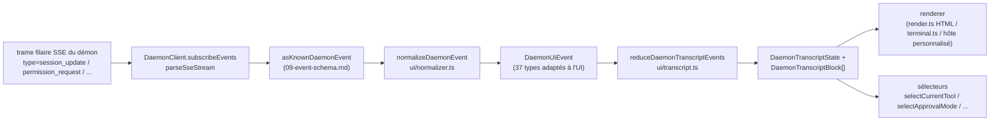

# Couche de transcription partagée de l'interface utilisateur

> [!note]
> **Statut actuel** : `packages/cli/src/ui/daemon/daemon-tui-adapter.ts` est toujours présent sur `main` en tant qu'adaptateur CLI expérimental hérité. Ce document décrit la nouvelle couche de transcription partagée de l'interface utilisateur côté SDK : normalisation réutilisable des événements du daemon et primitives de transcription que tout hôte d'interface peut consommer, y compris les canaux Web, TUI, IDE et IM. Les migrations du CLI TUI, des canaux et de l'IDE VS Code sont des travaux ultérieurs.

## Aperçu

`packages/sdk-typescript/src/daemon/ui/` ajoute un sous-package `ui/*` au SDK. Il transforme le flux d'événements SSE du daemon en blocs de transcript rendus dans l'interface, via des primitives réutilisables :

- **Normalisation** (`normalizer.ts`) : mappe les 43 types d'événements connus du schéma filaire du daemon (voir [`09-event-schema.md`](./09-event-schema.md)) en 37 événements sémantiques `DaemonUiEventType` adaptés à l'interface, tels que `assistant.text.delta`, `tool.update` et `session.metadata.changed`.
- **Machine à états** (`transcript.ts`, `store.ts`) : réducteur pur plus magasin abonnable qui projette les événements de l'interface en un tableau ordonné `DaemonTranscriptBlock[]`.
- **Rendu** (`render.ts`, `terminal.ts`, `toolPreview.ts`) : blocs de transcript vers HTML, texte terminal et chaînes d'aperçu d'outil. Les hôtes peuvent les utiliser ou les remplacer.
- **Conformité** (`conformance.ts`) : tests de cohérence inter-hôtes utilisés lors de la migration des surfaces de canal, TUI et IDE vers ces primitives.

Le premier consommateur en production est **`packages/webui/src/daemon/`** ([#4328](https://github.com/QwenLM/qwen-code/pull/4328)). Son `DaemonSessionProvider` React et son adaptateur de transcript permettent à l'interface Web de se connecter directement au HTTP+SSE du daemon au lieu de ne rendre que le trafic `postMessage` de l'hôte. Le CLI TUI, la base des canaux et l'IDE VS Code pourront réutiliser la même couche plus tard ; [`../daemon-ui/MIGRATION.md`](../daemon-ui/MIGRATION.md) documente le guide de migration incrémentale v2.

## Responsabilités

- Normaliser les 43 événements filaires du daemon en un vocabulaire d'interface stable (`DaemonUiEventType`) afin que les rendus n'inspectent pas `rawEvent.data`.
- Conserver l'`eventId` SSE monotone du daemon comme **clé d'ordre primaire** afin que différents clients rendent les transcripts dans le même ordre.
- Utiliser un réducteur pur pour produire les blocs de transcript, avec des sélecteurs pour les permissions en attente, l'outil courant, le mode d'approbation, la progression des outils et les enfants des sous-agents.
- Fournir des rendus HTML et terminal de base tout en permettant un rendu spécifique à l'hôte.
- Exposer des constantes publiques telles que `DAEMON_PLAN_TOOL_CALL_ID` pour les panneaux de plan.
- Préserver la compatibilité filaire additive : les types d'événements inconnus sont normalisés en `debug` au lieu d'être ignorés.

## Architecture

### Structure du package

| Fichier                                            | Exportations                                                                                                                                                           | Objectif                     |
| -------------------------------------------------- | ---------------------------------------------------------------------------------------------------------------------------------------------------------------------- | ---------------------------- |
| `packages/sdk-typescript/src/daemon/ui/index.ts`   | Sous-package barrel                                                                                                                                                    | Point d'entrée public        |
| `ui/types.ts`                                      | `DaemonUiEventType`, interfaces `DaemonUiEvent*` par type, `DaemonTranscriptBlock`, `DaemonTranscriptState`, `DaemonUiToolProvenance`, `DAEMON_PLAN_TOOL_CALL_ID`      | Types                        |
| `ui/normalizer.ts`                                 | `normalizeDaemonEvent(evt) -> DaemonUiEvent`, `getSessionUpdatePayload(evt)`                                                                                           | Mapping filaire vers UI      |
| `ui/transcript.ts`                                 | `createDaemonTranscriptState()`, `appendLocalUserTranscriptMessage()`, `reduceDaemonTranscriptEvents()`, `rebuildDaemonTranscriptBlockIndex()`, sélecteurs              | Machine à états et sélecteurs |
| `ui/store.ts`                                      | `createDaemonTranscriptStore(initial?)`                                                                                                                                | Magasin réducteur abonnable  |
| `ui/toolPreview.ts`                                | `createDaemonToolPreview(toolEvent)`                                                                                                                                   | Texte récapitulatif d'outil  |
| `ui/render.ts`                                     | `DaemonHtmlRenderOptions`, `DaemonRenderOptions`, fonctions de rendu                                                                                                  | Rendu HTML et générique      |
| `ui/terminal.ts`                                   | Rendu spécifique au terminal                                                                                                                                           | Préparation TUI              |
| `ui/conformance.ts`                                | Suite de conformité inter-hôtes                                                                                                                                        | Tests de parité de migration |
| `ui/utils.ts`                                      | Utilitaires comme `DaemonUiContentPart`                                                                                                                                | Utilitaires internes partagés |
### Vocabulaire `DaemonUiEventType`

`ui/types.ts` définit 37 types d'événements UI, regroupés par domaine.

**Flux de chat (Étape 1)**

- `user.text.delta`, `user.image.delta`, `user.shell.command`, `assistant.text.delta`, `assistant.done`, `thought.text.delta`
- `tool.update`, `shell.output`, `user.shell.output`
- `permission.request`, `permission.resolved`
- `model.changed`, `status`, `error`, `debug`

**Métadonnées de session**

- `session.metadata.changed`, `session.approval_mode.changed`
- `session.available_commands`, `session.state_resync_required`, `session.replay_complete`

**Cycle de vie des invites (multi-client)**

- `prompt.cancelled`, `followup.suggestion`

**Espace de travail (Wave 3-4)**

- `workspace.memory.changed`, `workspace.agent.changed`
- `workspace.tool.toggled`, `workspace.settings.changed`, `workspace.initialized`
- `workspace.mcp.budget_warning`, `workspace.mcp.child_refused`
- `workspace.mcp.server_restarted`, `workspace.mcp.server_restart_refused`

**Flux d'authentification (Wave 4 OAuth)**

- `auth.device_flow.started`, `auth.device_flow.throttled`, `auth.device_flow.authorized`
- `auth.device_flow.failed`, `auth.device_flow.cancelled`

`normalizeDaemonEvent` fait correspondre les 43 événements filaires connus du démon à ce vocabulaire. Les types d'événements inconnus, non modélisés ou mal formés sont normalisés en `debug` et conservent `rawEvent` pour le diagnostic hôte.

### Réducteur et sélecteurs

```ts
// Crée l'état initial.
const state = createDaemonTranscriptState();

// Applique une séquence d'événements SSE.
const next = reduceDaemonTranscriptEvents(state, daemonUiEvents);

// Sélecteurs.
selectTranscriptBlocks(state); // tous les blocs
selectTranscriptBlocksOrderedByEventId(state); // ordonnés par eventId ; clé préférée
selectPendingPermissionBlocks(state);
selectCurrentTool(state);
selectApprovalMode(state);
selectToolProgress(state, toolCallId);
selectSubagentChildBlocks(state, parentBlockId);
isSubagentChildBlock(block);
formatBlockTimestamp(block);
formatMissedRange(state); // texte "vous avez manqué X" après state_resync_required
```

### Store

`createDaemonTranscriptStore()` fournit subscribe et dispatch :

```ts
const store = createDaemonTranscriptStore();
store.subscribe(() => render(store.getState()));
store.dispatch(uiEvents); // exécute le réducteur en interne
```

Le `DaemonSessionProvider` de l'interface web construit son contexte React au-dessus de ce store.

## Flux

### Un seul événement SSE de bout en bout



Les hôtes peuvent s'arrêter à `(E)` et implémenter leur propre réducteur, ou consommer `(G)` et les sélecteurs fournis. L'interface web utilise le chemin complet `(B) -> (H)`. Une TUI migrée peut consommer `(G)` et effectuer le rendu avec des composants spécifiques à Ink.

### `state_resync_required`

`session.state_resync_required` correspond à un marqueur de « plage manquée » dans le transcript. Le code UI peut appeler `formatMissedRange(state)` pour afficher un texte tel que « événements manqués X-Y ». Le réducteur **continue d'appliquer les événements ultérieurs**, mais marque les blocs affectés avec `resyncRecovery: true` afin que les moteurs de rendu puissent ajouter un contexte visuel. Voir [`10-event-bus.md`](./10-event-bus.md) pour l'éviction circulaire et la sémantique de `state_resync_required`.

## Consommateurs

### `packages/webui/src/daemon/`

Cette partie a été introduite dans [#4328](https://github.com/QwenLM/qwen-code/pull/4328).

| Fichier                       | Exports                                                                                                                                                                                                                                                                                                                                                              |
| ----------------------------- | -------------------------------------------------------------------------------------------------------------------------------------------------------------------------------------------------------------------------------------------------------------------------------------------------------------------------------------------------------------------- |
| `DaemonSessionProvider.tsx`   | Composant React `<DaemonSessionProvider />` ; hooks `useDaemonSession()`, `useDaemonTranscriptStore()`, `useDaemonTranscriptState()`, `useDaemonTranscriptBlocks()`, `useDaemonPendingPermissions()`, `useDaemonActions()`, `useDaemonConnection()` ; types `DaemonConnectionStatus`, `DaemonConnectionState`, `DaemonSessionContextValue`                            |
| `transcriptAdapter.ts`        | Adapte le `DaemonTranscriptBlock` du SDK en `UnifiedMessage` de l'interface web, incluant la fusion de chunks de flux markdown et les résumés d'appels d'outils                                                                                                                                                                                                      |
| `index.ts`                    | Barrel du sous-paquet                                                                                                                                                                                                                                                                                                                                                |
L'interface web peut désormais se connecter directement au daemon via HTTP+SSE et afficher un transcript. L'ancien chemin `postMessage` du host `ACPAdapter` reste disponible.

### Migrations ultérieures

[`../daemon-ui/MIGRATION.md`](../daemon-ui/MIGRATION.md) fournit un guide incrémental v2 pour les adaptateurs de chat web et de terminal web. Il précise explicitement que **le CLI TUI, la base de canaux (channel base) et l'IDE VS Code ne sont pas migrés par cette PR** ; chacun sera migré dans des PR ultérieures et utilisera la suite de conformité pour préserver la parité de rendu.

## Relation avec l'ancien `daemon-tui-adapter.ts`

| Dimension                | Ancien CLI `DaemonTuiAdapter`                                   | Nouvelle couche de transcript partagée                          |
| ------------------------ | --------------------------------------------------------------- | --------------------------------------------------------------- |
| Package                  | `packages/cli/src/ui/daemon/`                                   | `packages/sdk-typescript/src/daemon/ui/`                        |
| Surface publique         | `DaemonTuiAdapter`, `DaemonTuiUpdate`, `DaemonTuiSessionClient` | `DaemonUiEventType`, `reduceDaemonTranscriptEvents`, sélecteurs |
| Portée                   | CLI Ink TUI uniquement                                          | Web, TUI, IDE ou UI de messagerie                               |
| Forme de l'état          | Union de mises à jour locales du TUI                            | Liste de blocs de transcript purs plus champs d'état            |
| Ordonnancement           | `createdAt`                                                     | `eventId` (monotonique daemon, cohérent entre les clients)      |
| Type filaire inconnu     | Supprimé dans `reduceDaemonEventToTuiUpdates`                   | Normalisé en `debug` et conservé                                |
| Tests                    | Tests unitaires dans un seul package                            | Suite de conformité globale pour la parité entre hôtes          |

## Dépendances

- Types filaires amont : `packages/sdk-typescript/src/daemon/events.ts` (voir [`09-event-schema.md`](./09-event-schema.md)).
- Consommateur aval réel : `packages/webui/src/daemon/`.
- Cibles de migration ultérieures : `packages/cli/src/ui/`, `packages/channels/base/` et `packages/vscode-ide-companion/src/services/daemonIdeConnection.ts`.
- Références parallèles : [`../daemon-ui/README.md`](../daemon-ui/README.md), [`../daemon-ui/MIGRATION.md`](../daemon-ui/MIGRATION.md) et [`../daemon-client-adapters/web-ui.md`](../daemon-client-adapters/web-ui.md).

## Configuration

- Aucune configuration d'exécution. Les réducteurs et sélecteurs sont des fonctions pures.
- Les hôtes choisissent leur moteur de rendu : HTML (`render.ts`), terminal (`terminal.ts`) ou rendu personnalisé.
- Pour le débogage, `render.ts` prend en charge `includeRawEvent: true` pour inclure la trame filaire brute dans la sortie rendue.

## Mises en garde et limitations connues

- **`daemon-tui-adapter.ts` existe toujours**. C'est l'adaptateur expérimental hérité du package CLI. Le nouveau code devrait préférer SDK `ui/*` : `normalizeDaemonEvent`, `reduceDaemonTranscriptEvents` et `DaemonTranscriptBlock`.
- **Le CLI TUI, la base de canaux (channel base) et l'IDE VS Code ne sont pas encore migrés**. Ils conservent leur propre logique de rendu. Le répertoire `docs/developers/daemon-client-adapters/` contient toujours `ide.md`, `channel-web.md` et le brouillon historique `tui.md` ; le plus récent `web-ui.md` couvre la conception de l'adaptateur d'interface web.
- **`eventId` est la clé d'ordonnancement principale**. `createdAt` reste comme un alias déprécié (`clientReceivedAt`). Le nouveau code doit utiliser `selectTranscriptBlocksOrderedByEventId(state)`. `MIGRATION.md` montre le diff de code pour passer de l'ordonnancement par `createdAt` à l'ordonnancement par `eventId`.
- **Les types filaires inconnus sont normalisés en `debug`**. Ils ne sont plus supprimés comme dans l'ancien adaptateur. Les moteurs de rendu n'affichent pas `debug` par défaut ; les hôtes doivent activer explicitement son affichage.
- **Taille du bundle** : le sous-package `ui/*` est exporté comme un sous-chemin ESM via `@qwen-code/sdk/daemon` et n'importe pas de dépendances React ou DOM. L'intégration React n'est chargée que lorsqu'un consommateur d'interface web utilise `DaemonSessionProvider`.

## Références

- `packages/sdk-typescript/src/daemon/ui/types.ts` (vocabulaire `DaemonUiEventType`)
- `packages/sdk-typescript/src/daemon/ui/transcript.ts` (réducteur et sélecteurs)
- `packages/sdk-typescript/src/daemon/ui/normalizer.ts` (mapping filaire vers UI)
- `packages/sdk-typescript/src/daemon/ui/store.ts`, `render.ts`, `terminal.ts`, `toolPreview.ts`, `conformance.ts`
- `packages/sdk-typescript/src/daemon/index.ts` (bloc de ré-export `ui/*`)
- `packages/webui/src/daemon/DaemonSessionProvider.tsx`, `transcriptAdapter.ts`
- Documentation amont : [`../daemon-ui/README.md`](../daemon-ui/README.md), [`../daemon-ui/MIGRATION.md`](../daemon-ui/MIGRATION.md), [`../daemon-client-adapters/web-ui.md`](../daemon-client-adapters/web-ui.md)
- PR de contexte : [#4328](https://github.com/QwenLM/qwen-code/pull/4328) (couche de transcript v1 et fournisseur d'interface web), [#4353](https://github.com/QwenLM/qwen-code/pull/4353) (suivi de complétude unifié v2)
