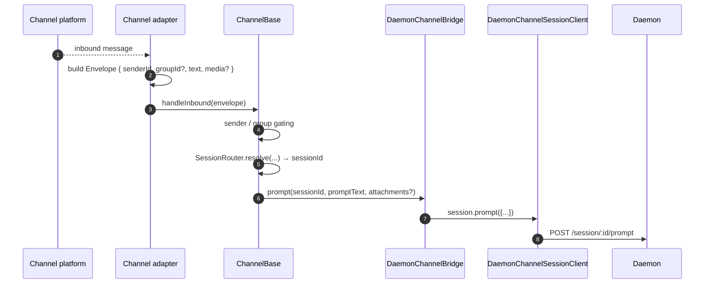
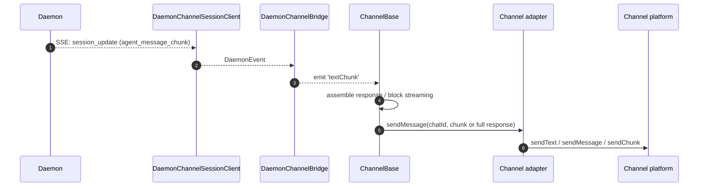
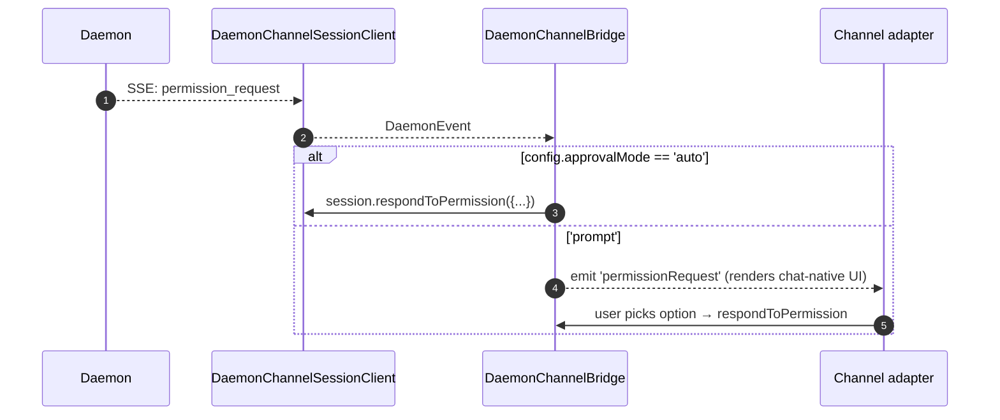

# Adaptateurs de canaux

## Vue d'ensemble

`packages/channels/` contient les **adaptateurs de canaux IM** qui transforment les messages entrants d'une plateforme de chat en prompt pour un agent et renvoient la réponse de l'agent à la plateforme de chat. Quatre canaux concrets sont disponibles aujourd'hui : DingTalk, WeChat (Weixin), Telegram et Feishu. Ils partagent une couche de base (`packages/channels/base/`) et un contrat `ChannelAgentBridge` destiné aux adaptateurs.

Il existe actuellement deux modes d'hébergement :

- `qwen channel start [name]` est le service de canal autonome pris en charge par ACP. Il transmet aux adaptateurs une implémentation `AcpBridge` de `ChannelAgentBridge`.
- `qwen serve --channel <name>` et `qwen serve --channel all` sont des modes expérimentaux gérés par le daemon. `qwen serve` démarre un worker de canal hors processus, le worker se connecte au daemon via le SDK, et les adaptateurs reçoivent une façade `ChannelAgentBridge` basée sur `DaemonChannelBridge`.

En mode géré par le daemon, chaque canal mappe le trafic de chat entrant aux sessions du daemon sous un `SessionScope` configurable (`user`, `thread` ou `single`). L'adaptateur délègue à `DaemonChannelBridge`, qui délègue au `DaemonSessionClient` du SDK (voir [`13-sdk-daemon-client.md`](./13-sdk-daemon-client.md)). Un daemon est lié à un workspace, donc le `cwd` de chaque canal sélectionné doit résoudre vers le workspace du daemon.

## Responsabilités

- Recevoir les messages entrants depuis le transport natif du canal (flux WebSocket DingTalk, long-poll HTTP WeChat, long-poll Telegram Bot, WebSocket ou webhook HTTP Feishu).
- Résoudre `(senderId, groupId?)` en une session de daemon via `DaemonChannelSessionFactory`.
- Transférer le message utilisateur en tant que prompt de daemon et diffuser la réponse en streaming sous forme de messages de chat sortants, potentiellement découpés en chunks.
- Afficher les demandes de permission sous forme de prompts natifs au chat lorsque c'est interactif ; sinon, les approuver automatiquement selon `ChannelConfig.approvalMode`.
- Appliquer le filtrage des expéditeurs (allowlists / denylists), le filtrage des groupes et la normalisation du contenu (markdown / HTML selon le canal).

## Architecture

### `DaemonChannelBridge` (base partagée, `packages/channels/base/src/DaemonChannelBridge.ts`)

```ts
class DaemonChannelBridge extends EventEmitter {
  constructor(opts: {
    cwd: string;
    sessionFactory: DaemonChannelSessionFactory;
    modelServiceId?: string;
    sessionScope?: SessionScope;
  });
  newSession(cwd: string): Promise<string>;
  loadSession(sessionId: string, cwd: string): Promise<string>;
  prompt(sessionId: string, text: string, options?): Promise<string>;
  cancelSession(sessionId: string): Promise<void>;
  stop(): void;
}
```

Contient les clients de session du daemon indexés par `sessionId` du daemon ; `ChannelBase` et `SessionRouter` décident quelle cible de chat entrant correspond à cette session. Chaque session attachée dispose de :

- Un `DaemonChannelSessionClient` (forme de `DaemonSessionClient` sans les méthodes non pertinentes pour le canal).
- Un consumer pump SSE en direct.
- Un assembleur de prompt avec debounce (pour les adaptateurs qui fragmentent la saisie utilisateur sur plusieurs messages entrants).
- Une politique d'approbation automatique par requête.

Événements émis : `textChunk`, `toolCall`, `sessionUpdate`, `permissionRequest`, `permissionResolved`, `modelSwitched`, `modelSwitchFailed`, `sessionDied`, `promptComplete` et `error`. Les adaptateurs de canaux connectent ces événements aux API natives de la plateforme.

### `ChannelBase` (`packages/channels/base/src/ChannelBase.ts`)

Classe de base abstraite que chaque adaptateur étend :

```ts
abstract class ChannelBase {
  abstract connect(): Promise<void>;
  abstract sendMessage(chatId: string, text: string): Promise<void>;
  abstract disconnect(): void;
  handleInbound(envelope: Envelope): Promise<void>; // → SessionRouter.resolve + bridge.prompt
}
```

Gère les préoccupations transversales communes : filtrage des expéditeurs (allowlist / denylist), filtrage des groupes, streaming des blocs de messages (taille des chunks, throttling), debounce entrant.

### Adaptateurs par canal

| Adaptateur      | Fichier                                             | Transport                                              | Notes                                                                                                        |
| --------------- | --------------------------------------------------- | ------------------------------------------------------ | ------------------------------------------------------------------------------------------------------------ |
| DingTalk        | `packages/channels/dingtalk/src/DingtalkAdapter.ts` | DingTalk Stream SDK WebSocket                          | Envoie via POST `sessionWebhook` ; les images média sont téléchargées via l'API DT, en base64 dans l'envelope.                     |
| WeChat (Weixin) | `packages/channels/weixin/src/WeixinAdapter.ts`     | iLink Bot HTTP long-poll                               | Envoie via l'API propriétaire `sendText` / `sendImage` ; indicateurs de frappe.                                       |
| Telegram        | `packages/channels/telegram/src/TelegramAdapter.ts` | Telegram Bot API long-poll (grammy)                    | Envoie des chunks HTML via `sendMessage`.                                                                         |
| Feishu          | `packages/channels/feishu/src/FeishuAdapter.ts`     | Feishu/Lark Stream WebSocket (par défaut) ou HTTP webhook | Envoie via le SDK Lark sous forme de cartes interactives ; le mode webhook nécessite `encryptKey` pour la vérification de la signature HMAC. |

Chaque adaptateur implémente :

1. Le transport entrant (abonnement / polling pour les messages).
2. La construction de l'envelope (`{ senderId, groupId?, text, media?, raw }`).
3. Le filtrage des expéditeurs / groupes (délégué à `ChannelBase`).
4. La sérialisation sortante (markdown → HTML / natif WeChat / natif DingTalk).
5. Le cycle de vie (start / shutdown).

### Matrice des adaptateurs

| Adaptateur   | Transport                       | Identité                                                 | UX de permission                       | Config d'auto-approbation                               |
| ------------ | ------------------------------- | -------------------------------------------------------- | ----------------------------------- | ------------------------------------------------- |
| **DingTalk** | WebSocket stream                | `senderStaffId` (+ `conversationId` optionnel pour les groupes) | Boutons inline via markdown DT      | `ChannelConfig.approvalMode = 'auto' \| 'prompt'` |
| **WeChat**   | HTTP long-poll                  | `senderWxid` (+ `groupWxid` optionnel)                    | Prompts en texte seul avec reply tokens | Identique                                              |
| **Telegram** | Bot API long-poll               | `from.id` (+ `chat.id` optionnel pour les groupes)              | Boutons de clavier inline             | Identique                                              |
| **Feishu**   | WebSocket stream / HTTP webhook | `sender.open_id` (+ `chat_id` optionnel pour les groupes)       | Boutons de cartes interactives            | Identique                                              |

> **Note :** La colonne "UX de permission" décrit l'approche native de chaque plateforme, mais aucune n'est encore câblée — `AcpBridge.requestPermission` approuve actuellement automatiquement chaque requête (`packages/channels/base/src/AcpBridge.ts`), et `ChannelConfig.approvalMode` est déclaré mais pas encore lu. L'approbation interactive est prévue (Phase 5).

## Workflow

### Prompt entrant



### Flux sortant piloté par SSE



### Auto-approbation des permissions



## État et cycle de vie

- `DaemonChannelBridge` vit pendant toute la durée de vie de l'adaptateur de canal ; les sessions à l'intérieur vivent selon le `SessionScope` configuré.
- Chaque session active se reconnecte automatiquement si le SSE est interrompu — `DaemonSessionClient.events()` suit `lastSeenEventId` pour que le replay soit correct.
- `shutdown()` ferme chaque session active et le transport sous-jacent (WebSocket / long-poll du canal).
- Le flux WebSocket de DingTalk prend en charge le server-push ; le long-poll de WeChat nécessite une stratégie de backoff sur les réponses inactives ; le long-poll de Telegram a un paramètre `timeout` intégré.

## Dépendances

- `packages/channels/base/` — `ChannelBase`, `DaemonChannelBridge`, `types.ts` (`ChannelConfig`, `Envelope`, `SessionScope`, `ChannelPlugin`).
- `packages/sdk-typescript/src/daemon/` — `DaemonSessionClient` et associés.
- SDKs par canal : `@dingtalk/stream` (DingTalk), HTTP iLink Bot propriétaire (Weixin), `grammy` (Telegram).

## Configuration

`ChannelConfig` (depuis `packages/channels/base/src/types.ts`) :

| Paramètre                                  | Effet                                                                                                    |
| ---------------------------------------- | --------------------------------------------------------------------------------------------------------- |
| `sessionScope`                           | `'user'` (expéditeur + chat), `'thread'` (thread id ou chat) ou `'single'` (une session partagée par canal). |
| `approvalMode`                           | `'auto'` (réponse automatique) / `'prompt'` (affichage de l'UI).                                                         |
| `allowlist?: string[]`                   | IDs des expéditeurs autorisés ; vide = ouvert à tous.                                                                       |
| `denylist?: string[]`                    | IDs des expéditeurs refusés.                                                                                        |
| `chunkSize`, `chunkIntervalMs`           | Paramètres de streaming des blocs sortants.                                                                        |
| `daemon: { baseUrl, token?, clientId? }` | Transmis à `DaemonChannelSessionFactory`.                                                               |

Des clés spécifiques au canal s'ajoutent par-dessus (DingTalk : `streamCredentials` ; WeChat : `ilinkUrl`, `botId` ; Telegram : `botToken` ; Feishu : `clientId` (appId), `clientSecret` (appSecret), `verificationToken`, `encryptKey` (mode webhook)).

## Mises en garde et limites connues

- **Les canaux n'importent pas directement `@qwen-code/sdk`.** Ils passent par `ChannelBase` → `DaemonChannelBridge` → `DaemonChannelSessionClient` (que le bridge construit à partir du SDK). Cette indirection permet au bridge de changer d'implémentation, comme un stub de test, sans nécessiter de modifications dans les canaux.
- **L'UX de permission est spécifique à chaque canal.** DingTalk utilise des boutons markdown ; WeChat est en texte seul ; Telegram utilise des claviers inline ; Feishu utilise des boutons de cartes interactives. (Tous approuvent actuellement automatiquement via `AcpBridge` ; l'approbation interactive est prévue.) Il n'y a pas encore d'abstraction commune de "widget de permission interactif".
- **L'auto-approbation est une décision côté déploiement**, et non côté daemon. La politique `permission_mediation` du daemon s'applique toujours ; l'auto-approbation signifie simplement que le canal répond sans solliciter l'humain. Ne combinez pas `auto` avec des workflows de niveau `enforce`.
- **Les rate limits et limites de taille des messages par canal sont gérées par l'adaptateur.** `DaemonChannelBridge` gère uniquement le chunking ; dépasser la taille maximale par message de WeChat ou la limite de flood de Telegram relève de l'adaptateur.
- **Pas d'appel inverse DingTalk / WeChat / Telegram / Feishu** — les canaux sont unidirectionnels (chat → daemon → chat). Le chemin de push natif de la plateforme IM, comme un callback de carte DingTalk, n'est pas encore câblé au bridge.

## Références

- `packages/channels/base/src/DaemonChannelBridge.ts`
- `packages/channels/base/src/ChannelBase.ts`
- `packages/channels/base/src/types.ts`
- `packages/channels/dingtalk/src/DingtalkAdapter.ts`
- `packages/channels/weixin/src/WeixinAdapter.ts`
- `packages/channels/telegram/src/TelegramAdapter.ts`
- `packages/channels/plugin-example/` (scaffold de plugin de référence)
- Guide des plugins de canal : [`../channel-plugins.md`](../channel-plugins.md).
- Référence du SDK : [`13-sdk-daemon-client.md`](./13-sdk-daemon-client.md).