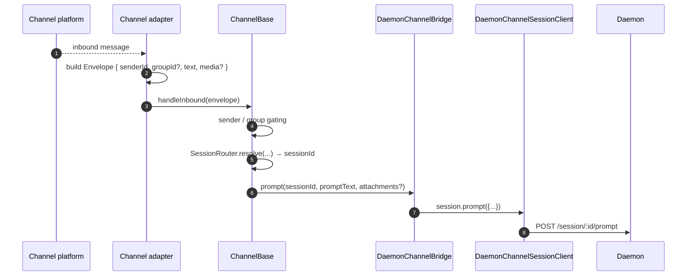
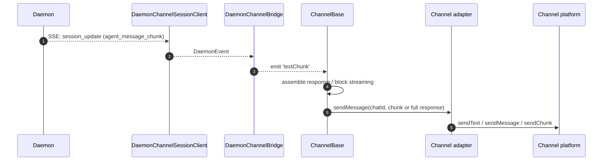
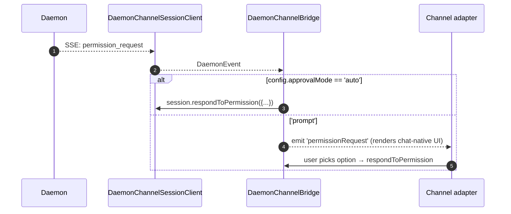

# Adaptateurs de canaux

## Aperçu

`packages/channels/` contient les **adaptateurs de canaux de messagerie instantanée (IM)** qui transforment un message entrant d'une plateforme de chat en une invite (prompt) pour le daemon, et les événements sortants du daemon en messages pour la plateforme de chat. Quatre canaux concrets sont livrés aujourd'hui : DingTalk, WeChat (Weixin), Telegram et Feishu. Ils partagent une couche de base (`packages/channels/base/`) ainsi qu'un `DaemonChannelBridge` qui gère le multiplexage des sessions et la consommation SSE.

Chaque canal mappe le trafic de chat entrant vers des sessions du daemon sous un `SessionScope` configurable (`user`, `thread` ou `single`). L'adaptateur délègue à `DaemonChannelBridge`, qui délègue au `DaemonSessionClient` du SDK (voir [`13-sdk-daemon-client.md`](./13-sdk-daemon-client.md)).

## Responsabilités

- Recevoir les messages entrants depuis le transport natif du canal (flux WebSocket DingTalk, long-poll HTTP WeChat, long-poll Telegram Bot, WebSocket Feishu ou webhook HTTP).
- Résoudre `(senderId, groupId?)` en une session du daemon via `DaemonChannelSessionFactory`.
- Transmettre le message utilisateur comme une invite du daemon et diffuser la réponse en retour sous forme de messages de chat sortants, éventuellement fragmentés.
- Afficher les demandes d'autorisation comme des invites natives du chat lorsqu'elles sont interactives ; sinon, les approuver automatiquement selon `ChannelConfig.approvalMode`.
- Appliquer le filtrage de l'expéditeur (listes d'autorisation / listes de blocage), le filtrage de groupe et la normalisation du contenu (markdown / HTML par canal).

## Architecture

### `DaemonChannelBridge` (base partagée, `packages/channels/base/src/DaemonChannelBridge.ts`)

```ts
class DaemonChannelBridge extends EventEmitter {
  constructor(opts: {
    cwd: string;
    sessionFactory: DaemonChannelSessionFactory;
    modelServiceId?: string;
    sessionScope?: SessionScope;
  });
  newSession(cwd: string): Promise<string>;
  loadSession(sessionId: string, cwd: string): Promise<string>;
  prompt(sessionId: string, text: string, options?): Promise<string>;
  cancelSession(sessionId: string): Promise<void>;
  stop(): void;
}
```

Contient des clients de session du daemon indexés par `sessionId` du daemon ; `ChannelBase` et `SessionRouter` décident quelle cible de chat entrant est mappée à cette session. Chaque session attachée possède :

- Un `DaemonChannelSessionClient` (forme de `DaemonSessionClient` moins les méthodes non pertinentes pour le canal).
- Un mécanisme de consommation SSE en direct.
- Un assembleur d'invites avec anti-rebond (pour les adaptateurs qui fragmentent l'entrée utilisateur sur plusieurs messages entrants).
- Une politique d'approbation automatique par demande.

Événements émis : `textChunk`, `toolCall`, `sessionUpdate`, `permissionRequest`, `permissionResolved`, `modelSwitched`, `modelSwitchFailed`, `sessionDied`, `promptComplete` et `error`. Les adaptateurs de canaux connectent ces événements aux API natives de la plateforme.

### `ChannelBase` (`packages/channels/base/src/ChannelBase.ts`)

Classe de base abstraite que chaque adaptateur étend :

```ts
abstract class ChannelBase {
  abstract connect(): Promise<void>;
  abstract sendMessage(chatId: string, text: string): Promise<void>;
  abstract disconnect(): void;
  handleInbound(envelope: Envelope): Promise<void>; // → SessionRouter.resolve + bridge.prompt
}
```

Gère les préoccupations transversales communes : filtrage de l'expéditeur (liste d'autorisation / liste de blocage), filtrage de groupe, diffusion de blocs de messages (taille de fragment, limitation), anti-rebond entrant.

### Adaptateurs par canal

| Adaptateur       | Fichier                                              | Transport                                                                                              | Notes                                                                                                                   |
| ---------------- | ---------------------------------------------------- | ------------------------------------------------------------------------------------------------------ | ----------------------------------------------------------------------------------------------------------------------- |
| DingTalk         | `packages/channels/dingtalk/src/DingtalkAdapter.ts` | WebSocket du SDK DingTalk Stream                                                                       | Envoie via POST `sessionWebhook` ; les images médias sont téléchargées via l'API DT, base64 dans l'enveloppe.            |
| WeChat (Weixin)  | `packages/channels/weixin/src/WeixinAdapter.ts`     | HTTP long-poll du bot iLink                                                                            | Envoie via les API propriétaires `sendText` / `sendImage` ; indicateurs de saisie.                                      |
| Telegram         | `packages/channels/telegram/src/TelegramAdapter.ts` | Long-poll de l'API Telegram Bot (grammy)                                                               | Envoie des fragments HTML via `sendMessage`.                                                                            |
| Feishu           | `packages/channels/feishu/src/FeishuAdapter.ts`     | WebSocket Stream Feishu/Lark (par défaut) ou webhook HTTP                                              | Envoie via le SDK Lark sous forme de cartes interactives ; le mode webhook nécessite `encryptKey` pour la vérification de signature HMAC. |

Chaque adaptateur implémente :

1. Transport entrant (abonnement / interrogation pour les messages).
2. Construction de l'enveloppe (`{ senderId, groupId?, text, media?, raw }`).
3. Filtrage de l'expéditeur / du groupe (délègue à `ChannelBase`).
4. Sérialisation sortante (markdown → HTML / natif WeChat / natif DingTalk).
5. Cycle de vie (démarrage / arrêt).

### Matrice des adaptateurs
| Adaptateur   | Transport                     | Identité                                                 | UX d'autorisation             | Configuration d'approbation automatique |
| ------------ | ----------------------------- | -------------------------------------------------------- | ----------------------------- | --------------------------------------- |
| **DingTalk** | Flux WebSocket                | `senderStaffId` (+ facultatif `conversationId` pour les groupes) | Boutons en ligne via le markdown DT | `ChannelConfig.approvalMode = 'auto' \| 'prompt'` |
| **WeChat**   | Long-poll HTTP                | `senderWxid` (+ facultatif `groupWxid`)                  | Invites textuelles avec jetons de réponse | Identique                                |
| **Telegram** | Long-poll de l'API Bot        | `from.id` (+ facultatif `chat.id` pour les groupes)      | Boutons de clavier en ligne    | Identique                                |
| **Feishu**   | Flux WebSocket / webhook HTTP | `sender.open_id` (+ facultatif `chat_id` pour les groupes) | Boutons de carte interactifs  | Identique                                |

> **Note :** La colonne « UX d'autorisation » décrit les moyens natifs de chaque plateforme, mais aucun n'est encore implémenté — `AcpBridge.requestPermission` approuve actuellement toutes les demandes automatiquement (`packages/channels/base/src/AcpBridge.ts`), et `ChannelConfig.approvalMode` est déclaré mais pas encore lu. L'approbation interactive est prévue (phase 5).

## Workflow

### Requête entrante



### Réponse sortante pilotée par SSE



### Approbation automatique



## État et cycle de vie

- `DaemonChannelBridge` vit aussi longtemps que l'adaptateur de canal ; les sessions qu'il contient vivent selon la `SessionScope` configurée.
- Chaque session active se reconnecte automatiquement si la connexion SSE est perdue — `DaemonSessionClient.events()` conserve `lastSeenEventId` pour que la relecture soit correcte.
- `shutdown()` ferme chaque session active et le transport sous-jacent (WebSocket / long-poll du canal).
- Le flux WebSocket de DingTalk fonctionne avec « push serveur » ; le long-poll de WeChat nécessite une stratégie de backoff sur les réponses inactives ; le long-poll de Telegram intègre un paramètre `timeout`.

## Dépendances

- `packages/channels/base/` — `ChannelBase`, `DaemonChannelBridge`, `types.ts` (`ChannelConfig`, `Envelope`, `SessionScope`, `ChannelPlugin`).
- `packages/sdk-typescript/src/daemon/` — `DaemonSessionClient` et compagnie.
- Kits SDK par canal : `@dingtalk/stream` (DingTalk), l'API HTTP iLink Bot propriétaire (Weixin), `grammy` (Telegram).

## Configuration

`ChannelConfig` (depuis `packages/channels/base/src/types.ts`) :

| Réglage                                   | Effet                                                                                                                |
| ----------------------------------------- | -------------------------------------------------------------------------------------------------------------------- |
| `sessionScope`                            | `'user'` (expéditeur + chat), `'thread'` (ID de fil ou chat) ou `'single'` (une session partagée par canal).         |
| `approvalMode`                            | `'auto'` (réponse automatique) / `'prompt'` (afficher une interface).                                                |
| `allowlist?: string[]`                    | Identifiants d'expéditeurs autorisés ; absent = ouvert.                                                              |
| `denylist?: string[]`                     | Identifiants d'expéditeurs refusés.                                                                                  |
| `chunkSize`, `chunkIntervalMs`            | Paramètres de diffusion par blocs sortants.                                                                          |
| `daemon: { baseUrl, token?, clientId? }` | Transmis à `DaemonChannelSessionFactory`.                                                                             |
Les clés propres à chaque canal viennent se superposer (DingTalk : `streamCredentials` ; WeChat : `ilinkUrl`, `botId` ; Telegram : `botToken` ; Feishu : `clientId` (appId), `clientSecret` (appSecret), `verificationToken`, `encryptKey` (mode webhook)).

## Mises en garde & limites connues

- **Les canaux n'importent pas directement `@qwen-code/sdk`.** Ils passent par `ChannelBase` → `DaemonChannelBridge` → `DaemonChannelSessionClient` (que le pont construit à partir du SDK). Cette indirection permet au pont de permuter les implémentations (par exemple, un bouchon de test) sans nécessiter de modification des canaux.
- **L'UX des permissions est propre à chaque canal.** DingTalk utilise des boutons Markdown ; WeChat est textuel uniquement ; Telegram emploie des claviers en ligne ; Feishu utilise des boutons de cartes interactives. (Tous approuvent actuellement automatiquement via `AcpBridge` ; l'approbation interactive est planifiée.) Il n'existe pas encore d’abstraction commune de « widget de permission interactif ».
- **L'approbation automatique est une décision côté déploiement**, pas côté démon. La politique `permission_mediation` du démon s'applique toujours ; l'approbation automatique signifie seulement que le canal répond sans solliciter l'humain. Ne pas combiner `auto` avec des workflows de niveau `enforce`.
- **Les limites de taux et de taille de message propres à chaque canal relèvent de l'adaptateur.** `DaemonChannelBridge` ne gère que le découpage ; dépasser la limite de taille par message de WeChat ou la limite de débit de Telegram incombe à l'adaptateur.
- **Aucun rappel inverse (reverse-call) DingTalk / WeChat / Telegram / Feishu** — les canaux sont unidirectionnels (chat → démon → chat). Le chemin de notification natif de la plateforme de messagerie (par exemple, un rappel de carte DingTalk) n'est pas encore connecté au pont.

## Références

- `packages/channels/base/src/DaemonChannelBridge.ts`
- `packages/channels/base/src/ChannelBase.ts`
- `packages/channels/base/src/types.ts`
- `packages/channels/dingtalk/src/DingtalkAdapter.ts`
- `packages/channels/weixin/src/WeixinAdapter.ts`
- `packages/channels/telegram/src/TelegramAdapter.ts`
- `packages/channels/plugin-example/` (scaffold de plugin de référence)
- Guide des plugins de canal : [`../channel-plugins.md`](../channel-plugins.md).
- Référence SDK : [`13-sdk-daemon-client.md`](./13-sdk-daemon-client.md).
