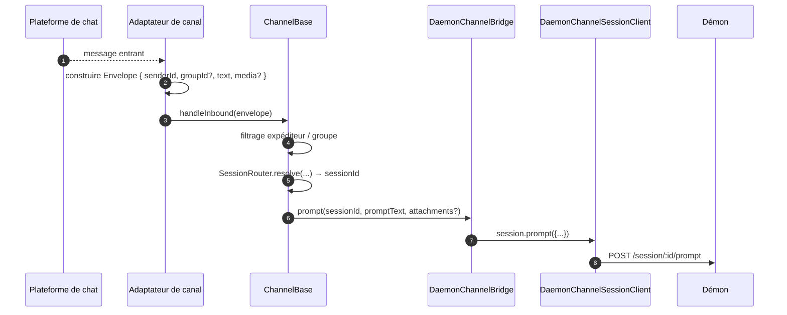
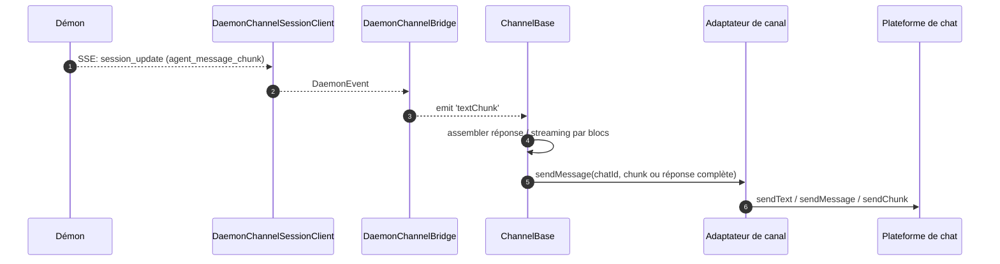
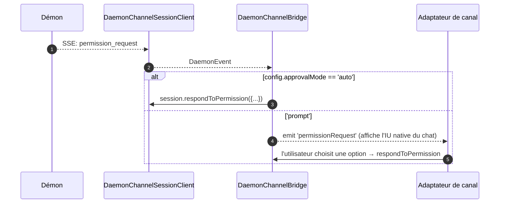

# Adaptateurs de canaux

## Vue d'ensemble

`packages/channels/` contient les **adaptateurs de canaux de messagerie instantanée (IM)** qui transforment un message entrant d'une plateforme de chat en un prompt pour le démon et les événements sortants du démon en messages de la plateforme de chat. Quatre canaux concrets sont fournis aujourd'hui : DingTalk, WeChat (Weixin), Telegram et Feishu. Ils partagent une couche de base (`packages/channels/base/`) ainsi qu'un `DaemonChannelBridge` qui gère le multiplexage des sessions et la consommation SSE.

Chaque canal associe le trafic de chat entrant à des sessions du démon sous un `SessionScope` configurable (`user`, `thread` ou `single`). L'adaptateur délègue à `DaemonChannelBridge`, qui délègue à `DaemonSessionClient` du SDK (voir [`13-sdk-daemon-client.md`](./13-sdk-daemon-client.md)).

## Responsabilités

- Recevoir les messages entrants depuis le transport natif du canal (flux WebSocket DingTalk, long-poll HTTP WeChat, long-poll Bot Telegram, WebSocket Feishu ou webhook HTTP).
- Résoudre `(senderId, groupId?)` en une session du démon via `DaemonChannelSessionFactory`.
- Transférer le message utilisateur comme un prompt du démon et diffuser la réponse sous forme de messages de chat sortants, éventuellement fragmentés.
- Afficher les demandes d'autorisation comme des invites natives du chat lorsqu'elles sont interactives ; sinon, approuver automatiquement selon `ChannelConfig.approvalMode`.
- Appliquer le filtrage de l'expéditeur (listes autorisées / listes bloquées), le filtrage de groupe, et la normalisation du contenu (markdown / HTML par canal).

## Architecture

### `DaemonChannelBridge` (base partagée, `packages/channels/base/src/DaemonChannelBridge.ts`)

```ts
class DaemonChannelBridge extends EventEmitter {
  constructor(opts: {
    cwd: string;
    sessionFactory: DaemonChannelSessionFactory;
    modelServiceId?: string;
    sessionScope?: SessionScope;
  });
  newSession(cwd: string): Promise<string>;
  loadSession(sessionId: string, cwd: string): Promise<string>;
  prompt(sessionId: string, text: string, options?): Promise<string>;
  cancelSession(sessionId: string): Promise<void>;
  stop(): void;
}
```

Contient les clients de sessions du démon indexés par `sessionId` du démon ; `ChannelBase` et `SessionRouter` déterminent quelle cible de chat entrante correspond à cette session. Chaque session attachée possède :

- Un `DaemonChannelSessionClient` (forme de `DaemonSessionClient` sans les méthodes non pertinentes pour le canal).
- Une pompe de consommation SSE active.
- Un assembleur de prompt avec debounce (pour les adaptateurs qui fragmentent l'entrée utilisateur en plusieurs messages entrants).
- Une politique d'auto-approbation par requête.

Événements émis : `textChunk`, `toolCall`, `sessionUpdate`, `permissionRequest`, `permissionResolved`, `modelSwitched`, `modelSwitchFailed`, `sessionDied`, `promptComplete`, et `error`. Les adaptateurs de canaux connectent ces événements aux API natives de la plateforme.

### `ChannelBase` (`packages/channels/base/src/ChannelBase.ts`)

Classe de base abstraite que chaque adaptateur étend :

```ts
abstract class ChannelBase {
  abstract connect(): Promise<void>;
  abstract sendMessage(chatId: string, text: string): Promise<void>;
  abstract disconnect(): void;
  handleInbound(envelope: Envelope): Promise<void>; // → SessionRouter.resolve + bridge.prompt
}
```

Gère les préoccupations transversales communes : filtrage de l'expéditeur (liste autorisée / liste bloquée), filtrage de groupe, streaming par blocs de messages (taille des fragments, limitation), debounce des entrées.

### Adaptateurs par canal

| Adaptateur      | Fichier                                               | Transport                                              | Notes                                                                                                        |
| --------------- | ----------------------------------------------------- | ------------------------------------------------------ | ------------------------------------------------------------------------------------------------------------ |
| DingTalk        | `packages/channels/dingtalk/src/DingtalkAdapter.ts` | SDK Stream DingTalk WebSocket                          | Envoie via `sessionWebhook` POST ; les images média téléchargées via l'API DT, base64 dans l'enveloppe.                     |
| WeChat (Weixin) | `packages/channels/weixin/src/WeixinAdapter.ts`     | iLink Bot HTTP long-poll                               | Envoie via l'API propriétaire `sendText` / `sendImage` ; indicateurs de saisie.                                       |
| Telegram        | `packages/channels/telegram/src/TelegramAdapter.ts` | API Bot Telegram long-poll (grammy)                    | Envoie des fragments HTML via `sendMessage`.                                                                         |
| Feishu          | `packages/channels/feishu/src/FeishuAdapter.ts`     | WebSocket Stream Feishu/Lark (par défaut) ou webhook HTTP | Envoie via le SDK Lark sous forme de cartes interactives ; le mode webhook nécessite `encryptKey` pour la vérification de signature HMAC. |

Chaque adaptateur implémente :

1. Transport entrant (souscrire / interroger les messages).
2. Construction de l'enveloppe (`{ senderId, groupId?, text, media?, raw }`).
3. Filtrage de l'expéditeur / groupe (délègue à `ChannelBase`).
4. Sérialisation sortante (markdown → HTML / natif WeChat / natif DingTalk).
5. Cycle de vie (démarrage / arrêt).

### Matrice des adaptateurs

| Adaptateur    | Transport                       | Identité                                                 | UX d'autorisation                       | Configuration d'auto-approbation                               |
| ------------ | ------------------------------- | -------------------------------------------------------- | ----------------------------------- | ------------------------------------------------- |
| **DingTalk** | Flux WebSocket                  | `senderStaffId` (+ optionnel `conversationId` pour les groupes) | Boutons en ligne via markdown DT      | `ChannelConfig.approvalMode = 'auto' \| 'prompt'` |
| **WeChat**   | Long-poll HTTP                  | `senderWxid` (+ optionnel `groupWxid`)                    | Invites textuelles avec tokens de réponse | Identique                                              |
| **Telegram** | Long-poll via Bot API           | `from.id` (+ optionnel `chat.id` pour les groupes)              | Boutons de clavier en ligne             | Identique                                              |
| **Feishu**   | Flux WebSocket / webhook HTTP | `sender.open_id` (+ optionnel `chat_id` pour les groupes)       | Boutons de carte interactifs            | Identique                                              |

> **Remarque :** La colonne "UX d'autorisation" décrit les capacités natives de chaque plateforme, mais aucune n'est encore implémentée — `AcpBridge.requestPermission` approuve actuellement automatiquement toutes les demandes (`packages/channels/base/src/AcpBridge.ts`), et `ChannelConfig.approvalMode` est déclaré mais pas encore lu. L'approbation interactive est prévue (Phase 5).

## Workflow

### Prompt entrant



### Sortie pilotée par SSE



### Auto-approbation des autorisations



## État et cycle de vie

- `DaemonChannelBridge` vit pendant toute la durée de vie de l'adaptateur de canal ; les sessions qu'il contient vivent selon le `SessionScope` configuré.
- Chaque session active se reconnecte automatiquement si la connexion SSE est interrompue — `DaemonSessionClient.events()` suit `lastSeenEventId` pour garantir une relecture correcte.
- `shutdown()` ferme chaque session active et le transport sous-jacent (WebSocket / long-poll du canal).
- Le flux WebSocket de DingTalk prend en charge le push serveur ; le long-poll de WeChat nécessite une stratégie de backoff sur les réponses inactives ; le long-poll de Telegram intègre un paramètre `timeout`.

## Dépendances

- `packages/channels/base/` — `ChannelBase`, `DaemonChannelBridge`, `types.ts` (`ChannelConfig`, `Envelope`, `SessionScope`, `ChannelPlugin`).
- `packages/sdk-typescript/src/daemon/` — `DaemonSessionClient` et compagnie.
- SDK par canal : `@dingtalk/stream` (DingTalk), HTTP iLink Bot propriétaire (Weixin), `grammy` (Telegram).

## Configuration

`ChannelConfig` (depuis `packages/channels/base/src/types.ts`) :

| Paramètre                               | Effet                                                                                                    |
| ---------------------------------------- | --------------------------------------------------------------------------------------------------------- |
| `sessionScope`                           | `'user'` (expéditeur + chat), `'thread'` (id du fil ou chat), ou `'single'` (une session partagée par canal). |
| `approvalMode`                           | `'auto'` (réponse automatique) / `'prompt'` (afficher l'IU).                                                         |
| `allowlist?: string[]`                   | Identifiants d'expéditeurs autorisés ; absent = ouvert.                                                                       |
| `denylist?: string[]`                    | Identifiants d'expéditeurs bloqués.                                                                                        |
| `chunkSize`, `chunkIntervalMs`           | Paramètres de streaming sortant par blocs.                                                                        |
| `daemon: { baseUrl, token?, clientId? }` | Transmis à `DaemonChannelSessionFactory`.                                                               |

Les clés spécifiques au canal s'ajoutent par-dessus (DingTalk : `streamCredentials` ; WeChat : `ilinkUrl`, `botId` ; Telegram : `botToken` ; Feishu : `clientId` (appId), `clientSecret` (appSecret), `verificationToken`, `encryptKey` (mode webhook)).

## Mises en garde et limites connues

- **Les canaux n'importent pas directement `@qwen-code/sdk`.** Ils passent par `ChannelBase` → `DaemonChannelBridge` → `DaemonChannelSessionClient` (que le bridge construit à partir du SDK). Cette indirection permet au bridge d'échanger des implémentations, comme un stub de test, sans nécessiter de modifications des canaux.
- **L'UX d'autorisation est spécifique à chaque canal.** DingTalk utilise des boutons markdown ; WeChat est uniquement textuel ; Telegram utilise des claviers en ligne ; Feishu utilise des boutons de carte interactifs. (Tous sont actuellement en auto-approbation via `AcpBridge` ; l'approbation interactive est prévue.) Il n'existe pas encore d'abstraction commune de "widget d'autorisation interactif".
- **L'auto-approbation est une décision côté déploiement**, non côté démon. La politique `permission_mediation` du démon s'applique toujours ; l'auto-approbation signifie seulement que le canal répond sans inviter l'humain. Ne pas combiner `auto` avec des workflows de niveau `enforce`.
- **Les limites de débit / taille de message par canal sont de la responsabilité de l'adaptateur.** `DaemonChannelBridge` ne gère que le fragmentage ; dépasser la taille par message de WeChat ou la limite de flood de Telegram relève de l'adaptateur.
- **Pas d'appel inverse DingTalk / WeChat / Telegram / Feishu** — les canaux sont unidirectionnels (chat → démon → chat). Le chemin de push natif de la plateforme IM, comme un callback de carte DingTalk, n'est pas encore connecté au bridge.

## Références

- `packages/channels/base/src/DaemonChannelBridge.ts`
- `packages/channels/base/src/ChannelBase.ts`
- `packages/channels/base/src/types.ts`
- `packages/channels/dingtalk/src/DingtalkAdapter.ts`
- `packages/channels/weixin/src/WeixinAdapter.ts`
- `packages/channels/telegram/src/TelegramAdapter.ts`
- `packages/channels/plugin-example/` (scaffold de plugin de référence)
- Guide des plugins de canal : [`../channel-plugins.md`](../channel-plugins.md).
- Référence SDK : [`13-sdk-daemon-client.md`](./13-sdk-daemon-client.md).