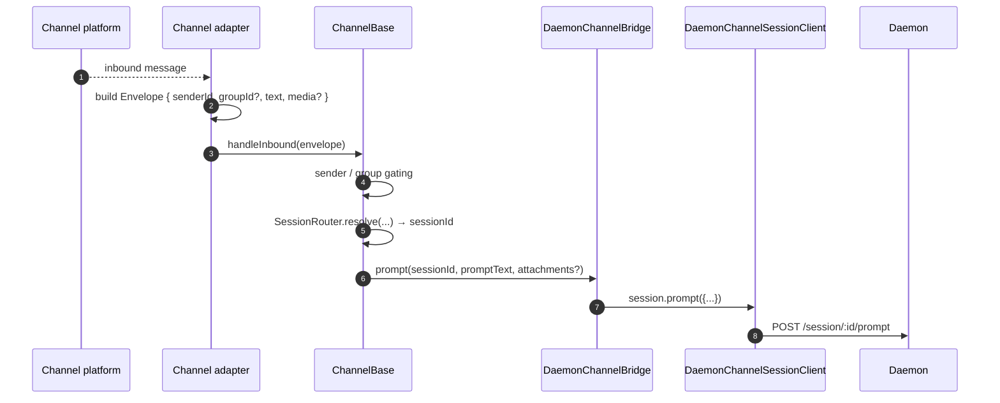
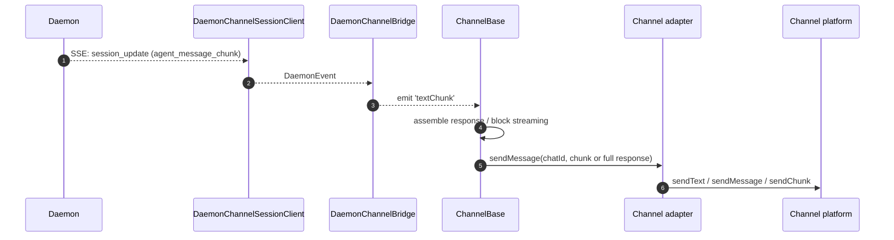
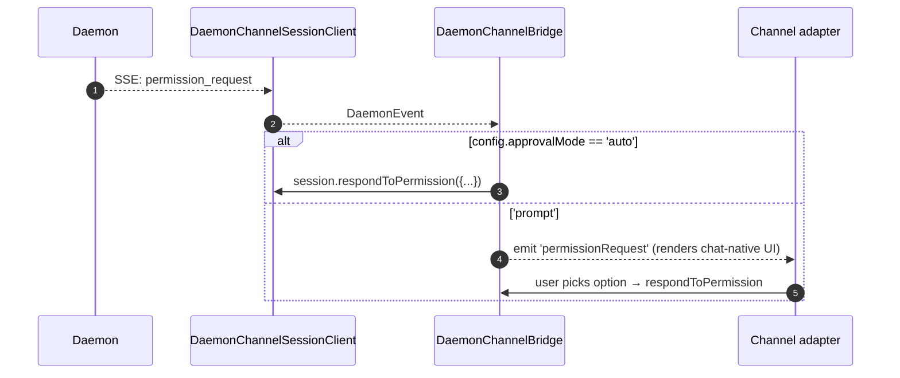

# Adaptateurs de canaux

## Vue d'ensemble

`packages/channels/` contient les **adaptateurs de canaux IM** qui transforment les messages entrants d'une plateforme de chat en prompt pour un agent et renvoient la réponse de l'agent à la plateforme de chat. Quatre canaux concrets sont disponibles aujourd'hui : DingTalk, WeChat (Weixin), Telegram et Feishu. Ils partagent une couche de base (`packages/channels/base/`) et un contrat `ChannelAgentBridge` destiné aux adaptateurs.

Il existe actuellement deux modes d'hébergement :

- `qwen channel start [name]` est le service de canal autonome pris en charge par ACP. Il transmet aux adaptateurs une implémentation `AcpBridge` de `ChannelAgentBridge`.
- `qwen serve --channel <name>` et `qwen serve --channel all` sont des modes expérimentaux gérés par le daemon. Les sélections nommées sont regroupées par workspace propriétaire et `qwen serve` démarre un worker hors processus par runtime propriétaire ; chaque worker se connecte au daemon via le SDK et les adaptateurs reçoivent une façade `ChannelAgentBridge` basée sur `DaemonChannelBridge`. `--channel all` reste une sélection primary uniquement.

En mode géré par le daemon, chaque canal mappe le trafic de chat entrant aux sessions du daemon sous un `SessionScope` configurable (`user`, `chat_thread` ou `single`). La valeur héritée Channel `thread` reste lisible et modifiable pour les configurations existantes, mais les nouvelles configurations Web Shell ne la proposent pas ; ceci est distinct du knob de création de session `single`/`thread` propre au bridge du daemon. La valeur héritée `thread` reste lisible et modifiable pour les configurations existantes, mais les nouvelles configurations Web Shell ne la proposent pas ; ceci est distinct du L'adaptateur délègue à `DaemonChannelBridge`, qui délègue au `DaemonSessionClient` du SDK (voir [`13-sdk-daemon-client.md`](./13-sdk-daemon-client.md)). Chaque canal nommé doit résoudre vers exactement un workspace enregistré et fiable. Le worker utilise le cwd canonique de ce runtime, `QWEN_DAEMON_WORKSPACE` et la surcouche d'environnement ; la résolution de propriété ne fallback jamais vers le primary.

### Tâches de canal déclenchées par webhook

Les tâches déclenchées par webhook sont hébergées par `qwen serve` et exécutées dans le worker de canal géré par le daemon. La route HTTP valide la source et transmet une `ChannelWebhookTask` au worker via IPC. Le worker appelle `ChannelBase.runWebhookTask()`, donc les adaptateurs n'implémentent pas le parsing webhook.

Les adaptateurs participent toujours via le support d'envoi proactif : `supportsProactiveSend()` indique au host si un canal peut envoyer sans message entrant, `supportsProactiveTarget()` gère les limites de livraison pour des formes de cible spécifiques, et `pushProactive()` transporte le contenu sortant.

## Responsabilités

- Recevoir les messages entrants depuis le transport natif du canal (flux WebSocket DingTalk, long-poll HTTP WeChat, long-poll Telegram Bot, WebSocket ou webhook HTTP Feishu).
- Résoudre `(senderId, groupId?)` en une session de daemon via `DaemonChannelSessionFactory`.
- Transférer le message utilisateur en tant que prompt de daemon et diffuser la réponse en streaming sous forme de messages de chat sortants, potentiellement découpés en chunks.
- Afficher les demandes de permission sous forme de prompts natifs au chat lorsque c'est interactif ; sinon, les approuver automatiquement selon `ChannelConfig.approvalMode`.
- Appliquer le filtrage des expéditeurs (allowlists / denylists), le filtrage des groupes et la normalisation du contenu (markdown / HTML selon le canal).

## Architecture

### `DaemonChannelBridge` (base partagée, `packages/channels/base/src/DaemonChannelBridge.ts`)

```ts
class DaemonChannelBridge extends EventEmitter {
  constructor(opts: {
    cwd: string;
    sessionFactory: DaemonChannelSessionFactory;
    modelServiceId?: string;
    sessionScope?: SessionScope;
  });
  newSession(cwd: string): Promise<string>;
  loadSession(sessionId: string, cwd: string): Promise<string>;
  prompt(sessionId: string, text: string, options?): Promise<string>;
  cancelSession(sessionId: string): Promise<void>;
  stop(): void;
}
```

Contient les clients de session du daemon indexés par `sessionId` du daemon ; `ChannelBase` et `SessionRouter` décident quelle cible de chat entrant correspond à cette session. Chaque session attachée dispose de :

- Un `DaemonChannelSessionClient` (forme de `DaemonSessionClient` sans les méthodes non pertinentes pour le canal).
- Un consumer pump SSE en direct.
- Un assembleur de prompt avec debounce (pour les adaptateurs qui fragmentent la saisie utilisateur sur plusieurs messages entrants).
- Une politique d'approbation automatique par requête.

Événements émis : `textChunk`, `toolCall`, `sessionUpdate`, `permissionRequest`, `permissionResolved`, `modelSwitched`, `modelSwitchFailed`, `sessionDied`, `promptComplete` et `error`. Les adaptateurs de canaux connectent ces événements aux API natives de la plateforme.

### `ChannelBase` (`packages/channels/base/src/ChannelBase.ts`)

Classe de base abstraite que chaque adaptateur étend :

```ts
abstract class ChannelBase {
  abstract connect(): Promise<void>;
  abstract sendMessage(chatId: string, text: string): Promise<void>;
  abstract disconnect(): void;
  handleInbound(envelope: Envelope): Promise<void>; // → SessionRouter.resolve + bridge.prompt
}
```

Toute la livraison de messages interne passe par `sendThreadMessage(chatId, threadId, text)`. L'implémentation par défaut retombe sur `sendMessage(chatId, text)`, en ignorant `threadId` — les adaptateurs IM ne sont pas affectés. Les adaptateurs de polling (par ex. GitHub) surchargent `sendThreadMessage` pour poster des commentaires sur une issue/PR spécifique via le `threadId`.

Gère les préoccupations transversales communes : filtrage des expéditeurs (allowlist / denylist), filtrage des groupes, streaming des blocs de messages (taille des chunks, throttling), debounce entrant.

### Adaptateurs par canal

| Adaptateur      | Fichier                                             | Transport                                              | Notes                                                                                                        |
| --------------- | --------------------------------------------------- | ------------------------------------------------------ | ------------------------------------------------------------------------------------------------------------ |
| DingTalk        | `packages/channels/dingtalk/src/DingtalkAdapter.ts` | DingTalk Stream SDK WebSocket                          | Envoie via POST `sessionWebhook` ; les images média sont téléchargées via l'API DT, en base64 dans l'envelope. |
| WeChat (Weixin) | `packages/channels/weixin/src/WeixinAdapter.ts`     | iLink Bot HTTP long-poll                               | Envoie via l'API propriétaire `sendText` / `sendImage` ; indicateurs de frappe.                              |
| Telegram        | `packages/channels/telegram/src/TelegramAdapter.ts` | Telegram Bot API long-poll (grammy)                    | Envoie des chunks HTML via `sendMessage`.                                                                    |
| Feishu          | `packages/channels/feishu/src/FeishuAdapter.ts`     | Feishu/Lark Stream WebSocket (par défaut) ou HTTP webhook | Envoie via le SDK Lark sous forme de cartes interactives ; le mode webhook nécessite `encryptKey` pour la vérification de la signature HMAC. |
| GitHub          | `packages/channels/github/src/GithubAdapter.ts`     | GitHub Notifications API polling (`@octokit/rest`)     | Étend `PollingChannelBase` ; déduplication par fenêtre de commentaires basée sur un curseur ; poste des commentaires via l'API Issues. |
| GitLab          | `packages/channels/gitlab/src/GitlabAdapter.ts`     | GitLab Todos API polling (`@gitbeaker/rest`)           | Étend `PollingChannelBase` ; distribue `todo.body` directement ; la config `action_prompt_template` pilote le filtrage d'événements et le rendu des métadonnées. |

Chaque adaptateur implémente :

1. Le transport entrant (abonnement / polling pour les messages).
2. La construction de l'envelope (`{ senderId, groupId?, text, media?, raw }`).
3. Le filtrage des expéditeurs / groupes (délégué à `ChannelBase`).
4. La sérialisation sortante (markdown → HTML / natif WeChat / natif DingTalk).
5. Le cycle de vie (start / shutdown).

### Matrice des adaptateurs

| Adaptateur   | Transport                       | Identité                                                 | UX de permission                       | Config d'auto-approbation                               |
| ------------ | ------------------------------- | -------------------------------------------------------- | ----------------------------------- | ------------------------------------------------- |
| **DingTalk** | WebSocket stream                | `senderStaffId` (+ `conversationId` optionnel pour les groupes) | Boutons inline via markdown DT      | `ChannelConfig.approvalMode = 'auto' \| 'prompt'` |
| **WeChat**   | HTTP long-poll                  | `senderWxid` (+ `groupWxid` optionnel)                    | Prompts en texte seul avec reply tokens | Identique                                              |
| **Telegram** | Bot API long-poll               | `from.id` (+ `chat.id` optionnel pour les groupes)              | Boutons de clavier inline             | Identique                                              |
| **Feishu**   | WebSocket stream / HTTP webhook | `sender.open_id` (+ `chat_id` optionnel pour les groupes)       | Boutons de cartes interactives            | Identique                                              |
| **GitHub**   | Notifications API polling       | `user.id` numérique (immuable ; login résolu à la connexion) | Commentaire d'erreur + re-mention | `senderPolicy: 'allowlist' \| 'open'`             |
| **GitLab**   | Todos API polling               | `author.username` (en minuscules)                           | Log + re-mention                    | `senderPolicy: 'allowlist' \| 'open'`             |

> **Note :** La colonne "UX de permission" décrit l'approche native de chaque plateforme, mais aucune n'est encore câblée — `AcpBridge.requestPermission` approuve actuellement automatiquement chaque requête (`packages/channels/base/src/AcpBridge.ts`), et `ChannelConfig.approvalMode` est déclaré mais pas encore lu. L'approbation interactive est prévue (Phase 5).

## Workflow

### Prompt entrant


```mermaid
sequenceDiagram
    autonumber
    participant CH as Channel platform
    participant AD as Channel adapter
    participant CB as ChannelBase
    participant BR as DaemonChannelBridge
    participant SC as DaemonChannelSessionClient
    participant D as Daemon

    CH-->>AD: inbound message
    AD->>AD: build Envelope { senderId, groupId?, text, media? }
    AD->>CB: handleInbound(envelope)
    CB->>CB: sender / group gating
    CB->>CB: SessionRouter.resolve(...) → sessionId
    CB->>BR: prompt(sessionId, promptText, attachments?)
    BR->>SC: session.prompt({...})
    SC->>D: POST /session/:id/prompt
```

### Flux sortant piloté par SSE


```mermaid
sequenceDiagram
    autonumber
    participant D as Daemon
    participant SC as DaemonChannelSessionClient
    participant BR as DaemonChannelBridge
    participant CB as ChannelBase
    participant AD as Channel adapter
    participant CH as Channel platform

    D-->>SC: SSE: session_update (agent_message_chunk)
    SC-->>BR: DaemonEvent
    BR-->>CB: emit 'textChunk'
    CB->>CB: assemble response / block streaming
    CB->>AD: sendMessage(chatId, chunk or full response)
    AD->>CH: sendText / sendMessage / sendChunk
```

### Auto-approbation des permissions


```mermaid
sequenceDiagram
    autonumber
    participant D as Daemon
    participant SC as DaemonChannelSessionClient
    participant BR as DaemonChannelBridge
    participant AD as Channel adapter

    D-->>SC: SSE: permission_request
    SC-->>BR: DaemonEvent
    alt config.approvalMode == 'auto'
        BR->>SC: session.respondToPermission({...})
    else 'prompt'
        BR-->>AD: emit 'permissionRequest' (renders chat-native UI)
        AD->>BR: user picks option → respondToPermission
    end
```

## État et cycle de vie

- `DaemonChannelBridge` vit pendant toute la durée de vie de l'adaptateur de canal ; les sessions à l'intérieur vivent selon le `SessionScope` configuré.
- Chaque session active se reconnecte automatiquement si le SSE est interrompu — `DaemonSessionClient.events()` suit `lastSeenEventId` pour que le replay soit correct.
- `shutdown()` ferme chaque session active et le transport sous-jacent (WebSocket / long-poll du canal).
- Le flux WebSocket de DingTalk prend en charge le server-push ; le long-poll de WeChat nécessite une stratégie de backoff sur les réponses inactives ; le long-poll de Telegram a un paramètre `timeout` intégré.

### Sélection du runtime et rechargement des paramètres

Le `ChannelWorkerManager` de longue durée possède la sélection commitée du daemon et les superviseurs groupés par workspace. Un daemon peut démarrer sans `--channel` ; le premier `PUT /workspace/channel` à gating strict charge dynamiquement le runtime de canal, réserve le pidfile du service, résout l'appartenance du workspace et démarre les workers sélectionnés. `GET /workspace/channel` lit le snapshot du manager et `DELETE /workspace/channel` l'arrête de manière idempotente. Les helpers SDK sont `getChannelWorkerControl()`, `setChannelWorkerSelection()` et `stopChannelWorker()` ; l'entrée CLI est `qwen channel set` plus les variantes distantes `status` et `stop`.

Le daemon lit les paramètres de canal depuis `settings.json` au démarrage de chaque worker (`packages/cli/src/commands/channel/daemon-worker.ts` → `loadSettings` → `loadChannelsConfig`). `POST /workspace/channel/reload` relit ces paramètres et réconcilie de force la sélection commitée. Toutes les mutations de cycle de vie partagent une seule file FIFO. Les groupes de workspace inchangés survivent au remplacement ordinaire de sélection ; les groupes modifiés s'arrêtent et redémarrent séquentiellement pendant que le bail PID du serve reste détenu.

Si un remplacement échoue, les workers nouvellement démarrés sont arrêtés et les anciens workers sont restaurés avant que la requête ne retourne. Un superviseur qui ne peut pas observer l'arrêt après SIGTERM et SIGKILL conserve sa référence enfant et échoue le stop ; le manager garde le bail PID et ne démarre jamais un second worker. La configuration et le routage webhook ne changent que lorsque le commit de sélection réussit. Les sélections de runtime sont locales au processus et disparaissent au redémarrage du daemon.

Les échecs de `connect()` des adaptateurs sont rapportés séparément des erreurs de cycle de vie des workers. Le worker envoie chaque échec borné et sans credentials via l'IPC de démarrage et attend un accusé de réception du superviseur avant d'essayer l'adaptateur suivant. Un worker partiellement connecté reste en cours d'exécution et expose `startupFailures` dans son snapshot. Si chaque adaptateur d'une tentative dynamique échoue, la réponse `502 channel_worker_start_failed` transporte les échecs tentés annotés par workspace tandis que `state` reflète le résultat du rollback ; les réponses GET ultérieures ne conservent pas la tentative. Le démarrage du daemon sans adaptateur connecté reste fail-fast. Le `code` optionnel de l'adaptateur est purement diagnostique, et la `phase` courante est `connect`.

## Dépendances

- `packages/channels/base/` — `ChannelBase`, `PollingChannelBase`, `DaemonChannelBridge`, `types.ts` (`ChannelConfig`, `Envelope`, `SessionScope`, `ChannelPlugin`).
- `packages/sdk-typescript/src/daemon/` — `DaemonSessionClient` et associés.
- SDKs par canal : `@dingtalk/stream` (DingTalk), HTTP iLink Bot propriétaire (Weixin), `grammy` (Telegram), `@octokit/rest` (polling GitHub), `@gitbeaker/rest` (polling GitLab).

## Configuration

`ChannelConfig` (depuis `packages/channels/base/src/types.ts`) :

| Knob                                       | Effet                                                                                                    |
| ---------------------------------------- | --------------------------------------------------------------------------------------------------------- |
| `sessionScope`                           | `'user'` (expéditeur + chat), `'chat_thread'` (canal + chatId + threadId), ou `'single'` (une session partagée par canal). L'ancien `'thread'` est préservé lorsqu'il est déjà configuré mais n'est pas proposé pour les nouvelles configurations Web Shell. |
| `multiSession`                           | Tâches nommées daemon-only pour `sessionScope: 'user'`. Le catalogue propriétaire est persisté sous le répertoire d'état workspace/canal ; les webhooks, le backfill d'historique de groupe, les boucles, le changement de tâche en cours d'exécution et les worktrees par tâche sont exclus dans la Partie 2. |
| `approvalMode`                           | `'auto'` (réponse automatique) / `'prompt'` (affichage de l'UI).                                                         |
| `allowlist?: string[]`                   | IDs des expéditeurs autorisés ; vide = ouvert à tous.                                                                       |
| `denylist?: string[]`                    | IDs des expéditeurs refusés.                                                                                        |
| `chunkSize`, `chunkIntervalMs`           | Paramètres de streaming des blocs sortants.                                                                        |
| `daemon: { baseUrl, token?, clientId? }` | Transmis à `DaemonChannelSessionFactory`.                                                               |

Des clés spécifiques au canal s'ajoutent par-dessus (DingTalk : `streamCredentials` ; WeChat : `ilinkUrl`, `botId` ; Telegram : `botToken` ; Feishu : `clientId` (appId), `clientSecret` (appSecret), `verificationToken`, `encryptKey` (mode webhook)).

## Mises en garde et limites connues

- **Les canaux n'importent pas directement `@qwen-code/sdk`.** Ils passent par `ChannelBase` → `DaemonChannelBridge` → `DaemonChannelSessionClient` (que le bridge construit à partir du SDK). Cette indirection permet au bridge de changer d'implémentation, comme un stub de test, sans nécessiter de modifications dans les canaux.
- **L'UX de permission est spécifique à chaque canal.** DingTalk utilise des boutons markdown ; WeChat est en texte seul ; Telegram utilise des claviers inline ; Feishu utilise des boutons de cartes interactives. (Tous approuvent actuellement automatiquement via `AcpBridge` ; l'approbation interactive est prévue.) Il n'y a pas encore d'abstraction commune de "widget de permission interactif".
- **L'auto-approbation est une décision côté déploiement**, et non côté daemon. La politique `permission_mediation` du daemon s'applique toujours ; l'auto-approbation signifie simplement que le canal répond sans solliciter l'humain. Ne combinez pas `auto` avec des workflows de niveau `enforce`.
- **Les rate limits et limites de taille des messages par canal sont gérées par l'adaptateur.** `DaemonChannelBridge` gère uniquement le chunking ; dépasser la taille maximale par message de WeChat ou la limite de flood de Telegram relève de l'adaptateur.
- **Pas d'appel inverse DingTalk / WeChat / Telegram / Feishu** — les canaux sont unidirectionnels (chat → daemon → chat). Le chemin de push natif de la plateforme IM, comme un callback de carte DingTalk, n'est pas encore câblé au bridge.

## Références

- `packages/channels/base/src/DaemonChannelBridge.ts`
- `packages/channels/base/src/ChannelBase.ts`
- `packages/channels/base/src/types.ts`
- `packages/cli/src/serve/channel-worker-manager.ts` (cycle de vie de la sélection + sérialisation)
- `packages/cli/src/serve/channel-worker-group.ts` (réconciliation différentielle par workspace)
- `packages/cli/src/serve/channel-worker-supervisor.ts` (supervision des enfants)
- `packages/cli/src/serve/routes/workspace-channel-control.ts` (ressource GET/PUT/DELETE/reload)
- `packages/channels/dingtalk/src/DingtalkAdapter.ts`
- `packages/channels/weixin/src/WeixinAdapter.ts`
- `packages/channels/telegram/src/TelegramAdapter.ts`
- `packages/channels/plugin-example/` (scaffold de plugin de référence)
- Guide des plugins de canal : [`../channel-plugins.md`](../channel-plugins.md).
- Référence du SDK : [`13-sdk-daemon-client.md`](./13-sdk-daemon-client.md).
