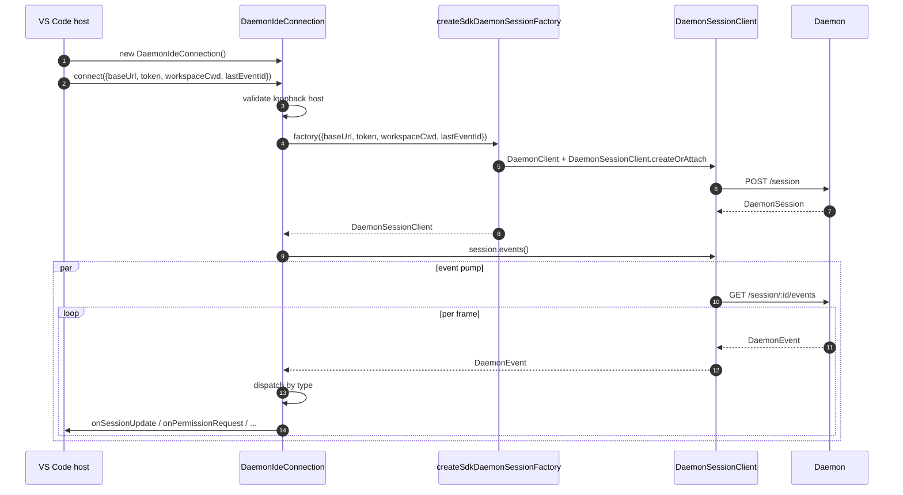
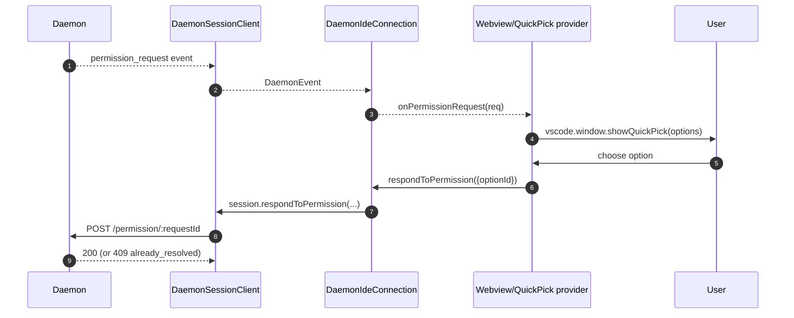
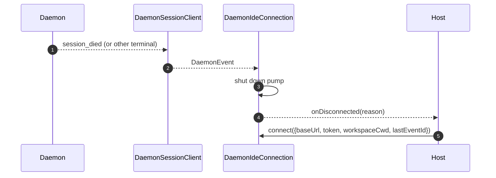

# Adaptateur de démon pour l'IDE VS Code

## Présentation

`packages/vscode-ide-companion/src/services/daemonIdeConnection.ts` est l'**adaptateur de démon de l'extension VS Code**. Il permet au compagnon IDE de se connecter à un démon `qwen serve` en cours d'exécution via HTTP + SSE au lieu de lancer un processus enfant `qwen --acp` en mémoire (l'ancien chemin `AcpConnectionState`). C'est l'équivalent transport-frère de [`14-cli-tui-adapter.md`](./14-cli-tui-adapter.md) pour les hôtes VS Code.

La vue webview de chat de l'IDE consomme les événements du démon via cet adaptateur ; les demandes d'autorisation apparaissent sous forme de boîtes de dialogue rapide natives de VS Code.

## Responsabilités

- Construire un `DaemonClient` + `DaemonSessionClient` à partir d'une `baseUrl` validée en boucle locale transmise à `connect(options)`.
- Transmettre les événements SSE du client de session vers les callbacks par type (`onSessionUpdate`, `onPermissionRequest`, `onAskUserQuestion`, `onEndTurn`, `onDisconnected`).
- Appliquer une contrainte **boucle locale uniquement** dans `connect(options)` (l'IDE ne doit jamais se connecter qu'à un démon sur le même hôte).
- Faire le pont entre les événements du démon et les `postMessage` de la webview pour que le panneau de chat reste synchronisé.
- Présenter les demandes d'autorisation via l'interface utilisateur quick-pick native de VS Code.
- Sérialiser les appels dans une file d'attente afin qu'un double `connect()` rapide de l'hôte ne provoque pas de compétition.

## Architecture

### Surface publique

```ts
class DaemonIdeConnection {
  connect(options: DaemonIdeConnectionOptions): Promise<void>;
  disconnect(): Promise<void>;
  sendPrompt(prompt: string | ContentBlock[]): Promise<DaemonIdePromptResult>;
  cancelSession(): Promise<void>;
  setModel(modelId: string): Promise<DaemonIdeSetModelResult>;

  onSessionUpdate: (data: SessionNotification) => void;
  onPermissionRequest: (
    data: RequestPermissionRequest,
  ) => Promise<{ optionId?: string }>;
  onAskUserQuestion: (data: AskUserQuestionRequest) => Promise<{
    optionId: string;
    answers?: Record<string, string>;
  }>;
  onEndTurn: (reason?: string) => void;
  onDisconnected: (code: number | null, signal: string | null) => void;
}

interface DaemonIdeConnectionOptions {
  baseUrl: string; // DOIT être en boucle locale (127.0.0.1 / localhost / [::1])
  token?: string;
  workspaceCwd?: string;
  modelServiceId?: string;
  lastEventId?: number;
  sessionFactory?: DaemonIdeSessionFactory;
}
```

### Validation de la boucle locale

Dans `connectInternal()` :

```ts
const baseUrl = validateDaemonBaseUrl(options.baseUrl);
```

Il s'agit d'une **contrainte stricte côté client**, distincte de la propre `hostAllowlist` du démon (voir [`12-auth-security.md`](./12-auth-security.md)). Le compagnon IDE ne se connectera jamais à un démon distant – même si l'opérateur en a configuré un. Raison : le modèle de menace de VS Code suppose que l'espace de travail et le démon partagent le même hôte, y compris la confiance dans le système de fichiers et les hypothèses associées.

### `createSdkDaemonSessionFactory()`

`createSdkDaemonSessionFactory()` construit `DaemonClient` et appelle
`DaemonSessionClient.createOrAttach()` depuis `@qwen-code/sdk`. La classe de
connexion détient la fabrique plutôt que d'instancier directement afin que les
tests puissent injecter un faux.

### Distribution des événements

La connexion exécute un consommateur SSE (`for await` sur `session.events()`) et achemine chaque événement par type :

| Événement / source du démon                                                                               | Callback / action de l'IDE                                                     |
| --------------------------------------------------------------------------------------------------------- | ------------------------------------------------------------------------------ |
| `session_update`                                                                                          | `onSessionUpdate`                                                              |
| `permission_request` normal                                                                               | `onPermissionRequest`, puis `respondToPermission()`                            |
| `permission_request` où `toolCall.kind === 'ask_user_question'` et `rawInput.questions` est un tableau    | `onAskUserQuestion`, puis transmet `answers` au démon                          |
| `session_died` avec une charge utile `sessionId` correspondant à la session courante                      | `onDisconnected(null, reason)`                                                 |
| Fin naturelle du SSE / échec du flux / `disconnect()` manuel                                              | `onDisconnected(null, 'stream_ended' / 'daemon_error' / 'disconnected')`       |
| Autres événements du démon                                                                                | Journalisation au niveau débogage ; aucun callback IDE aujourd'hui.            |

`onEndTurn` n'est pas produit par la distribution SSE. `sendPrompt()` attend la
réponse HTTP du démon et l'appelle avec `response.stopReason` ; les chemins
d'exception non liés à une annulation appellent `onEndTurn('error')`.

### Pont vers la webview

La classe de connexion est **uniquement de transport**. L'intégration réelle avec VS Code se trouve dans `packages/vscode-ide-companion/src/webview/providers/ChatWebviewViewProvider.ts` (et autres). Le fournisseur s'abonne aux callbacks de la connexion et les traduit en appels `postMessage` vers la webview. La webview elle-même utilise la bibliothèque de composants partagée `packages/webui/` pour le rendu – voir la matrice des adaptateurs dans [`01-architecture.md`](./01-architecture.md).
### Sérialisation de la connexion

`connect()` utilise une file d'attente interne afin qu'un double appel rapide de l'hôte (par exemple, l'utilisateur ouvre le panneau deux fois pendant une négociation en cours) n'entre pas en concurrence. Le second appel attend le premier ; la connexion aboutit à un état unique et déterministe.

## Flux de travail

### Connexion initiale



### Permission via quick-pick



### Déconnexion / récupération



## État et cycle de vie

- La construction est synchrone ; **aucune E/S réseau** jusqu'à `connect(options)`.
- `connect()` est idempotent grâce à la file d'attente interne ; un double appel se sérialise.
- `disconnect()` abandonne l'itérateur SSE (`AbortController` sur la pompe) et efface les enregistrements de callbacks.
- `lastEventId` est capturé depuis le `DaemonSessionClient` du SDK lors de la déconnexion et peut être fourni à nouveau lors du prochain `connect()` pour une reprise.

## Dépendances

- `packages/sdk-typescript/src/daemon/` — `DaemonClient`, `DaemonSessionClient` (le transport réel).
- API d'extension VS Code (`vscode.*`) — APIs hôte, quick-pick, webview.
- `packages/webui/src/adapters/ACPAdapter.ts` — rendu webview des messages de forme ACP relayés via `postMessage`.

## Configuration

| Réglage                                              | Où                                | Effet                                                             |
| ---------------------------------------------------- | --------------------------------- | ----------------------------------------------------------------- |
| `baseUrl`                                            | `connect(options)`                | URL du daemon ; doit être en boucle locale.                       |
| `token`                                              | `connect(options)`                | Token Bearer (estampe via SDK).                                   |
| `workspaceCwd`                                       | `connect(options)`                | Utilisé sur `POST /session` ; doit correspondre à l'espace de travail lié au daemon. |
| `modelServiceId`                                     | `connect(options)` / `setModel()` | Modèle initial.                                                   |
| `lastEventId`                                        | `connect(options)`                | Curseur de reprise (généralement restauré depuis l'état de l'hôte). |
| Paramètre VS Code `qwen.ide.daemonUrl` (ou équivalent) | Paramètres de l'espace de travail | URL du daemon configurée par l'opérateur.                         |

## Mises en garde et limitations connues

- **Boucle locale uniquement — refus catégorique dans `connect(options)`.** Les opérateurs qui souhaitent pointer l'IDE vers un daemon distant doivent utiliser un transfert de port SSH / un proxy local ; l'adaptateur ne se connectera pas à une URL non-boucle locale.
- **Le chemin hérité `AcpConnectionState` est toujours principal** dans le compagnon IDE (enfant stdio). Cet adaptateur est le transport frère pour la migration Mode-B ; voir [`../daemon-client-adapters/ide.md`](../daemon-client-adapters/ide.md) pour les blocages de migration et le travail de parité `BridgeFileSystem` prévu.
- **Aucune surface de RPC inverse ou d'éditeur-affordance encore sur HTTP.** Les fonctionnalités qui nécessitent que l'agent rappelle dans l'IDE (par exemple, accès en lecture seule au buffer, intégration de l'aperçu des différences) vivent actuellement uniquement sur le chemin stdio.
- **Le couplage Webview ↔ connexion est détenu par l'hôte**, pas dans cet adaptateur. Ne poussez pas de logique spécifique à la webview dans `DaemonIdeConnection`.
- **Un décalage de `workspaceCwd`** avec l'espace de travail lié au daemon renvoie `400 workspace_mismatch` — présentez cela comme une erreur de configuration claire plutôt que de réessayer.
## Références

- `packages/vscode-ide-companion/src/services/daemonIdeConnection.ts`
- `packages/vscode-ide-companion/src/services/daemonIdeConnection.ts` (`createSdkDaemonSessionFactory`)
- `packages/vscode-ide-companion/src/types/connectionTypes.ts` (ancien `AcpConnectionState`)
- `packages/vscode-ide-companion/src/webview/providers/ChatWebviewViewProvider.ts` (pont webview)
- `packages/webui/src/adapters/ACPAdapter.ts` (adaptateur de messages ACP pour webview)
- Projet de conception : [`../daemon-client-adapters/ide.md`](../daemon-client-adapters/ide.md)
- Référence SDK : [`13-sdk-daemon-client.md`](./13-sdk-daemon-client.md)
