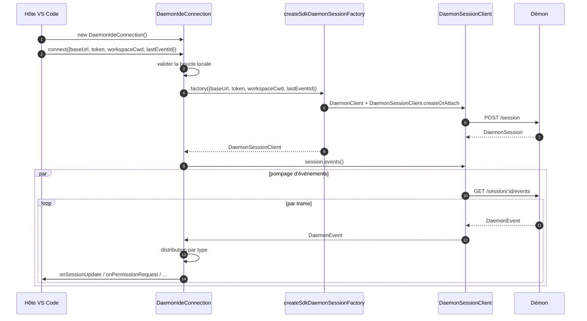
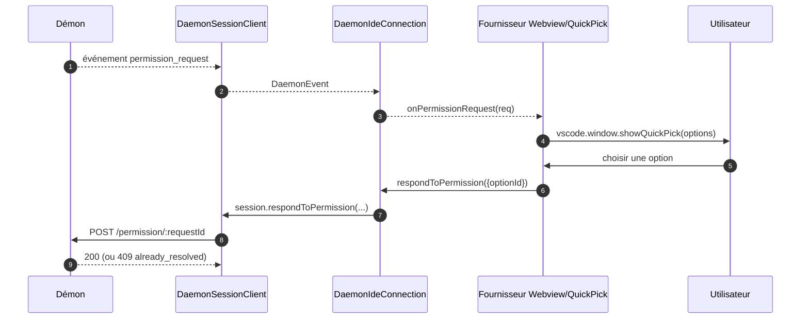
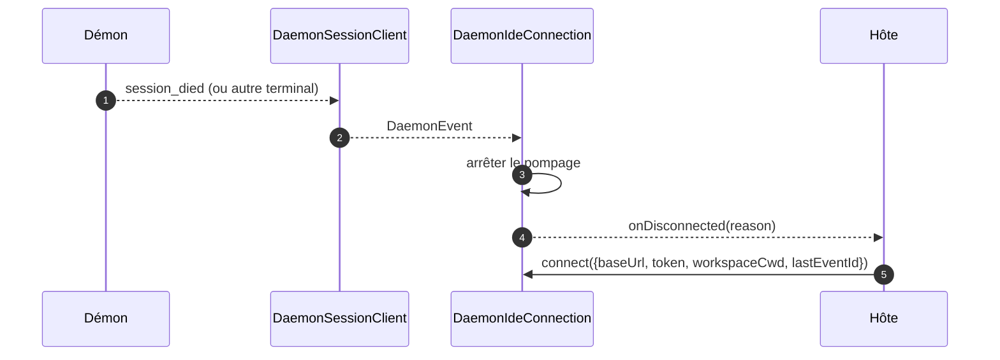

# Adaptateur de démon IDE VS Code

## Vue d'ensemble

`packages/vscode-ide-companion/src/services/daemonIdeConnection.ts` est **l'adaptateur de démon de l'extension VS Code**. Il permet au compagnon IDE de se connecter à un démon `qwen serve` en cours d'exécution via HTTP + SSE au lieu de lancer un processus fils stdio `qwen --acp` (l'ancien chemin `AcpConnectionState`). C'est l'équivalent transport frère de [`14-cli-tui-adapter.md`](./14-cli-tui-adapter.md) pour les hôtes VS Code.

La vue webview du chat de l'IDE consomme les événements du démon via cet adaptateur ; les demandes d'autorisation se présentent sous forme de boîtes de dialogue quick-pick natives de VS Code.

## Responsabilités

- Construire un `DaemonClient` + `DaemonSessionClient` à partir d'une `baseUrl` validée comme boucle locale, passée à `connect(options)`.
- Pomper les événements SSE du client de session vers une distribution par callback (`onSessionUpdate`, `onPermissionRequest`, `onAskUserQuestion`, `onEndTurn`, `onDisconnected`).
- Appliquer une invariant **boucle locale uniquement** dans `connect(options)` (l'IDE ne doit se connecter qu'à un démon sur le même hôte).
- Faire le pont entre les événements du démon et les `postMessage` de la webview pour que le panneau de chat reste synchronisé.
- Afficher les demandes d'autorisation via l'interface utilisateur quick-pick native de VS Code.
- Sérialiser les appels dans une file d'attente afin qu'un double `connect()` rapide de l'hôte n'entre pas en concurrence.

## Architecture

### Surface publique

```ts
class DaemonIdeConnection {
  connect(options: DaemonIdeConnectionOptions): Promise<void>;
  disconnect(): Promise<void>;
  sendPrompt(prompt: string | ContentBlock[]): Promise<DaemonIdePromptResult>;
  cancelSession(): Promise<void>;
  setModel(modelId: string): Promise<DaemonIdeSetModelResult>;

  onSessionUpdate: (data: SessionNotification) => void;
  onPermissionRequest: (
    data: RequestPermissionRequest,
  ) => Promise<{ optionId?: string }>;
  onAskUserQuestion: (data: AskUserQuestionRequest) => Promise<{
    optionId: string;
    answers?: Record<string, string>;
  }>;
  onEndTurn: (reason?: string) => void;
  onDisconnected: (code: number | null, signal: string | null) => void;
}

interface DaemonIdeConnectionOptions {
  baseUrl: string; // DOIT être une boucle locale (127.0.0.1 / localhost / [::1])
  token?: string;
  workspaceCwd?: string;
  modelServiceId?: string;
  lastEventId?: number;
  sessionFactory?: DaemonIdeSessionFactory;
}
```

### Validation de la boucle locale

Dans `connectInternal()` :

```ts
const baseUrl = validateDaemonBaseUrl(options.baseUrl);
```

Il s'agit d'une **contrainte stricte côté client** distincte de la propre `hostAllowlist` du démon (voir [`12-auth-security.md`](./12-auth-security.md)). Le compagnon IDE ne se connectera jamais à un démon distant — même si l'opérateur en a configuré un. Raison : le modèle de menace de VS Code suppose que l'espace de travail et le démon partagent le même hôte, y compris la confiance du système de fichiers et les hypothèses associées.

### `createSdkDaemonSessionFactory()`

`createSdkDaemonSessionFactory()` construit `DaemonClient` et appelle
`DaemonSessionClient.createOrAttach()` de `@qwen-code/sdk`. La classe
de connexion conserve la fabrique plutôt que d'instancier directement afin que les tests puissent injecter une fabrique simulée.

### Distribution des événements

La connexion exécute un consommateur SSE (`for await` sur `session.events()`) et achemine chaque événement par type :

| Événement / source du démon                                                                | Callback / action IDE                                                                       |
| ------------------------------------------------------------------------------------------ | ------------------------------------------------------------------------------------------- |
| `session_update`                                                                           | `onSessionUpdate`                                                                           |
| `permission_request` normal                                                                | `onPermissionRequest`, puis `respondToPermission()`                                         |
| `permission_request` où `toolCall.kind === 'ask_user_question'` et `rawInput.questions` est un tableau | `onAskUserQuestion`, puis transmet `answers` au démon                                      |
| `session_died` avec un `sessionId` correspondant à la session actuelle                     | `onDisconnected(null, reason)`                                                              |
| Fin naturelle SSE / échec de flux / `disconnect()` manuelle                                | `onDisconnected(null, 'stream_ended' / 'daemon_error' / 'disconnected')`                    |
| Autres événements du démon                                                                 | Journalisation de niveau débogage ; aucun callback IDE aujourd'hui.                         |

`onEndTurn` n'est pas produit par la distribution SSE. `sendPrompt()` attend la réponse HTTP du démon
et l'appelle avec `response.stopReason` ; les chemins d'exception non liés à une interruption appellent `onEndTurn('error')`.

### Pont vers la webview

La classe de connexion est **transport uniquement**. L'intégration réelle dans VS Code se trouve dans `packages/vscode-ide-companion/src/webview/providers/ChatWebviewViewProvider.ts` (et compagnie). Le fournisseur s'abonne aux callbacks de la connexion et les traduit en appels `postMessage` de la webview. La webview elle-même utilise la bibliothèque de composants partagée `packages/webui/` pour le rendu — voir la matrice d'adaptateurs dans [`01-architecture.md`](./01-architecture.md).

### Sérialisation de la connexion

`connect()` utilise une file d'attente interne afin qu'un double appel rapide de l'hôte (par exemple, l'utilisateur ouvre le panneau deux fois pendant une poignée de main en cours) n'entre pas en concurrence. Le second appel attend le premier ; la connexion se retrouve dans un état unique et déterministe.

## Flux de travail

### Connexion initiale


```mermaid
sequenceDiagram
    autonumber
    participant H as Hôte VS Code
    participant C as DaemonIdeConnection
    participant F as createSdkDaemonSessionFactory
    participant SDK as DaemonSessionClient
    participant D as Démon

    H->>C: new DaemonIdeConnection()
    H->>C: connect({baseUrl, token, workspaceCwd, lastEventId})
    C->>C: valider la boucle locale
    C->>F: factory({baseUrl, token, workspaceCwd, lastEventId})
    F->>SDK: DaemonClient + DaemonSessionClient.createOrAttach
    SDK->>D: POST /session
    D-->>SDK: DaemonSession
    F-->>C: DaemonSessionClient
    C->>SDK: session.events()
    par pompage d'événements
        SDK->>D: GET /session/:id/events
        loop par trame
            D-->>SDK: DaemonEvent
            SDK-->>C: DaemonEvent
            C->>C: distribution par type
            C->>H: onSessionUpdate / onPermissionRequest / ...
        end
    end
```

### Autorisation via quick-pick


```mermaid
sequenceDiagram
    autonumber
    participant D as Démon
    participant SDK as DaemonSessionClient
    participant C as DaemonIdeConnection
    participant P as Fournisseur Webview/QuickPick
    participant U as Utilisateur

    D-->>SDK: événement permission_request
    SDK-->>C: DaemonEvent
    C-->>P: onPermissionRequest(req)
    P->>U: vscode.window.showQuickPick(options)
    U->>P: choisir une option
    P->>C: respondToPermission({optionId})
    C->>SDK: session.respondToPermission(...)
    SDK->>D: POST /permission/:requestId
    D-->>SDK: 200 (ou 409 already_resolved)
```

### Déconnexion / reprise


```mermaid
sequenceDiagram
    autonumber
    participant D as Démon
    participant SDK as DaemonSessionClient
    participant C as DaemonIdeConnection
    participant H as Hôte

    D-->>SDK: session_died (ou autre terminal)
    SDK-->>C: DaemonEvent
    C->>C: arrêter le pompage
    C-->>H: onDisconnected(reason)
    H->>C: connect({baseUrl, token, workspaceCwd, lastEventId})
```

## État et cycle de vie

- La construction est synchrone ; **aucun E/S réseau** jusqu'à `connect(options)`.
- `connect()` est idempotent grâce à la file d'attente interne ; deux appels sont sérialisés.
- `disconnect()` interrompt l'itérateur SSE (`AbortController` sur le pompage) et efface les enregistrements de callbacks.
- `lastEventId` est capturé depuis le `DaemonSessionClient` du SDK lors de la déconnexion et peut être ré-fourni lors du prochain `connect()` pour une reprise.

## Dépendances

- `packages/sdk-typescript/src/daemon/` — `DaemonClient`, `DaemonSessionClient` (le transport réel).
- API d'extension VS Code (`vscode.*`) — API hôtes, quick-pick, webview.
- `packages/webui/src/adapters/ACPAdapter.ts` — rendu webview des messages de forme ACP relayés via `postMessage`.

## Configuration

| Réglage                                              | Où                              | Effet                                                             |
| ---------------------------------------------------- | ------------------------------- | ----------------------------------------------------------------- |
| `baseUrl`                                            | `connect(options)`              | URL du démon ; doit être une boucle locale.                       |
| `token`                                              | `connect(options)`              | Jeton Bearer (estampillé via SDK).                                |
| `workspaceCwd`                                       | `connect(options)`              | Utilisé sur `POST /session` ; doit correspondre au workspace principal du démon ou à un runtime de session multi-workspace enregistré. |
| `modelServiceId`                                     | `connect(options)` / `setModel()`| Modèle initial.                                                   |
| `lastEventId`                                        | `connect(options)`              | Curseur de reprise (généralement restauré depuis l'état de l'hôte).|
| Paramètre VS Code `qwen.ide.daemonUrl` (ou équivalent) | Paramètres de l'espace de travail | URL du démon configurée par l'opérateur.                          |

## Mises en garde et limites connues

- **Boucle locale uniquement — refus strict dans `connect(options)`.** Les opérateurs souhaitant pointer l'IDE vers un démon distant doivent utiliser un forwarding de port SSH / un proxy local ; l'adaptateur ne se connectera pas à une URL non boucle locale.
- **L'ancien chemin `AcpConnectionState` reste principal** dans le compagnon IDE (processus fils stdio). Cet adaptateur est le transport frère pour la migration Mode-B ; voir [`../daemon-client-adapters/ide.md`](../daemon-client-adapters/ide.md) pour les bloqueurs de migration et le travail prévu de parité `BridgeFileSystem`.
- **Pas encore de RPC inverse ou de surface d'éditeur via HTTP.** Les fonctionnalités nécessitant que l'agent rappelle l'IDE (par exemple, accès buffer en lecture seule, intégration du diff preview) ne vivent actuellement que sur le chemin stdio.
- **Le couplage webview ↔ connexion est propriétaire de l'hôte**, pas de cet adaptateur. Ne pas pousser de logique spécifique à la webview dans `DaemonIdeConnection`.
- **Le décalage de `workspaceCwd`** avec les workspaces enregistrés du démon renvoie `400 workspace_mismatch` — présentez-le comme une erreur de configuration claire plutôt que de réessayer.

## Références

- `packages/vscode-ide-companion/src/services/daemonIdeConnection.ts`
- `packages/vscode-ide-companion/src/services/daemonIdeConnection.ts` (`createSdkDaemonSessionFactory`)
- `packages/vscode-ide-companion/src/types/connectionTypes.ts` (`AcpConnectionState` legacy)
- `packages/vscode-ide-companion/src/webview/providers/ChatWebviewViewProvider.ts` (pont webview)
- `packages/webui/src/adapters/ACPAdapter.ts` (adaptateur de message webview ACP)
- Conception préliminaire : [`../daemon-client-adapters/ide.md`](../daemon-client-adapters/ide.md)
- Référence SDK : [`13-sdk-daemon-client.md`](./13-sdk-daemon-client.md)