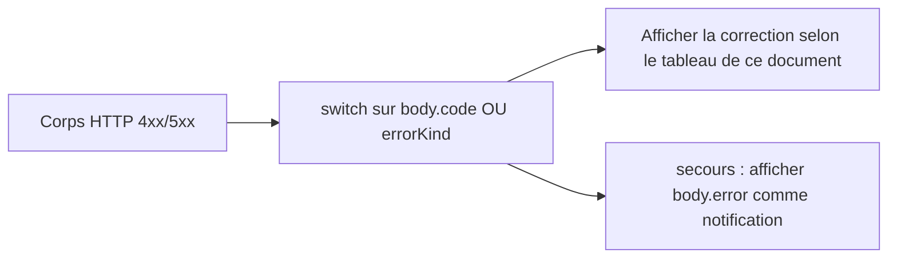
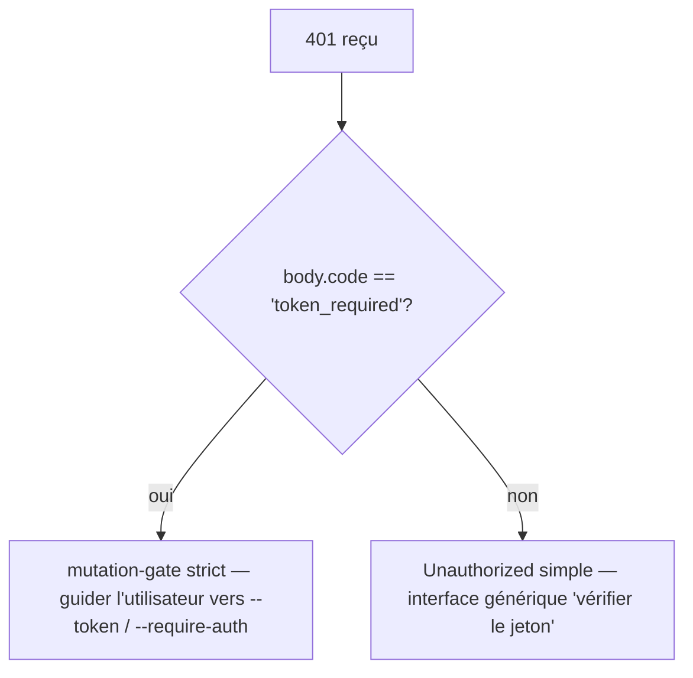

# Taxonomie des erreurs et remédiation

## Vue d'ensemble

Les modes de défaillance du démon sont volontairement des unions fermées afin que les consommateurs du SDK puissent effectuer un switch exhaustif et que les routeurs de handlers puissent façonner des réponses HTTP cohérentes. Ce document catalogue chaque classe/type d'erreur typée sur trois couches :

1. **`packages/cli/src/serve/`** — erreurs de frontière au niveau HTTP (authentification, système de fichiers du workspace, pré-vérification démon-hôte).
2. **`packages/acp-bridge/`** — erreurs de pont / médiateur à la frontière démon-vers-ACP-enfant.
3. **`packages/sdk-typescript/src/daemon/`** — enveloppement SDK et champs d'erreur structurés.

Les formes d'erreur au niveau du fil sont documentées dans [`../qwen-serve-protocol.md`](../qwen-serve-protocol.md) ; ce document ajoute des conseils sur les causes et la remédiation.

## Frontière du système de fichiers (`packages/cli/src/serve/fs/errors.ts`)

`FsError` transporte `{ kind, message, status, cause? }`. Union `FsErrorKind` (14 kinds, statut HTTP par défaut) :

| Kind                     | HTTP      | Cause                                                                          | Remédiation                                                                                                             |
| ------------------------ | --------- | ------------------------------------------------------------------------------ | ----------------------------------------------------------------------------------------------------------------------- |
| `path_outside_workspace` | 400       | Le chemin résolu sort du workspace lié.                                        | Utilisez un chemin à l'intérieur de `workspaceCwd` du démon ; vérifiez `/capabilities`.                                 |
| `symlink_escape`         | 400       | La cible est un lien symbolique.                                               | Adressez directement le chemin résolu ; les liens symboliques sont rejetés par conception.                              |
| `path_not_found`         | 404       | `ENOENT`.                                                                      | Confirmez que le fichier existe ; vérifiez les chemins sensibles à la casse sous Linux.                                 |
| `binary_file`            | 422       | Contenu détecté comme binaire sur une route textuelle.                         | Utilisez `GET /file/bytes` pour les octets bruts ; la route textuelle refuse les binaires.                              |
| `file_too_large`         | 413       | Au-dessus de `MAX_READ_BYTES` (256 Kio) ou `MAX_WRITE_BYTES` (5 Mio).          | Utilisez une lecture par plage d'octets ; fractionnez l'écriture.                                                        |
| `hash_mismatch`          | 409       | Échec de `expectedSha256` pour la concurrence optimiste.                       | Relisez le fichier et réessayez avec le nouveau hash.                                                                   |
| `file_already_exists`    | 409       | `mode: 'create'` sur un fichier existant.                                      | Utilisez `mode: 'overwrite'` ou choisissez un nouveau chemin.                                                            |
| `text_not_found`         | 422       | Chaîne de recherche de `POST /file/edit` introuvable dans le fichier.          | Revérifiez la chaîne de recherche ; les différences d'espacement/encodage en sont la cause habituelle.                  |
| `ambiguous_text_match`   | 422       | Plusieurs correspondances alors qu'une seule était requise.                    | Ajoutez plus de contexte autour de la chaîne de recherche pour la rendre unique.                                        |
| `untrusted_workspace`    | 403       | Écriture tentée dans un workspace non fiable.                                  | Marquez le workspace comme fiable (`Config.isTrustedFolder()`) ou utilisez `runQwenServe` au lieu de l'embarquement direct `createServeApp`. |
| `permission_denied`      | 403       | `EACCES` / `EPERM` au niveau du système d'exploitation.                        | Ajustez les ACL du système de fichiers ; ceci n'est **pas** une alerte de sécurité.                                     |
| `io_error`               | 503       | `ENOSPC` / `EIO` / `EBUSY` / `ETXTBSY` / `ENAMETOOLONG` / `EMFILE` / `ENFILE`. | Correction opérationnelle au niveau hôte (disque plein, épuisement des descripteurs de fichier) ; opérations de page, pas de sécurité. |
| `internal_error`         | 500       | Une erreur non-errno atteint la frontière.                                     | Ouvrez un bug du démon.                                                                                                 |
| `parse_error`            | 400 / 422 | Erreur d'analyse du corps de la requête (400) ou violation d'invariant au niveau du service (422). | Validez le corps de la requête ; vérifiez la version du SDK.                                                            |

La distinction entre `io_error` et `permission_denied` est délibérée afin que les pipelines de surveillance puissent router en fonction de `errorKind` ; fusionner ENOSPC dans `permission_denied` déclencherait des réponses de sécurité pour un problème de `df -h`.
## Erreurs du bridge (`packages/acp-bridge/src/bridgeErrors.ts`)

Classes typées levées par le bridge / médiateur. La plupart transportent un statut HTTP via le switch du gestionnaire de route.

| Classe                                | HTTP | Cause                                                                                  | Remédiation                                                                                                                                                                          |
| ------------------------------------- | ---- | -------------------------------------------------------------------------------------- | ------------------------------------------------------------------------------------------------------------------------------------------------------------------------------------ |
| `SessionNotFoundError`                | 404  | sessionId introuvable dans `byId`.                                                     | Recréez ou rattachez-vous ; la session a peut-être été récupérée.                                                                                                                    |
| `WorkspaceMismatchError`              | 400  | `POST /session` `cwd` ≠ `boundWorkspace` du démon.                                     | Omettez `cwd` (utilise le workspace lié) ou acheminez vers un démon lié à votre `cwd`.                                                                                               |
| `SessionLimitExceededError`           | 503  | `byId.size >= maxSessions`.                                                            | Fermez les sessions périmées ; augmentez `--max-sessions`.                                                                                                                           |
| `InvalidClientIdError`                | 400  | `X-Qwen-Client-Id` en dehors de `[A-Za-z0-9._:-]{1,128}`.                               | Assainissez l'id client.                                                                                                                                                             |
| `InvalidSessionMetadataError`         | 400  | `displayName` > 256 caractères ou contient des caractères de contrôle.                 | Tronquez / assainissez.                                                                                                                                                              |
| `InvalidSessionScopeError`            | 400  | Valeur `sessionScope` inconnue.                                                        | Utilisez `'single'` ou `'thread'`.                                                                                                                                                   |
| `RestoreInProgressError`              | 409  | `loadSession` / `resumeSession` concurrentes.                                          | Attendez + réessayez.                                                                                                                                                                |
| `WorkspaceInitConflictError`          | 409  | `POST /workspace/init` sur un fichier existant sans `force`.                           | Passez `force: true` ou choisissez un autre chemin.                                                                                                                                  |
| `WorkspaceInitPathEscapeError`        | 400  | Le chemin d'initialisation sort du workspace.                                          | Utilisez un chemin à l'intérieur de `workspaceCwd`.                                                                                                                                  |
| `WorkspaceInitSymlinkError`           | 400  | Le chemin d'initialisation est un lien symbolique.                                     | Adressez le chemin résolu.                                                                                                                                                           |
| `WorkspaceInitRaceError`              | 409  | TOCTOU race lors de l'initialisation.                                                  | Réessayez.                                                                                                                                                                           |
| `McpServerNotFoundError`              | 404  | Redémarrage pour un serveur inconnu.                                                   | Vérifiez le nom du serveur dans `/workspace/mcp`.                                                                                                                                    |
| `McpServerRestartFailedError`         | 502  | Échec du redémarrage dans le processus enfant ACP.                                     | Consultez les logs du processus ACP ; peut indiquer un serveur MCP défaillant.                                                                                                       |
| `InvalidPermissionOptionError`        | 400  | Un vote filaire a tenté d'injecter `CANCEL_VOTE_SENTINEL` via `optionId`.               | Votez avec `{outcome: 'cancelled'}` au lieu d'un `optionId`.                                                                                                                         |
| `PermissionForbiddenError`            | 403  | La politique a refusé le votant (`designated_mismatch` / `remote_not_allowed`).        | Utilisez l'id client d'origine (désigné), pré-enregistrez le votant (consensus) ou votez depuis la boucle locale (local only). Voir [`04-permission-mediation.md`](./04-permission-mediation.md). |
| `CancelSentinelCollisionError`        | 500  | L'agent a publié `'__cancelled__'` comme étiquette d'option légitime.                  | Bogue de l'agent — changez l'étiquette de l'option pour autre chose que la sentinelle.                                                                                              |
| `PermissionPolicyNotImplementedError` | 500  | La politique demandée n'est pas intégrée dans ce démon.                                | Mettez à jour le démon, ou changez `policy.permissionStrategy`.                                                                                                                      |
| `BridgeChannelClosedError`            | 503  | Le canal du processus enfant ACP s'est fermé en cours d'appel.                         | Reconnectez-vous / réessayez ; consultez `session_died` pour la cause.                                                                                                               |
| `BridgeTimeoutError`                  | 504  | Délai d'attente au niveau du bridge dépassé.                                           | Réessayez ; enquêtez sur les lenteurs sous-jacentes.                                                                                                                                 |
| `MissingCliEntryError`                | 500  | Le fichier d'entrée `qwen` CLI est manquant (défini dans `status.ts`, pas `bridgeErrors.ts`). | Confirmez que l'installation du CLI est complète ; vérifiez que `packages/cli/index.ts` existe.                                                                                     |
## Erreurs de configuration au démarrage (`packages/cli/src/serve/run-qwen-serve.ts`)

| Classe                      | Quand                                                                                                                                                                                                                                      | Correction                                                                                                                                                                                                                                                   |
| -------------------------- | ----------------------------------------------------------------------------------------------------------------------------------------------------------------------------------------------------------------------------------------- | ------------------------------------------------------------------------------------------------------------------------------------------------------------------------------------------------------------------------------------------------------------ |
| `InvalidPolicyConfigError` | `validatePolicyConfig()` rejette les paramètres fusionnés : `policy.permissionStrategy` inconnu (validé par rapport à `SERVE_CAPABILITY_REGISTRY.permission_mediation.modes`) ou `policy.consensusQuorum` non entier positif. Le démarrage échoue explicitement. | Corrigez le champ incriminé dans `settings.json`. La classe supporte `instanceof` ; `runQwenServe` l'utilise pour distinguer une incohérence de politique des échecs d'E/S de lecture des paramètres, qui reviennent aux valeurs par défaut. |

## Authentification Device Flow (`packages/cli/src/serve/auth/device-flow.ts`)

| Classe                        | Quand                                                       | Notes                                                                                                                                                                                                                                                                                                                                                                                                                                    |
| ---------------------------- | ---------------------------------------------------------- | ---------------------------------------------------------------------------------------------------------------------------------------------------------------------------------------------------------------------------------------------------------------------------------------------------------------------------------------------------------------------------------------------------------------------------------------- |
| `UpstreamDeviceFlowError`    | Le fournisseur d'identité en amont renvoie une erreur structurée lors du sondage. | `oauthError` est nettoyé avec `sanitizeForStderr` avant interpolation dans stderr ou les indices d'audit (défense CVE-2021-42574 / Trojan Source ; voir [`12-auth-security.md`](./12-auth-security.md)).                                                                                                                                                                                                                                         |
| `DeviceFlowPollTimeoutError` | Le minuteur de course du registre se déclenche avant le retour du fournisseur. | Le code du fournisseur ne doit pas lever ce type. Il est exporté pour les tests, mais le registre conditionne `pollTimedOut` sur la marque d'exécution `_isRegistryTimeout: boolean`, pas sur `instanceof`. Un fournisseur qui importe et lève `new DeviceFlowPollTimeoutError(ms)` suit toujours le chemin d'audit générique de levée du fournisseur car `_isRegistryTimeout` est par défaut `false` ; seule la fabrique interne `makeRegistryPollTimeoutError(ms)` définit la marque. |

## Types d'erreurs de l'hôte du démon (`packages/acp-bridge/src/status.ts`)

`SERVE_ERROR_KINDS` est l'énumération fermée utilisée par les cellules de diagnostic et les erreurs structurées du démon :

| Type                       | Signification                                                                 |
| -------------------------- | ----------------------------------------------------------------------- |
| `missing_binary`           | L'exécutable local requis ou l'entrée CLI n'a pas pu être résolu(e).           |
| `blocked_egress`           | La sonde réseau sortante a échoué.                                          |
| `auth_env_error`           | La variable d'environnement, le fournisseur ou la configuration du trust-gate liés à l'authentification est invalide. |
| `init_timeout`             | L'étape d'initialisation côté démon a dépassé son temps réel.           |
| `protocol_error`           | Incompatibilité de protocole ACP / HTTP.                                           |
| `missing_file`             | Fichier local requis manquant.                                            |
| `parse_error`              | Erreur d'analyse du fichier local ou de la requête.                                      |
| `stat_failed`              | L'appel stat du système de fichiers local a échoué.                                           |
| `budget_exhausted`         | L'application du budget MCP a refusé la découverte ou une entrée de serveur.             |
| `mcp_budget_would_exceed`  | Le redémarrage ou la mutation MCP dépasserait le budget configuré.             |
| `mcp_server_spawn_failed`  | Le lancement ou le redémarrage du serveur MCP a échoué.                                     |
| `invalid_config`           | La configuration MCP ou du démon était invalide.                                |
| `prompt_deadline_exceeded` | Le délai d'exécution du prompt a expiré.                                      |
| `writer_idle_timeout`      | Le writer SSE n'a pas effectué d'écritures réussies avant son délai d'inactivité.            |
Ces informations sont exposées via le champ `errorKind` de la cellule de pré-vérification afin que les interfaces client puissent proposer une correction structurée (et non une trace de pile brute).

## Formes des erreurs d'authentification

| Statut | Corps                                         | Quand                                                                                                                                      |
| ------ | --------------------------------------------- | ------------------------------------------------------------------------------------------------------------------------------------------ |
| `401`  | `{ error: 'Unauthorized' }`                   | Jeton porteur manquant / erroné / sans schéma. Identique pour `en-tête manquant` / `schéma erroné` / `jeton erroné` afin d'éviter le sondage. |
| `401`  | `{ error: '...', code: 'token_required' }`    | Route stricte de mutation sur un démon en boucle sans jeton. Les SDK affichent l'indication "configurer --token / --require-auth".         |
| `403`  | `{ error: 'Request denied by CORS policy' }`  | `denyBrowserOriginCors` a rejeté une requête contenant un en-tête `Origin`.                                                                |
| `403`  | `{ error: 'Invalid Host header' }`            | `hostAllowlist` a rejeté l'en-tête `Host` (protection contre la rebinding DNS).                                                            |

Voir [`12-auth-security.md`](./12-auth-security.md) pour le modèle d'authentification complet.

## Résultats des permissions (surcharge filaire vs journal d'audit)

`PermissionResolution` a deux types terminaux :

- `{kind: 'option', optionId}` — un vote a gagné.
- `{kind: 'cancelled', reason: 'timeout' \| 'session_closed' \| 'agent_cancelled'}` — la demande a été annulée. La forme filaire est unique (`{outcome: 'cancelled'}`) ; le journal d'audit distingue timeout / session_closed / voter-cancelled / agent-cancelled dans `decisionReason.type`. Cette surcharge est délibérément conservée pour ne pas casser le contrat gelé de `permission.ts`.

## Encapsulation des erreurs côté SDK

`DaemonClient` retourne les erreurs HTTP sous forme de promesses rejetées avec le corps parsé comme valeur de rejet. Les méthodes qui reçoivent un `404` pour des sessions inconnues rejettent avec `{error, sessionId}` ; le SDK ne les encapsule pas actuellement dans une classe typée. Les appelants ne doivent pas se fier à `instanceof Error` combiné à `.message.includes(...)` ; utilisez plutôt `err.code` ou `err.kind` du corps.

`parseSseStream` interrompt l'itérateur en cas de dépassement de la mémoire tampon de 16 Mio (limite défensive).

## Flux de travail

### Présenter une erreur à un utilisateur

### Distinguer les modes d'échec d'authentification

## Dépendances

- Toutes les classes d'erreur sont exportées depuis leurs paquets respectifs ; les consommateurs du SDK peuvent utiliser `instanceof` contre les types de `bridgeErrors.ts` lorsqu'ils s'exécutent dans le même processus Node. Sur le fil, utilisez `body.code` / `body.kind` / `body.errorKind`.

## Mises en garde et limitations connues

- **`io_error` vs `permission_denied`** sont distincts intentionnellement. Ne pas les confondre.
- **Les raisons de `PermissionForbiddenError` (`designated_mismatch` / `remote_not_allowed`) sont surchargées** entre les politiques `designated` et `consensus` ; le journal d'audit les distingue précisément mais la forme filaire ne le fait pas.
- **`CancelSentinelCollisionError` indique un bogue côté agent**, pas un événement de sécurité — le pont refuse la requête plutôt que de laisser silencieusement le sentinelle correspondre à une option réelle.
- **Les erreurs typées côté SDK sont encore en évolution.** Les appelants doivent router sur les champs du corps plutôt que de se fier à l'identité de classe JS à travers le fil.
- **`internal_error` doit toujours être investigué.** Il signale que le constructeur de `FsError` a été appelé avec un type réservé aux chemins non‑errno (erreur de programmation) ; le champ `cause` du corps de réponse peut contenir l'exception d'origine.

## Références

- `packages/cli/src/serve/fs/errors.ts` (`FsErrorKind`, `FsErrorStatus`)
- `packages/acp-bridge/src/bridgeErrors.ts` (toutes les classes typées)
- `packages/acp-bridge/src/status.ts` (`SERVE_ERROR_KINDS`, `ServeErrorKind`)
- `packages/cli/src/serve/auth.ts` (corps d'authentification)
- Référence filaire : [`../qwen-serve-protocol.md`](../qwen-serve-protocol.md).
