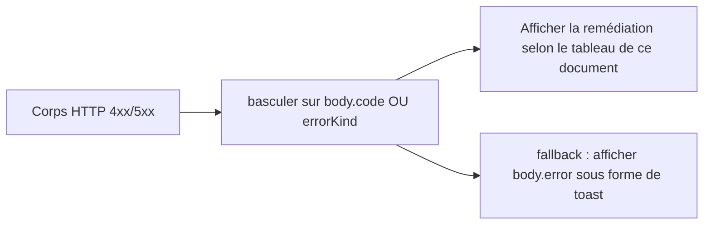
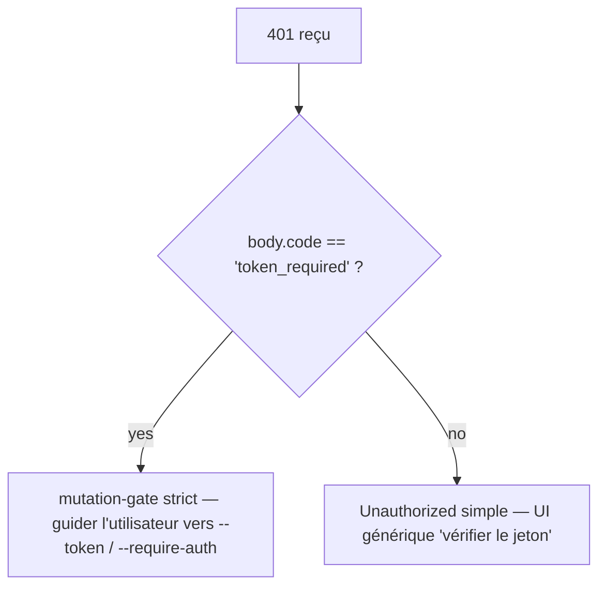

# Taxonomie des erreurs et remédiation

## Vue d'ensemble

Les modes de défaillance du démon sont délibérément des unions fermées afin que les consommateurs du SDK puissent effectuer un `switch` exhaustif et que les gestionnaires de routes puissent façonner des réponses HTTP cohérentes. Ce document répertorie chaque classe/type d’erreur typée sur trois couches :

1. **`packages/cli/src/serve/`** — erreurs de frontière au niveau HTTP (authentification, système de fichiers de l’espace de travail, pré-vérifications démon-hôte).
2. **`packages/acp-bridge/`** — erreurs du pont/médiateur à la frontière démon-enfant ACP.
3. **`packages/sdk-typescript/src/daemon/`** — wrapping SDK et champs d’erreur structurés.

Les formats d’erreur sur le fil sont documentés dans [`../qwen-serve-protocol.md`](../qwen-serve-protocol.md) ; ce document ajoute la cause et les conseils de remédiation.

## Frontière du système de fichiers (`packages/cli/src/serve/fs/errors.ts`)

`FsError` porte `{ kind, message, status, cause? }`. Union `FsErrorKind` (14 types, statut HTTP par défaut) :

| Type                     | HTTP      | Cause                                                                           | Remédiation                                                                                                                   |
| ------------------------ | --------- | ------------------------------------------------------------------------------- | ----------------------------------------------------------------------------------------------------------------------------- |
| `path_outside_workspace` | 400       | Le chemin résolu sort de l’espace de travail lié.                              | Utilisez un chemin à l’intérieur du `workspaceCwd` du démon ; consultez `/capabilities`.                                      |
| `symlink_escape`         | 400       | La cible est un lien symbolique.                                                | Adressez directement le chemin résolu ; les liens symboliques sont rejetés par conception.                                    |
| `path_not_found`         | 404       | `ENOENT`.                                                                       | Vérifiez que le fichier existe ; vérifiez la casse des chemins sur Linux.                                                     |
| `binary_file`            | 422       | Contenu détecté comme binaire sur une route texte.                              | Utilisez `GET /file/bytes` pour les octets bruts ; la route texte refuse les binaires.                                        |
| `file_too_large`         | 413       | Au-dessus de `MAX_READ_BYTES` (256 Kio) ou `MAX_WRITE_BYTES` (5 Mio).           | Utilisez une lecture par plage d’octets ; fractionnez l’écriture.                                                             |
| `hash_mismatch`          | 409       | Échec de l’`expectedSha256` de concurrence optimiste.                          | Relisez le fichier et réessayez avec le nouveau hash.                                                                         |
| `file_already_exists`    | 409       | `mode: 'create'` contre un fichier existant.                                    | Utilisez `mode: 'overwrite'` ou choisissez un nouveau chemin.                                                                |
| `text_not_found`         | 422       | Chaîne de recherche de `POST /file/edit` introuvable dans le fichier.          | Revérifiez la chaîne de recherche ; les problèmes d’espacement/encodage sont la cause habituelle.                             |
| `ambiguous_text_match`   | 422       | Correspondances multiples alors qu’une seule était requise.                     | Ajoutez plus de contexte autour de la chaîne de recherche pour la rendre unique.                                              |
| `untrusted_workspace`    | 403       | Écriture tentée dans un espace de travail non fiable.                          | Marquez l’espace de travail comme fiable (`Config.isTrustedFolder()`) ou utilisez `runQwenServe` au lieu d’un embed direct de `createServeApp`. |
| `permission_denied`      | 403       | `EACCES` / `EPERM` au niveau du système d’exploitation.                        | Ajustez les ACL du système de fichiers ; ce n’est **pas** une alerte de sécurité.                                              |
| `io_error`               | 503       | `ENOSPC` / `EIO` / `EBUSY` / `ETXTBSY` / `ENAMETOOLONG` / `EMFILE` / `ENFILE`. | Correction opérationnelle au niveau hôte (disque plein, épuisement des descripteurs) ; problème d’exploitation, pas de sécurité.|
| `internal_error`         | 500       | Une erreur non liée à errno atteint la frontière.                               | Ouvrez un bug du démon.                                                                                                       |
| `parse_error`            | 400 / 422 | Erreur d’analyse du corps de la requête (400) ou violation invariante de service (422). | Validez le corps de la requête ; vérifiez la version du SDK.                                                                  |

La distinction entre `io_error` et `permission_denied` est délibérée pour que les pipelines de monitoring puissent router sur `errorKind` ; fusionner ENOSPC dans `permission_denied` ferait sonner les pages de sécurité pour un problème de `df -h`.

## Erreurs du pont (`packages/acp-bridge/src/bridgeErrors.ts`)

Classes typées levées par le pont / médiateur. La plupart portent un statut HTTP via le `switch` du gestionnaire de route.

| Classe                               | HTTP | Cause                                                                                  | Remédiation                                                                                                                                                                             |
| ------------------------------------ | ---- | -------------------------------------------------------------------------------------- | --------------------------------------------------------------------------------------------------------------------------------------------------------------------------------------- |
| `SessionNotFoundError`               | 404  | sessionId introuvable dans `byId`.                                                     | Recréez ou rattachez-vous ; la session a peut-être été récupérée.                                                                                                                       |
| `WorkspaceMismatchError`             | 400  | `POST /session` `cwd` ≠ `boundWorkspace` du démon.                                     | Omettez `cwd` (utilise le workspace lié) ou acheminez vers un démon lié à votre `cwd`.                                                                                                  |
| `SessionLimitExceededError`          | 503  | `byId.size >= maxSessions`.                                                            | Fermez les sessions obsolètes ; augmentez `--max-sessions`.                                                                                                                             |
| `InvalidClientIdError`               | 400  | `X-Qwen-Client-Id` hors de `[A-Za-z0-9._:-]{1,128}`.                                   | Nettoyez l’identifiant client.                                                                                                                                                          |
| `InvalidSessionMetadataError`        | 400  | `displayName` > 256 caractères ou contient des caractères de contrôle.                  | Tronquez / nettoyez.                                                                                                                                                                    |
| `InvalidSessionScopeError`           | 400  | Valeur `sessionScope` inconnue.                                                        | Utilisez `'single'` ou `'thread'`.                                                                                                                                                      |
| `RestoreInProgressError`             | 409  | `loadSession` / `resumeSession` concurrents.                                            | Attendez + réessayez.                                                                                                                                                                   |
| `WorkspaceInitConflictError`         | 409  | `POST /workspace/init` contre un fichier existant sans `force`.                         | Passez `force: true` ou choisissez un autre chemin.                                                                                                                                     |
| `WorkspaceInitPathEscapeError`       | 400  | Le chemin d’init sort de l’espace de travail.                                          | Utilisez un chemin à l’intérieur de `workspaceCwd`.                                                                                                                                     |
| `WorkspaceInitSymlinkError`          | 400  | Le chemin d’init est un lien symbolique.                                               | Adressez le chemin résolu.                                                                                                                                                              |
| `WorkspaceInitRaceError`             | 409  | Condition de course TOCTOU sur l’init.                                                 | Réessayez.                                                                                                                                                                              |
| `McpServerNotFoundError`             | 404  | Redémarrage d’un serveur inconnu.                                                      | Vérifiez le nom du serveur dans `/workspace/mcp`.                                                                                                                                       |
| `McpServerRestartFailedError`        | 502  | Le redémarrage a échoué dans l’enfant ACP.                                            | Consultez les logs de l’enfant ACP ; peut indiquer un serveur MCP défaillant.                                                                                                            |
| `InvalidPermissionOptionError`       | 400  | Un vote sur le fil a tenté d’injecter `CANCEL_VOTE_SENTINEL` via `optionId`.            | Votez avec `{outcome: 'cancelled'}` au lieu d’un `optionId`.                                                                                                                            |
| `PermissionForbiddenError`           | 403  | La politique a refusé le votant (`designated_mismatch` / `remote_not_allowed`).        | Utilisez l’identifiant client du demandeur (désigné), pré-enregistrez le votant (consensus), ou votez depuis loopback (local uniquement). Voir [`04-permission-mediation.md`](./04-permission-mediation.md). |
| `CancelSentinelCollisionError`       | 500  | L’agent a publié `'__cancelled__'` comme étiquette d’option légitime.                 | Bug de l’agent — changez l’étiquette de l’option pour autre chose que le sentinel.                                                                                                       |
| `PermissionPolicyNotImplementedError`| 500  | La politique demandée n’est pas intégrée dans ce démon.                                | Mettez à jour le démon, ou changez `policy.permissionStrategy`.                                                                                                                          |
| `BridgeChannelClosedError`           | 503  | Le canal de l’enfant ACP s’est fermé en plein appel.                                   | Reconnectez / réessayez ; vérifiez `session_died` pour la cause.                                                                                                                        |
| `BridgeTimeoutError`                 | 504  | Délai d’attente au niveau du pont dépassé.                                             | Réessayez ; enquêtez sur la lenteur sous-jacente.                                                                                                                                       |
| `MissingCliEntryError`               | 500  | Le fichier d’entrée de la CLI `qwen` est manquant (défini dans `status.ts`, pas dans `bridgeErrors.ts`). | Vérifiez que l’installation de la CLI est complète ; vérifiez que `packages/cli/index.ts` existe.                                                                                        |

## Erreurs de configuration au démarrage (`packages/cli/src/serve/run-qwen-serve.ts`)

| Classe                       | Quand                                                                                                                                                                                                                                  | Remédiation                                                                                                                                                                                                           |
| ---------------------------- | --------------------------------------------------------------------------------------------------------------------------------------------------------------------------------------------------------------------------------------- | --------------------------------------------------------------------------------------------------------------------------------------------------------------------------------------------------------------------- |
| `InvalidPolicyConfigError`   | `validatePolicyConfig()` rejette les paramètres fusionnés : `policy.permissionStrategy` inconnue (validée par rapport à `SERVE_CAPABILITY_REGISTRY.permission_mediation.modes`) ou `policy.consensusQuorum` non entier positif. Le démarrage échoue explicitement. | Corrigez le champ problématique dans `settings.json`. La classe supporte `instanceof` ; `runQwenServe` l’utilise pour distinguer une incohérence de politique d’une erreur d’E/S de lecture des paramètres, qui revient aux valeurs par défaut. |

## Authentification par Device Flow (`packages/cli/src/serve/auth/device-flow.ts`)

| Classe                          | Quand                                                      | Notes                                                                                                                                                                                                                                                                                                                                                                                                                         |
| ------------------------------- | ---------------------------------------------------------- | ----------------------------------------------------------------------------------------------------------------------------------------------------------------------------------------------------------------------------------------------------------------------------------------------------------------------------------------------------------------------------------------------------------------------------- |
| `UpstreamDeviceFlowError`       | Le fournisseur d’identité (IdP) amont retourne une erreur structurée lors du polling. | `oauthError` est nettoyé avec `sanitizeForStderr` avant interpolation dans stderr ou les indications d’audit (CVE-2021-42574 / défense Trojan Source ; voir [`12-auth-security.md`](./12-auth-security.md)).                                                                                                                                                |
| `DeviceFlowPollTimeoutError`    | Le timer de course du registre se déclenche avant que le fournisseur ne réponde.       | Le code du fournisseur ne doit pas lever ce type. Il est exporté pour les tests, mais le registre vérifie `pollTimedOut` via la marque d’exécution `_isRegistryTimeout: boolean`, pas `instanceof`. Un fournisseur qui importe et lève `new DeviceFlowPollTimeoutError(ms)` suit toujours le chemin d’audit générique de levée de fournisseur car `_isRegistryTimeout` vaut `false` par défaut ; seule la fabrique interne `makeRegistryPollTimeoutError(ms)` définit la marque. |

## Types d’erreur démon-hôte (`packages/acp-bridge/src/status.ts`)

`SERVE_ERROR_KINDS` est l’énumération fermée utilisée par les cellules de diagnostic et les erreurs structurées du démon :

| Type                       | Signification                                                         |
| -------------------------- | --------------------------------------------------------------------- |
| `missing_binary`           | L’exécutable local requis ou l’entrée CLI n’a pas pu être résolu.     |
| `blocked_egress`           | La sonde réseau sortante a échoué.                                    |
| `auth_env_error`           | La variable d’environnement, le fournisseur ou la configuration de passerelle de confiance liée à l’authentification est invalide. |
| `init_timeout`             | L’étape d’initialisation côté démon a dépassé son délai d’attente.    |
| `protocol_error`           | Incompatibilité de protocole ACP / HTTP.                              |
| `missing_file`             | Fichier local requis manquant.                                        |
| `parse_error`              | Erreur d’analyse d’un fichier local ou d’une requête.                 |
| `stat_failed`              | Échec de `stat` sur le système de fichiers local.                     |
| `budget_exhausted`         | Le respect du budget MCP a refusé une découverte ou une entrée de serveur. |
| `mcp_budget_would_exceed`  | Un redémarrage ou une mutation MCP dépasserait le budget configuré.   |
| `mcp_server_spawn_failed`  | Le lancement ou le redémarrage du serveur MCP a échoué.               |
| `invalid_config`           | La configuration MCP ou du démon était invalide.                      |
| `prompt_deadline_exceeded` | Le délai d’attente du prompt est expiré.                              |
| `writer_idle_timeout`      | Le writer SSE n’a fait aucune écriture réussie avant son délai d’inactivité. |

Ces erreurs sont remontées via le `errorKind` de la cellule de pré-vérification afin que les interfaces client puissent afficher une remédiation structurée (et non des stack traces brutes).

## Formats d’erreur d’authentification

| Statut | Corps                                        | Quand                                                                                                                                   |
| ------ | -------------------------------------------- | --------------------------------------------------------------------------------------------------------------------------------------- |
| `401`  | `{ error: 'Unauthorized' }`                  | Jeton bearer manquant / erroné / sans schéma. Uniforme entre `en-tête manquant` / `mauvais schéma` / `mauvais jeton` pour empêcher le sondage. |
| `401`  | `{ error: '...', code: 'token_required' }`   | Route stricte de mutation sur un démon loopback sans jeton. Le SDK affiche une indication "configure --token / --require-auth".         |
| `403`  | `{ error: 'Request denied by CORS policy' }` | `denyBrowserOriginCors` a rejeté une requête portant un en-tête `Origin`.                                                              |
| `403`  | `{ error: 'Invalid Host header' }`           | `hostAllowlist` a rejeté l’en-tête `Host` (défense contre le détournement DNS).                                                        |

Voir [`12-auth-security.md`](./12-auth-security.md) pour le modèle d’authentification complet.

## Résultats d’autorisation (surcharge fil vs audit)

`PermissionResolution` a deux types terminaux :

- `{kind: 'option', optionId}` — un vote a gagné.
- `{kind: 'cancelled', reason: 'timeout' \| 'session_closed' \| 'agent_cancelled'}` — la requête a été annulée. La forme sur le fil est unique (`{outcome: 'cancelled'}`) ; le journal d’audit distingue timeout / session_closed / voter-cancelled / agent-cancelled dans `decisionReason.type`. Cette surcharge est conservée délibérément pour ne pas casser le contrat gelé de `permission.ts`.

## Encapsulation des erreurs côté SDK

`DaemonClient` retourne les erreurs HTTP sous forme de Promesses rejetées avec le corps parsé comme valeur de rejet. Les méthodes qui reçoivent un `404` pour des sessions inconnues rejettent avec `{error, sessionId}` ; le SDK ne les encapsule pas dans une classe typée aujourd’hui. Les appelants ne doivent pas se fier à `instanceof Error` associé à `.message.includes(...)` ; faites un `switch` sur `err.code` ou `err.kind` depuis le corps.
`parseSseStream` interrompt l'itérateur en cas de dépassement du tampon de 16 Mio (limite défensive).

## Flux de travail

### Présenter une erreur à un utilisateur

### Distinguer les modes d'échec d'authentification

## Dépendances

- Toutes les classes d'erreur sont exportées depuis leurs paquets respectifs ; les consommateurs du SDK peuvent utiliser `instanceof` sur les types `bridgeErrors.ts` lorsqu'ils s'exécutent dans le même processus Node. Sur le fil, se baser sur `body.code` / `body.kind` / `body.errorKind`.

## Mises en garde et limites connues

- **`io_error` vs `permission_denied`** sont distincts intentionnellement. Ne pas confondre.
- **Les raisons de `PermissionForbiddenError` (`designated_mismatch` / `remote_not_allowed`) sont surchargées** entre les politiques `designated` et `consensus` ; le journal d'audit les distingue précisément mais la forme wire non.
- **`CancelSentinelCollisionError` indique un bogue côté agent**, pas un événement de sécurité — le pont refuse la requête plutôt que de laisser silencieusement le sentinelle correspondre à une option réelle.
- **Les erreurs typées côté SDK sont encore en évolution.** Les appelants doivent se baser sur les champs du corps plutôt que de se fier à l'identité de classe JS à travers le fil.
- **`internal_error` doit toujours être investigué.** Il signale qu'un constructeur `FsError` a été appelé avec un genre réservé aux chemins non-errno (erreur de programmation) ; le champ `cause` du corps de la réponse peut contenir l'exception d'origine.

## Références

- `packages/cli/src/serve/fs/errors.ts` (`FsErrorKind`, `FsErrorStatus`)
- `packages/acp-bridge/src/bridgeErrors.ts` (chaque classe typée)
- `packages/acp-bridge/src/status.ts` (`SERVE_ERROR_KINDS`, `ServeErrorKind`)
- `packages/cli/src/serve/auth.ts` (corps d'authentification)
- Référence wire : [`../qwen-serve-protocol.md`](../qwen-serve-protocol.md).