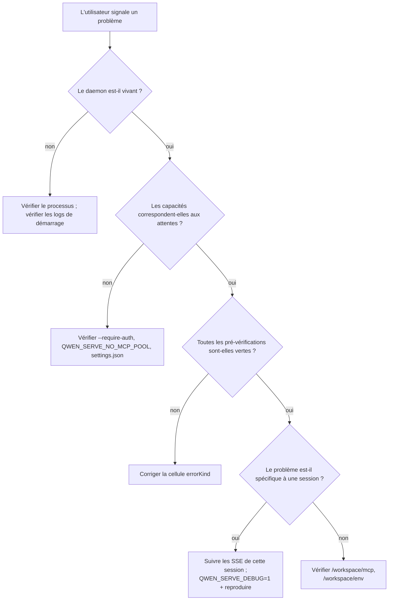

# Observabilité et débogage

## Vue d'ensemble

`qwen serve` intègre actuellement **l'instrumentation de spans OpenTelemetry**, **des logs structurés dans des fichiers** (`DaemonLogger`), **des logs d'accès par requête**, des logs de débogage sur stderr, des cellules de pré-vérification structurées et un anneau d'audit des permissions en mémoire. Cette page est un guide pratique de la surface d'observabilité actuelle et des lacunes à garder en mémoire lors du diagnostic.

## Ce qui existe aujourd'hui

| Surface                               | Emplacement                                | Objectif                                                                                                                                                                                                                                                                                                                                                  |
| --------------------------------------- | ------------------------------------------- | --------------------------------------------------------------------------------------------------------------------------------------------------------------------------------------------------------------------------------------------------------------------------------------------------------------------------------------------------------- |
| Logs stderr `QWEN_SERVE_DEBUG`         | `bridge.ts` et points d'appel               | Les valeurs `1` / `true` / `on` / `yes` (insensibles à la casse) écrivent des lignes `qwen serve debug: ...` sur stderr.                                                                                                                                                                                                                                  |
| Instrumentation de spans OpenTelemetry | `server.ts` `daemonTelemetryMiddleware`     | Chaque requête HTTP est encapsulée dans `withDaemonRequestSpan` ; les attributs incluent la route, sessionId, clientId et le code de statut. Les routes de permissions ont des spans dédiées. Le cycle de vie d'une invite est tracé de bout en bout. La configuration se trouve dans `settings.json` `telemetry`.                                          |
| Logs structurés `DaemonLogger`         | `serve/daemon-logger.ts`                    | Des lignes de log structurées au format JSON-like sont écrites dans un fichier. Le démarrage affiche `daemon log -> <path>`. Prend en charge les niveaux `info` / `warn` / `error`, avec des champs structurés tels que `route`, `sessionId`, `clientId`, `childPid` et `channelId`.                                                                         |
| Middleware de log d'accès par requête   | `server.ts`, enregistré avant `bearerAuth`  | Enregistre `method`, `path`, `status`, `durationMs`, `sessionId` et `clientId` après chaque requête. Ignore `GET /health` et les heartbeats. Les statuts 4xx+ utilisent `warn` ; les succès utilisent `info`.                                                                                                                                               |
| `/health`                               | Route `server.ts`                           | Sonde de vivacité ; `?deep=1` renvoie des détails étendus.                                                                                                                                                                                                                                                                                               |
| `/capabilities`                         | Route `server.ts`                           | Découverte des fonctionnalités en pré-vérification. Voir [`11-capabilities-versioning.md`](./11-capabilities-versioning.md).                                                                                                                                                                                                                                |
| `/workspace/preflight`                  | Route -> `DaemonStatusProvider`             | Cellules structurées de disponibilité : version de Node, CLI entry, ripgrep, git, npm, plus cellules ACP une fois qu'un enfant est vivant.                                                                                                                                                                                                                 |
| `/workspace/env`                        | Route -> `DaemonStatusProvider`             | Instantané des variables d'environnement du processus daemon. Les variables secrètes n'indiquent que leur présence ; les identifiants d'URL de proxy sont supprimés.                                                                                                                                                                                       |
| `/workspace/mcp`                        | Route -> méthode extBridge                  | Instantané du pool, du budget et des refus.                                                                                                                                                                                                                                                                                                                |
| `/workspace/skills`, `/workspace/providers` | Routes                                 | Instantanés ACP en direct ; renvoient des données vides au repos lorsqu'aucune session n'existe.                                                                                                                                                                                                                                                          |
| SSE par session                         | `GET /session/:id/events`                   | Flux d'événements en temps réel.                                                                                                                                                                                                                                                                                                                          |
| Console de débogage `/demo`             | `GET /demo` (`packages/cli/src/serve/demo.ts`) | Console monopage accessible depuis le navigateur : chat, journal d'événements, inspecteur d'espace de travail et UX des permissions. En boucle locale, `http://127.0.0.1:4170/demo` est le chemin de validation de bout en bout le plus rapide sans écrire de code SDK. Les règles d'enregistrement sont dans [`02-serve-runtime.md`](./02-serve-runtime.md). |
| `PermissionAuditRing`                   | `permission-audit.ts`                       | Anneau FIFO en mémoire de 512 décisions de permissions.                                                                                                                                                                                                                                                                                                   |
| Journal `decisionReason` du médiateur   | `permissionMediator.ts`                     | Enregistrement structuré interne expliquant pourquoi une demande de permission a été résolue de cette manière.                                                                                                                                                                                                                                             |

## Ce qui n'existe pas aujourd'hui

- **Pas de point de terminaison Prometheus / métriques.** Il n'y a pas de `process_cpu_seconds_total`, `http_requests_total` ou `event_bus_queue_depth`.
- **Pas de collecte externe pour `PermissionAuditRing`.** L'anneau existe, mais les hooks de diffusion vers un SIEM ou un stockage externe ne sont pas câblés.

## Procédures de débogage

### 1. Le daemon est-il vivant ?

```bash
curl -s http://127.0.0.1:4170/health
# {"status":"ok"}

curl -s 'http://127.0.0.1:4170/health?deep=1' | jq
# {"status":"ok","workspaceCwd":"/path","sessions":N,...}
```

Une erreur 401 sur la boucle locale signifie que `--require-auth` est probablement activé. Utilisez `QWEN_SERVE_DEBUG=1` au démarrage pour voir les logs de démarrage.

### 2. Quelles fonctionnalités sont disponibles ?

```bash
curl -s http://127.0.0.1:4170/capabilities | jq
```

Vérifiez `mcp_workspace_pool` (pool F2 activé ?), `require_auth` (durci ?), `permission_mediation.modes` (politiques prises en charge) et `policy.permission` (politique active).

### 3. La disponibilité de l'hôte du daemon est-elle saine ?

```bash
curl -s http://127.0.0.1:4170/workspace/preflight | jq
```

Les cellules avec `status: 'not_started'` sont au niveau ACP et se remplissent uniquement après la connexion de la première session. Les cellules avec `status: 'fail'` incluent un `errorKind` fermé ; elles affichent des instructions de correction structurées dans [`18-error-taxonomy.md`](./18-error-taxonomy.md).

### 4. Suivre le flux SSE d'une session

```bash
curl -N -H 'Accept: text/event-stream' \
     -H 'Authorization: Bearer XYZ' \
     -H 'X-Qwen-Client-Id: debug-tail' \
     -H 'Last-Event-ID: 0' \
     'http://127.0.0.1:4170/session/<sid>/events'
```

`-N` désactive la mise en tampon de la sortie de curl. `Last-Event-ID: 0` demande une relecture des événements de l'anneau avec `id > 0`.

### 5. Pourquoi une demande de permission a-t-elle été résolue de cette manière ?

`PermissionAuditRing` est en mémoire et n'a pas de surface HTTP pour l'instant. Activez `QWEN_SERVE_DEBUG=1` et reproduisez le problème ; le médiateur imprime des lignes structurées pour chaque vote et décision, y compris `decisionReason.type`. Une future PR pourra exposer l'anneau via HTTP.

### 6. Quel consommateur est lent ?

`slow_client_warning` se déclenche une fois par épisode de saturation lorsque la file atteint 75 %. Abonnez-vous au flux SSE de la session et recherchez la trame synthétique ; la charge utile inclut `queueSize`, `maxQueued` et `lastEventId`. Des avertissements répétés indiquent un consommateur bloqué, généralement une boucle `for await` du SDK qui est bloquée.

### 7. Pourquoi un serveur MCP a-t-il été refusé ?

Combinez la liste `refusedServerNames` de `/workspace/mcp` par cellule avec `disabledReason: 'budget'`, ainsi que les événements SSE `mcp_child_refused_batch`. Comparez-les avec `/capabilities` `mcp_guardrails.modes` (`enforce` actif ?) et l'état en direct du `--mcp-client-budget` visible via `getReservedSlots()`.

### 8. Le daemon ne s'arrête pas

Le premier signal déclenche un arrêt progressif (voir [`02-serve-runtime.md`](./02-serve-runtime.md)). Si il ne se termine pas après 10 secondes, vérifiez :

- Le processus enfant ACP n'a pas répondu à la fermeture progressive.
- Les longues connexions SSE ont empêché `server.close()` de se fermer au-delà de `SHUTDOWN_FORCE_CLOSE_MS` (5 s).

Un **second** SIGTERM/SIGINT déclenche intentionnellement `bridge.killAllSync()` + `process.exit(1)`.

## Flux

### Flux de diagnostic typique



## État et cycle de vie

- `QWEN_SERVE_DEBUG` est lu à chaque vérification via `isServeDebugMode()` dans `debug-mode.ts` ; le changer ne nécessite pas de redémarrage. Les logs de démarrage ne sont pas disponibles à moins que la variable d'environnement ait été définie au démarrage.
- `PermissionAuditRing` est limité à 512 entrées FIFO ; les enregistrements les plus anciens sont silencieusement supprimés.
- `DaemonStatusProvider` reconstruit les cellules à chaque requête et ne met pas en cache ; évitez les interrogations haute fréquence inutiles.

## Dépendances

- `process.stderr.write` pour les logs de débogage sur stderr.
- `DaemonLogger` pour les logs structurés dans des fichiers.
- SDK OpenTelemetry via `initializeTelemetry` et `createDaemonBridgeTelemetry`.
- `node:process` pour l'inspection des variables d'environnement et des signaux.

## Configuration

| Réglage                         | Effet                                                                                            |
| ------------------------------- | ------------------------------------------------------------------------------------------------ |
| `QWEN_SERVE_DEBUG`              | Active les logs verbeux sur stderr. Voir [`17-configuration.md`](./17-configuration.md).          |
| `settings.json` `telemetry`     | Contrôle le comportement OTel : `enabled`, `otlpEndpoint`, `otlpProtocol` et points de terminaison par signal. |
| Chemin du log `DaemonLogger`    | Généré au démarrage et affiché sur stderr sous la forme `daemon log -> <path>`.                   |
| Taille de `PermissionAuditRing` | Codée en dur à 512 pour l'instant.                                                              |
| Seuil `slow_client_warning`     | `0.75` / `0.375`, codé en dur dans `eventBus.ts`.                                               |

## Mises en garde et limites connues

- **Les logs structurés de DaemonLogger** peuvent être filtrés par `route`, `sessionId` et `clientId`. Les logs stderr de `QWEN_SERVE_DEBUG` restent du texte non structuré.
- **Les spans OpenTelemetry incluent la corrélation par requête.** Chaque span de requête HTTP porte les attributs route, sessionId et clientId qui peuvent être joints dans un backend de tracing.
- **Les cellules ACP de `/workspace/preflight` nécessitent une session active.** Sur un daemon inactif, l'authentification / MCP / skills / fournisseurs peuvent afficher `status: 'not_started'` ; c'est normal.
- **`/workspace/env` ne rapporte que la présence des secrets, pas leurs valeurs.** N'exposez pas la réponse là où la simple présence d'un secret est sensible.
- **L'anneau d'audit est local au processus** et l'historique est perdu lors du redémarrage du daemon.
- **Aucune procédure de test de charge n'est documentée ici.** La référence de performance se trouve sur la branche `test/perf-daemon-baseline`.

## Références

- `packages/cli/src/serve/daemon-status-provider.ts`
- `packages/cli/src/serve/daemon-logger.ts` (`DaemonLogger`, `buildDaemonLogLine`)
- `packages/cli/src/serve/debug-mode.ts` (`isServeDebugMode`)
- `packages/acp-bridge/src/permissionMediator.ts` (`PermissionDecisionReason`)
- `packages/cli/src/serve/server.ts` (`daemonTelemetryMiddleware`, middleware de log d'accès)
- Configuration : [`17-configuration.md`](./17-configuration.md)
- Taxonomie des erreurs : [`18-error-taxonomy.md`](./18-error-taxonomy.md)
- Guide des opérations utilisateur : [`../../users/qwen-serve.md`](../../users/qwen-serve.md)