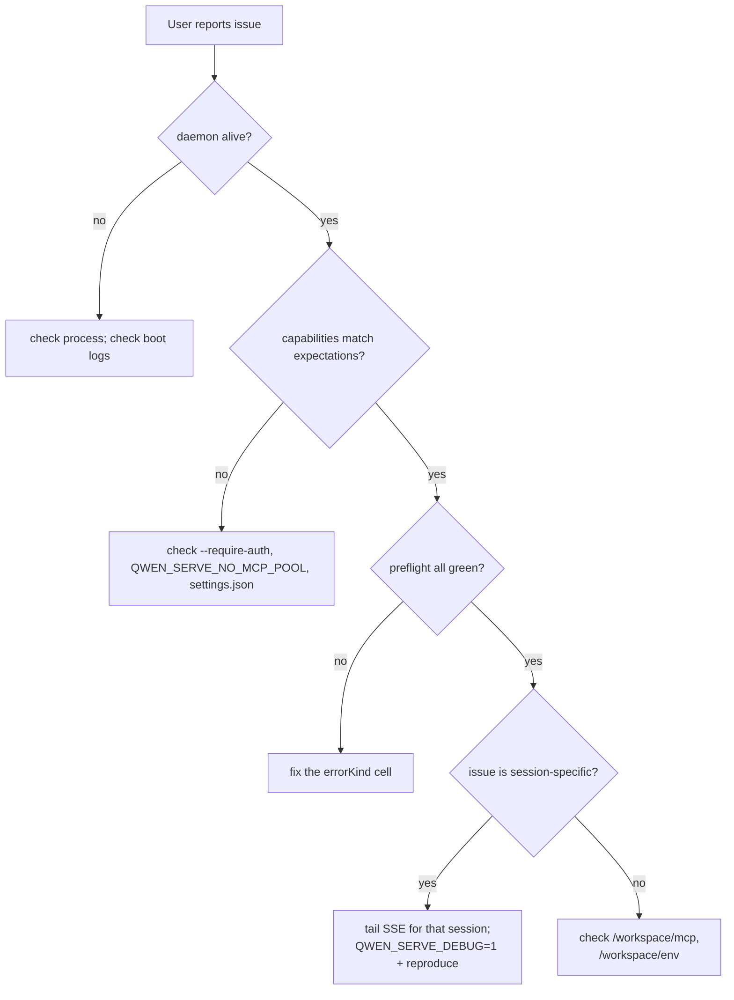

# Observabilité et débogage

## Aperçu

`qwen serve` est actuellement livré avec **l'instrumentation des spans OpenTelemetry**, **les journaux structurés** (`DaemonLogger`), **les journaux d'accès par requête**, les journaux de débogage sur stderr, les cellules structurées de pré-vérification, et un anneau d'audit des permissions en mémoire. Cette page est un guide pratique de la surface d'observabilité actuelle et des lacunes à retenir lors du triage.

## Ce qui existe aujourd'hui

| Surface                                     | Emplacement                                   | Objectif                                                                                                                                                                                                                                                                        |
| ------------------------------------------- | --------------------------------------------- | ------------------------------------------------------------------------------------------------------------------------------------------------------------------------------------------------------------------------------------------------------------------------------- |
| Journaux stderr de `QWEN_SERVE_DEBUG`       | `bridge.ts` et sites d'appel                  | Les valeurs d'env `1` / `true` / `on` / `yes` (insensibles à la casse) impriment les lignes `qwen serve debug: ...` sur stderr.                                                                                                                                                 |
| Instrumentation des spans OpenTelemetry     | `server.ts` `daemonTelemetryMiddleware`       | Chaque requête HTTP est encapsulée dans `withDaemonRequestSpan` ; les attributs incluent la route, sessionId, clientId et le code de statut. Les routes de permissions ont des spans dédiées. Le cycle de vie des prompts est tracé de bout en bout. La configuration se trouve dans `settings.json` `telemetry`. |
| Journaux structurés de `DaemonLogger`       | `serve/daemon-logger.ts`                      | Des lignes de log structurées de type JSON sont écrites dans un fichier. Le démarrage imprime `daemon log -> <path>`. Prend en charge les niveaux `info` / `warn` / `error`, avec des champs structurés tels que `route`, `sessionId`, `clientId`, `childPid` et `channelId`. |
| Middleware de journal d'accès par requête   | `server.ts`, enregistré avant `bearerAuth`    | Enregistre `method`, `path`, `status`, `durationMs`, `sessionId` et `clientId` après chaque requête. Ignore `GET /health` et le heartbeat. Les 4xx+ utilisent `warn` ; les succès utilisent `info`.                                                                            |
| `/health`                                   | route `server.ts`                             | Sonde de liveness ; `?deep=1` renvoie des détails étendus.                                                                                                                                                                                                                     |
| `/capabilities`                             | route `server.ts`                             | Découverte des fonctionnalités en pré-vérification. Voir [`11-capabilities-versioning.md`](./11-capabilities-versioning.md).                                                                                                                                                   |
| `/workspace/preflight`                      | Route -> `DaemonStatusProvider`                | Cellules structurées de disponibilité : version de Node, entrée CLI, ripgrep, git, npm, plus les cellules de niveau ACP une fois qu'un enfant est actif.                                                                                                                       |
| `/workspace/env`                            | Route -> `DaemonStatusProvider`                | Capture d'écran de l'environnement du processus daemon. Les variables d'env secrètes signalent uniquement leur présence ; les identifiants d'URL proxy sont supprimés.                                                                                                          |
| `/workspace/mcp`                            | Route -> bridge extMethod                      | Instantané du pool, du budget et des refus.                                                                                                                                                                                                                                    |
| `/workspace/skills`, `/workspace/providers` | Routes                                         | Instantanés en direct côté ACP ; renvoient des données vides inactives lorsqu'aucune session n'existe.                                                                                                                                                                         |
| SSE par session                             | `GET /session/:id/events`                      | Flux d'événements en temps réel.                                                                                                                                                                                                                                                |
| Console de débogage `/demo`                 | `GET /demo` (`packages/cli/src/serve/demo.ts`) | Console monopage accessible via navigateur : chat, journal d'événements, inspecteur d'espace de travail et UX de permissions. Sur loopback, `http://127.0.0.1:4170/demo` est le chemin de validation de bout en bout le plus rapide sans écrire de code SDK. Les règles d'enregistrement sont dans [`02-serve-runtime.md`](./02-serve-runtime.md). |
| `PermissionAuditRing`                       | `permission-audit.ts`                          | FIFO en mémoire de 512 décisions de permissions.                                                                                                                                                                                                                               |
| Audit du `decisionReason` du médiateur       | `permissionMediator.ts`                        | Enregistrement structuré interne expliquant pourquoi une demande de permission a été résolue de cette manière.                                                                                                                                                                 |
## Ce qui n'existe pas aujourd'hui

- **Pas de point de terminaison Prometheus / métriques.** Il n'y a pas de `process_cpu_seconds_total`, `http_requests_total`, ni `event_bus_queue_depth`.
- **Pas de collecte d'audit externe pour `PermissionAuditRing`.** L'anneau existe, mais les hooks de diffusion vers le SIEM ou un stockage externe ne sont pas câblés.

## Recettes de débogage

### 1. Le démon est-il vivant ?

```bash
curl -s http://127.0.0.1:4170/health
# {"status":"ok"}

curl -s 'http://127.0.0.1:4170/health?deep=1' | jq
# {"status":"ok","workspaceCwd":"/path","sessions":N,...}
```

Une 401 sur loopback signifie que `--require-auth` est probablement activé. Utilisez `QWEN_SERVE_DEBUG=1` au démarrage pour voir les logs de démarrage.

### 2. Quelles fonctionnalités sont annoncées ?

```bash
curl -s http://127.0.0.1:4170/capabilities | jq
```

Vérifiez `mcp_workspace_pool` (pool F2 actif ?), `require_auth` (renforcé ?), `permission_mediation.modes` (politiques supportées), et `policy.permission` (politique active).

### 3. L'état de préparation du démon-hôte est-il sain ?

```bash
curl -s http://127.0.0.1:4170/workspace/preflight | jq
```

Les cellules `status: 'not_started'` sont de niveau ACP et ne se peuplent qu'après la première session attachée. Les cellules `status: 'fail'` incluent un `errorKind` fermé ; générez une remédiation structurée à partir de [`18-error-taxonomy.md`](./18-error-taxonomy.md).

### 4. Suivre un flux SSE de session

```bash
curl -N -H 'Accept: text/event-stream' \
     -H 'Authorization: Bearer XYZ' \
     -H 'X-Qwen-Client-Id: debug-tail' \
     -H 'Last-Event-ID: 0' \
     'http://127.0.0.1:4170/session/<sid>/events'
```

`-N` désactive la mise en mémoire tampon de la sortie curl. `Last-Event-ID: 0` demande une relecture des événements de l'anneau avec `id > 0`.

### 5. Pourquoi une demande d'autorisation a-t-elle été résolue de cette manière ?

`PermissionAuditRing` est en mémoire et n'a pas de surface HTTP aujourd'hui. Activez `QWEN_SERVE_DEBUG=1` et reproduisez ; le médiateur imprime des lignes structurées pour chaque vote et décision, y compris `decisionReason.type`. Une PR ultérieure pourra exposer l'anneau via HTTP.

### 6. Quel consommateur est lent ?

`slow_client_warning` se déclenche une fois par épisode de débordement lorsque la file d'attente atteint 75 %. Abonnez-vous au flux SSE de la session et recherchez la trame synthétique ; la charge utile inclut `queueSize`, `maxQueued` et `lastEventId`. Des avertissements répétés indiquent un consommateur bloqué, généralement une boucle `for await` SDK bloquée.

### 7. Pourquoi un serveur MCP a-t-il été refusé ?

Combinez `/workspace/mcp` par cellule `disabledReason: 'budget'`, la liste `refusedServerNames`, et les événements SSE `mcp_child_refused_batch`. Comparez-les avec `/capabilities` `mcp_guardrails.modes` (`enforce` actif ?) et l'état en direct de `--mcp-client-budget` visible via `getReservedSlots()`.

### 8. Le démon ne s'arrête pas

Le premier signal déclenche un arrêt gracieux (voir [`02-serve-runtime.md`](./02-serve-runtime.md)). S'il se bloque au-delà de 10 s, vérifiez :

- Le processus enfant ACP n'a pas répondu à la fermeture gracieuse.
- De longues connexions SSE ont maintenu HTTP `server.close()` ouvert au-delà de `SHUTDOWN_FORCE_CLOSE_MS` (5 s).

Un **deuxième** SIGTERM/SIGINT déclenche intentionnellement `bridge.killAllSync()` + `process.exit(1)`.

## Flux

### Flux de triage typique



## État et cycle de vie

- `QWEN_SERVE_DEBUG` est lu à chaque vérification via `isServeDebugMode()` depuis `debug-mode.ts` ; le basculer ne nécessite pas de redémarrage. Les logs de démarrage ne sont pas disponibles sauf si la variable d'environnement a été définie au démarrage.
- `PermissionAuditRing` est limité à 512 entrées FIFO ; les enregistrements plus anciens sont silencieusement supprimés.
- `DaemonStatusProvider` reconstruit les cellules par requête et ne met pas en cache ; évitez les sondages inutiles à haute fréquence.

## Dépendances

- `process.stderr.write` pour les stderr de débogage.
- `DaemonLogger` pour les logs structurés dans les fichiers.
- SDK OpenTelemetry via `initializeTelemetry` et `createDaemonBridgeTelemetry`.
- `node:process` pour l'inspection des variables d'environnement et des signaux.

## Configuration

| Réglage                            | Effet                                                                                       |
| ---------------------------------- | ------------------------------------------------------------------------------------------- |
| `QWEN_SERVE_DEBUG`                 | Active les logs stderr verbeux. Voir [`17-configuration.md`](./17-configuration.md).        |
| `settings.json` `telemetry`        | Contrôle le comportement OTel : `enabled`, `otlpEndpoint`, `otlpProtocol`, et les points de terminaison par signal. |
| Chemin de log `DaemonLogger`       | Généré au démarrage et affiché sur stderr comme `daemon log -> <path>`.                     |
| Taille de `PermissionAuditRing`    | Codé en dur à 512 aujourd'hui.                                                               |
| Seuil `slow_client_warning`        | `0.75` / `0.375`, codé en dur dans `eventBus.ts`.                                           |
## Mises en garde et limites connues

- **Les logs fichier de DaemonLogger sont structurés** et peuvent être filtrés par `route`, `sessionId` et `clientId`. Les logs stderr de `QWEN_SERVE_DEBUG` restent du texte non structuré.
- **Les spans OpenTelemetry incluent une corrélation par requête.** Chaque span de requête HTTP porte les attributs route, sessionId et clientId qui peuvent être joints dans un backend de tracing.
- **Les cellules ACP de niveau `/workspace/preflight` nécessitent une session active.** Sur un démon inactif, auth / MCP / skills / providers peuvent afficher `status: 'not_started'` ; c'est attendu.
- **`/workspace/env` ne rapporte que la présence d'un secret, pas les valeurs.** N'exposez pas la réponse lorsque la simple présence d'un secret est sensible.
- **L'anneau d'audit est local au processus** et l'historique est perdu lors du redémarrage du démon.
- **Aucun scénario de test de charge n'est documenté ici.** La référence de performance se trouve sur la branche `test/perf-daemon-baseline`.

## Références

- `packages/cli/src/serve/daemon-status-provider.ts`
- `packages/cli/src/serve/daemon-logger.ts` (`DaemonLogger`, `buildDaemonLogLine`)
- `packages/cli/src/serve/debug-mode.ts` (`isServeDebugMode`)
- `packages/acp-bridge/src/permissionMediator.ts` (`PermissionDecisionReason`)
- `packages/cli/src/serve/server.ts` (`daemonTelemetryMiddleware`, access-log middleware)
- Configuration : [`17-configuration.md`](./17-configuration.md)
- Taxonomie des erreurs : [`18-error-taxonomy.md`](./18-error-taxonomy.md)
- Guide des opérations utilisateur : [`../../users/qwen-serve.md`](../../users/qwen-serve.md)
