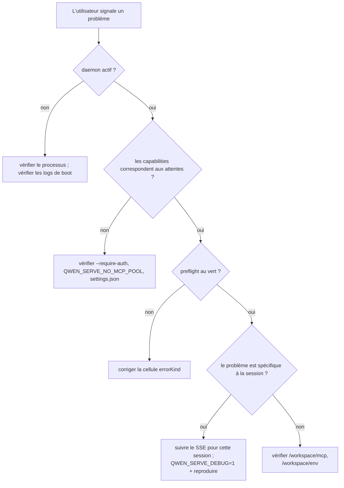

# Observabilité et débogage

## Vue d'ensemble

`qwen serve` est actuellement livré avec **l'instrumentation de spans OpenTelemetry**, **des logs de fichiers structurés** (`DaemonLogger`), **des logs d'accès par requête**, des logs stderr de débogage, des cellules preflight structurées et un anneau d'audit de permissions en mémoire. Cette page est un guide pratique sur la surface d'observabilité actuelle et les lacunes à garder en mémoire lors du triage.

## Ce qui existe aujourd'hui

| Surface                                     | Emplacement                                       | Objectif                                                                                                                                                                                                                                                                                   |
| ------------------------------------------- | ------------------------------------------------- | ------------------------------------------------------------------------------------------------------------------------------------------------------------------------------------------------------------------------------------------------------------------------------------------ |
| Logs stderr `QWEN_SERVE_DEBUG`              | `bridge.ts` et sites d'appel                      | Les valeurs d'env `1` / `true` / `on` / `yes` (insensibles à la casse) affichent les lignes `qwen serve debug: ...` sur stderr.                                                                                                                                                            |
| OpenTelemetry span instrumentation          | `server.ts` `daemonTelemetryMiddleware`           | Les requêtes API du démon classifiées qui atteignent le middleware de télémétrie sont enveloppées dans `withDaemonRequestSpan` ; les attributs incluent la route canonique, le hachage de workspace lorsqu'il est résolu, le sessionId, le clientId et le code de statut. Les routes de permissions ont des spans dédiés. Le cycle de vie des prompts est tracé de bout en bout. La configuration se trouve dans `settings.json` `telemetry`. |
| Métriques de performance du daemon OpenTelemetry | `telemetry/*event-loop-lag*`, `daemon-metrics` | Jauges de latence de la boucle d'événements pour le daemon et les processus enfants ACP, ainsi qu'histogrammes des octets des messages du pipe daemon-enfant.                                                                                                                              |
| Logs de fichiers structurés `DaemonLogger`  | `serve/daemon-logger.ts`                          | Ajoute les entrées à un `daemon.log` stable à rotation par taille. Les enregistrements `info` / `warn` / `error` émis avec un span OTel actif, enregistrant et échantillonné incluent `trace_id` et `span_id` ; les enregistrements fichier incluent aussi `runId` et le PID. Le boot affiche le chemin stable/fallback sélectionné ; le statut complet expose la santé, les problèmes et les compteurs de perte de copie de fichier. |
| Middleware de log d'accès par requête       | `server/access-log.ts`                         | Log `method`/`path`, statut, durée, session et premier ID client brut après chaque requête. Un bucket de burst de 60 jetons / 2 par seconde agrège le trafic excessif dans cinq compteurs de statut fixes. Les exclusions de health, heartbeat et SSE réussies restent.                                                                                                         |
| `/health`                                   | Route `server.ts`                                 | Sonde de liveness ; `?deep=1` renvoie des détails étendus.                                                                                                                                                                                                                                 |
| `/capabilities`                             | Route `server.ts`                                 | Découverte des fonctionnalités preflight. Voir [`11-capabilities-versioning.md`](./11-capabilities-versioning.md).                                                                                                                                                                         |
| `/workspace/preflight`                      | Route -> `DaemonStatusProvider`                   | Cellules de readiness structurées : version de Node, entrée CLI, ripgrep, git, npm, ainsi que les cellules au niveau ACP une fois qu'un enfant est actif.                                                                                                                                  |
| `/workspace/env`                            | Route -> `DaemonStatusProvider`                   | Snapshot de l'environnement du processus daemon. Les variables d'env secrètes signalent uniquement leur présence ; les identifiants de l'URL du proxy sont supprimés.                                                                                                                      |
| `/workspace/mcp`                            | Route -> bridge extMethod                         | Snapshot du pool, du budget et des refus.                                                                                                                                                                                                                                                  |
| `/workspace/skills`, `/workspace/providers` | Routes                                            | Snapshots en direct côté ACP ; renvoient des données inactives vides lorsqu'aucune session n'existe.                                                                                                                                                                                       |
| SSE par session                             | `GET /session/:id/events`                         | Flux d'événements en temps réel.                                                                                                                                                                                                                                                           |
| Web Shell UI                                | `GET /` (`packages/cli/src/serve/web-shell-static.ts`) | UI navigateur servie depuis les assets Web Shell bundled : chat, liste de sessions, inspecteur de workspace et UX de permissions. Sur loopback, `http://127.0.0.1:4170/` est le chemin de validation de bout en bout le plus rapide sans écrire de code SDK. Les règles d'enregistrement se trouvent dans [`02-serve-runtime.md`](./02-serve-runtime.md). |
| `PermissionAuditRing`                       | `permission-audit.ts`                             | FIFO en mémoire de 512 décisions de permission.                                                                                                                                                                                                                                            |
| Audit `decisionReason` du médiateur         | `permissionMediator.ts`                           | Enregistrement structuré interne expliquant pourquoi une demande de permission a été résolue de telle ou telle manière.                                                                                                                                                                    |

## Ce qui n'existe pas aujourd'hui

- **Pas de point de terminaison Prometheus / métriques.** Les métriques OTel peuvent être exportées, mais le daemon n'expose pas de point de terminaison de scrape Prometheus.
- **Pas de sink d'audit externe pour `PermissionAuditRing`.** L'anneau existe, mais les hooks de fan-out vers un SIEM ou un stockage externe ne sont pas câblés.

## Recettes de débogage

### 1. Le daemon est-il actif ?

```bash
curl -s http://127.0.0.1:4170/health
# {"status":"ok"}

curl -s 'http://127.0.0.1:4170/health?deep=1' | jq
# {"status":"ok","workspaceCount":N,"sessions":N,...}
```

Le deep health totalise tous les runtimes de workspace gérés, y compris les runtimes encore en vidage. C'est un snapshot de compteur informatif, pas une readiness par workspace ; utilisez `/daemon/status` lorsque les diagnostics individuels de workspace ou de transport importent.

Un 401 sur loopback signifie que `--require-auth` est probablement activé. Utilisez `QWEN_SERVE_DEBUG=1` au démarrage pour voir les logs de boot.

### 2. Quelles fonctionnalités sont annoncées ?

```bash
curl -s http://127.0.0.1:4170/capabilities | jq
```

Vérifiez `mcp_workspace_pool` (pool F2 activé ?), `require_auth` (renforcé ?), `permission_mediation.modes` (politiques prises en charge) et `policy.permission` (politique active).

### 3. La readiness de l'hôte du daemon est-elle saine ?

```bash
curl -s http://127.0.0.1:4170/workspace/preflight | jq
```

Les cellules `status: 'not_started'` sont au niveau ACP et ne se remplissent qu'après l'attachement de la première session. Les cellules `status: 'fail'` incluent un `errorKind` fermé ; appliquez la remédiation structurée de [`18-error-taxonomy.md`](./18-error-taxonomy.md).

### 4. Suivre un flux SSE de session

```bash
curl -N -H 'Accept: text/event-stream' \
     -H 'Authorization: Bearer XYZ' \
     -H 'X-Qwen-Client-Id: debug-tail' \
     -H 'Last-Event-ID: 0' \
     'http://127.0.0.1:4170/session/<sid>/events'
```

`-N` désactive la mise en tampon de la sortie de curl. `Last-Event-ID: 0` demande une relecture pour les événements de l'anneau avec `id > 0`.

### 5. Pourquoi une demande de permission a-t-elle été résolue ainsi ?

`PermissionAuditRing` est en mémoire et n'a pas de surface HTTP aujourd'hui. Activez `QWEN_SERVE_DEBUG=1` et reproduisez le problème ; le médiateur affiche des lignes structurées pour chaque vote et décision, y compris `decisionReason.type`. Une PR ultérieure pourra exposer l'anneau via HTTP.

### 6. Quel consommateur est lent ?

`slow_client_warning` se déclenche une fois par épisode de débordement lorsque la file d'attente atteint 75 %. Abonnez-vous au flux SSE de la session et recherchez la frame synthétique ; la charge utile inclut `queueSize`, `maxQueued` et `lastEventId`. Des avertissements répétés indiquent un consommateur bloqué, généralement une boucle SDK `for await` bloquée.

### 7. Pourquoi un serveur MCP a-t-il été refusé ?

Combinez `/workspace/mcp` par cellule `disabledReason: 'budget'`, la liste `refusedServerNames` et les événements SSE `mcp_child_refused_batch`. Comparez-les avec `/capabilities` `mcp_guardrails.modes` (`enforce` actif ?) et l'état en direct de `--mcp-client-budget` visible via `getReservedSlots()`.

### 8. Le daemon ne s'arrête pas

Le premier signal déclenche un arrêt gracieux (voir [`02-serve-runtime.md`](./02-serve-runtime.md)). S'il reste bloqué au-delà de 10 s, vérifiez :

- Le processus enfant ACP n'a pas répondu à la fermeture gracieuse.
- Les longues connexions SSE ont maintenu `server.close()` HTTP ouvert au-delà de `SHUTDOWN_FORCE_CLOSE_MS` (5 s).

Un **deuxième** SIGTERM/SIGINT déclenche intentionnellement `bridge.killAllSync()` + `process.exit(1)`.

### 9. La boucle d'événements du daemon, la file d'attente de prompts ou le pipe ACP est-elle surchargée ?

`GET /daemon/status` peut inclure `runtime.perf` lorsque le runtime du daemon de production injecte le fournisseur de snapshot de performance :

```json
{
  "runtime": {
    "perf": {
      "eventLoop": { "meanMs": 1.2, "p50Ms": 1.0, "p99Ms": 9.5, "maxMs": 25 },
      "promptQueueWait": {
        "count": 3,
        "meanMs": 12.5,
        "maxMs": 35,
        "lastMs": 4
      },
      "pipe": {
        "inbound": { "count": 42, "totalBytes": 100000, "maxBytes": 12000 },
        "outbound": { "count": 41, "totalBytes": 90000, "maxBytes": 11000 }
      }
    }
  }
}
```

La charge utile de statut est uniquement pour le daemon. `promptQueueWait` résume les échantillons d'attente de la file FIFO de prompts observés dans le processus daemon. La latence de la boucle d'événements du processus enfant ACP n'est intentionnellement pas agrégée dans `/daemon/status` ; elle est visible via la jauge OTel `qwen-code.acp.event_loop.lag` et via les lignes de stall stderr transmises dans les logs du daemon.

### 10. La journalisation fichier s'est-elle dégradée ou a-t-elle perdu des enregistrements ?

Utilisez le statut complet du daemon :

```bash
curl -s 'http://127.0.0.1:4170/daemon/status?detail=full' | \
  jq '{status, issues, daemon: {runId: .daemon.runId, logMode: .daemon.logMode, logHealth: .daemon.logHealth, logPath: .daemon.logPath, logIssues: .daemon.logIssues, droppedRecords: .daemon.logDroppedRecords, droppedBytes: .daemon.logDroppedBytes}}'
```

`stable` est le propriétaire normal, `fallback` signifie qu'un autre daemon possède la famille stable, et `stderr-only` signifie que la journalisation fichier est désactivée ou indisponible. `fallback/ok` est attendu en cas de concurrence intentionnelle. Un avertissement `daemon_log_degraded` ne contient aucun chemin ; demandez le détail complet pour le chemin réel et les codes de problème du logger. Utilisez `runId` pour séparer les redémarrages dans le fichier stable.

Nouveaux noms de métriques OTel :

- `qwen-code.daemon.event_loop.lag`, jauge en millisecondes avec `stat=mean|p50|p99|max`.
- `qwen-code.acp.event_loop.lag`, jauge en millisecondes avec `stat=mean|p50|p99|max`.
- `qwen-code.daemon.prompt.queue_wait`, histogramme en millisecondes.
- `qwen-code.daemon.pipe.message_bytes`, histogramme en octets avec `direction=inbound|outbound`.

### 11. Le démon est-il sous pression mémoire ?

```bash
curl -s 'http://127.0.0.1:4170/daemon/status' | \
  jq '.runtime.memory.pressure'
```

`level` est `normal` / `soft` / `hard` / `critical`, classifié à partir de `ratio` — le pire entre `rssRatio` (RSS par rapport à la mémoire cgroup/hôte détectée, c'est-à-dire ce que l'OOM killer surveille) et `heapRatio` (heap V8 utilisée par rapport à `heap_size_limit` de ce processus — le heap entier, pas seulement l'old space que `--max-old-space-size` nomme). `source` indique lequel l'a produit. Vérifiez `source` avant d'agir : `unknown` signifie que le démon n'a pu mesurer aucun des deux côtés, donc `normal` dans ce cas est l'absence de lecture, pas une preuve de santé. Un côté n'est rapporté que lorsque son numérateur et son dénominateur étaient tous deux utilisables, donc `source` est aussi ce qui distingue un `rssBytes` / `heapUsedBytes` à zéro d'une valeur réelle.

**`rssRatio` n'est aussi bon que son dénominateur, et `limits.memory.availableMemorySource` est ce qui l'évalue.** Sous un cgroup (`constrained`), c'est exactement la limite que l'OOM killer applique, donc le ratio a le sens qu'il affiche. Sur du métal nu (`host`), c'est la taille de la machine entière, alors que le démon meurt réellement quand la _machine_ est à court — ce qui dépend de tous les autres processus sur la machine. Un démon occupant 20 % d'un hôte de 64 Go à côté d'un voisin de 55 Go rapporte `level: normal, source: rss` jusqu'à ce qu'il soit tué. Sous `source: 'host'`, lisez `rssRatio` comme une **limite inférieure** de la pression réelle. Ceci est distinct du fait que les seuils ne sont pas calibrés : aucun choix de seuil ne corrige un dénominateur qui mesure la mauvaise chose.

Deux choses supplémentaires que cela ne couvre **pas**. C'est uniquement le processus **racine** du démon, donc un démon dont les enfants `qwen --acp` sont ceux qui grossissent peut rapporter `normal` en permanence — lisez `runtime.memory.children` à côté, qui somme le RSS propre des enfants actifs (et indique via `sampled` combien ont effectivement rapporté). Et rien ne remédie : quitter `normal` lève un avertissement `daemon_memory_pressure` et ne change aucun comportement.

Sous `--memory-pressure-mode off`, chaque chiffre ci-dessus est toujours rapporté et le problème n'est pas levé, donc le `status` de premier niveau reste ce qu'il aurait été. Utilisez `off` lors du calibrage des seuils par rapport à une charge réelle, ou si vous alertez sur `status` et ne voulez pas qu'un signal non calibré le modifie.

## Flux

### Flux de triage typique


```mermaid
flowchart TD
    A[L'utilisateur signale un problème] --> B{daemon actif ?}
    B -->|non| BD[vérifier le processus ; vérifier les logs de boot]
    B -->|oui| C{les capabilities correspondent aux attentes ?}
    C -->|non| CD["vérifier --require-auth, QWEN_SERVE_NO_MCP_POOL, settings.json"]
    C -->|oui| D{preflight au vert ?}
    D -->|non| DD["corriger la cellule errorKind"]
    D -->|oui| E{le problème est spécifique à la session ?}
    E -->|oui| ES["suivre le SSE pour cette session ;<br/>QWEN_SERVE_DEBUG=1 + reproduire"]
    E -->|non| EW["vérifier /workspace/mcp,<br/>/workspace/env"]
```

## État et cycle de vie

- `QWEN_SERVE_DEBUG` est lu à chaque vérification via `isServeDebugMode()` depuis `debug-mode.ts` ; le modifier ne nécessite pas de redémarrage. Les logs de boot ne sont pas disponibles sauf si l'env a été définie au boot.
- `PermissionAuditRing` est limité à 512 entrées FIFO ; les enregistrements plus anciens sont supprimés silencieusement.
- `DaemonStatusProvider` reconstruit les cellules par requête et ne met pas en cache ; évitez le polling haute fréquence inutile.
## Dépendances

- `process.stderr.write` pour le stderr de débogage.
- `DaemonLogger` pour les logs structurés dans des fichiers.
- SDK OpenTelemetry via `initializeTelemetry` et `createDaemonBridgeTelemetry`.
- `node:perf_hooks.monitorEventLoopDelay` pour les jauges de latence de l'event loop du daemon et de l'ACP.
- `node:process` pour l'inspection des variables d'environnement et des signaux.

## Configuration

| Paramètre                         | Effet                                                                                          |
| --------------------------------- | ---------------------------------------------------------------------------------------------- |
| `QWEN_SERVE_DEBUG`                | Active les logs stderr verbeux. Voir [`17-configuration.md`](./17-configuration.md).           |
| `settings.json` `telemetry`       | Contrôle le comportement d'OTel : `enabled`, `otlpEndpoint`, `otlpProtocol` et les endpoints par signal. |
| Chemin des logs `DaemonLogger`    | `debug/daemon/daemon.log` stable, ou un fallback spécifique au run sélectionné au boot.               |
| Taille de `PermissionAuditRing`   | Codée en dur à 512 actuellement.                                                               |
| Seuil de `slow_client_warning`    | `0.75` / `0.375`, codé en dur dans `eventBus.ts`.                                              |

## Mises en garde et limites connues

- **Les logs fichiers de DaemonLogger sont du texte structuré** dont les champs `trace_id`, `span_id`, `route`, `sessionId` et `clientId` peuvent être recherchés ou extraits avec une expression régulière. Les enregistrements `info` / `warn` / `error` incluent les champs de trace uniquement lorsque l'appel de log s'exécute avec un span OTel actif, enregistrant et échantillonné. Les enregistrements `raw` et de boot, les résumés de perte de fichier et les résumés de suppression de log d'accès les omettent intentionnellement. La corrélation est au mieux effort : une défaillance d'exporter peut rendre une trace échantillonnée indisponible dans le backend. Ces identifiants à haute cardinalité servent à la recherche diagnostique, pas aux labels de métriques ou à l'agrégation. Les logs stderr de `QWEN_SERVE_DEBUG` restent du texte non structuré.
- **Les mutations de prompt accepté, de continuation et d'annulation ont des logs de cycle de vie.** `prompt enqueued`, `continuation enqueued` et `cancel sent` incluent `sessionId`, `promptId` lorsque applicable, et `clientId` lorsqu'il est fourni ; le contenu du prompt n'est pas journalisé. Utilisez un ID client stable distinct pour chaque contrôleur indépendant. Les contrôleurs qui partagent intentionnellement un ID sont indiscernables dans ces enregistrements.
- **La rétention de DaemonLogger est basée sur la taille, pas sur l'âge.** Le fichier actif et quatre archives sont bornés par famille ; les propriétaires fallback en direct ne sont jamais supprimés.
- **Les résumés d'accès sont une comptabilité de perte intentionnelle.** Un WARN `access logs suppressed` représente des enregistrements d'accès individuels omis à la fois de stderr et du fichier ; il n'indique pas des requêtes HTTP abandonnées.
- **Un logrotate externe ne doit pas muter la famille active.** Utilisez un expéditeur qui lit/copie et rouvre le chemin stable après remplacement.
- **Les spans OpenTelemetry incluent une corrélation par requête.** Les requêtes API du démon classifiées qui passent l'authentification bearer, le rate limiting et l'analyse du corps portent les attributs de route canonique, sessionId, clientId et (lorsqu'il est résolu de manière unique) `qwen-code.workspace.hash`. Les requêtes rejetées par une gate de middleware antérieure n'ont pas ces spans de requête.
- **Les métriques HTTP sont globales au daemon.** Les métriques de requête HTTP OpenTelemetry et l'anneau de métriques de statut Web Shell n'incluent pas de dimension workspace. Une connexion SSE de session réussie a un span de requête mais est exclue des métriques ordinaires de compte/durée de requête car sa durée de vie n'est pas une latence de requête ; les handshakes SSE échoués sont comptés normalement.
- **`runtime.perf` est exclusif au daemon.** La latence de l'event loop des processus enfants n'y est pas rapportée par conception ; utilisez OTel ou les avertissements de blocage stderr transférés pour les blocages des processus enfants ACP.
- **Les cellules `/workspace/preflight` au niveau ACP nécessitent une session active.** Sur un daemon inactif, auth / MCP / skills / providers peuvent afficher `status: 'not_started'` ; c'est le comportement attendu.
- **`/workspace/env` rapporte uniquement la présence des secrets, pas leurs valeurs.** N'exposez pas la réponse si la simple présence d'un secret est sensible.
- **L'anneau d'audit est local au processus** et l'historique est perdu lors du redémarrage du daemon.
- **Aucune recette de test de charge n'est documentée ici.** La baseline de performance se trouve sur la branche `test/perf-daemon-baseline`.

## Références

- `packages/cli/src/serve/daemon-status-provider.ts`
- `packages/cli/src/serve/daemon-logger.ts` (`DaemonLogger`, `buildDaemonLogLine`)
- `packages/cli/src/serve/debug-mode.ts` (`isServeDebugMode`)
- `packages/acp-bridge/src/permissionMediator.ts` (`PermissionDecisionReason`)
- `packages/cli/src/serve/server.ts` (`daemonTelemetryMiddleware`, middleware d'access-log)
- Configuration : [`17-configuration.md`](./17-configuration.md)
- Taxonomie des erreurs : [`18-error-taxonomy.md`](./18-error-taxonomy.md)
- Guide des opérations utilisateur : [`../../users/qwen-serve.md`](../../users/qwen-serve.md)
