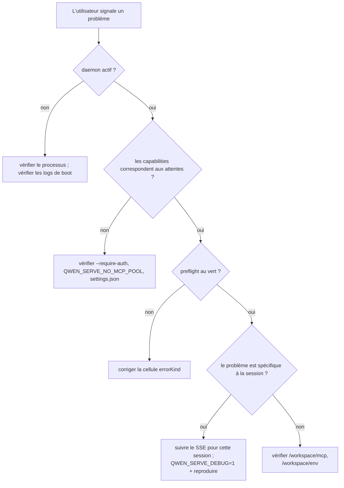

# Observabilité et débogage

## Vue d'ensemble

`qwen serve` est actuellement livré avec **l'instrumentation de spans OpenTelemetry**, **des logs de fichiers structurés** (`DaemonLogger`), **des logs d'accès par requête**, des logs stderr de débogage, des cellules preflight structurées et un anneau d'audit de permissions en mémoire. Cette page est un guide pratique sur la surface d'observabilité actuelle et les lacunes à garder en mémoire lors du triage.

## Ce qui existe aujourd'hui

| Surface                                     | Emplacement                                       | Objectif                                                                                                                                                                                                                                                                                   |
| ------------------------------------------- | ------------------------------------------------- | ------------------------------------------------------------------------------------------------------------------------------------------------------------------------------------------------------------------------------------------------------------------------------------------ |
| Logs stderr `QWEN_SERVE_DEBUG`              | `bridge.ts` et sites d'appel                      | Les valeurs d'env `1` / `true` / `on` / `yes` (insensibles à la casse) affichent les lignes `qwen serve debug: ...` sur stderr.                                                                                                                                                            |
| Instrumentation de spans OpenTelemetry      | `server.ts` `daemonTelemetryMiddleware`           | Chaque requête HTTP est enveloppée dans `withDaemonRequestSpan` ; les attributs incluent la route, le sessionId, le clientId et le code de statut. Les routes de permissions ont des spans dédiés. Le cycle de vie des prompts est tracé de bout en bout. La configuration se trouve dans `settings.json` `telemetry`. |
| Métriques de performance du daemon OpenTelemetry | `telemetry/*event-loop-lag*`, `daemon-metrics` | Jauges de latence de la boucle d'événements pour le daemon et les processus enfants ACP, ainsi qu'histogrammes des octets des messages du pipe daemon-enfant.                                                                                                                              |
| Logs de fichiers structurés `DaemonLogger`  | `serve/daemon-logger.ts`                          | Des lignes de log structurées de type JSON sont écrites dans un fichier. Le démarrage affiche `daemon log -> <path>`. Prend en charge les niveaux `info` / `warn` / `error`, avec des champs structurés tels que `route`, `sessionId`, `clientId`, `childPid` et `channelId`.             |
| Middleware de log d'accès par requête       | `server.ts`, enregistré avant `bearerAuth`         | Log `method`, `path`, `status`, `durationMs`, `sessionId` et `clientId` après chaque requête. Ignore `GET /health` et le heartbeat. 4xx+ utilise `warn` ; le succès utilise `info`.                                                                                                         |
| `/health`                                   | Route `server.ts`                                 | Sonde de liveness ; `?deep=1` renvoie des détails étendus.                                                                                                                                                                                                                                 |
| `/capabilities`                             | Route `server.ts`                                 | Découverte des fonctionnalités preflight. Voir [`11-capabilities-versioning.md`](./11-capabilities-versioning.md).                                                                                                                                                                         |
| `/workspace/preflight`                      | Route -> `DaemonStatusProvider`                   | Cellules de readiness structurées : version de Node, entrée CLI, ripgrep, git, npm, ainsi que les cellules au niveau ACP une fois qu'un enfant est actif.                                                                                                                                  |
| `/workspace/env`                            | Route -> `DaemonStatusProvider`                   | Snapshot de l'environnement du processus daemon. Les variables d'env secrètes signalent uniquement leur présence ; les identifiants de l'URL du proxy sont supprimés.                                                                                                                      |
| `/workspace/mcp`                            | Route -> bridge extMethod                         | Snapshot du pool, du budget et des refus.                                                                                                                                                                                                                                                  |
| `/workspace/skills`, `/workspace/providers` | Routes                                            | Snapshots en direct côté ACP ; renvoient des données inactives vides lorsqu'aucune session n'existe.                                                                                                                                                                                       |
| SSE par session                             | `GET /session/:id/events`                         | Flux d'événements en temps réel.                                                                                                                                                                                                                                                           |
| Console de débogage `/demo`                 | `GET /demo` (`packages/cli/src/serve/demo.ts`)    | Console monopage accessible via le navigateur : chat, log d'événements, inspecteur de workspace et UX de permissions. Sur loopback, `http://127.0.0.1:4170/demo` est le chemin de validation de bout en bout le plus rapide sans écrire de code SDK. Les règles d'enregistrement se trouvent dans [`02-serve-runtime.md`](./02-serve-runtime.md). |
| `PermissionAuditRing`                       | `permission-audit.ts`                             | FIFO en mémoire de 512 décisions de permission.                                                                                                                                                                                                                                            |
| Audit `decisionReason` du médiateur         | `permissionMediator.ts`                           | Enregistrement structuré interne expliquant pourquoi une demande de permission a été résolue de telle ou telle manière.                                                                                                                                                                    |

## Ce qui n'existe pas aujourd'hui

- **Pas de point de terminaison Prometheus / métriques.** Les métriques OTel peuvent être exportées, mais le daemon n'expose pas de point de terminaison de scrape Prometheus.
- **Pas de sink d'audit externe pour `PermissionAuditRing`.** L'anneau existe, mais les hooks de fan-out vers un SIEM ou un stockage externe ne sont pas câblés.

## Recettes de débogage

### 1. Le daemon est-il actif ?

```bash
curl -s http://127.0.0.1:4170/health
# {"status":"ok"}

curl -s 'http://127.0.0.1:4170/health?deep=1' | jq
# {"status":"ok","workspaceCwd":"/path","sessions":N,...}
```

Un 401 sur loopback signifie que `--require-auth` est probablement activé. Utilisez `QWEN_SERVE_DEBUG=1` au démarrage pour voir les logs de boot.

### 2. Quelles fonctionnalités sont annoncées ?

```bash
curl -s http://127.0.0.1:4170/capabilities | jq
```

Vérifiez `mcp_workspace_pool` (pool F2 activé ?), `require_auth` (renforcé ?), `permission_mediation.modes` (politiques prises en charge) et `policy.permission` (politique active).

### 3. La readiness de l'hôte du daemon est-elle saine ?

```bash
curl -s http://127.0.0.1:4170/workspace/preflight | jq
```

Les cellules `status: 'not_started'` sont au niveau ACP et ne se remplissent qu'après l'attachement de la première session. Les cellules `status: 'fail'` incluent un `errorKind` fermé ; appliquez la remédiation structurée de [`18-error-taxonomy.md`](./18-error-taxonomy.md).

### 4. Suivre un flux SSE de session

```bash
curl -N -H 'Accept: text/event-stream' \
     -H 'Authorization: Bearer XYZ' \
     -H 'X-Qwen-Client-Id: debug-tail' \
     -H 'Last-Event-ID: 0' \
     'http://127.0.0.1:4170/session/<sid>/events'
```

`-N` désactive la mise en tampon de la sortie de curl. `Last-Event-ID: 0` demande une relecture pour les événements de l'anneau avec `id > 0`.

### 5. Pourquoi une demande de permission a-t-elle été résolue ainsi ?

`PermissionAuditRing` est en mémoire et n'a pas de surface HTTP aujourd'hui. Activez `QWEN_SERVE_DEBUG=1` et reproduisez le problème ; le médiateur affiche des lignes structurées pour chaque vote et décision, y compris `decisionReason.type`. Une PR ultérieure pourra exposer l'anneau via HTTP.

### 6. Quel consommateur est lent ?

`slow_client_warning` se déclenche une fois par épisode de débordement lorsque la file d'attente atteint 75 %. Abonnez-vous au flux SSE de la session et recherchez la frame synthétique ; la charge utile inclut `queueSize`, `maxQueued` et `lastEventId`. Des avertissements répétés indiquent un consommateur bloqué, généralement une boucle SDK `for await` bloquée.

### 7. Pourquoi un serveur MCP a-t-il été refusé ?

Combinez `/workspace/mcp` par cellule `disabledReason: 'budget'`, la liste `refusedServerNames` et les événements SSE `mcp_child_refused_batch`. Comparez-les avec `/capabilities` `mcp_guardrails.modes` (`enforce` actif ?) et l'état en direct de `--mcp-client-budget` visible via `getReservedSlots()`.

### 8. Le daemon ne s'arrête pas

Le premier signal déclenche un arrêt gracieux (voir [`02-serve-runtime.md`](./02-serve-runtime.md)). S'il reste bloqué au-delà de 10 s, vérifiez :

- Le processus enfant ACP n'a pas répondu à la fermeture gracieuse.
- Les longues connexions SSE ont maintenu `server.close()` HTTP ouvert au-delà de `SHUTDOWN_FORCE_CLOSE_MS` (5 s).

Un **deuxième** SIGTERM/SIGINT déclenche intentionnellement `bridge.killAllSync()` + `process.exit(1)`.

### 9. La boucle d'événements du daemon, la file d'attente de prompts ou le pipe ACP est-elle surchargée ?

`GET /daemon/status` peut inclure `runtime.perf` lorsque le runtime du daemon de production injecte le fournisseur de snapshot de performance :

```json
{
  "runtime": {
    "perf": {
      "eventLoop": { "meanMs": 1.2, "p50Ms": 1.0, "p99Ms": 9.5, "maxMs": 25 },
      "promptQueueWait": { "count": 3, "meanMs": 12.5, "maxMs": 35, "lastMs": 4 },
      "pipe": {
        "inbound": { "count": 42, "totalBytes": 100000, "maxBytes": 12000 },
        "outbound": { "count": 41, "totalBytes": 90000, "maxBytes": 11000 }
      }
    }
  }
}
```

La charge utile de statut est uniquement pour le daemon. `promptQueueWait` résume les échantillons d'attente de la file FIFO de prompts observés dans le processus daemon. La latence de la boucle d'événements du processus enfant ACP n'est intentionnellement pas agrégée dans `/daemon/status` ; elle est visible via la jauge OTel `qwen-code.acp.event_loop.lag` et via les lignes de stall stderr transmises dans les logs du daemon.

Nouveaux noms de métriques OTel :

- `qwen-code.daemon.event_loop.lag`, jauge en millisecondes avec `stat=mean|p50|p99|max`.
- `qwen-code.acp.event_loop.lag`, jauge en millisecondes avec `stat=mean|p50|p99|max`.
- `qwen-code.daemon.prompt.queue_wait`, histogramme en millisecondes.
- `qwen-code.daemon.pipe.message_bytes`, histogramme en octets avec `direction=inbound|outbound`.

## Flux

### Flux de triage typique


```mermaid
flowchart TD
    A[L'utilisateur signale un problème] --> B{daemon actif ?}
    B -->|non| BD[vérifier le processus ; vérifier les logs de boot]
    B -->|oui| C{les capabilities correspondent aux attentes ?}
    C -->|non| CD["vérifier --require-auth, QWEN_SERVE_NO_MCP_POOL, settings.json"]
    C -->|oui| D{preflight au vert ?}
    D -->|non| DD["corriger la cellule errorKind"]
    D -->|oui| E{le problème est spécifique à la session ?}
    E -->|oui| ES["suivre le SSE pour cette session ;<br/>QWEN_SERVE_DEBUG=1 + reproduire"]
    E -->|non| EW["vérifier /workspace/mcp,<br/>/workspace/env"]
```

## État et cycle de vie

- `QWEN_SERVE_DEBUG` est lu à chaque vérification via `isServeDebugMode()` depuis `debug-mode.ts` ; le modifier ne nécessite pas de redémarrage. Les logs de boot ne sont pas disponibles sauf si l'env a été définie au boot.
- `PermissionAuditRing` est limité à 512 entrées FIFO ; les enregistrements plus anciens sont supprimés silencieusement.
- `DaemonStatusProvider` reconstruit les cellules par requête et ne met pas en cache ; évitez le polling haute fréquence inutile.
## Dépendances

- `process.stderr.write` pour le stderr de débogage.
- `DaemonLogger` pour les logs structurés dans des fichiers.
- SDK OpenTelemetry via `initializeTelemetry` et `createDaemonBridgeTelemetry`.
- `node:perf_hooks.monitorEventLoopDelay` pour les jauges de latence de l'event loop du daemon et de l'ACP.
- `node:process` pour l'inspection des variables d'environnement et des signaux.

## Configuration

| Paramètre                         | Effet                                                                                          |
| --------------------------------- | ---------------------------------------------------------------------------------------------- |
| `QWEN_SERVE_DEBUG`                | Active les logs stderr verbeux. Voir [`17-configuration.md`](./17-configuration.md).           |
| `settings.json` `telemetry`       | Contrôle le comportement d'OTel : `enabled`, `otlpEndpoint`, `otlpProtocol` et les endpoints par signal. |
| Chemin des logs `DaemonLogger`    | Généré au démarrage et affiché dans le stderr sous la forme `daemon log -> <path>`.            |
| Taille de `PermissionAuditRing`   | Codée en dur à 512 actuellement.                                                               |
| Seuil de `slow_client_warning`    | `0.75` / `0.375`, codé en dur dans `eventBus.ts`.                                              |

## Mises en garde et limites connues

- **Les logs fichiers de DaemonLogger sont structurés** et peuvent être filtrés par `route`, `sessionId` et `clientId`. Les logs stderr de `QWEN_SERVE_DEBUG` restent du texte non structuré.
- **Les spans OpenTelemetry incluent une corrélation par requête.** Chaque span de requête HTTP porte les attributs route, sessionId et clientId qui peuvent être joints dans un backend de tracing.
- **`runtime.perf` est exclusif au daemon.** La latence de l'event loop des processus enfants n'y est pas rapportée par conception ; utilisez OTel ou les avertissements de blocage stderr transférés pour les blocages des processus enfants ACP.
- **Les cellules `/workspace/preflight` au niveau ACP nécessitent une session active.** Sur un daemon inactif, auth / MCP / skills / providers peuvent afficher `status: 'not_started'` ; c'est le comportement attendu.
- **`/workspace/env` rapporte uniquement la présence des secrets, pas leurs valeurs.** N'exposez pas la réponse si la simple présence d'un secret est sensible.
- **L'anneau d'audit est local au processus** et l'historique est perdu lors du redémarrage du daemon.
- **Aucune recette de test de charge n'est documentée ici.** La baseline de performance se trouve sur la branche `test/perf-daemon-baseline`.

## Références

- `packages/cli/src/serve/daemon-status-provider.ts`
- `packages/cli/src/serve/daemon-logger.ts` (`DaemonLogger`, `buildDaemonLogLine`)
- `packages/cli/src/serve/debug-mode.ts` (`isServeDebugMode`)
- `packages/acp-bridge/src/permissionMediator.ts` (`PermissionDecisionReason`)
- `packages/cli/src/serve/server.ts` (`daemonTelemetryMiddleware`, middleware d'access-log)
- Configuration : [`17-configuration.md`](./17-configuration.md)
- Taxonomie des erreurs : [`18-error-taxonomy.md`](./18-error-taxonomy.md)
- Guide des opérations utilisateur : [`../../users/qwen-serve.md`](../../users/qwen-serve.md)