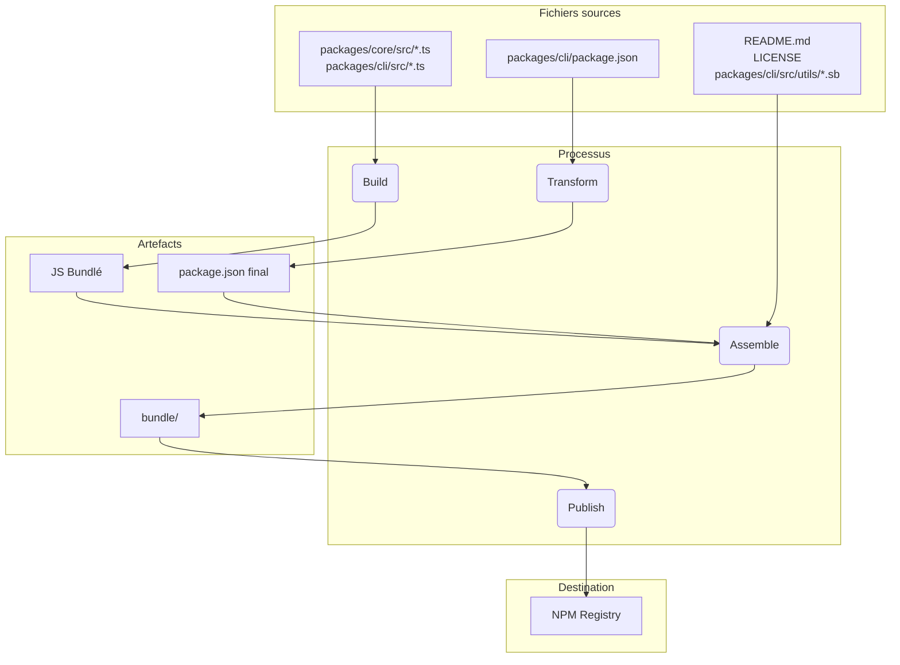

# Aperçu du Package

Ce monorepo contient deux packages principaux : `@qwen-code/qwen-code` et `@qwen-code/qwen-code-core`.

## `@qwen-code/qwen-code`

Il s'agit du package principal pour Qwen Code. Il est responsable de l'interface utilisateur, de l'analyse des commandes, et de toutes les autres fonctionnalités destinées à l'utilisateur.

Lorsque ce package est publié, il est regroupé dans un seul fichier exécutable. Ce bundle inclut toutes les dépendances du package, y compris `@qwen-code/qwen-code-core`. Cela signifie que, qu'un utilisateur installe le package avec `npm install -g @qwen-code/qwen-code` ou l'exécute directement avec `npx @qwen-code/qwen-code`, il utilise ce même exécutable autonome.

## `@qwen-code/qwen-code-core`

Ce package contient la logique principale du CLI. Il est responsable des requêtes API vers les fournisseurs configurés, de la gestion de l'authentification, et de la gestion du cache local.

Ce package n'est pas bundlé. Lorsqu'il est publié, il l'est en tant que package Node.js standard avec ses propres dépendances. Cela permet de l'utiliser comme package autonome dans d'autres projets, si nécessaire. Tout le code JS transpilé dans le dossier `dist` est inclus dans le package.

# Processus de release

Ce projet suit un processus de release structuré afin de garantir que tous les packages soient correctement versionnés et publiés. Le processus est conçu pour être aussi automatisé que possible.

## Comment publier une release

Les releases sont gérées via le workflow GitHub Actions [release.yml](https://github.com/QwenLM/qwen-code/actions/workflows/release.yml). Pour effectuer une release manuelle d'un correctif ou d'une hotfix :

1.  Allez dans l'onglet **Actions** du repository.
2.  Sélectionnez le workflow **Release** dans la liste.
3.  Cliquez sur le bouton déroulant **Run workflow**.
4.  Remplissez les champs requis :
    - **Version** : La version exacte à publier (ex : `v0.2.1`).
    - **Ref** : La branche ou le SHA du commit à partir duquel publier (par défaut `main`).
    - **Dry Run** : Laissez `true` pour tester le workflow sans publier, ou mettez `false` pour effectuer une vraie release.
5.  Cliquez sur **Run workflow**.

## Releases nocturnes (Nightly)

En plus des releases manuelles, ce projet dispose d'un processus automatisé de release nightly afin de fournir la dernière version "bleeding edge" pour les tests et le développement.

### Processus

Chaque nuit à minuit UTC, le [workflow Release](https://github.com/QwenLM/qwen-code/actions/workflows/release.yml) s'exécute automatiquement selon un planning. Il effectue les étapes suivantes :

1.  Récupère la dernière version du code depuis la branche `main`.
2.  Installe toutes les dépendances.
3.  Exécute la suite complète des checks `preflight` et des tests d'intégration.
4.  Si tous les tests réussissent, il calcule le numéro de version nightly suivant (par exemple, `v0.2.1-nightly.20230101`).
5.  Il construit ensuite les packages et les publie sur npm avec le dist-tag `nightly`.
6.  Enfin, il crée une GitHub Release pour cette version nightly.

### Gestion des échecs

Si une étape du workflow nightly échoue, il créera automatiquement une nouvelle issue dans le repository avec les labels `bug` et `nightly-failure`. L'issue contiendra un lien vers l'exécution du workflow ayant échoué pour faciliter le debugging.

### Comment utiliser la Nightly Build

Pour installer la dernière nightly build, utilisez le tag `@nightly` :

```bash
npm install -g @qwen-code/qwen-code@nightly
```

Nous exécutons également un Google Cloud Build appelé [release-docker.yml](../.gcp/release-docker.yml). Celui-ci publie l'image Docker sandbox correspondant à votre release. Une fois les permissions du compte de service résolues, cela sera déplacé vers GitHub et combiné avec le fichier de release principal.

### Après la release

Une fois le workflow terminé avec succès, vous pouvez suivre sa progression dans l'onglet [GitHub Actions](https://github.com/QwenLM/qwen-code/actions/workflows/release.yml). Une fois terminé, vous devez :

1.  Aller sur la [page des pull requests](https://github.com/QwenLM/qwen-code/pulls) du repository.
2.  Créer une nouvelle pull request depuis la branche `release/vX.Y.Z` vers `main`.
3.  Vérifier la pull request (elle ne devrait contenir que des mises à jour de version dans les fichiers `package.json`) et la merger. Cela permet de garder la version dans `main` à jour.

## Validation de la Release

Après avoir poussé une nouvelle release, un smoke testing doit être effectué pour s'assurer que les packages fonctionnent comme attendu. Cela peut être fait en installant les packages localement et en exécutant un ensemble de tests pour vérifier qu'ils fonctionnent correctement.

- `npx -y @qwen-code/qwen-code@latest --version` pour valider que le push a fonctionné comme prévu si vous n'étiez pas sur un tag rc ou dev
- `npx -y @qwen-code/qwen-code@<release tag> --version` pour valider que le tag a été poussé correctement
- _Ceci est destructif localement_ `npm uninstall @qwen-code/qwen-code && npm uninstall -g @qwen-code/qwen-code && npm cache clean --force && npm install @qwen-code/qwen-code@<version>`
- Un smoke testing basique consistant à exécuter quelques commandes llm et outils est recommandé pour s'assurer que les packages fonctionnent comme attendu. Nous allons formaliser cela davantage dans le futur.

## Quand merger le changement de version, ou non ?

Le modèle décrit ci-dessus pour créer des correctifs ou des hotfix à partir de commits actuels ou plus anciens laisse le repository dans l'état suivant :

1. Le Tag (`vX.Y.Z-patch.1`) : Ce tag pointe correctement vers le commit original sur main qui contient le code stable que vous souhaitez publier. C'est crucial. Toute personne qui checkout ce tag obtient exactement le code qui a été publié.
2. La Branche (`release-vX.Y.Z-patch.1`) : Cette branche contient un nouveau commit en plus du commit taggé. Ce nouveau commit ne contient que le changement de numéro de version dans package.json (et autres fichiers liés comme package-lock.json).

Cette séparation est bénéfique. Elle permet de garder l'historique de votre branche main propre, sans les modifications de version spécifiques aux releases, jusqu'au moment où vous décidez de les merger.

C'est ici que se trouve la décision critique, et elle dépend entièrement de la nature de la release.

### Merge Back pour les Correctifs Stables et les Hotfixes

Vous devez presque toujours merger la branche `release-<tag>` dans `main` pour toute release de correctif stable ou hotfix.

- Pourquoi ? La raison principale est de mettre à jour la version dans le package.json de la branche main. Si vous publiez la v1.2.1 depuis un commit plus ancien mais ne mergez jamais la mise à jour de version, le package.json de votre branche main indiquera toujours "version": "1.2.0". Le prochain développeur qui commencera à travailler sur la prochaine feature release (v1.3.0) partira d'une base de code avec un numéro de version incorrect et obsolète. Cela cause de la confusion et nécessite une mise à jour manuelle de la version plus tard.
- Le Processus : Après que la branche release-v1.2.1 soit créée et que le package soit publié avec succès, vous devriez ouvrir une pull request pour merger release-v1.2.1 dans main. Cette PR contiendra un seul commit : "chore: bump version to v1.2.1". Il s'agit d'une intégration propre et simple qui maintient votre branche main synchronisée avec la dernière version publiée.

### Ne PAS fusionner les pré-releases (RC, Beta, Dev)

En général, vous ne devez pas fusionner les branches de release pour les pré-releases dans `main`.

- Pourquoi ? Les versions préliminaires (ex : v1.3.0-rc.1, v1.3.0-rc.2) ne sont, par définition, pas stables et sont temporaires. Vous ne souhaitez pas polluer l'historique de votre branche principale avec une série de mises à jour de version pour les release candidates. Le fichier package.json sur main doit refléter la dernière version stable publiée, et non une RC.
- Le processus : La branche release-v1.3.0-rc.1 est créée, la commande `npm publish --tag rc` est exécutée, puis... la branche a rempli son rôle. Vous pouvez simplement la supprimer. Le code correspondant à la RC existe déjà sur main (ou sur une branche feature), donc aucun code fonctionnel n'est perdu. La branche de release n’était qu’un véhicule temporaire pour le numéro de version.

## Tests et validation en local : Modifications du processus de packaging et de publication

Si vous devez tester le processus de release sans publier réellement sur NPM ou créer une release publique sur GitHub, vous pouvez déclencher le workflow manuellement depuis l'interface GitHub.

1.  Allez dans l'onglet [Actions](https://github.com/QwenLM/qwen-code/actions/workflows/release.yml) du repository.
2.  Cliquez sur le dropdown "Run workflow".
3.  Laissez l'option `dry_run` cochée (`true`).
4.  Cliquez sur le bouton "Run workflow".

Cela exécutera l'ensemble du processus de release mais ignorera les étapes `npm publish` et `gh release create`. Vous pouvez inspecter les logs du workflow pour vous assurer que tout fonctionne comme prévu.

Il est crucial de tester localement toutes les modifications apportées au processus de packaging et de publication avant de les commiter. Cela garantit que les packages seront publiés correctement et qu'ils fonctionneront comme attendu lorsqu'ils seront installés par un utilisateur.

Pour valider vos changements, vous pouvez effectuer un dry run du processus de publication. Cela simulera le processus de publication sans réellement publier les packages sur le registre npm.

```bash
npm_package_version=9.9.9 SANDBOX_IMAGE_REGISTRY="registry" SANDBOX_IMAGE_NAME="thename" npm run publish:npm --dry-run
```

Cette commande va :

1.  Builder tous les packages.
2.  Exécuter tous les scripts prepublish.
3.  Créer les tarballs des packages qui seraient publiés sur npm.
4.  Afficher un résumé des packages qui seraient publiés.

Vous pouvez ensuite inspecter les tarballs générés pour vérifier qu'ils contiennent les bons fichiers et que les fichiers `package.json` ont été mis à jour correctement. Les tarballs seront créés à la racine du répertoire de chaque package (ex : `packages/cli/qwen-code-0.1.6.tgz`).

En effectuant un dry run, vous pouvez être certain que vos modifications du processus de packaging sont correctes et que les packages seront publiés avec succès.

## Plongée dans le Processus de Release

L'objectif principal du processus de release est de prendre le code source situé dans le répertoire `packages/`, de le builder, puis d’assembler un package autonome et propre dans un dossier temporaire `bundle` à la racine du projet. Ce répertoire `bundle` est ce qui est effectivement publié sur NPM.

Voici les étapes clés :

### Étape 1 : Vérifications pré-release et gestion des versions

- **Ce qu’il se passe** : Avant tout déplacement de fichiers, le processus vérifie que le projet est dans un bon état. Cela implique l’exécution des tests, du linting et du type-checking (`npm run preflight`). Le numéro de version dans les fichiers `package.json` situés à la racine et dans `packages/cli/package.json` est mis à jour vers la nouvelle version de release.
- **Pourquoi** : Cela garantit que seul du code fonctionnel et de qualité est publié. La mise à jour de la version est la première étape pour signaler une nouvelle release.

### Étape 2 : Compilation du code source

- **Ce qu’il se passe** : Le code TypeScript présent dans `packages/core/src` et `packages/cli/src` est compilé en JavaScript.
- **Déplacement des fichiers** :
  - `packages/core/src/**/*.ts` → compilé vers → `packages/core/dist/`
  - `packages/cli/src/**/*.ts` → compilé vers → `packages/cli/dist/`
- **Pourquoi** : Le code TypeScript écrit pendant le développement doit être converti en JavaScript pur exécutable par Node.js. Le package `core` est compilé en premier car le package `cli` en dépend.

### Étape 3 : Assemblage du package final à publier

C’est l’étape la plus critique, où les fichiers sont déplacés et transformés pour atteindre leur forme finale destinée à la publication. Un dossier temporaire `bundle` est créé à la racine du projet pour contenir les fichiers finaux du package.

#### 1. Transformation du `package.json`

- **Ce qu’il se passe** : Le fichier `package.json` depuis `packages/cli/` est lu, modifié, puis écrit dans le répertoire `bundle`.
- **Déplacement des fichiers** : `packages/cli/package.json` → (transformation en mémoire) → `bundle/package.json`
- **Pourquoi** : Le `package.json` final doit différer de celui utilisé en développement. Les changements clés incluent :
  - Suppression des `devDependencies`.
  - Retrait des dépendances spécifiques aux workspaces : `{ "@qwen-code/core": "workspace:*" }`, avec inclusion directe du code `core` dans le fichier JavaScript final.
  - Mise à jour des champs `bin`, `main` et `files` pour pointer vers les bons chemins dans la structure finale du package.

#### 2. Création du bundle JavaScript

- **Ce qu’il se passe** : Le JavaScript compilé depuis `packages/core/dist` et `packages/cli/dist` est bundlé en un seul fichier JavaScript exécutable.
- **Déplacement des fichiers** : `packages/cli/dist/index.js` + `packages/core/dist/index.js` → (bundlés via esbuild) → `bundle/gemini.js` (ou nom similaire).
- **Pourquoi** : Cela crée un fichier unique et optimisé contenant tout le code nécessaire à l’application. Cela simplifie le package en supprimant la nécessité d’avoir le package `core` comme dépendance séparée sur NPM, son code étant désormais inclus directement.

#### 3. Copie des fichiers statiques et annexes

- **Ce qu’il se passe** : Des fichiers essentiels non issus du code source mais nécessaires au bon fonctionnement ou à la description du package sont copiés dans le répertoire `bundle`.
- **Déplacement des fichiers** :
  - `README.md` → `bundle/README.md`
  - `LICENSE` → `bundle/LICENSE`
  - `packages/cli/src/utils/*.sb` (profils sandbox) → `bundle/`
- **Pourquoi** :
  - Le `README.md` et la `LICENSE` sont des fichiers standards devant figurer dans tout package NPM.
  - Les profils sandbox (fichiers `.sb`) sont des ressources critiques au runtime nécessaires au fonctionnement de la fonctionnalité de sandboxing du CLI. Ils doivent être placés à côté de l’exécutable final.

### Étape 4 : Publication sur NPM

- **Ce qu’il se passe** : La commande `npm publish` est exécutée depuis le répertoire `bundle`.
- **Pourquoi** : En lançant `npm publish` depuis le répertoire `bundle`, seuls les fichiers soigneusement assemblés lors de l’étape 3 sont envoyés au registre NPM. Cela évite la publication accidentelle de code source, fichiers de test ou configurations de développement, assurant ainsi un package propre et minimal pour les utilisateurs.

---

### Résumé du flux des fichiers



Ce processus garantit que l’artefact final publié est une représentation propre, efficace et spécifiquement conçue pour la distribution, plutôt qu’une simple copie de l’espace de travail de développement.

## NPM Workspaces

Ce projet utilise les [NPM Workspaces](https://docs.npmjs.com/cli/v10/using-npm/workspaces) pour gérer les packages au sein de ce monorepo. Cela simplifie le développement en nous permettant de gérer les dépendances et d'exécuter des scripts sur plusieurs packages depuis la racine du projet.

### Fonctionnement

Le fichier `package.json` racine définit les workspaces pour ce projet :

```json
{
  "workspaces": ["packages/*"]
}
```

Cela indique à NPM que chaque dossier situé dans le répertoire `packages` est un package séparé qui doit être géré dans le cadre de l'espace de travail.

### Avantages des Workspaces

- **Gestion Simplifiée des Dépendances** : Exécuter `npm install` depuis la racine du projet installera toutes les dépendances de tous les packages présents dans le workspace et les liera entre eux. Cela signifie qu'il n'est plus nécessaire d'exécuter `npm install` dans chaque répertoire de package.
- **Liaison Automatique** : Les packages au sein du workspace peuvent dépendre les uns des autres. Lorsque vous exécutez `npm install`, NPM créera automatiquement des liens symboliques entre les packages. Ainsi, lorsque vous modifiez un package, les changements sont immédiatement accessibles aux autres packages qui en dépendent.
- **Exécution Simplifiée des Scripts** : Vous pouvez exécuter des scripts de n’importe quel package depuis la racine du projet en utilisant le flag `--workspace`. Par exemple, pour exécuter le script `build` du package `cli`, vous pouvez utiliser la commande `npm run build --workspace @qwen-code/qwen-code`.