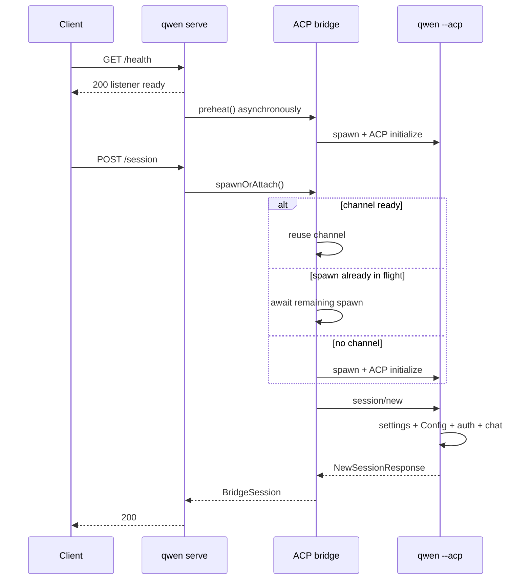

# コールドな初回セッションのプロファイリング設計

## 決定

#4748 の次の実装スライスは、別の起動キャッシュや新しいセッションプロトコルではなく、オブザーバビリティです。これは、現在の高速な `/health` の動作を維持しつつ、デーモン、共有 ACP チャネル、ACP 子プロセスにまたがる 1 件のコールドリクエストを説明できる必要があります。

実装は、既存のデーモンの OpenTelemetry リクエスト／ブリッジスパンと ACP の `_meta` 拡張ポイントを再利用します。追加するものは以下のとおりです:

- bootstrap リクエストのタイミング計測。遅延ランタイムの待機が、プロキシ／ネットワーク時間と誤認されるのではなく、後続の HTTP スパンに含まれるようにする;
- リクエストごとのチャネル待機スパン。Session が準備完了のチャネルを再利用したか、進行中の spawn に合流したか、オンデマンドで spawn したかを示す;
- 各 ACP チャネルの不透明な ID。自動プレヒートのトレースを後続の Session のトレースと、偽の親子関係を作り出すことなく対応付けられるようにする;
- ACP の `session/new` へのトレースコンテキスト注入;
- 境界付きのステージ所要時間を持つ 1 つの ACP 子プロセス `session/new` スパン。対象は settings、Config 初期化、認証、ファイルシステムセットアップ、Session 登録、レスポンス構築;
- オプトインの `QWEN_CODE_PROFILE_SESSION_START` JSONL レコードへの ACP Session ID の格納。これにより、詳細な `startChat` のステージをトレースに結合できる。

このスライスは、レスポンスヘッダー、パブリックな JSON フィールド、ケーパビリティフラグ、2 番目のプロファイラー形式は追加しません。ACP の準備完了状態は、P0 の内訳が利用可能になった後の、独立した P1 のクライアント/API 変更のままです。

## エビデンス

下流の `0.19.3-preview.2` のサンプルでは、ヘルス成功から Session 成功まで P50 で 2,534ms、`POST /session` の P50 で 1,713ms が観測されました。ヘルスからリクエストまでの遅延と POST の所要時間の負の相関は、最初のリクエストが自動プレヒートの残りを待っていることと整合しますが、ブラウザのタイミングではプロキシ、デーモン、チャネル、子プロセスの作業を分離できません。

グローバルインストールされた `qwen 0.19.10` でのローカルなドライランでも同じ形状が確認されました:

| シナリオ                                              |                    観測結果 |
| --------------------------------------------------- | -----------------------------: |
| プロセス起動 → リスナー                                |                          203ms |
| ヘルスの直後にコールドな `POST /session`              | ブラウザ 1,033ms / デーモン 962ms |
| 別実行でのプレヒート済みの `POST /session`            |   ブラウザ 222ms / デーモン 221ms |

これらは単発実行の参考値であり、受け入れのベンチマークではありません。これらが示すのは、現在の大まかなルートの所要時間が、チャネル待機、ACP 子プロセスの bootstrap、またはその両方であり得るおよそ 700〜800ms を隠しているということです。

## 現状のアーキテクチャ

既存のオブザーバビリティは以下をすでに提供しています:

- ランタイムアプリがリクエストを受け取った後の、`POST /session` の HTTP リクエストスパン;
- `channel.spawn`、`channel.initialize`、`session.new` のブリッジスパン;
- 予約済みの ACP `_meta` キーを介した W3C トレースコンテキストの注入と抽出。現在は prompt のディスパッチに使用されている;
- 詳細な `GeminiClient.startChat()` ステージのためのオプトイン JSONL プロファイラー。

欠けているのは、そのリクエストスパンより前の bootstrap 層の遅延ランタイム待機、現在のリクエストのチャネル待機、独立して開始されたプレヒートのトレースとの対応付け、`session/new` での伝播、および子プロセス内の `startChat` より前のタイミング計測です。

## 設計

### 親デーモンとブリッジ

遅延ランタイムがマウントされる前に非 bootstrap リクエストが到着した場合、委譲を行う bootstrap アプリは、その実時間の到着時刻、残りのランタイム待機、およびそのリクエストがランタイムのロードを開始したのか、health/fallback スケジューリングによってすでに開始された作業に合流したのかを記録します。ランタイムのテレメトリミドルウェアは、マウント後に同じリクエストオブジェクトを受け取り、HTTP スパンをその到着時刻に遡って設定します。ルートの所要時間メトリクスも同じ境界を使用します。これにより、コールドな遅延ランタイムパスでも、ブラウザの所要時間からデーモンのリクエスト所要時間を引いた値が、意味のあるプロキシ／ネットワークの残差となります。

`doSpawn()` が `ensureChannel()` を await する前に、同期的なチャネル状態を分類します:

- `reused`: 終了中でないチャネルがすでに利用可能;
- `joined`: `inFlightChannelSpawn` がすでに存在する;
- `spawned_on_request`: ライブなチャネルも進行中の spawn も存在しない。

その後、await を `channel.wait` ブリッジスパンでラップします。本番のテレメトリ実装はコールバックを同期的に呼び出すため、JavaScript のイベントループを yield することなく、分類の読み取りと `ensureChannel()` の呼び出しが行われます。

新しい各 `ChannelInfo` は、`channelFactory()` が呼ばれる前にランダムな UUID を受け取ります。同じ ID は以下のスパンのみに付加されます:

- `channel.spawn`;
- `channel.initialize`;
- チャネルが判明した後の `session.new`。

この ID は診断用のトレースデータであり、メトリクスのラベルやパブリックな識別子ではありません。自動プレヒートと最初の Session は別のトレースに属し得ます。チャネル ID は、後続の HTTP リクエストが先行の作業を引き起こしたと主張することなく、それらをリンクします。

`preheat()` は独自の `channel.preheat` ブリッジスパンを受け取ります。それに合流する Session は、残りの待機のみを計測する `channel.wait` スパンを持ちます。その場合、`channel.initialize` と `channel.wait` は重複するため、合計してはなりません。

既存の `session.new` スパンの内部で、ブリッジはアクティブなトレースコンテキストを `NewSessionRequest._meta` に注入します。既存の注入ヘルパーは、デーモン所有の値を追加する前に、クライアントが指定した予約キーをすでに除去しています。子プロセスが応答した後、スパンイベントが JSONL プロファイラーとの対応付けのために ACP Session ID を記録します。

### ACP 子プロセス

`QwenAgent.newSession()` はリクエストからデーモンのコンテキストを抽出し、親ブリッジの `session.new` スパンの下に子プロセスの `qwen-code.daemon.session_start` スパンを開始します。コンテキストが存在しない、または無効な場合は、通常の OTel のルートスパンの動作が適用されます。

子プロセスは `performance.now()` を使用して、固定の重複しない所要時間を記録します:

| ステージ               | 境界                                                                                                                                                                           |
| ------------------- | ---------------------------------------------------------------------------------------------------------------------------------------------------------------------------------- |
| `settings_load`     | `loadSettingsCached(cwd)`                                                                                                                                                          |
| `config_setup`      | `newSessionConfig()`。`loadCliConfig()`、`config.initialize()`、および通常の最初の `startChat()` を含む                                                                       |
| `auth`              | `ensureAuthenticated()`                                                                                                                                                            |
| `file_system_setup` | `setupFileSystem()`                                                                                                                                                                |
| `session_register`  | `createAndStoreSession()`。通常は ACP の `Session` を構築して登録する。その防御的な Gemini 初期化は、Config がまだ初期化していない場合のみここで計測される |
| `response_build`    | models、modes、config options、およびレスポンスオブジェクトの構築                                                                                                                    |

実装の E2E では `config_setup` が約 200ms で、そのうち約 140ms が既存のネストされた `startChat` プロファイラーによって記録されました。これにより、通常の `startChat()` は後続の Session 登録時ではなく `config.initialize()` の間に発生することが確認されました。JSONL の Session ID により、ファイルのタイムスタンプ推測なしで、そのネストされたコストを結合できるようになります。代表的な下流のトレースが残りの未帰属の Config コストが無視できないことを示す場合、後日の最適化で Config の構築を `config.initialize()` から分離できます。このスライスでそれを行うには、new/load/resume/transcript のパスで共有されるメソッドを通じてプロファイラーを貫通させる必要があります。

### 属性の契約

固定の属性名と境界付きの値のみが発行されます:

- `qwen-code.daemon.channel.path` = `reused | joined | spawned_on_request`;
- `qwen-code.daemon.runtime.path` = リクエストが遅延ランタイムゲートを通過した場合の `started_on_request | joined`;
- `qwen-code.daemon.runtime.wait_ms` = 有限の非負の残りランタイム待機;
- HTTP リクエスト所要時間のヒストグラム `runtime_path` = 遅延ランタイムゲートを通過したリクエストは `started_on_request | joined`、それ以外は `none`;
- `qwen-code.daemon.acp_channel.id` = デーモンが生成した UUID;
- `qwen-code.daemon.session_start.<stage>_ms` = 有限の非負の所要時間;
- `qwen-code.daemon.session_start.failed_stage` = 1 つの固定のステージ名;
- `session.id` = ACP が生成した Session ID。

ワークスペースパス、プロンプト、設定値、認証情報、モデルの応答、ファイルの内容は追加されません。

## 失敗、並行性、互換性

- OTel 無効: 既存の動作は不変。ブリッジは引き続き no-op のテレメトリシームを通過し、子プロセスのプロファイラーは既存の環境フラグが有効でない限りファイル出力を回避する。
- 遅延ランタイムの失敗: bootstrap アプリは引き続き既存の起動エラーを返す。タイミングの metadata はプロセスローカルであり、レスポンスに公開されることはない。
- 無効または欠落したトレース metadata: 子プロセスは親なしのスパンを作成するか、スパンを作成せず、Session の作成は継続する。
- テレメトリ属性の失敗: ステージ属性はベストエフォートで記録され、Session の結果を変更できない。
- プレヒートの失敗: `channel.wait` はリクエストのリトライパスを反映する。既存の子プロセスのクリーンアップと遅延リトライのセマンティクスは不変。
- 並行する最初の Session 群: 各リクエストは独自の `channel.wait` と子プロセスの Session スパンを持ちつつ、すべてが同じチャネル ID を参照できる。
- 古い、またはデーモン以外の ACP クライアント: `_meta` はオプションのため、子プロセスは引き続き通常の `NewSessionRequest` メッセージを受け入れる。
- 既存の JSONL コンシューマー: `sessionId` は追加的でオプション。既存のフィールドとファイルレイアウトは変更されない。
- チャネルの破棄: 診断用 UUID は `ChannelInfo` のみに存在し、チャネルとともに消える。再利用、アイドルタイムアウト、キルのロジックは変更しない。

## このスライスで却下した代替案

### カスタムなプロファイル ID と ACP レスポンスエンベロープ

`NewSessionResponse._meta` で 2 つ目のタイミングスキーマを返すと、OTel と重複し、検証／バージョニングが必要になり、2 つの事実の源泉が生まれます。W3C コンテキストはすでに因果関係を伝えており、チャネル UUID が意図的に分離された 1 つのプレヒートトレースを処理します。

### `Server-Timing` と `X-Qwen-Profile-Id`

これらはブラウザのみの診断には役立ちますが、このリポジトリの範囲外であるプロキシのヘッダー通過と CORS 公開の決定が必要になります。デーモンのリクエストスパンと既存のルート所要時間がすでにサーバー時間を提供しています。下流のトレーシングが引き続き利用できない場合、ヘッダーの作業は後から行えます。

### `/health` に ACP を待たせる

これはレイテンシを準備完了側に移し、ヘルスプローブのリグレッションのリスクを生みます。`/health` は引き続きリスナー／liveness の準備完了であり、ACP の準備完了は将来の独立したケーパビリティゲート付きの契約です。

### Config の共有または Session の事前作成

どちらも、プロファイリングが支配的なステージを特定する前に、分離とライフサイクルのセマンティクスを変更してしまいます。明示的にスコープ外です。

## 検証

フォーカスしたユニットテストは以下を証明する必要があります:

- `session/new` がデーモン所有のトレース metadata を受け取ること;
- 遅延ランタイムゲートを通過する Session リクエストは、bootstrap 到着時に HTTP スパンを開始し、ランタイムのロードを開始したか合流したかを記録すること;
- `channel.wait` が spawned、joined、reused のパスを報告すること;
- 1 つのチャネル UUID が spawn、initialize、Session のスパンをリンクすること;
- 子プロセスが親のコンテキストを抽出し、すべての固定ステージを記録すること;
- 失敗したステージが記録され、元のエラーが保持されること;
- session-start の JSONL は、指定された場合に Session ID を含み、欠落時は後方互換を維持すること;
- テレメトリの無効化や不正な形式の metadata が Session の動作を変更しないこと。

E2E のドライランは、同じワークスペースと認証で 2 つのケースを比較します:

1. ヘルス直後の `POST /session`;
2. ヘルス後の明示的なプレヒート、その後の `POST /session`。

両方について、Session の成功を検証し、トレースツリーを調査します。コールドケースにはリクエストの `channel.wait` パスと子プロセスのステージ属性が含まれる必要があり、プレヒート済みケースは `reused` を報告する必要があります。パフォーマンスの結論には、代表的な下流環境での少なくとも 30 回のシリアライズされたコールドスタートが必要であり、ローカルな単発実行のタイミングから推測しません。

## 実装の境界とレビューゲート

本番の変更は、`run-qwen-serve` の遅延ランタイムのリクエスト引き渡しとテレメトリミドルウェア、`packages/acp-bridge` の既存のテレメトリシーム、ACP の `newSession`、および既存の core の session-start プロファイラーに限定されます。Session/config/auth の動作に変更はありません。

本設計のためにレビューしたパッケージ横断の下流コンシューマーは以下のとおりです:

- `run-qwen-serve.ts` のデーモンブリッジ構築と、テスト／埋め込みのブリッジテレメトリ実装;
- 遅延ランタイムのルート受け入れと、リクエストのテレメトリ／メトリクスのコンシューマー;
- 同じ `BridgeSession` の形状を受け取る、すべての `AcpSessionBridge.spawnOrAttach()` の呼び出し元;
- `_meta` を省略し得る、デーモン以外の ACP クライアント;
- `sessionId` がオプションである、session-start プロファイラーのテストと JSONL リーダー。

これは core/bridge/CLI の境界をまたぐため、本番ロジックの変更が意図的に小さくても、メンテナーのレビューが必要です。
