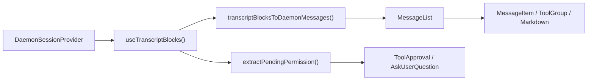
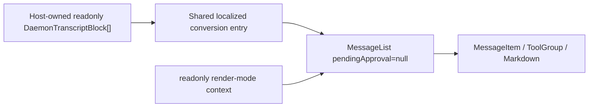

# WebShell における読み取り専用のデーモントランスクリプトレンダリングの設計

## ドキュメントのステータス

- ステータス: 実装済み
- 日付: 2026-07-14
- スコープ: `packages/web-shell`
- 入力: `readonly DaemonTranscriptBlock[]`
- 出力: WebShell の `MessageList` のプレゼンテーション機能を継承する、読み取り専用のトランスクリプトビュー

## 1. 背景

WebShell にはすでに完全なデーモントランスクリプトのレンダリングパスがありますが、現在はスプリットビュー内の `App` または `ChatPane` を介して間接的にのみ使用できます。コンポーネントはまず `DaemonSessionProvider` からトランスクリプトブロックを読み取り、それらのブロックを WebShell の内部メッセージに変換し、最後にレンダリングのために `MessageList` に渡します。

新しいユースケースはすでに `DaemonTranscriptBlock[]` を直接保持しており、履歴内容を表示するために必要なのは WebShell のメッセージスタイルとレンダリング機能のみです。デーモンセッションの接続を確立する必要はなく、セッションの変更を実行してはなりません。ツール承認、`AskUserQuestion`、リトライ、ブランチ、プロンプト送信、セッション状態を変更するパネルを開くことは、明示的に対象外です。

ホストが `transcriptBlocksToDaemonMessages` の結果を直接消費して内部コンポーネントを組み立てると、WebShell のプライベートな `DaemonMessage` モデル、コンテキスト、CSS の制約が公開されてしまいます。また、`MessageList` に機能が追加された際に、サポートされているレンダリングからドリフトしてしまいます。したがって、`@qwen-code/web-shell` は安定したパブリックなエントリポイントを提供する必要があります。

## 2. ゴール

1. `readonly DaemonTranscriptBlock[]` を直接受け取りレンダリングする、パブリックな React コンポーネントを追加する。
2. 既存の `transcriptBlocksToDaemonMessages()` と同じ `MessageList` を再利用し、ユーザー、アシスタント、思考、ツール、サブエージェント、plan、ステータス、Markdown、タイムライン、ロングセッションの仮想スクロールの機能が自動的に `MessageList` とともに進化する。
3. コンポーネントが `DaemonWorkspaceProvider`、`DaemonSessionProvider`、ネットワーク接続なしで独立してレンダリングできる。
4. 読み取り専用の境界内でデーモン/セッションの変更を一切呼び出さず、保留中のパーミッションや `AskUserQuestion` に対するレスポンス UI を表示しない。
5. 主にエクスポートを追加し、既存の `WebShell`、`WebShellWithProviders`、`App`、`ChatPane` のランタイムパス、デフォルト、DOM の動作を変更しない。
6. 完全なコンポーネントのユニットテストを追加し、既存の WebShell テストスイート、ビルド、lint、typecheck にパスする。

## 3. ノンゴール

- トランスクリプトの取得、ページング、キャッシュ、SSE サブスクリプションの追加。ブロックはホストが供給する。
- 既存の `WebShellProps` への読み取り専用モードの挿入や、`App` への条件付き `readOnly`/`blocks` のデュアルデータソースの追加。
- 内部の `MessageList`、`Message`、`DaemonMessage` 型のエクスポート。
- 未解決のツール承認や `AskUserQuestion` の表示や処理。
- App シェルの composer、キューイングされたプロンプト、ストリーミングステータス、サイドバー、スプリットビュー、ダイアログ、artifact の右パネルなどの機能の提供。`MessageList` に組み込まれたセッションタイムラインは残る。
- ブロックからの個別のセッションアーティファクトの推測や読み込み。ファイル変更、artifact、スケジュールタスクの App レベルのターン出力カードはスコープ外。
- コピー、ツールの折りたたみ/展開、完了ターンの展開、テーブルのフィルタリング、タイムラインナビゲーションなど、ローカルのプレゼンテーション状態のみを変更する操作の禁止。

## 4. 用語と読み取り専用の境界

本設計において「読み取り専用」とは、**デーモン/セッションのランタイム状態を読み取らない、または変更しない**ことを意味します。DOM 全体に `pointer-events: none` を設定することではありません。

| カテゴリ                     | 動作                                                                 | 保持                            |
| ---------------------------- | ------------------------------------------------------------------------ | ----------------------------------- |
| パッシブなプレゼンテーション         | テキスト、Markdown、画像、diff、シェル出力、ツール/サブエージェントのステータス        | はい                                 |
| ローカルな閲覧                | コピー、折りたたみ、展開、仮想スクロール、タイムライン、テーブルのソート/フィルタ      | はい                                 |
| ホストがカスタマイズしたプレゼンテーション | Markdown/コードブロックの renderer、メッセージ内容の renderer                   | はい。副作用はホストが所有 |
| 通常の外部リンク      | ブラウザセーフな URL 変換後の新しいウィンドウでのナビゲーション              | はい                                 |
| WebShell のセマンティックナビゲーション | `qwen-session://` がグローバルの `qwen:open-session` イベントをディスパッチ        | いいえ。非インタラクティブなテキストとしてレンダリング  |
| セッションの変更             | プロンプト送信、キャンセル、リトライ、ブランチ、rewind、モデル/モードの切り替え            | いいえ                                  |
| パーミッションの変更          | ツールの承認/拒否、`AskUserQuestion` の送信/無視                     | いいえ                                  |
| 外部データの読み込み        | コンポーネントが開始するセッションのアタッチや、トランスクリプト/artifact/タスク/MCP の取得 | いいえ                                  |

この境界は、コンポーネント自体がデーモンへの書き込み機能を一切持たないことを保証しつつ、`MessageList` の閲覧体験を保持します。

## 5. 現状と呼び出し元のマップ

| モジュール                                                       | 現在の役割                                                                       | 本設計との関係                                         |
| ------------------------------------------------------------ | -------------------------------------------------------------------------------------------- | ------------------------------------------------------------------- |
| `packages/sdk-typescript/src/daemon/ui/types.ts`             | `DaemonTranscriptBlock` ユニオンを定義                                                    | 新しいコンポーネントのパブリックな入力モデル                            |
| `packages/web-shell/client/adapters/transcriptToMessages.ts` | ブロックを WebShell の `DaemonMessage[]` に結合                                              | 直接再利用。新しいコンバーターは作成しない                       |
| `packages/web-shell/client/hooks/useMessages.ts`             | セッションフックからブロックを読み取り、ローカライズされた変換オプションを提供                   | 外部ブロックを受け付ける共用の純粋な変換エントリを抽出する |
| `packages/web-shell/client/components/MessageList.tsx`       | ターンの折りたたみ、ツール/サブエージェントのグループ、タイムライン、仮想スクロール、メッセージごとのレンダリング | 新しいパスと既存のパスが共有する唯一のリスト実装   |
| `packages/web-shell/client/components/MessageItem.tsx`       | メッセージのロールごとに具体的な renderer をディスパッチ                                                | 変更不要                                                   |
| `packages/web-shell/client/App.tsx`                          | 完全な単一セッションの WebShell、承認、composer、サイドパネル                               | 既存のパスは不変                                     |
| `packages/web-shell/client/components/ChatPane.tsx`          | スプリットビュー内の完全なインタラクティブセッション                                                       | 既存のパスは不変                                     |
| `packages/web-shell/client/index.tsx` / `index.ts`           | パッケージのランタイム/ソースのエクスポート                                                               | 新しいコンポーネントと型をエクスポート                                   |

現在のプライマリパスは以下のとおりです:



新しい読み取り専用パスは、セッションプロバイダーとパーミッションの分岐をバイパスします:



メインの WebShell エディターでは、`/tasks` と `/mcp` は `App` の内部でインターセプトされます。これらはダイアログの React 状態のみを更新し、`sendPrompt()` を呼び出さず、セッションの JSONL に書き込みません。したがって、永続化されたトランスクリプトにはこれら 2 つのローカルパネルのセンチネルが含まれず、新しいエントリに対応する認識やフィルタリングの分岐は追加しません。

## 6. パブリック API

`@qwen-code/web-shell` パッケージのルートからエクスポートされる、`WebShellTranscript` という名前のコンポーネントを追加します。

```ts
export interface WebShellTranscriptProps {
  /** Ordered transcript blocks from one logical session. */
  blocks: readonly DaemonTranscriptBlock[];

  theme?: WebShellTheme;
  language?: 'en' | 'zh-CN' | 'zh' | 'zh-cn';
  className?: string;
  style?: React.CSSProperties;
  chatMaxWidth?: number;
  workspaceCwd?: string;

  compactThinking?: boolean;
  collapseCompletedTurns?: boolean;
  markdownTableMode?: MarkdownTableMode;
  virtualScrollThreshold?: number;
  markdown?: WebShellMarkdownCustomization;

  composerTagIcons?: WebShellComposerTagIconMap;
  renderToolHeaderExtra?: ToolHeaderExtraRenderer;
  parseUserMessageContent?: UserMessageContentParser;
  renderUserMessageContent?: UserMessageContentRenderer;
  renderComposerTag?: ComposerTagRenderer;
  renderComposerTagTooltip?: ComposerTagRenderer;
  renderAssistantTurnFooter?: AssistantTurnFooterRenderer;
}

export function WebShellTranscript(
  props: WebShellTranscriptProps,
): React.ReactElement;
```

注記:

- `blocks` は必須で、コピーも変更もされません。呼び出し元は、配列内でブロックのセッションと順序の一貫性を保つべきです。
- ビジュアルの props は `WebShellProps` の名前と型を再利用し、同じ機能に対して 2 番目の設定セマンティクスを作ることを避けます。
- `onComposerTagClick`、`onRetryClick`、`onBranchSession`、`onTurnOutputOpen`、パーミッションのコールバック、composer のコールバックは公開しません。
- `theme` のデフォルトは `dark`。`language` が省略された場合は、WebShell の URL/ブラウザ言語の解決ルールを使用します。`chatMaxWidth` のデフォルトは 1000px。
- `compactThinking` のデフォルトは `false`、`collapseCompletedTurns` のデフォルトは `true` で、既存の `WebShell` と一致します。
- コンポーネントはトランスクリプトを静的/すでにリプレイ済みとして扱い、`MessageList` に `isResponding={false}` を渡します。ライブストリーミングは現在の API のスコープ外です。

例:

```tsx
import { WebShellTranscript } from '@qwen-code/web-shell';
import type { DaemonTranscriptBlock } from '@qwen-code/sdk/daemon';

export function HistoryView({
  blocks,
}: {
  blocks: readonly DaemonTranscriptBlock[];
}) {
  return (
    <WebShellTranscript
      blocks={blocks}
      theme="dark"
      language="zh-CN"
      workspaceCwd="/workspace/project"
      style={{ height: 640 }}
    />
  );
}
```

ホストはコンポーネントに使用可能な高さを与える必要があります。コンポーネント自体は、WebShell の `height: 100%`、内部スクロール、コンテンツ幅の動作を保持します。

## 7. 詳細設計

### 7.1 共用のローカライズ変換

`transcriptBlocksToDaemonMessages()` を唯一のブロックからメッセージへの変換アダプターとして保持します。`useMessages.ts` の内部純粋関数を抽出します。例:

```ts
export function transcriptBlocksToLocalizedMessages(
  blocks: readonly DaemonTranscriptBlock[],
  t: Translator,
): Message[];
```

この関数は新しいコンポーネントによる再利用のために、内部パッケージモジュールからのみエクスポートし、パッケージのルートからは公開しません。

この関数は、現在 `useMessages()` が使用しているローカライズされたラベルを組み立てた後、既存のアダプターを呼び出すだけです。既存の `useMessages()` と新しいコンポーネントの両方がこれを呼び出し、プロンプトキャンセル、ブランチ、ターン中の挿入、中断されたストリームのコピーのドリフトを防ぎます。

これが既存のレンダリングパスに必要な唯一の内部リストラクチャリングです。関数の入力、出力、既存の変換結果は変更されず、アダプターのブロック結合ルールも変更されません。

### 7.2 `WebShellTranscript` のコンポーネント構造

`packages/web-shell/client/components/WebShellTranscript.tsx` を、以下の内部シーケンスで追加します:

1. テーマと言語を解決し、translator を作成する。
2. `useMemo` で `blocks` を `Message[]` に変換する。
3. 既存の App と同じメッセージ層のカスタマイズ値を作成する。
4. WebShell のテーマ、i18n、カスタマイズ、コンパクトモード、読み取り専用の render-mode、ポータルのコンテキストをマウントする。
5. App のテーマクラス、ベース変数、フォント、背景、CSS 分離ルールを再利用し、`data-web-shell-root` と `data-web-shell-shadcn` を持つ独立したルートを作成する。
6. 同じ `MessageList` をレンダリングする。

重要な固定の `MessageList` の入力は以下のとおりです:

```tsx
<MessageList
  messages={messages}
  pendingApproval={null}
  isResponding={false}
  workspaceCwd={workspaceCwd ?? ''}
  virtualScrollThreshold={virtualScrollThreshold}
/>
```

これらのアクション props は決して渡しません:

- `onShowContextDetail`
- `onRetryClick`
- `onBranchSession`
- `onReviewChanges`
- `onOpenArtifact`
- `onOpenScheduledTask`
- `onTurnOutputOpen`

ローディング、catch-up、tail、ターン出力のデータは渡さず、App の接続状態や外部リソースモデルへの依存を回避します。

### 7.3 インタラクティブな renderer の分離

`MessageList` に `pendingApproval=null` を渡すだけでは、読み取り専用の動作は完全には保証されません。ゴールのステータス、Markdown、ツール結果内のセッションリンクは `MessageList` のコールバックを使用せず、グローバルのセマンティックイベントを `window` にディスパッチするため、同じページ上の別の WebShell のフッターやアクティブなセッションを変更する可能性があります。

`client/transcriptRenderMode.ts` に、デフォルト値 `interactive` のパッケージ内部のトランスクリプト render-mode コンテキストを追加します。既存の `App` と `ChatPane` に新しいプロバイダーは不要で、動作は不変のままです。`WebShellTranscript` は値を `readonly` に設定します。読み取り専用モードは以下の制限のみを適用します:

- `qwen-session://` リンクのテキストとスタイルを保持するが、`qwen:open-session` はディスパッチしない。
- `GoalStatusMessage` は `GOAL_STATUS_ACTIVE_EVENT` をディスパッチしない。
- 通常の HTTPS リンクや、コピー、折りたたみ、ソートなどのローカルな閲覧操作はインターセプトしない。

このコンテキストは `Markdown`、`ToolGroup`、`GoalStatusMessage` のセマンティックイベントの出口のみを変更し、そのデフォルトは `interactive` に固定されています。これにより、`MessageList` からすべての renderer を貫通させなければならない `readOnly` prop の追加を回避します。新しいユニットテストは、デフォルトのインタラクティブ動作が不変であることと、読み取り専用動作が抑制されることの両方を証明しなければなりません。

### 7.4 テーマ、CSS、ポータル

WebShell ライブラリのビルドは、コンポーネントの CSS を `[data-web-shell-root]` または `[data-web-shell-portal-root]` の下に注入してスコープします。新しいコンポーネントは独自の WebShell ルートを作成する必要があります。さもなければ、`MessageList` が CSS モジュールルールとマッチしない DOM を生成する可能性があります。

タイムラインのツールチップや高度な Markdown テーブルはポータルを使用します。それらの機能を完全に継承するため、新しいコンポーネントは App と同等のポータルホストのライフサイクルを使用します:

- マウント時に、`data-web-shell-portal-root` と `data-web-shell-shadcn` を持つノードを `document.body` に追加する。
- ルートのテーマクラスと CSS 変数を同期する。
- `WebShellPortalRootContext` を通じてノードを供給する。
- アンマウント時に、ノードとその observer/listener を削除する。

このライフサイクルは App の既存のポータルコードをリファクタリングするのではなく、新しいコンポーネント内に留め、既存の動作のリグレッションサーフェスを新しいエントリに限定します。SSR 中は `document` にアクセスしない。ポータルはクライアントのマウント後にのみ有効化します。

### 7.5 エラーの分離

新しいエントリには外側のパブリック境界と内側のコンテンツコンポーネントがあります。ブロックの変換、プロバイダー/ポータルの初期化、`MessageList` はすべて境界の子の中で発生し、これらの段階のいずれかで発生した失敗が、パブリックな WebShell エントリと同じ `RootErrorFallback` に到達することを保証します。各メッセージは引き続き `MessageItem` 自身の境界によって分離されるため、1 つの Markdown、KaTeX、Mermaid、ツール renderer の失敗がトランスクリプト全体を空白にすることはありません。

### 7.6 ブロックレンダリング戦略

すべての戦略は引き続き既存のアダプターを使用します。新しいコンポーネントに 2 番目の switch を追加しません。

| `DaemonTranscriptBlock.kind` | 読み取り専用の結果                                                                        |
| ---------------------------- | --------------------------------------------------------------------------------------- |
| `user`                       | ユーザーメッセージ、画像、入力アノテーション                                            |
| `assistant`                  | アシスタントの Markdown。連続するブロックはマージ。サブエージェントの内容は親によって割り当て     |
| `thought`                    | 思考メッセージ。連続するブロックはマージ                                            |
| `tool`                       | ツールグループ、diff/read/shell/fetch/todo/サブエージェントの既存のカード                    |
| `shell`                      | 最も近い実行ツールに関連付け。利用できない場合は既存の raw-shell フォールバック |
| `user_shell`                 | ユーザーのシェルコマンド/出力                                                               |
| `status` / `debug`           | Plan またはシステム/ステータスメッセージ                                                           |
| `error`                      | リトライアクションのないエラーシステムメッセージ                                               |
| `prompt_cancelled`           | ローカライズされたキャンセルステータス                                                           |
| 未解決の `permission`      | 変換も表示もアクションエントリの提供もしない                                     |
| 解決済みの `permission`        | アダプターの既存の履歴ツールプレースホルダー/結果ルール                      |
| `AskUserQuestion` パーミッション | フォームを表示しない。後続の実際のツールブロックが存在する場合のみ履歴の結果を表示  |

### 7.7 更新とパフォーマンス

- `blocks` の identity または言語が変更された場合のみ、O(n) の変換を再実行する。
- `MessageList` は既存のメモ化、ターンのグループ化、仮想スクロールのしきい値を保持する。
- ブロックのディープコピーや、ブロックごとの新しい React プロバイダーの作成はしない。
- 内容が同じでも identity が新しい配列を頻繁に供給する呼び出し元は、変換を再度トリガーする。これは許容され、現在の `useTranscriptBlocks()` の更新モデルと一致する。
- 今回のリリースでは増分アダプターを追加しない。大規模な外部トランスクリプトの更新がボトルネックであることが計測で示された場合にのみ、増分変換を別途設計する。

## 8. 互換性とリグレッション管理

### 8.1 既存のパスは不変

- `WebShellProps` に必須フィールドは追加されず、デフォルトも変更されない。
- `WebShell` と `WebShellWithProviders` は引き続き `App` をレンダリングする。
- `App` と `ChatPane` は引き続き、それぞれのプロバイダー/フックからセッション状態を読み取る。
- 承認のオーバーレイ、composer、サイドバー、スプリットビュー、artifact パネルは新しいコンポーネントを通過しない。
- `MessageList` に `readOnly` prop の分岐は追加されない。新しい呼び出し元は、`pendingApproval=null` を渡し、アクションコールバックを省略し、デフォルトがインタラクティブのままの内部 render-mode コンテキストを使用して、少数のグローバルセマンティックイベントを分離することで、読み取り専用動作を確立する。

### 8.2 パッケージのエクスポート

`client/index.tsx` と `client/index.ts` の両方を更新してエクスポートします:

```ts
export { WebShellTranscript } from './components/WebShellTranscript';
export type { WebShellTranscriptProps } from './components/WebShellTranscript';
```

現在のデュアルなランタイムエントリと宣言/ソースエントリのパスが「ランタイムではエクスポートされているが型宣言にはない」状態を生むことを避けるため、両方のバレルを変更する必要があります。パッケージのサブパスエクスポートは追加しません。

### 8.3 セキュリティ

- 新しいエントリは `useActions()`、`useTranscriptStore()`、`useConnection()`、`fetch` を import しない。
- 保留中のパーミッションの内容はインタラクティブな renderer に入らない。
- ステータスメッセージの内容を検査したり書き換えたりしない。`/tasks` と `/mcp` のダイアログ状態は、永続化されたトランスクリプトに本質的に存在しない。
- 読み取り専用の render mode は、同じページ上の別の WebShell に影響し得るセッション/ゴールのグローバルイベントをディスパッチしない。
- Markdown の URL と HTML の処理は引き続き、既存の WebShell のサニタイザー/変換を使用する。`dangerouslySetInnerHTML` や別のバイパスは追加しない。
- カスタム renderer はホストのコードである。ホストの renderer が実行する副作用は、コンポーネントが保証する読み取り専用の境界の外であり、README にこれを明示する必要がある。

## 9. テスト設計

### 9.1 新しいコンポーネント契約のユニットテスト

`WebShellTranscript.test.tsx` を追加し、`MessageList` をモックして境界と配線を検証します:

1. 共用のローカライズアダプターが、正しい順序と内容でブロックをメッセージに変換する。
2. `pendingApproval` は常に `null`。
3. セッション変更、パーミッション、リトライ、ブランチ、ターン出力のコールバックはすべて省略される。
4. `isResponding` のデフォルトは `false` で、ワークスペースと仮想スクロールの設定が正しく転送される。
5. テーマ、言語、コンパクト/折りたたみの動作、メッセージのカスタマイズが正しいコンテキストに入る。
6. ブロックや言語の変更が、古い内容を重複させずにメッセージを再生成する。
7. 空のブロックはスローせずに空のリストをレンダリングする。

### 9.2 新しい DOM 統合ユニットテスト

実際の `MessageList` を使用して `WebShellTranscript.dom.test.tsx` を追加します:

1. デーモンのプロバイダーがない React ツリーで正常にレンダリングする。
2. 代表的な user、assistant の Markdown、thought、tool、サブエージェント、plan、status、error、prompt-cancelled のブロックが対応する WebShell の DOM に入る。
3. ローカルの折りたたみ/展開、コピー、タイムラインナビゲーションが引き続き動作し、`MessageList` の機能が再利用されていることを証明する。
4. 未解決の通常のパーミッションは承認パネルを生成しない。
5. 未解決の `AskUserQuestion` は選択肢、入力、送信、無視の UI を生成しない。
6. 解決済みの履歴ツール/AskUser の結果は、アダプターの既存のプレゼンテーションルールに従う。
7. 読み取り専用のセッションリンクとゴールステータスはグローバルセマンティックイベントをディスパッチしない。対応する既存のコンポーネントテストは、デフォルトのインタラクティブ動作が不変であることを引き続き証明する。
8. ダーク/ライトのクラス、言語、ローカライズされたテキスト、チャットの最大幅、CSS ルートマーカーが正しい。
9. ポータルのルートが正しくマウント/アンマウントされ、ポータルの内容がスコープされたルートの下にある。
10. 個別のカスタム renderer がスローした場合、組み込みの renderer のフォールバックが使用され、メッセージの残りは保持される。

### 9.3 共用変換とエクスポートのテスト

- `useMessages`/アダプターのテストを拡張し、既存のフックと外部ブロックがまったく同じローカライズオプションを使用することを証明する。
- `index.test.tsx` やビルド成果物のテストを拡張し、ランタイムの named export が存在することを検証する。
- ビルド後、`dist/types/index.d.ts` に `WebShellTranscript` とその props のエクスポートが含まれていることを検証し、2 つのエントリ宣言のドリフトを防ぐ。

### 9.4 既存のリグレッションスイート

実装後に必要な最小の検証シーケンスは以下のとおりです:

```bash
cd packages/web-shell
npm run build
npx vitest run --config vitest.config.ts \
  client/components/WebShellTranscript.test.tsx \
  client/components/WebShellTranscript.dom.test.tsx \
  client/hooks/useMessages.test.ts \
  client/adapters/transcriptToMessages.test.ts \
  client/components/MessageList.test.ts \
  client/components/MessageList.dom.test.tsx \
  client/components/messages/Markdown.test.ts \
  client/components/messages/ToolGroup.test.tsx \
  client/components/messages/SystemMessage.test.tsx \
  client/index.test.tsx
npm test
npm run format:check
npm run lint
npm run typecheck

cd ../..
npm run build
npm run typecheck
```

`npm test` は既存の完全な WebShell スイートであり、本変更ではパスしなければなりません。本変更はスタンドアロンページを追加せず、既存の Playwright スモークテストの App/デーモンのプロトコルを変更しないため、ブラウザの E2E テストは追加しません。`WebShellTranscript.dom.test.tsx` が実際の DOM の動作をカバーします。

## 10. 実装ステップ

1. `useMessages.ts` で共用のローカライズされたブロック変換を抽出し、現在のフックの出力を保持する。
2. 内部のトランスクリプト render-mode コンテキストを追加し、セッションリンク/ゴールイベントの出口で消費する。デフォルトは `interactive` を保持する。
3. `WebShellTranscript` とその props を追加し、ルート/プロバイダー/ポータル/`MessageList` の配線を実装する。
4. 両方のパブリックバレルにランタイムと型のエクスポートを追加する。
5. `packages/web-shell/README.md` に、読み取り専用の統合例、ホストの高さの要件、読み取り専用の境界を更新する。
6. 契約、DOM、操作分離、エクスポート/型宣言のテストを追加する。
7. ターゲットを絞ったテスト、完全な WebShell テストスイート、ビルド、lint、typecheck を実行する。
8. リポジトリのガイダンスに従って完全な diff をレビューする。修正後はステップ 7 を再実行する。

## 11. 代替案

### 11.1 既存の `WebShell` に `blocks` と `readOnly` を追加

却下。`App` は現在、いくつかのデーモンフックを無条件に消費し、承認、composer、セッション、サイドバー、パネルを管理しています。デュアルデータソースは `App` 全体に条件分岐を追加し、プロバイダーを必要としつつ、読み取り専用パスもガードしなければなりません。

### 11.2 `MessageList` をパブリックにエクスポート

却下。呼び出し元は引き続きプライベートな `Message[]`、複数のコンテキスト、CSS ルートの規約、ポータルの規約に依存することになり、内部モデルが長期的なパブリック API になってしまいます。

### 11.3 読み取り専用向けに renderer を複製

却下。複製すると Markdown、ツール/サブエージェント、ターンの折りたたみ、タイムライン、仮想スクロールの動作が即座にフォークし、`MessageList` のレンダリング機能を継承する要件を満たせません。

### 11.4 新しいコンポーネントで無効化された Permission/AskUserQuestion を表示

却下。無効化されたフォームでもインタラクティブなセマンティクスと追加の状態分岐が生じ、ユーザーが履歴ビューで回答できると誤解させます。保留中のパーミッションは今回のリリースでは非表示とし、後続のツールブロックが履歴の結果を保持します。

## 12. リスクと緩和策

| リスク                                                       | 緩和策                                                                                                |
| ---------------------------------------------------------- | --------------------------------------------------------------------------------------------------------- |
| 新しいエントリと App の間でローカライズ変換がドリフトする  | 両方が同じローカライズ変換ヘルパーを呼び出す                                                            |
| ポータルが CSS スコープを見逃す                                | 個別の `data-web-shell-portal-root` を作成し、変数を同期し、DOM テストでカバー           |
| 偶発的なデーモンの変更                                 | 新しいコンポーネントはアクションフックを import せず、変更のコールバックを公開しない。契約テストでこれを固定     |
| App ローカルのダイアログ状態がトランスクリプトデータと誤認される     | `/tasks` と `/mcp` が JSONL に書き込まないことを明示的に文書化。新しいエントリは App のダイアログ状態をコピーしない |
| グローバルセマンティックイベントがページ上の別の WebShell に影響する | 読み取り専用の render mode がセッション/ゴールのイベントを抑制。リグレッションテストがデフォルト動作をカバー             |
| 新しいブロック kind にプレゼンテーションがない                       | 引き続き共用アダプターでサポート。コンポーネントに switch を重複させない             |
| パッケージのランタイムと型のエクスポートが乖離する                   | 両方のバレルを更新し、ビルドされた宣言を検査                                                    |
| 大規模トランスクリプトの再計算コスト                        | `useMemo` に加えて既存の仮想スクロール。増分変換は計測で裏付けられるまで先送り   |
| カスタム renderer が副作用を持ち込む                    | ホストの責任を文書化。デフォルトの renderer は読み取り専用のまま                                          |

## 13. 受け入れ基準

- ホストは、デーモンのプロバイダーがない環境で、ブロックを供給するだけで WebShell のトランスクリプトをレンダリングできる。
- 代表的なブロックは、既存の WebShell の `MessageList` における同じデータと同一にレンダリングされる。
- 保留中のツールパーミッションと `AskUserQuestion` は、インタラクティブな UI や送信パスを生成しない。
- 読み取り専用ビューは、グローバルなセッション/ゴールのセマンティックイベントをディスパッチしない。
- 新しいコンポーネントは、`MessageList` のローカルな閲覧操作とロングリストの機能を保持する。
- 既存の `WebShell`/`WebShellWithProviders` の API、デフォルト、テスト、ランタイム動作は不変のまま。
- `@qwen-code/web-shell` のランタイムと `.d.ts` の両方が、新しいコンポーネントと props をエクスポートする。
- 新しいユニットテスト、既存の完全な WebShell スイート、ルートの build/typecheck がすべてパスする。
