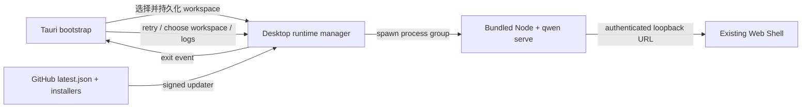

# Desktop Web Shell 公開設計

## 問題

現在のデスクトップ PoC は、Tauri が daemon の提供する Web Shell を再利用できることを
証明済みで、2 套目の UI をメンテナンスする必要はない。しかし PoC には依然として
公開リリースに必要なユーザーフロー、障害復旧、署名付き更新、セキュリティ境界、
3 プラットフォームのインストール成果物が欠けている。

本設計は `packages/desktop-shell` を薄いデスクトップシェルとして完成させる: デスクトップ
シェルはライフサイクルとプラットフォーム統合のみを担当し、製品機能は引き続き
`qwen serve` と `@qwen-code/web-shell` が提供する。

## 目標

- macOS、Windows、Linux が同一の Web Shell UI を使用する。
- 初回起動時にユーザーがワークスペースを選択でき、以降の起動では最近のワークスペースを
  復元する。
- daemon の起動失敗や実行中の終了時に、操作可能な復旧 UI を提供し、サイレントな終了は
  しない。
- デスクトップシェルはローカルの bootstrap ページとローカルマシンのランダムポートの
  daemon のみを読み込む; 外部 URL は常にシステムブラウザに渡す。
- リリース成果物にはバージョン、由来、ライセンス、チェックサム、署名付き更新メタデータ
  を付与する。
- パブリックリリースは macOS で署名と公証を、Windows で Authenticode 署名を完了;
  Linux は AppImage と deb を生成する。

## 非目標

- デスクトップ専用のチャット UI、セッションモデル、daemon API は追加しない。
- Web Shell をデスクトップパッケージにコピーしてメンテナンスしない。
- マルチウィンドウ、複数ワークスペースの同時実行、バックグラウンド常駐は実装しない。
- Store 配信は約束しない; 最初の公開バージョンは GitHub Releases を使用する。
- Git、シェル、その他のシステムツールを同梱しない。ツールの欠如は引き続き既存の
  Web Shell の機能でフィードバックする。

## アーキテクチャ



### コンポーネントの責務

| コンポーネント            | 責務                                                               |
| --------------- | ------------------------------------------------------------------ |
| bootstrap ページ  | 起動状態、ワークスペース選択、障害復旧、バージョンとログの入口                     |
| Rust デスクトップ状態   | 設定の永続化、ウィンドウ状態、runtime ライフサイクル、シングルインスタンス、更新状態           |
| bundled runtime | 現在のプラットフォームの Node.js、Qwen Code バンドル、Web Shell 静的リソース             |
| リリース CI         | 3 プラットフォームのビルド、署名、公証、smoke、チェックサム、latest.json、GitHub Release |

## 起動ステートマシン

| 状態              | ユーザーに見える内容                   | 可能な操作                        |
| ----------------- | -------------------------------- | ------------------------------- |
| `starting`        | Qwen Code ブランドの起動ページと現在のワークスペース | 待機                            |
| `needs_workspace` | 初回起動のワークスペース選択               | ディレクトリの選択                        |
| `ready`           | daemon がサーブする Web Shell          | 通常の使用                        |
| `failed`          | 簡潔なエラー要約                     | リトライ、別のディレクトリの選択、ログを開く    |
| `stopped`         | daemon の予期しない終了の通知              | daemon の再起動、ディレクトリの選択、ログを開く |

アプリは先に bootstrap ウィンドウを作成し、その後非同期に daemon を起動する。daemon の
ディープヘルスチェック（`/health?deep=true`）通過後、同じウィンドウが
`http://127.0.0.1:<port>/#token=<token>` にナビゲートする。token は URL フラグメントのみに
存在し、リクエストに乗ってサーバーに送られることは決してないため、cookie ハンドシェイクは
不要で、アクセスログや Referer にも入らない。これにより低速な起動と失敗パスの両方に
可視の UI が存在する。

ディープヘルスチェックを使用しなければならない: serve のファストパスは、本物の runtime
（Web Shell を含む）がマウントされる前に、bootstrap app で浅い `/health` に応答する。
このとき `/health?deep=true` は依然 `503 {"reason": "bootstrap"}` を返すため、これが
200 になって初めて Web Shell が利用可能なことを意味する; 浅いヘルスチェックで準備完了を
判定すると、ナビゲーションが deferred runtime のウィンドウに衝突する。

## ワークスペースの選択と永続化

設定ファイルは Tauri の `app_config_dir` 配下の `desktop-state.json` に保存する:

```json
{
  "workspace": "/absolute/path",
  "window": {
    "width": 1280,
    "height": 820,
    "x": 120,
    "y": 80,
    "maximized": false
  }
}
```

起動時の優先順位:

1. `QWEN_DESKTOP_WORKSPACE`。開発と自動テスト用。
2. 設定ファイル内の最近のワークスペース。
3. 初回起動時はディレクトリ選択ダイアログを表示。

存在しかつディレクトリである絶対正規化パスのみが daemon に渡される。新しいワークスペースを
選択した場合は、まず現在のプロセスグループを停止し、新しいディレクトリで再起動する。

## Runtime のライフサイクルと復旧

- 起動ごとに 256-bit の bearer token を生成し、子プロセスの環境変数
  （`QWEN_SERVER_TOKEN`）で daemon に渡し、URL フラグメント（`/#token=<token>`）で
  Web Shell フロントエンドに渡す; フロントエンドは読み取り後に URL から削除し、
  `Authorization: Bearer` ヘッダーで API を呼ぶ。フラグメントはサーバーに送信されないため
  cookie は不要。
- daemon は `127.0.0.1` のランダムポートにバインドし `--require-auth` を有効化。
- stdout と stderr は同時にローリングログに書き込み、UI 表示用に有限の起動サマリーを保持。
- Rust は daemon プロセスの終了を監視; アプリ終了以外による停止は `runtime-stopped`
  イベントをトリガーし、bootstrap の障害ページに戻る。
- リトライは常に新しい token と daemon を作成し、終了したプロセスを再利用しない。
- アプリ終了時は子プロセスグループ全体を終了させ、孤立した daemon を避ける。

## ウィンドウとシングルインスタンス

- メインウィンドウの最小サイズは 900 × 600、デフォルトは 1280 × 820。
- クローズ、移動、拡大縮小、最大化状態を永続化; 復元時に画面外の不可視位置は
  中央にフォールバック。
- シングルインスタンスプラグインは最初に登録しなければならない。2 回目の起動は
  メインウィンドウへのフォーカスと復元のみを行い、daemon は起動しない。

## セキュリティ境界

- bootstrap の CSP: `default-src 'self'; script-src 'self'; style-src 'self' 'unsafe-inline'; img-src 'self' data:; connect-src ipc: http://ipc.localhost; object-src 'none'; base-uri 'none'; form-action 'none'; frame-ancestors 'none'`。
- Web Shell は引き続き daemon が自身の CSP を生成; デスクトップシェルは daemon ページの
  ポリシーを緩和しない。
- メインウィンドウは bootstrap のカスタムプロトコルと選択された daemon の同一オリジン
  ナビゲーションのみを許可。
- `http`、`https`、`mailto` の外部リンクはシステムブラウザに渡す; `file`、
  `javascript`、カスタムプロトコルは拒否。
- blob ダウンロードはメインの Web Shell が開始したもののみを許可し、ネイティブの
  ダウンロードコールバックが安全な保存先パスを選択。
- Tauri はファイルシステム、シェル、プロセスの JavaScript API を公開しない;
  bootstrap は明示的な `invoke` command のみを使用。
- Windows のマニフェストは `asInvoker`、Common Controls v6、long-path awareness を使用。
- macOS の hardened runtime を有効化し、entitlements は JIT WebView の実行と
  ネットワークの client/server に必要な能力のみを含む。

## ビルドメタデータとコンプライアンス

`prepare-runtime.js` が生成:

- `manifest.json`: デスクトップのバージョン、Qwen Code のバージョン、Qwen Code の
  コミット、Node のバージョン、target、ビルド時刻。
- `checksums.json`: すべての bundled runtime ファイルの SHA-256。
- ルートの `LICENSE` とデスクトップの `NOTICE`。
- Node.js の `LICENSE`。

パッケージング前の smoke がマニフェスト、重要ファイル、チェックサムを検証する。
GitHub Release は各インストール成果物の `SHA256SUMS.txt` も同時に公開する。

## 更新モデル

Tauri updater は署名された更新成果物と固定の公開鍵を使用する。アプリ起動後にバックグラウンド
で 1 回更新を確認:

- 更新なし: ユーザーに干渉しない。
- 確認失敗: ログに書き、起動をブロックしない。
- 更新あり: bootstrap/Web Shell の上にネイティブの確認ダイアログを表示; ユーザー確認後に
  ダウンロード・インストールし、再起動。

リリース CI は `TAURI_SIGNING_PRIVATE_KEY` と
`TAURI_SIGNING_PRIVATE_KEY_PASSWORD` を使用して updater の署名を生成する。
`latest.json` は同じ GitHub Release のプラットフォーム別更新パッケージを指す。
非 draft かつ非 prerelease のリリースのみが固定の `desktop-latest` feed release を更新する。

## プラットフォームリリースマトリクス

| プラットフォーム    | アーキテクチャ       | インストールパッケージ                                | 署名要件                                |
| ------- | ---------- | ------------------------------------- | --------------------------------------- |
| macOS   | arm64、x64 | `.dmg`、`.app.tar.gz` updater         | Developer ID Application + notarization |
| Windows | x64        | NSIS `.exe` updater/installer         | Authenticode SHA-256 + timestamp        |
| Linux   | x64        | `.AppImage` updater/installer、`.deb` | updater の minisign; OS のコード署名なし    |

Windows の WebView2 は download bootstrapper を使用; システムがオフラインで WebView2 が
欠如している場合、インストール失敗が依存関係を明確に通知する。Linux の CI は Tauri の
WebKit/GTK、AppImage と deb のビルド依存関係をインストールする。

## リリースフロー

1. desktop のバージョンと vendor する Qwen Code の ref を入力。
2. ref がリリースを許可されたコミットまで追跡可能であることを検証。
3. desktop-shell パッケージ、Cargo、Tauri のバージョンを同期。バージョンはビルドごとに
  CI が一時的に設定するのみで、リポジトリにはコミットしない; `main` ブランチは意図的に
  開発用プレースホルダーバージョン（`0.0.1`）を保ち、リリース済みバージョンは git tag を
  正とする。
4. プラットフォームごとに runtime を準備し、チェックサム/runtime の smoke と Rust の
  テストを実行。
5. インストールパッケージと updater 成果物をビルド。
6. プラットフォームの runner がパッケージ済みアプリをインストール・起動し、
  daemon/Web Shell の準備完了の証拠を待機。
7. 成果物をアップロード; リリース job が `latest.json` と `SHA256SUMS.txt` を生成。
8. 非 draft の stable release が `desktop-latest` feed を更新。

署名鍵の欠如時に許容されるのは `dry_run=true` のみで、パブリックリリースは
fail closed（失敗時は拒否）でなければならない。

## 検証基準

- 初回起動でディレクトリを選択して Web Shell に入れる。
- 再起動でワークスペースとウィンドウ位置を復元。
- 無効なワークスペース、runtime の欠如、daemon の早期終了はいずれも復旧ページを表示。
- daemon が実行中に kill された後、ユーザーは元のウィンドウで再起動できる。
- 外部リンクはシステムブラウザに行き、メインウィンドウは daemon のオリジンから離れない。
- 3 プラットフォームのパッケージ済みアプリの smoke で `/health`、未認証の Web Shell ルートの
  ナビゲーションが 200 を返すこと（cookie は一切発行されない）、token なしの
  `/capabilities` が 401 を返すことを観測。
- updater マニフェストの署名がクライアントで検証でき、バージョンのロールバックは拒否される。
