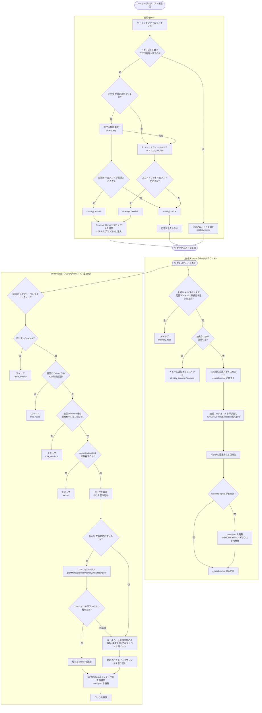
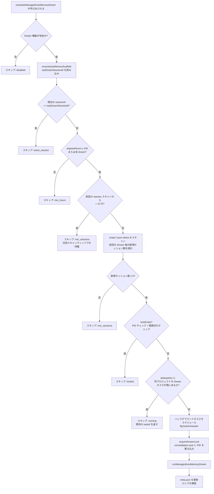
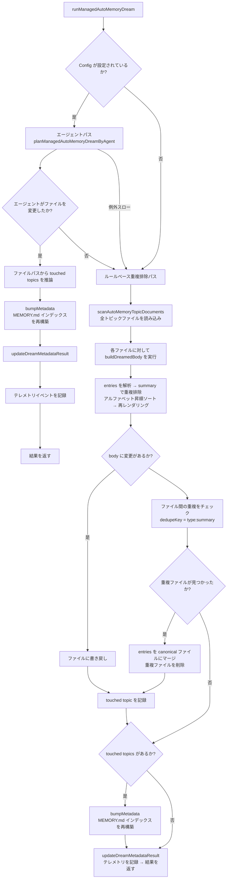
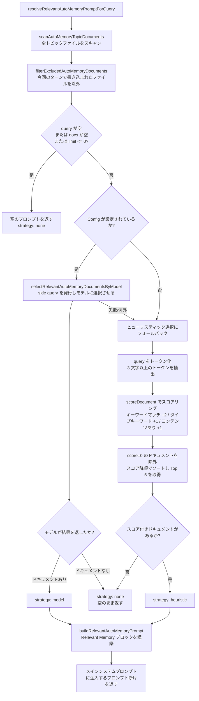
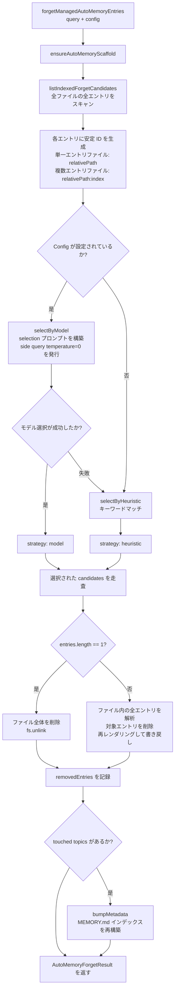

# Memory 記憶管理システム

> 本ドキュメントでは、Qwen Code の **Managed Auto-Memory**（マネージド自動記憶）における記憶管理の仕組み、トリガーのタイミング、および実装の詳細について説明します。

---

## 目次

1. [概要](#概要)
2. [ストレージ構造](#ストレージ構造)
3. [記憶タイプ](#記憶タイプ)
4. [記憶エントリ形式](#記憶エントリ形式)
5. [コアライフサイクル](#コアライフサイクル)
6. [Extract — 抽出](#extract--抽出)
7. [Dream — 統合](#dream--統合)
8. [Recall — 検索](#recall--検索)
9. [Forget — 削除](#forget--削除)
10. [インデックス再構築](#インデックス再構築)
11. [テレメトリ](#テレメトリ)

---

## 概要

Managed Auto-Memory は、AI セッション中にユーザー関連の知識を**自動**で蓄積・統合・検索する永続的な記憶システムです。以下の 4 つのコア操作を通じて、記憶のライフサイクルを管理します。

| 操作 | 英語名 | トリガー方式 | 役割 |
| ---- | ------- | -------------------------- | -------------------------------------- |
| 抽出 | Extract | 自動（各ターン終了後）         | 会話履歴から新しい知識を抽出し、記憶ファイルに書き込む     |
| 統合 | Dream   | 自動（定期的なバックグラウンドタスク）     | 記憶ファイルの重複排除・統合を行い、整理された状態を維持する         |
| 検索 | Recall  | 自動（各ターン開始前）         | 現在のリクエストに関連する記憶を検索し、システムプロンプトに注入する |
| 削除 | Forget  | 手動（ユーザーコマンド `/forget`） | 指定された記憶エントリを正確に削除する                 |

---

## ストレージ構造

### ディレクトリ構成

```
~/.qwen/                                      ← グローバルベースディレクトリ（デフォルト）
└── projects/
    └── <sanitized-git-root>/                 ← プロジェクト識別子（Git ルートパスに基づく）
        ├── meta.json                         ← メタデータ（抽出/統合のタイムスタンプ、ステータス）
        ├── extract-cursor.json               ← 抽出カーソル（処理済みの会話オフセット）
        ├── consolidation.lock                ← Dream プロセスの相互排他ロック
        └── memory/                           ← 記憶メインディレクトリ
            ├── MEMORY.md                     ← インデックスファイル（自動生成、全エントリの要約）
            ├── user.md                       ← ユーザー設定記憶（例）
            ├── feedback.md                   ← フィードバック規範記憶（例）
            ├── project/
            │   └── milestone.md              ← プロジェクト記憶（サブディレクトリ対応）
            └── reference/
                └── grafana.md                ← 外部リソース記憶
```

> **環境変数による上書き**：
>
> - `QWEN_CODE_MEMORY_BASE_DIR`：グローバルベースディレクトリを置き換える
> - `QWEN_CODE_MEMORY_LOCAL=1`：プロジェクト内パス `.qwen/memory/` を使用する

### 主要ファイルの説明

| ファイル                  | 説明                                                                   |
| --------------------- | ---------------------------------------------------------------------- |
| `meta.json`           | 最後の Extract / Dream の実行時刻、セッション ID、対象の記憶タイプ、実行ステータスを記録 |
| `extract-cursor.json` | 現在のセッションで処理済みの会話履歴のオフセットを記録し、重複抽出を防止する                 |
| `consolidation.lock`  | Dream 実行中のファイルロック。内容は保持プロセスの PID。1 時間経過で自動的に失効する            |
| `MEMORY.md`           | 全トピックファイルのインデックス。Extract/Dream 実行後に再構築され、Markdown リスト形式で出力される    |

---

## 記憶タイプ

システムは 4 つの組み込み記憶タイプをサポートしており、それぞれ異なる情報次元に対応します。

| タイプ        | 保存内容                                              | 書き込みタイミング                                 | 読み込みタイミング                     |
| ----------- | ----------------------------------------------------- | ---------------------------------------- | ---------------------------- |
| `user`      | ユーザーの役割、スキル背景、作業習慣                        | ユーザーの役割/好み/知識背景を把握した時           | 回答をユーザーの背景に合わせてカスタマイズする必要がある時   |
| `feedback`  | AI の動作に対するユーザーの指示：避けるべきこと、継続すべきこと              | ユーザーが AI を修正したり、自明でないアプローチを承認した時 | AI の動作方法に影響を与える場合           |
| `project`   | プロジェクトの進捗、目標、意思決定、締切、バグ追跡              | 誰が何をなぜ行い、いつまでに完了するかを把握した時     | AI が作業の背景と動機を理解するのに役立つ場合 |
| `reference` | 外部システムリソースへのポインタ（ダッシュボード、チケットシステム、Slack チャンネルなど） | 外部リソースとその用途を把握した時               | ユーザーが外部システムや関連情報を言及した時 |

**記憶に保存すべきでない内容**：コードパターン/規約、Git 履歴、デバッグ手順、一時的なタスクステータス、`QWEN.md` / `AGENTS.md` に既に記録されている内容。

---

## 記憶エントリ形式

各トピックファイルは **YAML フロントマター + Markdown ボディ** 形式を使用します。

```markdown
---
name: 記憶名称
description: 一行説明（検索関連性の判断に使用するため、具体的であること）
type: user|feedback|project|reference
---

記憶の本体内容（summary 行）

Why: 背景にある理由（AI がエッジケースを理解し、盲目的にルールに従わないようにするため）
How to apply: 適用シナリオと使用方法
```

`feedback` および `project` タイプでは、エッジケースでも記憶が正しく適用されるよう、`Why` と `How to apply` の記入を強く推奨します。

---

## コアライフサイクル



---

## Extract — 抽出

### トリガーのタイミング

AI が各ターンでレスポンスを完了した後、`scheduleAutoMemoryExtract` によって自動的にトリガーされます（バックグラウンドの非ブロッキング処理）。

### スケジューリングロジック（`extractScheduler.ts`）


**スキップ理由の説明**：

| 理由              | 意味                                            |
| ----------------- | ----------------------------------------------- |
| `memory_tool`     | 現在のターンのメインエージェントが直接記憶ファイルに書き込んだため、競合を避けてスキップ |
| `already_running` | 抽出処理が実行中であり、キューに追加できない                          |
| `queued`          | 既に抽出処理が実行中であり、今回のリクエストはキューに追加された                  |

### コア抽出フロー（`extract.ts`）

```mermaid
flowchart TD
    A[runAutoMemoryExtract] --> B[ensureAutoMemoryScaffold\nディレクトリとファイルを初期化]
    B --> C[buildTranscriptMessages\nContent[] をオフセット付きメッセージリストに変換]
    C --> D[readExtractCursor\n前回処理位置を読み込み]
    D --> E[loadUnprocessedTranscriptSlice\n未処理のメッセージセグメントを切り出し]
    E --> F{slice が空か?}
    F -- 是 --> G[パッチなしの結果を返す]
    F -- 否 --> H[runAutoMemoryExtractionByAgent\nフォークエージェントを呼び出してパッチを抽出]
    H --> I[dedupeExtractPatches\n重複排除+正規化]
    I --> J{touched topics があるか?}
    J -- 是 --> K[bumpMetadata\nmeta.json を更新]
    K --> L[rebuildManagedAutoMemoryIndex\nMEMORY.md を再構築]
    L --> M[writeExtractCursor\n最新の offset を記録]
    J -- 否 --> M
    M --> N[AutoMemoryExtractResult を返す]
```

**抽出カーソル（Cursor）**：

- フィールド：`{ sessionId, processedOffset, updatedAt }`
- 抽出完了後、`processedOffset` を現在の履歴長に更新する
- 次回抽出時は、`offset >= processedOffset` のメッセージのみを処理する
- セッション跨ぎ（`sessionId` が変更）の場合、オフセット 0 から再開する

**パッチのフィルタリングルール**：

- 要約の長さが 12 文字未満 → 破棄
- 要約が `?` で終わる → 破棄（疑問文）
- 一時的なキーワード（today/now/currently/temporary など）を含む → 破棄
- 同一の `topic:summary` 組み合わせ → 重複排除

---

## Dream — 統合

### トリガーのタイミング

AI が各ターンでレスポンスを完了した後、`scheduleManagedAutoMemoryDream` によって自動的にトリガーされます（バックグラウンドの非ブロッキング処理）。ただし、複数のゲート条件によって保護されており、ほとんどの場合はスキップされます。

### スケジューリングゲート（`dreamScheduler.ts`）



**ゲートパラメータ**：

| パラメータ                       | デフォルト値   | 説明                          |
| -------------------------- | -------- | ----------------------------- |
| `minHoursBetweenDreams`    | 24 時間  | Dream 実行間の最小時間間隔 |
| `minSessionsBetweenDreams` | 5 セッション | Dream をトリガーするために必要な最小新規セッション数 |
| `SESSION_SCAN_INTERVAL_MS` | 10 分  | セッションファイルスキャンのスロットリング間隔        |
| `DREAM_LOCK_STALE_MS`      | 1 時間   | ロックファイルが失効とみなされる時間閾値 |

**ロックメカニズム**：

- ロックファイルは `<project-state-dir>/consolidation.lock` に配置される
- 内容は保持プロセスの PID
- 確認時：PID プロセスが存在しない場合（`kill(pid, 0)` が失敗）またはロックが 1 時間を超えた場合 → 失効とみなし、自動的にクリアされる

### 統合実行フロー（`dream.ts`）



**ルールベースの重複排除ロジック**：

1. 各トピックファイル内：`summary.toLowerCase()` で重複排除し、`why` / `howToApply` フィールドをマージする
2. summary のアルファベット順に並べ替える
3. ファイル間：同一の `type:summary` を持つエントリは最初に見つかったファイルにマージし、重複ファイルを削除する

---

## Recall — 検索

### トリガーのタイミング

AI がユーザーリクエストを処理する各ターンの前に、`resolveRelevantAutoMemoryPromptForQuery` によって自動的にトリガーされ、関連する記憶がシステムプロンプトに注入されます。

### 検索フロー（`recall.ts`）



**スコアリングルール（ヒューリスティック）**：

| 条件                             | 加点             |
| -------------------------------- | ---------------- |
| クエリトークンがドキュメント内容に含まれる     | +2（トークンごと） |
| クエリトークンがそのタイプの特性キーワードである | +1（トークンごと） |
| ドキュメントのボディが空でない                   | +1               |

**各タイプの特性キーワード**：

- `user`：user, preference, background, role, terse
- `feedback`：feedback, rule, avoid, style, summary
- `project`：project, goal, incident, deadline, release
- `reference`：reference, dashboard, ticket, docs, link

**プロンプト構築ルール**：

- 最大 5 ドキュメントを注入（`MAX_RELEVANT_DOCS`）
- 各ドキュメントのボディは 1200 文字で切り捨て（`MAX_DOC_BODY_CHARS`）
- 切り捨てが発生した場合は、`"NOTE: Relevant memory truncated for prompt budget."` を追記
- ドキュメントの新規性情報（ファイルの mtime に基づく）を含む

---

## Forget — 削除

### トリガーのタイミング

ユーザーが `/forget <query>` コマンドを手動で実行することでトリガーされます。

### 削除フロー（`forget.ts`）



**エントリ ID の設計**：

- 単一エントリファイル（一般的なケース）：`relativePath`（例：`feedback/no-summary.md`）
- 複数エントリファイル：`relativePath:index`（例：`feedback/style.md:2`）
- 安定した ID を使用することで、モデルが同ファイル内の他のエントリに影響を与えずにエントリを正確に特定できるようにする

---

## インデックス再構築

`MEMORY.md` は全トピックファイルのナビゲーションインデックスであり、Extract または Dream 実行後に `rebuildManagedAutoMemoryIndex` を呼び出して再構築されます。

```
- [ユーザー設定](user/preferences.md) — ユーザーはシニア Go エンジニア、React は初接触
- [フィードバック規範](feedback/style.md) — 回答は簡潔に、末尾のまとめは不要
- [プロジェクトマイルストーン](project/milestone.md) — モバイル公開前のブランチ切り替え用マージフリーズウィンドウ
```

**インデックスの制限**：

- 1 行あたり最大 150 文字（超過分は `…` で切り捨て）
- 最大 200 行
- 総サイズは 25,000 バイト以内

---

## テレメトリ

システムには、記憶操作のパフォーマンスと効果を監視するための 3 種類のテレメトリイベントが組み込まれています。

### Extract テレメトリ

| フィールド             | 型                        | 説明                    |
| ---------------- | --------------------------- | ----------------------- |
| `trigger`        | `'auto'`                    | トリガー方式（現在は自動のみ）  |
| `status`         | `'completed'` \| `'failed'` | 実行結果                |
| `patches_count`  | number                      | 抽出された有効なパッチ数 |
| `touched_topics` | string[]                    | 書き込まれた記憶タイプのリスト    |
| `duration_ms`    | number                      | 総所要時間（ミリ秒）          |

### Dream テレメトリ

| フィールド              | 型                                  | 説明                   |
| ----------------- | ------------------------------------- | ---------------------- |
| `trigger`         | `'auto'`                              | トリガー方式               |
| `status`          | `'updated'` \| `'noop'` \| `'failed'` | 実行結果               |
| `deduped_entries` | number                                | ルールベースパスで重複排除されたエントリ数 |
| `touched_topics`  | string[]                              | 変更された記憶タイプのリスト   |
| `duration_ms`     | number                                | 総所要時間（ミリ秒）         |

### Recall テレメトリ

| フィールド            | 型                                   | 説明             |
| --------------- | -------------------------------------- | ---------------- |
| `query_length`  | number                                 | クエリ文字列の長さ   |
| `docs_scanned`  | number                                 | スキャンされたドキュメントの総数   |
| `docs_selected` | number                                 | 最終的に注入されたドキュメント数 |
| `strategy`      | `'none'` \| `'heuristic'` \| `'model'` | 選択戦略         |
| `duration_ms`   | number                                 | 総所要時間（ミリ秒）   |

---

## 関連ソースファイルインデックス

| ファイル                                                 | 役割                                                                          |
| ---------------------------------------------------- | ----------------------------------------------------------------------------- |
| `packages/core/src/memory/types.ts`                  | 型定義：`AutoMemoryType`、`AutoMemoryMetadata`、`AutoMemoryExtractCursor`   |
| `packages/core/src/memory/paths.ts`                  | パス計算：`getAutoMemoryRoot`、`isAutoMemPath`、各種ファイルパスヘルパー          |
| `packages/core/src/memory/store.ts`                  | スキャフォールディング初期化：`ensureAutoMemoryScaffold`、インデックス/メタデータの読み書き                     |
| `packages/core/src/memory/scan.ts`                   | トピックファイルのスキャン：`scanAutoMemoryTopicDocuments`、フロントマターの解析                |
| `packages/core/src/memory/entries.ts`                | エントリの解析とレンダリング：`parseAutoMemoryEntries`、`renderAutoMemoryBody`              |
| `packages/core/src/memory/extract.ts`                | 抽出コアロジック：`runAutoMemoryExtract`、カーソル管理、パッチの重複排除                    |
| `packages/core/src/memory/extractScheduler.ts`       | 抽出スケジューラ：`ManagedAutoMemoryExtractRuntime`、キュー/実行ステートマシン                |
| `packages/core/src/memory/extractionAgentPlanner.ts` | 抽出エージェント：`runAutoMemoryExtractionByAgent`                                  |
| `packages/core/src/memory/dream.ts`                  | 統合コアロジック：`runManagedAutoMemoryDream`、エージェントパス + ルールベース重複排除              |
| `packages/core/src/memory/dreamScheduler.ts`         | 統合スケジューラ：`ManagedAutoMemoryDreamRuntime`、ゲートチェック、ロック管理                 |
| `packages/core/src/memory/dreamAgentPlanner.ts`      | 統合エージェント：`planManagedAutoMemoryDreamByAgent`                               |
| `packages/core/src/memory/recall.ts`                 | 検索ロジック：`resolveRelevantAutoMemoryPromptForQuery`、ヒューリスティック+モデルのデュアルパス        |
| `packages/core/src/memory/forget.ts`                 | 削除ロジック：`forgetManagedAutoMemoryEntries`、候補生成 + 正確な削除                 |
| `packages/core/src/memory/indexer.ts`                | インデックス再構築：`rebuildManagedAutoMemoryIndex`、`buildManagedAutoMemoryIndex`      |
| `packages/core/src/memory/prompt.ts`                 | システムプロンプトテンプレート：記憶タイプの説明、形式例、使用規範                                |
| `packages/core/src/memory/governance.ts`             | ガバナンス提案タイプ：`AutoMemoryGovernanceSuggestionType`                            |
| `packages/core/src/memory/state.ts`                  | 抽出実行ステータス：`isExtractRunning`、`markExtractRunning`、`clearExtractRunning` |
| `packages/core/src/memory/memoryAge.ts`              | 新規性記述：`memoryAge`、`memoryFreshnessText`                                |