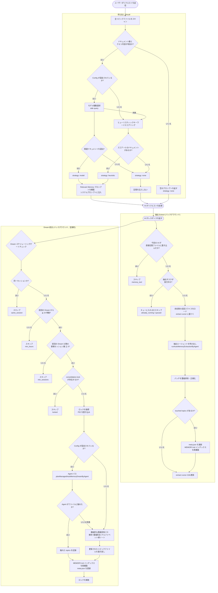
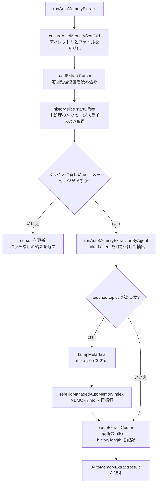
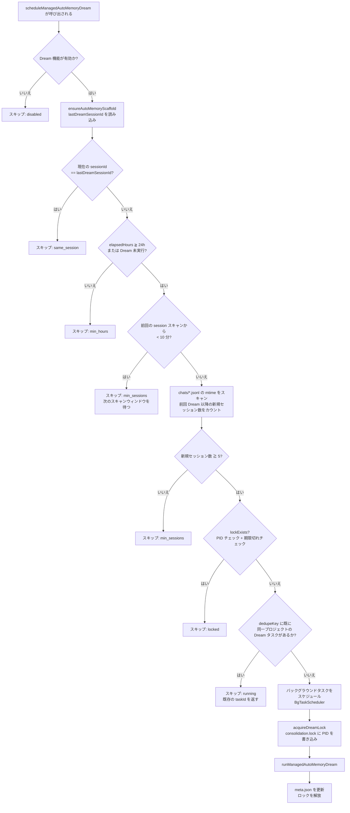
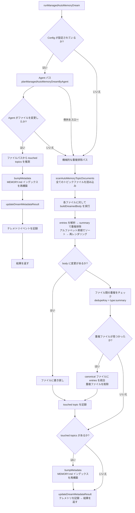
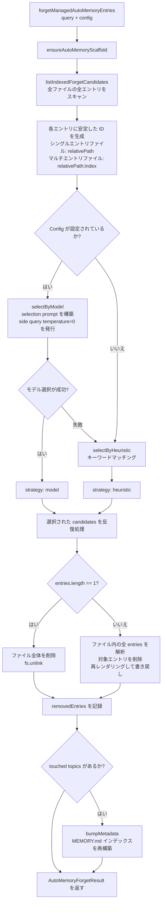

```markdown
# Memory 記憶管理システム

> 本稿では、Qwen Code の **Managed Auto-Memory**（管理自動記憶）における記憶管理メカニズム、トリガー条件、実装の詳細について説明します。

---

## 目次

1. [概要](#概要)
2. [保存構造](#保存構造)
3. [記憶タイプ](#記憶タイプ)
4. [記憶エントリのフォーマット](#記憶エントリのフォーマット)
5. [主要ライフサイクル](#主要ライフサイクル)
6. [Extract — 抽出](#extract--抽出)
7. [Dream — 統合](#dream--統合)
8. [Recall — 呼び出し](#recall--呼び出し)
9. [Forget — 忘却](#forget--忘却)
10. [インデックス再構築](#インデックス再構築)
11. [テレメトリ計測](#テレメトリ計測)

---

## 概要

Managed Auto-Memory は、AI とのセッション中にユーザーに関連する知識を**自動的に**蓄積、統合、検索する永続的な記憶システムです。4 つの主要な操作によって記憶のライフサイクルを管理します。

| 操作     | 英語       | トリガー方法               | 役割                                             |
| -------- | ---------- | -------------------------- | ------------------------------------------------ |
| 抽出     | Extract    | 自動（各ターン後）         | 会話ログから新たな知識を抽出し記憶ファイルに書き込む |
| 統合     | Dream      | 自動（定期的なバックグラウンドタスク） | 記憶ファイルの重複を除去・結合し、整理整頓する         |
| 呼び出し | Recall     | 自動（各ターン前）         | 現在のリクエストに関連する記憶を検索しシステムプロンプトに注入する |
| 忘却     | Forget     | 手動（ユーザーコマンド `/forget`） | 指定された記憶エントリを正確に削除する               |

---

## 保存構造

### ディレクトリレイアウト

```
~/.qwen/                                      ← グローバルベースディレクトリ（デフォルト）
└── projects/
    └── <sanitized-git-root>/                 ← プロジェクト識別子（Git ルートパスに基づく）
        ├── meta.json                         ← メタデータ（抽出/統合タイムスタンプ、ステータス）
        ├── extract-cursor.json               ← 抽出カーソル（処理済みの会話オフセット）
        ├── consolidation.lock                ← Dream プロセスの排他ロック
        └── memory/                           ← 記憶メインディレクトリ
            ├── MEMORY.md                     ← インデックスファイル（自動生成、全エントリを集約）
            ├── user.md                       ← ユーザー嗜好記憶（例）
            ├── feedback.md                   ← フィードバック規範記憶（例）
            ├── project/
            │   └── milestone.md              ← プロジェクト記憶（サブディレクトリ対応）
            └── reference/
                └── grafana.md                ← 外部リソース記憶
```

> **環境変数による上書き**：
>
> - `QWEN_CODE_MEMORY_BASE_DIR`：グローバルベースディレクトリを置き換え
> - `QWEN_CODE_MEMORY_LOCAL=1`：プロジェクト内パス `.qwen/memory/` を使用

### 主要ファイルの説明

| ファイル                | 説明                                                                                                |
| --------------------- | ------------------------------------------------------------------------------------------------- |
| `meta.json`           | 最後の Extract / Dream の時刻、セッションID、対象となった記憶タイプ、実行ステータスを記録           |
| `extract-cursor.json` | 現在のセッションにおいて会話履歴のどのオフセットまで処理済みかを記録。重複抽出防止のため          |
| `consolidation.lock`  | Dream 実行中のファイルロック。内容は保持者の PID。1 時間超過で自動無効化                           |
| `MEMORY.md`           | 全トピックファイルのインデックス。Extract / Dream のたびに再構築される。Markdown リスト形式          |

---

## 記憶タイプ

システムは 4 つの組み込み記憶タイプをサポートし、それぞれ異なる情報の次元に対応します。

| タイプ        | 保存内容                                             | 書き込みタイミング                               | 読み取りタイミング                     |
| ------------- | ---------------------------------------------------- | ---------------------------------------------- | -------------------------------------- |
| `user`        | ユーザーの役割、スキル背景、仕事の習慣               | ユーザーの役割/好み/知識背景を把握したとき       | 回答をユーザーの背景に合わせてカスタマイズする必要があるとき |
| `feedback`    | AI の行動に関するユーザーの指示：避けるべきこと、続けるべきこと | ユーザーが AI を修正したり、自明でない行動を確認したとき | AI の振る舞いに影響を与える必要があるとき |
| `project`     | プロジェクトの進捗、目標、決定、期限、バグ追跡       | 誰が何をなぜいつまでにやっているかを把握したとき   | AI が作業の背景やモチベーションを理解するのに役立つとき |
| `reference`   | 外部システムリソースへのポインタ（ダッシュボード、チケットシステム、Slack チャンネルなど） | 外部リソースとその用途を知ったとき               | ユーザーが外部システムや関連情報に言及したとき |

**記憶に保存すべきでない内容**：コードパターン/規約、Git 履歴、デバッグ手法、一時的なタスクステータス、既に QWEN.md/AGENTS.md に記録されている内容。

---

## 記憶エントリのフォーマット

各トピックファイルは **YAML frontmatter + Markdown body** 形式を使用します。

```markdown
---
name: 記憶名
description: 一行での説明（呼び出し時の関連性判断に使用。具体的に）
type: user|feedback|project|reference
---

記憶本文（summary 行）

Why: 背後にある理由（AI がルールを盲目的に守るのではなく、境界条件を理解できるようにするため）
How to apply: 適用すべきシナリオと使用方法
```

`feedback` と `project` タイプでは、`Why` と `How to apply` の記入を強く推奨します。これにより、境界条件でも記憶を正しく適用できるようになります。

---

## 主要ライフサイクル



---

## Extract — 抽出

### トリガー条件

AI が各ターンのレスポンスを完了した後、`scheduleAutoMemoryExtract` によって自動的にトリガーされます（バックグラウンドで非ブロッキング）。

### スケジューリングロジック（`extractScheduler.ts`）


**スキップ理由の説明**：

| 理由              | 意味                                                       |
| ----------------- | ---------------------------------------------------------- |
| `memory_tool`     | 今回のメイン Agent が既に直接記憶ファイルに書き込んだため、競合を避けてスキップ |
| `already_running` | 抽出が既に実行中で、キューイング不可                       |
| `queued`          | 既に抽出が実行中、今回のリクエストはキューイングされた     |

### コア抽出フロー（`extract.ts`）



> **注意：** `isUnderMemoryPressure` ゲートは `MemoryManager.runExtract()` 内にあり、本フローには含まれません。monitor が hard/critical の圧力を報告した場合、`MemoryManager` は extract 呼び出しをスキップし、cursor を進めません。

**抽出カーソル（Cursor）**：

- フィールド：`{ sessionId, processedOffset, updatedAt }`
- 抽出前に `readExtractCursor` で現在の進捗を読み込み、`history.slice(processedOffset)` で未読部分のみを処理
- 抽出後、`processedOffset` を現在の履歴長（`params.history.length`）に更新
- セッションが変わると（`sessionId` が異なる）オフセット 0 から再開
- 注意：`buildTranscriptMessages` / `loadUnprocessedTranscriptSlice` によるトランスクリプトテキストの構築は行われません。`hasNewUserMessages` は `history.slice(startOffset).some(m => m.role === 'user' && partToString(m.parts).trim().length > 0)` で判断し、未読スライスのみを軽量に文字列化します。全量の履歴は処理しません。

**パッチフィルタリングルール**：

- 要約の長さが 12 文字未満 → 破棄
- 要約が `?` で終わる → 破棄（疑問文）
- 一時的なキーワード（today/now/currently/temporary など）を含む → 破棄
- 同一の `topic:summary` の組み合わせ → 重複排除

---

## Dream — 統合

### トリガー条件

AI が各ターンのレスポンスを完了した後、`scheduleManagedAutoMemoryDream` によって自動的にトリガーされます（バックグラウンドで非ブロッキング）。ただし、複数のゲート条件で保護されており、ほとんどの場合スキップされます。

### スケジューリングゲート（`dreamScheduler.ts`）



**ゲートパラメータ**：

| パラメータ                    | デフォルト値 | 説明                                |
| --------------------------- | ------------ | ----------------------------------- |
| `minHoursBetweenDreams`    | 24 時間      | 2 回の Dream 間の最小時間間隔      |
| `minSessionsBetweenDreams` | 5 セッション | Dream をトリガーするのに必要な最小新規セッション数 |
| `SESSION_SCAN_INTERVAL_MS` | 10 分        | セッションファイルスキャンのスロットル間隔       |
| `DREAM_LOCK_STALE_MS`      | 1 時間       | lock ファイルが期限切れと見なされる時間しきい値       |

**ロックメカニズム**：

- lock ファイルは `<project-state-dir>/consolidation.lock`
- 内容は保持プロセスの PID
- チェック時：PID プロセスが既に存在しない（`kill(pid, 0)` が失敗）か、lock が 1 時間を超えている場合 → 期限切れと見なし、自動的にクリア

### 統合実行フロー（`dream.ts`）



**機械的重複排除ロジック**：

1. 各トピックファイル内：`summary.toLowerCase()` で重複排除し、`why`/`howToApply` フィールドを統合
2. summary のアルファベット順に再ソート
3. ファイル間：同じ `type:summary` のエントリは最初に見つかったファイルに統合し、重複ファイルを削除

---

## Recall — 呼び出し

### トリガー条件

AI がユーザーリクエストを処理する前の各ターンで、`resolveRelevantAutoMemoryPromptForQuery` によって自動的にトリガーされ、関連する記憶をシステムプロンプトに注入します。

### 呼び出しフロー（`recall.ts`）


**スコアリングルール（ヒューリスティック）**：

| 条件                                     | 加算             |
| -------------------------------------- | -------------- |
| query token がドキュメント内容に出現  | +2（トークンごと）|
| query token がそのタイプの特徴キーワード | +1（トークンごと）|
| ドキュメント body が空でない         | +1               |

**各タイプの特徴キーワード**：

- `user`：user, preference, background, role, terse
- `feedback`：feedback, rule, avoid, style, summary
- `project`：project, goal, incident, deadline, release
- `reference`：reference, dashboard, ticket, docs, link

**プロンプト構築ルール**：

- 最大 5 つのドキュメントを注入（`MAX_RELEVANT_DOCS`）
- 各ドキュメント body を 1200 文字に切り詰め（`MAX_DOC_BODY_CHARS`）
- 切り詰めた場合、「NOTE: Relevant memory truncated for prompt budget.」というヒントを追加
- ドキュメントの新鮮度情報を含める（ファイルの mtime に基づく）

---

## Forget — 忘却

### トリガー条件

ユーザーが手動で `/forget <query>` コマンドを実行することでトリガーされます。

### 忘却フロー（`forget.ts`）



**エントリ ID の設計**：

- 単一エントリファイル（一般的）：`relativePath`（例：`feedback/no-summary.md`）
- 複数エントリファイル：`relativePath:index`（例：`feedback/style.md:2`）
- 安定した ID を使用することで、モデルが同一ファイル内の他のエントリに影響を与えずにエントリを正確に特定できる

---

## インデックス再構築

`MEMORY.md` は全トピックファイルのナビゲーションインデックスであり、Extract または Dream のたびに `rebuildManagedAutoMemoryIndex` を呼び出して再構築されます。

```
- [ユーザーの嗜好](user/preferences.md) — ユーザーはベテランの Go エンジニアで、React は初めて
- [フィードバック規範](feedback/style.md) — 返信は簡潔に、末尾の要約は不要
- [プロジェクトマイルストーン](project/milestone.md) — モバイルリリースのブランチカット前のマージフリーズ期間
```

**インデックスの制限**：

- 1 行あたり最大 150 文字（超過時は `…` で切り詰め）
- 最大 200 行
- 合計サイズは 25,000 バイト以下

---

## テレメトリ計測

システムには 3 種類のテレメトリイベントが組み込まれており、記憶操作のパフォーマンスと効果を監視します。

### Extract テレメトリ

| フィールド          | タイプ                         | 説明                     |
| ----------------- | ---------------------------- | ------------------------ |
| `trigger`        | `'auto'`                     | トリガー方法（現在は自動のみ）  |
| `status`         | `'completed'` \| `'failed'`  | 実行結果                 |
| `patches_count`  | number                       | 抽出された有効なパッチ数   |
| `touched_topics` | string[]                     | 書き込まれた記憶タイプのリスト |
| `duration_ms`    | number                       | 総所要時間（ミリ秒）       |

### Dream テレメトリ

| フィールド           | タイプ                                   | 説明                      |
| ------------------ | -------------------------------------- | ------------------------- |
| `trigger`         | `'auto'`                               | トリガー方法               |
| `status`          | `'updated'` \| `'noop'` \| `'failed'`  | 実行結果                  |
| `deduped_entries` | number                                 | 機械的な重複排除で削除されたエントリ数 |
| `touched_topics`  | string[]                               | 変更された記憶タイプのリスト    |
| `duration_ms`     | number                                 | 総所要時間（ミリ秒）        |

### Recall テレメトリ

| フィールド           | タイプ                                    | 説明                |
| ------------------ | --------------------------------------- | ------------------- |
| `query_length`    | number                                  | クエリ文字列の長さ      |
| `docs_scanned`    | number                                  | スキャンされたドキュメント総数 |
| `docs_selected`   | number                                  | 最終的に注入されたドキュメント数 |
| `strategy`        | `'none'` \| `'heuristic'` \| `'model'`  | 選択戦略              |
| `duration_ms`     | number                                  | 総所要時間（ミリ秒）     |

---

## 関連ソースファイルインデックス

| ファイル                                                 | 責務                                                                     |
| ------------------------------------------------------ | ------------------------------------------------------------------------ |
| `packages/core/src/memory/types.ts`                   | 型定義：`AutoMemoryType`、`AutoMemoryMetadata`、`AutoMemoryExtractCursor` |
| `packages/core/src/memory/paths.ts`                   | パス計算：`getAutoMemoryRoot`、`isAutoMemPath`、各種ファイルパス helper    |
| `packages/core/src/memory/store.ts`                   | スキャフォールド初期化：`ensureAutoMemoryScaffold`、インデックス/メタデータ読み書き |
| `packages/core/src/memory/scan.ts`                    | トピックファイルのスキャン：`scanAutoMemoryTopicDocuments`、frontmatter のパース |
| `packages/core/src/memory/entries.ts`                 | エントリの解析とレンダリング：`parseAutoMemoryEntries`、`renderAutoMemoryBody` |
| `packages/core/src/memory/extract.ts`                 | 抽出コアロジック：`runAutoMemoryExtract`、カーソル管理、パッチ重複排除            |
| `packages/core/src/memory/extractScheduler.ts`        | 抽出スケジューラ：`ManagedAutoMemoryExtractRuntime`、キュー/実行状態マシン       |
| `packages/core/src/memory/extractionAgentPlanner.ts`  | 抽出エージェント：`runAutoMemoryExtractionByAgent`                            |
| `packages/core/src/memory/dream.ts`                   | 統合コアロジック：`runManagedAutoMemoryDream`、Agent パス + 機械的重複排除       |
| `packages/core/src/memory/dreamScheduler.ts`          | 統合スケジューラ：`ManagedAutoMemoryDreamRuntime`、ゲートチェック、ロック管理     |
| `packages/core/src/memory/dreamAgentPlanner.ts`       | 統合エージェント：`planManagedAutoMemoryDreamByAgent`                         |
| `packages/core/src/memory/recall.ts`                  | 呼び出しロジック：`resolveRelevantAutoMemoryPromptForQuery`、ヒューリスティック+モデル二重パス |
| `packages/core/src/memory/forget.ts`                  | 忘却ロジック：`forgetManagedAutoMemoryEntries`、候補生成+正確な削除              |
| `packages/core/src/memory/indexer.ts`                 | インデックス再構築：`rebuildManagedAutoMemoryIndex`、`buildManagedAutoMemoryIndex` |
| `packages/core/src/memory/prompt.ts`                  | システムプロンプトテンプレート：記憶タイプ説明、フォーマット例、使用規範           |
| `packages/core/src/memory/governance.ts`              | ガバナンス提案タイプ：`AutoMemoryGovernanceSuggestionType`                       |
| `packages/core/src/memory/state.ts`                   | 抽出実行状態：`isExtractRunning`、`markExtractRunning`、`clearExtractRunning`    |
| `packages/core/src/memory/memoryAge.ts`               | 新鮮度記述：`memoryAge`、`memoryFreshnessText`                                 |
```