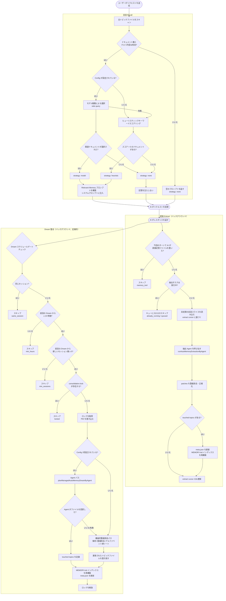
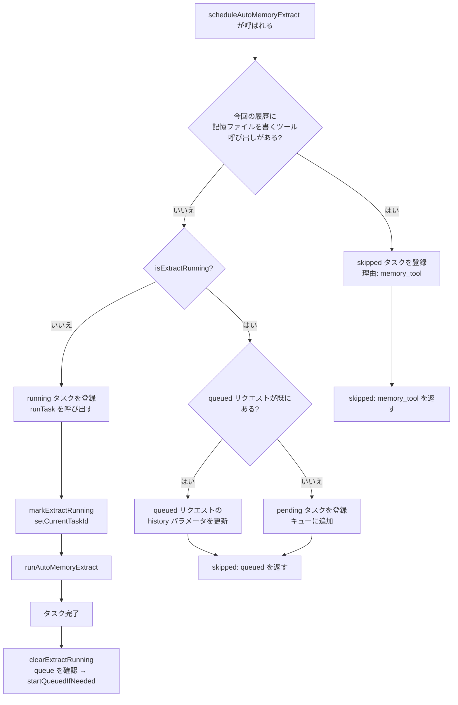
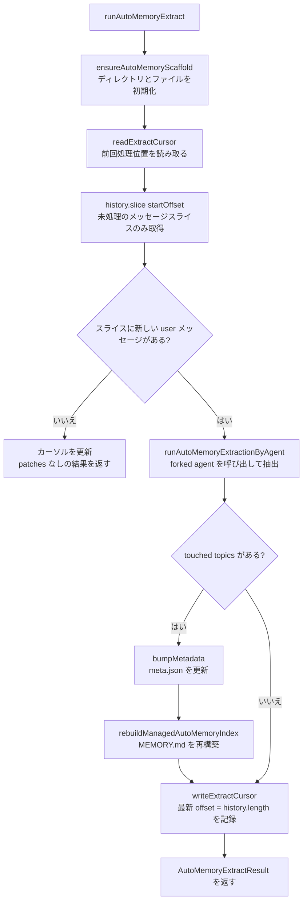
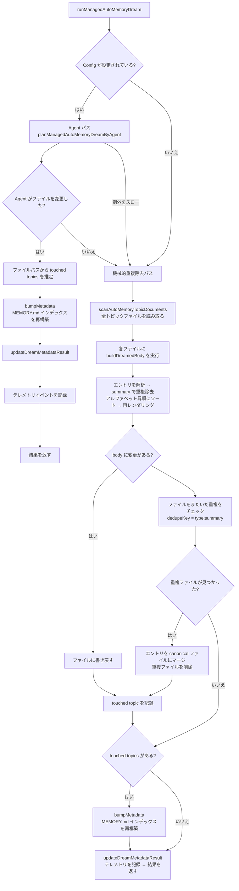
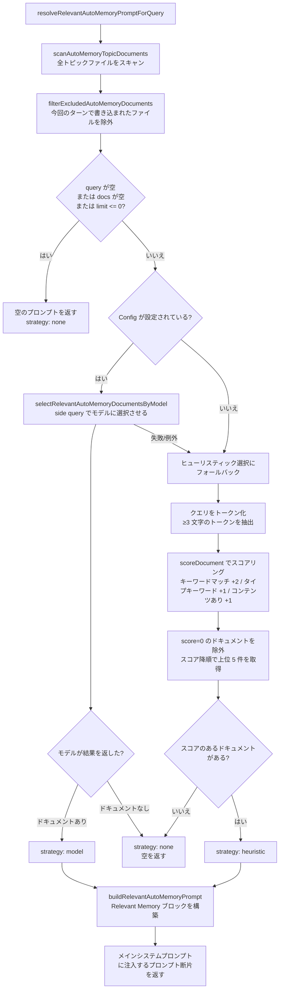
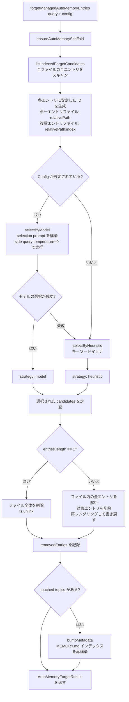

# Memory 記憶管理システム

> 本記事では、Qwen Code における **Managed Auto-Memory**（管理型自動記憶）の記憶管理メカニズム、トリガータイミング、および実装の詳細について説明します。

---

## 目次

1. [概要](#概要)
2. [ストレージ構造](#ストレージ構造)
3. [記憶タイプ](#記憶タイプ)
4. [記憶エントリのフォーマット](#記憶エントリのフォーマット)
5. [コアライフサイクル](#コアライフサイクル)
6. [Extract — 抽出](#extract--抽出)
7. [Dream — 統合](#dream--統合)
8. [Recall — 想起](#recall--想起)
9. [Forget — 忘却](#forget--忘却)
10. [インデックス再構築](#インデックス再構築)
11. [テレメトリ](#テレメトリ)

---

## 概要

Managed Auto-Memory は、AI セッション中にユーザー関連の知識を**自動的に**蓄積・統合・検索する永続的な記憶システムです。4 つのコア操作によって記憶のライフサイクルを管理します。

| 操作 | 英語    | トリガー方式                   | 役割                                   |
| ---- | ------- | ------------------------------ | -------------------------------------- |
| 抽出 | Extract | 自動（各ターン後）             | 会話履歴から新しい知識を抽出して記憶ファイルに書き込む |
| 統合 | Dream   | 自動（定期バックグラウンドタスク） | 記憶ファイルの重複除去・マージを行い整理する |
| 想起 | Recall  | 自動（各ターン前）             | 現在のリクエストに関連する記憶を検索してシステムプロンプトに注入する |
| 忘却 | Forget  | 手動（ユーザーコマンド `/forget`） | 指定した記憶エントリを正確に削除する |

---

## ストレージ構造

### ディレクトリレイアウト

```
~/.qwen/                                      ← グローバルベースディレクトリ（デフォルト）
└── projects/
    └── <sanitized-git-root>/                 ← プロジェクト識別子（Git ルートパスに基づく）
        ├── meta.json                         ← メタデータ（抽出/統合タイムスタンプ、状態）
        ├── extract-cursor.json               ← 抽出カーソル（処理済み会話オフセット）
        ├── consolidation.lock                ← Dream プロセスの排他ロック
        └── memory/                           ← 記憶メインディレクトリ
            ├── MEMORY.md                     ← インデックスファイル（自動生成、全エントリ集約）
            ├── user.md                       ← ユーザー設定の記憶（例）
            ├── feedback.md                   ← フィードバック規約の記憶（例）
            ├── project/
            │   └── milestone.md              ← プロジェクト記憶（サブディレクトリ対応）
            └── reference/
                └── grafana.md                ← 外部リソース記憶
```

> **環境変数による上書き**：
>
> - `QWEN_CODE_MEMORY_BASE_DIR`：グローバルベースディレクトリを置き換える
> - `QWEN_CODE_MEMORY_LOCAL=1`：プロジェクト内パス `.qwen/memory/` を使用する

### 主要ファイルの説明

| ファイル              | 説明                                                                   |
| --------------------- | ---------------------------------------------------------------------- |
| `meta.json`           | 最後の Extract / Dream の日時、セッション ID、対象の記憶タイプ、実行状態を記録する |
| `extract-cursor.json` | 現在のセッションで処理済みの会話履歴オフセットを記録し、重複抽出を防ぐ |
| `consolidation.lock`  | Dream 実行中のファイルロック。内容は保持プロセスの PID。1 時間経過で自動失効 |
| `MEMORY.md`           | 全トピックファイルのインデックス。Extract/Dream 後に再構築される。形式は Markdown リスト |

---

## 記憶タイプ

システムは 4 種類の組み込み記憶タイプをサポートし、それぞれ異なる情報の次元に対応します。

| タイプ      | 保存内容                                              | 書き込みタイミング                         | 読み取りタイミング                   |
| ----------- | ----------------------------------------------------- | ------------------------------------------ | ------------------------------------ |
| `user`      | ユーザーの役割、スキル背景、作業習慣                  | ユーザーの役割・好み・知識背景を把握したとき | 回答をユーザーの背景に合わせてカスタマイズする必要があるとき |
| `feedback`  | AI の挙動に対するユーザーの指示：避けること、続けること | AI を修正するか、明らかでない手法を確認するとき | AI の動作方式に影響を与えるとき |
| `project`   | プロジェクトの進捗、目標、決定事項、期限、バグ追跡    | 誰が何をなぜいつまでに行うかを把握したとき | AI が作業の背景と動機を理解する必要があるとき |
| `reference` | 外部システムリソースへのポインタ（ダッシュボード、チケットシステム、Slack チャンネルなど） | 外部リソースとその用途を知ったとき | ユーザーが外部システムや関連情報に言及するとき |

**記憶に保存すべきでない内容**：コードパターン/規約、Git 履歴、デバッグ方針、一時的なタスク状態、すでに QWEN.md/AGENTS.md に記録されている内容。

---

## 記憶エントリのフォーマット

各トピックファイルは **YAML frontmatter + Markdown body** の形式を使用します。

```markdown
---
name: 記憶名
description: 一文での説明（想起の関連性判定に使用。具体的に）
type: user|feedback|project|reference
---

記憶の本文（summary 行）

Why: 背景にある理由（AI がルールを盲目的に従うのではなくエッジケースを理解できるよう）
How to apply: 適用シナリオと使用方法
```

`feedback` および `project` タイプでは、エッジケースでも記憶が正しく適用されるよう `Why` と `How to apply` の記入を強く推奨します。

---

## コアライフサイクル



---

## Extract — 抽出

### トリガータイミング

AI が各ターンのレスポンスを完了するたびに、`scheduleAutoMemoryExtract` によって自動的にトリガーされます（バックグラウンド、ノンブロッキング）。

### スケジューリングロジック（`extractScheduler.ts`）



**スキップ理由の説明**：

| 理由              | 意味                                            |
| ----------------- | ----------------------------------------------- |
| `memory_tool`     | 今回のメイン Agent が直接記憶ファイルを書いたため、競合を避けてスキップ |
| `already_running` | 抽出が進行中でキューに追加できない              |
| `queued`          | 抽出が実行中のため、このリクエストはキューに追加済み |

### コア抽出フロー（`extract.ts`）



> **注意：** `isUnderMemoryPressure` のゲートは `MemoryManager.runExtract()` 内にあり、このフローには含まれません。monitor が hard/critical 圧力を報告した場合、`MemoryManager` は extract の呼び出しをスキップし、カーソルを進めません。

**抽出カーソル（Cursor）**：

- フィールド：`{ sessionId, processedOffset, updatedAt }`
- 抽出前に `readExtractCursor` で現在の進捗を読み取り、`history.slice(processedOffset)` で未読部分のみ処理する
- 各抽出後に `processedOffset` を現在の履歴長（`params.history.length`）に更新する
- セッションをまたぐ場合（`sessionId` が変化した場合）はオフセット 0 から再開する
- 注意：`buildTranscriptMessages` / `loadUnprocessedTranscriptSlice` によるトランスクリプトのビルドは廃止。`hasNewUserMessages` は `history.slice(startOffset).some(m => m.role === 'user' && partToString(m.parts).trim().length > 0)` で判定し、未読スライスに対して軽量な文字列化のみを行い、全履歴は処理しない

**Patch フィルタリングルール**：

- サマリーの長さ < 12 文字 → 破棄
- サマリーが `?` で終わる → 破棄（疑問文）
- 一時的なキーワードを含む（today/now/currently/temporary など） → 破棄
- 同じ `topic:summary` の組み合わせ → 重複除去

---

## Dream — 統合

### トリガータイミング

AI が各ターンのレスポンスを完了するたびに、`scheduleManagedAutoMemoryDream` によって自動的にトリガーされます（バックグラウンド、ノンブロッキング）。ただし複数のゲート条件によって保護されており、ほとんどの場合はスキップされます。

### スケジューリングゲート（`dreamScheduler.ts`）


**ゲートパラメータ**：

| パラメータ                 | デフォルト値 | 説明                          |
| -------------------------- | ------------ | ----------------------------- |
| `minHoursBetweenDreams`    | 24 時間      | 2 回の Dream 間の最小時間間隔 |
| `minSessionsBetweenDreams` | 5 セッション | Dream をトリガーするのに必要な最小新規セッション数 |
| `SESSION_SCAN_INTERVAL_MS` | 10 分        | セッションファイルスキャンのスロットリング間隔 |
| `DREAM_LOCK_STALE_MS`      | 1 時間       | lock ファイルが期限切れとみなされる時間しきい値 |

**ロックメカニズム**：

- lock ファイルは `<project-state-dir>/consolidation.lock` に配置される
- 内容は保持プロセスの PID
- チェック時：PID プロセスが存在しない（`kill(pid, 0)` が失敗）か lock が 1 時間を超えた場合 → 期限切れとみなして自動削除

### 統合実行フロー（`dream.ts`）



**機械的重複除去ロジック**：

1. 各トピックファイル内部：`summary.toLowerCase()` で重複除去し、`why`/`howToApply` フィールドをマージする
2. summary のアルファベット順に再ソートする
3. ファイルをまたいで：同じ `type:summary` のエントリを最初に見つかったファイルにマージし、重複ファイルを削除する

---

## Recall — 想起

### トリガータイミング

AI が各ターンでユーザーのリクエストを処理する前に、`resolveRelevantAutoMemoryPromptForQuery` によって自動的にトリガーされ、関連する記憶をシステムプロンプトに注入します。

### 想起フロー（`recall.ts`）



**スコアリングルール（ヒューリスティック）**：

| 条件                             | 加点             |
| -------------------------------- | ---------------- |
| クエリトークンがドキュメント内容に含まれる | +2（トークンごと） |
| クエリトークンがそのタイプの特徴キーワード | +1（トークンごと） |
| ドキュメント body が非空           | +1               |

**各タイプの特徴キーワード**：

- `user`：user, preference, background, role, terse
- `feedback`：feedback, rule, avoid, style, summary
- `project`：project, goal, incident, deadline, release
- `reference`：reference, dashboard, ticket, docs, link

**プロンプト構築ルール**：

- 最大 5 件のドキュメントを注入（`MAX_RELEVANT_DOCS`）
- 各ドキュメントの body は 1200 文字に切り詰め（`MAX_DOC_BODY_CHARS`）
- 切り詰めが発生した場合は注記を追加："NOTE: Relevant memory truncated for prompt budget."
- ドキュメントの鮮度情報を含める（ファイルの mtime に基づく）

---

## Forget — 忘却

### トリガータイミング

ユーザーが手動で `/forget <query>` コマンドを実行することでトリガーされます。

### 忘却フロー（`forget.ts`）



**Entry ID の設計**：

- 単一エントリファイル（一般的なケース）：`relativePath`（例：`feedback/no-summary.md`）
- 複数エントリファイル：`relativePath:index`（例：`feedback/style.md:2`）
- 安定した ID を使用することで、モデルが同じファイル内の他のエントリに影響を与えずにエントリを正確に特定できる

---

## インデックス再構築

`MEMORY.md` は全トピックファイルのナビゲーションインデックスであり、Extract または Dream のたびに `rebuildManagedAutoMemoryIndex` を呼び出して再構築されます。

```
- [ユーザー設定](user/preferences.md) — ユーザーはシニア Go エンジニアで、React は初めて
- [フィードバック規約](feedback/style.md) — 回答は簡潔に。末尾のまとめは不要
- [プロジェクトマイルストーン](project/milestone.md) — モバイルリリースのブランチ作成前のマージフリーズウィンドウ
```

**インデックス制限**：

- 各行最大 150 文字（超過した場合は `…` で切り詰め）
- 最大 200 行
- 合計サイズは 25,000 バイト以内

---

## テレメトリ

システムには 3 種類のテレメトリイベントが組み込まれており、記憶操作のパフォーマンスと効果を監視します。

### Extract テレメトリ

| フィールド       | 型                          | 説明                    |
| ---------------- | --------------------------- | ----------------------- |
| `trigger`        | `'auto'`                    | トリガー方式（現在は自動のみ） |
| `status`         | `'completed'` \| `'failed'` | 実行結果                |
| `patches_count`  | number                      | 抽出された有効な patch 数 |
| `touched_topics` | string[]                    | 書き込まれた記憶タイプのリスト |
| `duration_ms`    | number                      | 合計処理時間（ミリ秒）   |

### Dream テレメトリ

| フィールド        | 型                                    | 説明                   |
| ----------------- | ------------------------------------- | ---------------------- |
| `trigger`         | `'auto'`                              | トリガー方式           |
| `status`          | `'updated'` \| `'noop'` \| `'failed'` | 実行結果               |
| `deduped_entries` | number                                | 機械的パスで重複除去されたエントリ数 |
| `touched_topics`  | string[]                              | 変更された記憶タイプのリスト |
| `duration_ms`     | number                                | 合計処理時間（ミリ秒） |

### Recall テレメトリ

| フィールド      | 型                                     | 説明             |
| --------------- | -------------------------------------- | ---------------- |
| `query_length`  | number                                 | クエリ文字列の長さ |
| `docs_scanned`  | number                                 | スキャンされたドキュメントの総数 |
| `docs_selected` | number                                 | 最終的に注入されたドキュメント数 |
| `strategy`      | `'none'` \| `'heuristic'` \| `'model'` | 選択戦略         |
| `duration_ms`   | number                                 | 合計処理時間（ミリ秒） |

---

## 関連ソースファイルインデックス

| ファイル                                                 | 責務                                                                          |
| ---------------------------------------------------- | ----------------------------------------------------------------------------- |
| `packages/core/src/memory/types.ts`                  | 型定義：`AutoMemoryType`、`AutoMemoryMetadata`、`AutoMemoryExtractCursor`   |
| `packages/core/src/memory/paths.ts`                  | パス計算：`getAutoMemoryRoot`、`isAutoMemPath`、各種ファイルパスヘルパー     |
| `packages/core/src/memory/store.ts`                  | スキャフォールド初期化：`ensureAutoMemoryScaffold`、インデックス/メタデータの読み書き |
| `packages/core/src/memory/scan.ts`                   | トピックファイルのスキャン：`scanAutoMemoryTopicDocuments`、frontmatter の解析 |
| `packages/core/src/memory/entries.ts`                | エントリの解析とレンダリング：`parseAutoMemoryEntries`、`renderAutoMemoryBody` |
| `packages/core/src/memory/extract.ts`                | 抽出コアロジック：`runAutoMemoryExtract`、カーソル管理、patch 重複除去        |
| `packages/core/src/memory/extractScheduler.ts`       | 抽出スケジューラー：`ManagedAutoMemoryExtractRuntime`、キュー/実行状態機械   |
| `packages/core/src/memory/extractionAgentPlanner.ts` | 抽出 Agent：`runAutoMemoryExtractionByAgent`                                  |
| `packages/core/src/memory/dream.ts`                  | 統合コアロジック：`runManagedAutoMemoryDream`、Agent パス + 機械的重複除去   |
| `packages/core/src/memory/dreamScheduler.ts`         | 統合スケジューラー：`ManagedAutoMemoryDreamRuntime`、ゲートチェック、ロック管理 |
| `packages/core/src/memory/dreamAgentPlanner.ts`      | 統合 Agent：`planManagedAutoMemoryDreamByAgent`                               |
| `packages/core/src/memory/recall.ts`                 | 想起ロジック：`resolveRelevantAutoMemoryPromptForQuery`、ヒューリスティック+モデルの二経路 |
| `packages/core/src/memory/forget.ts`                 | 忘却ロジック：`forgetManagedAutoMemoryEntries`、候補生成+精確削除             |
| `packages/core/src/memory/indexer.ts`                | インデックス再構築：`rebuildManagedAutoMemoryIndex`、`buildManagedAutoMemoryIndex` |
| `packages/core/src/memory/prompt.ts`                 | システムプロンプトテンプレート：記憶タイプの説明、フォーマット例、使用規約   |
| `packages/core/src/memory/governance.ts`             | ガバナンス提案タイプ：`AutoMemoryGovernanceSuggestionType`                    |
| `packages/core/src/memory/state.ts`                  | 抽出実行状態：`isExtractRunning`、`markExtractRunning`、`clearExtractRunning` |
| `packages/core/src/memory/memoryAge.ts`              | 鮮度の説明：`memoryAge`、`memoryFreshnessText`                                |
