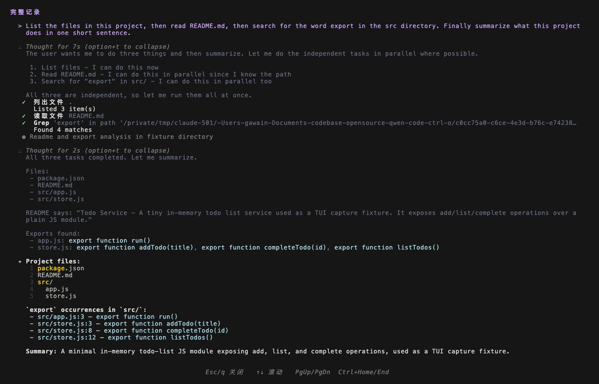

# 設計方案：Ctrl+O の挙動リファクタリング —— Claude Code の Transcript モデルへの整合

> **⚠️ すでに置き換え済み（superseded）**：本文書が記録している **`TranscriptView` + `AlternateScreen` による全詳細フリーズスナップショット画面**方案は、後続のリファクタリング（PR #8077）で**削除**されている。現在の実装では、`Ctrl+O`（`Alt+T` と `Command.TOGGLE_THINKING_EXPANDED` を共用）は独立した transcript 画面を開くのではなく、**その場で full-detail モードを切り替える**：`ThoughtExpandedContext.allExpanded` を通じて `MainContent` が `fullDetail` を各 `HistoryItemDisplay` に下位伝達し、主ビュー内でインラインにすべての思考ブロックとツールグループを展開（かつツール結果の切り詰めを解除）し、もう一度押すと折りたたむ。以下で独立した transcript 画面と alt-screen を記述する章節（§3.2、§4.2–§4.5、§9 のスタック式 commit 分割など）は**履歴記録**としてのみ保持されており、現行コードとは一致しない。

- ブランチ：`feat/ctrl-o-detail-expand`
- worktree：`<worktree-path>`
- 状態：**実装進行中——本文書は現在の PR 実装の受け入れ基線である**（docs-only ではない。現在の PR はすでに実装ファイルの変更を含む）
- 対象読者：qwen-code TUI のメンテナー

> **実装状態の対照（現在の PR）**：
>
> | 部分                                                                                                                     | 状態                                                                                                                                                                                                   |
> | ------------------------------------------------------------------------------------------------------------------------ | ------------------------------------------------------------------------------------------------------------------------------------------------------------------------------------------------------ |
> | グローバル compactMode の削除（context/settings/toggle/i18n key、`mergeCompactToolGroups`）                                       | ✅ 実装済み                                                                                                                                                                                              |
> | `fullDetail` パイプライン（`HistoryItemDisplay`/`ToolGroupMessage`、`forceExpandAll`/`forceShowResult`/思考ブロック expanded を統合）    | ✅ 実装済み                                                                                                                                                                                              |
> | `fullDetail` が `ToolGroupMessage` の 2 つの early return にバイパスされない（純並列/ memory-only は `!fullDetail` を守る）                      | ✅ 実装済み + 回帰テスト                                                                                                                                                                                   |
> | `TranscriptView` + alt-screen の接続（Ctrl+O トグル、Esc/q/Ctrl+C で閉じる、二段フリーズ、終了時の再描画、バックグラウンド確認の自動クローズ、メッセージキューガード） | ✅ 実装済み                                                                                                                                                                                              |
> | #5661 の type-based partition 基盤への rebase（すでに main にマージ済み）                                                                 | ✅ 実装済み                                                                                                                                                                                              |
> | `AlternateScreen` の `process.stdout.isTTY` ガード（§4.2）                                                                | ✅ 実装済み + テスト                                                                                                                                                                                       |
> | i18n の旧 compact 文言のクリーンアップ（9 言語）+ KeyboardShortcuts の `ctrl+o → view transcript` 文言（§5）                              | ✅ 実装済み                                                                                                                                                                                              |
> | **read/search/list の完全な明細の transcript への透過（§4.9：`detailedDisplay` 抽出ヘルパー + レンダリング分割 + live/resume/replay）**    | ✅ **実装済み + テスト**（方案 Y：core の `getToolResponseDisplayText` + live/resume 派生 + `ToolMessage` のデータソース切り替え。ACP は `transformPartsToToolCallContent` 経由で既に全文を持つため、新規プロトコルフィールドは不要。スクリーンショット §3.4 は再録画待ち） |
> | **ツール block のマウスクリックによるその場展開（§4.8、follow-up）**                                                                       | ⏭️ **follow-up（独立 PR、本 PR には含めない）**——理由は §4.8 を参照：type-based では per-tool のクリック対象がない、約 250–400 行、SGR 選択範囲のリスク                                                                                      |

---

## 1. 背景と問題

qwen-code は現在 **Ctrl+O を `TOGGLE_COMPACT_MODE` に割り当てている**：**グローバルな二値トグル**（`compactMode`、`settings.ui.compactMode` に永続化）。有効にすると：

- 完了済み（Success）のツールの結果出力を非表示にする；
- 思考ブロックを 1 行の `Thought for …` に折りたたむ；
- 1 回のキー押下で**履歴全体を遡及的に再レンダリング**する（`refreshStatic()` が `<Static>` を再マウントする）。

これにより「**簡易モード vs 詳細モード**」のグローバルな分断が生じている：同じ履歴がグローバルな 1 つのスイッチによって 2 つのまったく異なる形態の間で全体として切り替わり、認知負荷が大きく、視覚的な揺れも顕著であり、上流の gemini-cli や Claude Code の設計思想のいずれとも乖離している。

> **本方案は [#5661](https://github.com/QwenLM/qwen-code/pull/5661) の partition 基盤の上に積み重なる（すでに main にマージ済み）。** #5661 はツールグループのデフォルトレンダリングをリファクタリングした：`CompactToolGroupDisplay` を**カテゴリ別パーティションサマリーレンダラー**（`ToolCategory` / `TOOL_NAME_TO_CATEGORY` / `CATEGORY_ORDER` / `getToolCategory` / `buildToolSummary`）に拡張し、`ToolGroupMessage` の折りたたみ判定を **type-based partition** に変更した：`forceExpandAll` で逆向きにゲートし、ツールを**タイプ別**に `collapsibleTools`（read/search/list、`isCollapsibleTool(name)` による）へ分割し → `CompactToolGroupDisplay` のパーティションサマリーに折りたたみ、`nonCollapsibleTools`（edit/write/command/agent および Canceled）は → **常に個別に** `ToolMessage` とする。**注意：#5661 は `compactMode` と無関係**——`compactMode` はツールレンダリングに影響しなくなり、パーティションの折りたたみは純粋にツールタイプ + `forceExpandAll` で決まる。本 PR は**ツールレンダリングの基盤を再構築しない**——#5661 の partition 基盤 + #5751 のマウス基盤の上に、(1) 残存するグローバル `compactMode` の削除、(2) Ctrl+O transcript 全詳細画面、(3) マウスクリックによるツールブロックのその場展開を重ねる。詳細は §3.1（partition 基盤）、§4.1 / §5（削除リスト）、§9（スタック式 commit 分割）を参照。
>
> **改訂説明（#5661 マージ済み状態への rebase）**：本文書の初期バージョンは #5661 の初期の state-based スナップショット（`showCompact = (compactMode || allComplete)`、グループ全体が完了したらグループ全体を折りたたむ）に基づいて書かれた。#5661 はレビューの過程で上記の **type-based partition** に進化し、すでに main にマージされている。§3.1 / §4.1 / §4.5 / 付録は実際のマージ済み実装に基づき書き直されている：コアシンボルは `isCollapsibleTool` / `forceExpandAll`（**これらは確かに存在する**）であり、transcript の `fullDetail` は直接 `forceExpandAll=true` を設定する（もはや存在しない `showCompact` を変更するのではなく）。

### ゴール

**「簡易/詳細」のグローバルモード区別を完全に廃止**し、Claude Code に整合させる：

1. メインの会話ビューには**唯一の安定した、やや簡潔寄りのデフォルトレンダリングのみ**が存在し、グローバルなスイッチで全体が変形することはない。
2. **Ctrl+O は「特定のブロックの完全な詳細を見る」ことのみを担当**——**独立した Transcript 全詳細スクロール画面**を開く。メインビューは常にクリーンに保たれる。
3. 行内の `(ctrl+o to expand)` ヒントは「ここにはまだ多くの内容があり、Ctrl+O で transcript に移動して全体像を見る」というガイドとする。
4. **（follow-up、本 PR には含めない）block のマウスクリックによる明細のその場展開**：後続 PR の VP 限定 MVP として——折りたたまれたパーティションサマリー行をクリックするとグループ全体の明細をその場で展開する。**本 PR では提供しない**（理由は §4.8 を参照：type-based partition では折りたたまれたツールはすでに単行に集約されており、per-tool のクリック対象が存在せず、クリック粒度を再定義する必要がある。SGR マウス/ネイティブ選択範囲のリスクが重なる。作業量は約 250–400 行）。折りたたまれた思考ブロックのクリックで ThinkingViewer を開く機能はすでに main/#5751 が提供しており、本 PR はこれを変更しない。

> ユーザーの明確な指示：**直接 Claude Code に整合させればよい**。本方案は「Claude Code の ctrl+o = toggleTranscript モデルを忠実に再現する」ことを基準とする。マウスクリックによる展開は、その上に重ねる 2 つ目のインタラクション入口（キーボード + マウスのデュアルチャネル）である。

---

## 2. 3 つの製品の挙動比較（調査結論）

| 次元        | qwen-code（現状/#5661 基盤）                                 | Claude Code（実際）                          | gemini-cli（上流）                      |
| ----------- | ------------------------------------------------------------ | -------------------------------------------- | --------------------------------------- |
| Ctrl+O の割り当て | `TOGGLE_COMPACT_MODE`                                        | `app:toggleTranscript`                       | `SHOW_MORE_LINES` + `EXPAND_PASTE`      |
| コアモデル    | **グローバルな簡易/詳細の二値**（永続化）+ #5661 の partition 自動折りたたみ | **グローバルな transcript 画面** + ブロック単位の per-block 展開 | グローバルな `constrainHeight` + per-tool 展開  |
| メインビューへの影響  | 1 キーで履歴全体を遡及的に再レンダリング                                         | メインビューは一定。transcript は独立した画面              | 高さ制約の切り替え、「最終ターン」の展開            |
| ブロック単位の状態    | ❌ なし                                                        | ✅ `expandedKeys`（tool_use_id/uuid 単位）     | ✅ `ToolActionsContext.toggleExpansion` |
| 終了方法    | もう一度 Ctrl+O で戻す                                             | もう一度 Ctrl+O / Esc で prompt に戻る                  | もう一度 Ctrl+O で折りたたむ                        |

**qwen の「新しい現状基盤」= #5661 の type-based partition モデル（本方案の出発点であり、覆すべき旧基盤ではない）：** #5661 はツールグループのデフォルトレンダリングを「`compactMode` による全表示/全非表示」から**ツールタイプ別のパーティション折りたたみ**に進化させた——`forceExpandAll` が偽のとき、`collapsibleTools`（read/search/list、`isCollapsibleTool(name)` による、Canceled は除く）は `CompactToolGroupDisplay` のパーティションサマリー行に折りたたまれ（`CATEGORY_ORDER` による：search/read/list/command/edit/write/agent/other で集約、例 `Read 3 files, edited 2 files`）、`nonCollapsibleTools`（edit/write/command/agent + Canceled）は**常に個別に** `ToolMessage` となる。force 条件（確認/エラー/フォーカスされた shell/ユーザー開始/ターミナルサブエージェント）は `forceExpandAll=true` とし → すべて個別に展開する。**このモデルは `compactMode` と無関係**——#5661 において `compactMode` はツールレンダリングに影響しない（思考ブロックへの残存影響のみ）。本方案はこの基盤の上に**type-based partition の仕組み全体をそのまま保持**し、残存するグローバル `compactMode` スイッチのみを削除し、transcript の `fullDetail`（`forceExpandAll=true` を設定）を重ねる。

**Claude Code の実際のメカニズム（`claude-code` のパッケージ化ソースコードからのフォレンジックによる）：**

- `defaultBindings.ts`：`'ctrl+o': 'app:toggleTranscript'`。
- `useGlobalKeybindings.tsx`：`setScreen(s => (s === 'transcript' ? 'prompt' : 'transcript'))`、かつ `tengu_toggle_transcript` を計測。
- `REPL.tsx`：`screen === 'transcript'` のとき**仮想スクロール**で履歴の**すべて**をレンダリングし、かつ `verbose={true}`（完全展開を強制）。`prompt` モードには表示行数の上限がある。
- `CtrlOToExpand.tsx`：切り詰められたブロックの末尾に `(ctrl+o to expand)` をレンダリングし、クリック/押下で transcript に移動して全体像を見る。
- さらに独立した `expandedKeys`（per-message）もあるが、**メインのインタラクション入口は transcript 画面**である。

**gemini-cli の per-block モデル（フォレンジックの補足）**：gemini-cli は per-tool 展開を採用——`ToolActionsContext` の `expandedTools` / `toggleExpansion` が単一のツール単位で展開状態を管理する。これは **qwen の main にすでに存在する Alt+T の per-block 思考展開（`ThoughtExpandedContext`）と同じ考え方**：いずれも「単一ブロックのその場展開」を解決する。一方、本方案の transcript が解決するのは**異なる次元**——「全セッションの完全な振り返り」（alt-screen のフリーズスナップショット、全ブロックの fullDetail、スクロール可能）であり、両者は直交的に補完し合う（詳細は §4.7）。

**重要な追い風**：qwen-code はもともと transcript 画面の実装に必要な基盤をすべて備えている（`ScrollableList`/`VirtualizedList` + 実装済みの `AlternateScreen.tsx`）、§4.4 を参照。

---

## 3. ターゲット挙動の定義

### 3.1 デフォルト基線（メインビュー）= #5661 の partition モデル

メインビューは**すべての履歴項目**に単一で安定したレンダリングルールを採用し、**それを切り替えるグローバルなスイッチは一切存在しない**。この基線は**本方案の自作ではなく**、[#5661](https://github.com/QwenLM/qwen-code/pull/5661) がすでに実装した **type-based partition（ツールタイプ別のパーティション折りたたみ）モデル**である——本方案はこれをそのまま保持し、それとは無関係なグローバル `compactMode` スイッチのみを削除する：

| ブロックタイプ                                                          | デフォルト基線のレンダリング（#5661 type-based partition モデル）                                                                                                                                          | transcript でなければ全体を見られないか         |
| --------------------------------------------------------------- | --------------------------------------------------------------------------------------------------------------------------------------------------------------------------------------------------------------- | -------------------------------- |
| 思考（gemini_thought / \_content）                              | 単行サマリー `✻ Thought for 3s (ctrl+o to expand)`。ストリーミング中はリアルタイム表示し、確定後にサマリーに収束                                                                                                                            | はい                               |
| **collapsible ツール**（read/search/list、非 force）              | `isCollapsibleTool(name)` により `collapsibleTools` に分類され、`CompactToolGroupDisplay` の**パーティションサマリー行**に**折りたたみ**（`CATEGORY_ORDER` で集約、例 `Read 3 files, edited 2 files, ran 1 command`）                         | ツールごとの明細は transcript で全体を見られる |
| **non-collapsible ツール**（edit/write/command/agent / Canceled） | `nonCollapsibleTools` に分類され、**常に個別に** `ToolMessage` として完全レンダリング（その出力自体が答えである）——グループ全体が完了していてもサマリーには折りたたまない                             | ——                               |
| 混合グループ（collapsible + non-collapsible の混在）                    | **サマリー行 + ツール個別の併存**：collapsible 部分 → 1 行の `CompactToolGroupDisplay` サマリー。non-collapsible 部分 → 個別の `ToolMessage`。**グループ全体の折りたたみではない**                                                                  | 一部                             |
| 完了済み collapsible ツールの string/ansi 結果                      | デフォルトで折りたたみ（`shouldCollapseResult = !forceShowResult && Success && isCollapsibleTool(name) && (string\|ansi)` → 結果エリアをレンダリングしない）。**Shell/Edit などの non-collapsible 結果は常に表示**。diff/plan/todo/task はそれぞれの renderer | transcript で全体を見られる               |
| エラー / 確認待ち / ユーザー開始 / フォーカスされた shell / ターミナルサブエージェント              | `forceExpandAll=true` → グループ全体を個別に `ToolMessage`。対応するトリガーツールは `forceShowResult=true` を受け取り結果の折りたたみを解除                                                                                                         | ——                               |
| 通常のテキストメッセージ                                                    | 完全表示                                                                                                                                                                                                        | ——                               |

要点：

- **パーティションの折りたたみは #5661 の `forceExpandAll` + `isCollapsibleTool` が駆動**——`ToolGroupMessage` において `forceExpandAll = hasConfirmingTool || hasSubagentPendingConfirmation || hasErrorTool || isEmbeddedShellFocused || isUserInitiated || hasTerminalSubagent`（**`compactMode`/`allComplete` を含まない**）。`forceExpandAll` が偽のとき、`isCollapsibleTool(name)`（read/search/list、Canceled は除く）で `collapsibleTools` → `CompactToolGroupDisplay` サマリーに分割し、残りは `nonCollapsibleTools` → 個別の `ToolMessage` に入る。真のときはすべてのツールが `nonCollapsibleTools` に入る。
- **完了済み結果の折りたたみは #5661 の `shouldCollapseResult` ゲートが駆動**——`ToolMessage` において `shouldCollapseResult = !forceShowResult && status === Success && isCollapsibleTool(name) && (renderer.type === 'string' || 'ansi')`。**追加の `isCollapsibleTool(name)` ガードに注意**：read/search/list の string/ansi 結果のみが折りたたまれ、Shell/Edit/Agent などの non-collapsible ツールの結果は**常に表示される**。`ToolGroupMessage` は force シナリオでトリガーツールに**個別に** `forceShowResult=true` を渡す（`isUserInitiated || Confirming || Error || pending-agent || ターミナルサブエージェント`）。
- **force 条件とは「必ず見えなければならない」という安全セマンティクス**——エラースタック、確認プロンプト、フォーカスされた shell、ユーザー開始のツールはいずれも `forceExpandAll` によりパーティション折りたたみされず、かつ non-collapsible ツールの結果は本来折りたたまれない（加えてトリガーツールの `forceShowResult`）。**コアシンボル `forceExpandAll` / `isCollapsibleTool` は確かに存在する**（#5661 のマージ済み実装）。独立した `shouldForceFullDetail.ts` / `COLLAPSIBLE_CATEGORIES` は**不要**——force セマンティクスは `forceExpandAll` にインライン化され、結果の折りたたみゲートは `shouldCollapseResult` にインライン化されている（§4.5 を参照）。
- **`fullDetail` は `ToolGroupMessage` の 2 つの early return より先に有効でなければならない（実装上の要点、回帰させないこと）**——`ToolGroupMessage` には `forceExpandAll` を計算する**前に**パーティションロジックをバイパスする 2 つの early return がある：(1) **純並列 agent グループ** → `InlineParallelAgentsDisplay` の高密度パネル；(2) **完了済みの memory-only グループ** → `Recalled/Wrote N memories` バッジ。これらはいずれも transcript の fullDetail 下で**依然として完全表示にならない**。そのため 2 つの early return はどちらも **`!fullDetail`** でガード：fullDetail が真のときはそれらをスキップし、各ツール/agent を個別の `ToolMessage` に落とす（`forceExpandAll=true` + `forceShowResult=true` + 切り詰めなし）。すでに回帰テストでカバー済み（memory-only グループは fullDetail 下でバッジではなく個別にレンダリングされる）。

### 3.2 Ctrl+O = Transcript 全詳細画面の開閉（独立した freeze スナップショット画面）

Claude Code の transcript を忠実に再現（claude-code のソースコードからフォレンジック済み）：

- 任意のタイミングで **Ctrl+O** を押す：画面全体を引き継ぐ transcript に切り替え、**フリーズスナップショット**をレンダリングする：その瞬間の履歴を固定し、**UI レイヤーの高さ/行数の切り詰めを解除**（思考の全文、ツール出力は可能な限り完全）、上下/ページ/Home/End のスクロールをサポート。デフォルトの VP パスは ink root がすでに占有している alternate screen を再利用する。legacy `<Static>` パスでのみ `AlternateScreen` コンポーネントが DEC `1049`（`\x1b[?1049h`）を書き、一時的に進入する。⚠️ 「完全」とは UI レイヤーのみを指す——**モデルレスポンスの予算や履歴 display の圧縮がすでに削除した内容は UI history から復元できない**（§4.4 を参照）。文字通りの「全文」ではない。
- **フリーズスナップショットのセマンティクス（pending を含む。history のクローンではなく長さを保存）**：qwen-code の履歴は**二段**——確定済みの `history: HistoryItem[]`（`UIStateContext.tsx:45`）とストリーミング進行中の `pendingHistoryItems`（`:123`、レンダリング時に負の id で結合、`MainContent.tsx:456-461`）。Claude Code の freeze は実際には 2 つの数値 `{ messagesLength, streamingToolUsesLength }` のみを保存し、render 時に slice するだけであり、進入時のクローンはしない。**qwen-code はこれに従い二段を同時にフリーズするが、最も省く形式を使う**：確定済み history は**長さのみ保存** `historyLength`（render 時に `history.slice(0, historyLength)`、history 全体のクローンはしない）、ストリーミングの `pendingItems: [...pendingHistoryItems]` は**シャローコピーを保存**（pending は一時領域であり、後続で書き換えやクリアがされるため、その瞬間の形態を固定するにはコピーが必須）。transcript は `history.slice(0, historyLength)` をレンダリングし、**進入した瞬間に固定された** pending スナップショットを結合する。バックグラウンドで後続に追加された history / pending は**いずれも transcript に入らない**ことで、固定が揺れないことを保証する。
- **メイン画面のデータに影響しない**：バックグラウンドの会話/ストリーミングは継続する（入力ボックス/spinner をレンダリングしないだけ）。終了時、デフォルトの VP パスは同じ root の alt-screen 内でメインツリーを復元する。legacy パスは一時 alt-screen を終了した後、`refreshStatic()` で現在の history を再マウントし、重複なし・欠落なし・scrollback を汚染しないことを保証する。
- **終了キー**：`Esc` / `q`（less スタイル）/ `Ctrl+C` で閉じる。もう一度 **Ctrl+O** を押すことでもトグルして閉じる。終了後はメイン画面に戻り、transcript が開いていた間にバックグラウンドで追加されたストリーミング内容を確認できる。
- 行内の `(ctrl+o to expand)` ヒントのセマンティクスは**「Ctrl+O を押して transcript に入り完全なコンテキストを見る」に統一し、「ここが切り詰められている」ではない**。思考ブロックのサマリーにはこのヒントが常に付く（原文の長短に関係なく）一方、ツール出力には高さ制約で切り詰められた場合のみ `+N lines` が付く——両者のヒントのトリガー条件が異なるのは意図的（§7 #7 を参照）。

> フォレンジック：claude-code `ink/components/AlternateScreen.tsx`、`termio/dec.ts:16`（`ALT_SCREEN_CLEAR: 1049`）、`screens/REPL.tsx:1325/4184/4381`（frozenTranscriptState + slice）、`keybindings/defaultBindings.ts:160-169`（`escape/q/ctrl+c → transcript:exit`）。

### 3.3 Ctrl+S（`SHOW_MORE_LINES` / `constrainHeight`）との関係

- `SHOW_MORE_LINES`（現在の Ctrl+S）は変更しない：これは**現在の pending 領域**の高さ制約を解除するもので、「ストリーミング出力時により多くの行を一時的に見る」ことに属し、transcript とは直交する別の事柄である。
- 本方案は **Ctrl+S の割り当てを変更しない**ことで、1 回の変更範囲が大きくなりすぎるのを避ける。（代替案：将来的に `SHOW_MORE_LINES` も transcript に統合するか評価できるが、今回は行わない。）

### 3.4 実装効果のスクリーンショット（VHS 自動キャプチャ）

以下の 2 枚は、本ブランチのビルド（`node dist/cli.js --yolo`）を固定の仮想ターミナル（1400×900 / FontSize 14）で、同一セッションに対して順にキャプチャした before/after であり、`qwen-code-mac-autotest` skill で録画した（`session.tape` で再現可能）。セッションのプロンプトは：ファイル一覧 → `README.md` を読む → `export` を grep → 一文で要約、で list/read/grep の 3 つの**折りたたみ可能**ツールをトリガーする。

**メインビュー（デフォルト基線、§3.1）**——3 つの read/search/list ツールは単行のパーティションサマリー `✔ Searched 1 pattern, read 1 file, listed 1 directory` に折りたたまれ、思考ブロックは `Thought for Ns (option+t to expand)` に折りたたまれる：


**Ctrl+O Transcript 画面（§3.2 + §4.5 `fullDetail`）**——alt-screen の全画面、header「完整记录」、footer「Esc/q 关闭 ↑↓ 滚动 PgUp/PgDn Ctrl+Home/End」。同一セッションで 3 つのツールがメインビューの**単行結合サマリー**から**それぞれ独立した行**に分割され、思考ブロックは折りたたみが解除され（`option+t to collapse`）全文が表示される：



> ⚠️ **このスクリーンショットは §4.9 実装前の状態**：ここでは read/search/list ツールは依然として**サマリーレベル**の結果のみを表示し（`Listed 3 item(s)` / `Found 4 matches` / `读取文件 README.md`）、**完全な明細はまだ表示していない**（ディレクトリエントリ、grep のヒット行、ファイル全文）。つまり §4.5 の `fullDetail` は「パーティションの折りたたみ / 結果の折りたたみゲート / 高さ制約」を解除しただけで、collapsible ツールの `returnDisplay` 自体はサマリーに過ぎない——完全な明細のデータ層の透過は §4.9（**マージブロッカー**）であり、実装後はこのスクリーンショットを**再録画**して真の「全詳細」を反映する。
>
> 比較の要点：`fullDetail` は `forceExpandAll` の 1 箇所に統合されるだけで、パーティションの折りたたみ、ツールごとの結果折りたたみゲート、高さ制約を同時に解除し（§4.5）、もはや存在しない `showCompact` に触れる必要はない。i18n の中国語キー（`完整记录` / `关闭` / `滚动` / `列出文件` / `读取文件`）はいずれも正しくレンダリングされる。

---

## 4. アーキテクチャ設計

### 4.1 残存するグローバル compactMode の削除（#5661 partition 基盤の上での純削除）

> **範囲の明確化**：#5661 はすでにツールレンダリングの基盤を type-based partition モデルに切り替えており、**かつ #5661 において `compactMode` はツールレンダリングに影響しない**（`forceExpandAll` は `compactMode` を参照しない。`compactToggleHasVisualEffect` は #5661 により `gemini_thought` のみを探るように変更され、`tool_group` は探索しなくなった）。したがって本 PR の削除範囲は初期の想定より**小さい**：#5661 以降も**依然として残存するグローバルな二値スイッチ**（context/settings/binding/i18n）のみを削除し、`ToolGroupMessage` のパーティション判定には**触れない**（削除すべき `showCompact` や `compactMode ||` の項目はない）。そして **`CompactToolGroupDisplay` と type-based partition の仕組み全体を保持する**。

以下の概念とそのすべての参照を削除する（リストは §5 を参照）：

- `CompactModeContext` / `CompactModeProvider` / `useCompactMode`
- `compactMode` / `compactInline` / `setCompactMode` の状態と settings の項目（`settingsSchema.ts`。**web shell 側の `ui.compactMode` の透過は保持**——それは独立した surface である）
- `Command.TOGGLE_COMPACT_MODE` コマンドと Ctrl+O の旧割り当て
- `compactToggleHasVisualEffect` とそれが存在する `mergeCompactToolGroups.ts`（グローバル compact の削除後、参照がなくなる → ファイルごと削除）
- compact 関連の i18n 文言（9 言語）
- `compactMode` が**思考ブロックの展開**に残す影響（`HistoryItemDisplay` は `expanded` を `compactMode` 依存から `fullDetail`/`thoughtExpanded` 依存に変更、§4.5/§4.7）

**保持（#5661 の type-based partition 基盤に属し、本 PR は変更しない）**：

- `CompactToolGroupDisplay` およびその `ToolCategory` / `TOOL_NAME_TO_CATEGORY` / `CATEGORY_ORDER` / `getToolCategory` / `buildToolSummary` / `isCollapsibleTool` などのパーティションシンボル；
- `ToolGroupMessage` の `forceExpandAll` + `collapsibleTools`/`nonCollapsibleTools` のパーティション判定（**削除せず、変更せず**、その上に `fullDetail → forceExpandAll=true` を重ねるのみ）；
- `ToolMessage` の `forceShowResult` prop と `shouldCollapseResult`（`isCollapsibleTool(name)` ガードを含む）の折りたたみゲート。

> 注意：#5661 の `forceExpandAll = hasConfirmingTool || hasSubagentPendingConfirmation || hasErrorTool || isEmbeddedShellFocused || isUserInitiated || hasTerminalSubagent` はすでに「エラー/確認待ち/ユーザー開始/フォーカスされた shell/ターミナルサブエージェントは必ず完全に表示する」という安全セマンティクスを担っている——本 PR はこれを**そのまま保持**し、新しいファイルへの移行は不要である。

### 4.2 Transcript 画面の状態機械 + alt-screen 機能の新設

**alt-screen 機能には再利用可能な既製コンポーネントがある**：qwen-code は上流の公式 **`ink ^7.0.3`** を使用している（注意：gemini-cli とは**パッケージもメジャーバージョンも異なる**——gemini-cli は fork の `npm:@jrichman/ink@6.6.9`(v6) を使用。**同バージョンとして扱わないこと**）。さらに重要なのは、**main に直接再利用可能な `packages/cli/src/ui/components/AlternateScreen.tsx`（PR #5627）がすでに実装済み**であり、新規作成も hook の移植も ink fork の導入も不要なこと：

- **既製コンポーネントの再利用**：`AlternateScreen.tsx` は `useEffect` 内で `writeRaw(ENTER_ALT_SCREEN + CLEAR + HIDE_CURSOR)` を書き、アンマウント/`process.on('exit')` 時に `writeRaw(SHOW_CURSOR + EXIT_ALT_SCREEN)` を書く。内部では `useTerminalOutput()`/`useTerminalSize()` を使用。transcript は `<AlternateScreen>` で `TranscriptView` をラップするだけで「進入時に alt-screen へ、アンマウント時に normal buffer へ戻る」完全なライフサイクルが得られる。
- **デフォルトのインタラクションパスはすでに ink root の `alternateScreen: true` を使用**：起動時に `startInteractiveUI.tsx` が `shouldUseVirtualViewport(setting, screenReader, isInteractiveTerminal())` で最終の VP 決定を一度だけ計算し、ink の `alternateScreen` と `AppContainer` に渡す凍結初期値の両方に使用する。通常のインタラクティブターミナルは設定未指定時にデフォルトで VP/alt-screen に進入する。明示的な `ui.useTerminalBuffer: false`、スクリーンリーダー、CI、非 TTY または `TERM=dumb` は legacy `<Static>` + ネイティブ scrollback パスをたどる。
- ⚠️ **VP モードはすでに ink root が alt-screen に常駐しており、`disabled` prop で double-enter を避けなければならない**：起動時に凍結された VP 決定が true の場合、transcript がもう一度 `?1049h` を書くとバッファ状態が壊れる。`AlternateScreen.tsx` はこのため `disabled?: boolean` prop を提供する（そのコメント："Skip escape writes when the root Ink renderer already owns the alt screen (VP mode)"）。transcript は常に **`<AlternateScreen disabled={useVP}>`** でラップする：
  - 非 VP モード（`useVP=false`）：コンポーネントは通常どおり `ENTER_ALT_SCREEN`/`EXIT_ALT_SCREEN` を書き、alt-screen に出入りする；
  - VP モード（`useVP=true`）：`disabled` を渡してエスケープ書き込みをスキップする。ink root はすでに alt-screen にあり、transcript はそのバッファ内でメインコンテンツツリーを置き換える形でレンダリングする。
- **降格 / 可用性判定の収束**：曖昧な `isAltScreenSupported()` ヒューリスティック判定はもはや不要。判定は 2 つの明確な根拠に収束する——(1) **すでに alt-screen にいるかは `useVP` が決定**（`disabled` を渡すかを決定）；(2) **非 TTY の防護**。⚠️ **現状の明確化（フォレンジック）**：`AlternateScreen.tsx` には現在 `process.stdout.isTTY` の防護が**ない**（`useEffect` 内で無条件に `writeRaw(ENTER_ALT_SCREEN…)`）。しかし TUI 自体は `interactive` が真のときのみレンダリングされ、prompt がなければ `interactive = process.stdin.isTTY ?? false`（`config.ts:1532`）——**非 TTY はデフォルトでインタラクティブレンダリングにそもそも入らない**ため、TranscriptView/AlternateScreen はマウントされない。唯一のコーナーケースは明示的な `-i`（interactive を強制しつつ stdout が非 TTY の可能性がある場合）。**実装待ち**：`AlternateScreen` に `process.stdout.isTTY` ガードを追加（エスケープ書き込み前に判定し、非 TTY では画面全体を引き継がず、通常のバッファ内レンダリングに降格）。リポジトリの既存の規約に整合させる（`startInteractiveUI.tsx:77/81`、`notificationService.ts:53` などはいずれもターミナルエスケープの書き込み前に `isTTY` を判定）。変更は極めて小さく、「規約への整合というフォールバック」に属し、対応するユニットテストも追加する。

状態（**単一の信頼できる情報源：`AppContainer` の `useState`、ローカルで保持しトップレベルで消費——広域の `UIStateContext` には surface しない**）：

> **設計上のトレードオフ（フォレンジック：ThinkingViewer と一致 + claude-code の REPL-local + gemini-cli の先例）**：transcript は「グローバルキー Ctrl+O で開き、トップレベルの layout で消費される」単一の UI 状態であり、**深い消費者はいない**。本リポジトリの最近の同種の overlay `ThinkingViewer` は canonical を `AppContainer` のローカルな `useState`（`thinkingViewerData`）に置き、最小の `open` action のみを**専用の** `ThinkingViewerContext` で下位伝達し、広域の `UIStateContext` には**入れない**。claude-code の transcript 画面の状態も `REPL` のトップレベルローカルに置かれる。したがって transcript も同様に **`AppContainer` ローカルに残し**、`AppContainer` のトップレベル JSX で `<ThinkingViewer>` をレンダリングするのと同じように `<TranscriptView>` を条件レンダリングし、`UIStateContext`/`UIActionsContext` を経由**させない**。（注：**実装コードはすでにこのようになっている**——`transcriptFreeze` は `AppContainer` のローカルな useState であり、`UIStateContext` 内に transcript のフィールドは一切ない。初期の文書が「UIStateContext に surface する」と書いていたのは誤りで、ここで訂正する。）

- **canonical（ローカル）**：`AppContainer` は `useState` で `transcriptFreeze: { historyLength: number; pendingItems: HistoryItemWithoutId[] } | null` を保持し（`HistoryItemWithoutId` は `pendingHistoryItems` の要素タイプ）、`isTranscriptOpen = transcriptFreeze != null` を直接導出する。
- **action（ローカルクロージャ）**：`openTranscript()`（二段スナップショットの撮影：`setTranscriptFreeze({ historyLength: history.length, pendingItems: [...pendingHistoryItems] })`）/ `closeTranscript()`（null に設定）/ `toggleTranscript()`——いずれも `AppContainer` のローカルコールバックで、グローバルキー処理（§4.3）から直接呼び出され、`UIActionsContext` を経由する必要はない。
- **スナップショットのタイミングとセマンティクス**：`openTranscript()` は毎回現在のスナップショットを**撮り直す**。`closeTranscript()` はクリアする。つまり transcript は「今回開いた瞬間」に固定され、閉じてから再度開くと最新に更新される——初回に永久固定されるわけではない。スナップショットは**確定済み history には長さのみ**（`historyLength`、render 時に `history.slice(0, historyLength)`、Claude Code がクローンではなく `messagesLength` を保存するのに整合）、**ストリーミングの pending 領域にはシャローコピー**（`[...pendingHistoryItems]`、pending は一時領域で後続で書き換え/クリアされるため、その瞬間の形態を固定するにはコピーを保存しなければならない）。**history 全体のクローンはしない**。
- **`isTranscriptOpen` は `dialogsVisible` の集約に統合しない**（§4.3 の Esc/キー割り当て分析を参照——統合すると「Responding かつ dialog なしで Esc がリクエストをキャンセルできる」などのロジックに悪影響が出る）。composer の遮蔽は transcript が alt-screen で画面全体を引き継ぐことで自然に達成され、`dialogsVisible` に依存する必要はない。

### 4.3 Ctrl+O キー処理の書き換え

`AppContainer.handleGlobalKeypress` 内：

```ts
// 削除：TOGGLE_COMPACT_MODE 分岐
// 新規：
} else if (keyMatchers[Command.TOGGLE_TRANSCRIPT](key)) {
  toggleTranscript();           // open <-> close
}
```

- `Command.TOGGLE_TRANSCRIPT = 'toggleTranscript'` を新設し、デフォルト割り当ては `[{ key: 'o', ctrl: true }]`。

**キーの帰属（二重処理の競合を回避）**：`KeypressContext` は**ブロードキャストであり consumed flag がない**（`KeypressContext.tsx:655`、すべての `useKeypress` 購読者が同じキー押下を受け取る）。そのため**単一の owner** が必須で、ルールは以下のとおり：

- **Ctrl+O はグローバルな `handleGlobalKeypress` のみで処理**（トグルのセマンティクスは開/閉のどちらでも成立）。**TranscriptView 自身の `useKeypress` は決して Ctrl+O を処理しない**。さもなくば 1 回のキー押下が 2 箇所で応答され → 閉じた直後に開く競合となる。
- **Esc / q / Ctrl+C による transcript のクローズ：グローバルな `handleGlobalKeypress` が処理し、かつ `handleGlobalKeypress` の【最前面、最初の】分岐でなければならない**——⚠️ 注意、既存の最初の分岐は `Command.QUIT`（Ctrl+C、`AppContainer.tsx:3104`）、2 番目は `Command.EXIT`（Ctrl+D、`:3121`）、3 番目がやっと `ESCAPE`（`:3132`）であり、`ESCAPE` 分岐の先頭には vim ガード `if (vimEnabled && vimMode==='INSERT') return;` がある。そのため transcript のクローズ分岐は**これらすべてより前でなければならない**——QUIT/Ctrl+C より前、EXIT より前、ESCAPE 分岐とその vim INSERT ガードより前——で短絡する：
  ```ts
  const handleGlobalKeypress = (key) => {
    // handleGlobalKeypress 全体の最初の分岐でなければならない：
    // QUIT(Ctrl+C) / EXIT(Ctrl+D) / ESCAPE 分岐（とその vim INSERT ガード）より前
    if (isTranscriptOpenRef.current &&
        (key.name === 'escape' || key.name === 'q' || (key.ctrl && key.name === 'c'))) {
      closeTranscript(); return;
    }
    if (keyMatchers[Command.QUIT](key)) { ... }   // 既存 :3104
    ...
  ```
  さもなくば：transcript が開いているときに Ctrl+C を押すと、まず終了/`ctrlCPressedOnce` がトリガーされる。Esc を押すと vim INSERT ガードに飲み込まれて transcript を閉じられない。この分岐は `isTranscriptOpenRef` でガードされるため、transcript が開いているときのみ有効で、vim の通常編集には影響しない。**テスト**：`Ctrl+C closes transcript and does NOT set quit/ctrlCPressedOnce`；`Esc closes transcript even when vim INSERT mode is active`。
  - **`q`（通常の文字キー）が安全な理由**：この分岐は `isTranscriptOpenRef` でガードされ、transcript が開いているとき（このとき composer は alt-screen に引き継がれ、テキスト入力フォーカスはない）のみマッチする。transcript が閉じているとき `q` は直接通常の输入フローに落ち、影響を受けない。新しい `Command` の割り当ては不要で、インラインのマッチで十分である。
- `isTranscriptOpen` は **`dialogsVisible` に統合しない**ため、`useDialogClose` を**通らない**。transcript の Esc は上記のグローバル前置分岐で独立に処理する（`useDialogClose` はそのまま保持）。
- クロージャの陳腐化を避けるため、`isTranscriptOpenRef` を新設（既存の `dialogsVisibleRef` パターンに倣う、`AppContainer.tsx:2425`）。

### 4.4 Transcript 画面コンポーネント（基盤の再利用）

`components/TranscriptView.tsx` を新設し、外側は**既存を再利用**する `<AlternateScreen disabled={useVP}>` でラップ（§4.2：VP モードでは ink root がすでに alt-screen を占有しており、`disabled` を渡してエスケープ書き込みをスキップ。非 VP モードでは通常どおり alt-screen に出入り。非 TTY は**追加予定の** `process.stdout.isTTY` ガードにより通常のバッファ内レンダリングに降格、§4.2 を参照）：

- **データ（二段のフリーズスナップショット）**：`[...history.slice(0, freeze.historyLength), ...freeze.pendingItems]` —— history のプレフィックス + 進入した瞬間に固定された pending のコピー（§3.2 を参照）。バックグラウンドで後続に追加される項目は入らない。
- **レンダリングコンテナ（ゲーティングに注意）**：`ScrollableList`/`VirtualizedList` は**すでに main に存在する**（標準の Ink 7 コンポーネントで、Ink fork ではない。`ScrollableList.tsx` は `scrollBy/scrollTo/scrollToEnd/scrollToIndex` と PageUp/Down/Home/End/ホイールを備える）。デフォルトの VP/virtual-viewport パスで `MainContent` が使用。明示的な opt-out、スクリーンリーダー、CI、非インタラクティブまたは非互換ターミナルのみが `<Static>` + pending にフォールバックする。transcript はこれら 2 つのコンポーネントを**無条件で再利用**する（メイン画面のゲーティングから分離し、スクロールコンテナを自管理する）。⚠️ これらのコンポーネントは比較的新しく、長いセッションでのスクロール性能、キーボードスクロール、resize 時の再レイアウトはテストに組み込む必要があり（§8）、「ゼロコストの再利用」とは仮定できない。
- **`estimatedItemHeight`（仮想スクロールの推定高、必ず大きく/適応的に）**：`MainContent` は現在 `VirtualizedList` に一定の `estimatedItemHeight=3` を使用している。transcript は `fullDetail` でレンダリングするため（思考の全文、ツールの全出力）、**各項目は 3 行を大きく超え**、3 を踏襲するとスクロールバー/位置指定が歪み、PageUp/Down のジャンプ幅が乱れる。transcript は**より大きいまたは適応的な `estimatedItemHeight`** を使わなければならない（コンテンツタイプによる推定、または `VirtualizedList` の実測高さの埋め戻し機構に修正を委ねる）。この推定高はテストに組み込む（§8）。
- **完全展開（`fullDetail` prop）**：レンダリングパスに明示的な `fullDetail` を導入し、従来の `!compactMode` による導出に置き換える。`fullDetail=true` のとき：思考ブロックは `expanded={true}`。ツール出力は**同時に**以下の 2 点を満たしてはじめて UI の高さクリップが解除される——(a) `availableTerminalHeight={undefined}`（`ToolGroupMessage.tsx:357-365` がこれに基づき `availableTerminalHeightPerToolMessage` を undefined にすることを検証）；(b) `MaxSizedBox` の高さ制約、`sliceTextForMaxHeight`、shell の `shellStringCapHeight/shellOutputMaxLines` をオフ（`ToolMessage.tsx:67-74,750-756`）。⚠️ **モデルレスポンスの予算とインタラクション履歴の display 圧縮は保持**——それらはリクエストボディとセッション保存の境界であり、transcript の UI 展開の責務には属さず、単一の巨大出力がリクエスト、セッションファイル、仮想スクロールを圧迫することを防ぐ。
- **三段階の切り詰め境界（重要、過度な約束を避ける）**：(1) **モデルレスポンス層**：Shell/MCP のプロデューサープレビューと最終バッチ予算はモデルに送る `responseParts` を短縮し、完全なテキストは一時の output artifact にのみ保存される場合がある。rich な `resultDisplay` はこれとは独立で、MCP はプロデューサー側で完全な transformed display を保持できる。(2) **インタラクション履歴層**：UI 履歴/セッションへの書き込み前に、`compactResultDisplayForInteractiveHistory` / recording の compaction が大きすぎる rich display に文字レベルの圧縮を再度行う。(3) **UI 層**：`MaxSizedBox`/`sliceTextForMaxHeight` などがターミナルの高さに応じて切り詰める。**transcript が解除できるのは第 3 層のみ**。モデルレスポンスや履歴 display からすでに削除された内容は復元できない。ルール：既存の truncation/compaction マーカーは保持。「persisted output artifact を読み取って表示する」は**後続の任意の拡張**としてリストアップし、本期の範囲外とする。i18n/文言は「完全なツール出力を表示」と主張してはならず、「完全なコンテキストを表示（モデルレスポンスまたはセッション保存の境界によりすでに切り詰められた部分は除く）」とする。
- **キーボードの分担**：TranscriptView 自身の `useKeypress`（`isActive: isTranscriptOpen`）は**スクロールキーのみを処理**（上下/ページ/Home/End）。**クローズキー（Esc/q/Ctrl+C/Ctrl+O）はすべてグローバルな `handleGlobalKeypress` が処理**（§4.3）。TranscriptView は触れず、ブロードキャストによる二重応答を排除する。
- **レンダリングモデル（単一戦略を明確化し、曖昧さを排除）**：単一の ink root は 1 つのツリーしか線形にレンダリングできない。transcript が開いているとき、トップレベルの layout は**メインコンテンツツリーを `<AlternateScreen disabled={useVP}>` でラップした `TranscriptView` に置き換える**（`MainContent` はレンダリングからアンマウントされ、**描画されない**）。バックグラウンドの会話/ストリーミングは**データ層**のみを更新（`history`/`pendingHistoryItems` は増え続ける）が、**描画されない**。終了時、デフォルトの VP パスは root が占有済みの alt-screen 内にとどまり React がメインツリーを復元する。legacy `<Static>` パスは `AlternateScreen` が normal buffer に退出してから `refreshStatic()` で history を再マウントし、メイン画面の重複なし・欠落なし・ずれなしを保証する。
- **transcript が開いている間の `refreshStatic` の抑制/ガード（メイン画面の scrollback 汚染を回避）**：`useResizeSettleRepaint` などの内部パス（resize など）が transcript が開いている間に `refreshStatic` をトリガーする可能性がある——放置すると、**normal-buffer の scrollback** にメインコンテンツの書き込み/再レイアウトを行うが、このとき画面は alt-screen が占有しており、終了後にメイン画面がずれるか scrollback が汚染される。ルール：**`isTranscriptOpenRef` で `refreshStatic` をガードし、transcript が開いている間は常にスキップ**。transcript 終了時に一度だけ `refreshStatic()` を実行してメイン画面を再描画する（すなわち前項）。これにより「メイン画面の normal-buffer の scrollback は alt-screen 期間の書き込みで汚染されない」ことが明確になる。**テスト**：transcript を開いている間にバックグラウンドで 1 ラウンドのツール呼び出しが完了 / resize がトリガーされた場合、終了後にメイン画面にそのラウンドの内容がちょうど 1 回現れ、scrollback が壊れない。
- **ページヘッダー/フッター**：タイトル（例 `Transcript — ↑↓ scroll · Ctrl+O/Esc/q to close`）、初期 `initialScrollIndex` で最下部までスクロール（Claude Code が開いた時点で最新位置にあるのに整合）。

### 4.5 #5661 基盤の上に `fullDetail` の連動を導入（transcript パスは `forceExpandAll=true` を設定）

#5661 の type-based partition 基盤はすでに「どのツールをパーティションサマリーに折りたたむか」（`forceExpandAll` + `isCollapsibleTool` のパーティション）と「完了済み結果を折りたたむか」（`shouldCollapseResult` ゲート）の 2 層の判定を整えている。本 PR は**この 2 層を書き直さず**、明示的な `fullDetail` シグナルを 1 つ新設するだけで、transcript パスが partition の折りたたみ + 結果の折りたたみ + 高さ制約を**全体として解除**できるようにする。**重要な追い風**：type-based の基盤では、transcript は `fullDetail` を `forceExpandAll` に統合するだけでよい（`forceExpandAll = fullDetail || hasConfirmingTool || ...`）——1 箇所で同時にパーティションを無効化（すべてのツールが `nonCollapsibleTools` に入り個別にレンダリング）し、ツールごとの `forceShowResult` の連動で結果の折りたたみを解除でき、**もはや存在しない `showCompact` を変更する必要はない**。

- **#5661 で整っている 2 層の判定（保持）**：
  - `ToolGroupMessage` の `forceExpandAll`（`fullDetail || hasConfirmingTool || hasSubagentPendingConfirmation || hasErrorTool || isEmbeddedShellFocused || isUserInitiated || hasTerminalSubagent`）が真 → type-based partition をスキップし、すべてのツールを個別に `ToolMessage` にする。偽 → `isCollapsibleTool` で collapsible（サマリー）/ non-collapsible（個別）に分割する。
  - `ToolMessage` の `forceShowResult` prop は `shouldCollapseResult = !forceShowResult && status === Success && isCollapsibleTool(name) && (string|ansi)` を経て、完了済み collapsible ツールの string/ansi 結果を折りたたむかを決定する。`ToolGroupMessage` は force/fullDetail シナリオでツールに `forceShowResult={fullDetail || isUserInitiated || Confirming || Error || pending-agent || ターミナルサブエージェント}` を渡す。
  - **上記の force 条件は「エラー/確認待ち/ユーザー開始/フォーカスされた shell/サブエージェントは必ず完全に見える」という安全セマンティクスを受け持つ**——本 PR はこれをそのまま保持し、`shouldForceFullDetail.ts` は**新設せず**、判定の**移行もしない**。
- **思考ブロック**：`HistoryItemDisplay` は思考ブロックの `expanded` を `compactMode` 依存から `resolvedThoughtExpanded = fullDetail || (thoughtExpanded ?? contextThoughtExpanded)` に変更（§4.7）——transcript パスの fullDetail、main の Alt+T の per-block スイッチのいずれかが真であれば展開。メインビューの通常状態は `fullDetail=false`。

**`fullDetail` の連動（transcript パス = true のとき同時に有効）**：

`fullDetail=true`（transcript）のとき、以下の各点を同時に達成してはじめて真の「ツールごとの完全かつ切り詰めなし」となる：

1. **`forceExpandAll=true` を設定**（`fullDetail` を `forceExpandAll` に統合）——#5661 の type-based partition を解除し、すべてのツールが `nonCollapsibleTools` に入り個別に `ToolMessage` をレンダリング（collapsible 部分をパーティションサマリー行に集約しない）；
2. **ツールごとに `forceShowResult=true` を渡す**（`fullDetail` を `forceShowResult` に統合）——`shouldCollapseResult` の `!forceShowResult` はもはや命中せず、完了済み collapsible ツールの string/ansi 結果も展開される（non-collapsible の結果はもともと表示される）；
3. **`MaxSizedBox` の高さ制約を解除**——`ToolGroupMessage` は fullDetail 時に各 `ToolMessage` に `availableTerminalHeight={undefined}` を渡す。`ToolMessage` 内の `availableHeight` も undefined になり、`MaxSizedBox maxHeight` は無制限、shell の `isCappingShell`（`!forceShowResult` を含む）は解除される。⚠️ **モデルレスポンスの予算と履歴 display の文字数上限は保持**——「行の高さの切り詰め（現在の UI のため、transcript は解除）」と「リクエスト/セッション保存の境界（transcript は解除しない）」を区別する；
4. **思考ブロックの `expanded`**——transcript パスの `resolvedThoughtExpanded` の `fullDetail` 成分は true（上記参照）。

**`fullDetail` のデータフロー（誰が計算し、誰が渡し、デフォルト値は何か）**：

- `fullDetail` は `HistoryItemDisplay` / `ToolGroupMessage` の明示的な prop であり、**親がレンダリングコンテキストに応じて計算して渡す**。context からは読まない（暗黙のグローバル状態をもう 1 つ作らない）。
- **メインビュー**（`MainContent`）：`fullDetail` を渡さない（デフォルト `false`）。「どのツールグループを必ず完全に表示するか」は完全に #5661 がすでに `ToolGroupMessage` にインライン化した `forceExpandAll`/`forceShowResult` の条件で決まる（`embeddedShellFocused`/`activeShellPtyId` などの入力は `HistoryItemDisplay` がそもそも保持して下位伝達する）。**`MainContent` で force のブール値を別途計算する必要はない**。
- **transcript**（`TranscriptView`）：すべての item に常に `fullDetail={true}` を渡し、上記の連動をトリガーする。

> これで「メインビュー vs transcript」の差異はクリーンな 1 つのブール値 `fullDetail` に収束する：メインビューは #5661 の type-based partition + force の安全セマンティクスを踏襲し、transcript は `fullDetail`（`forceExpandAll` + `forceShowResult` に統合）でこの 2 層と高さ制約をまとめて解除する。**新しいファイルは導入せず、判定の移行もしない、#5661 のパーティションロジックも変更しない**。

---

### 4.6 Transcript が開いている間のバックグラウンドインタラクション（確認ダイアログ / resize）

transcript は alt-screen で画面全体を引き継ぐが、バックグラウンドの会話は依然として進行している——これにより明確化すべきいくつかのインタラクションルールが生じる：

1. **ブロックする確認/ダイアログ（デッドロック防止、必ず処理、すべての種類をカバー）**：ブロックする確認は **`WaitingForConfirmation` の 1 種類だけではない**——`DialogManager.tsx` はさらに `shellConfirmationRequest`(ShellConfirmationDialog)、`loopDetectionConfirmationRequest`(LoopDetectionConfirmation)、`confirmationRequest`(ConsentPrompt)、`confirmUpdateExtensionRequests`(ConsentPrompt)、`providerUpdateRequest`(ProviderUpdatePrompt) などもレンダリングする。いずれかが alt-screen に遮られると、ユーザーには見えず応答できない → **デッドロック**。ルール：**いずれかのブロックする確認/ダイアログがユーザー入力を必要とするとき、自動的に `closeTranscript()`**（`AppContainer` にこれらのリクエスト状態 + `streamingState===WaitingForConfirmation` の和集合を監視する `useEffect` を追加し、いずれかが真であれば alt-screen を退出）、ユーザーに見えるようにして応答させる。これは「alt-screen 内で各種の確認ボックスを再レンダリングする」より簡単で曖昧さがない。**テストは上記の各種ブロック確認がそれぞれ自動クローズをトリガーすることを逐一カバーしなければならない**（§8）。
2. **ウィンドウの resize**：transcript が開いているときにターミナルサイズを変更すると、`VirtualizedList` は新しい幅で再レイアウトし、行の高さを再計算する必要がある。既存の resize 応答を再利用すればよい。transcript 終了時には §4.4 の `refreshStatic()` によりメイン画面も再レイアウトされる。テストは「transcript 内での resize 後にスクロール位置が崩れない」ことをカバーしなければならない。
3. **メッセージキューの自動送信（ガード、暗黙の送信を回避）**：`AppContainer.tsx` のメッセージキュー排空（drain）ロジックには `if (dialogsVisible) return;` ガードがあり、dialog が開いているときにキューされたメッセージが暗黙に自動送信されるのを防いでいる。`isTranscriptOpen` は **`dialogsVisible` に統合しない**ため（§4.2/§4.3）、このガードは transcript が開いた状態をカバーしない。ルール：**この drain ロジックに `|| isTranscriptOpenRef.current`（または等価な条件）を追加**し、transcript が開いている間はキューのメッセージが**自動送信されず**、transcript 終了後に正常に排空されるようにする。**テスト**：transcript が開いている間はキューされたメッセージが自動送信されず、終了後に排空が再開する。

### 4.7 main の既存の per-block 思考機構との関係（補完的に共存し、競合しない）

上流の main をマージした後、リポジトリにはすでに**ブロック単位（per-block）の思考展開機構**が存在し、本方案の全セッション transcript と**補完的に共存**して異なる要求を解決する：

- **main がすでに提供する per-block の能力**：
  - `ThoughtExpandedContext` —— `Alt+T`（`Command.TOGGLE_THINKING_EXPANDED`）で**単一の思考ブロック**の展開/折りたたみをその場で切り替え；
  - `ThinkingViewer` / `ThinkingViewerContext` —— 単一の思考ブロックの**全文**を表示；
  - 関連するデータフロー：思考ブロックの `thoughtExpanded` / `thinkingFullText` props、`buildThinkingFullTextMap`、`ClickableThinkMessage`。
- **マージ後の思考ブロック expanded の判定**：思考ブロックはレンダリング時に `expanded = isPending || fullDetail || resolvedThoughtExpanded`——3 つのソースのいずれかが真であれば展開：
  - `isPending`：ストリーミング中のリアルタイム全文（§4.5）；
  - `fullDetail`：transcript パスは常に true（§4.5）；
  - `resolvedThoughtExpanded`：main の Alt+T の per-block スイッチ。
    本方案の `fullDetail` の改造は**前の 2 つのみを引き継ぎ**、`resolvedThoughtExpanded` には触れない——per-block の機構はそのまま保持される。
- **なぜ競合しないか（reviewer の「ユーザーの元の要求は per-block」という懸念への正面からの回答）**：reviewer が懸念する「単一の思考ブロックのその場展開」の要求は、**すでに main の Alt+T / ThinkingViewer が満たしている**。本方案の transcript が解決するのは**別の次元**——「セッション全体の完全な振り返り」（alt-screen のフリーズスナップショット、全ブロックを fullDetail でレンダリング、スクロール可能）。両者は目標が異なり、入口が異なり（Alt+T vs Ctrl+O）、作用範囲が異なる（単一ブロック vs 全セッション）。**直交的かつ補完的**であり、二者択一ではない。

### 4.8 マウスクリックによる block のその場展開（第 2 のインタラクション入口）

> **📌 範囲は決定済み：本機能は follow-up であり、現在の PR では提供しない。** 現在の PR は **Ctrl+O transcript のみを提供**する。マウスクリックによる展開は後続の独立 PR（VP 限定 MVP）に移す。理由（実際のコードに基づく評価）：
>
> 1. **per-tool のクリック対象がない**：#5661 の type-based partition は折りたたまれた read/search ツールを**単行サマリーに集約する**——折りたたみ状態ではクリックできる「単一のツールブロック」が存在しない。クリック粒度は「per-tool」から「**サマリー行をクリック → グループ全体を展開**」（`forceExpandAll`）に再定義する必要があり、これは設計変更であって直接の横展開ではない。
> 2. **作業量は約 250–400 行 / 4–5 ファイル**：`ToolExpandedContext` + AppContainer の配線 + `ClickableToolMessage`（`.map()` 内で `useMouseEvents` を呼べないため、コンポーネントを抽出する必要があり、テンプレートの `ClickableThinkMessage` でさえ 59 行）+ ToolGroupMessage の配線 + マウスのヒットテスト（`measureElementPosition` の mock が必要）。
> 3. **既知のリスク**：SGR マウストラッキングはターミナルのネイティブテキスト選択と競合する（[[project_vp_text_selection]]）。transcript/メインビュー内でクリックを有効にするかは別途の検討が必要。
>
> 以下は後続 PR 用の**設計草案**を保持する。現在の PR の §1 の目標#4、状態表、§9 の末尾の注記はすでにマウスクリックによる展開を follow-up と注記済み（§4.9 / commit 4 は現在、完全な明細の透過であり、マウスではない）。

キーボード（Ctrl+O→transcript、Alt+T→思考ブロック）に加え、（後続の PR で）**マウスクリック**をその場展開の第 2 のチャネルとして提供する。以下はその follow-up の設計草案である。

**[#5751](https://github.com/QwenLM/qwen-code/pull/5751) との分業（依存関係、車輪の再発明をしない）**：

- **#5751（すでに main にマージ済み、2026-06-23）は「マウス基盤」を提供**：ターミナルのマウストラッキングをコンポーネント単位の開始/停止から**グローバルな参照カウント**に変更（「折りたたまれたブロックのアンマウント時にマウスが誤ってオフになり、VP 下でマウスが無効になる」問題を修正）、`ScrollableList`/`VirtualizedList` にホイールスクロールと**スクロールバーのクリックドラッグ**を追加。`useMouseEvents.ts`、`ScrollableList.tsx`、`VirtualizedList.tsx` が関わる。本設計はそのマージ済み基盤に基づく。
- **本 PR はこれらのマウス基盤ファイルを変更しない**ことで、#5751 との競合/重複を避ける。#5751 が main にマージされた後に rebase し、その安定したマウス基盤の上に以下の「ツールブロックのクリックによる展開」を重ねる。#5751 がなかなかマージされない場合は、改めて cherry-pick を評価する（デフォルトは依存パス）。
- **思考ブロックのクリックはすでに main の `ClickableThinkMessage` + #5751 が提供**（折りたたまれた思考行をクリック → ThinkingViewer を開く）。本 PR は**やり直さず**、新しい基線/transcript との共存のみを保証する。

**（follow-up 設計草案）ツール呼び出し block のクリックによる明細のその場展開/折りたたみ**

main にすでにある成熟したパラダイム（`ClickableThinkMessage` + `measureElementPosition` + `useMouseEvents`）を再利用し、「思考ブロック」から「ツールブロック」に拡張する。**整合のポイント：per-tool のクリックによる展開 = その場でそのツール/グループを `forceExpandAll=true`（partition で折りたたまない）+ `forceShowResult=true` に切り替える**（per-id の展開状態を使い、ヒットしたらトグル）。**#5661 がすでに持つ `forceExpandAll` / `forceShowResult` の機構を再利用**し、別のレンダリング分岐は作らない：

1. **per-tool の展開状態（新設）**：現在のツールブロックにはユーザーが切り替えられる単一ブロックの展開状態が**ない**（#5661 のパーティション/結果の折りたたみは force ルールで自動計算される）。軽量な context を新設（gemini-cli の `ToolActionsContext` / main の `ThoughtExpandedContext` の形態に倣う）：
   - 状態：`expandedToolGroupIds: ReadonlySet<string>`（tool_group id または callId 単位）。canonical は `AppContainer` の useState に置く。
   - **下位伝達は専用の小さな context で行う**（gemini-cli の `ToolActionsContext` / 本リポジトリの `ThinkingViewerContext`/`ThoughtExpandedContext` の形態に倣い）、`toggleToolExpanded(id)` / `isToolExpanded(id)` を公開——広域の `UIStateContext`/`UIActionsContext` には**入れない**。transcript（§4.2、純ローカル、トップレベルで消費、深い消費者なし）とは異なり：per-tool の展開にはレイヤー間をまたぐ生産者（深いツールブロックのクリックが set）+ 消費者（`ToolGroupMessage` が `isToolExpanded` を読み `forceExpandAll` に統合）が**確かにある**ため、下位伝達は正当だが、専用の context を使い、グローバルな UI 状態の集約を汚染しない。
2. **#5661 の 2 層機構への接続（第 3 のパスは新設しない）**：クリックでヒットし展開されたツール/グループは、レンダリング時に次のように振る舞う——
   - `ToolGroupMessage`：`isToolExpanded(id)` を `forceExpandAll` の「真」の成分に統合（`forceExpandAll = fullDetail || isToolExpanded(id) || hasConfirmingTool || ...`）→ type-based partition を解除し、個別に `ToolMessage`；
   - `ToolMessage`：そのツールに `forceShowResult=true` を渡し（`shouldCollapseResult` の `!forceShowResult` はもはや命中しない）、高さ制約の解除と組み合わせる。
   - すなわちクリックによる展開は、transcript の fullDetail 連動の「`forceExpandAll=true` + `forceShowResult=true`」という**同じ対のスイッチを再利用**（§4.5 #1/#2）し、作用域がクリックされた単一のツール/グループである点が異なるのみで、全セッションではない。思考ブロックの `expanded` のマルチソース合成（§4.7）と対称である。
3. **ToolMessage / ToolGroupMessage のクリックヒット**：ツールの**タイトル行**と**出力エリア**にそれぞれクリック可能な Box を掛ける（`ref` + `measureElementPosition` のヒットテスト、`ClickableThinkMessage` の `left-press` + 座標包含判定を踏襲）。ヒット → `toggleToolExpanded(id)`。
   - ヒットエリアは「タイトル行」または「出力エリア」の 2 ブロックで、どちらをクリックしてもそのツールの明細をトグルする。
   - `isActive` ガード：そのツールが**完了済みで、かつその結果が `shouldCollapse` で折りたたまれているか、出力が高さで切り詰められている**（すなわち「見るべきものがある」）ときのみクリックリスナーを掛け、展開できる内容がないブロックに無効なリスナーを掛けない。transcript 内では不要（すでに全展開済み）。
4. **VP/座標の整合**：VP モードでは yogaNode の座標がそのままビューポート座標であり、`measureElementPosition` は直接使用可能（`ClickableThinkMessage` と同じ前提）。Static モードは append-only のためクリック展開には参加しない（クリック展開は主に VP/可視領域に奉仕し、Static は引き続き Ctrl+O で transcript をたどれる）。
5. **思考ブロックのクリックはやり直さない**：折りたたまれた思考行のクリックによる展開はすでに main の `ClickableThinkMessage` + #5751 が提供しており、本 PR はやり直さず、新しい基線/transcript との共存のみを保証する。
6. **transcript との関係**：ツールブロックのクリックは「単一ツールの明細のその場展開」（メインビューにとどまり、作用域は単一ツール/グループ）、Ctrl+O は「全セッションの振り返り」（全 item が fullDetail）——思考ブロックの Alt+T vs Ctrl+O と同じく、直交的に補完する。

> 依存の説明：本機能の可用性の前提 = #5751 のマウス参照カウント修正（さもなくば VP 下でマウスがある折りたたまれたブロックのアンマウントにより誤ってオフになる可能性がある）。設計と実装は「#5751 がすでに main にある」ことを前提とする。commit の順序は §9 を参照。

### 4.9 Transcript 全詳細のデータ層の補完（「第 2 層の折りたたみ」中間状態の解消）

**背景**：本 PR は Ctrl+O を「transcript 全詳細画面」と定義した（§3.2）——メインビューは #5661 の簡潔なパーティションサマリーを保持し、Ctrl+O でいつでも「完全な記録」を呼び出し、すべての item を `fullDetail` でレンダリングする。設計は transcript 内のツール出力の**完全な展開、折りたたみなし、高さによる切り詰めなし**を**約束**する。実装上は単一の `fullDetail` シグナルを `forceExpandAll` + ツールごとの `forceShowResult` + `availableTerminalHeight=undefined` に統合して達成する（§4.5）。

**問題（受け入れ実測、§3.4）**：ユーザーの「三段階の折りたたみ」モデルは第 2 層で止まっている——第 1 層（メインビュー）の `✔ read 1 file, listed 1 dir` パーティションサマリーは保持されるべき。第 2 層（現在の Ctrl+O）はツールごとに 1 行 + **簡潔なサマリー**（`列出文件 Listed 3 items` / `Grep Found 4 matches` / `读取文件 README.md`）。そして**最も詳細な層が欠落**（実際のディレクトリエントリ、grep のヒット行、ファイル全文）。`read_file` / `ls` / `grep` / `glob` といった**折りたたみ可能な読み取り専用ツール**は transcript 下でサマリーレベルにとどまり、「全詳細」のセマンティクスに反する。

**根本原因（データ層であり、折りたたみスイッチではない）**：フォレンジックの結果、§4.5 の `fullDetail → forceExpandAll / forceShowResult / availableTerminalHeight=undefined` のチェーンは**すべて正しく機能している**。問題はフロントエンドが完全な明細をそもそも取得できないこと：

- `ToolResult` には 2 系統のコンテンツがある（`packages/core/src/tools/tools.ts:443+`）：`llmContent`（「factual outcome」、完全）と `returnDisplay`（コメントで明確に "user-friendly **summary**" とされている）。
- `ls` / `grep` / `ripGrep` / `read_file` の `returnDisplay` にはサマリーのみが入り（`Listed N` / `Found N` / `''`）、完全なコンテンツは `llmContent` にのみ入る（フォレンジック：`ls.ts` / `grep.ts` / `ripGrep.ts` / `read-file.ts` の戻り値）。
- フロントエンドのツール表示構造 `IndividualToolCallDisplay`（`packages/cli/src/ui/types.ts:65`）には **`resultDisplay` しかなく**、完全なコンテンツのフィールドはない。変換箇所 `useReactToolScheduler.ts:330` は `response.resultDisplay`（サマリー）のみを取る。
- 完全なコンテンツは `ToolCallResponseInfo.responseParts`（`turn.ts:116`）としてフロントエンドに到達するが、それは `functionResponse` のラッピングであり、`partToString` / `getResponseTextFromParts` はいずれも `part.text` のみを取り、**`functionResponse.response.output` を読めない**（`partUtils.ts:61-69`、`generateContentResponseUtilities.ts:14`）——フロントエンドが受け取る parts には完全なコンテンツがあるが、**それを取り出す既製の helper がない**。

**重要な発見：完全な明細は実際にはすでに自然に永続化されている（方案の方向性を決定）**

- `convertToFunctionResponse(...)`（`coreToolScheduler.ts:679-714`）は**完全な `llmContent`** を `functionResponse.response.output` に書き込む（string はそのまま置き、array は**すべての** `text` を抽出して結合し、media は `parts` へ）——すなわちツール結果の parts 内に**すでに完全な明細が含まれる**。
- 永続化された `ChatRecord.message` が保存するのはまさに `response.responseParts`（フォレンジック：`recordToolResult(...)` の呼び出し箇所 `coreToolScheduler.ts:4009`、`Session.ts:3334/4404` などはいずれも `responseParts` を渡す）であり、**完全な functionResponse** で、サマリーではない。
- したがって完全な明細は 3 つのパスすべてで整っており、ソースも同じ：**live**（`trackedCall.response.responseParts`）/ **resume**（`record.message.parts`、`resumeHistoryUtils` の tool_result case）/ **ACP replay**（`HistoryReplayer.replayToolResult` はすでに `message: record.message.parts` を `emitResult` に渡す）。「永続化」はデータ層で**自然に満たされ**、新しい永続化フィールドは不要（この前提は §8 の「方案 Y の前提保護」テストでガード——`message.parts` の完全な `output` が recording / loadSession / resume / replay の 4 段階で失われないこと、API の `compressedHistory` に誤って流れないことをアサート。**失敗した場合は方案 X にフォールバック**）。

**方案 Y（単一の完全データソース + 表示層での抽出、claude code に整合）**

claude code のメカニズムは「**保存層は完全性を保ち、表示層は `verbose` で切り詰める**」であり、`llmContent`/`returnDisplay` を分割せず、resume 後も transcript は全詳細のまま（フォレンジック：`claude-code/src/screens/REPL.tsx:4185-4194,4381-4382,4402` の frozen transcript = メモリ内 messages のスナップショット + `verbose=true`。`src/utils/toolResultStorage.ts`、`sessionStorage.ts` は完全なコンテンツ/ファイル参照を永続化）。qwen の完全なコンテンツはすでに parts に永続化されているため、同型の思路を採用——**新しい永続化フィールドは追加せず、既存の functionResponse から集中的に完全なテキストを抽出して表示する**。

- **X（新しい `contentForDisplay` フィールドを core→シリアライズ→再生→フロントエンドの 8 箇所に貫通させる）は不採用**：すでに永続化されている `responseParts` と**内容の冗長**（同じ完全なコンテンツを 2 部に保存）であり、永続化スキーマと移行面を拡大する。
- **B（ツールごとに `returnDisplay` を完全なものに変更）は不採用**：`returnDisplay`="summary" のセマンティクスに反し、複数のツールを変更する。
- **「フロントエンドでのプロトコルの分散解体」は不採用**：根本原因で述べたように脆い——ただし方案 Y は**1 つの集中化された core helper** で抽出し、複数箇所での分散解体はしない。

**変更箇所（方案 Y）**：

1. **core に抽出ヘルパーを新設** `getToolResponseDisplayText(parts: Part[]): string | undefined`（`getResponseTextFromParts` と並列）。**実装可能な優先ルール**——media は **ネストされた `functionResponse.parts`** に付く（トップレベルではなく、フォレンジック：`coreToolScheduler.ts:661-744`、`postCompactAttachments.ts:149-161`、`compactionInputSlimming.ts:205-213`）：トップレベルの parts を走査 → 各 `functionResponse` に対して非空の `response.output` のテキストを読んで結合。次にその**ネストされた `functionResponse.parts`** を走査し、`inlineData`/`fileData` にはプレースホルダー（例 `<image: mimeType>`）を出力、ネストされた `{text}` のプレースホルダーも保持（compaction の slimmer がこの形態を生成する）。**output はないがネストされた media がある → プレースホルダーを返す**。**output も media もない → `undefined` を返し UI をサマリーに降格**（media-only の `read_file` が空白を表示したり "Tool execution succeeded" を誤用したりすることを避ける）。**単一の抽出口で、live/resume/replay が共用**。
2. **cli の `IndividualToolCallDisplay`（`types.ts:65`）に** `detailedDisplay?: string` を**新設**——**派生値であり永続化しない**（毎回すでに永続化された parts から抽出）。
3. **live の抽出**：`useReactToolScheduler` の success 分岐：`detailedDisplay = getToolResponseDisplayText(trackedCall.response.responseParts)`（**二次切り詰めをしない**、下記「メモリと上限」を参照）。
4. **resume の抽出**：`resumeHistoryUtils` の `tool_result` case（:411-431、すでに `record.message.parts` を保持）が同じヘルパーで抽出する。
5. **ACP replay の抽出**：`HistoryReplayer.replayToolResult`（:259）はすでに `message: record.message.parts` を `emitResult` に渡している。ACP→display のマッピング箇所（`resumeHistoryUtils` / `ToolCallEmitter`）で同じヘルパーにより派生させる。**新しい ACP プロトコルフィールドは不要**。
6. **レンダリングの分割（`forceShowResult` の漏洩を修正）**：`ToolMessage` に **`fullDetail` を明示的に渡す**（`ToolGroupMessage` が下位伝達）。**`fullDetail && isCollapsibleTool(name) && detailedDisplay`** のときのみ、`detailedDisplay` でサマリーの `resultDisplay` を置き換える。
   - **重要**：「折りたたみ/高さの解除」（`forceShowResult`/`forceExpandAll`、`isUserInitiated` / `Confirming` / `Error` / pending-agent / terminal-subagent がトリガーしうる、`ToolGroupMessage.tsx:469-475` を参照）と「完全なデータソースへの切り替え」（**`fullDetail` のみ**）を**分離**する。さもなくばメインビューの user-initiated/error などの force シナリオで完全な明細が誤表示され、「メインビューは不変」に違反する。

**メモリと上限（二次切り詰めをせず、「全詳細」のセマンティクスに適合）**：`detailedDisplay` は `compactStringForHistory` の 32k 切り詰めを**通さない**——それは Ctrl+O を「全詳細」ではなく「32k 制限付きプレビュー」に変えてしまい、§3.2/§3.4 の約束と衝突する（特に `read_file`：`maxOutputChars=Infinity`、ページングを自管理、scheduler の文字切り詰めの対象外、`read-file.ts:385-390` を参照。正当な大きな読み取りは 32k を超えうる。このとき `functionResponse.response.output` 内には依然として >32k の完全なコンテンツがあり、UI が再度切り詰めるべきではない）。`detailedDisplay` は直接 `getToolResponseDisplayText(parts)` の完全なテキストとし、その境界は **core がすでに施した** `truncateToolOutput`/ツール自体のページングである（UI は core がすでに捨てたコンテンツを取り戻せない、§4.5）——**UI 層は文字数上限をさらに重ねない**。`detailedDisplay` は派生値で、保存しない。コンテンツはすでに `responseParts` に存在し、文字列の参照が 1 つ増えるのみである。極めて大きな出力は transcript の `ScrollableList` の仮想スクロールがビューポート単位でレンダリングする（有界）。claude code の「保存は完全性を保ち、表示層の `verbose` が決定する」と同型である。

**範囲（カテゴリで判定し、名前のハードコードはしない）**：

- **`isCollapsibleTool(name)`** を基準とする——カテゴリレベルの `read/search/list` で、**`glob`/`FindFiles` を含む**（`getToolCategory` は GLOB を search に分類、`CompactToolGroupDisplay.tsx:74-95` を参照。`glob.ts:267-280` の `returnDisplay` も同様に `Found N matching file(s)` のみ）。`read_file/ls/grep` を**ハードコードしない**。
- メインビュー（非 `fullDetail`）、`run_shell_command`（`returnDisplay = result.output`、完全）/ `edit` / `write`（完全な diff）は**不変**。

**テスト項目（§8 に統合）**：

- core のヘルパー：`functionResponse.response.output` の抽出、media のプレースホルダー、空/欠落の降格；
- **live + resume の両方で `detailedDisplay` を生成**、特に **resume/再生後も transcript が全詳細であること**。ACP パスは `transformPartsToToolCallContent` 経由ですでに全文を持つ（TUI の transcript ではなく、`detailedDisplay` は不要）；
- `ToolMessage`：`fullDetail && collapsible && detailedDisplay` では完全版を使用。**`forceShowResult だが非 fullDetail`（メインビューの user-initiated/error）は依然としてサマリーを使用**（メインビュー不変の回帰）；
- `glob`（または legacy の search displayName）をカバーし、read/grep/list だけでなく；
- 古い保存履歴：`detailedDisplay` は parts から抽出し、古い記録の parts も同様に存在する → 自然に全詳細。極めて古く parts のない記録はサマリーに降格。

## 5. 変更リスト（ファイル別）

> 完全なシンボルのリストはコードのフォレンジックに由来し、以下は変更が必要なファイルとアクションである。行番号は現在の main を基準とし、実装時は実際のものに従う。
>
> **依存基盤（#5661、本 PR はやり直さない）**：#5661 はすでにツールレンダリングを type-based partition モデルに切り替えている。**`MainContent` は `mergedHistory = visibleHistory` を維持（グループ間マージなし、`absorbedCallIds`/summary の吸収機構なし）**。`tool_use_summary` は `HistoryItemDisplay` 内で独立した `● <summary>` 行としてレンダリングされる（ヘッダーには吸収しない）。`CompactToolGroupDisplay` はすでにパーティションサマリーレンダラーに拡張され**保持**されている。本 PR はこの上に残存するグローバル `compactMode`（context/settings/i18n）を削除し、それに伴い参照を失う `mergeCompactToolGroups.ts`（`compactToggleHasVisualEffect` を含む）を削除するのみである。
> **すでに main のマージで処理され、本設計で別途挙げる必要のない項目**：旧 compact レンダリングの `isDim` の淡色スタイルは、実装側で関連リファクタリングに伴い削除済み（main のマージ後には存在しない）。変更リストで個別に追跡する必要はない。

### A. 削除 / 純削除

| ファイル                                                  | アクション                                                   |
| ----------------------------------------------------- | ------------------------------------------------------ |
| `packages/cli/src/ui/contexts/CompactModeContext.tsx` | ファイル全体を削除（`CompactModeProvider`/`useCompactMode`） |

> **`CompactToolGroupDisplay` は削除しない**：それは #5661 partition 基盤のコアサマリーレンダラー（`ToolCategory`/`CATEGORY_ORDER`/`buildToolSummary`）であり、本 PR は保持する。
> **`mergeCompactToolGroups.ts` は削除**：グローバル compactMode の削除後、`compactToggleHasVisualEffect`（その唯一の import 箇所はすでに削除された compact トグル機構）とファイル全体が参照されなくなる → ファイルごと削除（テストを含む）。#5661 の type-based partition はこのファイルに依存しない。
> **`shouldForceFullDetail.ts` は新設しない**：force の安全セマンティクスはすでに #5661 の `forceExpandAll`/`forceShowResult` にインライン化されており、新しいファイルへの抽出は不要（§4.5 を参照）。このファイルは実際には存在したことがない。

### B. 修正

| ファイル                                                                             | アクション                                                                                                                                                                                                                                                                                                                                                                                                                                                                                                                                                                                                                                                                                                               |
| -------------------------------------------------------------------------------- | ------------------------------------------------------------------------------------------------------------------------------------------------------------------------------------------------------------------------------------------------------------------------------------------------------------------------------------------------------------------------------------------------------------------------------------------------------------------------------------------------------------------------------------------------------------------------------------------------------------------------------------------------------------------------------------------------------------------ |
| `packages/cli/src/config/keyBindings.ts`                                         | `TOGGLE_COMPACT_MODE` を削除。`TOGGLE_TRANSCRIPT='toggleTranscript'` を追加し、デフォルトで Ctrl+O に割り当て。`SHOW_MORE_LINES`(Ctrl+S) は保持。起動時の移行検出は**現在適用なし**——コードベースにはユーザー設定可能な keybinding のオーバーライドがなく（`keyMatchers` は常にハードコードのデフォルトを使用）、スキャンすべき残存割り当てはない（§6 を参照）                                                                                                                                                                                                                                                                                                                                                                                                                                                               |
| `packages/cli/src/ui/keyMatchers.ts`                                             | matcher の追加/削除を同期                                                                                                                                                                                                                                                                                                                                                                                                                                                                                                                                                                                                                                                                                                   |
| `packages/cli/src/ui/AppContainer.tsx`                                           | `compactMode/compactInline/setCompactMode` の状態、`CompactModeProvider`、Ctrl+O の旧分岐、`compactToggleHasVisualEffect` の呼び出しを削除。`isTranscriptOpen`（canonical な useState、§4.2）+ `isTranscriptOpenRef` + `transcriptFreeze` + `toggleTranscript/openTranscript/closeTranscript` を追加。グローバルな Ctrl+O→`toggleTranscript`。Esc/q/Ctrl+C は **handleGlobalKeypress の最初の分岐**でクローズ（QUIT/EXIT/ESCAPE および vim INSERT ガードより前、§4.3）。**すべてのブロックする確認/ダイアログ**を監視して自動クローズする `useEffect`（§4.6 #1）。メッセージキューの drain ガードに `\|\| isTranscriptOpenRef.current` を追加（§4.6 #3）。`refreshStatic` は `isTranscriptOpenRef` でガードし、終了時に 1 回再描画（§4.4）。**`dialogsVisible` に統合せず、`useDialogClose` は変更しない**                                    |
| `packages/cli/src/ui/contexts/UIStateContext.tsx`                                | **変更しない**：transcript の状態は `AppContainer` ローカルに残し、トップレベルで消費、**surface しない**（フォレンジック：ThinkingViewer / claude-code の REPL-local の先例、§4.2）。実装コードはすでにこのとおり                                                                                                                                                                                                                                                                                                                                                                                                                                                                                                                                                                |
| `packages/cli/src/ui/contexts/UIActionsContext.tsx`                              | **変更しない**：`toggleTranscript/closeTranscript` は `AppContainer` のローカルコールバックで、グローバルキー処理から直接呼び出され、この context を経由しない（§4.2）                                                                                                                                                                                                                                                                          |
| `packages/cli/src/ui/hooks/useDialogClose.ts`                                    | **変更しない**（transcript はこのパスを通らない。Esc はグローバルな前置分岐で処理する、§4.3 を参照）                                                                                                                                                                                                                                                                                                                                                                                                                                                                                                                                                                                                                                               |
| `packages/cli/src/ui/layouts/DefaultAppLayout.tsx`（および `ScreenReaderAppLayout`） | トップレベルの条件を追加：`isTranscriptOpen` のとき `<TranscriptView/>` をレンダリング（`<AlternateScreen disabled={useVP}>` が引き継ぐ）してメインコンテンツに置き換える。**独立した overlay パスはなし**——非 TTY は `AlternateScreen` の `isTTY` ガードにより通常のバッファ内レンダリングに降格（§4.2）、VP は `disabled` で ink root の alt-screen を再利用                                                                                                                                                                                                                                                                                                                                                                                                                                             |
| `packages/cli/src/ui/components/MainContent.tsx`                                 | #5661 は `mergedHistory = visibleHistory` を維持（グループ間マージなし、`getCompactLabel`/`absorbedCallIds`/`isSummaryAbsorbed` なし）。本 PR は**変更しない**：メインビューは `fullDetail` を渡さない（デフォルト false）。force セマンティクスはすべて `ToolGroupMessage` 内にインライン化（§4.5）                                                                                                                                                                                                                                                                                                                                                                                                                                                                            |
| `packages/cli/src/ui/components/HistoryItemDisplay.tsx`                          | `fullDetail` prop を導入（親が渡し、デフォルト false）：`resolvedThoughtExpanded = fullDetail \|\| (thoughtExpanded ?? contextThoughtExpanded)` に折り込む（§4.7、2 つの思考ブロック分岐に自動適用）。`fullDetail` を `ToolGroupMessage` に下位伝達。`tool_use_summary` は独立した `● <summary>` 行のレンダリングを維持（main に追随、吸収機構なし）                                                                                                                                                                                                                                                                                                                                                                                                                                                                                 |
| `packages/cli/src/ui/components/messages/ConversationMessages.tsx`               | **変更しない**：`ThinkMessage/Content` の `expanded` は `HistoryItemDisplay` が渡す `resolvedThoughtExpanded`（すでに `fullDetail` 成分を含む）で決まり、ここで compactMode/fullDetail を参照する必要はない                                                                                                                                                                                                                                                                                                                                                                                                                                                                                                                                       |
| `packages/cli/src/ui/components/messages/ToolMessage.tsx`                        | #5661 の `forceShowResult` prop + `shouldCollapseResult`（`isCollapsibleTool(name)` ガードを含む）の折りたたみゲートを**そのまま保持**。fullDetail/クリック展開は `ToolGroupMessage` が渡す `forceShowResult=true` + `availableTerminalHeight=undefined` により、結果の折りたたみと `MaxSizedBox`/shell の高さ制約が自動解除される（§4.5 #2/#3）。**§4.9 の変更**：明示的な `fullDetail` prop を新設（`ToolGroupMessage` が下位伝達）。`fullDetail && isCollapsibleTool(name) && detailedDisplay` のときのみ `detailedDisplay` で**サマリーデータソース `resultDisplay` を置き換える**。「折りたたみ/高さの解除」（`forceShowResult`、user-initiated/error がトリガーしうる）と「完全データソースへの切り替え」（`fullDetail` のみ）を**分離**し、メインビューの force シナリオで完全な明細が誤表示されるのを防ぐ（監査 #2 の修正）。クリックヒットは `ToolGroupMessage` がラップする（§4.8） |
| `packages/cli/src/ui/components/messages/ToolGroupMessage.tsx`                   | `forceExpandAll` + `collapsibleTools`/`nonCollapsibleTools` の type-based パーティションを**保持**。本 PR：`fullDetail` prop を追加 → `forceExpandAll = fullDetail \|\| ...` に統合（パーティションの解除）+ ツールごとの `forceShowResult = fullDetail \|\| ...` + fullDetail 時に `availableTerminalHeight=undefined`（§4.5 #1/#2/#3）。クリックヒットの `isToolExpanded(id)` も同様に `forceExpandAll` に統合（§4.8）。**削除すべき `showCompact`/`compactMode` はなし**。**§4.9：`fullDetail` を `ToolMessage` に明示的に下位伝達し、データソースのスイッチとする**                                                                                                                                                                                                                                      |
| `packages/cli/src/ui/components/SettingsDialog.tsx`                              | `ui.compactMode` の特別な `setCompactMode` 同期ロジックを削除                                                                                                                                                                                                                                                                                                                                                                                                                                                                                                                                                                                                                                                               |
| `packages/cli/src/config/settingsSchema.ts`                                      | `ui.compactMode`/`ui.compactInline` を削除（§6 の移行戦略を参照）                                                                                                                                                                                                                                                                                                                                                                                                                                                                                                                                                                                                                                                         |
| `packages/cli/src/serve/routes/workspace-settings.ts`                            | `WEB_SHELL_SETTINGS` 内の `ui.compactMode` は**保持**——web-shell には独立した `CompactModeContext` があり（`packages/web-shell/client/App.tsx` が `'ui.compactMode'` を読む）、たとえ CLI の `settingsSchema` がこのキーを定義しなくなっても、serve 層は引き続き web-shell に透過する必要があり、さもなくばその compact が壊れる。web-shell 自身の compact の存廃は**別件で評価し、本 PR の範囲外**（§6/§7 #5）                                                                                                                                                                                                                                                                                                                                                                                           |
| `packages/cli/src/ui/components/KeyboardShortcuts.tsx`                           | Ctrl+O の文言を `to view transcript` に変更                                                                                                                                                                                                                                                                                                                                                                                                                                                                                                                                                                                                                                                                               |
| `packages/cli/src/services/tips/tipRegistry.ts`                                  | `id: 'compact-mode'` の起動時ヒント（`:183-185` "Press Ctrl+O to toggle compact mode …"）を削除/変更——さもなくば実装後もユーザーに古い挙動を提示し続けてしまう。transcript のヒントに変更するか削除                                                                                                                                                                                                                                                                                                                                                                                                                                                                                                                                                              |
| `packages/cli/src/i18n/locales/{en,zh,zh-TW,ca,de,fr,ja,pt,ru}.js`               | **9 つすべての言語ファイル**で compact の文言を変更/削除し、transcript の文言を追加する必要がある（PR #3100 の先例でも de/ja/ru/pt を変更した）。en/zh のみを変更すると、多言語ユーザーに残存する "toggle compact mode" の古い文言が見えてしまう                                                                                                                                                                                                                                                                                                                                                                                                                                                                                                                                             |
| `packages/web-shell/client/i18n.tsx`                                             | compact→transcript の文言を同期（web-shell の挙動は別途議論、§7 を参照）                                                                                                                                                                                                                                                                                                                                                                                                                                                                                                                                                                                                                                                          |

> **§4.9（方案 Y、マージブロッカー）のファイル横断の変更**（詳細は §4.9 の変更箇所 1–6 を参照、上表の `ToolMessage`/`ToolGroupMessage` の行にレンダリング分割を含む）：
>
> - core のヘルパー `packages/core/src/utils/generateContentResponseUtilities.ts` に `getToolResponseDisplayText(parts)` を**新設**（`functionResponse.response.output` を読み + ネストされた `functionResponse.parts` の media プレースホルダーを走査、空/欠落は `undefined` を返す。**二次切り詰めをしない**。ルールは §4.9 の変更箇所 1 を参照）；
> - `packages/cli/src/ui/types.ts` を**変更**：`IndividualToolCallDisplay` に `detailedDisplay?: string` を追加（派生値、永続化しない）；
> - `packages/cli/src/ui/hooks/useReactToolScheduler.ts`（live の抽出、`success` 分岐で `detailedDisplay` を派生）、`packages/cli/src/ui/utils/resumeHistoryUtils.ts`（resume の抽出、`tool_result` 分岐で `responseParts ?? message.parts` から派生）、`packages/cli/src/ui/components/messages/ToolMessage.tsx` + `ToolGroupMessage.tsx`（レンダリング分割：`ToolGroupMessage` が `fullDetail` を下位伝達し、`ToolMessage` は `fullDetail && isCollapsibleTool && detailedDisplay` のときのみデータソースを切り替え）を**変更**；
> - `packages/cli/src/acp-integration/session/history-replayer.ts` / `emitters/tool-call-emitter.ts` は**変更しない**——ACP の `content[]` はすでに完全な `output` を含み（上表を参照）、TUI の transcript はこのパスを通らないため、変更は不要；
> - 永続化スキーマ（`serializeToolResponse` / `chatRecordingService` / ACP プロトコルフィールド）は**変更しない**——完全な明細はすでに `responseParts` に自然に保存されており、新しいフィールドは派生値である。

### C. 新規

| ファイル                                                                              | 内容                                                                                                                                                                                                                                                  |
| --------------------------------------------------------------------------------- | ----------------------------------------------------------------------------------------------------------------------------------------------------------------------------------------------------------------------------------------------------- |
| `packages/cli/src/ui/components/TranscriptView.tsx`                               | Transcript 全詳細スクロール画面（`<AlternateScreen disabled={useVP}>` でラップ + 二段フリーズスナップショット + ScrollableList/VirtualizedList（`estimatedItemHeight` を大きく/適応的に）+ `fullDetail={true}` でレンダリング）                                                                |
| `packages/cli/src/ui/components/TranscriptView.test.tsx`                          | レンダリング/スクロール/クローズ/スナップショット固定のテスト                                                                                                                                                                                                                           |
| `packages/cli/src/ui/contexts/ToolExpandedContext.tsx`（follow-up、マウスクリックによる展開） | **専用の小さな context**（gemini-cli の `ToolActionsContext`/本リポジトリの `ThinkingViewerContext` に倣う）：`toggleToolExpanded(id)`/`isToolExpanded(id)` を公開。canonical な `expandedToolGroupIds` は引き続き `AppContainer` の useState（§4.8）。広域の `UIStateContext` には**入れない** |

> **既存コンポーネントを再利用し、AlternateScreen は新設しない**：`packages/cli/src/ui/components/AlternateScreen.tsx`（PR #5627）はすでに DEC 1049 の出入り + `disabled` prop を実装済みで、**直接再利用する**（§4.2）。従来の「AlternateScreen/useAlternateBuffer を新設」という表現は削除済み。

### D. テストの同期（compact の mock を削除）

`MainContent.test.tsx`、`HistoryItemDisplay.test.tsx`、`ToolGroupMessage.test.tsx`、`ToolMessage.test.tsx`、`SettingsDialog.test.tsx` 内のすべての `CompactModeProvider` のラップと `compactMode` のユースケースは、削除するか基線/transcript のユースケースに書き換える必要がある。

---

## 6. 移行と互換性

- **settings.ui.compactMode / compactInline**：ユーザー設定にすでに存在する可能性がある。戦略：CLI の **schema から削除**（`settingsSchema.ts`）するが、**`WEB_SHELL_SETTINGS`（`workspace-settings.ts:36`）は `ui.compactMode` を保持**——web-shell には独立した `CompactModeContext` があり（`packages/web-shell/client/App.tsx` が `'ui.compactMode'` を読む）、serve 層は透過を続ける必要があり、さもなくば web-shell が壊れる（#12 / §7 #5 を参照）。設定システムは未知のキーに**寛容**であることを検証済み——`getSettingsFileKeyWarnings`（`settings.ts:250-309`、未知キーの処理は `:290-306`、`debugLogger.warn` は `:303-305`）は `debug` 記録のみで、エラーもブロックもしない。したがってユーザーの古い CLI 設定は安全に読み込める（CLI は無視する）。新しい CLI の設定 UI/API はこの項目をもう表示しない。**CLI 側は後方セマンティクスを保持しない**——モードの概念は全体として削除され、保持してもどこにも効かない。web-shell 側の compact の存廃は**別件で評価**。
- **ショートカットのカスタマイズ（移行のヒント）**：現在のコードベースにはユーザー設定可能な keybinding のオーバーライド機構が**ない**——`keyMatchers`（`keyMatchers.ts`）は常にハードコードの `defaultKeyBindings` から構築され、`settingsSchema` にも keybinding の項目はない（`vimMode` のみ）。したがって、ユーザーが永続化した `toggleCompactMode` の割り当てが暗黙に破棄されることは**存在せず**、起動時の移行検出は**スキャン対象がなく、現在適用なし**。将来ユーザー設定可能な keybinding を導入した時点で、「残存する `toggleCompactMode` の割り当てを検出し、一度だけ `toggleTranscript` への再割り当てを促す」を補えばよい。**現在の PR に必要なのは** release note で Ctrl+O のセマンティクスが transcript に変更されたことを示すのみ（`docs/users/reference/keyboard-shortcuts.md` は更新済み）。
- **計測**：Claude Code に整合して `toggle_transcript` イベントを新設してもよい（任意）。

---

## 7. 境界、リスクと未決項目

1. **大きな履歴の性能**：transcript は履歴全体をレンダリングする。仮想スクロール（`VirtualizedList`）はビューポート単位で有界。2 種類の上限を区別する——**「行の高さ」の切り詰めの解除のみ**（表示のため、transcript は解除）、「文字数」の上限は**保持**（性能のため、常に保持）。注意：qwen-code には `SlicingMaxSizedBox` は**存在しない**（それは gemini-cli のもの）。qwen 側の文字レベルの保護はツール出力の切り詰めしきい値 `DEFAULT_TRUNCATE_TOOL_OUTPUT_THRESHOLD`（約 25000）。実装時は万行級の履歴のスクロールの滑らかさを検証すること。
2. **alt-screen の協調（既存コンポーネントの再利用でリスクは大幅に低下）**：本方案は **main にすでに実装済みの `AlternateScreen.tsx`（PR #5627）を再利用**して alt-screen に出入りし、`?1049h/l` のタイミングを手書きしないため、リスクは初版設計より顕著に低い。残る処理が必要な 2 点：(a) **VP モードの double-enter**——`useTerminalBuffer` がオンのとき ink root はすでに alt-screen を占有しており、必ず `disabled={useVP}` を渡してエスケープをスキップする（§4.2）；(b) **終了時の仕上げ再描画**——終了時にメイン画面は `refreshStatic()` で一度画面をクリアして再描画（§4.4）。かつ transcript 期間中 `refreshStatic` は `isTranscriptOpenRef` のガードでスキップされ、normal-buffer の scrollback の汚染を防ぐ。注意：旧 compact は**トグルのたび**に refreshStatic していたが、本方案は transcript の**クローズ時に 1 回のみ**で、頻度ははるかに低い。それでも tmux / iTerm2 / VSCode / Apple Terminal で検証が必要。
3. **force の安全セマンティクス（#5661 のインライン条件を保持し、誤って削除しないこと）**：本 PR が `forceExpandAll` の前置に `fullDetail || isToolExpanded(id) ||` を追加するとき、必ず残りの `hasConfirmingTool || hasSubagentPendingConfirmation || hasErrorTool || isEmbeddedShellFocused || isUserInitiated || hasTerminalSubagent`、および `ToolMessage` の `shouldCollapseResult`（`isCollapsibleTool` ガードを含む）ゲートを**保持**すること——これらは #5661 で整った「エラー/確認待ち/ユーザー開始/フォーカスされた shell/サブエージェントは必ず完全に表示する」という安全セマンティクスであり（§4.5）、誤って削除すると「エラーの出たツールが折りたたまれて全体が見えない」という回帰になる。新しいファイルへの移行は**不要**。
4. **mouse / SGR の協調**：[[project_vp_text_selection]] が記録する「SGR mouse tracking がネイティブのテキスト選択を壊す」問題との潜在的な重ね合わせに注意——transcript 内でマウスホイールを有効にするかは慎重な検討が必要（ホイールの有効化 vs ターミナルのネイティブ選択の保持）。mouse の出入り処理は `AlternateScreen` と VP root の既存機構に従い、追加の手書きは不要。
5. **web-shell（独立した surface、本 PR の削除範囲外）**：web-shell には**独立した** `CompactModeContext` があり（`packages/web-shell/client/App.tsx` が `'ui.compactMode'` を読む）、CLI の compact とは 2 系統の実装である。それを壊さないため、本 PR は **`WEB_SHELL_SETTINGS` に `ui.compactMode` を保持**する（たとえ CLI の schema がこのキーを定義しなくなっても、serve 層は引き続き透過する、#12 / §6 を参照）。本期の CLI は自身の文言と設定項目のクリーンアップのみを行う。**web-shell 自身の compact の存廃は別件で評価**し、本設計の実装範囲外。
6. **Ctrl+S/`SHOW_MORE_LINES` を統合するか**：本期は独立を保ち、変更範囲の制御不能を避ける。後続の任意の最適化として挙げる。
7. **`(ctrl+o to expand)` ヒントのセマンティクス（決定済み）**：思考ブロックのサマリーにはこのヒントが**常に付く**（「transcript に入って完全なコンテキストを見る」ためのガイドであり、「ここが切り詰められている」ではない）。ツール出力には高さ制約で切り詰められた場合のみ `+N lines` が付く。両者のトリガー条件が異なるのは**意図的な挙動**であり、i18n の文言は「切り詰められた内容の展開」ではなく「完全なコンテキストの表示」を体現する必要があり、誤解を避ける。

---

## 8. テスト計画

- **ユニットテスト**：
  - `AlternateScreen`（既存コンポーネントの再利用 + **isTTY ガードの新規追加**後の接続テスト）：非 VP モードでの enter/exit が `ENTER_ALT_SCREEN`/`EXIT_ALT_SCREEN` を書く。**VP モード（`disabled=true`）パスはエスケープ書き込みをスキップし、double-enter しない**。**非 TTY（`process.stdout.isTTY` が偽）はエスケープ書き込みをスキップ**（ガードの追加待ち、§4.2）。
  - `TranscriptView`：開いたときに履歴全体をレンダリング + **進入時点の pending スナップショット**、思考/ツールの全展開で切り詰めなし、スクロール API、二段フリーズ（バックグラウンドで追加された history/pending はビューに入らない）、**`estimatedItemHeight` を大きく/適応的にした後にスクロール位置が歪まない**（§4.4）。
  - `ToolGroupMessage`/`ToolMessage`（type-based partition の基線 + fullDetail の連動）：force なしでは collapsible（read/search/list）は `CompactToolGroupDisplay` のサマリーに折りたたまれ、non-collapsible（edit/write/command/agent）は個別に `ToolMessage`、混合グループはサマリー行 + 個別が併存。force グループ（エラー/確認/フォーカスされた shell/ユーザー開始/ターミナルサブエージェント）は `forceExpandAll=true` → すべて個別、トリガーツールは `forceShowResult=true`。`fullDetail=true`（transcript/クリック展開）のとき `forceExpandAll=true` + `forceShowResult=true` + `availableTerminalHeight=undefined` で高さ制約を解除。non-collapsible ツールの結果は非 force でも常に表示（`shouldCollapseResult` の `isCollapsibleTool` ガード）。思考のサマリーには `(ctrl+o to expand)` を含む。思考ブロックは `resolvedThoughtExpanded = fullDetail || (thoughtExpanded ?? contextThoughtExpanded)`（main の Alt+T の per-block スイッチと共存、§4.7）。
  - キー割り当て：Ctrl+O で transcript を切り替え（開/閉が単一応答、二重処理なし）。transcript が開いているとき **Ctrl+C は transcript を閉じ、quit/`ctrlCPressedOnce` をトリガーしない**（短絡が QUIT 分岐より早いことを検証、§4.3）。**vim INSERT モード中でも Esc は transcript を閉じる**（ESCAPE 分岐の vim ガードより早いことを検証、§4.3）。Esc/q は transcript を閉じ、かつ**バックグラウンドのリクエストをキャンセルしない**。Ctrl+S は引き続き constrainHeight を切り替え、相互に干渉しない。
  - インタラクション（デッドロック防止、すべてのブロック確認を逐一カバー）：transcript が開いている間にバックグラウンドで `WaitingForConfirmation`、`shellConfirmationRequest`、`loopDetectionConfirmationRequest`、`confirmationRequest`、`confirmUpdateExtensionRequests`、`providerUpdateRequest` の**いずれか**がトリガー → 自動的に `closeTranscript()`（§4.6 #1）。
  - メッセージキュー：transcript が開いている間はキューされたメッセージは**自動送信されず**、終了後に排空が再開する（§4.6 #3）。
  - レンダリングモデル + `refreshStatic` のガード：transcript が開いている間にバックグラウンドで 1 ラウンドのツール呼び出しが完了 / resize がトリガーされた場合、**transcript 期間中 `refreshStatic` は `isTranscriptOpenRef` のガードでスキップ**され、終了時に 1 回再描画——そのラウンドの内容は**ちょうど 1 回現れる**（重複再生なし/欠落なし/scrollback が壊れない、§4.4）。
  - 三段階の切り詰め境界：モデルレスポンス層または履歴 display 層で切り詰め済みのツール出力は、transcript 内でも対応する marker を表示し、「全文」を捏造しない（§4.4）。
  - **§4.9 の完全な明細の透過（実装済み + テスト）**：core のヘルパーは `functionResponse.response.output` から抽出 + media のプレースホルダー + 空/欠落の降格。`detailedDisplay`（TUI 専用、`IndividualToolCallDisplay` の派生フィールド）は **live（`useReactToolScheduler`）+ resume（`resumeHistoryUtils`）の両方**で生成され、特に **resume / 再生後も Ctrl+O transcript は記録時の完全な finalized detail を表示**（サマリーに戻らない）。**ACP パスには `detailedDisplay` は不要**——`ToolCallEmitter.transformPartsToToolCallContent` が同じ finalized `functionResponse.response.output` を ACP の `content[]` に書き込む（その SSE クライアントは自前でレンダリングし、TUI の transcript ではない）。したがって `message: record.message.parts` を再利用し、プロトコルフィールドを新設せずに §4.9 を満たす。`ToolMessage` は `fullDetail && isCollapsibleTool && detailedDisplay` のときのみ完全な明細を使い、**`forceShowResult だが非 fullDetail`（メインビューの user-initiated/error など）は依然としてサマリーの `resultDisplay` を使う**（「メインビューは不変」の回帰）。`glob`（または legacy の search displayName）をカバーし、read/grep/list だけでなく。**追加の UI 切り詰めをしない**（`read_file` が 32K を超えるが最終バッチ予算内の `output` は Ctrl+O で完全性を保持。モデルレスポンスの予算を超える内容は引き続き persisted artifact 経由でのみ復元可能）。極めて古く `parts` のない記録はサマリーに降格。
  - **方案 Y の前提保護（永続化/再生で finalized detail が失われない）**：長さが `MAX_RETAINED_TOOL_RESULT_DISPLAY_CHARS` より大きく、`toolOutputBatchBudget` より小さい `functionResponse.response.output` を構築し、`toolCallResult.resultDisplay` のサマリーを脇に置き、`chat_compression` record を追加。`record.message.parts[0].functionResponse.response.output` が **recording / loadSession / `resumeHistoryUtils` / `HistoryReplayer` の 4 段階すべてで finalized string を保持**し、かつ `detailedDisplay` が `message.parts` から派生することをアサート（**`resultDisplay` ではなく**、**API の `compressedHistory` でもない**）。**このユースケースが失敗すれば方案 X（永続化 display フィールドの新設）へのフォールバックをトリガー**。ソース上、前提は成立する：最終的なツールレスポンスはランタイムの集約境界で先に予算の収束を完了し、`ChatRecordingService.recordToolResult` は `createUserContent(message)` で `record.message` をそのまま書き、`resultDisplay` のみ sanitize する。TUI の resume / ACP の replay は `conversation.messages` を通り、API の `compressedHistory` ではない。この前提が保証するのは「記録された finalized detail がもはや失われない」ことであり、「モデルレスポンスの予算をバイパスしてプロデューサーの原文を保持する」ことではない。
- **回帰**：グローバル compactMode の削除後に CLI に残存参照がないことを確認（`packages/cli/src` の非テストソースで `grep -rE 'TOGGLE_COMPACT_MODE|useCompactMode|CompactModeContext|compactInline|compactToggleHasVisualEffect'` は空であるべき。`compactMode` は web-shell への透過である `WEB_SHELL_SETTINGS` と `ToolConfirmationMessage` のローカルな layout prop のみ保持）。**`CompactToolGroupDisplay` と partition のシンボル（`getToolCategory`/`CATEGORY_ORDER`/`isCollapsibleTool` など）は依然として存在するべき**（#5661 の基盤に属し、削除範囲外）。`mergeCompactToolGroups.ts` は削除済みであるべき。typecheck/lint/test がすべてグリーン。
- **TUI スナップショット（基線は #5661 に伴い変更済み、本 PR でさらに微調整、再録画が必要）**：type-based partition の基線は #5661 が導入。本 PR がグローバル compactMode を削除した後、ツールグループの折りたたみは `compactMode` の影響を受けなくなる（常に type-based partition をたどる）。`qwen-code-mac-autotest` の再録画が必要：デフォルトの partition 基線（collapsible→サマリー、non-collapsible→個別、混合グループの併存）、エラーツールを含む（force で個別表示）、長い shell 出力を含む（non-collapsible の結果は表示される）、ツールブロックのクリックによるその場展開、transcript を開く、transcript 内で最上部/最下部までスクロール、transcript 内での resize、終了後のメイン画面の復元。
- **ターミナル互換性**：`AlternateScreen` の出入り（VP の `disabled` パスと非 VP のエスケープ書き込みパスを含む）の再利用を tmux / iTerm2 / VSCode 統合ターミナル / Apple Terminal で逐一検証（再描画、終了時の `refreshStatic` の仕上げ、resize）。

---

## 9. 実装の分割（単一 PR + 内部の commit 分割）

本 PR の実装はレビュー/ロールバックを容易にするため commit ごとに分割する（下表は**実際/計画の状態**であり、純粋な design-first の「文書が先、実装が後」ではない）。**依存基盤 [#5661](https://github.com/QwenLM/qwen-code/pull/5661)（partition の基線）+ [#5751](https://github.com/QwenLM/qwen-code/pull/5751)（マウス基盤）はいずれも main にマージ済み**で、本ブランチはすでにその上に rebase 済み。**各 commit はそれ自身でコンパイル可能かつテスト可能でなければならない**：

1. `commit 1` — **残存するグローバル compactMode の削除（type-based partition の基線は保持）**：`CompactModeContext`/`useCompactMode`/`compactMode` の settings(schema)/i18n を削除し、参照を失った `mergeCompactToolGroups.ts`（`compactToggleHasVisualEffect` を含む）を削除。`ToolGroupMessage` の `forceExpandAll`/パーティション判定には**触れない**（削除すべき `showCompact`/`compactMode ||` はない）。同時に `fullDetail` prop（デフォルト false）を導入して `HistoryItemDisplay`/`ToolGroupMessage` を貫通させ、`fullDetail` を `forceExpandAll`/`forceShowResult` に統合し、思考ブロックを `resolvedThoughtExpanded` に折り込む。メインビューは渡さない（#5661 の type-based partition を踏襲）。完了後、メインビューは「#5661 の type-based partition の基線、グローバルスイッチなし」となり、Ctrl+O は一時的に no-op。
2. `commit 2` — alt-screen 機能の接続：**既存の `AlternateScreen.tsx`（PR #5627）を再利用**し、`disabled={useVP}` が double-enter をスキップすること、終了時の `refreshStatic()` 再描画 + `isTranscriptOpenRef` ガード期間中の refreshStatic、非 TTY の降格を検証。機能のみを追加し、配線しない。
3. `commit 3` — `TranscriptView` を新設（`<AlternateScreen disabled={useVP}>` + 二段フリーズスナップショット + 仮想スクロール + `estimatedItemHeight` を大きく/適応的に + `fullDetail={true}`）。**`fullDetail` の連動を着地**：transcript パスは `forceExpandAll=true` + `forceShowResult=true` + `availableTerminalHeight=undefined` で高さ制約を解除 + 思考ブロック expanded（§4.5）。`TOGGLE_TRANSCRIPT` の割り当て、グローバルなキー割り当ての配線（Ctrl+O でトグル / Esc・Ctrl+C・q は最初の分岐でクローズ、QUIT/vim ガードより前）、**すべてのブロック確認**の自動クローズ、メッセージキューの drain ガード、トップレベル layout の条件レンダリング。
4. `commit 4`（§4.9、**本 PR のマージブロッカー**）— **read/search/list の完全な明細の透過（方案 Y）**：core に `getToolResponseDisplayText` を新設（`functionResponse.response.output` を読む）。`IndividualToolCallDisplay.detailedDisplay`（派生値、永続化しない）。live(`useReactToolScheduler`)/resume(`resumeHistoryUtils`)/ACP replay(`HistoryReplayer`+`ToolCallEmitter`) の 3 パスが同じヘルパーで派生。`ToolMessage` は明示的に `fullDetail` を受け取り、`fullDetail && isCollapsibleTool && detailedDisplay` のときのみデータソースを切り替え（`forceShowResult` による折りたたみ解除と分離、監査 #2 の修正）。**完了後は Ctrl+O が真の「全詳細」となり、§3.4 のスクリーンショットを再録画**。
5. `commit 5` — i18n の文言（9 言語の compact→transcript）、settings のクリーンアップ、KeyboardShortcuts/Help、テストと TUI スナップショットの再録画。

> **マウスクリックによるその場展開 = follow-up（独立 PR、VP 限定 MVP）**：`ToolExpandedContext`（`toggleToolExpanded`/`isToolExpanded`）+ `ClickableToolMessage` のヒットエリアを新設し、折りたたまれたサマリー行をクリック → そのグループの `forceExpandAll=true`（§4.8）。**本 PR の commit シーケンスには含めない**。理由とクリック粒度の再定義は §4.8 冒頭のバナーを参照。

> commit 1 は残存 compact の削除、type-based partition の保持、fullDetail パイプラインの導入（デフォルト false）。commit 2 は alt-screen の機能のみを追加。commit 3 は配線して Ctrl+O transcript を点灯 + fullDetail の連動（この時点では collapsible ツールは依然としてサマリーレベルにとどまる）。**commit 4 が read/search/list の完全な明細の透過を補完（§4.9、マージブロッカー）——これにより Ctrl+O は真の「全詳細」となる**。commit 5 は文言/設定とテストの仕上げ、スクリーンショットの再録画。各ステップはコンパイル可能。**マウスクリックによるその場展開 = follow-up（独立 PR）、§4.8 を参照、本 commit シーケンスには含めない。**

---

## 10. 既存設計ドキュメント #3100 との相互参照

先行作業 [PR #3100](https://github.com/QwenLM/qwen-code/pull/3100) はすでに `docs/design/compact-mode/compact-mode-design.md`（284 行の競合分析）を産出している。本方案との関係：

1. **それが分析しながら当時は採用しなかった道を我々は採用した**。#3100 §4.4 はすでに "screen-level transcript（Claude Code）" vs "component-level toggle（qwen が当時選択）" を比較し、前者が「より簡単で一貫性が保証される」と指摘していた。本方案はまさに screen-level transcript への転向である。
2. **1 つの事実誤認の修正**：#3100 の表は Claude Code が "Frozen snapshot: None (no concept)" と断言していた。claude-code の最新ソースコードのフォレンジックにより、**フリーズスナップショットは確かに存在する**（`frozenTranscriptState` + `messages.slice(0, len)`）。本方案は実際の実装に基づきフリーズスナップショットを採用し、§3.2 で出典を注記する。
3. **その結論を直接再利用**：#3100 §4.3/§5.4 は「確認ダイアログは独立した overlay 層を使い、構造的に決して隠されないことを保証する」ことを主張する。transcript が独立した画面となった後、メイン画面の確認/エラーはもともと影響を受けず、この要求は自然に満たされる。そして「エラー/確認待ち/フォーカスされた shell は必ず見える」ことはメインビュー側で #5661 の `forceExpandAll` 条件 + `forceShowResult` が保証する（本 PR は保持して変更しない、§4.5）。別の機構は不要。
4. **永続化の論争の解消**：#3100 §4.2/§5.3 は compact を永続化すべきか（settings vs session-scoped）を繰り返し検討していた。本方案は**モード自体を削除**し、永続化すべき状態はもはやなく、この論争は自動的に消滅する。§5.3 の「session override」の複雑さも不要。
5. **ドキュメントの処置**：実装 PR では `docs/design/compact-mode/` を「superseded by ctrl-o-detail-expand」とマークする（履歴を保持し、1 行のガイドを追加）。矛盾する 2 つの設計が併存するのを避ける。

> 一言で：#3100 は「compact モードをいかにうまくやるか」の設計であり、本方案は「なぜ compact モードを止め、transcript に変えるのか」の設計であり、両者は同じ問題に対する反復的な意思決定である。

## 付録：主要コードのフォレンジックインデックス

> **PR の依存関係、基線のフォレンジック、削除/変更予定の箇所のインデックス。**

### #5661 type-based partition の基線フォレンジック（本 PR は保持して重ねる。シンボル名は**すでに main にマージ済み**の実際のコードに従う）

- **`ToolGroupMessage.tsx`（`forceExpandAll` + パーティション判定）**：`forceExpandAll = hasConfirmingTool || hasSubagentPendingConfirmation || hasErrorTool || isEmbeddedShellFocused || isUserInitiated || hasTerminalSubagent`（**`compactMode`/`allComplete` を含まない**）。`collapsibleTools = forceExpandAll ? [] : inlineToolCalls.filter(t => isCollapsibleTool(t.name) && t.status !== Canceled)`；`nonCollapsibleTools = forceExpandAll ? inlineToolCalls : 残り`。すべて collapsible のグループ → `<CompactToolGroupDisplay>`；混合グループ → サマリー行 + 個別の `<ToolMessage>`；ToolMessage には個別に `forceShowResult={isUserInitiated || Confirming || Error || isAgentWithPendingConfirmation || isTerminalSubagentTool}` を渡す。**本 PR の重ね**：`forceExpandAll = fullDetail || ...`、`forceShowResult = fullDetail || ...`、fullDetail 時に `availableTerminalHeight=undefined`。
- **`CompactToolGroupDisplay.tsx`（パーティションサマリーレンダラー + `isCollapsibleTool`）**：`getOverallStatus`、`isCollapsibleTool(name)`（read/search/list を判定）、`buildToolSummary`、`CompactToolGroupDisplay` を**エクスポート**（`export`）。**内部シンボル**（非エクスポート、ファイル内でのみ使用）`ToolCategory`、`TOOL_NAME_TO_CATEGORY`、`CATEGORY_ORDER`（実際の順序 `search/read/list/command/edit/write/agent/other`）、`getToolCategory`。本 PR は**保持**。
- **`ToolMessage.tsx`（`shouldCollapseResult` ゲート）**：`shouldCollapseResult = !forceShowResult && status === ToolCallStatus.Success && isCollapsibleTool(name) && (effectiveDisplayRenderer.type === 'string' || 'ansi')`（**`isCollapsibleTool(name)` ガードに注意**：read/search/list の string/ansi 結果のみ折りたたまれ、Shell/Edit/Agent の結果は常に表示。diff/plan/todo/task はそれぞれの renderer）。高さ制約のシンボル：`MaxSizedBox`、`sliceTextForMaxHeight`、`shellOutputMaxLines`/`shellStringCapHeight`、`isCappingShell`（`!forceShowResult` で解除）。本 PR はゲートを**保持**し、fullDetail/クリック展開の連動を重ねる（`forceShowResult=true` + `availableTerminalHeight=undefined`、`ToolMessage` 本体の変更は不要）。
- **訂正（初期ドキュメントの state-based スナップショットに基づく誤った主張）**：初期バージョンは「`forceExpandAll` / `isCollapsibleTool` は**ない**」と断言していた——**事実は逆で、この 2 つのシンボルは #5661 のマージ済み実装のコアであり、確かに存在する**。`shouldForceFullDetail.ts` / `COLLAPSIBLE_CATEGORIES` は存在しない（force セマンティクスは `forceExpandAll` にインライン化され、パーティションカテゴリは `TOOL_NAME_TO_CATEGORY`/`isCollapsibleTool` にインライン化されている）。実際のコードに従う。

### 本 PR の削除予定/変更予定のフォレンジック（行番号は現在の main に従う）

- Ctrl+O の現在の割り当て：`packages/cli/src/config/keyBindings.ts:225`（`TOGGLE_COMPACT_MODE`→Ctrl+O）、`:223`（`SHOW_MORE_LINES`→Ctrl+S）
- Ctrl+O の現在の処理：`packages/cli/src/ui/AppContainer.tsx:3257-3269`
- compact context：`packages/cli/src/ui/contexts/CompactModeContext.tsx`（`CompactModeProvider`/`useCompactMode`）
- 思考ブロックの expanded：`HistoryItemDisplay.tsx:203,215`（`expanded={!compactMode}`）。レンダリング `ConversationMessages.tsx:373-454`
- settings：`settingsSchema.ts:940-958`（`compactMode/compactInline`）。`serve/routes/workspace-settings.ts:36`
- 再利用可能なスクロール画面の基盤：`components/shared/ScrollableList.tsx`、`VirtualizedList.tsx`（`MainContent` はデフォルトで一定の `estimatedItemHeight=3` を使用しており、transcript は大きく/適応的にする必要がある）。オーバーレイ層 `DialogManager.tsx`、`layouts/DefaultAppLayout.tsx`。Esc の統一的なクローズ `hooks/useDialogClose.ts`
- **再利用可能な alt-screen コンポーネント（qwen 自身）**：`packages/cli/src/ui/components/AlternateScreen.tsx`（PR #5627）——`useEffect` で `ENTER_ALT_SCREEN+CLEAR+HIDE_CURSOR` を書き、アンマウント/`process.on('exit')` で `SHOW_CURSOR+EXIT_ALT_SCREEN` を書き、`useTerminalOutput()`/`useTerminalSize()` を使用、`disabled?: boolean` を持つ（コメント："Skip escape writes when the root Ink renderer already owns the alt screen (VP mode)"）
- **VP モードの alt-screen 決定**：`startInteractiveUI.tsx` は `shouldUseVirtualViewport(...)` で起動時の決定を一度だけ計算し、ink の `render({ alternateScreen: useVP })` と `AppContainer` の両方に渡す。`AppContainer` はその値を凍結し、メインコンテンツ、transcript、マウスの消費者に供する
- **ink のバージョン（明確化）**：qwen-code は上流の公式 `ink ^7.0.3` を使用。gemini-cli は fork の `npm:@jrichman/ink@6.6.9`（v6）を使用——**パッケージもメジャーバージョンも異なる**。alt-screen の機能は qwen 自身の ink v7 + 上記コンポーネントの再利用に基づく
- **main の per-block 思考機構（本方案と共存）**：`ThoughtExpandedContext`（Alt+T `TOGGLE_THINKING_EXPANDED`）、`ThinkingViewer`/`ThinkingViewerContext`、`thoughtExpanded`/`thinkingFullText` props、`buildThinkingFullTextMap`、`ClickableThinkMessage`（詳細は §4.7）
- **ブロックする確認/ダイアログ（すべて transcript を自動クローズする必要がある）**：`DialogManager.tsx` は `shellConfirmationRequest`(ShellConfirmationDialog)、`loopDetectionConfirmationRequest`(LoopDetectionConfirmation)、`confirmationRequest`(ConsentPrompt)、`confirmUpdateExtensionRequests`(ConsentPrompt)、`providerUpdateRequest`(ProviderUpdatePrompt) などをレンダリング（§4.6 #1）
- **web-shell の独立した compact**：`packages/web-shell/client/App.tsx`（`'ui.compactMode'` を読む、独立した `CompactModeContext`）——`WEB_SHELL_SETTINGS` はこのキーの透過を保持しなければならない（§6 / §7 #5）
- Claude Code のフォレンジック：`defaultBindings.ts`（`ctrl+o: app:toggleTranscript`；`escape/q/ctrl+c → transcript:exit`、行 160-169）、`useGlobalKeybindings.tsx`（setScreen の切り替え + `tengu_toggle_transcript`）、`REPL.tsx`（transcript = 仮想スクロール + verbose；`frozenTranscriptState` は `{ messagesLength, streamingToolUsesLength }` の 2 つの長さを凍結し、render 時にクローンではなく slice、行 1325/4184/4381）、`ink/components/AlternateScreen.tsx` + `termio/dec.ts:16`（`ALT_SCREEN_CLEAR: 1049` → `\x1b[?1049h/l`）、`CtrlOToExpand.tsx`（`(ctrl+o to expand)`）
- gemini-cli の per-tool 展開のフォレンジック：`ToolActionsContext`（`expandedTools` / `toggleExpansion`、per-block の次元、main の Alt+T と同じ考え方、詳細は §2 / §4.7）
- 既存の設計：`docs/design/compact-mode/compact-mode-design.md`（PR #3100 の競合分析、本方案 §10 で相互参照し修正）
