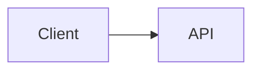

# Markdown Syntax Extension 設計

## 背景

このドキュメントは、統合 Markdown syntax extension PR の実装リファレンスをまとめたものです。
`origin/docs/tui-optimization-design` の TUI 最適化調査、特に以下を基にしています。

- `docs/design/tui-optimization/00-overview.md`
- `docs/design/tui-optimization/03-rendering-extensibility.md`
- `docs/design/tui-optimization/04-gemini-cli-research.md`
- `docs/design/tui-optimization/05-claude-code-research.md`
- `docs/design/tui-optimization/06-implementation-rollout-checklist.md`
- `docs/design/tui-optimization/08-execution-plan-and-test-matrix.md`

参照した調査では、AST パーサー、ブロック/トークンキャッシュ、安定プレフィックスストリーミング、
制限付き詳細パネル、ターミナル機能検出を中心とした長期的な Markdown アーキテクチャが推奨されています。
この最初の実装はランタイムのフットプリントを小さく保ちつつ、新しい動作をすぐに可視化します。

## 統合 PR のスコープ

この PR は Markdown syntax の拡張を、個別の機能 PR ではなく一つの統合されたレンダラー改善として扱います。

最初の実装に含まれる内容：

- Mermaid コードブロックが TUI 上でビジュアルレンダリングされる。
- イメージレンダリングが明示的に有効化され、`mmdc` が利用可能で、ターミナルがイメージパスをサポートしている場合、Mermaid ダイアグラムは PNG ターミナルイメージを通じてレンダリングされる。
- `flowchart` / `graph` Mermaid ダイアグラムはボックスと矢印のプレビューにフォールバックする。
- `sequenceDiagram` Mermaid ダイアグラムは参加者と矢印のプレビューにフォールバックする。
- 基本的な `classDiagram`、`stateDiagram`、`erDiagram`、`gantt`、`pie`、`journey`、`mindmap`、`gitGraph`、`requirementDiagram` ブロックは制限付きテキストプレビューにフォールバックする。
- テキストプレビューのない Mermaid タイプは元のフェンスコードソースにフォールバックし、ユーザーがダイアグラム定義を読んでコピーできるようにする。
- タスクリスト項目がチェック済み/未チェックのマーカーとしてレンダリングされる。
- ブロッククォートが引用バー付きでレンダリングされる。
- インライン `$...$` 数式とブロック `$$...$$` 数式が Unicode 置換によりレンダリングされる。
- 既存の Markdown テーブルは引き続き `TableRenderer` を使用する。
- 既存の Mermaid 以外のフェンスコードブロックは引き続き `CodeColorizer` を使用する。
- レンダリングされたビジュアルブロックは `/copy mermaid N`、`/copy latex N`、`/copy latex inline N`、rawモードを通じてソースにアクセスできる。
- `ui.renderMode` でセッションのレンダリングモードまたは raw/ソースモードの開始を制御し、`Alt/Option+M` でアクティブなセッションビューをトグルする。

## Mermaid レンダリング戦略

### 初版：機能ゲート付きイメージレンダリングとテキストフォールバック

実装では Mermaid 独自のレイアウトを優先パスとして扱います。ローカル環境がサポートしている場合、TUI は以下のパイプラインで Mermaid ブロックをレンダリングします。

```text
Mermaid source
  -> mmdc / Mermaid CLI
  -> PNG
  -> Kitty or iTerm2 terminal image protocol
```

ターミナルがインラインイメージをサポートしていないが `chafa` がインストールされている場合、同じ PNG が ANSI ブロックグラフィックとしてレンダリングされます。イメージプロトコルも `chafa` も利用できない場合、レンダラーは後述の同期ターミナルテキストプレビューにフォールバックします。

レスポンスのストリーミング中はイメージレンダリングは試行されません。ストリーミング中、Mermaid ブロックは制限付きのペンディングプレビューを表示します。レスポンスが確定した後、イメージパスは明示的に有効化された場合のみ試行されます。これにより、低速な `mmdc` の起動（特にオプトインの `npx` パス）がデフォルトのインタラクティブレンダリングパスに影響しないようにします。

PNG 生成はターミナル配置とは独立してキャッシュされます。同じ Mermaid ソースの繰り返しレンダリング（ターミナルのリサイズ更新を含む）では生成済みの PNG を再利用し、Kitty/iTerm2 の配置寸法の再計算のみを行います。

イメージパスは、ホット CLI パスから Puppeteer/Chromium をバンドルしたり呼び出したりしないよう、意図的にオプトインかつ機能ゲート方式にしています。ユーザーは `QWEN_CODE_MERMAID_IMAGE_RENDERING=1` でイメージパスを有効にし、`PATH` に `mmdc` をインストールするか `QWEN_CODE_MERMAID_MMD_CLI` にバイナリパスを設定することで `@mermaid-js/mermaid-cli` を提供できます。アドホックなローカル検証では、`QWEN_CODE_MERMAID_ALLOW_NPX=1` でレンダラーが `npx -y @mermaid-js/mermaid-cli@11.12.0` を呼び出せるようになります。初回実行時に Puppeteer/Chromium がインストールされレンダリングがブロックされる場合があるため、これは意図的にオプトインです。`QWEN_CODE_MERMAID_ALLOW_LOCAL_RENDERERS=1` が設定されていない限り、リポジトリローカルの `node_modules/.bin` レンダラーは自動検出されません。ターミナルプロトコルの選択は `QWEN_CODE_MERMAID_IMAGE_PROTOCOL=kitty|iterm2|off` で強制できます。

Ghostty などの Kitty 互換ターミナルでは、レンダラーはイメージペイロードを Ink テキストとして書き込む代わりに Kitty Unicode プレースホルダーを使用します。PNG は静音モード（`q=2`）かつ仮想配置（`U=1`）で生成の stdout を通じて送信され、React ツリーは各セルに明示的な行・列発音区分符号を付けた通常のプレースホルダー文字グリッド（`U+10EEEE`）をレンダリングします。これにより、APC ペイロードバイトが可視の base64 テキストにラップされるのを防ぎつつ、Ink がレイアウトとリサイズを担当し続けます。

### フォールバック：リサイズ可能なワイヤーフレームプレビュー

Ink の `<Static>` パスは追記専用のため、フォールバックは非同期処理を避けます。確定済みメッセージはバックグラウンドのレンダリングジョブを待ってから更新するという動作を、フル静的リフレッシュを強制せずに実現することができません。そのため、フォールバックは通常の React レンダリングパス中にターミナル出力を生成しなければなりません。

`flowchart` / `graph` ダイアグラムでは、フォールバックはエッジを一つずつ印刷する代わりに軽量なグラフモデルを構築します。

- ノードは Mermaid の id、ラベル、基本的な形状で正規化される。
- ノードラベルは Mermaid スタイルの `\n` / `<br>` 改行をサポートする。
- トップダウンダイアグラムは水平レイヤーにランク付けされる。
- 左から右のダイアグラムは収まる場合、垂直列にランク付けされる。
- 同じノードからの複数の出力エッジは `[Yes]`、`[No]`、`[是]`、`[否]` などの括弧付きエッジラベルを持つ一本のフォークとして描画される。
- 後退エッジとサイクルは明示的な `↩ to <node>` マーカーを持つ `Cycles:` セクションにまとめられる。これにより、ターミナルフォントでの不安定な長いクロスダイアグラムルートを避けつつ、ループセマンティクスを可視化する。
- グラフは `contentWidth` から再計算されるため、リサイズによりノードの幅、間隔、コネクタパスが変化する。
- 非常に大きな Mermaid ブロックがレンダリング時に無制限のターミナルキャンバスを割り当てないよう、大きなプレビューはグラフレイアウト前に制限される。

例：



これは Mermaid ソースではなく、ターミナルのビジュアルプレビューとしてレンダリングされます。

他の一般的な Mermaid ダイアグラムファミリーは、フルレイアウトエンジンではなく制限付きテキストサマリーを使用します：クラスの関係/メンバー、状態遷移、ER エンティティ/関係、Gantt タスク、円グラフのスライス、journey のステップ、mindmap ツリー、git graph エントリー、requirement ツリー。ダイアグラムタイプが不明またはプレビュー不可の場合、レンダラーはプレースホルダーの代わりに元のフェンス Mermaid ソースを表示するため、コンテンツはターミナルで読み取り可能かつ選択/コピー可能なままになります。レンダリングされた Mermaid の見出しには Mermaid 固有のコピーコマンド（例：`/copy mermaid 2`）も表示されるため、ビュー全体を raw モードに切り替えなくても元のダイアグラムソースを取得できます。

フォールバックはまだ完全な Mermaid エンジンではありません。高精度レンダリングが利用できない場合に、一般的な LLM 生成ダイアグラムに対する高速かつ依存関係の少ないプレビューレイヤーです。

### 将来のプロバイダー

プロバイダーの境界は、追加のネイティブイメージプロバイダーに対して意図的にオープンにしています。

- SVG/PNG 出力用の `mmdc` / `@mermaid-js/mermaid-cli`。
- Kitty/iTerm2 と ANSI フォールバック用の `terminal-image`。
- Sixel/Kitty/iTerm2/Unicode モザイク用の `chafa`（存在する場合）。

このパスはオプションでキャッシュされ、機能ゲート方式を維持し、キャッシュキーはソースハッシュ、ターミナル幅、レンダラープロバイダー、ターミナルプロトコルに基づきます。デフォルトでは起動をブロックしたり、バンドルされた Mermaid/Puppeteer の処理をホット TUI パスに追加したりしてはなりません。

## AST レンダラーの互換性

初版は既存のパーサーを拡張して影響範囲を最小化します。機能の境界は将来の `marked` トークンパイプラインとも互換性があります。

- `code(lang=mermaid)` -> `MermaidDiagram`
- `code(lang=*)` -> 既存の `CodeColorizer`
- `table` -> 既存の `TableRenderer`
- `blockquote` -> 引用ブロックレンダラー
- `list(task=true)` -> タスクリストレンダラー
- `paragraph/text` -> 数式/リンク/スタイルサポート付きインラインレンダラー

実装は React ノードをキャッシュしません。将来の AST レンダラーはトークン/ブロックをキャッシュし、現在の幅/テーマ/設定プロパティからレンダリングすべきです。

## 安全性とパフォーマンス

- Mermaid ソースは信頼されていない入力として扱われる。
- 初版のレンダラーは Mermaid の JavaScript を実行しない。
- ネイティブイメージレンダリングはオプトインまたは機能ゲート方式でなければならない。
- 将来のブラウザベースレンダリングはタイムアウトとサイズ制限を使用しなければならない。
- レンダリングは例外をスローする代わりにターミナルテキストに降格すべきである。
- 大きなブロックは利用可能な高さと幅を尊重すべきである。

## 検証

単体検証のターゲット：

```bash
cd packages/cli
npx vitest run \
  src/config/settingsSchema.test.ts \
  src/ui/AppContainer.test.tsx \
  src/ui/utils/MarkdownDisplay.test.tsx \
  src/ui/utils/mermaidImageRenderer.test.ts \
  src/ui/commands/copyCommand.test.ts \
  src/ui/components/BaseTextInput.test.tsx \
  src/ui/keyMatchers.test.ts \
  src/ui/contexts/KeypressContext.test.tsx
```

PR 提出前の広範な検証：

```bash
npm run build --workspace=packages/cli
npm run typecheck --workspace=packages/cli
npm run lint --workspace=packages/cli
git diff --check
```

ターミナルキャプチャ統合シナリオ：

```bash
npm run build && npm run bundle
cd integration-tests/terminal-capture
npm run capture:markdown-rendering
```

このシナリオは Markdown の多いモデルレスポンスをキャプチャし、`Alt/Option+M` で raw/ソースモードをトグルし、`/copy mermaid 1` と `/copy latex 1` でソースコピーフローを検証します。

手動シナリオ：

- Mermaid `flowchart LR` ブロックを含むアシスタントレスポンス。
- Mermaid `sequenceDiagram` ブロックを含むアシスタントレスポンス。
- 同じ回答内の Markdown テーブルと Mermaid。
- コードフォーマットが引き続き表示されるフェンス JavaScript コードブロック。
- 狭いターミナル幅。
- 制限されたツール/詳細サーフェス。
- `ui.renderMode: "raw"` でソース指向モードでセッションを開始する。
- `Alt/Option+M` で同じレスポンスをレンダリングモードと raw/ソースモードの間でトグルする。
- Mermaid と LaTeX のビジュアルブロックが実際の `/copy mermaid N` と `/copy latex N` のソース順にマッピングされるコピーヒントを表示する。
