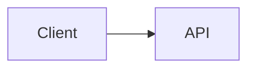

# Markdown 構文拡張の設計

## 背景

このドキュメントは、統合された Markdown 構文拡張 PR の実装リファレンスを保持します。これは `origin/docs/tui-optimization-design` の TUI 最適化研究に基づいており、特に以下のドキュメントを参照しています。

- `docs/design/tui-optimization/00-overview.md`
- `docs/design/tui-optimization/03-rendering-extensibility.md`
- `docs/design/tui-optimization/04-gemini-cli-research.md`
- `docs/design/tui-optimization/05-claude-code-research.md`
- `docs/design/tui-optimization/06-implementation-rollout-checklist.md`
- `docs/design/tui-optimization/08-execution-plan-and-test-matrix.md`

参照した研究では、AST パーサー、ブロック/トークンキャッシュ、安定プレフィックスストリーミング、境界付き詳細パネル、端末機能検出を中心とした長期的な Markdown アーキテクチャが推奨されています。この最初の実装では、実行時のフットプリントを小さく保ち、新しい動作をすぐに可視化します。

## 統合 PR の範囲

この PR は、Markdown 構文拡張を個別の機能 PR ではなく、1 つの一貫したレンダラー改善として扱います。

最初の実装に含まれるもの:

- Mermaid コードブロックが TUI 内で視覚的にレンダリングされます。
- Mermaid ダイアグラムは、画像レンダリングが明示的に有効化され、`mmdc` が利用可能で、端末が画像パスをサポートしている場合、PNG 端末画像としてレンダリングされます。
- `flowchart` / `graph` Mermaid ダイアグラムは、ボックス＆アロープレビューにフォールバックします。
- `sequenceDiagram` Mermaid ダイアグラムは、参加者-矢印プレビューにフォールバックします。
- 基本的な `classDiagram`、`stateDiagram`、`erDiagram`、`gantt`、`pie`、`journey`、`mindmap`、`gitGraph`、`requirementDiagram` ブロックは、境界付きテキストプレビューにフォールバックします。
- テキストプレビューのない Mermaid タイプは、元のフェンス付きソースにフォールバックし、ユーザーがダイアグラム定義を読み取り、コピーできるようにします。
- タスクリスト項目は、チェック済み/未チェックのマーカーをレンダリングします。
- ブロッククォートは、引用バーを表示してレンダリングします。
- インライン `$...$` 数式とブロック `$$...$$` 数式は、一般的な Unicode 置換を使用してレンダリングします。
- 既存の Markdown テーブルは引き続き `TableRenderer` を使用します。
- 既存の Mermaid 以外のフェンス付きコードブロックは引き続き `CodeColorizer` を使用します。
- レンダリングされた視覚ブロックのソースは、`/copy mermaid N`、`/copy latex N`、`/copy latex inline N`、および raw モードでアクセス可能です。
- `ui.renderMode` は、セッションがレンダリングモードと raw/ソースモードのどちらで開始されるかを制御し、`Alt/Option+M` でアクティブなセッションビューを切り替えます。

## Mermaid レンダリング戦略

### 最初のバージョン: 機能ゲート付き画像レンダリング + テキストフォールバック

実装では、Mermaid 自身のレイアウトを優先パスとして扱います。ローカル環境がサポートしている場合、TUI は以下のパイプラインで Mermaid ブロックをレンダリングします。

```text
Mermaid ソース
  -> mmdc / Mermaid CLI
  -> PNG
  -> Kitty または iTerm2 端末画像プロトコル
```

端末がインライン画像をサポートしていないが `chafa` がインストールされている場合、同じ PNG が ANSI ブロックグラフィックスとしてレンダリングされます。画像プロトコルも `chafa` も利用できない場合、レンダラーは以下で説明する同期端末テキストプレビューにフォールバックします。

画像レンダリングは、応答がストリーミング中には試行されません。ストリーミング中、Mermaid ブロックは境界付きの pending プレビューを表示します。応答が確定すると、明示的に有効化されている場合にのみ画像パスが試行されます。これにより、デフォルトのインタラクティブレンダリングパスから、特に opt-in の `npx` パスのような遅い `mmdc` 起動が除外されます。

PNG 生成は、端末の配置とは独立してキャッシュされます。同じ Mermaid ソースの繰り返しレンダリング（端末リサイズ更新を含む）は、生成された PNG を再利用し、Kitty/iTerm2 の配置ディメンションのみを再計算します。

画像パスは意図的に opt-in かつ機能ゲート付きであり、ホットな CLI パスに常に Puppeteer/Chromium をバンドルしたり呼び出したりすることはありません。ユーザーは `QWEN_CODE_MERMAID_IMAGE_RENDERING=1` で画像パスを有効にし、`PATH` に `mmdc` をインストールするか、`QWEN_CODE_MERMAID_MMD_CLI` にバイナリパスを設定することで `@mermaid-js/mermaid-cli` を提供できます。アドホックなローカル検証用には、`QWEN_CODE_MERMAID_ALLOW_NPX=1` によりレンダラーが `npx -y @mermaid-js/mermaid-cli@11.12.0` を呼び出すことができます。これは opt-in であり、最初の実行で Puppeteer/Chromium がインストールされてレンダリングがブロックされる可能性があるためです。リポジトリローカルの `node_modules/.bin` レンダラーは、`QWEN_CODE_MERMAID_ALLOW_LOCAL_RENDERERS=1` が設定されていない限り自動検出されません。端末プロトコルの選択は `QWEN_CODE_MERMAID_IMAGE_PROTOCOL=kitty|iterm2|off` で強制できます。

Ghostty などの Kitty 互換端末の場合、レンダラーは画像ペイロードを Ink テキストとして書き込む代わりに、Kitty Unicode プレースホルダーを使用します。PNG は、静音モード（`q=2`）で仮想配置（`U=1`）を使用して raw stdout を通じて送信され、React ツリーはセルごとに明示的な行と列の分音記号を持つ通常のプレースホルダー文字グリッド（`U+10EEEE`）をレンダリングします。これにより、APC ペイロードバイトが可視の base64 テキストにラップされるのを防ぎながら、Ink がレイアウトとリサイズを担当できるようにします。

### フォールバック: リサイズ可能なワイヤーフレームプレビュー

フォールバックは非同期処理を避けます。Ink の `<Static>` パスは追記専用であるため、確定済みのメッセージはバックグラウンドレンダリングジョブを待ってからその場で更新することができず、完全な静的リフレッシュを強制することになります。そのため、フォールバックは通常の React レンダリングパス中に端末出力を生成する必要があります。

`flowchart` / `graph` ダイアグラムの場合、フォールバックはエッジを 1 つずつ表示する代わりに、軽量なグラフモデルを構築します。

- ノードは Mermaid の id、ラベル、基本形状によって正規化されます。
- ノードラベルは Mermaid スタイルの `\n` / `<br>` 改行をサポートします。
- トップダウン図は水平レイヤーにランク付けされます。
- 左から右への図は、収まる場合に垂直列にランク付けされます。
- 同じノードからの複数の出力エッジは、`[Yes]`、`[No]`、`[是]`、`[否]` のようなブラケット付きエッジラベルを持つ 1 つのフォークとして描画されます。
- 戻りエッジとサイクルは、`Cycles:` セクションに明示的な `↩ to <node>` マーカーとともに要約されます。これにより、ループセマンティクスを可視化しつつ、端末フォントでの不安定で長いクロス図ルートを回避します。
- グラフは `contentWidth` から再計算されるため、リサイズによってノードの幅、間隔、コネクタパスが変更されます。
- 大きなプレビューはグラフレイアウトの前に境界付けられるため、非常に大きな Mermaid ブロックがレンダリング中に無制限の端末キャンバスを割り当てることはありません。

例:



は、Mermaid ソースではなく端末視覚プレビューとしてレンダリングされます。

その他の一般的な Mermaid ダイアグラムファミリーは、完全なレイアウトエンジンではなく、境界付きテキスト要約を使用します: クラスの関係/メンバー、状態遷移、ER エンティティ/リレーションシップ、Gantt タスク、円グラフスライス、ジャーニーステップ、マインドマップツリー、git グラフエントリ、要件ツリー。ダイアグラムタイプが不明またはプレビュー不可能な場合、レンダラーはプレースホルダーではなく元のフェンス付き Mermaid ソースを表示するため、端末でコンテンツを読み取り可能かつ選択/コピー可能に保ちます。また、レンダリングされた Mermaid 見出しには、Mermaid 固有のコピーコマンド（例: `/copy mermaid 2`）が表示されるため、ユーザーはビュー全体を raw モードに切り替えることなく、元のダイアグラムソースを取得できます。

このフォールバックは、依然として完全な Mermaid エンジンではありません。高忠実度レンダリングが利用できない場合に、一般的な LLM 生成ダイアグラム向けの高速で依存関係の軽いプレビューレイヤーです。

### 将来のプロバイダー

プロバイダーの境界は、追加のネイティブ画像プロバイダーに対して意図的に開かれています。

- SVG/PNG 出力用の `mmdc` / `@mermaid-js/mermaid-cli`。
- Kitty/iTerm2 および ANSI フォールバック用の `terminal-image`。
- 存在する場合の Sixel/Kitty/iTerm2/Unicode モザイク用の `chafa`。

このパスはオプション、キャッシュ、機能ゲート付きであるべきで、キャッシュキーはソースハッシュ、端末幅、レンダラープロバイダー、端末プロトコルに基づく必要があります。これは起動をブロックしたり、デフォルトでホットな TUI パスにバンドルされた Mermaid/Puppeteer 処理を追加したりしてはいけません。

## AST レンダラー互換性

最初のバージョンは、影響範囲を最小限に抑えるために既存のパーサーを拡張します。機能の境界は、将来の `marked` トークンパイプラインとの互換性を保っています。

- `code(lang=mermaid)` -> `MermaidDiagram`
- `code(lang=*)` -> 既存の `CodeColorizer`
- `table` -> 既存の `TableRenderer`
- `blockquote` -> 引用ブロックレンダラー
- `list(task=true)` -> タスクリストレンダラー
- `paragraph/text` -> 数式/リンク/スタイル対応のインラインレンダラー

この実装では React ノードをキャッシュしません。将来の AST レンダラーはトークン/ブロックをキャッシュし、現在の幅、テーマ、設定 props からレンダリングする必要があります。

## 安全性とパフォーマンス

- Mermaid ソースは信頼できない入力として扱われます。
- 最初のレンダラーは Mermaid JavaScript を実行しません。
- ネイティブ画像レンダリングは opt-in または機能ゲート付きでなければなりません。
- 将来のブラウザベースレンダリングは、タイムアウトとサイズ制限を使用する必要があります。
- レンダリングはエラーをスローする代わりに端末テキストに劣化する必要があります。
- 大きなブロックは利用可能な高さと幅を尊重する必要があります。

## 検証

対象を絞った単体検証:

```bash
cd packages/cli
npx vitest run \
  src/config/settingsSchema.test.ts \
  src/ui/AppContainer.test.tsx \
  src/ui/utils/MarkdownDisplay.test.tsx \
  src/ui/utils/mermaidImageRenderer.test.ts \
  src/ui/commands/copyCommand.test.ts \
  src/ui/components/BaseTextInput.test.tsx \
  src/ui/keyMatchers.test.ts \
  src/ui/contexts/KeypressContext.test.tsx
```

PR 提出前の広範囲な検証:

```bash
npm run build --workspace=packages/cli
npm run typecheck --workspace=packages/cli
npm run lint --workspace=packages/cli
git diff --check
```

端末キャプチャ統合シナリオ:

```bash
npm run build && npm run bundle
cd integration-tests/terminal-capture
npm run capture:markdown-rendering
```

このシナリオでは、Markdown が多いモデル応答をキャプチャし、`Alt/Option+M` で raw/ソースモードを切り替え、`/copy mermaid 1` および `/copy latex 1` で可視ソースコピーフローを検証します。

手動シナリオ:

- Mermaid `flowchart LR` ブロックを含むアシスタント応答。
- Mermaid `sequenceDiagram` ブロックを含むアシスタント応答。
- 同じ回答内の Markdown テーブルと Mermaid。
- フェンス付き JavaScript コードブロックがコードフォーマットを表示し続けること。
- 狭い端末幅。
- 制約されたツール/詳細画面。
- `ui.renderMode: "raw"` でソース指向モードでセッションを開始。
- `Alt/Option+M` で同じ応答をレンダリングモードと raw/ソースモード間で切り替え。
- Mermaid および LaTeX 視覚ブロックは、実際の `/copy mermaid N` および `/copy latex N` のソース順序に対応するコピーヒントを表示。