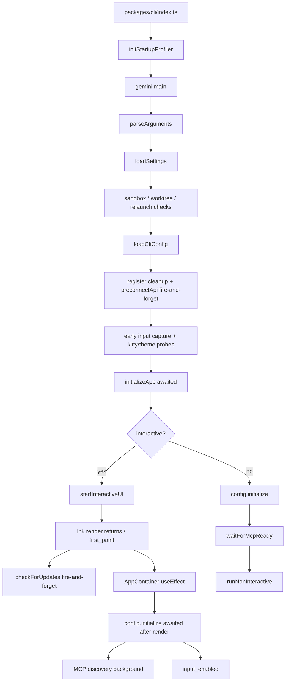
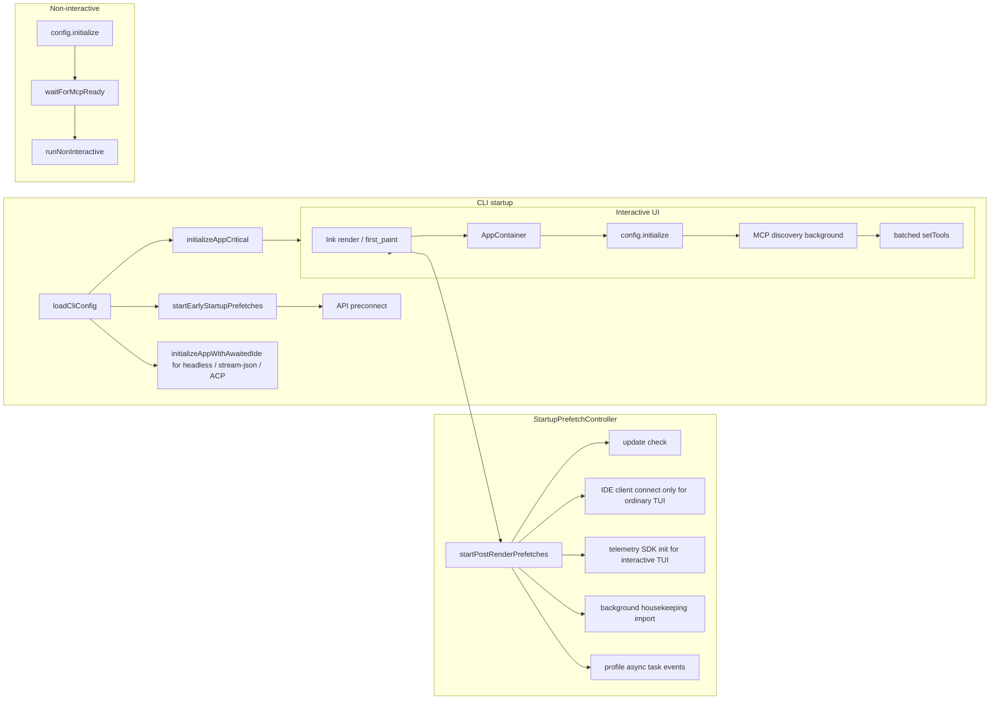
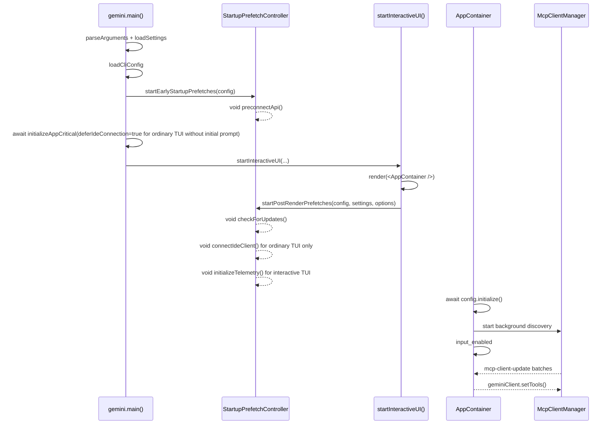

# Fire-and-Forget 起動プリフェッチ最適化設計

## 背景と目標

親 issue #3011 では、qwen-code の起動最適化を複数のサブタスクに分割しています。現在のリポジトリには、すでにいくつかの基盤機能が実装されています。

- #3219: 起動パフォーマンスプロファイラが統合され、`QWEN_CODE_PROFILE_STARTUP=1` をサポートして起動フェーズの JSON を出力します。
- #3221: ツール登録が lazy factory に変換され、`Config.initialize()` はすべてのツールを静的にインスタンス化しなくなりました。
- #3223: API の事前接続（preconnect）はすでに存在し、現在は `loadCliConfig()` の後に fire-and-forget 方式でトリガーされます。
- 早期の入力キャプチャ、プログレッシブな MCP 検出、および AppContainer レンダリング後の `config.initialize()` も部分的に実装されています。

#3222 の目標は、これらの機能を再実装することではなく、起動パスにまだ散在している重要度の低い起動操作を、統一された fire-and-forget プリフェッチレイヤーに統合することです。つまり、初回ペイント前は正確性に真に影響する操作のみを await し、初回ペイント後は最初のインタラクションの正確性に影響しないバックグラウンドタスクを起動します。同時に、非インタラクティブモードの互換性セマンティクスも維持します。

## 現在の起動フロー

現在のインタラクティブ起動パスの主要なフローは以下の通りです。



現状の評価:

- `initializeApp()` は、初回ペイント前に i18n、認証、テーマの検証、および IDE クライアント接続を引き続き直列に実行します。
- 認証と i18n は初回ペイント前に実行される必要があります。初期プロンプトなしのプレーンな TUI の場合、IDE 接続は初回ペイントの厳密な依存関係ではないため、プレーンな TUI パスでは遅延させることができます。ただし、`qwen -i "prompt"`、`qwen -p`、stream-json、および ACP/Zed などのパス（安全なレンダリング後のウィンドウがない、または最初のリクエストに IDE コンテキスト/ステータスが必要なパス）では、IDE 接続を引き続き最初のリクエスト前に await する必要があります。
- `checkForUpdates()` はすでに `startInteractiveUI()` 内でレンダリング後の fire-and-forget となっていますが、ロジックは UI 起動関数内に散在しています。
- `preconnectApi()` はすでに fire-and-forget であり、可能な限り早くトリガーするべきですが、統一されたスケジューリングの下に配置する必要があります。
- Telemetry SDK の初期化は以前、`Config` の構築中に同期的に発生していました。プレーンなインタラクティブ TUI の場合はレンダリング後に遅延させることができますが、非インタラクティブパスでは最初のリクエスト前の初期化セマンティクスを維持します。
- インタラクティブパスでは、`config.initialize()` はすでに React マウント後に実行されます。MCP 検出はすでに core 内でバックグラウンドで実行されており、AppContainer がツールリストを一括更新します。
- 非インタラクティブパスでは、引き続き `config.waitForMcpReady()` を await する必要があります。そうしないと、最初のプロンプトで MCP ツールが見えず、スクリプトの動作がリグレッションする可能性があります。

## 目標アーキテクチャ

「開始するが await しない」タスクを統一的に管理する、小規模な起動プリフェッチスケジューリングレイヤーを導入します。これはトリガータイミングによって early と post-render の 2 つのカテゴリに分割されます。



新しい設計におけるインタラクティブ起動シーケンス:



## 設計の変更点

### 1. 新しい統一起動プリフェッチスケジューラ

`packages/cli/src/startup/startup-prefetch.ts` を追加し、2 つのエントリーポイントを提供します。

```ts
startEarlyStartupPrefetches(config: Config): void;
startPostRenderPrefetches(
  config: Config,
  settings: LoadedSettings,
  options?: { connectIde?: boolean; initializeTelemetry?: boolean },
): void;
```

スケジューラは正確に 3 つのことを行います。

- 名前付きでプリフェッチタスクを起動します。
- `void task().catch(...)` を使用して、明示的に await せず、例外もスローしないようにします。
- デバッグログとプロファイラの非同期イベントを記録し、タスクがレンダリング前または後に起動されたかどうかを検証します。

スケジューラはフェーズごとに冪等性を保証し、React StrictMode、テストの繰り返し呼び出し、または異常な再エントリーによって同じタスクが複数回起動されるのを防ぐ必要があります。

### 2. Early Prefetch: 可能な限りの先行スタート

`startEarlyStartupPrefetches(config)` は、`loadCliConfig()` が成功した直後に呼び出されます。

第 1 フェーズでは API preconnect のみを含みます。

- `config.getModelsConfig()` から現在の認証タイプと解決済みのベース URL を読み取ります。
- `config.getProxy()` からプロキシを読み取ります。
- 既存の `preconnectApi(authType, { resolvedBaseUrl, proxy })` を呼び出します。
- 既存の環境ゲートを維持します。`QWEN_CODE_DISABLE_PRECONNECT`、サンドボックス、カスタム CA、非 Node ランタイム、プロキシなしなど。

これにより新しい設定オプションは追加されません。Preconnect の失敗はデバッグログに書き込まれるのみで、起動には影響しません。

### 3. Post-Render Prefetch: 初回ペイント後の起動

`startPostRenderPrefetches(config, settings)` は、Ink の `render()` が戻り、`first_paint` が記録された後に `startInteractiveUI()` 内で呼び出されます。

最初の一括処理には以下が含まれます。

- 更新チェック: 既存の `checkForUpdates().then(handleAutoUpdate)` ロジックを移行し、`settings.merged.general?.enableAutoUpdate !== false` ゲートを維持します。
- IDE クライアント接続: 初期プロンプトなしのプレーンなインタラクティブ TUI パスでのみ、post-render プリフェッチに移動します。呼び出し元は明示的に `connectIde: true` を渡す必要があり、スケジューラは内部的に引き続き `config.getIdeMode()` をチェックします。`qwen -i "prompt"`、非インタラクティブ、stream-json、および ACP/Zed は、このエントリーポイントを通じて IDE 接続を遅延させません。
- Telemetry SDK の初期化: インタラクティブ TUI パスでのみ、post-render プリフェッチに移動します。`Config` は引き続き Telemetry 設定を保持しますが、`deferTelemetryInitialization` を介して構築時の SDK 副作用をスキップします。post-render プリフェッチは `initializeTelemetry(config)` を介して SDK を起動します。非インタラクティブ、stream-json、および ACP/Zed は遅延させません。
- バックグラウンドのハウスキーピング: `gemini.tsx` から post-render プリフェッチに移行でき、すべてのバックグラウンド起動タスクに統一されたエントリーポイントを提供します。引き続きインタラクティブに限定され、動的インポートとエラーの握りつぶしを使用します。

これらのタスクはどれも `startInteractiveUI()` の戻り値に影響を与えてはならず、TUI の stderr にユーザーから見えるエラーを書き込んでもいけません。失敗はデバッグログにのみ記録されます。

### 4. initializeApp() のクリティカルパスの分割と、非 TUI の Await される IDE 接続の維持

TUI 遅延パスと非 TUI await パス間で IDE 接続ロジックが重複しないように、共有ヘルパーを追加します。

```ts
export async function connectIdeForStartup(config: Config): Promise<void> {
  if (!config.getIdeMode()) return;

  const ideClient = await IdeClient.getInstance();
  await ideClient.connect();
  logIdeConnection(config, new IdeConnectionEvent(IdeConnectionType.START));
}
```

`initializeApp()` は初回ペイント前のクリティカルな初期化として残りますが、明示的なオプションを追加します。

```ts
interface InitializeAppOptions {
  deferIdeConnection?: boolean;
}
```

デフォルトは後方互換性を維持する必要があります。`deferIdeConnection` のデフォルトは `false` です。つまり、オプションが渡されない場合、IDE 接続は引き続き `initializeApp()` 内で await されます。

`initializeApp()` で await される内容は以下のようになります。

- `initializeI18n(...)`
- `performInitialAuth(...)`
- `validateTheme(settings)`
- `deferIdeConnection !== true` の場合、`await connectIdeForStartup(config)`
- `shouldOpenAuthDialog` の計算
- `config.getGeminiMdFileCount()` の読み取り

`gemini.tsx` 内の呼び出し元は、実行モードに基づいて選択する責任を負います。

```ts
const deferIdeConnection =
  config.isInteractive() && !config.getExperimentalZedIntegration() && !input;

const initializationResult = await initializeApp(config, settings, {
  deferIdeConnection,
});
```

その後、`deferIdeConnection === true` の場合にのみ、`startInteractiveUI()` は `startPostRenderPrefetches(..., { connectIde: true })` を介して IDE 接続を fire-and-forget します。最初の問題を自動送信する prompt-interactive は、レンダリング前に IDE を await し続け、レンダリング後の重複接続を避けるために `connectIde: false` を渡します。

この分割は、レビューで指摘された互換性リスクに対処します。

- プレーンなインタラクティブ TUI: IDE ソケット/IPC 接続が初回ペイントをブロックしなくなります。
- `qwen -i "prompt"`: 最初に自動送信されるリクエストの前に IDE 接続を await し続け、レンダリング後は再接続しません。
- `qwen -p` / piped stdin: 最初のモデルリクエストの前に IDE 接続を await し続けます。
- stream-json: セッション/コントロールリクエストの処理前に IDE 接続を完了させ続けます。
- ACP/Zed: await される IDE 起動を維持し、最初のリクエストで IDE コンテキスト/ステータスが欠落するのを回避します。

### 5. MCP と非インタラクティブセマンティクスは変更なし

この設計では、コアの MCP ステートマシンを変更しません。

インタラクティブ:

- `AppContainer` のマウントエフェクトで `config.initialize()` を呼び出し続けます。
- `Config.initialize()` はバックグラウンドでの MCP 検出を起動し続けます。
- AppContainer は `mcp-client-update` をリッスンし続け、約 16ms 間隔で `geminiClient.setTools()` をバッチ呼び出しします。
- 初回ペイントと入力の可用性は、MCP が完全に解決されるのを待ちません。

非インタラクティブ / stream-json / ACP:

- 最初のモデルリクエストの前に IDE 接続を await し続けます。
- 最初のモデルリクエストの前に `config.waitForMcpReady()` を await し続けます。
- 古い同期パスのツール可視性セマンティクスを維持します。
- MCP 失敗時の stderr 警告の既存の動作を維持します。

## 想定されるパフォーマンス向上

向上点は 2 つのカテゴリに分類されます。

1 つ目は、初回ペイント前のクリティカルパスの短縮です。

- プレーンなインタラクティブ TUI の IDE クライアント接続が初回ペイントをブロックしなくなりました。向上度は IDE ソケット/IPC 接続時間に依存し、数十から数百ミリ秒と予想されます。
- プレーンなインタラクティブ TUI の Telemetry SDK 初期化が初回ペイントをブロックしなくなりました。向上度は OTel SDK/エクスポーターの構築コストに依存し、通常は小規模から中規模な同期的な起動オーバーヘッドとなります。
- 更新チェック、ハウスキーピング、preconnect などのタスクに統一された fire-and-forget エントリーポイントが提供され、将来のメンテナンスで誤ってこれらが await パスに配置されるのを防ぎます。
2つ目は、最初のAPIリクエストによるメリットです。

- #3223 の API preconnect 設計を継続して維持します。
- プロキシ/共有ディスパッチャーが再利用可能な場合、最初のAPIリクエストで TCP+TLS ハンドシェイクのコスト（想定 100〜200ms）を回避できます。

注: #3219 の過去のベースラインでは、モジュールの読み込みが起動時間の約94%を占めていましたが、#3221 の遅延ツール登録（lazy tool registration）により、すでに最大のボトルネックは解消されています。#3222 の主なメリットは、すべてのモジュール読み込みコストを排除することではなく、体感上の TTI（Time to Interactive）とファーストペイントの応答性を向上させることです。

## リスクと影響範囲

### リスク

- プレーンな TUI における IDE 機能が「ファーストペイント前に接続」から「ファーストペイントの直後に接続」へ移行する可能性があります。緩和策: プレーンな対話型 TUI パスでのみ遅延させ、非対話型、stream-json、および ACP/Zed では最初のリクエスト前に接続を待機する状態を維持します。
- SDK がまだ初期化されていない場合、プレレンダーのテレメトリエベントが no-op として破棄される可能性があります。緩和策: 対話型 TUI でのみ遅延させ、非対話型の最初のリクエスト前のテレメトリは元のセマンティクスを維持し、新しいバッファリングキューは追加しません。
- 遅延タスクの失敗が目立たなくなる可能性があります。緩和策: 統一されたラッパーがデバッグログとプロファイラーの非同期イベントを記録します。
- update/preconnect の移行時に、既存のゲートが意図せず変更される可能性があります。緩和策: 既存の設定/環境条件をそのまま維持します。
- 過度な遅延により、最初のユーザー入力がそれらに依存している場合に、機能が準備できていない状態になる可能性があります。緩和策: 認証、設定の構築、権限、フック、メモリ、ツールレジストリ、および非対話型の MCP 準備はすべて引き続き待機します。

### 影響範囲

CLI の起動層のみが対象となる想定です。

- `packages/cli/src/startup/startup-prefetch.ts`
- `packages/cli/src/core/initializer.ts`
- `packages/cli/src/gemini.tsx`
- `packages/cli/src/ui/startInteractiveUI.tsx`
- 対応するユニットテスト

変更なし:

- CLI 引数と設定スキーマ
- コアツールレジストリプロトコル
- MCP 検出ステートマシン
- モデルリクエストプロトコル
- ユーザーから見えるコマンドの動作

## ユニットテスト計画

### `packages/cli/src/startup/startup-prefetch.test.ts`

カバレッジ:

- `startEarlyStartupPrefetches()` は、認証タイプ、解決済みのベース URL、およびプロキシを指定して `preconnectApi()` を呼び出します。
- 早期プリフェッチはタスクの完了を待機しません。
- 繰り返し呼び出しは冪等であり、同じ早期タスクを再度起動することはありません。
- `startPostRenderPrefetches()` は、`enableAutoUpdate !== false` の場合に更新チェックを起動します。
- `enableAutoUpdate === false` の場合は更新チェックを起動しません。
- `options.connectIde === true` かつ `config.getIdeMode() === true` の場合に IDE 接続を起動し、`logIdeConnection()` を呼び出します。
- `options.connectIde !== true` の場合は IDE 接続をトリガーしません。
- `options.connectIde === true` であっても、`config.getIdeMode() === false` の場合は IDE 接続をトリガーしません。
- `options.initializeTelemetry === true` の場合にテレメトリ SDK の初期化を起動します。
- `options.initializeTelemetry !== true` の場合はテレメトリ SDK の初期化をトリガーしません。
- 遅延タスクの拒否（rejections）はパブリック API がスローする原因とはならず、デバッグログの書き込みのみ行われます。

### `packages/cli/src/core/initializer.test.ts`

調整と追加:

- `initializeApp()` はデフォルトで `connectIdeForStartup()` を待機し、非 TUI パスの互換性を維持します。
- `initializeApp(..., { deferIdeConnection: true })` は `IdeClient.getInstance()` や `connect()` を呼び出しません。
- `initializeApp(..., { deferIdeConnection: false })` は、`config.getIdeMode() === true` の場合に IDE 接続を呼び出して待機します。
- `initializeI18n()` は引き続き待機します。
- `performInitialAuth()` は引き続き待機します。
- 認証失敗時には、`authError` と `shouldOpenAuthDialog === true` を保持します。
- テーマの検証失敗時には、`themeError` を保持します。
- 認証タイプが明示的に指定され、認証が成功した場合、`shouldOpenAuthDialog === false` となります。

### `packages/cli/src/ui/startInteractiveUI.test.tsx`

カバレッジ:

- Ink の `render()` が戻り、`first_paint` が記録された後、`startPostRenderPrefetches(config, settings)` を呼び出します。
- プレーンな TUI パスは `{ connectIde: true, initializeTelemetry: true }` を渡します。
- prompt-interactive がレンダリング前にすでに IDE を待機している場合は、IDE の重複接続を避けるために `{ connectIde: false, initializeTelemetry: true }` を渡します。
- 非 TUI パスは、`startInteractiveUI()` を介して IDE/テレメトリのポストレンダープリフェッチをトリガーしません。
- ポストレンダープリフェッチの拒否（rejections）は、`startInteractiveUI()` が拒否する原因とはなりません。
- 更新チェックが `startInteractiveUI()` のインラインロジックから移動された後、それは直接呼び出されなくなります。

### `packages/cli/src/gemini.test.tsx`

調整と追加:

- プレーンな対話型 TUI は `initializeApp(config, settings, { deferIdeConnection: true })` を呼び出し、ポストレンダープリフェッチで IDE に接続します。
- prompt-interactive は `initializeApp(config, settings, { deferIdeConnection: false })` を呼び出し、ポストレンダープリフェッチでは IDE に再接続しません。
- `qwen -p` / piped stdin / stream-json は `initializeApp(config, settings, { deferIdeConnection: false })` を呼び出すかデフォルトを使用し、最初のリクエスト前に IDE が接続されることを保証します。
- ACP/Zed パスは IDE の遅延プリフェッチを有効にせず、待機を伴う IDE 起動を継続します。

### `packages/core/src/config/config.test.ts`

カバレッジ:

- テレメトリが有効で、かつ `deferTelemetryInitialization` が渡されていない場合、`Config` の構築時に引き続き `initializeTelemetry(config)` が呼び出されます。
- テレメトリが有効で、かつ `deferTelemetryInitialization === true` の場合、`Config` の構築時に `initializeTelemetry(config)` は呼び出されませんが、`config.getTelemetryEnabled()` は引き続き true を返します。

### 回帰テスト

推奨される実行コマンド:

```bash
cd packages/cli && npx vitest run src/core/initializer.test.ts src/startup/startup-prefetch.test.ts
cd packages/cli && npx vitest run src/gemini.test.tsx
cd packages/core && npx vitest run src/config/config.test.ts -t "telemetry"
```

## 受け入れ基準

- 対話型 REPL のファーストペイントは、IDE 接続、テレメトリ初期化、更新チェック、またはハウスキーピングを待機しません。
- 非対話型、stream-json、および ACP/Zed は、引き続き最初のリクエスト前に IDE 接続を待機します。
- 非対話型、stream-json、および ACP/Zed はテレメトリ SDK の初期化を遅延させません。
- API preconnect は引き続き、`loadCliConfig()` の後にできるだけ早く fire-and-forget（投げっぱなし）で実行されます。
- 認証、設定、権限、フック、メモリ、およびその他の正確性が重要な初期化は、必要に応じて引き続き待機されます。
- 非対話型の最初のプロンプトは、引き続き MCP の準備完了を待機します。
- すべての遅延タスクの失敗は REPL のレンダリングに影響を与えません。
- プロファイラーは、first_paint 周辺で遅延タスクが期待通りに起動されていることを示します。
- ユニットテストは、重要なパス、冪等性、エラーの飲み込み（error swallowing）、および非対話型の互換性制約をカバーします。

## デフォルトの前提条件

- #3221 は実際には GitHub の issue であり、PR ではありません。現在のリポジトリにはすでに遅延ツールレジストリの実装が含まれています。
- この設計では新しい設定オプションを追加せず、起動の最適化をユーザーが設定可能な複雑な仕組みに変えることを避けています。
- 「遅延操作が完了する前に REPL がレンダリングされる」とは、Ink のファーストペイントの戻りと入力が利用可能になることを意味し、ユーザーが UI を目にする前にすべてのバックグラウンド機能が完了している必要はありません。
- 非対話型モードは互換性を優先し、対話型モードほど積極的にはファーストペイントの最適化を追求しません。