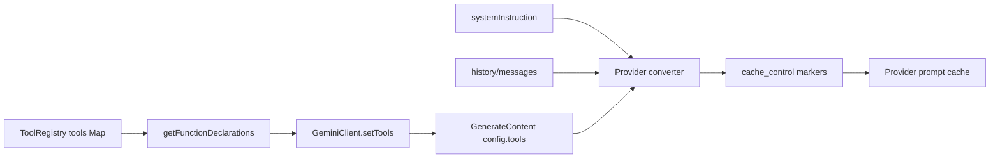
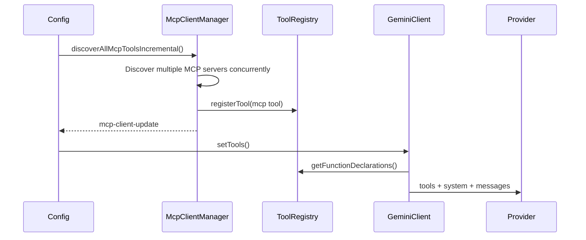

# グローバルツールスキーマの安定ソート設計

## 背景

Qwen Code はすでに Anthropic および DashScope のリクエスト変換レイヤーで `cache_control` をサポートしています。プロバイダーがプロンプトキャッシュをサポートしている場合、安定したリクエストプレフィックスをキャッシュして再利用できるため、繰り返しの入力トークンコストを削減し、TTFT を短縮できます。

現在のメインプレフィックスは以下の3つの部分で構成されています。

1. ツールスキーマ: `ToolRegistry.getFunctionDeclarations()` によって生成されるツール宣言。
2. システム指示: メインセッションのシステムプロンプト。
3. メッセージ/履歴: 起動時のプレリュード、ユーザーメッセージ、ツール結果、および関連するコンテキスト。

ツールスキーマはしばしば大きく、プロバイダーキャッシュのプレフィックスの前方に配置されます。ツール配列のシリアライズされたバイト列が変更されると、後続のシステムおよびメッセージのプレフィックスも再利用できなくなる可能性があります。

現在、`GeminiClient.setTools()` は `ToolRegistry.getFunctionDeclarations()` の戻り値を直接使用しており、`getFunctionDeclarations()` は `Map` の挿入順でツールをイテレートします。組み込みツールの登録順は通常安定していますが、段階的な MCP 検出、ToolSearch による公開、MCP の再接続、および外部ツールの登録により、同じツールセットが異なる順序でシリアライズされる可能性があります。これにより、不要なプロンプトキャッシュミスが発生します。

## 目標

ツールスキーマのグローバルな安定ソートを実装します。モデルリクエストに送信される `functionDeclarations` は、登録完了順序に関係なく、同じツールセットに対して安定した順序を持つ必要があります。

この設計は、ツールセットが同一であるにもかかわらず順序が異なるために発生するキャッシュミスのみに対処します。ツールの追加、削除、またはスキーマコンテンツの変更は引き続きプレフィックスを変更します。これらは正当なキャッシュミスです。

この設計には以下の機能は含まれません。

- システムプロンプトのブロック化。
- セッションレベルのツールスキーマのスナップショット/キャッシュ。
- プロンプトキャッシュ破壊検出の完全な実装。
- プロバイダーの `cache_control` ポリシーの変更。

## 現在のフロー



段階的な MCP 検出は、順序の変更が最も頻繁に発生する原因です。



2つの MCP サーバーが最終的に利用可能になっても、異なる順序で確定した場合、現在のツールブロックは異なる可能性があります。

```text
Run 1:
[
  read_file,
  shell,
  mcp__filesystem__read_tree,
  mcp__github__search_issues
]

Run 2:
[
  read_file,
  shell,
  mcp__github__search_issues,
  mcp__filesystem__read_tree
]
```

モデルの機能という観点では、両方の実行で同じツールセットが公開されます。しかし、プロンプトキャッシュの観点では、これらは異なるツールプレフィックスとなります。

ソート後、同じセットは以下のように安定します。

```text
[
  mcp__filesystem__read_tree,
  mcp__github__search_issues,
  read_file,
  shell
]
```

## プロンプトキャッシュの役割とヒット/ミスの違い

プロンプトキャッシュにより、プロバイダーは安定したプレフィックスに対する KV/キャッシュ計算を再利用できます。長いツールリスト、長いシステムプロンプト、および長い履歴プレフィックスの場合、キャッシュヒットには通常2つの利点があります。

- 入力トークンコストの削減: キャッシュされたプレフィックスはキャッシュ読み取りの課金パスに入ります。
- TTFT の短縮: プロバイダーは完全なプレフィックスを再処理する必要がありません。

ヒット前:

```text
request bytes changed
-> tools/system/messages prefix cannot be reused
-> cache_read_input_tokens is low or 0
-> the full prefix is counted again as input/cache creation
-> TTFT is higher
```

ヒット後:

```text
stable prefix bytes unchanged
-> tools/system/messages prefix is reused from provider cache
-> cache_read_input_tokens increases
-> only the new tail content is counted as input/cache creation
-> TTFT is lower
```

この設計は、ツール配列の順序を安定させることでヒット率を向上させます。特に、段階的な MCP 検出や ToolSearch による公開によって引き起こされる登録順序の変動に対して効果的です。

## 設計

ソートは `ToolRegistry.getFunctionDeclarations()` に実装すべきです。なぜなら、ここが現在の API ツール宣言の唯一の生成ポイントだからです。プロバイダーコンバーターでソートしないでください。他の宣言リーダーが不安定なままになるからです。`GeminiClient.setTools()` だけでソートしないでください。診断、コンテキスト推定、およびテストでソートされていない宣言が観測される可能性があるからです。

ソートルール:

1. まず、既存のフィルタリングロジックを適用します。
   - デフォルトでは、`shouldDefer && !alwaysLoad && !revealedDeferred` のツールを除外します。
   - `{ includeDeferred: true }` は遅延ツールを含めます。
   - `alwaysLoad` ツールは常に可視です。
2. フィルタリングされたツールインスタンスをソートします。
3. `tool.schema.name ?? tool.name` をプライマリソートキーとして使用します。
4. `tool.displayName` をタイブレーカーとして使用します。
5. ソートされた `tool.schema` の値を返します。

疑似コード:

```ts
getFunctionDeclarations(options?: { includeDeferred?: boolean }) {
  const includeDeferred = options?.includeDeferred === true;
  return Array.from(this.tools.values())
    .filter((tool) => {
      if (
        !includeDeferred &&
        tool.shouldDefer &&
        !tool.alwaysLoad &&
        !this.revealedDeferred.has(tool.name)
      ) {
        return false;
      }
      return true;
    })
    .sort(compareToolsByDeclarationName)
    .map((tool) => tool.schema);
}
```

比較関数はローカルかつシンプルに保ちます。設定は追加しないでください。

```ts
function compareToolsByDeclarationName(
  a: AnyDeclarativeTool,
  b: AnyDeclarativeTool,
) {
  const aName = a.schema.name ?? a.name;
  const bName = b.schema.name ?? b.name;
  const byName = aName.localeCompare(bName);
  if (byName !== 0) return byName;
  return a.displayName.localeCompare(b.displayName);
}
```

登録順序を暗黙的なランキングとして保持しないでください。ツールの順序はモデルの優先度を表現するものではありません。モデルは名前、説明、スキーマ、およびコンテキストに基づいてツールを選択するべきです。

## テスト計画

`packages/core/src/tools/tool-registry.test.ts` にテストを追加または更新します。

### 1. 通常ツールを正規名でソート

登録順序:

```text
zeta, alpha, middle
```

アサーション:

```text
getFunctionDeclarations().map(name) === [alpha, middle, zeta]
```

### 2. ソート前に遅延ツールをフィルタリング

登録:

```text
visible-z
hidden-a (shouldDefer)
visible-a
```

デフォルトのアサーション:

```text
[visible-a, visible-z]
```

### 3. includeDeferred ですべてのツールを含めてソート

上記と同じツールを使用し、以下を呼び出します。

```ts
getFunctionDeclarations({ includeDeferred: true });
```

アサーション:

```text
[hidden-a, visible-a, visible-z]
```

### 4. 公開された遅延ツールはソートされた位置に表示される

登録:

```text
visible-m
hidden-a (shouldDefer)
visible-z
```

実行:

```ts
toolRegistry.revealDeferredTool('hidden-a');
```

アサーション:

```text
[hidden-a, visible-m, visible-z]
```

### 5. alwaysLoad の遅延ツールは可視かつソートされたままになる

登録:

```text
z (shouldDefer, alwaysLoad)
a
```

デフォルトのアサーション:

```text
[a, z]
```

### 6. MCP ツールの登録順序は異なるが出力は一致する

2つの `ToolRegistry` インスタンスを作成します。

```text
registryA registration order:
  mcp__github__search_issues
  mcp__filesystem__read_tree

registryB registration order:
  mcp__filesystem__read_tree
  mcp__github__search_issues
```

アサーション:

```text
registryA.getFunctionDeclarations().map(name)
  === registryB.getFunctionDeclarations().map(name)
```

### 7. 古いアサーションの更新

登録順序に依存している既存のテストは、代わりにソートされた順序に依存するように更新する必要があります。たとえば、`['visible']` だけをアサーションする遅延フィルタリングテストはそのままにしておくことができます。ただし、将来複数の可視ツールを登録する場合は、ソートされた配列をアサーションする必要があります。

推奨される検証コマンド:

```bash
cd packages/core && npx vitest run src/tools/tool-registry.test.ts
cd packages/core && npx vitest run src/tools/tool-search.test.ts
cd packages/core && npx vitest run src/core/client.test.ts
npm run build && npm run typecheck
```

## リスクと制約

- ツールの順序変更は、モデルの暗黙的な選択優先度に影響を与える可能性があります。ツールの順序は製品セマンティクスであるべきではないため、このリスクは許容されます。安定したキャッシュプレフィックスの方が優先度が高くなります。
- この設計は、新規追加されたツールによって引き起こされるキャッシュミスを防ぐものではありません。新しい MCP サーバーツール、ツールスキーマコンテンツの変更、および新しいツールの ToolSearch による公開は、引き続き正当にツールブロックを変更します。
- 将来プロバイダーがツールの登録セマンティクスを保持する必要がある場合は、プロバイダーレイヤーで処理する必要があります。現在のコードにはそのような要件はありません。

## 次のステップ: プロンプトキャッシュ破壊検出

グローバルソートが実装されたら、次のステップとして、ソートの利点を検証し、残りのキャッシュミスを特定するために、軽量なプロンプトキャッシュ破壊検出を実装する必要があります。

以下の2つのフェーズで実装します。

1. 各リクエストの前にスナップショットを記録します。
   - モデル。
   - システム指示のハッシュ。
   - `functionDeclaration` の名前とスキーマのハッシュ。
   - キャッシュ制御の有効/スコープ。
2. 各レスポンスの後に使用量を読み取ります。
   - `cache_read_input_tokens`。
   - `cache_creation_input_tokens`。
   - OpenAI/DashScope/Gemini からの互換性のあるキャッシュトークンメタデータ。

キャッシュ読み取りが前のターンから大幅に減少した場合、デバッグログまたはテレメトリイベントを出力します。

```text
prompt_cache_break:
  reason: tools_order_changed | tools_schema_changed | system_changed |
          cache_control_changed | model_changed | likely_provider_ttl_or_eviction
  previousCacheReadTokens
  currentCacheReadTokens
  changedToolNames
```

最初のバージョンは観測のみを行い、リクエストの動作を変更してはなりません。その目標は、以下の2つの質問に答えることです。

1. グローバルツールソートは、ツール順序のキャッシュミスを削減するか？
2. 残りのキャッシュミスは主に、システムテキスト、ツールスキーマコンテンツ、`cache_control`、またはプロバイダーの TTL/エビクションに起因するか？