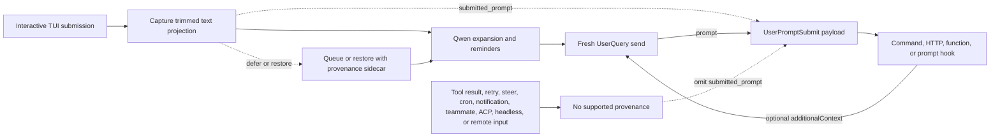

# `UserPromptSubmit` の提出済みプロンプト provenance

## サマリー

`UserPromptSubmit.prompt` は、現在のモデル呼び出しのためのプロンプトである。これには Qwen が生成したリマインダー、展開されたファイルやリソース、スラッシュコマンドの出力、拡張機能の出力、または先行するフックが追加したコンテキストが含まれ得る。そのため、別の問い — サポートされているインタラクティブな入力境界をどのテキスト射影が通過したか — には信頼して答えられない。

この変更は、オプションの `submitted_prompt` フィールドを追加する:

```ts
interface UserPromptSubmitInput {
  prompt: string;
  submitted_prompt?: string;
}
```

このフィールドは、Qwen がサポートされているインタラクティブ TUI の提出から新規の `UserQuery` まで provenance を運べる場合のみ設定される。ユーザーが提出したテキストを必要とするコンシューマーは、フィールドの欠落を利用不可として扱わなければならず、`prompt` にフォールバックしてはならない。

この変更は、`UserPromptSubmit` が発火するタイミング、既存の `prompt` の値、フックの順序やブロッキング、`additionalContext` の動作を変更しない。

## 目標と非目標

目標:

- サポートされているインタラクティブ TUI を通じて提出されたテキストを、Qwen が展開する前に保存する。
- そのテキストを、遅延および復元された提出を通じて、間違ったモデルリクエストに関連付けることなく運ぶ。
- 前方互換の JSON を受け付けるコンシューマーを壊さずにフィールドを追加する。
- すべてのデータの受け手と信頼境界を明示する。

非目標:

- `UserPromptSubmit` のトリガーセマンティクスの変更。
- モデル宛てのコンテンツから元のプロンプトを推論すること。
- この変更で ACP、ヘッドレス、リモート、SDK、その他の入力生成元をサポートすること。
- 認証、テナント識別、DLP、または不変のセキュリティラベルの提供。
- 外部コンテキストのリコールの実装。

## データフロー



キューはレンダリングのために引き続きテキスト指向である。provenance は内部 sidecar を通じて関連付けられ、キューに入れられたテキストが新規のターンになるときのみ消費される。曖昧な変換、部分的なバッチ、または編集された復元は、`submitted_prompt` を省略することで fail closed（失敗時は拒否）となる。

大容量貼り付けのプレースホルダーは `submitted_prompt` でもコンパクトなままとなる。その全内容はモデル宛ての `prompt` にのみ展開される。これにより TUI の射影が保たれ、数メガバイトの貼り付け内容がすべてのフックペイロードで重複することを避けられる。

キャンセル時の復元は、並行する `/btw` のサイド質問が実行されている場合、メインターンの所有権を保持する。そのサイド質問がより新しいユーザーエントリをディスク履歴に書き込み得るため、キャンセルはメインターンがまだ排他的に所有している場合のみ、最後にログされたエントリを削除する。この結合により、復元された provenance の sidecar と永続履歴が整合し、あるターンを復元しながら別のターンを削除することがなくなる。

## 対象条件

| パス                                                                               | `prompt`                   | `submitted_prompt`                               | ルール                                            |
| ---------------------------------------------------------------------------------- | -------------------------- | ------------------------------------------------ | ----------------------------------------------- |
| `UserQuery` として送信される新規のインタラクティブ TUI 提出                               | 既存のモデル宛ての値 | 存在する                                          | 展開前にトリムされた射影を捕捉する |
| 後で新規ターンになる遅延された TUI 提出                            | 既存のモデル宛ての値 | 完全な provenance がある場合のみ存在する            | キューに入っている間 sidecar を保持する               |
| 正確なキャンセルまたはキューの復元に続く再送信                   | 既存のモデル宛ての値 | 復元されたテキストが変わらない場合のみ存在する | sidecar は正確な復元にのみ再利用する |
| 編集された、または部分的にしか判明していない復元入力                                           | 既存のモデル宛ての値 | 存在しない                                           | provenance を推測しない                         |
| プロンプト、コマンド、シェル履歴のナビゲーション、または選択された検索マッチ              | 既存のモデル宛ての値 | 存在しない                                           | 履歴には生成された展開が含まれ得る        |
| 再起動をまたぐ stash から復元されたプロンプト                                       | 既存のモデル宛ての値 | 存在しない                                           | stash は provenance なしでテキストを保存する        |
| 会話の rewind によって復元されたプロンプト                                             | 既存のモデル宛ての値 | 存在しない                                           | rewind の履歴はモデル宛てのテキストのみを保存する     |
| 同一ターン内の steering 入力                                                           | 既存の動作          | 存在しない                                           | steering は新規のサポートされた提出ではない    |
| ツール結果またはフックによる継続                                                   | 既存の動作          | 存在しない                                           | レガシーの継続動作を維持する           |
| リトライ、cron、通知、またはチームメイトのトラフィック                                     | 既存の動作          | 存在しない                                           | 既存のトリガー動作を維持する              |
| 設定された `--prompt-interactive` の初期プロンプト                                   | 既存のモデル宛ての値 | 存在しない                                           | インタラクティブな入力境界を通過していない |
| Vim モード有効中に存在する非空の入力（Vim 無効化後を含む） | 既存のモデル宛ての値 | 存在しない                                           | Vim のレジスタは provenance を運ばない           |
| ACP、ヘッドレス、`serve`、SDK、リモート入力、または受け入れられた speculation の入力           | 既存の動作          | 存在しない                                           | この変更では生成元を追加しない             |

復元された、または provenance の利用できないモデル宛て入力がクリアまたは提出されると、TUI は、後続の入力が対象条件になり得る前に、テキストバッファーの undo/redo 履歴を破棄する。これにより、provenance マーカーまたは sidecar が消費された後に undo がモデル宛てのテキストを復元してしまうことを防ぐ。

Vim 有効中に存在する非空の入力は、composer がクリアされるまで、Vim 無効化後も対象外のままである。この保守的なルールは、Vim を有効にする前に入力された下書きもカバーする。Vim のレジスタはバッファークリアをまたいでモデル宛てのテキストを保持し得るため、モードの変更では既存のコンテンツの provenance を回復できない。

この表は provenance のみを定義する。既存のイベントトリガーは変更されず、`UserPromptSubmit` を発火させないパスも含まれる。

## 不変条件

1. Core は、サポートされている生成元からの非空文字列を運ぶ新規の `UserQuery` に対してのみ `submitted_prompt` をシリアライズする。
2. 値は Core が受け取ったまま保持される。Core はトリム、再構築、`prompt` からの導出を行わない。
3. 逐次の `additionalContext` 更新は `prompt` を拡張し得るが、`submitted_prompt` を書き換えない。
4. 再帰的および機械駆動の送信は provenance をクリアする。
5. キューに入れられたバッチは、含まれるすべてのアイテムが互換の provenance を持つ場合のみ帰属される。そうでなければバッチはフィールドを省略する。
6. 復元された sidecar は一度限りであり、正確な再送信にのみ適用される。
7. provenance の欠落はエラーではなく通常の状態である。

## 互換性と移行

フックの JSON 契約は前方拡張可能である。デコーダーは未知のフィールドを無視すべきである。未知のフィールドを意図的に拒否するコンシューマー（例: `additionalProperties: false` の JSON Schema）は、アップグレード前にオプションの `submitted_prompt` プロパティを明示的に許可しなければならない。セキュリティ上重要なフックでは、厳格なデコーダーの失敗により、呼び出しが fail open（失敗時は許可）になるか fail closed（失敗時は拒否）になるかが変わり得るため、管理者はロールアウト前に、アップグレードされたペイロードをデプロイ済みのフックでテストしなければならない。

`prompt` のみを読み取る既存のコンシューマーは、現在の動作を維持する。出所に依存するコンシューマーは `submitted_prompt` を読み取り、欠落時にはスキップ、ユーザーへの問い合わせ、または文書化されたフォールバックポリシーの適用を行うべきである。`prompt` を元のユーザーテキストとして暗黙に使用することは、安全なフォールバックではない。

## 信頼とデータの境界

`submitted_prompt` は、呼び出し元が提供する provenance である。認証された識別情報、認可の決定、リポジトリとの結び付き、DLP の結果ではない。ローカルの Qwen プロセスとサポートされている TUI 生成元からの信頼を継承し、新しい信頼境界を確立しない。特に、function フックはインプロセスのオブジェクトを受け取るため、信頼されたコードとして扱わなければならない。本設計はそのようなフックに対するランタイムの不変性を主張しない。

設定されたすべてのフックエグゼキューターがイベントペイロードを受け取る:

| フック種別 | 受け手                                                 |
| --------- | --------------------------------------------------------- |
| コマンド   | 標準入力を通じた子プロセス                      |
| HTTP      | POST ボディを通じた設定済みエンドポイント                 |
| function  | 信頼されたインプロセスのコールバック                               |
| プロンプト    | `$ARGUMENTS` 置換後の設定済みモデルプロバイダー |

オペレーターは `prompt` と `submitted_prompt` の両方を機微である可能性があるものとして扱わなければならない。プロンプトフックはペイロードをモデルプロバイダーに送信する。ファイルベースのデバッグログは完全に展開されたプロンプトフックのリクエストを記録するため、その保持とアクセス制御は提出されたデータに見合ったものでなければならない。フックはまた、入力を自身の出力、エラー、ログ、または下流システムにコピーし得る。それらの宛先は本フィールドの保証の範囲外である。

両方のフィールドが存在する場合、プロンプトフックのペイロードには重複するテキストが含まれ、追加のモデル入力のトークンを消費し得る。この契約はフックごとのフィールド抑制を提供しない。

フック呼び出しのテレメトリーは、現在、完全な入力ではなくフックのメタデータをエクスポートしているが、その実装詳細はプライバシー境界ではなく、コンシューマーはそれに依存すべきではない。

## Claude Code と異なる理由

Claude Code は、制御がモデルクエリループに入る前のユーザー提出境界で `UserPromptSubmit` を実行する。ツール結果の再帰はその境界を通過しないため、既存の `prompt` がそのまま提出された入力を表す。

Qwen Code は、共有のモデル送信パイプラインにより近い場所でフックを実行し、より多くの送信パスにまたがってレガシーの動作を維持している。イベントを移動することは、より広範で破壊的なセマンティクスの変更となる。付加的な provenance フィールドは、既存の統合を保ちながら、サポートされている TUI の呼び出し元に欠落していた境界のシグナルを与える。

## 検証

ユニットテストは、Core のシリアライズゲート、フックのチェーン、TUI の捕捉、大容量貼り付けの射影、遅延キュー、正確なおよび編集された復元、provenance のクリア、不完全なバッチをカバーする。インタラクティブな E2E カバレッジは実際のコマンドフックペイロードを捕捉し、展開が `submitted_prompt` を変えずに `prompt` を変更し得ること、およびツール結果による継続がフィールドを省略することを確認する。
