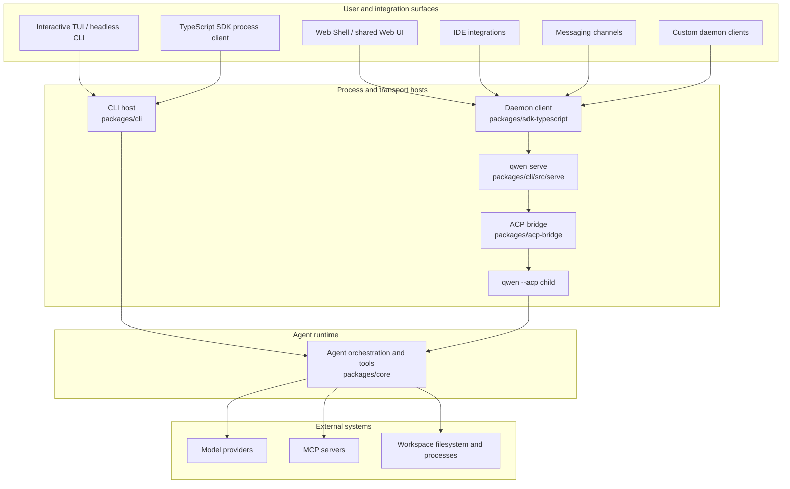

# Qwen Code アーキテクチャ概要

Qwen Code はモノレポであり、インタラクティブターミナル、ヘッドレスおよびプログラマティック実行、Agent Client Protocol (ACP)、長時間稼働する HTTP デーモン、Web および IDE クライアント、メッセージングチャネルアダプターをサポートしています。このドキュメントでは、それらのインターフェースとそれらを実装するパッケージをマッピングし、主要なランタイム境界を説明します。

デーモンの詳細な内部構造については、まず [デーモン ドキュメント](./daemon/00-index.md) を参照してください。HTTP リクエストとイベントの形状については、[`qwen serve` プロトコルリファレンス](./qwen-serve-protocol.md) を参照してください。

## システムの全体像

Qwen Code には 2 つのエージェント実行モデルがあります。

- **直接実行:** インタラクティブ TUI とヘッドレス CLI がエージェントランタイムを直接構築して実行します。
- **ACP 実行:** `qwen --acp` は ACP トランスポートの背後でエージェントをホストします。ACP クライアントが直接駆動することも、`qwen serve` が共有 ACP ブリッジを介して駆動することもあります。

`qwen serve` は ACP 実行の周りに HTTP + Server-Sent Events (SSE) 制御プレーンを追加し、複数のクライアントが長時間稼働するワークスペーススコープのランタイムを使用できるようにします。

この図は主要な本番パスを示しています。一部のアダプターにはスタンドアロンモードもあります。たとえば、`qwen channel start` は HTTP デーモンを必要とせずに ACP ブリッジを使用します。これらのバリアントについては [チャネルプラグインガイド](./channel-plugins.md#runtime-modes) を参照してください。

## リポジトリ構成

| パス                                                                                                       | 責務                                                                                                                                                                                   |
| ---------------------------------------------------------------------------------------------------------- | ------------------------------------------------------------------------------------------------------------------------------------------------------------------------------------------------ |
| `packages/cli`                                                                                             | `qwen` 実行ファイル、引数パーシング、設定アセンブリ、Ink TUI、ヘッドレス出力、ACP エントリーポイント、`qwen serve`、およびコマンド固有のアダプター。                                         |
| `packages/core`                                                                                            | UI に依存しないエージェントオーケストレーション、モデルプロバイダー統合、プロンプトとコンテキストの構築、ツールの登録と実行、権限、セッション、メモリ、テレメトリ、および共有サービス。 |
| `packages/acp-bridge`                                                                                      | ACP チャネルライフサイクル、セッション多重化、イベント配信、権限調停、プロセス生成、およびデーモンとアダプターホストで共有されるファイルシステムの継ぎ目。                                 |
| `packages/sdk-typescript`                                                                                  | `query()` を通じたプログラマティックなプロセス実行、および `qwen serve` 用の HTTP/SSE クライアントとトランスクリプト投影。                                                                               |
| `packages/webui`                                                                                           | 共有 React コンポーネントと、TypeScript SDK 上に構築されたデーモン React アダプター。                                                                                                                |
| `packages/web-shell`                                                                                       | `packages/webui` とデーモン SDK 上に構築されたターミナルスタイルのブラウザ UI。                                                                                                                      |
| `packages/web-templates`                                                                                   | 埋め込み可能な JavaScript と CSS 文字列としてパッケージ化された Web テンプレート。                                                                                                                                 |
| `packages/audio-capture`                                                                                   | 音声入力用のネイティブマイクキャプチャ。                                                                                                                                                       |
| `packages/channels`                                                                                        | 共有チャネルランタイムとメッセージングサービス用のプラットフォームアダプター。                                                                                                                         |
| `packages/desktop`、`packages/vscode-ide-companion`、`packages/chrome-extension`、`packages/zed-extension` | Qwen Code をホスト環境に適応させる製品およびエディターインターフェース。                                                                                                                     |
| `packages/sdk-java`、`packages/sdk-python`                                                                 | 言語固有のプログラマティッククライアント。                                                                                                                                                          |
| `packages/cua-driver`、`packages/mobile-mcp`                                                               | MCP 互換の境界を通じて公開されるコンピューター使用およびモバイルデバイス統合。                                                                                                           |
| `integration-tests`                                                                                        | CLI、インタラクティブ、SDK、サンドボックス、フック、およびターミナル動作のエンドツーエンドカバレッジ。                                                                                                             |
| `docs` および `docs-site`                                                                                     | ユーザー、開発者、プロトコル、および設計ドキュメント、ならびにドキュメントサイト。                                                                                                                 |
| `scripts`                                                                                                  | ビルド、パッケージング、リリース、バリデーション、およびリポジトリメンテナンスの自動化。                                                                                                                    |

ほとんどのコードは `packages/` 下の npm ワークスペースに存在します。パッケージは、そのパッケージのソースツリーへの相対パスではなく、宣言された公開エクスポートを通じて他のパッケージに依存する必要があります。

## パッケージ境界

### CLI とプレゼンテーションサーフェス

`packages/cli` は実行ファイルを所有し、コマンドライン引数からランタイムモードを選択します。ユーザーとワークスペースの設定をロードし、コア設定を構築し、必要に応じてリクエストされたサンドボックスに入り、インタラクティブ、ヘッドレス、ACP、デーモン、チャネル、またはメンテナンスフローのいずれかを開始します。

プレゼンテーションはコアランタイムの外に留まります。

- Ink TUI はローカルのインタラクティブセッションをレンダリングします。
- `packages/webui` はデーモン状態を React プロバイダーとフックに適応させます。
- `packages/web-shell` はブラウザターミナル体験を提供します。
- IDE とチャネルパッケージは、ホスト固有のイベントを共有クライアントまたはブリッジ契約に変換します。

### コアランタイム

`packages/core` はエージェントループを所有します。モデルリクエストを構築し、会話コンテキストを維持し、ツール呼び出しをディスパッチし、権限ポリシーを適用し、アクティブなホストに構造化イベントと結果を返します。組み込みツールは、ファイル操作、シェル実行、検索、プランニング、Web アクセス、メモリ、スキル、およびサブエージェントをカバーします。MCP は、ランタイムを特定の統合に結合することなく、ツールとリソースのサーフェスを拡張します。

コアパッケージは、結果の表示方法やリモートクライアントのトランスポート方法を決定しません。それらの決定は CLI、ブリッジ、SDK、および UI レイヤーに属します。

### ACP ブリッジ

`packages/acp-bridge` はホストプロセスを ACP エージェントランタイムに接続します。主な責務は次のとおりです。

- ACP チャネルの生成またはアタッチ。
- セッションとクライアントの多重化。
- プロンプト、キャンセル、および ACP 通知の転送。
- 権限リクエストの調停。
- 有界セッションイベントストリームの公開。
- ワークスペースファイルシステムインターフェースのホストへの提供。

ブリッジは、本番環境では実際の `qwen --acp` 子プロセスを使用し、テストではインメモリチャネルを使用できます。公開エントリーポイントについては [`@qwen-code/acp-bridge` README](../../packages/acp-bridge/README.md) を参照してください。

### SDK と UI アダプター

TypeScript SDK は 2 つのクライアントスタイルを公開します。

- `query()` はプログラマティックなローカル使用のために Qwen Code プロセスを開始および制御します。
- デーモンクライアントは HTTP と SSE を介して `qwen serve` と通信します。

`packages/webui` はデーモンクライアント上に React 状態レイヤーを構築し、`packages/web-shell` はその状態レイヤー上にブラウザ UI を構築します。IDE 統合やデーモン管理チャネルを含む他のクライアントも、サーバー実装コードをインポートする代わりに、同じ SDK とイベント契約を再利用します。

## ランタイムフロー

### 直接 CLI フロー

1. CLI が引数を解析し、ユーザー、ワークスペース、環境、およびコマンドライン設定を解決します。
2. サンディングを準備し、コアランタイム設定を構築します。
3. コアランタイムがモデルリクエストを構築し、エージェント/ツールループに入ります。
4. ツール呼び出しが権限ポリシーに対してチェックされ、アクティブなワークスペース環境で実行されます。
5. CLI が TUI でインクリメンタルイベントをレンダリングするか、ヘッドレス出力用にシリアライズします。

### デーモンフロー

1. クライアントは TypeScript SDK またはドキュメント化された HTTP API を使用して `qwen serve` に接続します。
2. デーモンがリクエストを認証し、要求された操作を所有するワークスペースを解決します。
3. ワークスペースランタイムは、エージェント操作を ACP ブリッジを通じて `qwen --acp` 子プロセスに転送します。
4. 子プロセスは直接実行と同じコアエージェントとツールロジックを実行します。
5. レスポンスと通知がブリッジを通じて戻り、セッションイベントが SSE を介してクライアントに配信されます。

マルチワークスペースセッションが有効になっている場合、各ライブワークスペースランタイムは独自のブリッジと ACP 子プロセスを所有します。ファイルシステムアクセス、環境オーバーレイ、MCP トランスポート、セッション、および障害処理は、その解決されたランタイムにスコープされたままです。[デーモンアーキテクチャ](./daemon/01-architecture.md) にプロセストポロジー、信頼境界、イベントリプレイ、およびライフサイクルの詳細が記載されています。

## 拡張ポイント

Qwen Code は複数のレイヤーで拡張できます。

- **MCP サーバー** はコアランタイムにツール、プロンプト、およびリソースを追加します。
- **拡張機能とスキル** は、再利用可能なコマンド、設定、およびエージェントの動作をパッケージ化します。
- **チャネルプラグイン** はメッセージングプラットフォームを共有チャネルランタイムに適応させます。
- **SDK クライアント** はカスタムのローカルまたはデーモンバックのアプリケーションを構築します。
- **UI アダプター** は共有デーモンイベントをホスト固有の状態とプレゼンテーションに投影します。

プラットフォーム固有の関心事はアダプター内に保持してください。共有エージェントの動作はコアランタイムに属し、トランスポートとワイヤーの動作は ACP ブリッジ、SDK、またはデーモンホストに属します。

## 設定と状態

CLI は、ランタイムを構築する前に、コマンドライン引数、環境変数、ユーザー設定、ワークスペース設定、およびデフォルトから効果的な設定をアセンブルします。コアは解決済みの設定を受け取り、プレゼンテーション固有の入力を直接読み取りません。サポートされている設定とそのスコープについては [設定](../users/configuration/settings.md) を参照してください。

直接セッションは共有コアサービスを通じて履歴とメタデータを永続化します。デーモンモードでは、デーモンが所有ワークスペースを解決し、ワークスペースおよびセッションスコープの操作をクライアントに公開します。ACP 子プロセスはライブエージェント実行の所有者であり続けます。

## 次のステップ

- [デーモン開発者ドキュメント](./daemon/00-index.md)
- [`qwen serve` HTTP プロトコル](./qwen-serve-protocol.md)
- [TypeScript SDK](../../packages/sdk-typescript/README.md)
- [ACP ブリッジ](../../packages/acp-bridge/README.md)
- [チャネルプラグイン開発者ガイド](./channel-plugins.md)
- [ツール開発](./tools/introduction.md)
- [統合テスト](./development/integration-tests.md)
