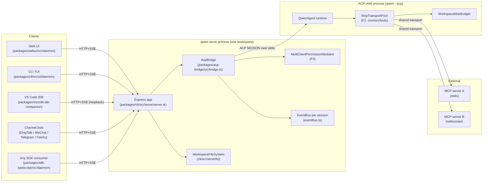
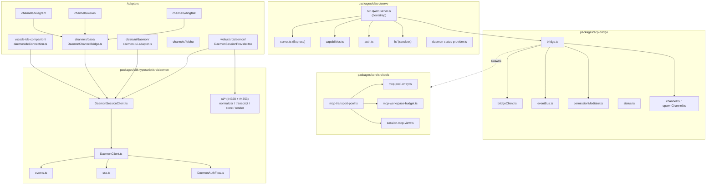
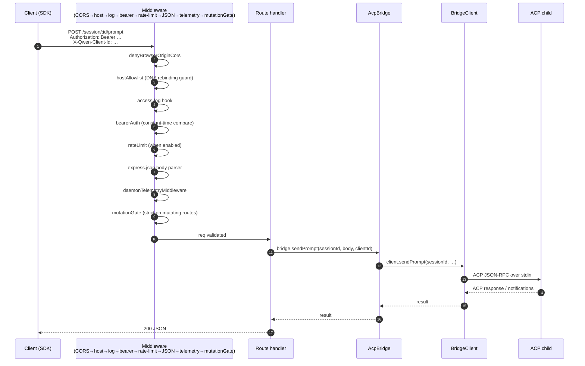
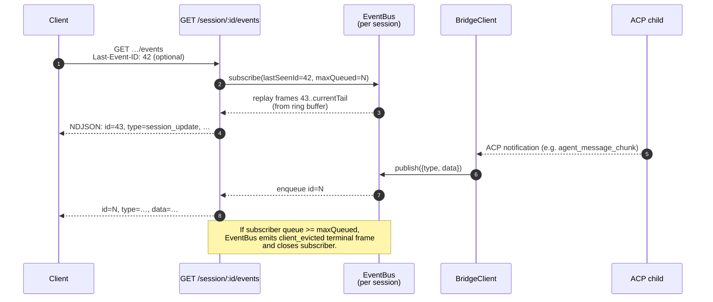
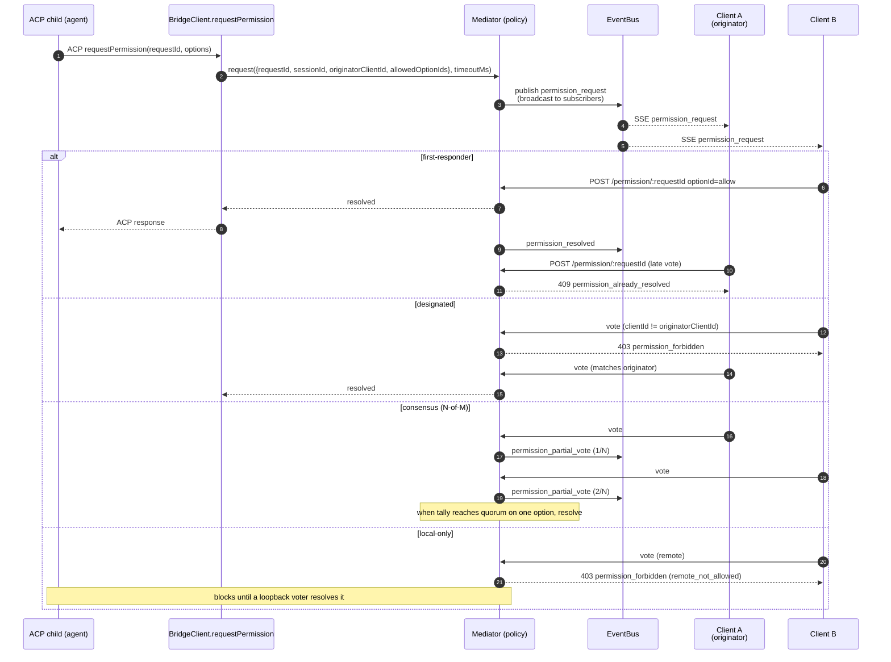
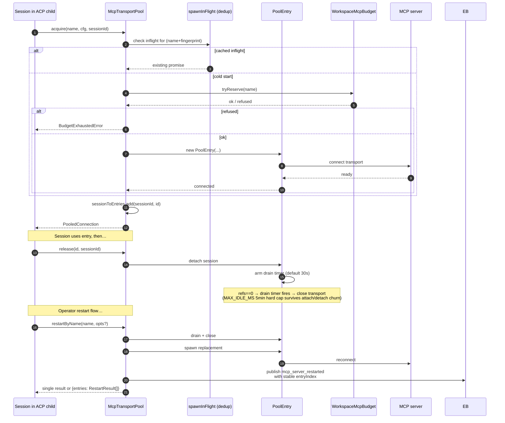
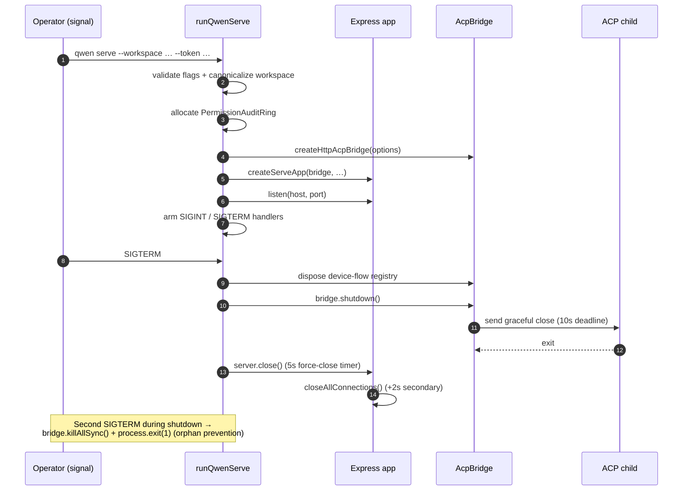

# デーモンアーキテクチャ

## 概要

`qwen serve` プロセスは **1 デーモン = 1 ワークスペース** です。単一の Express HTTP サーバーをホストし、`@qwen-code/acp-bridge` インスタンスを所有し、実際のエージェントランタイムを実行する 1 つの ACP 子プロセス (`qwen --acp`) を生成します。複数のクライアント（CLI TUI、IDE コンパニオン、IM チャネルボット、Web BFF、カスタムスクリプト）は HTTP + SSE を介して接続し、1 つの ACP セッションを共有するか（`sessionScope: 'single'`、デフォルト）、会話スレッドごとにセッションを分割します（`sessionScope: 'thread'`）。

ACP 子プロセス内では、MCP サーバーは `McpTransportPool`（F2）によってワークスペース全体で共有されます。つまり、（サーバー名 + 設定フィンガープリント）のタプルは、それを検出するセッションの数に関係なく、1 つの MCP トランスポートにマッピングされます。ブリッジの `MultiClientPermissionMediator`（F3）は、4 つのポリシーのいずれかの下で、接続されたすべてのクライアント間の権限投票を調整します。

このドキュメントは、このドキュメントセットの残り部分が基盤とする**システムレベルの全体像**を示します。各重要なフローは Mermaid シーケンス図で示され、コンポーネントごとの実装の詳細は他の 18 のドキュメントに記載されています。

## プロセストポロジ

デーモンプロセスと ACP 子プロセスは `AcpChannel`（デフォルト: 実際の子プロセスの stdio パイプペア、テストでは `inMemoryChannel`）で接続されています。デーモンが行うすべてのことは、この分割によって形作られます。HTTP と SSE のトラフィックはデーモンで終端し、エージェントの決定とツール呼び出しは子プロセスで発生し、ブリッジが両者を接続します。

## パッケージマップ

3 つの信頼境界が重要です: HTTP エッジ（`serve/auth.ts` ミドルウェアチェーン）、ブリッジから ACP 子プロセスへの境界（stdio 上の NDJSON、認証なし、子プロセスはブリッジを暗黙的に信頼）、エージェントから MCP サーバーへの境界（エージェントはホストに触れるツールを呼び出す可能性があります）。

## ワークフロー 1: HTTP リクエストのライフサイクル

非ストリーミングルート（prompt、cancel、model switch、metadata、workspace CRUD）は、単一の JSON 応答として終了します。ストリーミング出力は、この接続上のチャンク化された HTTP ボディ**ではなく**、SSE チャネル上でアウトオブバンドで配信されます。ワークフロー 2 を参照してください。

## ワークフロー 2: SSE イベント配信とリプレイ

リングバッファは有限です（`eventRingSize`、デフォルト 8000）。`Last-Event-ID` がリングの先頭より古い再接続クライアントは、合成されたキャッチアップ信号を受け取り、`loadSession` / `resumeSession` を呼び出してより深い状態を再構築する必要があります。低速クライアントは、キューフィル率 75% で `slow_client_warning` を、上限に達すると `client_evicted` をトリガーします。

## ワークフロー 3: マルチクライアント権限調整

ポリシー間エスケープハッチ: どのクライアントも `CANCEL_VOTE_SENTINEL` に投票することで、リクエストを `cancelled / agent_cancelled` としてショートサーキットできます。ブリッジは、ワイヤー呼び出し元が通常の `optionId` フィールドを介してセンチネルを注入することを防ぎます（`InvalidPermissionOptionError`）。

## ワークフロー 4: MCP トランスポートプールの取得/解放/再起動

`releaseSession(sessionId)` は逆方向の `sessionToEntries` インデックスを使用して、セッションが保持しているすべてのエントリを O(refs) で解放します。デーモンシャットダウン時には、`drainAll()` が `draining` フラグを設定し（新しい取得を拒否）、設定可能なタイムアウト下で全てのエントリがクローズするのを待ちます。

## ワークフロー 5: ライフサイクル — 起動とグレースフルシャットダウン

二段階シャットダウンが重要なのは、インフライトの HTTP リクエスト、インフライトの SSE サブスクライバ、および ACP 子プロセス内のインフライトのツール呼び出しすべてに、制限された終了ウィンドウが必要だからです。これらのデッドラインを超えて何かがブロックされると、強制クローズパスが引き継がれ、スタックした子プロセスがデーモンプロセスを生かし続けるのを防ぎます。

## 主要ファイル

| 関心事                   | ファイル                                                       |
| ----------------------- | -------------------------------------------------------------- |
| ブートストラップ          | `packages/cli/src/serve/run-qwen-serve.ts`                      |
| Express アプリ           | `packages/cli/src/serve/server.ts`                              |
| 機能レジストリ            | `packages/cli/src/serve/capabilities.ts`                        |
| 認証ミドルウェア          | `packages/cli/src/serve/auth.ts`                                |
| ブリッジ                 | `packages/acp-bridge/src/bridge.ts`                              |
| BridgeClient            | `packages/acp-bridge/src/bridgeClient.ts`                        |
| 権限メディエーター        | `packages/acp-bridge/src/permissionMediator.ts`                  |
| EventBus                | `packages/acp-bridge/src/eventBus.ts`                            |
| MCP トランスポートプール  | `packages/core/src/tools/mcp-transport-pool.ts`                  |
| ワークスペース MCP 予算   | `packages/core/src/tools/mcp-workspace-budget.ts`                |
| ワークスペース FS        | `packages/cli/src/serve/fs/`                                    |
| SDK DaemonClient        | `packages/sdk-typescript/src/daemon/DaemonClient.ts`             |
| SDK SessionClient       | `packages/sdk-typescript/src/daemon/DaemonSessionClient.ts`      |
| イベントスキーマ          | `packages/sdk-typescript/src/daemon/events.ts`                   |

## 参考文献

- 設計イシュー: [#3803](https://github.com/QwenLM/qwen-code/issues/3803)（デーモン設計）、[#4175](https://github.com/QwenLM/qwen-code/issues/4175)（F シリーズマイルストーン）
- ユーザーガイド: [`../../users/qwen-serve.md`](../../users/qwen-serve.md)
- ワイヤープロトコルリファレンス: [`../qwen-serve-protocol.md`](../qwen-serve-protocol.md)
- F2 設計文書: [`../../design/f2-mcp-transport-pool.md`](../../design/f2-mcp-transport-pool.md)
- F2 設計ノート: イシュー [#4175](https://github.com/QwenLM/qwen-code/issues/4175) コミット 4-6