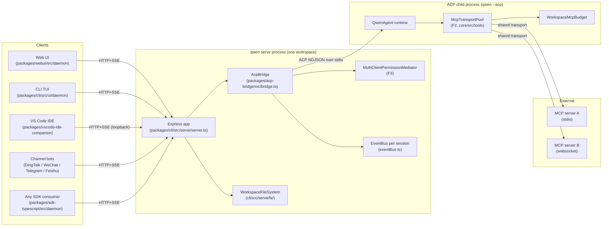
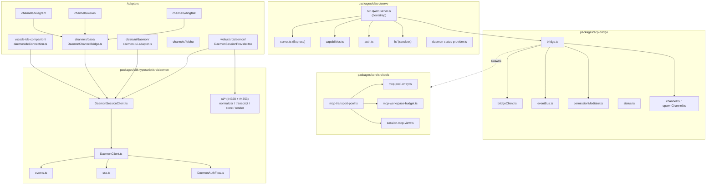
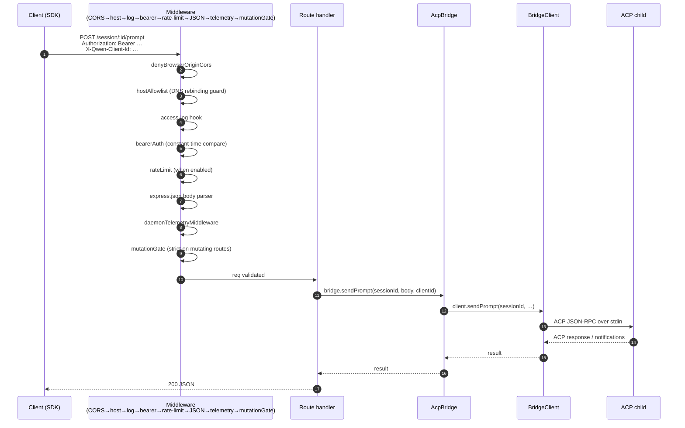
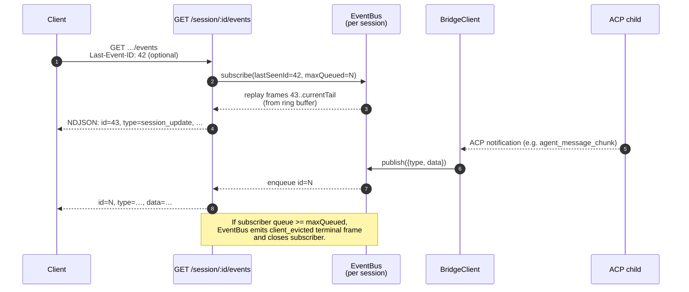
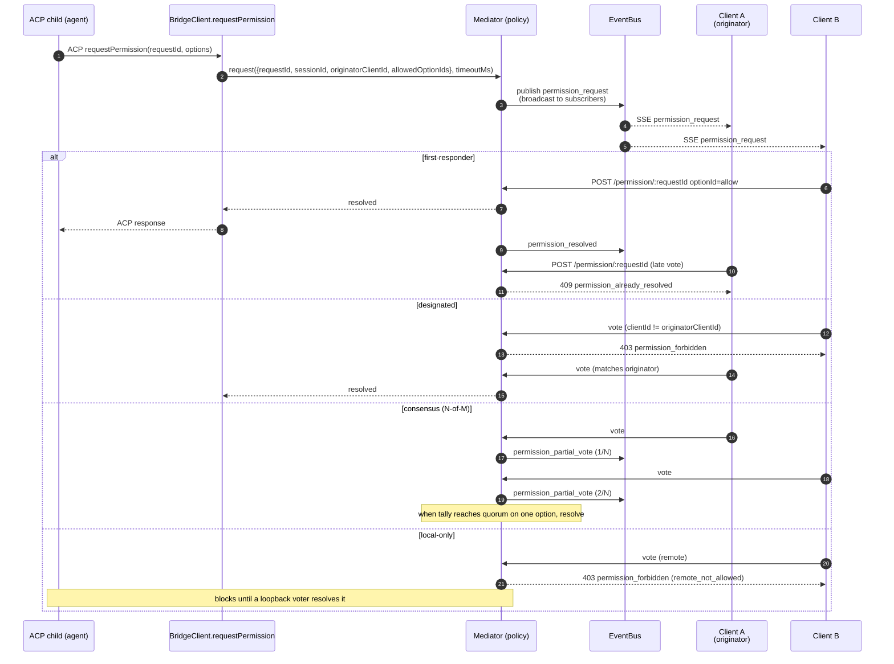
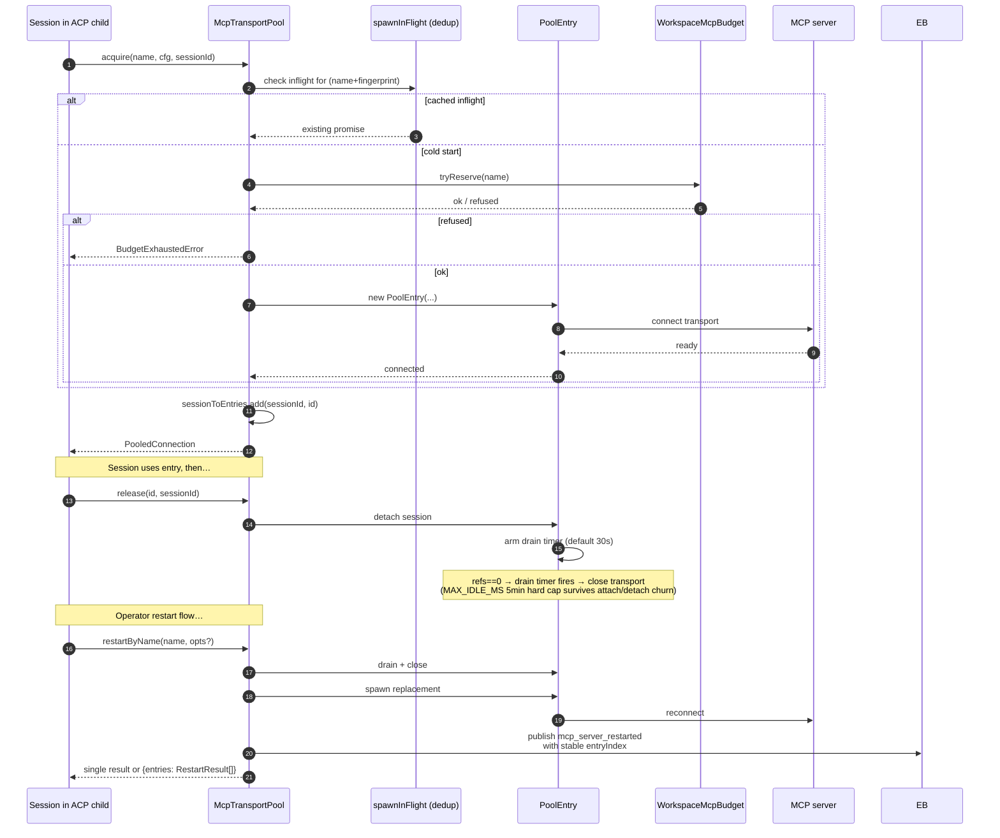
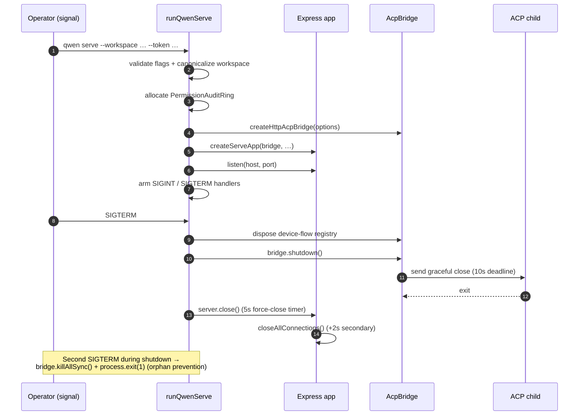

# デーモンアーキテクチャ

## 概要

`qwen serve` プロセスは **1デーモン = 1ワークスペース** です。単一の Express HTTP サーバーをホストし、`@qwen-code/acp-bridge` インスタンスを所有し、実際のエージェントランタイムを実行する ACP 子プロセス（`qwen --acp`）を起動します。複数のクライアント（CLI TUI、IDE コンパニオン、IM チャンネルボット、Web BFF、カスタムスクリプト）が HTTP + SSE 経由で接続し、1つの ACP セッションを共有するか（`sessionScope: 'single'`、デフォルト）、会話スレッドごとにセッションを分割します（`sessionScope: 'thread'`）。

ACP 子プロセス内では、MCP サーバーが `McpTransportPool`（F2）を通じてワークスペース全体で共有されます。（サーバー名 + 設定フィンガープリント）の組み合わせが 1つの MCP トランスポートにマッピングされ、セッションが何個検出しても同じトランスポートが使われます。ブリッジの `MultiClientPermissionMediator`（F3）は、4つのポリシーのいずれかに基づいて、接続されているすべてのクライアント間でパーミッションの承認を調整します。

このドキュメントは、残りのドキュメントセットが基盤とする**システムレベルの全体像**を示します。各重要フローは Mermaid シーケンス図として示されており、コンポーネントごとの実装詳細は他の 18 のドキュメントに記載されています。

## プロセストポロジー

デーモンプロセスと ACP 子プロセスは `AcpChannel`（デフォルト: 実際のサブプロセス stdio パイプペア、テスト用は `inMemoryChannel`）で接続されています。デーモンが行うすべてのことはこの分割によって形成されます。HTTP と SSE のトラフィックはデーモンで終端し、エージェントの意思決定とツール呼び出しは子プロセスで行われ、ブリッジが両者を接続します。

## パッケージマップ

信頼境界は 3つあります。HTTP エッジ（`serve/auth.ts` ミドルウェアチェーン）、ブリッジから ACP 子プロセスへの境界（stdio 上の NDJSON、認証なし。子プロセスはブリッジを暗黙的に信頼）、エージェントから MCP サーバーへの境界（エージェントがホストに触れるツールを呼び出す可能性あり）。

## ワークフロー 1: HTTP リクエストのライフサイクル

非ストリーミングルート（プロンプト、キャンセル、モデル切り替え、メタデータ、ワークスペース CRUD）は単一の JSON レスポンスとして終了します。ストリーミング出力はこの接続のチャンク HTTP ボディとしてではなく、SSE チャンネル上でアウトオブバンドで配信されます。ワークフロー 2 を参照してください。

## ワークフロー 2: SSE イベント配信とリプレイ

リングバッファには上限があります（`eventRingSize`、デフォルト 8000）。`Last-Event-ID` がリングの先頭より古い再接続クライアントは、合成されたキャッチアップシグナルを受け取り、より深い状態を再構築するために `loadSession` / `resumeSession` を呼び出す必要があります。処理の遅いクライアントはキュー 75% 時に `slow_client_warning` を、上限到達時に `client_evicted` をトリガーします。

## ワークフロー 3: マルチクライアントパーミッション調整

クロスポリシーのエスケープハッチ: どのクライアントも `CANCEL_VOTE_SENTINEL` に投票することで、リクエストを `cancelled / agent_cancelled` として短絡させることができます。ブリッジは、通常の `optionId` フィールド経由でワイヤー呼び出し元がセンチネルを密輸するのを防ぎます（`InvalidPermissionOptionError`）。

## ワークフロー 4: MCP トランスポートプールの acquire / release / restart

`releaseSession(sessionId)` は逆引き `sessionToEntries` インデックスを使って、セッションが保持するすべてのエントリを O(refs) でリリースします。デーモンのシャットダウン時、`drainAll()` は `draining` フラグを設定し（新規 acquire を拒否）、設定可能なタイムアウト以内にすべてのエントリがクローズするのを待ちます。

## ワークフロー 5: ライフサイクル — 起動とグレースフルシャットダウン

2フェーズシャットダウンが重要な理由は、処理中の HTTP リクエスト、処理中の SSE サブスクライバー、ACP 子プロセスの処理中のツール呼び出しが、すべて有限のティアダウンウィンドウを必要とするためです。タイムアウトを超えてブロックが発生した場合、強制クローズパスが引き継ぎ、スタックした子プロセスがデーモンプロセスを生かし続けることを防ぎます。

## 重要ファイル

| 関心事              | ファイル                                                        |
| -------------------- | ----------------------------------------------------------- |
| ブートストラップ            | `packages/cli/src/serve/run-qwen-serve.ts`                    |
| Express アプリ          | `packages/cli/src/serve/server.ts`                          |
| ケイパビリティレジストリ  | `packages/cli/src/serve/capabilities.ts`                    |
| 認証ミドルウェア      | `packages/cli/src/serve/auth.ts`                            |
| ブリッジ               | `packages/acp-bridge/src/bridge.ts`                         |
| BridgeClient         | `packages/acp-bridge/src/bridgeClient.ts`                   |
| パーミッションメディエーター  | `packages/acp-bridge/src/permissionMediator.ts`             |
| EventBus             | `packages/acp-bridge/src/eventBus.ts`                       |
| MCP トランスポートプール   | `packages/core/src/tools/mcp-transport-pool.ts`             |
| ワークスペース MCP バジェット | `packages/core/src/tools/mcp-workspace-budget.ts`           |
| ワークスペース FS         | `packages/cli/src/serve/fs/`                                |
| SDK DaemonClient     | `packages/sdk-typescript/src/daemon/DaemonClient.ts`        |
| SDK SessionClient    | `packages/sdk-typescript/src/daemon/DaemonSessionClient.ts` |
| イベントスキーマ         | `packages/sdk-typescript/src/daemon/events.ts`              |

## 参照

- デザイン issue: [#3803](https://github.com/QwenLM/qwen-code/issues/3803)（デーモン設計）、[#4175](https://github.com/QwenLM/qwen-code/issues/4175)（F シリーズマイルストーン）。
- ユーザーガイド: [`../../users/qwen-serve.md`](../../users/qwen-serve.md)。
- ワイヤープロトコルリファレンス: [`../qwen-serve-protocol.md`](../qwen-serve-protocol.md)。
- F2 設計ドキュメント: [`../../design/f2-mcp-transport-pool.md`](../../design/f2-mcp-transport-pool.md)。
- F2 設計ノート: issue [#4175](https://github.com/QwenLM/qwen-code/issues/4175) コミット 4-6。
