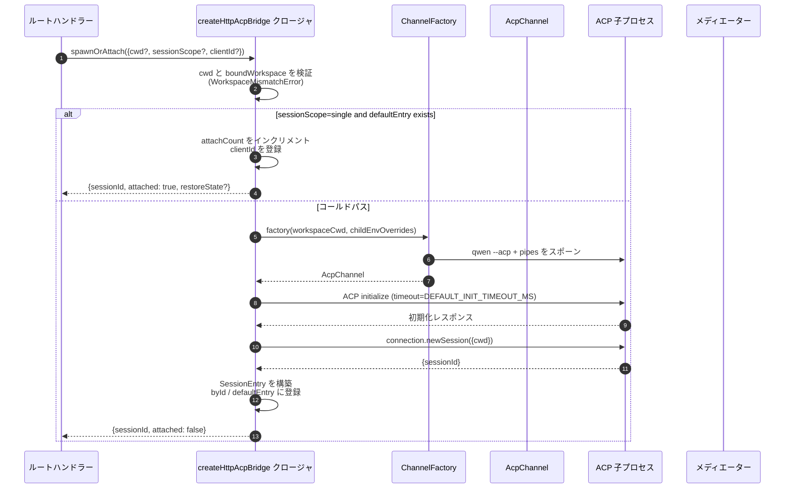
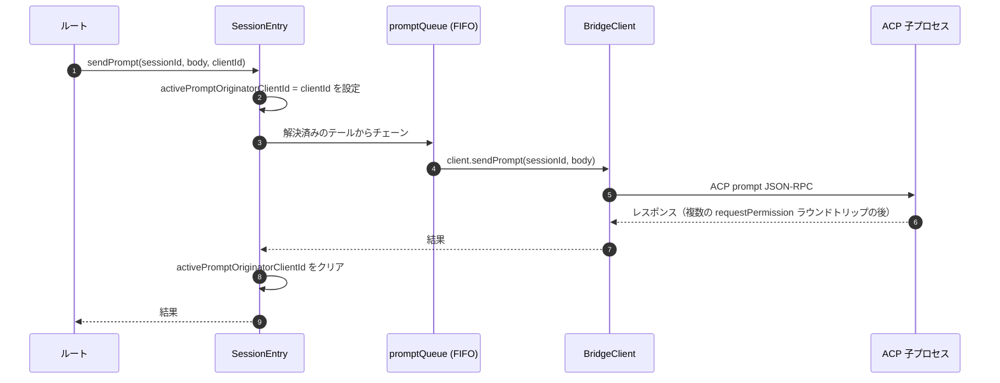
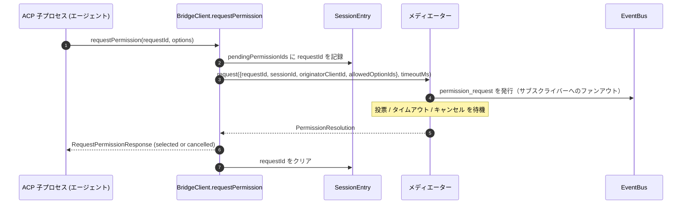
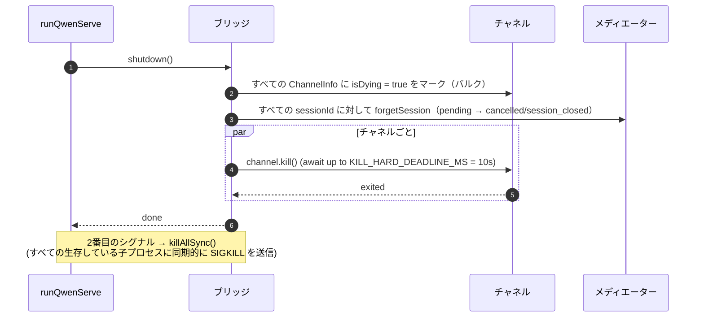

# ACP Bridge

## 概要

`packages/acp-bridge/` は、デーモンの HTTP レイヤーと ACP 子プロセス間の境界を担います。これは `packages/cli/src/serve/`（`qwen serve` デーモン）によって利用され、将来のコンシューマー（`channels/base/AcpBridge.ts`、VS Code IDE コンパニオン）が CLI パッケージに直接依存せずに同じブリッジコアを利用できるようにするため、#4175 F1 step 3 で抽出されました。

このブリッジは、1つの `HttpAcpBridge` インスタンス、ACP 子プロセスへの1つの `AcpChannel`、そのチャネル上で多重化されたセッション、セッションごとの `EventBus`、`MultiClientPermissionMediator`、`BridgeFileSystem` アダプター、および ACP 指向のヘルパー（`spawnOrAttach`、`loadSession`、`resumeSession`、`sendPrompt`、`cancelSession`、`respondToPermission`、さらにワークスペースステータスと MCP 再起動用の extMethod RPC）を提供します。

## 責務

- プラグイン可能な `ChannelFactory` を介して ACP 子プロセスをスポーンまたはアタッチします。デフォルトのファクトリ: `defaultSpawnChannelFactory`（サブプロセス `qwen --acp`）。テストでは `inMemoryChannel` を注入します。
- `aliveChannels`（チャネルレジストリ）と `byId`（セッションレジストリ）を維持します。
- `connection.newSession()` を介して、N 個の HTTP 側セッションを1つの ACP 子プロセス上で多重化します。
- `promptQueue` を介してセッションごとのプロンプトを直列化します（ACP はセッションごとに1つのアクティブなプロンプトのみを強制します）。
- 異なるモデルでの同時アタッチがエージェントと競合しないように、`setSessionModel` 呼び出しに対してセッションごとの FIFO を提供します。
- `GET /session/:id/events` を駆動するセッションごとの `EventBus`（[`10-event-bus.md`](./10-event-bus.md) を参照）。
- 権限フロー: `BridgeClient.requestPermission` → `MultiClientPermissionMediator.request` → ファンアウト → 投票収集 → ACP レスポンス（[`04-permission-mediation.md`](./04-permission-mediation.md) を参照）。
- ファイル I/O: ACP の `readTextFile` / `writeTextFile` 呼び出し用の `BridgeFileSystem` アダプター（[`07-workspace-filesystem.md`](./07-workspace-filesystem.md) を参照）。
- ワークスペースレベルのステータス（`/workspace/mcp`、`/workspace/skills`、`/workspace/providers`）と MCP 再起動用の extMethod RPC。
- ライフサイクル: チャネルごとに `KILL_HARD_DEADLINE_MS`（10秒）の猶予を持つグレースフルな `shutdown()`。2番目のシグナルによる強制終了用の同期的な `killAllSync()`。

## アーキテクチャ

**パブリックエントリー**: `packages/acp-bridge/src/bridge.ts` 内の `createHttpAcpBridge(opts: BridgeOptions): HttpAcpBridge`。

**主要な型**:

| Type                            | File                    | Role                                                                                                                                                                                                                  |
| ------------------------------- | ----------------------- | --------------------------------------------------------------------------------------------------------------------------------------------------------------------------------------------------------------------- |
| `HttpAcpBridge`                 | `bridgeTypes.ts`        | パブリックインターフェース: `spawnOrAttach`, `loadSession`, `resumeSession`, `sendPrompt`, `cancelSession`, `subscribeEvents`, `respondToPermission`, `getWorkspaceMcpStatus`, `restartMcpServer`, `shutdown`, `killAllSync`, … |
| `BridgeSession`                 | `bridgeTypes.ts`        | HTTP ハンドラーに返される `{ sessionId, workspaceCwd, attached, clientId?, createdAt? }`。                                                                                                                             |
| `BridgeOptions`                 | `bridgeOptions.ts`      | 構築時の設定（[設定](#configuration) を参照）。                                                                                                                                                       |
| `AcpChannel`                    | `channel.ts`            | `{ stream, kill(), killSync(), exited }` — 1つの ACP NDJSON チャネル。                                                                                                                                                    |
| `ChannelFactory`                | `channel.ts`            | `(workspaceCwd, childEnvOverrides?) => Promise<AcpChannel>`。                                                                                                                                                          |
| `BridgeClient`                  | `bridgeClient.ts`       | 1つの ACP `ClientSideConnection` をラップし、ACP `Client`（`requestPermission`, `readTextFile`, `writeTextFile`, `sessionUpdate`, `extNotification`）を実装します。                                                             |
| `EventBus`                      | `eventBus.ts`           | セッションごとのインメモリ pub/sub。[`10-event-bus.md`](./10-event-bus.md) を参照。                                                                                                                                            |
| `MultiClientPermissionMediator` | `permissionMediator.ts` | 4ポリシーのメディエーター。[`04-permission-mediation.md`](./04-permission-mediation.md) を参照。                                                                                                                               |

**内部状態（`createHttpAcpBridge` によってクロージャ化）**:

| State           | Shape                           | Purpose                                                                                                                                                                                                                                                                                                                                                                                                  |
| --------------- | ------------------------------- | -------------------------------------------------------------------------------------------------------------------------------------------------------------------------------------------------------------------------------------------------------------------------------------------------------------------------------------------------------------------------------------------------------- |
| `aliveChannels` | `Map<string, ChannelInfo>`      | チャネル ID をキーとするチャネルレジストリ。各 `ChannelInfo` は `channel`, `connection`, `client`（チャネルごとに1つの `BridgeClient`）, `sessionIds: Set<string>`, `pendingRestoreIds`, `statusClosedReject?`, `isDying: boolean` を保持します。                                                                                                                                                                            |
| `byId`          | `Map<string, SessionEntry>`     | sessionId をキーとするセッションレジストリ。各 `SessionEntry` は `channel`, `connection`, `events: EventBus`, `promptQueue: Promise<void>`, `modelChangeQueue: Promise<void>`, `pendingPermissionIds: Set<string>`, `clientIds: Map<string, count>`, `activePromptOriginatorClientId?`, `attachCount`, `spawnOwnerWantedKill`, `restoreState?`, `sessionLastSeenAt?`, `clientLastSeenAt: Map<string, ms>` を保持します。 |
| `defaultEntry`  | `SessionEntry \| null`          | `sessionScope: 'single'` の場合に使用される「単一」セッション。                                                                                                                                                                                                                                                                                                                                                 |
| `defaultPolicy` | `PermissionPolicy`              | `BridgeOptions.permissionPolicy` を介して設定されます。                                                                                                                                                                                                                                                                                                                                                         |
| `mediator`      | `MultiClientPermissionMediator` | ブリッジインスタンスごとに1つ。                                                                                                                                                                                                                                                                                                                                                                                 |
| Constants       | —                               | `DEFAULT_INIT_TIMEOUT_MS = 10_000`, `MCP_RESTART_TIMEOUT_MS = 300_000`, `DEFAULT_MAX_SESSIONS = 20`, `MAX_EVENT_RING_SIZE = 1_000_000`, `DEFAULT_PERMISSION_TIMEOUT_MS = 5min`, `DEFAULT_MAX_PENDING_PER_SESSION = 64`。                                                                                                                                                                                  |

**`isDying` 不変条件**: 任意のティアダウンパスは、`channel.kill()` を await する**前**に同期的に `ChannelInfo.isDying = true` を設定しなければなりません。`ensureChannel` は dying チャネルを不在として扱い、新しいものをスポーンします。このフラグがないと、SIGTERM の猶予ウィンドウ（最大10秒）中に到着する並行する `spawnOrAttach` は、閉じようとしているトランスポートにアタッチしてしまい、呼び出し元の sessionId はその後のフォローアップでことごとく 404 になります。**設定サイト**（同期を維持する必要があります）: `ensureChannel`（初期化失敗 + 遅延シャットダウンの再チェック）、`doSpawn`（空のチャネルでの newSession 失敗）、`killSession`（最後のセッションが離脱）、`shutdown`（バルク）。

**`channelInfo` 保持不変条件**: `isDying = true` を設定する際に `channelInfo` をクリア**しないでください**。`killAllSync` は、SIGTERM の猶予ウィンドウ中に `process.exit(1)` で SIGKILL を送信するために、引き続きチャネルを見つけることができなければなりません。`aliveChannels` は、`channel.exited` が発生するまで dying エントリを保持します。

**BridgeClient の境界付きバッファリング**: `byId` にまだ存在しない sessionId に対して `BridgeClient` に到着する ACP `extNotification` フレーム（`connection.newSession` のレスポンスがまだ返っていないが、`newSession` 内の MCP 検出がすでにバジェットイベントを発生させている場合）は、`MAX_EARLY_EVENT_SESSIONS = 64` × `MAX_EARLY_EVENTS_PER_SESSION = 32` × `EARLY_EVENT_TTL_MS = 60_000` で制限された初期イベントキューにバッファリングされます。最悪の場合、ヒープは約 400 KB になります。バッファリングがないと、新規セッションの最初の SSE リプレイリングスロットに、作成中に発生したイベントが欠落することになります。

## ワークフロー

### `spawnOrAttach`（プライマリエントリーポイント）

重要なポイント:

- 既存の `defaultEntry` を持つ `sessionScope='single'` は、`attachCount` をインクリメントし、`clientId` を登録して、`attached: true` を返すだけです。
- コールドパスは ChannelFactory を実行し、ACP `initialize`（`DEFAULT_INIT_TIMEOUT_MS=10s`）を実行し、`connection.newSession({cwd})` を呼び出して、新しい `SessionEntry` を登録します。
- `byId.size >= maxSessions` の場合、`SessionLimitExceededError` がスローされます。
- `X-Qwen-Client-Id` が `[A-Za-z0-9._:-]{1,128}` の範囲外の場合、`InvalidClientIdError` がスローされます。
- `server.ts` の切断レーパーは、スポーンオーナーが切断されても他のクライアントがすでにアタッチしているセッションを tearDown しないように、`attachCount`/`spawnOwnerWantedKill` を介してスポーンオーナーを追跡します（#3889 BQ9tV を参照）。

### プロンプトの直列化

キューのテールでの失敗は**破棄されます**（swallowed）。これにより、前のプロンプトの拒否が後続のプロンプトを汚染することはありません。元の呼び出し元は、自身が返した promise で引き続き拒否を受け取ります。セッションにキャッシュされた `transportClosedReject` は、プロンプトの promise と `channel.exited` を競合させるため、クラッシュした子プロセスはハングするのではなく即座に表面化します。

### 権限フロー（高レベル）

`InvalidPermissionOptionError` は、通常の `optionId` フィールド経由で `CANCEL_VOTE_SENTINEL` を注入しようとするネットワーク経由の投票に対して、メディエーター以前にスローされます。このセンチネルは、リクエストを `cancelled / agent_cancelled` としてショートカットするためのブリッジの唯一の脱出ハッチであり、誤ってネットワークから到達可能であってはなりません。[`04-permission-mediation.md`](./04-permission-mediation.md) を参照。

### シャットダウン

## チャネルファクトリ

`AcpChannel`（`channel.ts`）はブリッジのトランスポート抽象化です。本番環境では `spawnChannel.ts` 内の `defaultSpawnChannelFactory` を使用し、`qwen --acp` を stdio パイプペアを持つサブプロセスとして実行します。テストでは `inMemoryChannel` を注入して、エージェントをプロセス内で実行します。ブリッジは基盤となるメカニズムについて何も知りません。必要なのは `{ stream, kill, killSync, exited }` だけです。

`ChannelFactory` は `childEnvOverrides` を受け付けるため、各デーモンハンドルは `process.env` を変更することなく（同じ Node プロセス内で2つの埋め込みデーモンが実行されると競合するため）、独自の MCP バジェット環境変数（`QWEN_SERVE_MCP_CLIENT_BUDGET`、`QWEN_SERVE_MCP_BUDGET_MODE`）を渡すことができます。

## 状態とライフサイクル

- ブリッジの構築は同期的であり、最初の `spawnOrAttach` で ACP 子プロセスがコールドスタートします。
- `defaultEntry` は `sessionScope: 'single'` の下でブリッジの存続期間中存続します。チャネルは `sessionIds.size === 0`（`killSession` の後）になり、かつ `isDying` が true に反転したときに破棄されます。
- `MAX_EVENT_RING_SIZE = 1_000_000` は `BridgeOptions.eventRingSize` のソフト上限であり、セッションあたり約 500 MB の OOM を引き起こす前にオペレーターのタイプミスを捕捉します。
- `DEFAULT_PERMISSION_TIMEOUT_MS = 5 * 60 * 1000` は、スタックした権限リクエストがセッションごとの `promptQueue` を永久にブロックしないようにします。
- `DEFAULT_MAX_PENDING_PER_SESSION = 64` は `DEFAULT_MAX_SUBSCRIBERS` を反映しており、超過した `requestPermission` 呼び出しは stderr の警告とともに cancelled として解決されます。

## 依存関係

| Upstream                                                                                     | Downstream                                     |
| -------------------------------------------------------------------------------------------- | ---------------------------------------------- |
| `@agentclientprotocol/sdk` — `ClientSideConnection`, `PROTOCOL_VERSION`, ACP 型           | `packages/cli/src/serve/`（デーモン）         |
| `@qwen-code/qwen-code-core` — `ApprovalMode`, `TrustGateError`, `getCurrentGeminiMdFilename` | `packages/channels/base/`（予定、F4）        |
| `node:crypto`, `node:fs`, `node:path`                                                        | `packages/vscode-ide-companion/`（予定、F4） |

## 設定

`BridgeOptions`（`bridgeOptions.ts`）:

| Key                                           | Default                                            | Purpose                                                                                                               |
| --------------------------------------------- | -------------------------------------------------- | --------------------------------------------------------------------------------------------------------------------- |
| `boundWorkspace`                              | （必須）                                         | ブリッジが強制する正規のワークスペースパス。                                                                         |
| `sessionScope`                                | `'single'`                                         | `'single'` はすべてのクライアント間で1つのセッションを共有します。`'thread'` は会話スレッドごとに個別のセッションを作成します。 |
| `channelFactory`                              | `defaultSpawnChannelFactory`                       | プラグイン可能な ACP 子プロセスファクトリ。                                                                                          |
| `initializeTimeoutMs`                         | `DEFAULT_INIT_TIMEOUT_MS = 10_000`                 | ACP `initialize` ハンドシェイクのタイムアウト。                                                                                   |
| `maxSessions`                                 | `DEFAULT_MAX_SESSIONS = 20`                        | `byId.size` の上限。`0` / `Infinity` = 無制限。NaN/負の値はスロー。                                                |
| `eventRingSize`                               | `DEFAULT_RING_SIZE`（`eventBus.ts` から）           | セッションごとのイベントリング。`MAX_EVENT_RING_SIZE` でソフトキャップ。                                                         |
| `permissionResponseTimeoutMs`                 | `DEFAULT_PERMISSION_TIMEOUT_MS = 5 min`            | メディエーターの1リクエストあたりの経過時間（wallclock）。                                                                               |
| `maxPendingPermissionsPerSession`             | `DEFAULT_MAX_PENDING_PER_SESSION = 64`             | 大量のリクエストを送信するエージェントへのバックプレッシャー。                                                                                   |
| `childEnvOverrides`                           | `{}`                                               | ACP 子プロセス用のハンドルごとの環境変数の追加 / 削除。                                                                  |
| `persistApprovalMode`, `persistDisabledTools` | —                                                  | Wave 4 変更ルート用の設定書き込みフック。                                                                  |
| `contextFilename`                             | `settings.json` の `context.fileName` から          | `getCurrentGeminiMdFilename` をオーバーライド。                                                                               |
| `statusProvider`                              | （なし）                                             | デーモンホストのプレフライトセル（`DaemonStatusProvider`）。                                                                 |
| `fileSystem`                                  | （なし）                                             | ACP `readTextFile` / `writeTextFile` 用の `BridgeFileSystem` アダプター。                                                  |
| `permissionPolicy`                            | `settings.json` の `policy.permissionStrategy` から | `first-responder` / `designated` / `consensus` / `local-only` のいずれか。                                                 |
| `permissionConsensusQuorum`                   | `settings.json` から                               | コンセンサスポリシーの N。                                                                                               |
| `permissionAudit`                             | `createNoOpPermissionAuditPublisher()`             | 監査証跡用の `PermissionAuditRing` への接続。                                                                    |
| `channelIdleTimeoutMs`                        | `0`                                                | 最後のセッションが閉じた後、このミリ秒間 ACP 子プロセスを生存させます。                                    |
## 追加のブリッジメソッド

コアとなる `spawnOrAttach`、`sendPrompt`、`cancelSession`、`respondToPermission`、`loadSession`、`resumeSession` の呼び出しに加えて、`HttpAcpBridge` インターフェースにはデーモン向けの以下のヘルパーが含まれるようになりました。

| Method                                                       | Purpose                                       |
| ------------------------------------------------------------ | --------------------------------------------- |
| `generateSessionRecap(sessionId, context?)`                  | セッションの要約を1行で生成します。            |
| `generateSessionBtw(sessionId, question, signal?, context?)` | 脇道に逸れた質問や btw プロンプトに回答します。|
| `executeShellCommand(sessionId, command, signal?, context?)` | デーモンホストでシェルコマンドを実行します。   |
| `getSessionContextUsageStatus(sessionId, opts?)`             | コンテキストウィンドウの使用量を返します。     |
| `getSessionSupportedCommandsStatus(sessionId)`               | 利用可能なスラッシュコマンドを返します。       |
| `getSessionTasksStatus(sessionId)`                           | バックグラウンドタスクのスナップショットを返します。|
| `getSessionStatsStatus(sessionId)`                           | セッションの使用統計を返します。               |
| `setSessionApprovalMode(sessionId, mode, opts, context?)`    | セッションの承認モードを更新します。           |
| `detachClient(sessionId, clientId?)`                         | クライアントを明示的にデタッチします。         |
| `addRuntimeMcpServer(name, config, originatorClientId)`      | ランタイムで MCP サーバーを追加します。        |
| `removeRuntimeMcpServer(name, originatorClientId)`           | ランタイムで MCP サーバーを削除します。        |
| `manageMcpServer(serverName, action, originatorClientId)`    | 有効化 / 無効化 / 認証 / 認証クリアを行います。|
| `generateWorkspaceAgent(description, originatorClientId)`    | AI を使用してサブエージェントの定義を生成します。|
| `preheat()`                                                  | 最初のセッションの前に ACP 子プロセスをウォームアップします。|
| `getSessionLastEventId(sessionId)`                           | セッションの単調増加イベント ID を読み取ります。|
| `getWorkspaceToolsStatus()`                                  | 組み込みツールレジストリのスナップショットを返します。|
| `getWorkspaceMcpToolsStatus(serverName)`                     | 特定の MCP サーバーのツールを返します。        |

`BridgeSpawnRequest.sessionScope` は `'per-client'` から `'thread'` にリネームされました。`BridgeRestoredSession` には `compactedReplay`、`liveJournal`、`lastEventId` が含まれるようになりました。`BridgeClientRequestContext` はブリッジ呼び出しを通じて渡されるリクエストコンテキストであり、`clientId`、`fromLoopback: boolean`、`promptId` を保持します。

## 注意事項と既知の制限

- `MCP_RESTART_TIMEOUT_MS = 300_000` (5分) — `/workspace/mcp/:server/restart` のブリッジタイムアウトは意図的に大きく設定されています。これは、stdio サーバーの場合 `McpClientManager.MAX_DISCOVERY_TIMEOUT_MS` が最大5分になる可能性があるためです。より短い期限を設定すると、ACP 子プロセスがバックグラウンドで再接続を続けている間に誤ったタイムアウトが発生してしまいます。
- `BridgeOptions.eventRingSize > 1_000_000` の場合、構築時に例外がスローされます。
- `connection.unstable_resumeSession` は、安定版の `session_resume` デーモンケーパビリティを通じて公開されています。`unstable_session_resume` は、古い SDK のための非推奨の互換エイリアスとして引き続き公開されています。クライアントは `session_resume` をフィーチャーディテクト（機能検出）する必要があります。
- ブリッジパッケージは `@qwen-code/acp-bridge` です。現在のコードは event-bus と status プリミティブをパッケージのサブパスから直接インポートしています。`serve/acp-session-bridge.ts` は、より広範なブリッジサーフェスに対する CLI ローカルの互換性ファサードとして残されています。

## 参照

- `packages/acp-bridge/src/bridge.ts` (特に 350 行目以降の `createHttpAcpBridge`)
- `packages/acp-bridge/src/bridgeClient.ts`
- `packages/acp-bridge/src/bridgeTypes.ts`
- `packages/acp-bridge/src/bridgeOptions.ts`
- `packages/acp-bridge/src/channel.ts`
- `packages/acp-bridge/src/spawnChannel.ts`
- `packages/acp-bridge/src/bridgeErrors.ts`
- Issues: [#3803](https://github.com/QwenLM/qwen-code/issues/3803), [#4175](https://github.com/QwenLM/qwen-code/issues/4175).