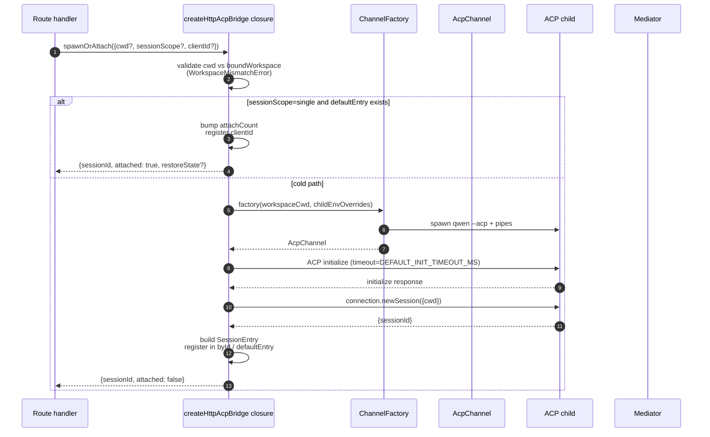
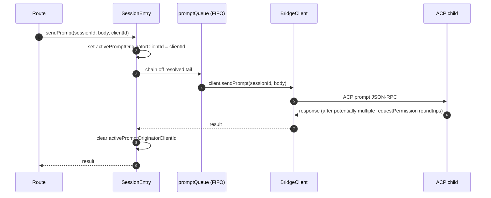
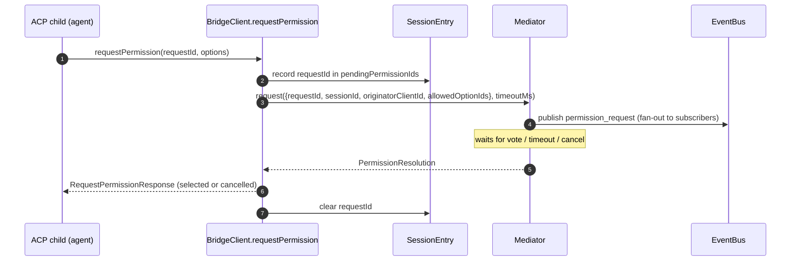
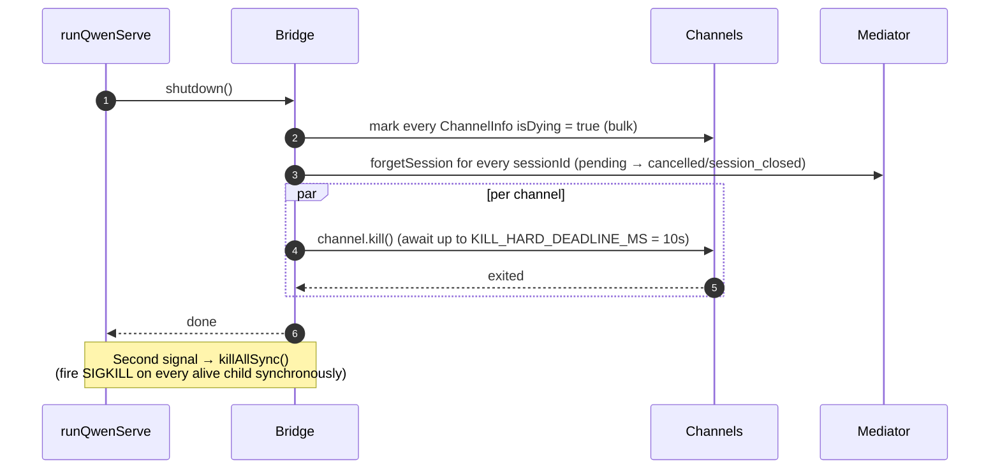

# ACP Bridge

## 概要

`packages/acp-bridge/` は、デーモンの HTTP 層と ACP 子プロセスとの境界を管理します。`packages/cli/src/serve/`（`qwen serve` デーモン）から利用されており、#4175 F1 step 3 で抽出されました。これにより、将来のコンシューマ（`channels/base/AcpBridge.ts`、VS Code IDE コンパニオン）が CLI パッケージに依存せずに同じブリッジコアを使用できます。

ブリッジは、1 つの `HttpAcpBridge` インスタンス、ACP 子プロセスへの 1 つの `AcpChannel`、そのチャネル上の多重化セッション、セッションごとの `EventBus`、`MultiClientPermissionMediator`、`BridgeFileSystem` アダプタ、および ACP 向けヘルパー（`spawnOrAttach`、`loadSession`、`resumeSession`、`sendPrompt`、`cancelSession`、`respondToPermission`、さらにワークスペースステータスと MCP 再起動のための extMethod RPC）を提供します。

## 責務

- プラグイン可能な `ChannelFactory` を介して ACP 子プロセスを起動またはアタッチする。デフォルトのファクトリ: `defaultSpawnChannelFactory`（サブプロセス `qwen --acp`）。テストでは `inMemoryChannel` を注入する。
- `aliveChannels`（チャネルレジストリ）と `byId`（セッションレジストリ）を維持する。
- `connection.newSession()` を使用して、N 個の HTTP 側セッションを 1 つの ACP 子プロセスに多重化する。
- セッションごとのプロンプトを `promptQueue` を通じて直列化する（ACP はセッションごとに 1 つのアクティブプロンプトを強制する）。
- `setSessionModel` 呼び出しのセッションごとの FIFO キュー。異なるモデルでの同時アタッチがエージェントを競合させないようにする。
- セッションごとの `EventBus` は `GET /session/:id/events` を駆動する（[`10-event-bus.md`](./10-event-bus.md) 参照）。
- パーミッションフロー: `BridgeClient.requestPermission` → `MultiClientPermissionMediator.request` → ファンアウト → 投票収集 → ACP 応答（[`04-permission-mediation.md`](./04-permission-mediation.md) 参照）。
- ファイル I/O: ACP の `readTextFile` / `writeTextFile` 呼び出し用の `BridgeFileSystem` アダプタ（[`07-workspace-filesystem.md`](./07-workspace-filesystem.md) 参照）。
- ワークスペースレベルのステータス（`/workspace/mcp`、`/workspace/skills`、`/workspace/providers`）および MCP 再起動のための extMethod RPC。
- ライフサイクル: チャネルごとに `KILL_HARD_DEADLINE_MS`（10 秒）を使用した graceful な `shutdown()`。2 回目のシグナルでの強制終了用の同期 `killAllSync()`。

## アーキテクチャ

**パブリックエントリ**: `packages/acp-bridge/src/bridge.ts` の `createHttpAcpBridge(opts: BridgeOptions): HttpAcpBridge`。

**主要な型**:

| 型                              | ファイル                   | 役割                                                                                                                                                                                                                  |
| ------------------------------- | -------------------------- | --------------------------------------------------------------------------------------------------------------------------------------------------------------------------------------------------------------------- |
| `HttpAcpBridge`                 | `bridgeTypes.ts`           | パブリックインターフェース: `spawnOrAttach`、`loadSession`、`resumeSession`、`sendPrompt`、`cancelSession`、`subscribeEvents`、`respondToPermission`、`getWorkspaceMcpStatus`、`restartMcpServer`、`shutdown`、`killAllSync`、… |
| `BridgeSession`                 | `bridgeTypes.ts`           | `{ sessionId, workspaceCwd, attached, clientId?, createdAt? }` HTTP ハンドラに返される。                                                                                                                             |
| `BridgeOptions`                 | `bridgeOptions.ts`         | 構築時の設定（[設定](#設定) 参照）。                                                                                                                                                       |
| `AcpChannel`                    | `channel.ts`               | `{ stream, kill(), killSync(), exited }` — 1 つの ACP NDJSON チャネル。                                                                                                                                                    |
| `ChannelFactory`                | `channel.ts`               | `(workspaceCwd, childEnvOverrides?) => Promise<AcpChannel>`。                                                                                                                                                          |
| `BridgeClient`                  | `bridgeClient.ts`          | 1 つの ACP `ClientSideConnection` をラップ。ACP `Client`（`requestPermission`、`readTextFile`、`writeTextFile`、`sessionUpdate`、`extNotification`）を実装。                                                             |
| `EventBus`                      | `eventBus.ts`              | セッションごとのインメモリ pub/sub。[`10-event-bus.md`](./10-event-bus.md) 参照。                                                                                                                                            |
| `MultiClientPermissionMediator` | `permissionMediator.ts`    | 4 つのポリシーを持つメディエータ。[`04-permission-mediation.md`](./04-permission-mediation.md) 参照。                                                                                                                               |

**内部状態（`createHttpAcpBridge` でクロージャとして隠蔽）**:

| 状態             | 形状                             | 目的                                                                                                                                                                                                                                                                                                                                                                                                                |
| --------------- | -------------------------------- | ----------------------------------------------------------------------------------------------------------------------------------------------------------------------------------------------------------------------------------------------------------------------------------------------------------------------------------------------------------------------------------------------------------------- |
| `aliveChannels` | `Map<string, ChannelInfo>`       | チャネル ID をキーとするチャネルレジストリ。各 `ChannelInfo` は `channel`、`connection`、`client`（チャネルごとに 1 つの `BridgeClient`）、`sessionIds: Set<string>`、`pendingRestoreIds`、`statusClosedReject?`、`isDying: boolean` を保持。                                                                                                                                                                            |
| `byId`          | `Map<string, SessionEntry>`      | セッション ID をキーとするセッションレジストリ。各 `SessionEntry` は `channel`、`connection`、`events: EventBus`、`promptQueue: Promise<void>`、`modelChangeQueue: Promise<void>`、`pendingPermissionIds: Set<string>`、`clientIds: Map<string, count>`、`activePromptOriginatorClientId?`、`attachCount`、`spawnOwnerWantedKill`、`restoreState?`、`sessionLastSeenAt?`、`clientLastSeenAt: Map<string, ms>` を保持。 |
| `defaultEntry`  | `SessionEntry \| null`           | `sessionScope: 'single'` の場合に使用される「単一」セッション。                                                                                                                                                                                                                                                                                                                                                 |
| `defaultPolicy` | `PermissionPolicy`               | `BridgeOptions.permissionPolicy` で設定。                                                                                                                                                                                                                                                                                                                                                         |
| `mediator`      | `MultiClientPermissionMediator`  | ブリッジインスタンスごとに 1 つ。                                                                                                                                                                                                                                                                                                                                                                                 |
| 定数            | —                                | `DEFAULT_INIT_TIMEOUT_MS = 10_000`、`MCP_RESTART_TIMEOUT_MS = 300_000`、`DEFAULT_MAX_SESSIONS = 20`、`MAX_EVENT_RING_SIZE = 1_000_000`、`DEFAULT_PERMISSION_TIMEOUT_MS = 5min`、`DEFAULT_MAX_PENDING_PER_SESSION = 64`。                                                                                                                                                                                  |

**`isDying` 不変条件**: すべての終了パスは、`channel.kill()` を **await する前** に同期的に `ChannelInfo.isDying = true` を設定しなければなりません。`ensureChannel` は dying 状態のチャネルを存在しないものとして扱い、新しいチャネルを生成します。このフラグがないと、SIGTERM 猶予期間（最大 10 秒）中に到着した同時 `spawnOrAttach` がまもなく閉じるトランスポートにアタッチし、呼び出し元の sessionId が後続のすべてのリクエストで 404 になります。**設定箇所**（同期を保つ必要あり）: `ensureChannel`（初期化失敗 + 後期シャットダウンの再チェック）、`doSpawn`（空チャネルでの newSession 失敗）、`killSession`（最後のセッション離脱）、`shutdown`（一括）。

**`channelInfo` 保持の不変条件**: `isDying = true` を設定しても `channelInfo` をクリアしてはいけません。`killAllSync` は SIGTERM 猶予期間中にチャネルを見つけ、`process.exit(1)` で SIGKILL を発行できなければなりません。`aliveChannels` は `channel.exited` が発火するまで dying エントリを保持します。

**BridgeClient のバッファリング制限**: `BridgeClient` で受信した ACP `extNotification` フレームのうち、まだ `byId` に存在しない sessionId のもの（`connection.newSession` の応答がまだ返っていないが、newSession 内の MCP ディスカバリが既に予算イベントを発火した場合）は、早期イベントキューにバッファリングされます。このキューは `MAX_EARLY_EVENT_SESSIONS = 64` × `MAX_EARLY_EVENTS_PER_SESSION = 32` × `EARLY_EVENT_TTL_MS = 60_000` で制限されます。最悪の場合、約 400 KB のヒープを消費します。バッファリングがない場合、新しいセッションの最初の SSE リングスロットには、その作成中に発火したイベントが欠落します。

## ワークフロー

### `spawnOrAttach`（主要エントリポイント）

重要なポイント:

- `sessionScope='single'` で既存の `defaultEntry` がある場合、`attachCount` を増やし、`clientId` を登録し、`attached: true` を返すだけです。
- コールドパスでは、ChannelFactory を実行し、ACP `initialize`（`DEFAULT_INIT_TIMEOUT_MS=10s`）を実行し、`connection.newSession({cwd})` を呼び出し、新しい `SessionEntry` を登録します。
- `byId.size >= maxSessions` の場合、`SessionLimitExceededError` がスローされます。
- `X-Qwen-Client-Id` が `[A-Za-z0-9._:-]{1,128}` の範囲外の場合、`InvalidClientIdError` がスローされます。
- `server.ts` の切断リーパーは、`attachCount`/`spawnOwnerWantedKill` を使用してスポーンオーナーを追跡し、スポーンオーナーが切断したが他のクライアントが既にアタッチしているセッションを誤って終了しないようにします（review #3889 BQ9tV）。

### プロンプトの直列化

キューの末尾での失敗は **握りつぶされます**。これにより、以前のプロンプトの拒否が後続のプロンプトに影響を与えません。元の呼び出し元は、自身の返された Promise で拒否を引き続き受け取ります。セッションにキャッシュされた `transportClosedReject` は、プロンプト Promise を `channel.exited` と競合させ、クラッシュした子プロセスがハングせずに直ちに表面化するようにします。

### パーミッションフロー（高レベル）

`InvalidPermissionOptionError` は、ワイヤー投票が通常の `optionId` フィールドを介して `CANCEL_VOTE_SENTINEL` を注入しようとした場合に、メディエータの前にスローされます。このセンチネルは、ブリッジがリクエストを `cancelled / agent_cancelled` としてショートサーキットするための唯一のエスケープハッチであり、誤ってワイヤーから到達可能であってはなりません。[`04-permission-mediation.md`](./04-permission-mediation.md) 参照。

### シャットダウン

## チャネルファクトリ

`AcpChannel`（`channel.ts`）はブリッジのトランスポート抽象化です。本番環境では `spawnChannel.ts` の `defaultSpawnChannelFactory` を使用し、`qwen --acp` を stdio パイプペアを持つサブプロセスとして実行します。テストでは `inMemoryChannel` を注入してエージェントをインプロセスで実行します。ブリッジは基盤となるメカニズムについて何も知りません。必要なのは `{ stream, kill, killSync, exited }` だけです。

`ChannelFactory` は `childEnvOverrides` を受け入れるため、各デーモンハンドルは `process.env` を変更せずに（同じ Node プロセス内で 2 つの埋め込みデーモンが実行されている場合に競合する）独自の MCP 予算環境変数（`QWEN_SERVE_MCP_CLIENT_BUDGET`、`QWEN_SERVE_MCP_BUDGET_MODE`）を渡すことができます。

## 状態とライフサイクル

- ブリッジの構築は同期的です。最初の `spawnOrAttach` で ACP 子プロセスがコールドスタートされます。
- `defaultEntry` は `sessionScope: 'single'` の下でブリッジの存続期間中存続します。チャネルは `sessionIds.size === 0`（`killSession` 後）かつ `isDying` が true に切り替わったときに破棄されます。
- `MAX_EVENT_RING_SIZE = 1_000_000` は `BridgeOptions.eventRingSize` のソフトな上限であり、オペレーターの typo によるセッションごとの約 500 MB の OOM を防ぎます。
- `DEFAULT_PERMISSION_TIMEOUT_MS = 5 * 60 * 1000` は、スタックしたパーミッションリクエストがセッションごとの `promptQueue` を永久にブロックしないようにします。
- `DEFAULT_MAX_PENDING_PER_SESSION = 64` は `DEFAULT_MAX_SUBSCRIBERS` をミラーリングします。過剰な `requestPermission` 呼び出しはキャンセルとして解決され、stderr に警告が出力されます。

## 依存関係

| 上流                                                                                         | 下流                                             |
| -------------------------------------------------------------------------------------------- | ------------------------------------------------ |
| `@agentclientprotocol/sdk` — `ClientSideConnection`、`PROTOCOL_VERSION`、ACP 型              | `packages/cli/src/serve/`（デーモン）             |
| `@qwen-code/qwen-code-core` — `ApprovalMode`、`TrustGateError`、`getCurrentGeminiMdFilename` | `packages/channels/base/`（計画中、F4）           |
| `node:crypto`、`node:fs`、`node:path`                                                        | `packages/vscode-ide-companion/`（計画中、F4）    |

## 設定

`BridgeOptions`（`bridgeOptions.ts`）:

| キー                                           | デフォルト                                          | 目的                                                                                                               |
| --------------------------------------------- | -------------------------------------------------- | --------------------------------------------------------------------------------------------------------------------- |
| `boundWorkspace`                              | （必須）                                           | ブリッジが強制する正規のワークスペースパス。                                                                         |
| `sessionScope`                                | `'single'`                                        | `'single'` はすべてのクライアントで 1 つのセッションを共有します。`'thread'` は会話スレッドごとに個別のセッションを作成します。 |
| `channelFactory`                              | `defaultSpawnChannelFactory`                       | プラグイン可能な ACP 子プロセスのファクトリ。                                                                          |
| `initializeTimeoutMs`                         | `DEFAULT_INIT_TIMEOUT_MS = 10_000`                 | ACP `initialize` ハンドシェイクのタイムアウト。                                                                                   |
| `maxSessions`                                 | `DEFAULT_MAX_SESSIONS = 20`                        | `byId.size` の上限。`0` / `Infinity` = 無制限。NaN/負の値は例外をスロー。                                                |
| `eventRingSize`                               | `DEFAULT_RING_SIZE`（`eventBus.ts` から）           | セッションごとのイベントリング。`MAX_EVENT_RING_SIZE` でソフトキャップ。                                                         |
| `permissionResponseTimeoutMs`                 | `DEFAULT_PERMISSION_TIMEOUT_MS = 5 分`             | メディエータのリクエストごとの壁時計。                                                                               |
| `maxPendingPermissionsPerSession`             | `DEFAULT_MAX_PENDING_PER_SESSION = 64`             | 高頻度エージェントに対するバックプレッシャー。                                                                                   |
| `childEnvOverrides`                           | `{}`                                               | ACP 子プロセスに対するハンドルごとの環境変数追加/削除。                                                                  |
| `persistApprovalMode`、`persistDisabledTools` | —                                                  | Wave 4 ミューテーションルート用の設定書き込みフック。                                                                  |
| `contextFilename`                             | `settings.json` の `context.fileName` から         | `getCurrentGeminiMdFilename` をオーバーライド。                                                                               |
| `statusProvider`                              | （なし）                                           | デーモンホストのプリフライトセル（`DaemonStatusProvider`）。                                                                 |
| `fileSystem`                                  | （なし）                                           | ACP の `readTextFile` / `writeTextFile` 用の `BridgeFileSystem` アダプタ。                                                  |
| `permissionPolicy`                            | `settings.json` の `policy.permissionStrategy` から | `first-responder` / `designated` / `consensus` / `local-only` のいずれか。                                                 |
| `permissionConsensusQuorum`                   | `settings.json` から                               | コンセンサスポリシーの N 値。                                                                                               |
| `permissionAudit`                             | `createNoOpPermissionAuditPublisher()`             | 監査証跡のための `PermissionAuditRing` への配線。                                                                    |
| `channelIdleTimeoutMs`                        | `0`                                                | 最後のセッションが閉じてから ACP 子プロセスを生かしておくミリ秒数。                                                                       |
## 追加のブリッジメソッド

コアの `spawnOrAttach`、`sendPrompt`、`cancelSession`、`respondToPermission`、`loadSession`、`resumeSession` 呼び出しに加えて、`HttpAcpBridge` インターフェースには以下のデーモン向けヘルパーが含まれています。

| メソッド                                                       | 目的                                       |
| ------------------------------------------------------------ | --------------------------------------------- |
| `generateSessionRecap(sessionId, context?)`                  | セッションの1行サマリーを生成します。            |
| `generateSessionBtw(sessionId, question, signal?, context?)` | サイド質問 / btw プロンプトに応答します。          |
| `executeShellCommand(sessionId, command, signal?, context?)` | デーモンホスト上でシェルコマンドを実行します。       |
| `getSessionContextUsageStatus(sessionId, opts?)`             | コンテキストウィンドウの使用状況を返します。                  |
| `getSessionSupportedCommandsStatus(sessionId)`               | 利用可能なスラッシュコマンドを返します。              |
| `getSessionTasksStatus(sessionId)`                           | バックグラウンドタスクのスナップショットを返します。            |
| `getSessionStatsStatus(sessionId)`                           | セッション使用統計を返します。              |
| `setSessionApprovalMode(sessionId, mode, opts, context?)`    | セッションの承認モードを更新します。           |
| `detachClient(sessionId, clientId?)`                         | クライアントを明示的に切り離します。                   |
| `addRuntimeMcpServer(name, config, originatorClientId)`      | 実行時に MCP サーバーを追加します。                 |
| `removeRuntimeMcpServer(name, originatorClientId)`           | 実行時に MCP サーバーを削除します。              |
| `manageMcpServer(serverName, action, originatorClientId)`    | 有効化 / 無効化 / 認証 / 認証クリアを行います。 |
| `generateWorkspaceAgent(description, originatorClientId)`    | AI でサブエージェント定義を生成します。       |
| `preheat()`                                                  | 最初のセッションの前に ACP 子プロセスをウォームアップします。  |
| `getSessionLastEventId(sessionId)`                           | セッションの単調増加するイベント ID を読み取ります。   |
| `getWorkspaceToolsStatus()`                                  | 組み込みツールレジストリのスナップショットを返します。   |
| `getWorkspaceMcpToolsStatus(serverName)`                     | 特定の MCP サーバーのツールを返します。       |

`BridgeSpawnRequest.sessionScope` は `'per-client'` から `'thread'` に名称変更されました。`BridgeRestoredSession` には `compactedReplay`、`liveJournal`、`lastEventId` が含まれるようになりました。`BridgeClientRequestContext` はブリッジ呼び出しを通じてスレッド化されるリクエストコンテキストで、`clientId`、`fromLoopback: boolean`、`promptId` を持ちます。

## 注意事項と既知の制限

- `MCP_RESTART_TIMEOUT_MS = 300_000` (5 分) — `/workspace/mcp/:server/restart` のブリッジタイムアウトは意図的に大きく設定されています。これは `McpClientManager.MAX_DISCOVERY_TIMEOUT_MS` が stdio サーバーで最大 5 分になる可能性があるためです。より短い期限を設定すると、ACP 子プロセスがバックグラウンドで再接続を続けている間に、誤ったタイムアウトが発生します。
- `BridgeOptions.eventRingSize > 1_000_000` はコンストラクション時に例外をスローします。
- `connection.unstable_resumeSession` は安定版の `session_resume` デーモン機能を通じて公開されています。`unstable_session_resume` は古い SDK との後方互換性のために非推奨の互換性エイリアスとして引き続きアナウンスされます。クライアントは機能検出に `session_resume` を使用する必要があります。
- ブリッジパッケージは `@qwen-code/acp-bridge` で、pre-F1 のインポートパスとの後方互換性のために `serve/event-bus.ts`、`serve/status.ts`、`serve/httpAcpBridge.ts` の再エクスポートシムを通じて消費されます。新しいコードは直接インポートする必要があります。

## 参考資料

- `packages/acp-bridge/src/bridge.ts` (特に `createHttpAcpBridge` 、350行目以降)
- `packages/acp-bridge/src/bridgeClient.ts`
- `packages/acp-bridge/src/bridgeTypes.ts`
- `packages/acp-bridge/src/bridgeOptions.ts`
- `packages/acp-bridge/src/channel.ts`
- `packages/acp-bridge/src/spawnChannel.ts`
- `packages/acp-bridge/src/bridgeErrors.ts`
- Issue: [#3803](https://github.com/QwenLM/qwen-code/issues/3803)、[#4175](https://github.com/QwenLM/qwen-code/issues/4175).