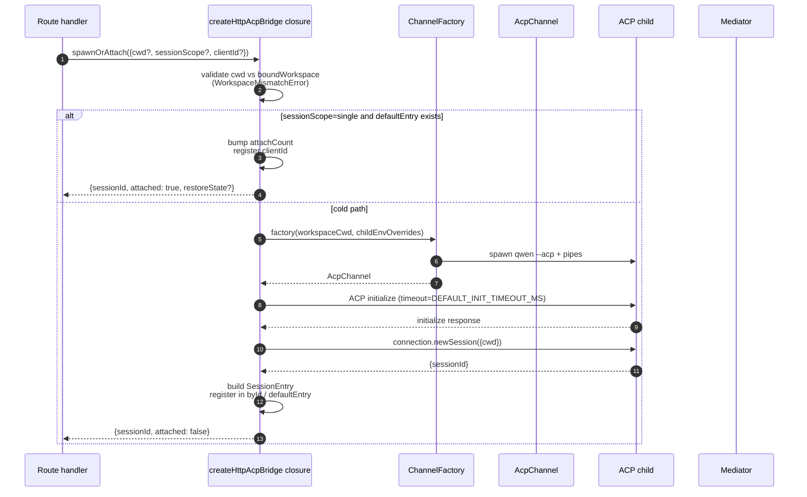
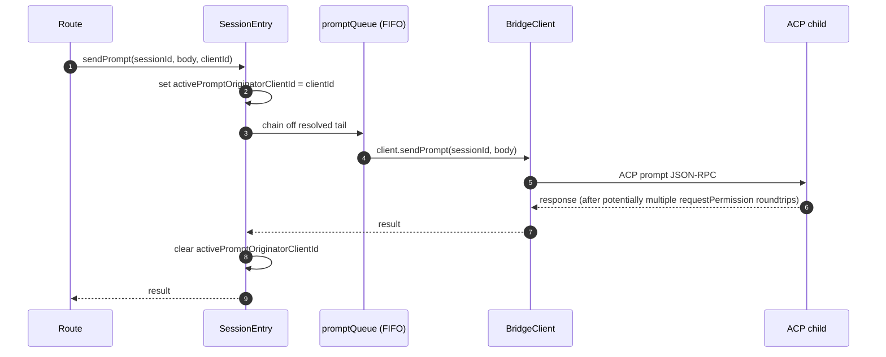
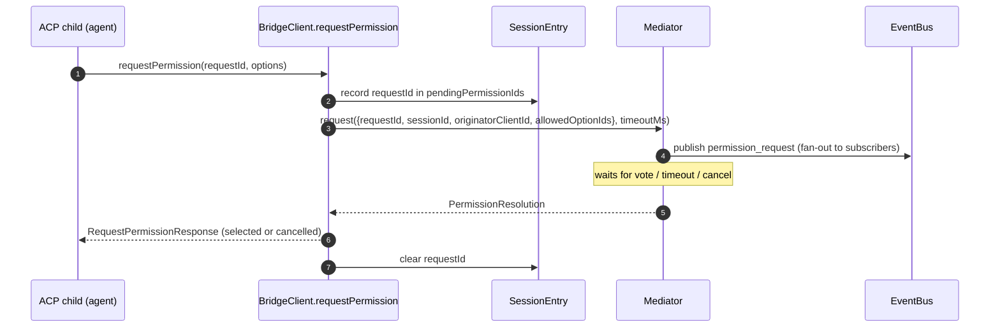
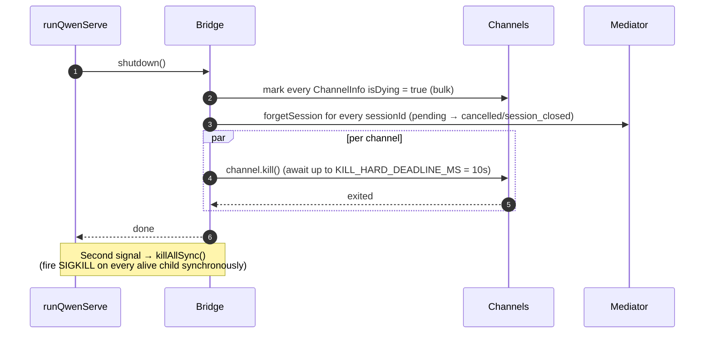

# ACP Bridge

## 概要

`packages/acp-bridge/` は、デーモンの HTTP レイヤーと ACP 子プロセスの境界を管理します。`packages/cli/src/serve/`（`qwen serve` デーモン）が利用しており、#4175 F1 ステップ 3 で抽出されたため、将来の利用者（`channels/base/AcpBridge.ts`、VS Code IDE コンパニオン）が CLI パッケージに依存せず同じブリッジコアを使用できます。

ブリッジは `HttpAcpBridge` インスタンス 1 つ、ACP 子プロセスへの `AcpChannel` 1 つ、そのチャンネル上の多重化されたセッション、セッションごとの `EventBus`、`MultiClientPermissionMediator`、`BridgeFileSystem` アダプター、および ACP 向けヘルパー（`spawnOrAttach`、`loadSession`、`resumeSession`、`sendPrompt`、`cancelSession`、`respondToPermission`、ワークスペースステータスと MCP 再起動用の extMethod RPC）を提供します。

## 責務

- プラグイン可能な `ChannelFactory` を通じて ACP 子プロセスをスポーンまたはアタッチする。デフォルトファクトリー：`defaultSpawnChannelFactory`（サブプロセス `qwen --acp`）。テストでは `inMemoryChannel` を注入。
- `aliveChannels`（チャンネルレジストリ）と `byId`（セッションレジストリ）を管理する。
- `connection.newSession()` を通じて N 個の HTTP 側セッションを 1 つの ACP 子プロセスに多重化する。
- セッションごとのプロンプトを `promptQueue` でシリアライズする（ACP はセッションごとにアクティブなプロンプトを 1 つに制限する）。
- 異なるモデルで同時アタッチするとエージェントで競合が発生しないよう、`setSessionModel` 呼び出しのセッションごとの FIFO。
- `GET /session/:id/events` を駆動するセッションごとの `EventBus`（[`10-event-bus.md`](./10-event-bus.md) 参照）。
- パーミッションフロー：`BridgeClient.requestPermission` → `MultiClientPermissionMediator.request` → ファンアウト → 投票収集 → ACP レスポンス（[`04-permission-mediation.md`](./04-permission-mediation.md) 参照）。
- ファイル I/O：ACP の `readTextFile` / `writeTextFile` 呼び出し用 `BridgeFileSystem` アダプター（[`07-workspace-filesystem.md`](./07-workspace-filesystem.md) 参照）。
- ワークスペースレベルのステータス（`/workspace/mcp`、`/workspace/skills`、`/workspace/providers`）と MCP 再起動用の extMethod RPC。
- ライフサイクル：チャンネルごとに `KILL_HARD_DEADLINE_MS`（10 秒）でのグレースフルな `shutdown()`；2 回目のシグナルによる強制終了のための同期的 `killAllSync()`。

## アーキテクチャ

**公開エントリーポイント**：`packages/acp-bridge/src/bridge.ts` 内の `createHttpAcpBridge(opts: BridgeOptions): HttpAcpBridge`。

**主要な型**：

| 型                              | ファイル                | 役割                                                                                                                                                                                                                  |
| ------------------------------- | ----------------------- | --------------------------------------------------------------------------------------------------------------------------------------------------------------------------------------------------------------------- |
| `HttpAcpBridge`                 | `bridgeTypes.ts`        | 公開インターフェース：`spawnOrAttach`、`loadSession`、`resumeSession`、`sendPrompt`、`cancelSession`、`subscribeEvents`、`respondToPermission`、`getWorkspaceMcpStatus`、`restartMcpServer`、`shutdown`、`killAllSync`、… |
| `BridgeSession`                 | `bridgeTypes.ts`        | HTTP ハンドラーに返される `{ sessionId, workspaceCwd, attached, clientId?, createdAt? }`。                                                                                                                             |
| `BridgeOptions`                 | `bridgeOptions.ts`      | コンストラクション時の設定（[設定](#configuration) 参照）。                                                                                                                                                           |
| `AcpChannel`                    | `channel.ts`            | `{ stream, kill(), killSync(), exited }` — ACP NDJSON チャンネル 1 つ。                                                                                                                                               |
| `ChannelFactory`                | `channel.ts`            | `(workspaceCwd, childEnvOverrides?) => Promise<AcpChannel>`。                                                                                                                                                         |
| `BridgeClient`                  | `bridgeClient.ts`       | ACP の `ClientSideConnection` 1 つをラップ；ACP `Client`（`requestPermission`、`readTextFile`、`writeTextFile`、`sessionUpdate`、`extNotification`）を実装。                                                          |
| `EventBus`                      | `eventBus.ts`           | セッションごとのインメモリ pub/sub。[`10-event-bus.md`](./10-event-bus.md) 参照。                                                                                                                                     |
| `MultiClientPermissionMediator` | `permissionMediator.ts` | 4 ポリシーメディエーター。[`04-permission-mediation.md`](./04-permission-mediation.md) 参照。                                                                                                                         |

**内部状態（`createHttpAcpBridge` によってクローズされる）**：

| 状態            | 型                              | 目的                                                                                                                                                                                                                                                                                                                                                                                                     |
| --------------- | ------------------------------- | -------------------------------------------------------------------------------------------------------------------------------------------------------------------------------------------------------------------------------------------------------------------------------------------------------------------------------------------------------------------------------------------------------- |
| `aliveChannels` | `Map<string, ChannelInfo>`      | チャンネル ID をキーとするチャンネルレジストリ。各 `ChannelInfo` は `channel`、`connection`、`client`（チャンネルごとに 1 つの `BridgeClient`）、`sessionIds: Set<string>`、`pendingRestoreIds`、`statusClosedReject?`、`isDying: boolean` を保持する。                                                                                                                                                   |
| `byId`          | `Map<string, SessionEntry>`     | sessionId をキーとするセッションレジストリ。各 `SessionEntry` は `channel`、`connection`、`events: EventBus`、`promptQueue: Promise<void>`、`modelChangeQueue: Promise<void>`、`pendingPermissionIds: Set<string>`、`clientIds: Map<string, count>`、`activePromptOriginatorClientId?`、`attachCount`、`spawnOwnerWantedKill`、`restoreState?`、`sessionLastSeenAt?`、`clientLastSeenAt: Map<string, ms>` を保持する。 |
| `defaultEntry`  | `SessionEntry \| null`          | `sessionScope: 'single'` 時に使用される「シングル」セッション。                                                                                                                                                                                                                                                                                                                                          |
| `defaultPolicy` | `PermissionPolicy`              | `BridgeOptions.permissionPolicy` で設定。                                                                                                                                                                                                                                                                                                                                                                |
| `mediator`      | `MultiClientPermissionMediator` | ブリッジインスタンスごとに 1 つ。                                                                                                                                                                                                                                                                                                                                                                        |
| 定数            | —                               | `DEFAULT_INIT_TIMEOUT_MS = 10_000`、`MCP_RESTART_TIMEOUT_MS = 300_000`、`DEFAULT_MAX_SESSIONS = 20`、`MAX_EVENT_RING_SIZE = 1_000_000`、`DEFAULT_PERMISSION_TIMEOUT_MS = 5min`、`DEFAULT_MAX_PENDING_PER_SESSION = 64`。                                                                                                                                                                                  |

**`isDying` 不変条件**：すべてのティアダウンパスは `channel.kill()` を await する**前に**同期的に `ChannelInfo.isDying = true` を設定しなければなりません。`ensureChannel` は dying 状態のチャンネルを存在しないものとして扱い、新しいものをスポーンします。このフラグがないと、SIGTERM グレース期間（最大 10 秒）中に到着した並行 `spawnOrAttach` が閉じようとしているトランスポートにアタッチし、呼び出し元の sessionId がすべてのフォローアップで 404 になります。**設定箇所**（同期を保つこと）：`ensureChannel`（初期化失敗 + レイトシャットダウン再チェック）、`doSpawn`（空チャンネルでの newSession 失敗）、`killSession`（最後のセッションが離脱するとき）、`shutdown`（一括）。

**`channelInfo` 保持不変条件**：`isDying = true` を設定するときに `channelInfo` を**クリアしないでください**。`killAllSync` は SIGTERM グレース期間中にチャンネルを見つけて `process.exit(1)` で SIGKILL を発射できなければなりません。`aliveChannels` は `channel.exited` が発火するまで dying エントリーを保持します。

**BridgeClient の境界付きバッファリング**：`byId` にまだ存在しない sessionId（`connection.newSession` のレスポンスがまだ返っていないが、`newSession` 内の MCP ディスカバリーがすでにバジェットイベントを発火している）向けに `BridgeClient` に届く ACP `extNotification` フレームは、`MAX_EARLY_EVENT_SESSIONS = 64` × `MAX_EARLY_EVENTS_PER_SESSION = 32` × `EARLY_EVENT_TTL_MS = 60_000` で制限された早期イベントキューにバッファリングされます。最悪ケースはおよそ 400 KB のヒープです。バッファリングなしでは、新しいセッションの最初の SSE リプレイリングスロットに作成中に発火したイベントが欠落します。

## ワークフロー

### `spawnOrAttach`（主要エントリーポイント）

主なポイント：

- `sessionScope='single'` で既存の `defaultEntry` がある場合は `attachCount` をインクリメントし、
  `clientId` を登録して `attached: true` を返すだけです。
- コールドパスは ChannelFactory を実行し、ACP `initialize`
  （`DEFAULT_INIT_TIMEOUT_MS=10s`）を実行し、`connection.newSession({cwd})` を呼び出してから
  新しい `SessionEntry` を登録します。
- `byId.size >= maxSessions` の場合 `SessionLimitExceededError` がスローされます。
- `X-Qwen-Client-Id` が `[A-Za-z0-9._:-]{1,128}` の範囲外の場合 `InvalidClientIdError` がスローされます。
- `server.ts` の切断リーパーは、スポーン所有者が切断したが他のクライアントがすでにアタッチしているセッションを
  削除しないよう、`attachCount`/`spawnOwnerWantedKill` を通じてスポーン所有者を追跡します（レビュー #3889 BQ9tV）。

### プロンプトのシリアライズ

キューテールでの失敗は**握りつぶされる**ため、前のプロンプトの拒否が後続プロンプトを汚染しません；元の呼び出し元は自身が返したプロミスで拒否を受け取ります。セッションにキャッシュされた `transportClosedReject` は、プロンプトプロミスを `channel.exited` と競合させるため、クラッシュした子プロセスがハングするのではなく即座に検出されます。

### パーミッションフロー（高レベル）

ワイヤー投票が通常の `optionId` フィールドを通じて `CANCEL_VOTE_SENTINEL` を注入しようとした場合、メディエーターの前で `InvalidPermissionOptionError` がスローされます。センチネルはリクエストを `cancelled / agent_cancelled` として短絡させるブリッジの唯一の脱出口であり、ワイヤーから誤ってアクセスできてはなりません。[`04-permission-mediation.md`](./04-permission-mediation.md) を参照してください。

### シャットダウン

## チャンネルファクトリー

`AcpChannel`（`channel.ts`）はブリッジのトランスポート抽象化です。プロダクションでは `spawnChannel.ts` 内の `defaultSpawnChannelFactory` を使用し、stdio パイプペアで `qwen --acp` をサブプロセスとして実行します。テストでは `inMemoryChannel` を注入してエージェントをインプロセスで実行します。ブリッジは基盤となるメカニズムを一切知りません — `{ stream, kill, killSync, exited }` のみ必要です。

`ChannelFactory` は `childEnvOverrides` を受け入れるため、各デーモンハンドルは `process.env` を変更せずに独自の MCP バジェット環境変数（`QWEN_SERVE_MCP_CLIENT_BUDGET`、`QWEN_SERVE_MCP_BUDGET_MODE`）を渡せます（2 つの組み込みデーモンが同じ Node プロセスで実行される場合に競合が発生します）。

## 状態とライフサイクル

- ブリッジの構築は同期的；最初の `spawnOrAttach` が ACP 子プロセスをコールドスタートします。
- `defaultEntry` は `sessionScope: 'single'` の下でブリッジの存続期間中存在します；`sessionIds.size === 0`（`killSession` 後）AND `isDying` が true になるとチャンネルが回収されます。
- `MAX_EVENT_RING_SIZE = 1_000_000` は `BridgeOptions.eventRingSize` のソフト上限で、~500 MB のセッションごとの OOM の前にオペレーターのタイポを検出します。
- `DEFAULT_PERMISSION_TIMEOUT_MS = 5 * 60 * 1000` は、スタックしたパーミッションリクエストがセッションごとの `promptQueue` を永遠にブロックしないようにします。
- `DEFAULT_MAX_PENDING_PER_SESSION = 64` は `DEFAULT_MAX_SUBSCRIBERS` を反映します；超過した `requestPermission` 呼び出しは stderr 警告とともに cancelled として解決されます。

## 依存関係

| 上流                                                                                         | 下流                                            |
| -------------------------------------------------------------------------------------------- | ----------------------------------------------- |
| `@agentclientprotocol/sdk` — `ClientSideConnection`、`PROTOCOL_VERSION`、ACP 型              | `packages/cli/src/serve/`（デーモン）           |
| `@qwen-code/qwen-code-core` — `ApprovalMode`、`TrustGateError`、`getCurrentGeminiMdFilename` | `packages/channels/base/`（予定、F4）           |
| `node:crypto`、`node:fs`、`node:path`                                                        | `packages/vscode-ide-companion/`（予定、F4）    |

## 設定 {#configuration}

`BridgeOptions`（`bridgeOptions.ts`）：

| キー                                          | デフォルト                                          | 目的                                                                                                                  |
| --------------------------------------------- | --------------------------------------------------- | --------------------------------------------------------------------------------------------------------------------- |
| `boundWorkspace`                              | （必須）                                            | ブリッジが強制する正規のワークスペースパス。                                                                          |
| `sessionScope`                                | `'single'`                                          | `'single'` はすべてのクライアントで 1 つのセッションを共有；`'thread'` は会話スレッドごとに別のセッションを作成。    |
| `channelFactory`                              | `defaultSpawnChannelFactory`                        | プラグイン可能な ACP 子ファクトリー。                                                                                 |
| `initializeTimeoutMs`                         | `DEFAULT_INIT_TIMEOUT_MS = 10_000`                  | ACP `initialize` ハンドシェイクタイムアウト。                                                                         |
| `maxSessions`                                 | `DEFAULT_MAX_SESSIONS = 20`                         | `byId.size` の上限。`0` / `Infinity` = 無制限；NaN/負の値はスロー。                                                   |
| `eventRingSize`                               | `DEFAULT_RING_SIZE`（`eventBus.ts` から）           | セッションごとのイベントリング；`MAX_EVENT_RING_SIZE` でソフトキャップ。                                              |
| `permissionResponseTimeoutMs`                 | `DEFAULT_PERMISSION_TIMEOUT_MS = 5 min`             | メディエーターのリクエストごとのウォールクロック。                                                                    |
| `maxPendingPermissionsPerSession`             | `DEFAULT_MAX_PENDING_PER_SESSION = 64`              | 高頻度エージェントへのバックプレッシャー。                                                                            |
| `childEnvOverrides`                           | `{}`                                                | ACP 子プロセス用のハンドルごとの環境変数の追加/削除。                                                                 |
| `persistApprovalMode`、`persistDisabledTools` | —                                                   | Wave 4 ミューテーションルート用の設定書き込みフック。                                                                 |
| `contextFilename`                             | `settings.json` の `context.fileName` から          | `getCurrentGeminiMdFilename` をオーバーライド。                                                                       |
| `statusProvider`                              | （なし）                                            | デーモンホストのプリフライトセル（`DaemonStatusProvider`）。                                                          |
| `fileSystem`                                  | （なし）                                            | ACP `readTextFile` / `writeTextFile` 用の `BridgeFileSystem` アダプター。                                             |
| `permissionPolicy`                            | `settings.json` の `policy.permissionStrategy` から | `first-responder` / `designated` / `consensus` / `local-only` のいずれか。                                            |
| `permissionConsensusQuorum`                   | `settings.json` から                               | コンセンサスポリシーの N。                                                                                            |
| `permissionAudit`                             | `createNoOpPermissionAuditPublisher()`              | 監査証跡用の `PermissionAuditRing` に接続。                                                                           |
| `channelIdleTimeoutMs`                        | `0`                                                 | 最後のセッションが閉じた後、ACP 子プロセスをこのミリ秒数だけ生かし続ける。                                           |

## 追加のブリッジメソッド

コアの `spawnOrAttach`、`sendPrompt`、`cancelSession`、
`respondToPermission`、`loadSession`、`resumeSession` に加えて、
`HttpAcpBridge` インターフェースには以下のデーモン向けヘルパーが含まれます：

| メソッド                                                     | 目的                                          |
| ------------------------------------------------------------ | --------------------------------------------- |
| `generateSessionRecap(sessionId, context?)`                  | 1 行のセッション要約を生成する。              |
| `generateSessionBtw(sessionId, question, signal?, context?)` | サイドクエスチョン / btw プロンプトに回答する。 |
| `executeShellCommand(sessionId, command, signal?, context?)` | デーモンホストでシェルコマンドを実行する。    |
| `getSessionContextUsageStatus(sessionId, opts?)`             | コンテキストウィンドウの使用状況を返す。      |
| `getSessionSupportedCommandsStatus(sessionId)`               | 利用可能なスラッシュコマンドを返す。          |
| `getSessionTasksStatus(sessionId)`                           | バックグラウンドタスクのスナップショットを返す。 |
| `getSessionStatsStatus(sessionId)`                           | セッション使用統計を返す。                    |
| `setSessionApprovalMode(sessionId, mode, opts, context?)`    | セッションの承認モードを更新する。            |
| `detachClient(sessionId, clientId?)`                         | クライアントを明示的にデタッチする。          |
| `addRuntimeMcpServer(name, config, originatorClientId)`      | 実行時に MCP サーバーを追加する。             |
| `removeRuntimeMcpServer(name, originatorClientId)`           | 実行時に MCP サーバーを削除する。             |
| `manageMcpServer(serverName, action, originatorClientId)`    | 有効化 / 無効化 / 認証 / 認証クリア。         |
| `generateWorkspaceAgent(description, originatorClientId)`    | AI でサブエージェント定義を生成する。         |
| `preheat()`                                                  | 最初のセッションの前に ACP 子プロセスをウォームアップする。 |
| `getSessionLastEventId(sessionId)`                           | セッションの単調イベント ID を読み取る。      |
| `getWorkspaceToolsStatus()`                                  | 組み込みツールレジストリのスナップショットを返す。 |
| `getWorkspaceMcpToolsStatus(serverName)`                     | 特定の MCP サーバーのツールを返す。           |

`BridgeSpawnRequest.sessionScope` は `'per-client'` から
`'thread'` にリネームされました。`BridgeRestoredSession` は `compactedReplay`、
`liveJournal`、`lastEventId` を持つようになりました。`BridgeClientRequestContext` はブリッジ呼び出しを通じて受け渡されるリクエストコンテキストで、`clientId`、
`fromLoopback: boolean`、`promptId` を持ちます。

## 注意事項と既知の制限

- `MCP_RESTART_TIMEOUT_MS = 300_000`（5 分）— `/workspace/mcp/:server/restart` のブリッジタイムアウトは意図的に大きくしています。`McpClientManager.MAX_DISCOVERY_TIMEOUT_MS` は stdio サーバーで最大 5 分になる可能性があるためです。短いデッドラインでは ACP 子プロセスがバックグラウンドで再接続を続けている間に誤ったタイムアウトが発生します。
- `BridgeOptions.eventRingSize > 1_000_000` は構築時にスローします。
- `connection.unstable_resumeSession` は安定した `session_resume` デーモン機能を通じて公開されています；`unstable_session_resume` は古い SDK との後方互換エイリアスとして引き続き広告されています。クライアントは `session_resume` を機能検出すべきです。
- ブリッジパッケージは `@qwen-code/acp-bridge` で、pre-F1 インポートパスとの後方互換性のため `serve/event-bus.ts`、`serve/status.ts`、`serve/httpAcpBridge.ts` の再エクスポートシムを通じて利用されます。新しいコードは直接インポートすべきです。

## 参考資料

- `packages/acp-bridge/src/bridge.ts`（特に 350 行目以降の `createHttpAcpBridge`）
- `packages/acp-bridge/src/bridgeClient.ts`
- `packages/acp-bridge/src/bridgeTypes.ts`
- `packages/acp-bridge/src/bridgeOptions.ts`
- `packages/acp-bridge/src/channel.ts`
- `packages/acp-bridge/src/spawnChannel.ts`
- `packages/acp-bridge/src/bridgeErrors.ts`
- Issues: [#3803](https://github.com/QwenLM/qwen-code/issues/3803), [#4175](https://github.com/QwenLM/qwen-code/issues/4175).
