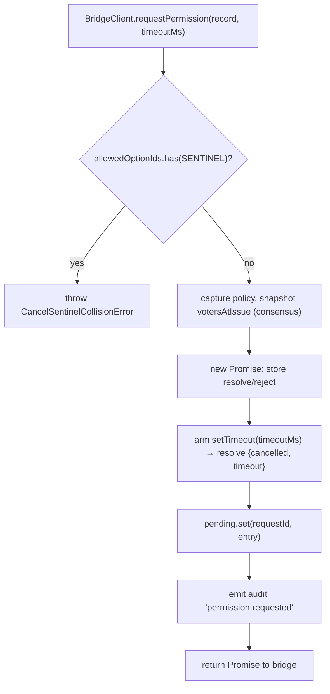
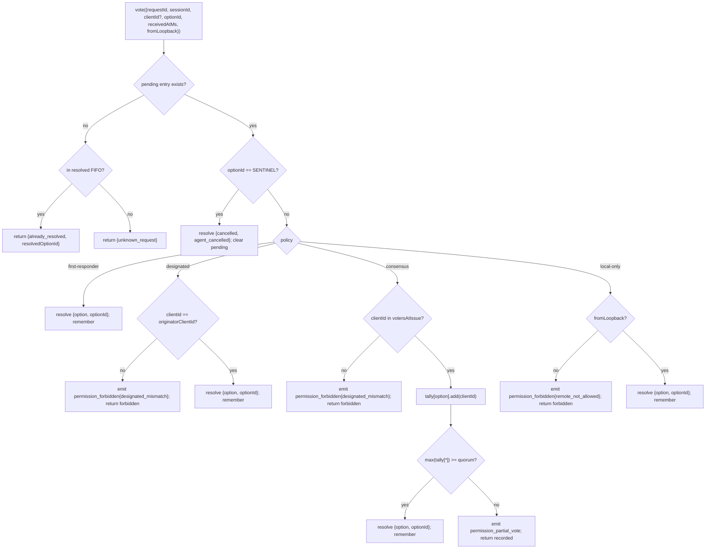

# マルチクライアント権限調停

## 概要

ACP子エージェントが `requestPermission` を呼び出すと、デーモンは単純に1つのクライアントに転送するわけではありません。`sessionScope: 'single'` の下では、接続されているすべてのクライアントがリクエストを確認でき、そのうちのいずれかが応答できます。調停がなければ、遅れた投票の行き場がなくなり、2つのクライアントが同じリクエストを競合したり、1つの不正なクライアントがオリジネーターをオーバーライドしたりする可能性があります。

`MultiClientPermissionMediator` (`packages/acp-bridge/src/permissionMediator.ts`) は `PermissionMediator` 契約 (`packages/acp-bridge/src/permission.ts`) を実装し、ブリッジの保留中および解決済みのすべての権限状態を管理します。これは、`PermissionPolicy` で宣言された4つのポリシーのいずれかを通じて投票をディスパッチします。

| ポリシー            | 解決ルール                                                                                                        | ユースケース                                                                 |
| ----------------- | ---------------------------------------------------------------------------------------------------------------------- | ------------------------------------------------------------------------ |
| `first-responder` | 最初に有効な投票が勝つ。後の投票者は `permission_already_resolved` を受け取る。                                                 | ライブなクロスクライアント協調UX（デフォルト）。                            |
| `designated`      | プロンプトの `originatorClientId` のみが解決できる。他のクライアントは `permission_forbidden{designated_mismatch}` を確認する。            | UIサーフェスが独自の承認を所有する必要があるテナント固有のSaaS。         |
| `consensus`       | v1クライアントIDスナップショットを跨ぐM中のNクォーラム。中間の `permission_partial_vote` イベントにより、UIは進捗をレンダリングできる。 | 2人のオペレーターが合意する必要があるエンタープライズ変更レビュー。                 |
| `local-only`      | ループバック以外の投票者を拒否。ループバッククライアントが解決するまでブロックする。                                               | リモート制御が決して権限昇格を許可してはならないワークステーション。 |

> **v1のセキュリティ制限**: `X-Qwen-Client-Id` は自己申告です。`designated` と
> `consensus` にはまだ所有証明がありません。`originatorClientId` を観察できる
> クライアントは、そのIDを再利用できます。`{outcome:'cancelled'}` も
> ポリシーディスパッチの前にキャンセルセンチネルを経由するため、`local-only` でさえ
> キャンセルをポリシー保護された解決として扱うことはできません。強力な分離のため、
> デーモンをループバックにバインドするか、認証されたリバースプロキシの背後に配置してください。
> [Security note: v1 client identity is self-reported](#security-note-v1-client-identity-is-self-reported) を参照してください。

## 責務

- すべての保留中リクエストを追跡する（`request → vote → resolved` ライフサイクル）。
- リクエストごとの壁時計タイムアウトをセットおよび解除する（**N1不変条件**: タイムアウトは `request()` 内で同期的にセットされなければならず、即座にキャンセルされたセッションが永久に保留中のクロージャをリークしないようにする）。
- `request()` 時にキャプチャされたポリシーを通じて投票をディスパッチする（処理中のデーモンポリシーの変更は、処理中のリクエストに影響しない）。
- 最近解決されたリクエストのバウンド付きFIFO（`MAX_RESOLVED_PERMISSION_RECORDS = 512`）を維持し、重複した投票に対して `unknown_request` ではなく構造化された `already_resolved` を返す。
- セッションごとのEventBusで `permission_partial_vote`（consensus）および `permission_forbidden`（designated / consensus / local-only）を発行する。
- セッションティアダウン時に `forgetSession(sessionId)` を介して、保留中のリクエストを `{kind: 'cancelled', reason: 'session_closed'}` として解決する。
- ワイヤ経由（`InvalidPermissionOptionError`）およびエージェント公開のオプションラベル経由（`CancelSentinelCollisionError`）での `CANCEL_VOTE_SENTINEL` の悪意のある、または偶発的な注入を拒否する。

## アーキテクチャ

### パブリックサーフェス

```ts
interface PermissionMediator {
  readonly policy: PermissionPolicy;
  request(
    record: PermissionRequestRecord,
    timeoutMs: number,
  ): Promise<PermissionResolution>;
  vote(vote: PermissionVote): PermissionVoteOutcome;
  forgetSession(sessionId: string): void;
}
```

`MultiClientPermissionMediator` は `peekSessionFor(requestId)`、`pendingCount(sessionId)`、内部監査パブリッシャーなどを追加します。`BridgeClient` は `request()` の半分（構造的サブタイピング — `bridgeClient.ts` を参照）にのみ依存します。

### `PermissionPolicy` と `PermissionVoteOutcome`

```ts
type PermissionPolicy =
  | 'first-responder'
  | 'designated'
  | 'consensus'
  | 'local-only';

type PermissionVoteOutcome =
  | { kind: 'resolved'; resolvedOptionId: string }
  | { kind: 'recorded'; votesNeeded: number } // consensus partial
  | { kind: 'already_resolved'; resolvedOptionId: string }
  | { kind: 'forbidden'; reason: 'designated_mismatch' | 'remote_not_allowed' }
  | { kind: 'unknown_request' };

type PermissionResolution =
  | { kind: 'option'; optionId: string }
  | {
      kind: 'cancelled';
      reason: 'timeout' | 'session_closed' | 'agent_cancelled';
    };
```

### キャンセルセンチネル

`CANCEL_VOTE_SENTINEL = '__cancelled__'`。ブリッジは、`mediator.vote` を呼び出す**前**に、投票者の `{outcome:'cancelled'}` をこのセンチネルにマッピングします。メディエーターはポリシーディスパッチ**前**にセンチネルをルーティングするため、`clientId` / ループバック / メンバーシップに関係なく、すべてのポリシーで投票者キャンセルが機能します。2つのガード:

1. **`bridge.ts`** は、`optionId === CANCEL_VOTE_SENTINEL` であるワイヤ投票を `InvalidPermissionOptionError` で拒否します（悪意のあるワイヤクライアントが `optionId` について嘘をついてキャンセルを注入できないようにするため）。
2. **`mediator.request`** は、`allowedOptionIds` にセンチネルが含まれるレコードを `CancelSentinelCollisionError` で拒否します（エージェントが正当に `'__cancelled__'` をオプションラベルとして公開する場合になりすましができないようにするため）。

この意図的なクロスポリシーエスケープは `permissionMediator.ts` に文書化されており、将来のメンテナーが誤ってバイパスを削除しないようにしています。

### 保留中の状態

各保留中リクエストは `requestId` でキーイングされ、次のものを保持します:

- `policy` — `request()` 時にキャプチャされたもの。
- `record: PermissionRequestRecord`（requestId, sessionId, originatorClientId, allowedOptionIds, issuedAtMs）。
- `resolve` / `reject` クロージャ。
- `votesAtIssue`（consensusのみ） — 発行時にセッションに登録された `clientIds` のスナップショット。このセットにない後の投票は拒否されます。
- `tally`（consensusのみ） — オプションごとの投票数をカウントする `Map<optionId, Set<clientId>>`。
- `timeoutHandle` — `request()` 内でセットされるNodeタイムアウト（N1不変条件）。
- `auditTrail[]` — 投票ごとの監査レコード。

### 解決済みFIFO

`MAX_RESOLVED_PERMISSION_RECORDS = 512`。削除は `resolvedOrder.shift()` によるFIFOです（DeepSeek review #4335 / 3271627446 — `PermissionAuditRing` を反映）。`{requestId, sessionId, outcome}` のみを保存するため、512レコードでも通常のUI再接続/競合ウィンドウ全体で100KB未満に収まります。

## ワークフロー

### `request()`（N1不変条件）



タイマーは、エントリが他の場所から見えるようになる**前**にセットされます。これがなければ、`pending.set` と `setTimeout` の間に到着した `forgetSession` によって、タイムアウトのない保留中のエントリが残ってしまい、ブリッジのセッションごとの `promptQueue` が永久にハングします。

### `vote()` ディスパッチ



### `forgetSession()`

セッションクローズ、削除、およびブリッジシャットダウン時に呼び出されます。`record.sessionId === sessionId` である保留中のエントリごとに:

1. タイムアウトをキャンセルする。
2. 保留中のPromiseを `{kind: 'cancelled', reason: 'session_closed'}` で解決する。
3. 監査レコードを追加する。
4. `pending` から削除する。

ブリッジのセッションティアダウンパスは、チャネルキルウィンドウの**前**に常に `forgetSession` を呼び出し、保留中の権限がセッションより長く存続しないようにします。

## 状態とライフサイクル

- `policy` はリクエストごとにキャプチャされます。デーモン全体のポリシー（将来のサーフェス）を変更しても、処理中のリクエストには影響しません。
- `votesAtIssue`（consensus）は `request()` 時にキャプチャされます。リクエスト後に到着したクライアントも投票できますが、発行時にセッションにまだ登録されていなかった `clientId` の場合、その投票は `designated_mismatch` として拒否されます。これは意図的に `designated` ポリシーの不一致理由を再利用して契約をクローズドに保つためです。将来のバージョンでは、SDKコンシューマーが区別する必要がある場合にユニオンを分割する可能性があります。
- 解決済みエントリは、最大 `MAX_RESOLVED_PERMISSION_RECORDS`（512）の間FIFOに保持されます。削除後、同じ `requestId` への重複投票は `{unknown_request}` を返します。
- `permission_partial_vote` は `consensus` でのみ発生します。他のポリシーではこれに依存しないでください。
- `permission_forbidden` は `designated`、`consensus`、および `local-only` で発生し、`first-responder` では発生しません。

## 依存関係

- [`03-acp-bridge.md`](./03-acp-bridge.md) — ブリッジが `BridgeClient.requestPermission` を `mediator.request` に配線する方法。
- [`10-event-bus.md`](./10-event-bus.md) — 部分投票および禁止フレームがクライアントに到達する方法。
- [`09-event-schema.md`](./09-event-schema.md) — `permission_*` イベントのペイロード契約。
- [`08-session-lifecycle.md`](./08-session-lifecycle.md) — `forgetSession()` はすべてのセッション終了時に呼び出されます。
- [`02-serve-runtime.md`](./02-serve-runtime.md) — `PermissionAuditRing`（監査レコードの512エントリFIFO）。

## 設定

| ソース              | ノブ                                                                                                   | 効果                                |
| ------------------- | ------------------------------------------------------------------------------------------------------ | ------------------------------------- |
| `settings.json`     | `policy.permissionStrategy`                                                                            | アクティブなメディエーターポリシー。               |
| `settings.json`     | `policy.consensusQuorum`                                                                               | consensusのN。                      |
| `BridgeOptions`     | `permissionPolicy`, `permissionConsensusQuorum`, `permissionAudit`                                     | プログラムによるオーバーライド。                |
| Capability tag      | `permission_mediation` (always; `modes: ['first-responder', 'designated', 'consensus', 'local-only']`) | ビルドでサポートされるセット。                  |
| Capability envelope | `policy.permission`                                                                                    | このデーモンが実行されているアクティブなポリシー。 |

`policy.permissionStrategy` が明示的に設定されていない場合、デーモンは
`first-responder` を使用します。`designated`、`consensus`、および `local-only` は、
`settings.json` で設定された場合にのみ有効になります。

## Consensusクォーラム: デフォルトの式とM=2のエッジケース

`consensus` ポリシーがアクティブで `policy.consensusQuorum` が設定されていない場合、
メディエーターは `permissionMediator.ts` の `consensusQuorumFor` を介して
**N = floor(M/2) + 1** を計算します:

```ts
Math.max(1, Math.floor(m / 2) + 1);
```

| M (`votersAtIssue.size`) | デフォルト N | 動作                        |
| ------------------------ | --------- | ------------------------------- |
| 1                        | 1         | 1人の投票者が即座に解決する。 |
| 2                        | 2         | 全会一致が必要。   |
| 3                        | 2         | 過半数。                       |
| 4                        | 3         | 過半数超。                 |
| 5                        | 3         | 過半数。                       |
| 6                        | 4         | 過半数超。                 |

**M = 2** の場合、分割投票（AがXを選択、BがYを選択）は、
権限ごとのタイムアウトによってのみ解決できます。どのオプションも全会一致に達しないため、
リクエストは `permissionResponseTimeoutMs`（デフォルト5分）まで待機し、
`{cancelled, timeout}` として解決されます。投票進行パスは、
オペレーター向けにこの「全会一致は分割投票がタイムアウトすることを意味する」動作を
標準エラーにログ出力します。

M = 2 に first-vote-wins 動作を希望するオペレーターは、
`policy.consensusQuorum: 1` を明示的に設定できます。M = 4 に全会一致を要求するなど、
より厳格な構成も同じフィールドを使用します。

## ブート時のポリシー検証

`runQwenServe.validatePolicyConfig(policyConfig)`
(`packages/cli/src/serve/run-qwen-serve.ts`) は、ブート時にマージされた `settings.json`
の `policy.*` を検証し、オペレーターの間違いに対して `InvalidPolicyConfigError` をスローします:

- `policy.permissionStrategy` が設定されているが、4つのサポートされたモードのいずれにも含まれていない。
  有効なセットは、機能広告の唯一の信頼できる情報源である
  `SERVE_CAPABILITY_REGISTRY.permission_mediation.modes` から実行時に導出されます。
- `policy.consensusQuorum` が設定されているが、正の整数ではない。

`permissionStrategy !== 'consensus'` のときに `consensusQuorum` が設定されている場合、
標準エラーにソフトな警告も出力されます。そうでなければ、非consensusポリシーの下で
オーバーライドがサイレントに無視されるためです。

`InvalidPolicyConfigError` は `instanceof` テスト用にエクスポートされます。`runQwenServe`
はこれを使用して、明示的なブート失敗として再スローされるオペレーターの設定ミスと、
デフォルトにフォールバックする設定読み取りI/O失敗を区別します。

## セキュリティノート: v1のクライアントIDは自己申告です

`X-Qwen-Client-Id` はHTTPクライアントによって提供されます。v1では、デーモンは
フォーマット（`[A-Za-z0-9._:-]{1,128}`）を検証し、`clientIds` で接続されたクライアントIDを追跡しますが、
所有証明は実行しません。SSEで `originatorClientId` を観察できるクライアントは、
同じIDで登録し、後続のリクエストでそのオリジネーターになりすますことができます。

ポリシーへの影響:

- **`first-responder`** はIDに依存しないため影響を受けません。
- **`designated`** は、`originatorClientId` を再利用するリモートクライアントによってスプーフィングされる可能性があります。
- **`consensus`** は発行時の `votersAtIssue` スナップショットでゲートします。リクエスト発行時にスプーフィングされたIDがすでに接続されている場合、投票できます。
- **`local-only`** は、`fromLoopback: boolean` がクライアントから提供されるのではなく、接続リモートアドレスからデーモンによってスタンプされるため、IDスプーフィングに対して免疫があります。

将来のペアトークンメカニズムは、`POST /session` からセッションごとのシークレットを発行し、
`designated` / `consensus` 投票にそれを要求します。このメカニズムはv1には存在しません。

## クロス接続投票ルーティング

### 投票配信パス

権限投票は、2つの独立したトランスポートパスを通じてブリッジメディエーターに到達できます:

1. **ACPトランスポート（同一接続レスポンス）**: `permission_request` ブリッジイベントは、所有接続のセッションスコープSSE/WSストリームに `session/request_permission` JSON-RPCリクエストとして配信されます。クライアントは同じ接続上でJSON-RPCレスポンスで応答します。ディスパッチャーの `resolveClientResponse` は、接続ローカルのJSON-RPC IDをブリッジの `requestId` にマッピングし、`bridge.respondToSessionPermission` を呼び出します。

2. **REST API（クロス接続）**: 異なるACP接続上のクライアント、またはACP接続を持たないクライアントを含む任意のHTTPクライアントは、`POST /session/:id/permission/:requestId` を介して投票できます。レガシーな `POST /permission/:requestId` ルート（URLにセッションがない）は、`peekSessionFor(requestId)` を使用してセッションを解決し、同じ `respondToSessionPermission` パスに委任します。

### 接続ローカル権限リクエストID

ACPトランスポートは、ワイヤとブリッジ間のマッピングに2レベルのIDスキームを使用します:

| レイヤー               | IDフォーマット                                            | スコープ            | 目的                                                                                       |
| ------------------- | ---------------------------------------------------- | ---------------- | --------------------------------------------------------------------------------------------- |
| JSON-RPC message id | `_qwen_perm_N` (string, monotonic per connection)    | Connection-local | セッションストリーム上のJSON-RPCリクエスト→レスポンスペアを関連付けます。                          |
| Bridge request id   | Opaque string (UUID generated by the agent/mediator) | Daemon-global    | すべてのルートおよびメディエーターの保留中/解決済みマップ全体で権限リクエストを識別します。 |

ブリッジリクエストIDは `_meta` ベンダー拡張を通じてスレッド化されるため、クライアントはRESTパスを介して投票する際にそれを含めることができます:

```json
{
  "method": "session/request_permission",
  "id": "_qwen_perm_3",
  "params": {
    "sessionId": "<session-id>",
    "toolCall": { "name": "shell" },
    "options": [{ "optionId": "allow", "name": "Allow" }],
    "_meta": { "qwen": { "requestId": "<bridge-request-id>" } }
  }
}
```

接続はマッピングを `conn.pending: Map<jsonRpcId, PendingClientRequest>` に保存します。ここで `PendingClientRequest.bridgeRequestId` はブリッジレベルのIDです。

### 投票認可ルール

`respondToSessionPermission(sessionId, requestId, response, context)` は、以下のチェックを**順番に**適用します:

1. **セッションの存在** — `sessionId` で指定されたセッションがライブ（`byId.has(sessionId)`）である必要があります。そうでない場合は `SessionNotFoundError` となります。

2. **クロスセッション拒否** — `peekSessionFor(requestId)` は、リクエストが実際に属するセッションを解決します。_異なる_ セッションに属する場合、セッションメンバーシップ情報を公開せずに投票は拒否されます（`false` / 404 を返します）。

3. **不明なリクエストガード** — `peekSessionFor` が `undefined` を返す場合（リクエストがタイムアウトした、LRU削除された、または存在しなかった）、投票は `clientId` の検証**前**に拒否されます（`false` / 404 を返します）。これによりオラクル攻撃が防止されます。これがなければ、偽造された `clientId` を使用したプローブが、「セッションにこのクライアントがある」（検証通過 → 404）と「クライアントが不明」（`InvalidClientIdError` → 400）を区別できてしまいます。

4. **クライアントID検証** — `resolveTrustedClientId(entry, context?.clientId)` は、提供された `X-Qwen-Client-Id`（REST）またはブリッジによってスタンプされた `clientId`（ACP）が、セッションの `clientIds` マップに登録されていることを検証します。匿名投票（`clientId === undefined`）は通過します。ポリシーディスパッチがそれらを処理します。未登録のIDは `InvalidClientIdError` をスローします（ルートハンドラによって400にマッピングされます）。

5. **キャンセルセンチネルの強制** — `{ outcome: "selected", optionId: "__cancelled__" }` のワイヤ投票は、センチネル注入を防ぐために `InvalidPermissionOptionError` で拒否されます。

6. **メディエーター `vote()` ディスパッチ** — 検証済みの投票は `permissionMediator.vote(...)` に転送され、アクティブなポリシーが適用されます（[Workflow → `vote()` dispatch](#vote-dispatch) を参照）。
### ループバック評価

`fromLoopback` ビットは接続ごとではなく、**リクエストごと**に評価されます。

- **ACP トランスポート**: `reqLoopback` は、HTTP レイヤーで POST リクエストのカーネルレベルの `req.socket.remoteAddress` からスタンプされ、`dispatcher.handle(conn, msg, sessionHeader, isLoopbackReq(req))` に渡されます。つまり、`initialize` リクエストとは異なるピアから到着したパーミッション投票 POST は、独自のループバック評価を受けます。
- **REST API**: `detectFromLoopback(req)` は同じソケットレベルのリモートアドレスを評価します。

どちらのパスも、改ざん可能なヘッダー（`X-Forwarded-For`、`Forwarded` など）からループバックを導出しません。

### ACP トランスポートの投票レスポンス形式

クライアントは `session/request_permission` に対して標準的な JSON-RPC レスポンスで応答します。

**Accept（オプションを選択）**:

```json
{
  "jsonrpc": "2.0",
  "id": "_qwen_perm_3",
  "result": {
    "outcome": { "outcome": "selected", "optionId": "allow" }
  }
}
```

**Cancel**:

```json
{
  "jsonrpc": "2.0",
  "id": "_qwen_perm_3",
  "result": {
    "outcome": { "outcome": "cancelled" }
  }
}
```

**Error response**（ディスパッチャーによって cancel にマッピングされます）:

```json
{
  "jsonrpc": "2.0",
  "id": "_qwen_perm_3",
  "error": { "code": -32000, "message": "user declined" }
}
```

### `resolveClientResponse` における障害回復

`bridge.respondToSessionPermission` がスローされた場合（例：不正な投票ボディ）、ディスパッチャーは明示的なキャンセル（`cancelAbandonedPermission`）にフォールバックし、メディエーターが永久にスタックしないようにします。投票とキャンセルの両方がスローされた場合（二重障害）、`pending` エントリは**保持**されるため、接続の最終的なティアダウン（`abandonPendingForSession`）で再試行できます。

## 注意事項と既知の制限

- **Cancel センチネルはポリシーディスパッチより前にルーティングされます**（設計上）— `local-only` デーモンと `consensus` デーモンの両方は、`{outcome: 'cancelled'}` をポストする任意の投票者によってキャンセルされます。これは `permissionMediator.ts` にドキュメント化されており、エージェント側の中止パスです。
- **`designated` と `consensus` は `PermissionVoteOutcome` 内の `designated_mismatch` をオーバーロードします**。メディエーターは個別の監査レコードを出力しますが、ワイヤー上の形状は単一です。将来のプロトコルバージョンでユニオンが分割される可能性があります。
- **匿名の投票者（`X-Qwen-Client-Id` なし）** は、`first-responder` および `local-only`（ループバック）でのみ受け入れられます。`designated` および `consensus` はそれらを拒否します。
- **クロスポリシーのエスケープハッチ** は、キャンセルがポリシーによってゲートされないことを意味します。デプロイメントでポリシーゲートされたキャンセルが必要な場合は、将来のコントラクト変更となります。ルートレベルのチェックで誤魔化さないでください。
- **`votesAtIssue` のスナップショットセマンティクス** により、クライアントセットが頻繁に変化するコンセンサスデプロイメントでは、リクエスト発行後に接続した正当なクライアントが拒否される可能性があります。オペレーターは、変更レビュープロンプトを発行する前に、共同作業者のクライアント ID を事前登録する必要があります。

## リファレンス

- `packages/acp-bridge/src/permission.ts`（凍結されたコントラクト）
- `packages/acp-bridge/src/permissionMediator.ts`（F3 メディエーター実装）
- `packages/acp-bridge/src/bridgeClient.ts`（`PermissionMediator` に構造的サブタイピングを使用）
- `packages/acp-bridge/src/bridge.ts`（`respondToSessionPermission` — 投票ルーティングと認可）
- `packages/acp-bridge/src/bridgeErrors.ts`（`CancelSentinelCollisionError`、`InvalidPermissionOptionError`、`PermissionForbiddenError`、`InvalidClientIdError`）
- `packages/cli/src/serve/acp-http/dispatch.ts`（`resolveClientResponse` — ACP トランスポート投票パス）
- `packages/cli/src/serve/acp-http/connection-registry.ts`（`AcpConnection.pending` — 接続ローカルのリクエストマッピング）
- `packages/cli/src/serve/routes/permission.ts`（REST 投票ルート）
- `packages/cli/src/serve/permission-audit.ts`（監査リング + パブリッシャー）
- Issue: [#4175](https://github.com/QwenLM/qwen-code/issues/4175) F3 シリーズ。