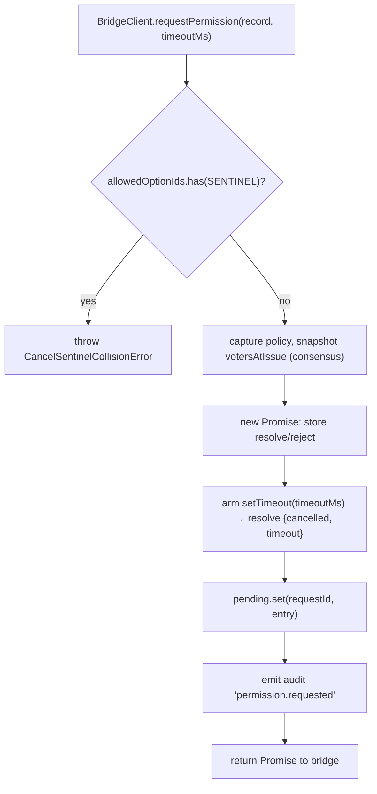
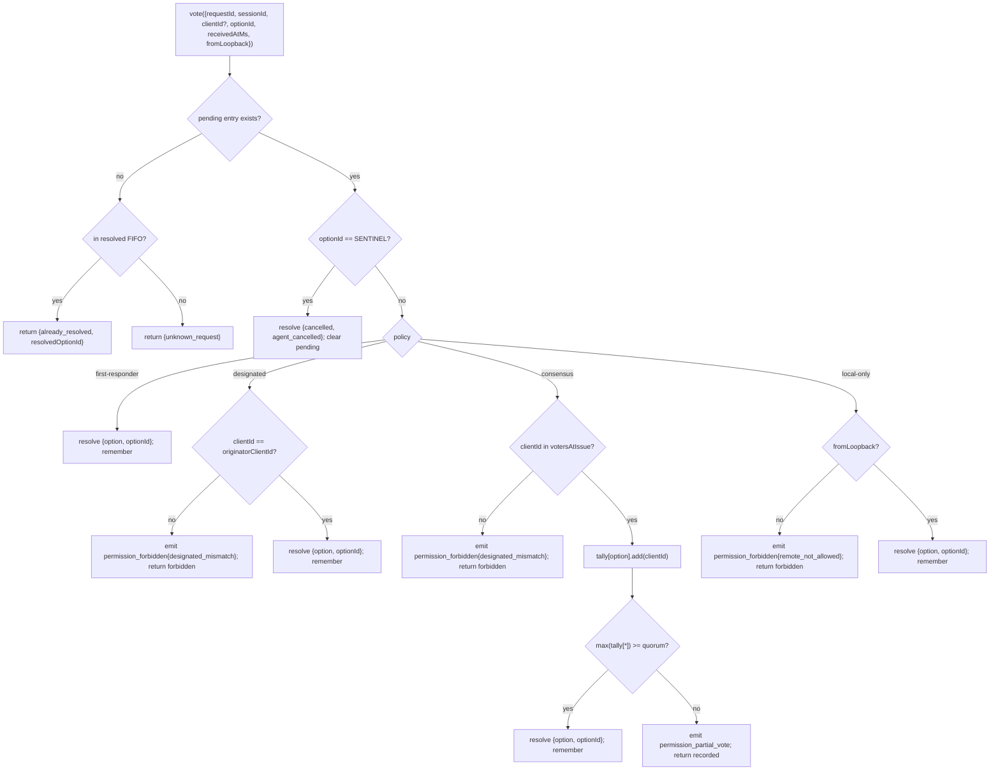

# マルチクライアント権限仲裁

## 概要

ACP チャイルドのエージェントが `requestPermission` を呼び出した場合、デーモンは単一のクライアントに転送するだけではありません。`sessionScope: 'single'` では、接続しているすべてのクライアントがリクエストを受け取り、そのうちのいずれかが応答できます。仲裁がなければ、遅延した投票の送り先がなくなり、2 つのクライアントが同じリクエストで競合し、単一の悪意あるクライアントが発信者を上書きする可能性があります。

`MultiClientPermissionMediator`（`packages/acp-bridge/src/permissionMediator.ts`）は `PermissionMediator` コントラクト（`packages/acp-bridge/src/permission.ts`）を実装し、ブリッジのすべての保留中・解決済み権限状態を管理します。`PermissionPolicy` で宣言された 4 つのポリシーのいずれかを通じて投票をディスパッチします。

| ポリシー          | 解決ルール                                                                                                              | ユースケース                                                         |
| ----------------- | ---------------------------------------------------------------------------------------------------------------------- | -------------------------------------------------------------------- |
| `first-responder` | 最初の有効な投票が勝ち、後続の投票者は `permission_already_resolved` を受け取る。                                      | ライブのクロスクライアント協調 UX（デフォルト）。                    |
| `designated`      | プロンプトの `originatorClientId` のみが解決可能。それ以外は `permission_forbidden{designated_mismatch}` を受け取る。  | UI サーフェスが自身の承認を管理しなければならない、テナント別 SaaS。 |
| `consensus`       | v1 クライアント ID スナップショット全体で N-of-M クォーラム。中間の `permission_partial_vote` イベントで UI が進捗を表示。 | 2 人のオペレーターの合意が必要なエンタープライズの変更レビュー。    |
| `local-only`      | ループバック以外の投票者を拒否。ループバッククライアントが解決するまでブロック。                                        | リモート制御が権限昇格を許可してはならないワークステーション。       |

> **v1 セキュリティ制限**: `X-Qwen-Client-Id` はクライアントが自己申告します。`designated` と
> `consensus` はまだ所有証明を持ちません。`originatorClientId` を観察できるクライアントは
> そのIDを再利用できます。`{outcome:'cancelled'}` もキャンセルセンチネルを経由してから
> ポリシーディスパッチに入るため、`local-only` であってもキャンセルをポリシー保護された
> resolve として扱うことはできません。強固な分離のためには、デーモンをループバックにバインドするか、
> 認証済みリバースプロキシの背後に置いてください。
> [セキュリティノート: v1 クライアント ID は自己申告](#security-note-v1-client-identity-is-self-reported) を参照してください。

## 責務

- 保留中のすべてのリクエストを追跡する（`request → vote → resolved` ライフサイクル）。
- リクエストごとのウォールクロックタイムアウトを有効化・無効化する（**N1 不変条件**: タイムアウトは `request()` 内で同期的に有効化されなければならず、即座にキャンセルされたセッションが永続的に保留中のクロージャをリークしないようにする）。
- `request()` 時点でキャプチャされたポリシーを通じて投票をディスパッチする（デーモンのポリシーをフライト中に変更しても、処理中のリクエストには影響しない）。
- 最近解決されたリクエストの有界 FIFO（`MAX_RESOLVED_PERMISSION_RECORDS = 512`）を維持し、重複した投票が `unknown_request` ではなく構造化された `already_resolved` を受け取れるようにする。
- セッションごとの EventBus に `permission_partial_vote`（consensus）と `permission_forbidden`（designated / consensus / local-only）を発行する。
- セッション終了時に `forgetSession(sessionId)` を通じて保留中のリクエストを `{kind: 'cancelled', reason: 'session_closed'}` として解決する。
- `CANCEL_VOTE_SENTINEL` の悪意あるまたは偶発的な注入を、ワイア経由（`InvalidPermissionOptionError`）とエージェントが公開するオプションラベル経由（`CancelSentinelCollisionError`）の両方で拒否する。

## アーキテクチャ

### パブリックサーフェス

```ts
interface PermissionMediator {
  readonly policy: PermissionPolicy;
  request(
    record: PermissionRequestRecord,
    timeoutMs: number,
  ): Promise<PermissionResolution>;
  vote(vote: PermissionVote): PermissionVoteOutcome;
  forgetSession(sessionId: string): void;
}
```

`MultiClientPermissionMediator` は追加で `peekSessionFor(requestId)`、`pendingCount(sessionId)`、内部監査パブリッシャーなどを提供します。`BridgeClient` は `request()` 側のみに依存します（構造的サブタイピング — `bridgeClient.ts` を参照）。

### `PermissionPolicy` と `PermissionVoteOutcome`

```ts
type PermissionPolicy =
  | 'first-responder'
  | 'designated'
  | 'consensus'
  | 'local-only';

type PermissionVoteOutcome =
  | { kind: 'resolved'; resolvedOptionId: string }
  | { kind: 'recorded'; votesNeeded: number } // consensus partial
  | { kind: 'already_resolved'; resolvedOptionId: string }
  | { kind: 'forbidden'; reason: 'designated_mismatch' | 'remote_not_allowed' }
  | { kind: 'unknown_request' };

type PermissionResolution =
  | { kind: 'option'; optionId: string }
  | {
      kind: 'cancelled';
      reason: 'timeout' | 'session_closed' | 'agent_cancelled';
    };
```

### キャンセルセンチネル

`CANCEL_VOTE_SENTINEL = '__cancelled__'`。ブリッジは投票者の `{outcome:'cancelled'}` を `mediator.vote` を呼び出す**前に**このセンチネルにマッピングします。メディエーターはセンチネルをポリシーディスパッチの**前に**ルーティングします — 投票者によるキャンセルは `clientId` / ループバック / メンバーシップに関係なく、すべてのポリシー下で機能します。2 つのガード:

1. **`bridge.ts`** は `optionId === CANCEL_VOTE_SENTINEL` のワイア投票を `InvalidPermissionOptionError` で拒否します（悪意あるワイアクライアントが `optionId` について虚偽申告してキャンセルを注入できないようにする）。
2. **`mediator.request`** は `allowedOptionIds` にセンチネルを含むレコードを `CancelSentinelCollisionError` で拒否します（`'__cancelled__'` を正当なオプションラベルとして公開するエージェントがなりすましできないようにする）。

このポリシー横断的なエスケープは `permissionMediator.ts` に文書化されており、将来のメンテナーが誤ってバイパスを削除しないようにしています。

### 保留状態

各保留中リクエストは `requestId` をキーとし、以下を保持します:

- `policy` — `request()` 時点でキャプチャ。
- `record: PermissionRequestRecord`（requestId、sessionId、originatorClientId、allowedOptionIds、issuedAtMs）。
- `resolve` / `reject` クロージャ。
- `votesAtIssue`（consensus のみ）— 発行時点でのセッションに登録済み `clientIds` のスナップショット。このセットに含まれない後続の投票は拒否される。
- `tally`（consensus のみ）— オプションごとの投票数を集計する `Map<optionId, Set<clientId>>`。
- `timeoutHandle` — `request()` 内で有効化される Node タイムアウト（N1 不変条件）。
- `auditTrail[]` — 投票ごとの監査レコード。

### 解決済み FIFO

`MAX_RESOLVED_PERMISSION_RECORDS = 512`。削除は `resolvedOrder.shift()` による FIFO（DeepSeek レビュー #4335 / 3271627446 — `PermissionAuditRing` に準拠）。`{requestId, sessionId, outcome}` のみを保存するため、通常の UI 再接続・競合ウィンドウ全体で 512 レコードが 100 KB 以下に収まります。

## ワークフロー

### `request()`（N1 不変条件）



タイマーはエントリが他から参照可能になる**前に**有効化されます。これがないと、`pending.set` と `setTimeout` の間に到着した `forgetSession` がエントリをタイムアウトなしの保留状態のまま残し、ブリッジのセッションごとの `promptQueue` が永久にハングします。

### `vote()` ディスパッチ



### `forgetSession()`

セッションのクローズ、削除、ブリッジのシャットダウン時に呼び出されます。`record.sessionId === sessionId` に一致するすべての保留エントリについて:

1. タイムアウトをキャンセルする。
2. 保留中の Promise を `{kind: 'cancelled', reason: 'session_closed'}` で解決する。
3. 監査レコードを追記する。
4. `pending` から削除する。

ブリッジのセッション終了パスは、チャンネルキルウィンドウの**前に**必ず `forgetSession` を呼び出し、保留中の権限がセッションより長く生き残らないようにします。

## 状態とライフサイクル

- `policy` はリクエストごとにキャプチャされます。デーモン全体のポリシーを変更しても（将来のサーフェス）、処理中のリクエストには影響しません。
- `votesAtIssue`（consensus）は `request()` 時点でキャプチャされます。リクエスト後に到着したクライアントは投票できますが、発行時点でセッションに登録されていなかった `clientId` の投票は `designated_mismatch` として拒否されます。これは意図的に `designated` ポリシーのミスマッチ理由を再利用することでコントラクトを閉じています。SDK 利用者が区別できるようにするため、将来のバージョンではユニオンが分割される可能性があります。
- 解決済みエントリは最大 `MAX_RESOLVED_PERMISSION_RECORDS`（512）件まで FIFO に残ります。削除後に同じ `requestId` への重複投票は `{unknown_request}` を返します。
- `permission_partial_vote` は `consensus` のみ発火します。他のポリシーでは依存しないでください。
- `permission_forbidden` は `designated`、`consensus`、`local-only` で発火します — `first-responder` では発火しません。

## 依存関係

- [`03-acp-bridge.md`](./03-acp-bridge.md) — ブリッジが `BridgeClient.requestPermission` を `mediator.request` に接続する方法。
- [`10-event-bus.md`](./10-event-bus.md) — 部分投票および forbidden フレームがクライアントに到達する方法。
- [`09-event-schema.md`](./09-event-schema.md) — `permission_*` イベントのペイロードコントラクト。
- [`08-session-lifecycle.md`](./08-session-lifecycle.md) — すべてのセッション終了時に `forgetSession()` が呼び出される。
- [`02-serve-runtime.md`](./02-serve-runtime.md) — `PermissionAuditRing`（監査レコードの 512 エントリ FIFO）。

## 設定

| ソース              | 設定項目                                                                                               | 効果                                  |
| ------------------- | ------------------------------------------------------------------------------------------------------ | ------------------------------------- |
| `settings.json`     | `policy.permissionStrategy`                                                                            | アクティブなメディエーターポリシー。  |
| `settings.json`     | `policy.consensusQuorum`                                                                               | consensus の N 値。                   |
| `BridgeOptions`     | `permissionPolicy`, `permissionConsensusQuorum`, `permissionAudit`                                     | プログラムによるオーバーライド。      |
| Capability tag      | `permission_mediation` (always; `modes: ['first-responder', 'designated', 'consensus', 'local-only']`) | ビルドがサポートするセット。          |
| Capability envelope | `policy.permission`                                                                                    | デーモンが現在実行中のアクティブポリシー。 |

`policy.permissionStrategy` が明示的に設定されていない場合、デーモンは
`first-responder` を使用します。`designated`、`consensus`、`local-only` は
`settings.json` で設定した場合のみ有効になります。

## Consensus クォーラム: デフォルト計算式と M=2 のエッジケース

`consensus` ポリシーが有効で `policy.consensusQuorum` が設定されていない場合、
メディエーターは `permissionMediator.ts` の `consensusQuorumFor` を通じて **N = floor(M/2) + 1** を計算します:

```ts
Math.max(1, Math.floor(m / 2) + 1);
```

| M (`votersAtIssue.size`) | デフォルト N | 動作                              |
| ------------------------ | ------------ | --------------------------------- |
| 1                        | 1            | 1 人の投票者が即時解決。          |
| 2                        | 2            | 全員一致が必要。                  |
| 3                        | 2            | 過半数。                          |
| 4                        | 3            | 半数超。                          |
| 5                        | 3            | 過半数。                          |
| 6                        | 4            | 半数超。                          |

**M = 2** の場合、分割投票（A が X を選択、B が Y を選択）は
権限ごとのタイムアウトによってのみ解決できます。どのオプションも全員一致に達しないため、
`permissionResponseTimeoutMs`（デフォルト 5 分）まで待機し、`{cancelled, timeout}` として解決されます。
投票前進パスは、この「全員一致は分割投票がタイムアウトすることを意味する」動作を
オペレーター向けに stderr にログ出力します。

M = 2 で最初の投票が勝つ動作を望むオペレーターは、`policy.consensusQuorum: 1` を
明示的に設定できます。M = 4 で全員一致を要求するなどの厳格な設定も同じフィールドを使用します。

## 起動時のポリシー検証

`runQwenServe.validatePolicyConfig(policyConfig)`
（`packages/cli/src/serve/run-qwen-serve.ts`）は起動時にマージされた `settings.json`
の `policy.*` を検証し、オペレーターの設定ミスに対して `InvalidPolicyConfigError` をスローします:

- `policy.permissionStrategy` が設定されているが、サポートされる 4 つのモードに含まれていない。
  有効なセットは `SERVE_CAPABILITY_REGISTRY.permission_mediation.modes` から実行時に導出され、
  capability advertisement の唯一の信頼できるソースです。
- `policy.consensusQuorum` が設定されているが、正の整数ではない。

`permissionStrategy !== 'consensus'` の場合に `consensusQuorum` が設定されると、
stderr への警告も出力されます。それ以外の場合、オーバーライドは非 consensus ポリシーで
無視されます。

`InvalidPolicyConfigError` は `instanceof` テスト用にエクスポートされています。`runQwenServe`
はこれを使用してオペレーターの設定ミス（明示的な起動失敗として再スロー）と
設定ファイルの読み取り I/O エラー（デフォルトにフォールバック）を区別します。

## セキュリティノート: v1 クライアント ID は自己申告

`X-Qwen-Client-Id` は HTTP クライアントが提供します。v1 では、デーモンは
フォーマット（`[A-Za-z0-9._:-]{1,128}`）を検証し、`clientIds` で接続済みのクライアント ID を
追跡しますが、所有証明は実施しません。SSE で `originatorClientId` を観察できるクライアントは
同じ ID で登録し、後続のリクエストでその発信者になりすますことができます。

ポリシーへの影響:

- **`first-responder`** は ID に依存しないため影響を受けない。
- **`designated`** は `originatorClientId` を再利用するリモートクライアントによってなりすましが可能。
- **`consensus`** は発行時の `votersAtIssue` スナップショットでゲートする。なりすました ID が
  リクエスト発行時にすでに接続されていれば、投票できる。
- **`local-only`** は `fromLoopback: boolean` がクライアントから提供されるのではなく、
  デーモンが接続のリモートアドレスからスタンプするため、ID なりすましに対して耐性がある。

将来のペアトークン機構は `POST /session` からセッションごとのシークレットを発行し、
`designated` / `consensus` 投票にそれを要求する予定です。この機構は v1 には存在しません。

## 注意事項と既知の制限

- **キャンセルセンチネルはポリシーディスパッチの前にルーティングされる**（設計上）— `local-only` デーモンと `consensus` デーモンはどちらも `{outcome: 'cancelled'}` を送信する任意の投票者によってキャンセルできます。これは `permissionMediator.ts` に文書化されており、エージェント側の中断パスです。
- **`designated` と `consensus` は `PermissionVoteOutcome` の `designated_mismatch` を共有する**。メディエーターは別々の監査レコードを発行しますが、ワイアの形状は単一です。将来のプロトコルバージョンではユニオンが分割される可能性があります。
- **匿名投票者（`X-Qwen-Client-Id` なし）** は `first-responder` と `local-only`（ループバック）のみで受け入れられます。`designated` と `consensus` は拒否します。
- **クロスポリシーエスケープハッチ**はキャンセルをポリシーでゲートできないことを意味します。デプロイメントがポリシーゲートされたキャンセルを必要とする場合、それは将来のコントラクト変更となります — ルートレベルのチェックでパッチを当てないでください。
- **`votesAtIssue` スナップショットのセマンティクス**は、クライアントセットが頻繁に変わる consensus デプロイメントで、リクエスト発行後に接続した正当なクライアントが拒否される可能性を意味します。オペレーターは変更レビュープロンプトを発行する前に、協力者のクライアント ID を事前登録しておく必要があります。

## 参考資料

- `packages/acp-bridge/src/permission.ts`（フリーズされたコントラクト）
- `packages/acp-bridge/src/permissionMediator.ts`（F3 メディエーター実装）
- `packages/acp-bridge/src/bridgeClient.ts`（`PermissionMediator` の構造的サブタイピングを使用）
- `packages/acp-bridge/src/bridgeErrors.ts`（`CancelSentinelCollisionError`、`InvalidPermissionOptionError`、`PermissionForbiddenError`）
- `packages/cli/src/serve/permission-audit.ts`（監査リング + パブリッシャー）
- Issue: [#4175](https://github.com/QwenLM/qwen-code/issues/4175) F3 シリーズ。
