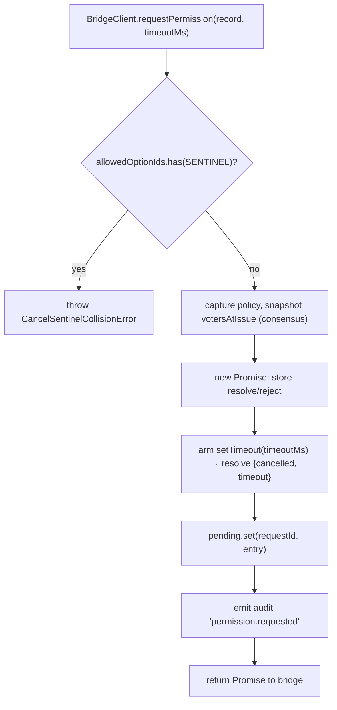

# マルチクライアント権限調停

## 概要

ACP 子エージェントが `requestPermission` を呼び出すと、デーモンは単に1つのクライアントに転送するわけではありません。`sessionScope: 'single'` のもとでは、接続されているすべてのクライアントがリクエストを確認でき、いずれも応答できます。調停がない場合、遅れて到着した投票の行き場がなくなり、2つのクライアントが同じリクエストを競合し、単一の不正なクライアントが発信元を上書きできてしまいます。

`MultiClientPermissionMediator` (`packages/acp-bridge/src/permissionMediator.ts`) は `PermissionMediator` コントラクト (`packages/acp-bridge/src/permission.ts`) を実装し、ブリッジのすべての保留中および解決済みの権限状態を保持します。`PermissionPolicy` で宣言された4つのポリシーのいずれかを通じて投票をディスパッチします。

| ポリシー            | 解決ルール                                                                                             | ユースケース                                                                |
| ----------------- | ------------------------------------------------------------------------------------------------------ | --------------------------------------------------------------------------- |
| `first-responder` | 最初の有効な投票が勝ち。後続の投票者は `permission_already_resolved` を受け取る。                      | ライブなクライアント間コラボレーションUX（デフォルト）。                   |
| `designated`      | プロンプトの `originatorClientId` のみが解決可能。それ以外は `permission_forbidden{designated_mismatch}` を受け取る。 | マルチテナントSaaSで、UI画面が自身の承認を所有しなければならない場合。 |
| `consensus`       | v1 クライアントIDスナップショットに対する N/M クォーラム。中間の `permission_partial_vote` イベントで UI が進捗を表示可能。 | エンタープライズ変更レビューで、2人のオペレーターが同意する必要がある場合。 |
| `local-only`      | ループバック以外の投票者を拒否。ループバッククライアントが解決するまでブロック。                     | リモート制御が特権昇格を決して許可してはならないワークステーション。       |

> **v1 のセキュリティ制限**: `X-Qwen-Client-Id` は自己申告です。`designated` と
> `consensus` はまだ proof-of-possession を実装していません。
> `originatorClientId` を観測したクライアントはそのIDを再利用できます。
> `{outcome:'cancelled'}` もポリシーディスパッチ前にキャンセルセンチネルを経由するため、
> `local-only` でもキャンセルをポリシー保護された解決として扱うことはできません。
> 強い分離が必要な場合は、デーモンをループバックにバインドするか、
> 認証付きリバースプロキシの背後に配置してください。
> [セキュリティノート: v1 クライアントID は自己申告です](#セキュリティーノート-v1-クライアントid-は自己申告です)

## 責務

- すべての保留中リクエストの追跡（`request → vote → resolved` ライフサイクル）。
- リクエストごとの壁時計タイムアウトの準備と解除（**N1 不変条件**: タイムアウトは `request()` 内で同期的に準備されなければならず、すぐにキャンセルされたセッションが永久に保留状態をリークしないようにする）。
- `request()` 時に取得したポリシーを通じて投票をディスパッチする（デーモンポリシーを途中で変更しても、進行中のリクエストには影響しない）。
- 最近解決されたリクエストの有界 FIFO（`MAX_RESOLVED_PERMISSION_RECORDS = 512`）を維持し、重複投票が `unknown_request` ではなく構造化された `already_resolved` を得るようにする。
- `permission_partial_vote`（コンセンサス）と `permission_forbidden`（designated / consensus / local-only）をセッションごとの EventBus に発行する。
- セッションティアダウン時に `forgetSession(sessionId)` 経由で保留中リクエストを `{kind: 'cancelled', reason: 'session_closed'}` として解決する。
- ワイヤ経由での `CANCEL_VOTE_SENTINEL` の悪意ある注入または偶発的な注入（`InvalidPermissionOptionError`）と、エージェントが公開するオプションラベル経由での注入（`CancelSentinelCollisionError`）を拒否する。

## アーキテクチャ

### 公開インターフェース

```ts
interface PermissionMediator {
  readonly policy: PermissionPolicy;
  request(
    record: PermissionRequestRecord,
    timeoutMs: number,
  ): Promise<PermissionResolution>;
  vote(vote: PermissionVote): PermissionVoteOutcome;
  forgetSession(sessionId: string): void;
}
```

`MultiClientPermissionMediator` は以下を追加: `peekSessionFor(requestId)`, `pendingCount(sessionId)`, 内部監査パブリッシャーなど。`BridgeClient` は `request()` 部分のみに依存します（構造的サブタイピング — `bridgeClient.ts` 参照）。

### `PermissionPolicy` と `PermissionVoteOutcome`

```ts
type PermissionPolicy =
  | 'first-responder'
  | 'designated'
  | 'consensus'
  | 'local-only';

type PermissionVoteOutcome =
  | { kind: 'resolved'; resolvedOptionId: string }
  | { kind: 'recorded'; votesNeeded: number } // コンセンサス部分
  | { kind: 'already_resolved'; resolvedOptionId: string }
  | { kind: 'forbidden'; reason: 'designated_mismatch' | 'remote_not_allowed' }
  | { kind: 'unknown_request' };

type PermissionResolution =
  | { kind: 'option'; optionId: string }
  | {
      kind: 'cancelled';
      reason: 'timeout' | 'session_closed' | 'agent_cancelled';
    };
```

### キャンセルセンチネル

`CANCEL_VOTE_SENTINEL = '__cancelled__'`。ブリッジは投票者 `{outcome:'cancelled'}` を **`mediator.vote` を呼び出す前に** このセンチネルにマッピングします。メディエーターはセンチネルを **ポリシーディスパッチの前に** ルーティングします — 投票者によるキャンセルは、`clientId` / ループバック / メンバーシップに関係なくすべてのポリシーで機能します。2つのガード:

1. **`bridge.ts`** は `optionId === CANCEL_VOTE_SENTINEL` であるワイヤ投票を `InvalidPermissionOptionError` で拒否します（悪意のあるワイヤクライアントが `optionId` を偽ってキャンセルを注入できないようにする）。
2. **`mediator.request`** は `allowedOptionIds` にセンチネルが含まれるレコードを `CancelSentinelCollisionError` で拒否します（エージェントがオプションラベルとして `'__cancelled__'` を正当に公開してもなりすましできないようにする）。

この意図的なクロスポリシーエスケープは `permissionMediator.ts` に文書化されており、将来のメンテナがバイパスを誤って削除しないようにしています。

### 保留中状態

各保留中リクエストは `requestId` でキー付けされ、以下を保持します:

- `policy` — `request()` 時に取得。
- `record: PermissionRequestRecord` (requestId, sessionId, originatorClientId, allowedOptionIds, issuedAtMs)。
- `resolve` / `reject` クロージャ。
- `votesAtIssue`（コンセンサスのみ） — 発行時のセッション登録 `clientIds` のスナップショット。後続の投票はこのセットに含まれない場合は拒否される。
- `tally`（コンセンサスのみ） — `Map<optionId, Set<clientId>>` でオプションごとの投票をカウント。
- `timeoutHandle` — `request()` 内で準備される Node タイムアウト（N1 不変条件）。
- `auditTrail[]` — 投票ごとの監査レコード。

### 解決済み FIFO

`MAX_RESOLVED_PERMISSION_RECORDS = 512`。削除は `resolvedOrder.shift()` による FIFO（DeepSeek review #4335 / 3271627446 — `PermissionAuditRing` をミラー）。`{requestId, sessionId, outcome}` のみを保存するため、通常のUI再接続/競合ウィンドウにおいて512レコードでも100 KB未満に収まる。

## ワークフロー

### `request()` (N1 不変条件)



タイマーはエントリが他の場所から見えるようになる **前に** 準備されます。これがないと、`forgetSession` が `pending.set` と `setTimeout` の間に到着した場合、エントリがタイムアウトなしで保留状態のままになり、ブリッジのセッションごとの `promptQueue` が永久にハングします。

### `vote()` ディスパッチ

```mermaid
flowchart TD
    V["vote({requestId, sessionId, clientId?, optionId, receivedAtMs, fromLoopback})"] --> E{"pending entry exists?"}
    E -->|no| RD{"in resolved FIFO?"}
    RD -->|yes| AR["return {already_resolved, resolvedOptionId}"]
    RD -->|no| UR["return {unknown_request}"]
    E -->|yes| SENT{"optionId == SENTINEL?"}
    SENT -->|yes| CX["resolve {cancelled, agent_cancelled}; clear pending"]
    SENT -->|no| POL{"policy"}
    POL -->|first-responder| FR["resolve {option, optionId}; remember"]
    POL -->|designated| DG{"clientId == originatorClientId?"}
    DG -->|no| FOR["emit permission_forbidden{designated_mismatch}; return forbidden"]
    DG -->|yes| FRR["resolve {option, optionId}; remember"]
    POL -->|consensus| CN{"clientId in votersAtIssue?"}
    CN -->|no| FORC["emit permission_forbidden{designated_mismatch}; return forbidden"]
    CN -->|yes| TAL["tally[option].add(clientId)"]
    TAL --> Q{"max(tally[*]) >= quorum?"}
    Q -->|yes| RES["resolve {option, optionId}; remember"]
    Q -->|no| PV["emit permission_partial_vote; return recorded"]
    POL -->|local-only| LO{"fromLoopback?"}
    LO -->|no| FORL["emit permission_forbidden{remote_not_allowed}; return forbidden"]
    LO -->|yes| RESL["resolve {option, optionId}; remember"]
```



### `forgetSession()`

セッションクローズ、削除、ブリッジシャットダウン時に呼び出されます。`record.sessionId === sessionId` であるすべての保留中エントリに対して:

1. タイムアウトをキャンセル。
2. 保留中の Promise を `{kind: 'cancelled', reason: 'session_closed'}` で解決。
3. 監査レコードを追加。
4. `pending` から削除。

ブリッジのセッションティアダウンパスは、チャネルキルウィンドウの前に常に `forgetSession` を呼び出すため、保留中の権限がセッションよりも長く存続することはありません。

## 状態とライフサイクル

- `policy` はリクエストごとに取得されます。デーモン全体のポリシーを変更しても（将来のインターフェース）、進行中のリクエストには影響しません。
- `votesAtIssue`（コンセンサス）は `request()` 時に取得されます。リクエスト後に到着したクライアントも投票できますが、その `clientId` が発行時にセッションに登録されていなかった場合、投票は `designated_mismatch` として拒否されます。これは意図的に `designated` ポリシーの不一致理由を再利用してコントラクトを閉じたままにしています。将来のバージョンでは、SDK コンシューマが区別する必要がある場合にユニオンを分割する可能性があります。
- 解決済みエントリは最大 `MAX_RESOLVED_PERMISSION_RECORDS` (512) まで FIFO に残ります。削除後、同じ `requestId` の重複投票は `{unknown_request}` を返します。
- `permission_partial_vote` は `consensus` でのみ発火します。他のポリシーではこれに依存しないでください。
- `permission_forbidden` は `designated`、`consensus`、`local-only` で発火します — `first-responder` では発火しません。

## 依存関係

- [`03-acp-bridge.md`](./03-acp-bridge.md) — ブリッジが `BridgeClient.requestPermission` を `mediator.request` に配線する方法。
- [`10-event-bus.md`](./10-event-bus.md) — 部分投票と禁止フレームがクライアントに到達する方法。
- [`09-event-schema.md`](./09-event-schema.md) — `permission_*` イベントのペイロードコントラクト。
- [`08-session-lifecycle.md`](./08-session-lifecycle.md) — `forgetSession()` はすべてのセッション終了時に呼び出される。
- [`02-serve-runtime.md`](./02-serve-runtime.md) — `PermissionAuditRing`（512エントリのFIFO監査レコード）。

## 設定

| ソース              | 設定項目                                                                                               | 効果                                 |
| ------------------- | ------------------------------------------------------------------------------------------------------ | ------------------------------------ |
| `settings.json`     | `policy.permissionStrategy`                                                                            | アクティブなメディエーターポリシー。 |
| `settings.json`     | `policy.consensusQuorum`                                                                               | コンセンサスの N。                   |
| `BridgeOptions`     | `permissionPolicy`, `permissionConsensusQuorum`, `permissionAudit`                                     | プログラムによるオーバーライド。     |
| 機能タグ            | `permission_mediation`（常時; `modes: ['first-responder', 'designated', 'consensus', 'local-only']`） | ビルドでサポートされるセット。       |
| 機能エンベロープ    | `policy.permission`                                                                                    | このデーモンが実行中のアクティブポリシー。 |

`policy.permissionStrategy` が明示的に設定されていない場合、デーモンは `first-responder` を使用します。`designated`、`consensus`、`local-only` は `settings.json` で設定された場合のみ有効になります。

## コンセンサスクォーラム: デフォルトの計算式と M=2 のエッジケース

`consensus` ポリシーがアクティブで `policy.consensusQuorum` が設定されていない場合、メディエーターは `permissionMediator.ts` の `consensusQuorumFor` で **N = floor(M/2) + 1** を計算します:

```ts
Math.max(1, Math.floor(m / 2) + 1);
```

| M (`votersAtIssue.size`) | デフォルト N | 動作                        |
| ------------------------ | ----------- | ----------------------------- |
| 1                        | 1           | 1投票で即解決。              |
| 2                        | 2           | 全員一致が必要。             |
| 3                        | 2           | 過半数。                     |
| 4                        | 3           | 半分超。                     |
| 5                        | 3           | 過半数。                     |
| 6                        | 4           | 半分超。                     |

**M = 2** の場合、投票が分かれると（AはX、BはYを選択）、権限タイムアウトによってのみ解決可能です: どのオプションも全員一致に達しないため、リクエストは `permissionResponseTimeoutMs`（デフォルト5分）まで待機し、`{cancelled, timeout}` として解決されます。投票進行パスはこの「全員一致＝分割投票はタイムアウト」という動作を stderr にログ出力します。

M = 2 で最初の投票が勝つ動作を望むオペレーターは、`policy.consensusQuorum: 1` を明示的に設定できます。M = 4 で全員一致を要求するなど、より厳格な設定も同じフィールドを使用します。

## 起動時ポリシー検証

`runQwenServe.validatePolicyConfig(policyConfig)`
(`packages/cli/src/serve/run-qwen-serve.ts`) は起動時にマージされた `settings.json` の `policy.*` を検証し、オペレーターのミスの場合に `InvalidPolicyConfigError` をスローします:

- `policy.permissionStrategy` が設定されているが、4つのサポートモードのいずれでもない。有効なセットは実行時に `SERVE_CAPABILITY_REGISTRY.permission_mediation.modes` から導出されます。これは機能アドバタイズの単一情報源です。
- `policy.consensusQuorum` が設定されているが、正の整数ではない。

また、`permissionStrategy !== 'consensus'` の場合に `consensusQuorum` が設定されていると、ソフトな stderr 警告が出ます。このオーバーライドは非コンセンサスポリシーでは無視されるためです。

`InvalidPolicyConfigError` は `instanceof` テストのためにエクスポートされています。`runQwenServe` はこれを使用して、オペレーターの設定ミス（明示的な起動失敗として再スローされる）と、設定読み取りの I/O 障害（デフォルトにフォールバック）を区別します。

## セキュリティノート: v1 クライアントID は自己申告です

`X-Qwen-Client-Id` は HTTP クライアントによって提供されます。v1 では、デーモンはフォーマット（`[A-Za-z0-9._:-]{1,128}`）を検証し、接続されたクライアントIDを `clientIds` で追跡しますが、proof-of-possession は実行しません。SSE で `originatorClientId` を観測できるクライアントは、同じIDで登録し、後続のリクエストでその発信元になりすますことができます。

ポリシーへの影響:

- **`first-responder`** は影響を受けません。IDに依存しないためです。
- **`designated`** は、リモートクライアントが `originatorClientId` を再利用することでなりすまされる可能性があります。
- **`consensus`** は発行時の `votersAtIssue` スナップショットでゲートされます。なりすましIDがリクエスト発行時に既にアタッチされていれば、投票できます。
- **`local-only`** はIDなりすましに対して免疫があります。`fromLoopback: boolean` はクライアントから提供されるものではなく、デーモンが接続のリモートアドレスからスタンプするためです。

将来のペアトークンメカニズムでは、`POST /session` からセッションごとのシークレットを発行し、`designated` / `consensus` 投票でそれを要求する予定です。そのメカニズムは v1 には存在しません。

## 注意事項と既知の制限

- **キャンセルセンチネルはポリシーディスパッチの前にルーティングされる** のは設計上のものです — `local-only` デーモンと `consensus` デーモンの両方が、`{outcome: 'cancelled'}` を投稿した任意の投票者によってキャンセルされる可能性があります。これは `permissionMediator.ts` に文書化されており、エージェント側のアボートパスです。
- **`designated` と `consensus` は `PermissionVoteOutcome` で `designated_mismatch` をオーバーロード** しています。メディエーターは個別の監査レコードを発行しますが、ワイヤ形状は単一です。将来のプロトコルバージョンではユニオンを分割する可能性があります。
- **匿名投票者（`X-Qwen-Client-Id` なし）** は `first-responder` と `local-only`（ループバック）でのみ受け入れられます。`designated` と `consensus` は拒否します。
- **クロスポリシーエスケープハッチ** により、キャンセルをポリシーでゲートすることはできません。デプロイメントでポリシーゲート付きキャンセルが必要な場合、それは将来のコントラクト変更になります — ルートレベルのチェックでごまかさないでください。
- **`votesAtIssue` スナップショットのセマンティクス** により、クライアントセットが変動するコンセンサスデプロイメントでは、リクエスト発行後に接続した正当なクライアントが拒否される可能性があります。オペレーターは変更レビュープロンプトを発行する前に、協力クライアントIDを事前登録する必要があります。

## 参考

- `packages/acp-bridge/src/permission.ts`（固定コントラクト）
- `packages/acp-bridge/src/permissionMediator.ts`（F3 メディエーター実装）
- `packages/acp-bridge/src/bridgeClient.ts`（`PermissionMediator` に構造的サブタイピングを使用）
- `packages/acp-bridge/src/bridgeErrors.ts`（`CancelSentinelCollisionError`、`InvalidPermissionOptionError`、`PermissionForbiddenError`）
- `packages/cli/src/serve/permission-audit.ts`（監査リング + パブリッシャー）
- Issue: [#4175](https://github.com/QwenLM/qwen-code/issues/4175) F3 シリーズ。