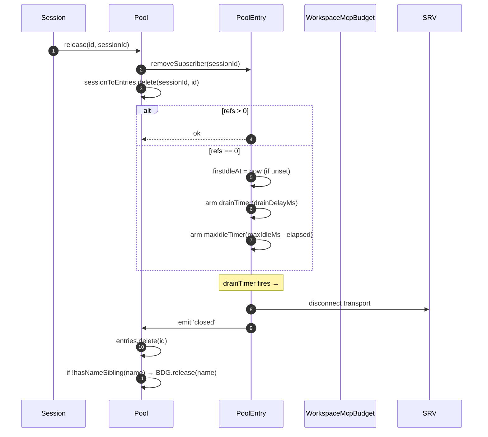
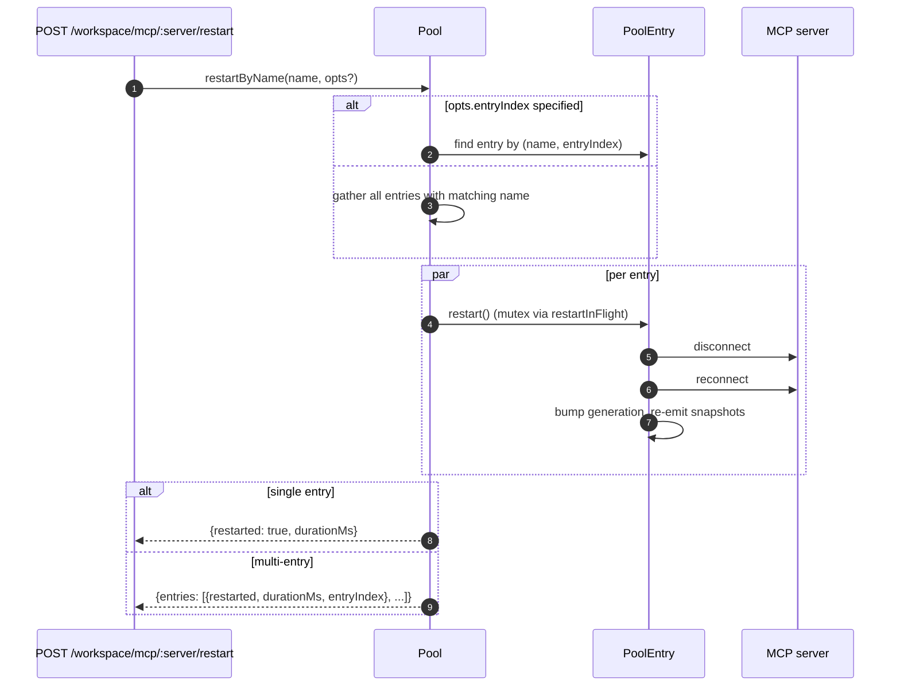
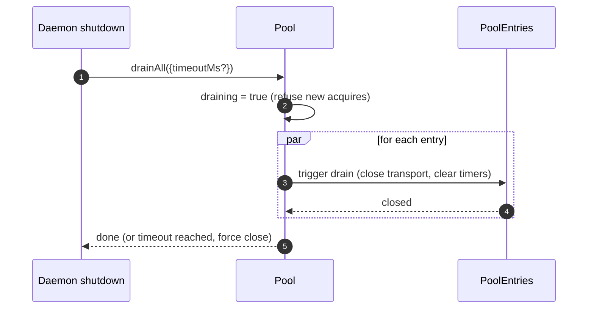

# ワークスペース MCP トランスポートプール

## 概要

`McpTransportPool`（`packages/core/src/tools/mcp-transport-pool.ts`）は F2（#4175 コミット 5）のワークスペーススコープのプールです。1 つのデーモン上の複数の ACP セッションが、ユニークな `(serverName + configFingerprint)` タプルごとに 1 つのトランスポートを共有し、セッションごとに MCP 子プロセスをスポーンしません。プールは **ACP 子プロセス内**（`QwenAgent.mcpPool`）に存在し、デーモンのブートストラップ `Config` を使用してエージェント起動時に一度構築され、セッションのライフサイクルを超えて存続します。エントリはセッションのアタッチを参照カウントし、参照カウントがゼロになると設定可能なグレース期間後にクローズします。

これは、マルチセッションデーモンがセッションごとに MCP サーバのコピーをフォークするのを防ぐ主なメカニズムです。

## 責務

- `(name + fingerprint)` ごとに 1 つの MCP トランスポートを取得またはスポーンし、`spawnInFlight` を通じた同時取得を排除する。
- セッションごとの参照を解放し、最後の参照がデタッチされたときにエントリのドレインタイマーを起動する。
- ハードな `MAX_IDLE_MS` 上限により参照カウントの激しい変動に対応し、スラッシングするクライアントがアイドルトランスポートを永久に保持できないようにする。
- `sessionToEntries` の逆インデックスにセッションを参照カウントし、`releaseSession(sessionId)` が O(エントリ数) ではなく O(参照数) で動作するようにする。
- オンデマンドでエントリを再起動する（`restartByName`）。シングルエントリは `{restarted, durationMs}` を返し、マルチエントリは `{entries: RestartResult[]}` を返す（F2 マルチエントリ契約）。
- 設定可能なタイムアウトでデーモンシャットダウン時にプール全体をドレインし、ドレイン中は新しい取得を拒否する。
- `acquire` 時に `WorkspaceMcpBudget`（[`06-mcp-budget-guardrails.md`](./06-mcp-budget-guardrails.md) 参照）を参照して名前ごとの予約上限を適用し、同名の兄弟エントリが存在しない場合はエントリのクローズ時にスロットを解放する。
- `SessionMcpView` を通じてセッションごとのフィルタリングされたツール/プロンプトスナップショットを提供し、1 つのセッションでの検出が他のセッションにツールを登録しないようにする。

## アーキテクチャ

### 公開インターフェース

```ts
class McpTransportPool {
  constructor(cliConfig: Config, options: McpTransportPoolOptions);
  acquire(
    serverName,
    cfg,
    sessionId,
    sessionToolRegistry,
    sessionPromptRegistry,
  ): Promise<PooledConnection>;
  release(id, sessionId): void;
  releaseSession(sessionId): void;
  restartByName(
    name,
    opts?,
  ): Promise<RestartResult | { entries: RestartResult[] }>;
  drainAll(opts?): Promise<void>;
  getBudget(): WorkspaceMcpBudget | undefined;
  getSnapshot(): McpPoolSnapshot;
}
```

`McpTransportPoolOptions`:

- `workspaceContext: WorkspaceContext`（必須）。
- `debugMode: boolean`。
- `sendSdkMcpMessage?` — セッションごとのコールバック（プールは SDK MCP をバイパスする）。
- `pooledTransports?: ReadonlySet<McpTransportKind>` — デフォルトは `{stdio, websocket}`。HTTP/SSE トランスポートはヘッダにセッション固有の OAuth 状態を持つ可能性があるためデフォルトではプール外だが、オペレータは `QWEN_SERVE_MCP_POOL_TRANSPORTS` を使って明示的にプールに含めることができる。
- `drainDelayMs?` — デフォルト `30_000`。
- `entryOptions?: (transport) => PoolEntryOptions`。
- `budget?: WorkspaceMcpBudget`。

### 内部状態

| 状態               | 型                                      | 目的                                                                                                 |
| ------------------ | --------------------------------------- | ---------------------------------------------------------------------------------------------------- |
| `entries`          | `Map<ConnectionId, PoolEntry>`          | `connectionIdOf(name, fingerprint)` をキーとするライブプールエントリ。                               |
| `unpooledIds`      | `Set<ConnectionId>`                     | 設定された `pooledTransports` 許可リスト外のトランスポートのエントリ。                               |
| `spawnInFlight`    | `Map<ConnectionId, Promise<PoolEntry>>` | 同じキーに対する同時コールドアクワイアを排除する。                                                   |
| `sessionToEntries` | `Map<string, Set<ConnectionId>>`        | O(参照数) の `releaseSession` のための V21-2 逆インデックス。                                        |
| `draining`         | `boolean`                               | ドレインミューテックス — 一度設定されると、すべての `acquire` 呼び出しを拒否する。                   |
| `nextIndexByName`  | `Map<string, number>`                   | サーバ名ごとの V21-7 モノトニックな `entryIndex`（新しいエントリが現れてもダッシュボードが並び替わらない）。 |

### `PoolEntry`（エントリごとの構造、`mcp-pool-entry.ts`）

ステートマシン: `spawning → active ⇄ (active ↔ reconnect) → (active → draining on last detach, draining → active on attach OR draining → closed on timer)`。

| フィールド                                             | 目的                                                                              |
| ------------------------------------------------------ | --------------------------------------------------------------------------------- |
| `localStatus: MCPServerStatus`                         | `MCPServerStatus` のライフサイクルによって駆動される。                            |
| `state: PoolEntryState`                                | `spawning`/`active`/`draining`/`closed`/`failed`。                                |
| `generation: number`                                   | 各再起動時にインクリメントされ、サブスクライバが再接続サイクルを検出するために比較する。 |
| `refs: Set<string>`                                    | 現在アタッチされているセッション ID。                                             |
| `subscribers: Map<string, SessionMcpView>`             | セッションごとのフィルタリングされたビュー。                                      |
| `subscriberHandles: Map<string, PooledConnectionImpl>` | `acquire` から返されるハンドル。                                                  |
| `toolsSnapshot[], promptsSnapshot[]`                   | プールレベルの正規スナップショット。`toolsChanged` / `promptsChanged` で再発行される。 |
| `drainTimer?`                                          | `refs.size === 0` のときに起動される。デフォルト 30 秒。アタッチ時にリセットされる。 |
| `maxIdleTimer?`                                        | 最初のアイドル時に起動され、取得/解放の変動によってリセットされない。デフォルト 5 分。 |
| `firstIdleAt?`                                         | 最大アイドルハード上限のウォーターマーク。                                        |
| `restartInFlight?`                                     | `restart()` のミューテックス。                                                    |

### `PoolEntryOptions`

```ts
interface PoolEntryOptions {
  drainDelayMs: number; // default 30_000
  maxIdleMs: number; // default 5 * 60_000
  maxReconnectAttempts: number; // default 3 (stdio/ws) or 5 (http/sse)
  reconnectStrategy:
    | { kind: 'fixed'; delayMs: number }
    | { kind: 'exponential'; baseMs: number; capMs: number };
}
```

`defaultPoolEntryOptions(transport)`（`mcp-pool-entry.ts`）は stdio/ws のデフォルト `{fixed 5s, 3 attempts}` と http/sse のデフォルト `{exponential 1s → 16s, 5 attempts}` を返します。リモートトランスポートは障害が一時的なことが多いため、より長いリトライ予算が割り当てられます。

## ワークフロー

### `acquire`

```mermaid
sequenceDiagram
    autonumber
    participant S as Session
    participant P as Pool
    participant SIF as spawnInFlight
    participant E as PoolEntry
    participant BDG as WorkspaceMcpBudget
    participant SRV as MCP server

    S->>P: acquire(name, cfg, sessionId, sessionToolRegistry, sessionPromptRegistry)
    P->>P: refuse if draining
    P->>P: connectionId = connectionIdOf(name, fingerprint)
    P->>P: if !isPoolable(cfg) → mark unpooled
    alt entry in entries (warm)
        E-->>P: existing PoolEntry
    else inflight cold spawn
        SIF-->>P: existing Promise<PoolEntry>
    else cold start
        P->>BDG: tryReserve(name) (if budget set + poolable)
        BDG-->>P: 'reserved' | 'already_held' | 'refused'
        alt refused
            P->>BDG: recordRefusal(name, transport)
            P-->>S: BudgetExhaustedError
        else ok
            P->>E: spawnEntry(name, cfg)
            E->>SRV: connect transport
            SRV-->>E: ready
            P->>P: entries.set(id, E); nextIndexByName++
            E-->>P: connected
        end
    end
    P->>E: addSubscriber(sessionId, sessionToolRegistry, sessionPromptRegistry)
    P->>P: sessionToEntries.add(sessionId, id)
    P->>P: cancel drain timer (refs>0)
    P-->>S: PooledConnection { id, serverName, entryIndex, client, toolsSnapshot, promptsSnapshot, on, off, release }
```

### `release` とドレイン



`hasNameSibling(name)`（`mcp-transport-pool.ts`）は `entries.values()` と `spawnInFlight.keys()` の両方をイテレートし、後者を `parseConnectionId` でパースします（MCP サーバ名は合法的に `::` を含む可能性があるため、`${name}::` で始まる兄弟名に対して `startsWith` では誤検知が発生する）。

`releaseSession(sessionId)` は `sessionToEntries` から読み取り、参照されているすべてのエントリを O(参照数) で解放し、インデックスエントリをクリアします。ブリッジのセッションクローズパスで使用され、エントリマップ全体をイテレートしないようにします。

### `restartByName`



デーモン HTTP レイヤでのプリフライトバジェットチェックは、対象のスロットがまだ予約されておらず、再起動によってライブカウントが `enforce` バジェットを超える場合、`{restarted:false, skipped:true, reason:'budget_would_exceed'}`（Wave 4 ミューテーション制御）を返します。

### `drainAll`



## 状態とライフサイクル

- プールの構築は同期的で、最初の `acquire` でトランスポートのコールドスタートが行われます。
- `drainDelayMs`（デフォルト 30 秒）はアタッチ時にキャンセルにリセットされます。
- `maxIdleMs`（デフォルト 5 分）はアタッチ/デタッチによって**一切**リセットされません。最初のアイドル時からカウントが始まり、エントリが実際にクローズするか期限前にアタッチされた場合にのみ停止します。スラッシングするクライアントに対する防御です。
- `nextIndexByName` はモノトニックです。古いエントリは新しいエントリが現れても割り当てられたインデックスを保持するため、`entryIndex` を読み取るダッシュボードが並び替わりません。
- スポーン失敗時は予約済みバジェットスロットが解放されます（V21-4 — これがないと、接続途中でクラッシュしたコールドスポーンが予約を永久にリークし続ける）。

## 依存関係

- `packages/core/src/tools/mcp-client.ts` — `McpClient`、ステータス列挙型、`SendSdkMcpMessage`。
- `packages/core/src/tools/mcp-pool-entry.ts` — `PoolEntry`、`PoolEntryOptions`、`defaultPoolEntryOptions`。
- `packages/core/src/tools/mcp-pool-key.ts` — `connectionIdOf`、`parseConnectionId`、`isPoolable`、`mcpTransportOf`、`POOLED_TRANSPORTS_DEFAULT`。
- `packages/core/src/tools/mcp-pool-events.ts` — `ConnectionId`、`PoolEntryState`、`PoolEvent`。
- `packages/core/src/tools/session-mcp-view.ts` — プールスナップショットをフィルタリングするセッションごとのビュー。
- `packages/core/src/tools/mcp-workspace-budget.ts` — `WorkspaceMcpBudget`（[`06-mcp-budget-guardrails.md`](./06-mcp-budget-guardrails.md) 参照）。
- `packages/core/src/tools/mcp-discovery-timeout.ts` — `discoveryTimeoutFor`、`runWithTimeout`。

## 設定

| ソース                   | 設定項目                                                        | 効果                                                                                                      |
| ------------------------ | --------------------------------------------------------------- | --------------------------------------------------------------------------------------------------------- |
| 環境変数                 | `QWEN_SERVE_NO_MCP_POOL=1`                                      | キルスイッチ — `QwenAgent.mcpPool` が undefined のまま。セッションごとの `McpClientManager` が適用される（F2 以前のパス）。 |
| フラグ                   | `--mcp-client-budget=N`、`--mcp-budget-mode={off,warn,enforce}` | `childEnvOverrides` 経由で ACP 子プロセスに転送され、子プロセスが `WorkspaceMcpBudget` を構築してプールに渡す。 |
| ケーパビリティタグ（条件付き） | `mcp_workspace_pool`、`mcp_pool_restart`                        | プールが有効な場合に一緒にアドバタイズされる。SDK はプール対応のレスポンス形状に分岐するためにこれらを事前チェックする。 |

### プール外エントリ（HTTP / SSE / SDK-MCP）

設定された `pooledTransports` 許可リスト外のトランスポート（デフォルトでは HTTP、SSE、SDK-MCP）は別のパスをたどります。`createUnpooledConnection(name, cfg, sessionId, ...)`（`mcp-transport-pool.ts`）は `${name}::unpooled-${entryIndex}` という ID でセッションごとのエントリを作成します。プール済みエントリとの違い:

- `entries` に保存され、**かつ** `unpooledIds: Set<ConnectionId>` で追跡されるため、`release` / `releaseSession` がデタッチ時のクローズ動作を高速パスで処理できる（参照数は常に最大 1）。
- プールのリプレイの代わりに `McpClient.discover()` を直接使用し、`applyTools` / `applyPrompts` はセッションのレジストリにすでに登録済みであるためノーオペレーション（W77 / `attach()` の `skipReplay: true`）。
- ワークスペースバジェットは引き続き適用される — F2 バジェットのフォローアップにより、プール外接続が `tryReserve` をバイパスできた以前の抜け穴が塞がれ、プールとプール外を問わず同じ `WorkspaceMcpBudget` スロットが予約・解放される。

W77 レース（`cb206da36`）: `createUnpooledConnection` は `client.connect()` / `client.discover()` を await する**前**に `this.entries` にエントリを保存するが、`attach()` 成功後**のみ** `sessionToEntries[sessionId]` にインデックスを付ける。接続/検出ウィンドウ中の同時 `closeStoredSession()` / `releaseSession(sessionId)` は空のインデックスを見てプール外スポーンを完了させ、`attach()` がすでにクローズされたセッションにツール/プロンプトを登録してしまっていた。修正内容:

- `mcp-pool-entry.ts`: パブリックな `isTerminated(): boolean` プローブ（`state === 'closed' || state === 'failed'`）。
- `mcp-pool-entry.ts`: `markActive()` が `isTerminated()` の場合に短絡するため、解体されたエントリが `'active'` に復活できない。
- 呼び出し元（プールのプール外パス）が await 間で `isTerminated()` をプローブし、親セッションが消えた場合はアタッチを中断する。

このレースは当時は潜在的なものでしたが（W61/W71 のセッションごとの `releaseSession` フックは F4 で追加）、そのフックが到着した瞬間に顕在化するものでした。修正は F2 シリーズの早い段階で適用されました。

## `GET /workspace/mcp` プール対応スナップショットフィールド

プールが有効な場合、各 `ServeWorkspaceMcpStatus` サーバセル
（`packages/acp-bridge/src/status.ts`）には 3 つの追加フィールドが含まれます。

| フィールド       | 型                                          | 目的                                                                                                                                                                                                                                                                                                                               |
| ---------------- | ------------------------------------------- | ---------------------------------------------------------------------------------------------------------------------------------------------------------------------------------------------------------------------------------------------------------------------------------------------------------------------------------- |
| `disabledReason` | `'config' \| 'budget'`                      | オペレータが無効にしたサーバ（`disabledMcpServers` の `disabled: true`）とバジェット拒否（`status: 'error', errorKind: 'budget_exhausted'`）を区別する。ダッシュボードは `errors[]` や `budgets[]` を横断せずに 1 つのサーバ行を描画できる。                                                                                      |
| `entryCount`     | `number`（`>=1`）                           | プールモードでは、セッションがセッション固有の OAuth ヘッダなど異なるフィンガープリントを注入した場合、ワークスペースに同名の複数の `PoolEntry` インスタンスが存在できる。`QWEN_SERVE_NO_MCP_POOL=1` でプールが無効な場合はこのフィールドは存在しない。新しいクライアントは `entryCount > 1` のとき「N entries」バッジを表示する。 |
| `entrySummary`   | `ReadonlyArray<{entryIndex, refs, status}>` | エントリごとの内訳。`entryIndex` はエントリ作成時に割り当てられる安定した不透明な整数で、生のフィンガープリントではないため、スナップショットの差分が OAuth や環境変数のローテーションタイミングをリークしない。`refs` は現在アタッチされているセッション数。`status` により集計 `mcpStatus` がすでに接続済みでもエントリごとの健全性を表示できる。 |

`(entryCount, entrySummary)` は常にペアでブロードキャストされます。
`mcp_workspace_pool` ケーパビリティタグは両フィールドを意味します。古い SDK クライアントは
加算的プロトコル契約の下でこれらを無視します。

プールスナップショットは `subprocessCount` も公開します。これは `'stdio'`
ファミリのみをカウントします。WebSocket、HTTP、SSE トランスポートはリモートサーバに接続し、
ローカル子プロセスをスポーンしません。初期バージョンでは WebSocket トランスポートを
ローカルサブプロセスとしてカウントしており、リソースダッシュボードの数値を膨らませていました。

## 両方のシャットダウンパスからのドレイン実行

プールのドレインは SIGTERM ハンドラに限定されません。通常の IDE シャットダウンパス
（`await connection.closed`）も `packages/cli/src/acp-integration/acpAgent.ts` の
`drainPoolBeforeExit` を通じて `drainAll` を呼び出します。デーモンがプロセスシグナルを
受け取った場合でも、IDE が接続をクリーンにクローズした場合でも、プールは `draining` 状態に入り、
新しい取得を拒否し、エントリがクローズするのを待ちます。

## `/mcp refresh` はブート検出パスを共有する

`discoverAllMcpTools`（ブート検出）と
`discoverAllMcpToolsIncremental`（`/mcp refresh` / ホットリロード）は、プールモードでは
どちらも最初にプールを参照します（`packages/core/src/tools/mcp-client-manager.ts`）。
この共有ゲートにより、ホットリロードが誤ってセッションごとのクライアントを作成したり、
バジェットを二重カウントしたり、孤立したトランスポートを残したりすることを防ぎます。

## 再接続中のインフライトツール呼び出し（`MCPCallInterruptedError`）

基礎となる MCP トランスポートがサイレントに切断された場合（明示的なクローズなしに接続が
`'active'` / `'draining'` から `localStatus === DISCONNECTED` にジャンプした場合）、
プールはエントリを `'failed'` にマークし、`pool.entries` から削除し、サブスクライバビューを
デタッチする前に `failed` イベントを発火します。このデタッチ前の発火順序が重要です。
サブスクライバは十分早く `failed` イベントを受け取り、保留中の `callTool` プロミスを
`MCPCallInterruptedError` にルーティングできるため、スタックした `await client.callTool(...)`
がハングする代わりにクリーンに拒否されます。`forceShutdown` も同じ発火後デタッチの順序を使用します。

## フィンガープリントと `canonicalOAuth` の正規化

プールキーは `mcp-pool-key.ts` の `fingerprint(cfg)` から取得されます。ハッシュは
すべてのトランスポート定義フィールドをカバーします。

> `transport, command, args, cwd, env, url, httpUrl, tcp, headers, timeout, oauth`

セッションごとのフィルタリングとメタデータフィールド（`includeTools`、`excludeTools`、
`trust`、`description`、`extensionName`、`discoveryTimeoutMs`）は除外されるため、
異なるフィルタを持つセッションが 1 つのエントリを共有できます。

OAuth セルについては、`canonicalOAuth(o)` がすべての `MCPOAuthConfig` フィールドをハッシュします。
`clientId`、`clientSecret`、ソート済み `scopes`、ソート済み `audiences`、
`authorizationUrl`、`tokenUrl`、`redirectUri`、`tokenParamName`、`registrationUrl`。
これが認証情報分離の契約です。`clientSecret`、`audiences`、`redirectUri` のみが異なる 2 つの
セッション設定は異なるフィンガープリントを持ち、1 つのエントリを共有できません。
機密クライアントとマルチオーディエンストークンのデプロイメントはこれに依存しています。

`scopes` と `audiences` のソートにより、呼び出し元の順序が無関係になります。
明示的な `null` が正規化され、未定義フィールドが明示的な null と同じハッシュになります。
キーには `discoveryTimeoutMs` が含まれません。同じキーだが異なるタイムアウトを持つ
同時取得呼び出しは「最初のものが勝つ」であり、F2 以前のセッションごとのマネージャの
動作と一致します。

`PoolEntry` は `cfg: MCPServerConfig` をプライベートに保持します。外部コードが
トランスポートファミリを必要とする場合は `entry.transportKind` ゲッターを使用する必要があります。
これにより、環境変数、ヘッダ認証、OAuth フィールドが誤って利用者にリークするのを防ぎます。

## 拡張機能のアンロードは `MAX_IDLE_MS` に依存する

実行時に MCP 拡張機能をアンロードするためのアクティブなクリーンアップパスは
意図的に存在しません。マージされたワークスペース設定に `MCPServerConfig` が
表示されなくなった孤立エントリは、最後のサブスクライバがデタッチした後、
`MAX_IDLE_MS` ハード上限によって自然に回収されます。同期的なアンロードクリーンアップパスは、
まれなオペレータのエッジケースのために複雑さを追加します。ハード上限により、
アンロードポイント後の孤立プロセスのライフタイムはデフォルトで 5 分に制限されます。

より素早いクリーンアップが必要なオペレータはデーモンを再起動するか、設定解除された名前に対して
`POST /workspace/mcp/:server/restart` を呼び出すことができます。これにより無効化サーバパスを
通じてエントリが解体されます。

## セルフヒール可観測性

プールはセルフヒールパスで 2 つの構造化診断を発行します。

**`McpClient.lastTransportError: Error | undefined`**（`packages/core/src/tools/mcp-client.ts`）— `McpClient.onerror` は最新のトランスポート例外をプライベートフィールドに保存し、`connect()` エントリでクリアします。`PoolEntry` のサイレントドロップパスは `client.getLastTransportError()` を読み取り、`emit({kind:'failed', lastError})` に含めるため、サブスクライバとダッシュボードが根本原因のために stderr をグレップする必要がありません。

**`SweepResult`**（内部インターフェース、エクスポートされない。`packages/core/src/tools/mcp-pool-entry.ts`）— `sweepAndDisconnect(reason)` は `Promise<SweepResult>` を返します。

```ts
interface SweepResult {
  pidSweepError?: Error; // listDescendantPids itself threw
  descendantsFound?: number; // descendant pid count found
  descendantsSignaled?: number; // successfully SIGTERM'd count
}
```

唯一の利用者は `statusChangeListener` のサイレントドロップブロックです。
`descendantsFound` / `descendantsSignaled` を使用して部分的なシグナルケース
（`listDescendantPids` と `sigtermPids` の間でプロセスが終了または EPERM が発生した場合に
見つかった数より少ないプロセスにシグナルが送られた）とスイープエラーを検出し、
構造化警告をログに記録します。`forceShutdown` と `doRestart` はこの戻り値を無視します。
それらのキャッチパスにはすでに豊富な失敗シグナルがあるためです。

## サブプロセスクリーンアップ: `pid-descendants` スナップショットパス

`McpTransportPool` が stdio サブプロセスをシャットダウンする際、子孫プロセスを列挙する必要があります。
`npx` ラッパーやシェルラッパーは複数のフォークレベルを作成する可能性があります。
`packages/core/src/tools/pid-descendants.ts` は
`listDescendantPids(rootPid) → Promise<number[]>` と `sweepAndDisconnect` 用の
`sigtermPids(pids)` を公開しています。

### Linux / macOS プライマリパス

単一の `ps -A -o pid=,ppid=` スナップショットがプロセステーブルを読み取り、
`Map<ppid, pid[]>` にパースし、`walkDescendants(tree, root)` が BFS を実行して
サブツリーを抽出します。どの深さでも 1 回の `ps` フォークのみで済みます。

`walkDescendants` は `visited: Set<number>` を維持し、PID 再利用サイクルに対する防御として
`root` をセットに含めます。高速なプロセスチャーン下では、スナップショットが理論上
A→B / B→A ループを含む可能性があります。`visited` がなければ、ウォーカーが
`MAX_DESCENDANTS` クォータを偽のデータで埋め、実際の子孫を締め出す可能性があります。

### Windows プライマリパス

単一の `Get-CimInstance Win32_Process | ConvertTo-Csv -Delimiter ","` スナップショットが
すべての `(ProcessId, ParentProcessId)` 行を出力し、同じ `Map` と
`walkDescendants` パスが実行されます。

明示的な `-Delimiter ","` が必要です。Windows に同梱されている PowerShell 5.1 は
`ConvertTo-Csv` のデフォルト区切り文字にシステムロケールのリスト区切り文字を使用します。
DE、FR、NL、IT などのロケールは `;` を使用するため、修正前のパーサー
`^"(\d+)","(\d+)"$` は一致せず、デーモンのシャットダウンが毎回
PID ごとの CIM フィルタパスにフォールバックし、子プロセスごとに約 0.5〜1 秒の
PowerShell 起動コストが追加されていました。

### フォールバックパス

BusyBox `<v1.28` は `ps -o` をサポートせず、distroless コンテナには `ps` が含まれていない場合があり、
一部の Windows 環境では ACL を通じて CIM 出力が切り捨てられます。プライマリパスがゼロ行を
パースするかスローした場合、コードは PID ごとの BFS にフォールバックします。
Linux / macOS は `pgrep -P <pid>` を使用し、Windows は
`Get-CimInstance -Filter "ParentProcessId=$p"` を使用します。ここで `$p` は
文字列連結ではなく PowerShell 変数バインディングです。現在の `Number.isInteger` ガードは
エントリポイントとして十分です。バインディングは多層防御です。

### 共有制約

両パスは、悪意のある、または退化したプロセスツリーがスイープを引きずり込まないように、
`MAX_DESCENDANTS = 256` と `MAX_DEPTH = 8` によって制限されています。

スナップショットパスは `maxBuffer: 8MB` を使用します。これは約 250k プロセスを持つ
病理的なホストに対して十分な大きさです。Node のデフォルト 1MB バッファは
約 30k プロセスで子プロセスの出力を切り捨てる可能性があります。

パフォーマンスの向上は意図的に控えめです（典型的な 200〜500 プロセスの開発マシンでは
10ms 未満でパースが完了し、PID ごとの `pgrep` より約 2 倍高速）。主な利点は
フォークの整合性とスナップショットの一貫性です。BFS はサブツリー全体を一度に確認しますが、
以前の PID ごとのクエリパスでは 2 つのクエリ間にフォークされた孫が見落とされる可能性がありました。

## エンベッダー向け注記: `McpClientManager` コンストラクタ

`McpClientManager` は
`(config, toolRegistry, options?: McpClientManagerOptions)` として構築されます。
クラスを直接インポートするエンベッダーは次のように渡す必要があります。

```ts
new McpClientManager(config, toolRegistry, {
  eventEmitter,
  sendSdkMcpMessage,
  healthConfig,
  budgetConfig,
  pool,
});
```

テストでは `mkManager(overrides?)` ファクトリを優先し、1〜2 フィールドに関するケースを
1 行で保てるようにします。

## 実装ノート

これらのヘルパーは内部的ですが、ソース読者が目にする可能性があります。

- `McpTransportPool.acquire()` は `attachPooledSession` と `rollbackReservationOnSpawnFailure` を使用して、ファストパスアタッチ、スポーン後アタッチ、プールのスポーンインフライトキャッチ動作を共有します。ランタイムの動作は変更されず、レースウィンドウの不変条件は引き続き呼び出し元に存在します。
- `SessionMcpView.applyTools` / `applyPrompts` は `compileNameFilter(cfg)` を通じて `includeTools` / `excludeTools` を一度コンパイルし、`compiledFilterAccepts(compiled, name)` で各ツールをチェックします。エクスポートされた `passesSessionFilter` / `passesSessionPromptFilter` は同じコンパイル済みパスを使用します。`excludeTools` は完全一致です。`includeTools` は最初の `(...)` サフィックスを除去するため、`toolName(args)` が `toolName` にマッチします。

設計ドキュメント: [`../../design/f2-mcp-transport-pool.md`](../../design/f2-mcp-transport-pool.md) §6 はトランスポートプールのステートマシン、再接続、ドレイン、子孫スイープパスを説明しています。

## 注意事項と既知の制限

- **HTTP / SSE トランスポートはデフォルトでプール外** — オペレータが `QWEN_SERVE_MCP_POOL_TRANSPORTS` に明示的に含めない限り、各取得は新しいエントリを作成しセッションの間だけ存続します。これらのヘッダはセッション固有の OAuth 状態を持つ可能性があるため、デフォルトでプールに含めると認証情報がセッション間でリークするリスクがあります。
- **`maxIdleMs` はアタッチ/デタッチの変動を超えて存続するハード上限です。** 5 分のアイドルハード上限は、積極的にアタッチ/デタッチするクライアントでも、アイドルトランスポートを 5 分を超えて固定できないことを意味します。長期間固定されたトランスポートが必要なオペレータは `maxIdleMs` を増やすか、プール外でサーバを実行してください。
- **サーバ名ごとのバジェットスロット** は、名前を共有するがフィンガープリントが異なる 2 つのプールエントリが 2 つではなく 1 つのスロットを消費することを意味します。サブプロセスのアカウンティングは `pool.getSnapshot().subprocessCount` を通じて別途公開されます。
- **`startsWith` の退行** は `hasNameSibling` で回避されました。MCP サーバ名は合法的に `::` を含む可能性があります（`mcp-pool-key.test.ts`）。常に `parseConnectionId` の `lastIndexOf('::')` 分割を使用し、文字列プレフィックスマッチングを使用しないでください。
- **プールのドレインは一方向** — `drainAll` は `draining = true` を永続的に設定します。さらなる作業には新しいプールが必要です。

## 参照

- `packages/core/src/tools/mcp-transport-pool.ts`（ファイル全体）
- `packages/core/src/tools/mcp-pool-entry.ts`（エントリライフサイクル）
- `packages/core/src/tools/mcp-pool-key.ts`（`connectionIdOf`、`parseConnectionId`）
- `packages/core/src/tools/mcp-pool-events.ts`（イベントタイプ）
- `packages/core/src/tools/session-mcp-view.ts`（セッションごとのフィルタリングされたビュー）
- F2 設計ドキュメント（v2.2、32 項目のレビューフォールドインチェンジログ付き）: [`../../design/f2-mcp-transport-pool.md`](../../design/f2-mcp-transport-pool.md)。設計契約を権威あるものとして扱ってください。このページは開発者向けの詳細解説です。
- F2 設計ノート: Issue [#4175](https://github.com/QwenLM/qwen-code/issues/4175)（F2 シリーズのコミット 4〜6）。
