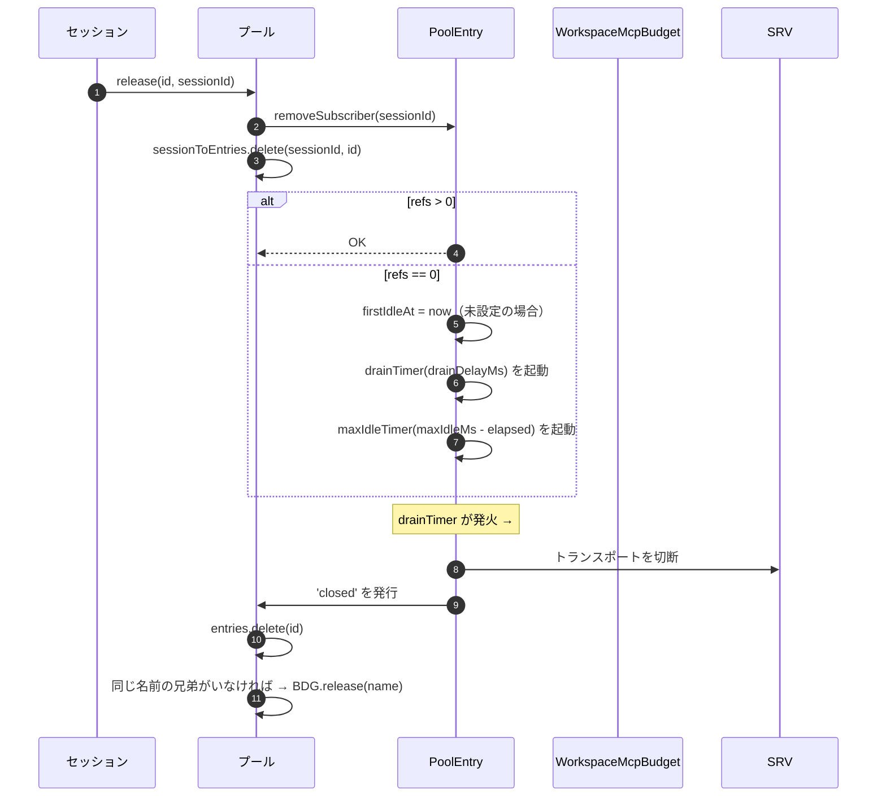
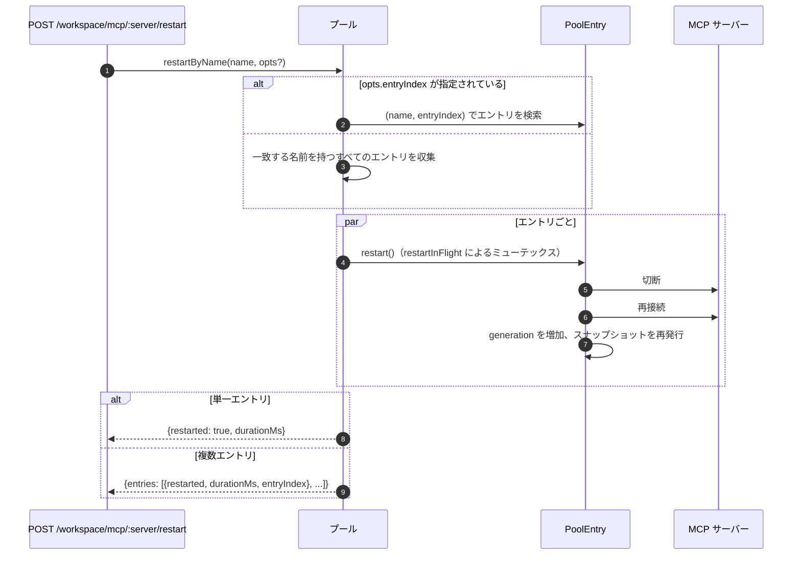
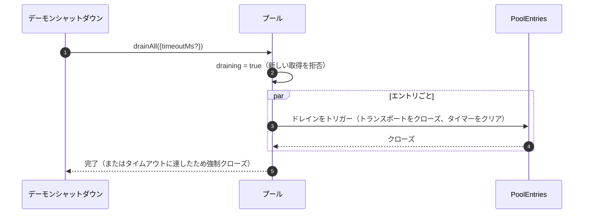

# Workspace MCP トランスポートプール

## 概要

`McpTransportPool`（`packages/core/src/tools/mcp-transport-pool.ts`）は、F2（#4175 commit 5）のワークスペーススコープのプールです。1 つのデーモン上の複数の ACP セッションは、それぞれが独自の MCP 子プロセスを生成する代わりに、一意の `(serverName + configFingerprint)` タプルあたり 1 つのトランスポートを共有します。このプールは **ACP 子プロセス内**（`QwenAgent.mcpPool`）に存在し、デーモンのブートストラップ `Config` を使用してエージェント起動時に 1 回構築され、セッションのライフサイクルを超えて存続します。エントリはセッションのアタッチを参照カウントし、参照カウントがゼロになると設定可能な猶予期間後にクローズします。

これは、マルチセッションデーモンがセッションごとにすべての MCP サーバーのコピーをフォークするのを防ぐ主要なメカニズムです。

## 責務

- `(name + fingerprint)` ごとに 1 つの MCP トランスポートを取得または生成し、`spawnInFlight` を介して同時取得を重複排除します。
- セッションごとの参照を解放します。最後の参照がデタッチされると、エントリのドレインタイマーを起動します。
- ハードな `MAX_IDLE_MS` キャップで参照カウントの変動に耐え、スラッシングするクライアントがアイドルトランスポートを永久に存続させないようにします。
- リバースインデックス（`sessionToEntries`）でセッションを参照カウントし、`releaseSession(sessionId)` を O(エントリ) ではなく O(refs) にします。
- オンデマンドでエントリを再起動します（`restartByName`）。単一エントリは `{restarted, durationMs}` を返し、複数エントリは `{entries: RestartResult[]}`（F2 複数エントリ契約）を返します。
- デーモンシャットダウン時に設定可能なタイムアウトでプール全体をドレインし、ドレイン中は新しい取得を拒否します。
- `acquire` 時に `WorkspaceMcpBudget`（[`06-mcp-budget-guardrails.md`](./06-mcp-budget-guardrails.md) を参照）を参照し、名前ごとの予約上限を適用します。同じ名前を保持する兄弟エントリが存在しない場合、エントリクローズ時にスロットを解放します。
- `SessionMcpView` を介してセッションごとにフィルタリングされたツール/プロンプトのスナップショットを生成し、あるセッションでのディスカバリが他のセッションにツールを登録しないようにします。

## アーキテクチャ

### 公開インターフェース

```ts
class McpTransportPool {
  constructor(cliConfig: Config, options: McpTransportPoolOptions);
  acquire(
    serverName,
    cfg,
    sessionId,
    sessionToolRegistry,
    sessionPromptRegistry,
  ): Promise<PooledConnection>;
  release(id, sessionId): void;
  releaseSession(sessionId): void;
  restartByName(
    name,
    opts?,
  ): Promise<RestartResult | { entries: RestartResult[] }>;
  drainAll(opts?): Promise<void>;
  getBudget(): WorkspaceMcpBudget | undefined;
  getSnapshot(): McpPoolSnapshot;
}
```

`McpTransportPoolOptions`:

- `workspaceContext: WorkspaceContext`（必須）。
- `debugMode: boolean`。
- `sendSdkMcpMessage?` — セッションごとのコールバック（プールは SDK MCP をバイパスします）。
- `pooledTransports?: ReadonlySet<McpTransportKind>` — デフォルトは `{stdio, websocket}`。HTTP/SSE トランスポートはデフォルトでプール対象外です。そのヘッダーにセッション固有の OAuth 状態が含まれる可能性があるためですが、オペレーターは `QWEN_SERVE_MCP_POOL_TRANSPORTS` を使用して明示的にプールにオプトインできます。
- `drainDelayMs?` — デフォルト `30_000`。
- `entryOptions?: (transport) => PoolEntryOptions`。
- `budget?: WorkspaceMcpBudget`。

### 内部状態

| 状態               | 型                                       | 目的                                                                                          |
| ------------------ | ---------------------------------------- | --------------------------------------------------------------------------------------------- |
| `entries`          | `Map<ConnectionId, PoolEntry>`           | `connectionIdOf(name, fingerprint)` をキーとするライブプールエントリ。                        |
| `unpooledIds`      | `Set<ConnectionId>`                      | 設定された `pooledTransports` 許可リスト外のトランスポートのエントリ。                        |
| `spawnInFlight`    | `Map<ConnectionId, Promise<PoolEntry>>`  | 同じキーに対する同時コールド取得を重複排除します。                                            |
| `sessionToEntries` | `Map<string, Set<ConnectionId>>`         | V21-2 O(refs) `releaseSession` のためのリバースインデックス。                                |
| `draining`         | `boolean`                                | ドレインミューテックス — 設定されると、すべての `acquire` 呼び出しが拒否されます。            |
| `nextIndexByName`  | `Map<string, number>`                    | V21-7 サーバー名ごとの単調増加 `entryIndex`（新しいエントリが出現してもダッシュボードはシャッフルされません）。 |

### `PoolEntry`（エントリごとの構造体、`mcp-pool-entry.ts`）

ステートマシン: `spawning → active ⇄ (active ↔ reconnect) → (active → draining on last detach, draining → active on attach OR draining → closed on timer)`。

| フィールド                                             | 目的                                                                               |
| ------------------------------------------------------ | ---------------------------------------------------------------------------------- |
| `localStatus: MCPServerStatus`                         | `MCPServerStatus` ライフサイクルによって駆動されます。                             |
| `state: PoolEntryState`                                | `spawning`/`active`/`draining`/`closed`/`failed`。                                 |
| `generation: number`                                   | 再起動のたびに増加します。サブスクライバは比較して再接続サイクルを検出します。     |
| `refs: Set<string>`                                    | 現在アタッチされているセッション ID。                                               |
| `subscribers: Map<string, SessionMcpView>`             | セッションごとのフィルタリングされたビュー。                                       |
| `subscriberHandles: Map<string, PooledConnectionImpl>` | `acquire` から返されるハンドル。                                                    |
| `toolsSnapshot[], promptsSnapshot[]`                   | 正規のプールレベルスナップショット。`toolsChanged` / `promptsChanged` で再発行されます。 |
| `drainTimer?`                                          | `refs.size === 0` で起動。デフォルト 30 秒。アタッチでリセット。                         |
| `maxIdleTimer?`                                        | 最初のアイドル時に起動。取得/解放の変動によってリセットされません。デフォルト 5 分。 |
| `firstIdleAt?`                                         | 最大アイドルハードキャップのためのウォーターマーク。                               |
| `restartInFlight?`                                     | `restart()` のミューテックス。                                                      |

### `PoolEntryOptions`

```ts
interface PoolEntryOptions {
  drainDelayMs: number; // default 30_000
  maxIdleMs: number; // default 5 * 60_000
  maxReconnectAttempts: number; // default 3 (stdio/ws) or 5 (http/sse)
  reconnectStrategy:
    | { kind: 'fixed'; delayMs: number }
    | { kind: 'exponential'; baseMs: number; capMs: number };
}
```

`defaultPoolEntryOptions(transport)`（`mcp-pool-entry.ts`）は、stdio/ws ではデフォルト `{fixed 5s, 3 attempts}`、http/sse ではデフォルト `{exponential 1s → 16s, 5 attempts}` を返します。リモートトランスポートは、その障害が一時的なものであることが多いため、より長い再試行予算を取得します。

## ワークフロー

### `acquire`

```mermaid
sequenceDiagram
    autonumber
    participant S as セッション
    participant P as プール
    participant SIF as spawnInFlight
    participant E as PoolEntry
    participant BDG as WorkspaceMcpBudget
    participant SRV as MCP サーバー

    S->>P: acquire(name, cfg, sessionId, sessionToolRegistry, sessionPromptRegistry)
    P->>P: ドレイン中なら拒否
    P->>P: connectionId = connectionIdOf(name, fingerprint)
    P->>P: プール可能でなければ → アンプールドとしてマーク
    alt エントリが存在する（ウォーム）
        E-->>P: 既存の PoolEntry
    else コールドスポーンが飛行中
        SIF-->>P: 既存の Promise<PoolEntry>
    else コールドスタート
        P->>BDG: tryReserve(name)（予算が設定されていてプール可能な場合）
        BDG-->>P: 'reserved' | 'already_held' | 'refused'
        alt refused（拒否）
            P->>BDG: recordRefusal(name, transport)
            P-->>S: BudgetExhaustedError
        else ok
            P->>E: spawnEntry(name, cfg)
            E->>SRV: トランスポートに接続
            SRV-->>E: 準備完了
            P->>P: entries.set(id, E); nextIndexByName++
            E-->>P: 接続済み
        end
    end
    P->>E: addSubscriber(sessionId, sessionToolRegistry, sessionPromptRegistry)
    P->>P: sessionToEntries.add(sessionId, id)
    P->>P: ドレインタイマーをキャンセル（refs>0）
    P-->>S: PooledConnection { id, serverName, entryIndex, client, toolsSnapshot, promptsSnapshot, on, off, release }
```

### `release` + ドレイン



`hasNameSibling(name)`（`mcp-transport-pool.ts`）は、`entries.values()` と `spawnInFlight.keys()` の両方を反復し、後者を `parseConnectionId` で解析します（サーバー名に `::` が含まれる可能性があるため、`startsWith` では `${name}::` で始まる兄弟名に誤検出が生じる可能性があります）。

`releaseSession(sessionId)` は `sessionToEntries` から読み取り、参照されているすべてのエントリを O(refs) で解放し、その後インデックスエントリをクリアします。ブリッジのセッションクローズパスで使用され、エントリマップ全体を反復しないようにします。

### `restartByName`



デーモンの HTTP レイヤーでの事前予算チェックは、ターゲットのスロットがまだ予約されておらず、再起動によってライブカウントが `enforce` 予算を超える場合、`{restarted:false, skipped:true, reason:'budget_would_exceed'}`（Wave 4 ミューテーション制御）を返します。

### `drainAll`



## 状態とライフサイクル

- プールの構築は同期的です。最初の `acquire` がトランスポートをコールドスタートします。
- `drainDelayMs`（デフォルト 30 秒）は、アタッチ時にキャンセルまたはリセットされます。
- `maxIdleMs`（デフォルト 5 分）は、アタッチ/デタッチによって **決して** リセットされません。最初のアイドル時にカウントを開始し、エントリが実際にクローズするか、期限前にアタッチされた場合にのみ停止します。スラッシングクライアントに対する防御です。
- `nextIndexByName` は単調増加です。古いエントリは、新しいエントリが出現した後も割り当てられたインデックスを保持するため、`entryIndex` を読み取るダッシュボードはシャッフルされません。
- スポーン失敗は、予約された予算スロットを解放します（V21-4 — これがないと、接続途中でクラッシュしたコールドスポーンが予約を永久にリークします）。

## 依存関係

- `packages/core/src/tools/mcp-client.ts` — `McpClient`、ステータス enum、`SendSdkMcpMessage`。
- `packages/core/src/tools/mcp-pool-entry.ts` — `PoolEntry`、`PoolEntryOptions`、`defaultPoolEntryOptions`。
- `packages/core/src/tools/mcp-pool-key.ts` — `connectionIdOf`、`parseConnectionId`、`isPoolable`、`mcpTransportOf`、`POOLED_TRANSPORTS_DEFAULT`。
- `packages/core/src/tools/mcp-pool-events.ts` — `ConnectionId`、`PoolEntryState`、`PoolEvent`。
- `packages/core/src/tools/session-mcp-view.ts` — プールスナップショットをフィルタリングするセッションごとのビュー。
- `packages/core/src/tools/mcp-workspace-budget.ts` — `WorkspaceMcpBudget`（[`06-mcp-budget-guardrails.md`](./06-mcp-budget-guardrails.md) を参照）。
- `packages/core/src/tools/mcp-discovery-timeout.ts` — `discoveryTimeoutFor`、`runWithTimeout`。

## 設定

| ソース                       | ノブ                                                              | 効果                                                                                                                                     |
| ---------------------------- | ----------------------------------------------------------------- | ---------------------------------------------------------------------------------------------------------------------------------------- |
| 環境変数                     | `QWEN_SERVE_NO_MCP_POOL=1`                                        | キルスイッチ — `QwenAgent.mcpPool` は未定義のまま。セッションごとの `McpClientManager` が強制されます（F2 以前のパス）。                 |
| フラグ                       | `--mcp-client-budget=N`, `--mcp-budget-mode={off,warn,enforce}`   | `childEnvOverrides` を介して ACP 子プロセスに転送されます。子プロセスは `WorkspaceMcpBudget` を構築し、プールに渡します。                 |
| 機能タグ（条件付き）         | `mcp_workspace_pool`, `mcp_pool_restart`                          | プールがオンの場合に一緒にアドバタイズされます。SDK は事前フライトで両方をチェックし、プール対応の応答形状に分岐します。               |

### アンプールドエントリ（HTTP / SSE / SDK-MCP）

設定された `pooledTransports` 許可リスト外のトランスポート（デフォルトでは HTTP、SSE、SDK-MCP）は別のパスを取ります。`createUnpooledConnection(name, cfg, sessionId, ...)`（`mcp-transport-pool.ts`）は、ID `${name}::unpooled-${entryIndex}` のセッションごとのエントリを作成します。プールされたエントリとの違い:

- `entries` に格納され、`unpooledIds: Set<ConnectionId>` でも追跡されるため、`release` / `releaseSession` はデタッチ時のクローズ動作を高速パスできます（refs は常に最大 1）。
- `McpClient.discover()` がプールのリプレイではなく直接使用されます。`applyTools` / `applyPrompts` は、セッションのレジストリがすでに登録された内容を保持しているため、何も行いません（W77 / `attach()` での `skipReplay: true`）。
- ワークスペース予算は引き続きそれらをゲートします。F2 予算フォローアップにより、以前の抜け穴（アンプールド接続が `tryReserve` をバイパスしていた）が修正されました。同じ `WorkspaceMcpBudget` スロットが予約され、エントリクローズ時に解放されます（プールされているかどうかに関わらず）。

W77 レース（`cb206da36`）: `createUnpooledConnection` は、`client.connect()` / `client.discover()` を待機する **前** にエントリを `this.entries` に格納しますが、`sessionToEntries[sessionId]` へのインデックス付けは `attach()` が成功した **後** にのみ行われます。connect/discover ウィンドウ中に同時に `closeStoredSession()` / `releaseSession(sessionId)` が発生すると、空のインデックスが見つかり、アンプールドスポーンが完了し、`attach()` によってすでにクローズされたセッションにツール/プロンプトが登録されていました。修正:

- `mcp-pool-entry.ts`: 公開 `isTerminated(): boolean` プローブ（`state === 'closed' || state === 'failed'`）。
- `mcp-pool-entry.ts`: `markActive()` は `isTerminated()` の場合にショートサーキットするため、破棄されたエントリが `'active'` に復活することはありません。
- 呼び出し元（プールのアンプールドパス）は、await の間で `isTerminated()` をプローブし、親セッションが消えた場合にアタッチを中止します。

このレースは当時は潜在的でした（W61/W71 のセッションごとの `releaseSession` フックは F4 で導入されます）が、そのフックが到着した瞬間に顕在化します。修正は F2 シリーズの初期に適用されました。

## `GET /workspace/mcp` プール対応スナップショットフィールド

プールがアクティブな場合、各 `ServeWorkspaceMcpStatus` サーバーセル（`packages/acp-bridge/src/status.ts`）には、追加の 3 つのフィールドが含まれます:

| フィールド       | 型                                                  | 目的                                                                                                                                                                                                                                                                                                                                                         |
| ---------------- | --------------------------------------------------- | ------------------------------------------------------------------------------------------------------------------------------------------------------------------------------------------------------------------------------------------------------------------------------------------------------------------------------------------------------------ |
| `disabledReason` | `'config' \| 'budget'`                              | オペレーターが無効にしたサーバー（`disabledMcpServers` からの `disabled: true`）と、予算拒否（`status: 'error', errorKind: 'budget_exhausted'`）を区別します。ダッシュボードは、`errors[]` や `budgets[]` をクロスリードすることなく、1 つのサーバー行をレンダリングできます。                                                                             |
| `entryCount`     | `number`（`>=1`）                                   | プールモードでは、セッションが異なるフィンガープリント（セッションごとの OAuth ヘッダーなど）を注入する場合、ワークスペースに同じ名前を持つ複数の `PoolEntry` インスタンスが存在する可能性があります。このフィールドは、`QWEN_SERVE_NO_MCP_POOL=1` でプールが無効になっている場合には存在しません。新しいクライアントは、`entryCount > 1` の場合に「N entries」バッジをレンダリングします。 |
| `entrySummary`   | `ReadonlyArray<{entryIndex, refs, status}>`         | エントリごとの内訳。`entryIndex` はエントリ作成時に割り当てられた安定した不透明な整数です。生のフィンガープリントではないため、スナップショットの差分によって OAuth や環境変数のローテーションタイミングが漏洩することはありません。`refs` は現在アタッチされているセッション数です。`status` により、ダッシュボードはエントリごとの健全性を表示しながら、集約された `mcpStatus` はすでに接続済みです。 |

`(entryCount, entrySummary)` は常にペアでブロードキャストされます。`mcp_workspace_pool` 機能タグは両方のフィールドを意味します。古い SDK クライアントは、追加プロトコル契約の下でこれらを無視します。

プールスナップショットは `subprocessCount` も公開します。これは `'stdio'` ファミリーのみをカウントします。WebSocket、HTTP、SSE トランスポートはリモートサーバーに接続し、ローカル子プロセスを生成しません。初期のバージョンでは WebSocket トランスポートをローカルサブプロセスとしてカウントしており、リソースダッシュボードが膨らんでいました。

## 両方のシャットダウンパスからのドレイン実行

プールのドレインは SIGTERM ハンドラーに限定されません。通常の IDE シャットダウンパス（`await connection.closed`）も、`packages/cli/src/acp-integration/acpAgent.ts` の `drainPoolBeforeExit` を介して `drainAll` を呼び出します。デーモンがプロセスシグナルを受信するか、IDE がクリーンに接続を閉じるかにかかわらず、プールは `draining` 状態に入り、新しい取得を拒否し、エントリがクローズするのを待ちます。

## `/mcp refresh` は起動ディスカバリパスを共有します

`discoverAllMcpTools`（起動ディスカバリ）と `discoverAllMcpToolsIncremental`（`/mcp refresh` / ホットリロード）はどちらも、プールモードでは最初にプールを参照します（`packages/core/src/tools/mcp-client-manager.ts`）。この共有ゲートにより、ホットリロードが誤ってセッションごとのクライアントを作成したり、予算を二重カウントしたり、孤立したトランスポートを残したりするのを防ぎます。

## 再接続中のインフライトツール呼び出し（`MCPCallInterruptedError`）

基盤となる MCP トランスポートがサイレントに切断された場合（明示的なクローズなしで接続が `'active'` / `'draining'` から `localStatus === DISCONNECTED` に遷移した場合）、プールはエントリを `'failed'` としてマークし、`pool.entries` から削除し、サブスクライバビューをデタッチする前に `failed` イベントを発行します。この発行前デタッチの順序が重要です。サブスクライバは、`failed` イベントを十分早く受信して、保留中の `callTool` プロミスを `MCPCallInterruptedError` にルーティングできるため、スタックした `await client.callTool(...)` がハングする代わりにクリーンに拒否されます。`forceShutdown` も同じ発行後デタッチの順序を使用します。
## フィンガープリントと `canonicalOAuth` の正規化

プールキーは `mcp-pool-key.ts` の `fingerprint(cfg)` から取得されます。ハッシュはすべてのトランスポート定義フィールドをカバーします:

> `transport, command, args, cwd, env, url, httpUrl, tcp, headers, timeout, oauth`

セッションごとのフィルタリングとメタデータフィールド（`includeTools`、`excludeTools`、`trust`、`description`、`extensionName`、`discoveryTimeoutMs`）は除外されるため、異なるフィルタを持つセッションでも1つのエントリを共有できます。

OAuthセルについては、`canonicalOAuth(o)` はすべての `MCPOAuthConfig` フィールドをハッシュします: `clientId`、`clientSecret`、ソート済みの `scopes`、ソート済みの `audiences`、`authorizationUrl`、`tokenUrl`、`redirectUri`、`tokenParamName`、`registrationUrl`。これは認証情報分離の契約です: `clientSecret`、`audiences`、または `redirectUri` のみが異なる2つのセッション設定は異なるフィンガープリントを持ち、1つのエントリを共有できません。機密クライアントおよびマルチオーディエンストークンデプロイメントはこれに依存しています。

`scopes` と `audiences` をソートすることで、呼び出し元の順序は無関係になります。明示的な `null` は正規化され、undefined フィールドは明示的な null と同じようにハッシュされます。キーには `discoveryTimeoutMs` は含まれません。同じキーで異なるタイムアウトを持つ同時の acquire 呼び出しは「先着優先」となり、pre-F2 のセッションごとのマネージャーの動作と一致します。

`PoolEntry` は `cfg: MCPServerConfig` をプライベートに保持します。外部コードはトランスポートファミリが必要な場合、`entry.transportKind` ゲッターを使用する必要があります。これにより、env、ヘッダー認証、OAuth フィールドが誤ってコンシューマに漏洩するのを防ぎます。

## 拡張機能のアンロードは `MAX_IDLE_MS` に依存する

ランタイムでのMCP拡張機能のアンロードには、意図的にアクティブなクリーンアップパスはありません。マージされたワークスペース設定に `MCPServerConfig` が表示されなくなった孤立エントリは、最後のサブスクライバーがデタッチした後、`MAX_IDLE_MS` のハードキャップによって自然に再利用されます。同期的なアンロード-クリーンアップパスは、稀なオペレーターのエッジケースに対して複雑さを追加します。ハードキャップは、アンロードポイントを過ぎた孤立プロセスの生存時間をデフォルトで5分に制限します。

より高速なクリーンアップが必要なオペレーターは、デーモンを再起動するか、現在設定されていない名前に対して `POST /workspace/mcp/:server/restart` を呼び出すことができます。これにより、無効化サーバーパスを通り、エントリが破棄されます。

## 自己修復の可観測性

プールは自己修復パスで2つの構造化診断を出力します。

**`McpClient.lastTransportError: Error | undefined`**（`packages/core/src/tools/mcp-client.ts`）— `McpClient.onerror` は最新のトランスポート例外をプライベートフィールドに保存し、`connect()` エントリでクリアします。`PoolEntry` のサイレントドロップパスは `client.getLastTransportError()` を読み取り、それを `emit({kind:'failed', lastError})` に含めるため、サブスクライバーやダッシュボードは根本原因のために stderr を grep する必要がありません。

**`SweepResult`**（内部インターフェース、エクスポートされていません；`packages/core/src/tools/mcp-pool-entry.ts`）— `sweepAndDisconnect(reason)` は `Promise<SweepResult>` を返します：

```ts
interface SweepResult {
  pidSweepError?: Error; // listDescendantPids itself threw
  descendantsFound?: number; // descendant pid count found
  descendantsSignaled?: number; // successfully SIGTERM'd count
}
```

唯一のコンシューマは `statusChangeListener` のサイレントドロップブロックです。`descendantsFound` / `descendantsSignaled` を使用して部分シグナルケース（見つかったプロセスよりもシグナル送信されたプロセスが少ない、通常は `listDescendantPids` と `sigtermPids` の間にプロセスが終了したか EPERM が発生したため）とスイープエラーを検出し、構造化警告をログに記録します。`forceShutdown` と `doRestart` はこの戻り値を無視します。なぜなら、それらの catch パスにはすでに豊富な失敗シグナルが含まれているからです。

## サブプロセスクリーンアップ: `pid-descendants` スナップショットパス

`McpTransportPool` が stdio サブプロセスをシャットダウンするとき、その子孫プロセスを列挙する必要があります。`npx` ラッパーやシェルラッパーは複数のフォークレベルを作成する可能性があります。`packages/core/src/tools/pid-descendants.ts` は `sweepAndDisconnect` のために `listDescendantPids(rootPid) → Promise<number[]>` と `sigtermPids(pids)` を公開しています。

### Linux / macOS プライマリパス

単一の `ps -A -o pid=,ppid=` スナップショットがプロセステーブルを読み取り、それを `Map<ppid, pid[]>` に解析し、その後 `walkDescendants(tree, root)` が BFS を実行してサブツリーを抽出します。どの深さでも必要なのは1回の `ps` フォークだけです。

`walkDescendants` は `visited: Set<number>` を維持し、PID再利用サイクルから防御するために `root` をセットに含めます。高速なプロセスチャーン下では、スナップショットが理論的に A→B / B→A ループを含む可能性があります。`visited` がないと、ウォーカーが `MAX_DESCENDANTS` クォータを偽のデータで満たし、実際の子孫を締め出す可能性があります。

### Windows プライマリパス

単一の `Get-CimInstance Win32_Process | ConvertTo-Csv -Delimiter ","` スナップショットがすべての `(ProcessId, ParentProcessId)` 行を出力し、その後同じ `Map` と `walkDescendants` パスが実行されます。

明示的な `-Delimiter ","` が必要です。Windows に同梱されている PowerShell 5.1 は、`ConvertTo-Csv` のデフォルトをシステムロケールのリスト区切り文字に設定しています。DE、FR、NL、IT、および類似のロケールは `;` を使用するため、修正前のパーサー `^"(\d+)","(\d+)"$` は決して一致せず、すべてのデーモンシャットダウンが per-pid CIM フィルターパスにフォールバックし、子ごとに約0.5〜1秒の PowerShell 起動コストが追加されました。

### フォールバックパス

BusyBox `<v1.28` は `ps -o` を欠いており、distroless コンテナには `ps` が含まれていない可能性があり、一部の Windows 環境では ACL によって CIM 出力が切り詰められます。プライマリパスが0行を解析するかスローした場合、コードは per-pid BFS にフォールバックします: Linux / macOS は `pgrep -P <pid>` を使用し、Windows は `Get-CimInstance -Filter "ParentProcessId=$p"` を使用します。ここで `$p` は文字列連結ではなく PowerShell の変数バインディングです。現在の `Number.isInteger` ガードはエントリポイントに十分です。バインディングは多層防御です。

### 共有制約

両方のパスは `MAX_DESCENDANTS = 256` と `MAX_DEPTH = 8` によって制限されており、悪意のあるまたは劣化したプロセスツリーがスイープを引きずり下ろすのを防ぎます。

スナップショットパスは `maxBuffer: 8MB` を使用しており、約25万プロセスを持つ病的なホストに対応できます。Node のデフォルトの1MBバッファは、約3万プロセスで子プロセス出力を切り詰める可能性があります。

パフォーマンスの向上は意図的に控えめです（典型的な200〜500プロセスの開発マシンでは10ms未満で解析、per-pid `pgrep` よりも約2倍高速）。主な利点はフォークの衛生とスナップショットの一貫性です: BFS はサブツリー全体を一度に見る一方、以前の per-pid クエリパスは2つのクエリの間にフォークされた孫を見逃す可能性がありました。

## 組み込み側の注意: `McpClientManager` コンストラクタ

`McpClientManager` は `(config, toolRegistry, options?: McpClientManagerOptions)` として構築されます。クラスを直接インポートする組み込み側は次のように渡す必要があります:

```ts
new McpClientManager(config, toolRegistry, {
  eventEmitter,
  sendSdkMcpMessage,
  healthConfig,
  budgetConfig,
  pool,
});
```

テストでは、1つまたは2つのフィールドに関心があるケースが1行で済むように、`mkManager(overrides?)` ファクトリを優先すべきです。

## 実装ノート

これらのヘルパーは内部ですが、ソースリーダーはそれらを見る可能性があります:

- `McpTransportPool.acquire()` は `attachPooledSession` と `rollbackReservationOnSpawnFailure` を使用して、高速パスアタッチ、スポーン後アタッチ、およびプールされたスポーン中のキャッチ動作を共有します。ランタイム動作は変更されていません。レースウィンドウの不変条件は依然として呼び出しサイトにあります。
- `SessionMcpView.applyTools` / `applyPrompts` は `compileNameFilter(cfg)` を介して `includeTools` / `excludeTools` を一度コンパイルし、各ツールを `compiledFilterAccepts(compiled, name)` でチェックします。エクスポートされた `passesSessionFilter` / `passesSessionPromptFilter` は同じコンパイル済みパスを使用します。`excludeTools` は完全一致です。`includeTools` は最初の `(...)` サフィックスを除去するため、`toolName(args)` は `toolName` に一致します。

設計ドキュメント: [`../../design/f2-mcp-transport-pool.md`](../../design/f2-mcp-transport-pool.md) §6 では、トランスポートプールのステートマシン、再接続、ドレイン、および子孫スイープパスについて説明しています。

## 注意事項と既知の制限

- **HTTP / SSE トランスポートはデフォルトではプールされません** — オペレーターが明示的に `QWEN_SERVE_MCP_POOL_TRANSPORTS` にそれらを含めない限り、各 acquire は新しいエントリを作成し、それはセッションの間だけ存続します。それらのヘッダーはセッション固有の OAuth 状態を運ぶ可能性があるため、デフォルトでプールするとセッション間で認証情報が漏洩するリスクがあります。
- **`maxIdleMs` はアタッチ/デタッチのチャーンを越えて存続するハードキャップです。** 5分のアイドルハードキャップは、積極的にアタッチ/デタッチするクライアントでも、アイドルトランスポートを5分以上ピン留めできないことを意味します。ピン留めされた長期間存続するトランスポートを希望するオペレーターは、`maxIdleMs` を増やすか、プールの外部でサーバーを実行する必要があります。
- **サーバー名ごとのバジェットスロット** は、名前を共有するがフィンガープリントが異なる2つのプールエントリが、2つではなく1つのスロットを一緒に消費することを意味します。サブプロセスアカウンティングは `pool.getSnapshot().subprocessCount` を介して個別に公開されます。
- **`startsWith` の後退** は `hasNameSibling` で回避されました。MCP サーバー名は正当に `::` を含む可能性があるためです（`mcp-pool-key.test.ts`）。常に `parseConnectionId` の `lastIndexOf('::')` 分割を使用し、文字列プレフィックスマッチングは決して使用しないでください。
- **プールのドレインは一方通行です** — `drainAll` は `draining = true` を永続的に設定します。さらに作業を行うには新しいプールが必要です。

## 参考資料

- `packages/core/src/tools/mcp-transport-pool.ts` (entire file)
- `packages/core/src/tools/mcp-pool-entry.ts` (entry lifecycle)
- `packages/core/src/tools/mcp-pool-key.ts` (`connectionIdOf`, `parseConnectionId`)
- `packages/core/src/tools/mcp-pool-events.ts` (event types)
- `packages/core/src/tools/session-mcp-view.ts` (per-session filtered view)
- F2 設計ドキュメント（v2.2、32項目のレビューフォールドインチェンジログ付き）: [`../../design/f2-mcp-transport-pool.md`](../../design/f2-mcp-transport-pool.md)。設計契約を権威あるものとして扱ってください。このページは開発者向けの詳細解説です。
- F2 設計ノート: issue [#4175](https://github.com/QwenLM/qwen-code/issues/4175)（F2 シリーズのコミット 4-6）。