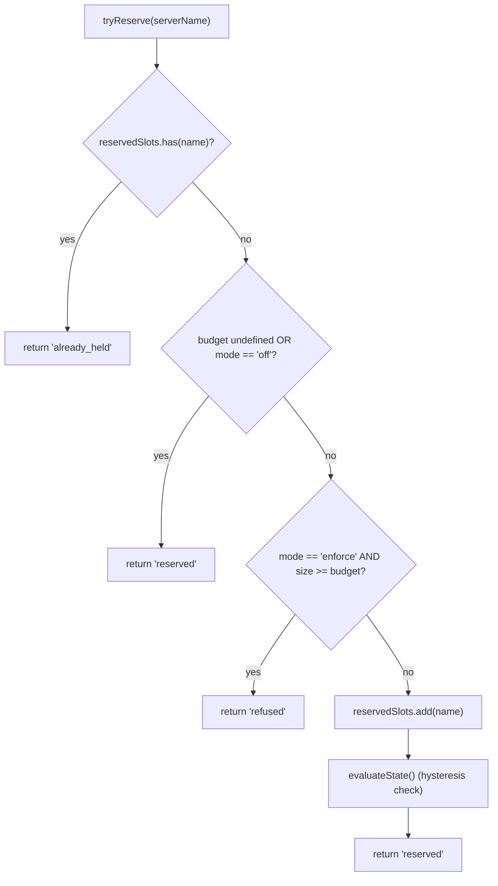
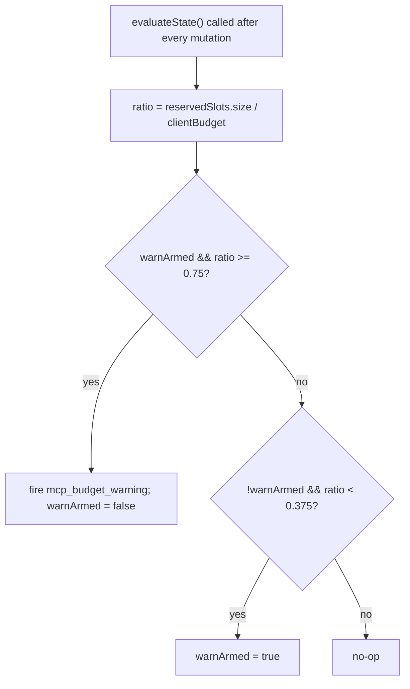

# MCP ワークスペースバジェットガードレール

## 概要

`WorkspaceMcpBudget`（`packages/core/src/tools/mcp-workspace-budget.ts`）は、F2（#4175 コミット6）のワークスペーススコープの MCP クライアントバジェットコントローラです。`McpClientManager` がインラインで保持するものと同じステートマシン（スロット予約、75% ヒステリシス警告、`discoverAllMcpTools*` パスを跨ぐ拒否バッチの結合）を持ちますが、各セッション内の各 ACP 子プロセスのマネージャ内に一度ではなく、`McpTransportPool` 内に **ワークスペースごとに一度** 存在します。プールは `acquire` と `release` の呼び出しをここに委譲することで、制限が各セッションではなく **ワークスペース** に適用されるようにします。

レガシーな `McpClientManager` のバジェット機構は、スタンドアロン Qwen および SDK MCP サーバ（コミット4の修正によりプールをバイパスするもの）のために残ります。プールモードでは `WorkspaceMcpBudget` が適用され、スタンドアロン/SDK MCP ではマネージャのインライン機構が適用されます。プールモードのディスカバリはマネージャの `tryReserveSlot` を呼び出さないため、二重カウントは発生しません。

## 責務

- 現在保持されているサーバ**名**の `reservedSlots: Set<string>` を追跡する（スロットキーは名前に基づき、PR 14 v1 に準拠）。
- `tryReserve(name) → 'reserved' | 'already_held' | 'refused'` — アトミックかつ同期的で、同時の `Promise.all` 取得が await 境界で制限を超えることを防ぐ。
- `release(name) → boolean` — べき等（`Set.delete` のセマンティクス）。
- `reservedSlots.size / clientBudget` が75%を超えた時点で `mcp_budget_warning` を一度発火し、37.5%を下回ってから再びアームする。
- バルクディスカバリパスを跨ぐサーバごとの拒否を結合する — `beginBulkPass()` / `endBulkPass()` のペアで拒否を単一の `mcp_child_refused_batch` イベントに集約する。
- スナップショットコンシューマ（`GET /workspace/mcp`）向けに `lastRefusedServerNames` を保持する — 発火時ではなく次のバルクパスの**開始時**にクリアされるため、パス間のスナップショットでも最後の拒否セットを確認できる。

## アーキテクチャ

### 設定

```ts
new WorkspaceMcpBudget({
  clientBudget?: number,           // undefined = 無制限
  mode: 'off' | 'warn' | 'enforce',
  onEvent?: (event: McpBudgetEvent) => void,
});
```

`mode` のセマンティクス:

- `off` — すべてのメソッドは何もしない；`tryReserve` は無条件に `'reserved'` を返す；イベントは発火しない。
- `warn` — スロットは追跡され、75%で `mcp_budget_warning` が発火するが、`tryReserve` は決して拒否しない。
- `enforce` — `tryReserve` は `clientBudget` を超えると拒否する；`recordRefusal` はサーバごとの拒否をキューに入れる；`endBulkPass` は `mcp_child_refused_batch` を発火する。

### `mcp-client-manager.ts` からの定数

- `MCP_BUDGET_WARN_FRACTION = 0.75` — 上昇閾値。
- `MCP_BUDGET_REARM_FRACTION = 0.375` — 下降ヒステリシス再アーム。
- `McpBudgetMode = 'off' | 'warn' | 'enforce'`。

### 内部状態

| 状態                                                   | 目的                                                                                                      |
| ------------------------------------------------------ | --------------------------------------------------------------------------------------------------------- |
| `reservedSlots: Set<string>`                           | 権威ある予約セット；ヒステリシスは `size / clientBudget` を評価する。                                      |
| `pendingRefusalNames: Set<string>`                     | 現在の `beginBulkPass`/`endBulkPass` ウィンドウ中に蓄積された拒否名；`endBulkPass` で排出される。          |
| `pendingRefusalTransports: Map<string, transport>`     | サイドカーとして、発火されるバッチに各拒否サーバのトランスポートを含める。                                |
| `lastRefusedServerNames: readonly string[]`            | 最新の完了パスからのスナップショット可能な拒否リスト。次のパスの開始時にクリアされる。                     |
| `warnArmed: boolean`                                   | ヒステリシス状態 — true = 発火準備完了、false = 最後の37.5%排出以降に既に発火済み。                       |
| `bulkPassDepth: number`                                | ネストされたバルクパスの再入カウンタ（ネストされたパスは二重発火を防ぐため）。                            |

## ワークフロー

### `tryReserve`



`tryReserve` は**同期的**です。プールの `acquire` は非同期ですが、予約は `await` の前に行われるため、異なる名前に対する2つの同時 `Promise.all` 取得が両方とも制限を超えることはありません。

### ヒステリシス



ヒステリシスは、ワークロードが75%付近で変動する場合に繰り返し警告が発生するのを防ぎます。最初の超過で発火し、37.5%まで低下せずに再び超過しても発火しません。

### 拒否バッチの結合

```mermaid
sequenceDiagram
    autonumber
    participant POOL as pool.discoverAllMcpToolsViaPool
    participant BDG as WorkspaceMcpBudget
    participant EB as EventBus

    POOL->>BDG: beginBulkPass()
    BDG->>BDG: bulkPassDepth++<br/>clear lastRefusedServerNames if outermost
    loop per server in pass
        POOL->>BDG: tryReserve(name)
        alt refused
            POOL->>BDG: recordRefusal(name, transport)
            BDG->>BDG: pendingRefusalNames.add; pendingRefusalTransports.set
            Note over BDG: NO event yet (coalesce)
        end
    end
    POOL->>BDG: endBulkPass()
    BDG->>BDG: bulkPassDepth--
    alt outermost (depth == 0) AND pending non-empty
        BDG->>EB: emit mcp_child_refused_batch<br/>{refusedServers, budget, liveCount, reservedCount, mode: 'enforce', scope?: 'workspace'}
        BDG->>BDG: lastRefusedServerNames = drain pendingRefusalNames
    end
```

パス外の拒否（例: バルクパスを完全にバイパスする遅延 `readResource` の生成）は、形状の一貫性のためにインラインで長さ1のバッチを発火します。ネストされたパス（`bulkPassDepth > 0`）は発火しません；最も外側の end-of-pass のみが結合されたバッチを発火します。

## 状態とライフサイクル

- バジェットコントローラはプールの初期化時にワークスペースごとに一度構築されます。
- `clientBudget` は構築後は不変です；実行時の変更にはプールの再構築が必要です。
- `mode` も不変です（`onEvent` は防御的な深層対策として `mode === 'off'` の場合は `undefined` として格納されます）。
- `warnArmed` は初期状態で true です；37.5%の下降超過を介して true にリセットされます。
- `lastRefusedServerNames` は `endBulkPass` の発火時にはクリアされ**ません** — 次のバルクパスの**開始時**にのみクリアされます。これにより、パス間で呼び出されたスナップショットルートでも最後の拒否セットを報告できます（そうしないと、拒否バッチイベントが配信された直後にダッシュボードに空の拒否が表示されます）。

## 依存関係

- `packages/core/src/tools/mcp-client-manager.ts` — `McpBudgetEvent`、`McpBudgetMode`、`McpRefusedServer`、`MCP_BUDGET_WARN_FRACTION`、`MCP_BUDGET_REARM_FRACTION`、`BudgetExhaustedError`（拒否時にプールの `acquire` によってスローされる）を再利用。
- `packages/core/src/tools/mcp-transport-pool.ts` — バジェットを消費；プールの `onEvent` 配管を介してイベントをデーモンの EventBus に渡す。
- デーモンスナップショットルート `GET /workspace/mcp` — `getReservedSlots()`、`getRefusedServerNames()`、`getReservedCount()`、`getBudget()`、`getMode()` を読み取る。

## 設定

| ソース           | 設定項目                                                                                  | 効果                                                                                                      |
| ---------------- | ----------------------------------------------------------------------------------------- | --------------------------------------------------------------------------------------------------------- |
| フラグ           | `--mcp-client-budget=N`                                                                   | ワークスペースコントローラの `clientBudget` を設定。                                                       |
| フラグ           | `--mcp-budget-mode={off,warn,enforce}`                                                    | `mode` を設定。`enforce` には正の `clientBudget` が必要；そうでない場合は明示的に起動に失敗する。          |
| 環境変数         | `QWEN_SERVE_MCP_CLIENT_BUDGET`、`QWEN_SERVE_MCP_BUDGET_MODE`                              | `childEnvOverrides` を介して ACP 子プロセスに転送；子プロセスの `readBudgetFromEnv()` がこれらを取得する。 |
| 機能タグ         | `mcp_guardrails`（常時；`modes: ['warn', 'enforce']`）、`mcp_guardrail_events`（常時）    | [`11-capabilities-versioning.md`](./11-capabilities-versioning.md) を参照。                               |

## 注意事項と既知の制限

- **予約キーは名前に基づきます。** 同じサーバ名で異なるフィンガープリントを持つ2つのプールエントリ（例: 異なる OAuth ヘッダを注入するセッション）は、1つのスロットを消費します。サブプロセスのアカウンティングはプールスナップショットの `subprocessCount` で別途公開されます。運用者はバジェットを「サブプロセス数」ではなく「設定されたサーバスロット」と考えるべきです。
- **ヒステリシスは予約数、つまりライブ（CONNECTED）数ではなくトリガーされます。** 予約には進行中の接続が含まれ、一時的な切断後も維持されるため、ヒステリシスは再接続サイクルを超えて安定しています。ライブ数は、その視点を必要とする SDK コンシューマ向けにイベントペイロードの `liveCount` として公開されます。
- **`warn` モードは決して拒否しません。** 予約の追跡と `mcp_budget_warning` の発火は行いますが、`tryReserve` は常に `'reserved'` を返します。拒否のセマンティクスは `enforce` 限定です。
- **ワークスペーススコープのバジェットイベントは `scope: 'workspace'` を運びます** そのため、接続されているすべてのセッションに同時にファンアウトします。SDK リデューサの `mcpBudgetWarningCount` / `mcpChildRefusedBatchCount` は、同じ接続上のセッション間で同期してインクリメントされます。`McpClientManager` からのセッションごとのレガシーイベントは `scope` を運びません（セマンティクス的にはデフォルトで `'session'`）。
- **キルスイッチ `QWEN_SERVE_NO_MCP_POOL=1`** はプール全体を無効にします；ワークスペースバジェットも無効になり、セッションごとの `McpClientManager` バジェットが引き継ぎます。機能エンベロープはこれを正確に報告するために `mcp_workspace_pool` と `mcp_pool_restart` を削除します。
- **`ServeMcpBudgetStatusCell.scope` は前方互換性のあるリスト形状です。** スナップショットセルは単一の `budget?` フィールドではなく `budgets[]` を公開します。PR 14 v1 は各 ACP セッションに対して1つの `scope: 'session'` セルを発火します。これは `acpAgent.newSessionConfig()` がそのセッションの `Config` / `McpClientManager` を構築するためです。`'pool'` スコープは、セッションスコープのセルと並んで配置される Wave 5 PR 23 のプールスコープセル用に予約されています。コンシューマは、不明な `scope` 値をエラーにするのではなく、ドロップして許容する必要があります。

## 参照

- `packages/core/src/tools/mcp-workspace-budget.ts`（クラス全体）
- `packages/core/src/tools/mcp-client-manager.ts`（`BudgetExhaustedError`、`McpBudgetEvent`、ヒステリシス定数）
- `packages/core/src/tools/mcp-transport-pool.ts`（`tryReserve` を呼び出すプールの `acquire` サイト）
- F2 設計ドキュメント（v2.2）：[`../../design/f2-mcp-transport-pool.md`](../../design/f2-mcp-transport-pool.md) §11 ワークスペースレベルのバジェットと、v2.2 のチェンジログエントリ（バジェットとフィンガープリントのフォローアップについて）。
- F2 設計ノート：issue [#4175](https://github.com/QwenLM/qwen-code/issues/4175) コミット6。