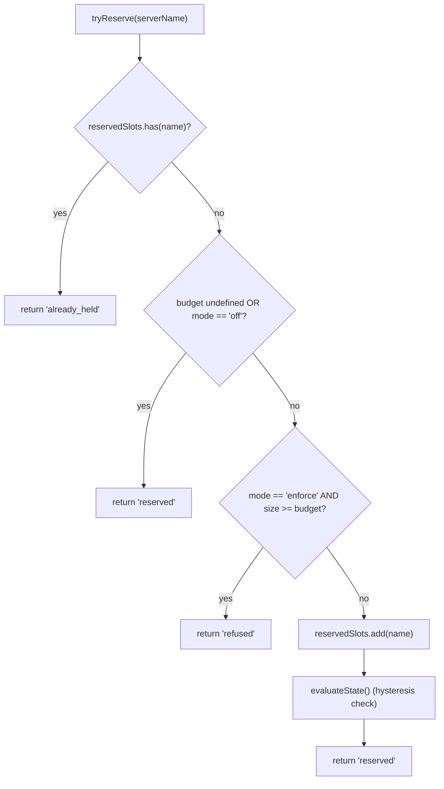
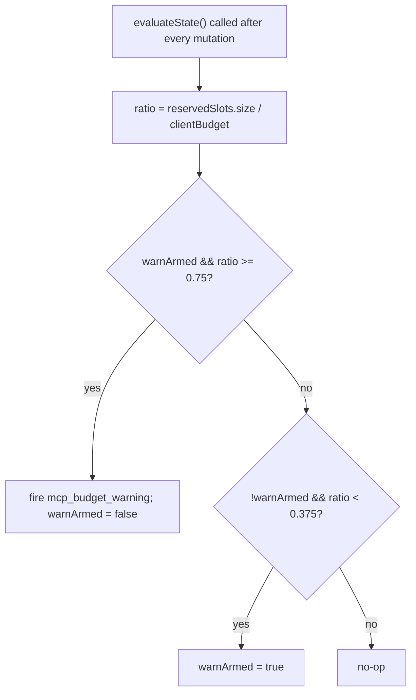

# MCP ワークスペース予算ガードレール

## 概要

`WorkspaceMcpBudget` (`packages/core/src/tools/mcp-workspace-budget.ts`) は、F2 (#4175 コミット 6) で導入されたワークスペーススコープの MCP クライアント予算コントローラーです。`McpClientManager` がインラインで保持していたものと同じステートマシン（スロット予約、75% ヒステリシス警告、`discoverAllMcpTools*` パス全体にまたがる拒否バッチのコアレッシング）を担いますが、各セッションの ACP 子のマネージャー内に一つではなく、`McpTransportPool` 内に**ワークスペースにつき一つ**存在します。プールは `acquire` および `release` の呼び出しをここに委譲するため、上限は各セッションではなく**ワークスペース**全体に適用されます。

レガシーの `McpClientManager` 予算機能は、スタンドアロンの qwen および SDK MCP サーバー（コミット 4 の修正によりプールをバイパスする）向けに残っています。プールモード → `WorkspaceMcpBudget` が適用し、スタンドアロン / SDK MCP → マネージャーのインライン機能が適用します。プールモードのディスカバリーはマネージャーの `tryReserveSlot` を呼び出さないため、二重カウントは発生しません。

## 責務

- 現在保持しているサーバー名の `reservedSlots: Set<string>` を追跡する（スロットキーは名前単位で、PR 14 v1 と一致）。
- `tryReserve(name) → 'reserved' | 'already_held' | 'refused'` — アトミックかつ同期的なため、並行する `Promise.all` の acquire が await の境界で上限を超えることはない。
- `release(name) → boolean` — 冪等（`Set.delete` のセマンティクス）。
- `reservedSlots.size / clientBudget` が 75% を上回ったとき、`mcp_budget_warning` を一度発火し、37.5% を下回ったときのみ再アームする。
- バルクディスカバリーパス全体でサーバーごとの拒否をコアレッシングする — `beginBulkPass()` / `endBulkPass()` のブラケットが拒否を蓄積し、単一の `mcp_child_refused_batch` イベントとして送出する。
- スナップショットコンシューマー（`GET /workspace/mcp`）向けに `lastRefusedServerNames` を保持する — 次のバルクパスの**開始時**にクリアされ、送出時ではないため、パス間のスナップショットでも最後の拒否セットを参照できる。

## アーキテクチャ

### 設定

```ts
new WorkspaceMcpBudget({
  clientBudget?: number,           // undefined = 無制限
  mode: 'off' | 'warn' | 'enforce',
  onEvent?: (event: McpBudgetEvent) => void,
});
```

`mode` のセマンティクス:

- `off` — すべてのメソッドがノーオペレーション。`tryReserve` は無条件で `'reserved'` を返し、イベントは発火しない。
- `warn` — スロットは追跡され `mcp_budget_warning` が 75% で発火するが、`tryReserve` は**絶対に拒否しない**。
- `enforce` — `tryReserve` は `clientBudget` を超えると拒否し、`recordRefusal` がサーバーごとの拒否をキューに入れ、`endBulkPass` が `mcp_child_refused_batch` を送出する。

### `mcp-client-manager.ts` の定数

- `MCP_BUDGET_WARN_FRACTION = 0.75` — 上昇しきい値。
- `MCP_BUDGET_REARM_FRACTION = 0.375` — 下降ヒステリシス再アーム値。
- `McpBudgetMode = 'off' | 'warn' | 'enforce'`。

### 内部状態

| 状態                                               | 目的                                                                                                         |
| -------------------------------------------------- | ------------------------------------------------------------------------------------------------------------ |
| `reservedSlots: Set<string>`                       | 正規の予約セット。ヒステリシスは `size / clientBudget` で評価する。                                          |
| `pendingRefusalNames: Set<string>`                 | 現在の `beginBulkPass`/`endBulkPass` ウィンドウ中に蓄積された拒否名。`endBulkPass` 時にドレインされる。      |
| `pendingRefusalTransports: Map<string, transport>` | 送出バッチが各拒否サーバーのトランスポートを含めるためのサイドカー。                                          |
| `lastRefusedServerNames: readonly string[]`        | 最近完了したパスのスナップショット参照可能な拒否リスト。次のパスの開始時にクリアされる。                      |
| `warnArmed: boolean`                               | ヒステリシス状態 — true = 発火可能、false = 最後の 37.5% ドレイン以降すでに発火済み。                       |
| `bulkPassDepth: number`                            | ネストされたバルクパス向けの再入カウンター（ネストされたパスは二重送出しない）。                              |

## ワークフロー

### `tryReserve`



`tryReserve` は**同期的**です。プールの `acquire` は非同期ですが、予約は `await` より前に行われるため、異なる名前の並行する `Promise.all` の acquire が同時に上限を超えることはありません。

### ヒステリシス



ヒステリシスにより、ワークロードが 75% 付近で振動しても警告が繰り返し発生しません。最初の上昇時に発火し、37.5% まで下降しない限り、以降の上昇では発火しません。

### 拒否バッチのコアレッシング

```mermaid
sequenceDiagram
    autonumber
    participant POOL as pool.discoverAllMcpToolsViaPool
    participant BDG as WorkspaceMcpBudget
    participant EB as EventBus

    POOL->>BDG: beginBulkPass()
    BDG->>BDG: bulkPassDepth++<br/>clear lastRefusedServerNames if outermost
    loop per server in pass
        POOL->>BDG: tryReserve(name)
        alt refused
            POOL->>BDG: recordRefusal(name, transport)
            BDG->>BDG: pendingRefusalNames.add; pendingRefusalTransports.set
            Note over BDG: NO event yet (coalesce)
        end
    end
    POOL->>BDG: endBulkPass()
    BDG->>BDG: bulkPassDepth--
    alt outermost (depth == 0) AND pending non-empty
        BDG->>EB: emit mcp_child_refused_batch<br/>{refusedServers, budget, liveCount, reservedCount, mode: 'enforce', scope?: 'workspace'}
        BDG->>BDG: lastRefusedServerNames = drain pendingRefusalNames
    end
```

パス外の拒否（バルクパスを完全にバイパスする遅延 `readResource` スポーンなど）は、形状の一貫性のために長さ 1 のバッチをインラインで送出します。ネストされたパス（`bulkPassDepth > 0`）は発火せず、最外部のパス終了時のみがコアレッシングされたバッチを送出します。

## 状態とライフサイクル

- 予算コントローラーはプール初期化時にワークスペースにつき一度構築される。
- `clientBudget` は構築後に変更不可。実行時の変更にはプールの再構築が必要。
- `mode` も変更不可（`mode === 'off'` の場合、多層防御として `onEvent` は `undefined` として格納される）。
- `warnArmed` は true で開始し、37.5% の下降クロッシングで true にリセットされる。
- `lastRefusedServerNames` は `endBulkPass` の送出時にはクリアされず、次のバルクパスの**開始時**にのみクリアされる。これにより、パス間で呼び出されるスナップショットルートが最後の拒否セットを引き続き報告できる（そうでなければ、拒否バッチイベントの直後にダッシュボードが空の拒否を表示してしまう）。

## 依存関係

- `packages/core/src/tools/mcp-client-manager.ts` — `McpBudgetEvent`、`McpBudgetMode`、`McpRefusedServer`、`MCP_BUDGET_WARN_FRACTION`、`MCP_BUDGET_REARM_FRACTION`、`BudgetExhaustedError`（拒否時にプールの `acquire` がスロー）を再利用。
- `packages/core/src/tools/mcp-transport-pool.ts` — 予算を消費し、プールの `onEvent` 経由でデーモン EventBus にイベントを転送する。
- デーモンスナップショットルート `GET /workspace/mcp` — `getReservedSlots()`、`getRefusedServerNames()`、`getReservedCount()`、`getBudget()`、`getMode()` を読み取る。

## 設定

| ソース          | 設定項目                                                                                 | 効果                                                                                         |
| --------------- | ---------------------------------------------------------------------------------------- | -------------------------------------------------------------------------------------------- |
| Flag            | `--mcp-client-budget=N`                                                                  | ワークスペースコントローラーの `clientBudget` を設定する。                                    |
| Flag            | `--mcp-budget-mode={off,warn,enforce}`                                                   | `mode` を設定する。`enforce` は正の `clientBudget` が必要。なければ起動時に明示的に失敗する。 |
| Env             | `QWEN_SERVE_MCP_CLIENT_BUDGET`, `QWEN_SERVE_MCP_BUDGET_MODE`                             | `childEnvOverrides` 経由で ACP 子に転送。子の `readBudgetFromEnv()` が読み取る。             |
| Capability tags | `mcp_guardrails` (always; `modes: ['warn', 'enforce']`), `mcp_guardrail_events` (always) | [`11-capabilities-versioning.md`](./11-capabilities-versioning.md) を参照。                  |

## 注意事項と既知の制限

- **予約キーは名前単位。** 同じサーバー名を持ちフィンガープリントが異なる 2 つのプールエントリー（例：セッションが異なる OAuth ヘッダーを注入する場合）は ONE スロットを共有する。サブプロセスの集計はプールスナップショットの `subprocessCount` で別途公開される。オペレーターは予算を「サブプロセス数」ではなく「設定されたサーバースロット」として考えるべきである。
- **ヒステリシスはライブ（CONNECTED）数ではなく予約数でトリガーされる。** 予約には接続中も含まれ、一時的な切断後も維持されるため、ヒステリシスは再接続サイクルをまたいで安定している。ライブカウントはイベントペイロードの `liveCount` として、そのビューを必要とする SDK コンシューマー向けに公開されている。
- **`warn` モードは絶対に拒否しない。** 予約の追跡と `mcp_budget_warning` の発火は行うが、`tryReserve` は常に `'reserved'` を返す。拒否セマンティクスは `enforce` 専用。
- **ワークスペーススコープの予算イベントは `scope: 'workspace'` を持つ**ため、接続されているすべてのセッションに同時にファンアウトされる。SDK リデューサーの `mcpBudgetWarningCount` / `mcpChildRefusedBatchCount` は同一接続上のセッション全体でロックステップに増加する。`McpClientManager` からのセッションごとのレガシーイベントは `scope` を持たない（意味的にはデフォルトで `'session'`）。
- **キルスイッチ `QWEN_SERVE_NO_MCP_POOL=1`** はプールを完全に無効化し、ワークスペース予算も無効化され、セッションごとの `McpClientManager` 予算が引き継ぐ。この状態を正確に報告するため、ケーパビリティエンベロープから `mcp_workspace_pool` と `mcp_pool_restart` が除外される。
- **`ServeMcpBudgetStatusCell.scope` は前方互換のリスト形式。** スナップショットセルは単一の `budget?` フィールドではなく `budgets[]` を公開する。PR 14 v1 は各 ACP セッションに一つの `scope: 'session'` セルを送出する（`acpAgent.newSessionConfig()` がそのセッションの `Config` / `McpClientManager` を構築するため）。`'pool'` スコープは Wave 5 PR 23 のプールスコープセル（セッションスコープセルと並置される予定）のために予約されている。コンシューマーは未知の `scope` 値を失敗ではなくドロップすることで許容しなければならない。

## 参考資料

- `packages/core/src/tools/mcp-workspace-budget.ts`（クラス全体）
- `packages/core/src/tools/mcp-client-manager.ts`（`BudgetExhaustedError`、`McpBudgetEvent`、ヒステリシス定数）
- `packages/core/src/tools/mcp-transport-pool.ts`（`tryReserve` を呼び出すプールの `acquire` 箇所）
- F2 設計ドキュメント (v2.2): [`../../design/f2-mcp-transport-pool.md`](../../design/f2-mcp-transport-pool.md) §11（ワークスペースレベルの予算、および予算とフィンガープリントのフォローアップに関する v2.2 変更ログ）。
- F2 設計ノート: issue [#4175](https://github.com/QwenLM/qwen-code/issues/4175) コミット 6。
