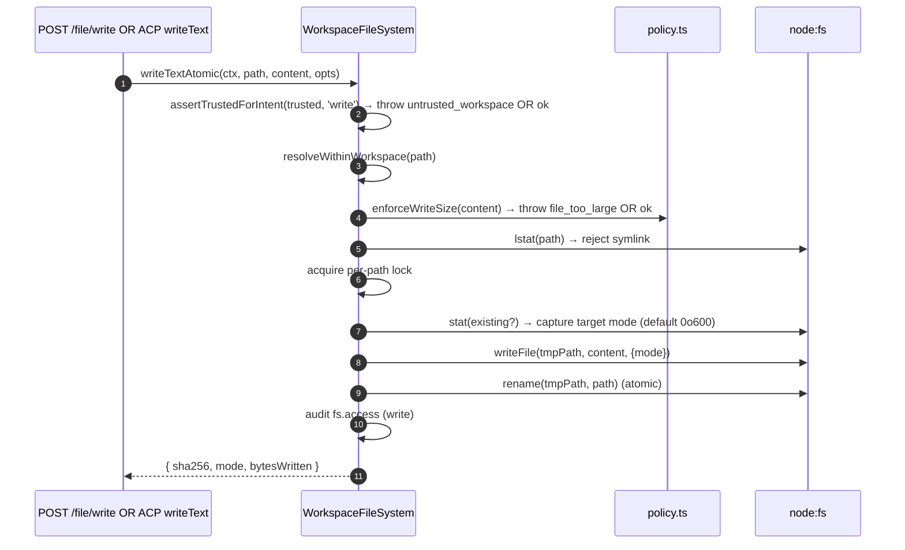
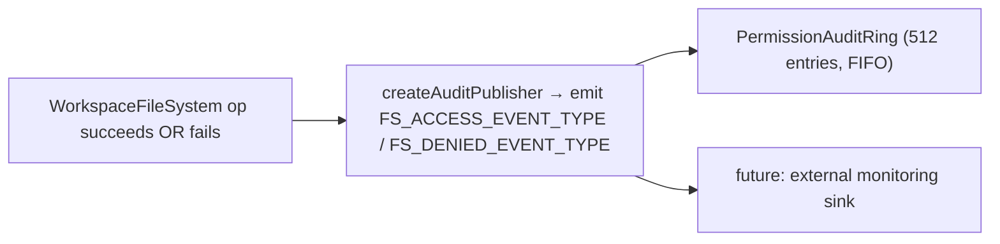

# ワークスペースファイルシステム境界

## 概要

デーモンは、HTTP ルートや ACP 側エージェントの呼び出しがホストファイルシステムに直接アクセスすることを許可しません。すべての読み取り、書き込み、一覧取得、glob、stat は `WorkspaceFileSystem` 境界（`packages/cli/src/serve/fs/`）を経由して実行され、以下の機能を提供します。

- **パス解決** — パスを正規化し、シンボリックリンク経由のものも含め、バインドされたワークスペース外へのアクセスを拒否する。
- **トラスト制御** — ワークスペースが信頼されていない場合（`untrusted_workspace`）は書き込みを拒否する。
- **サイズ・コンテンツポリシー** — 読み取り上限（`MAX_READ_BYTES = 256 KiB`）、書き込み上限（`MAX_WRITE_BYTES = 5 MiB`）、バイナリ検出。
- **アトミック性** — 書き込み後リネームによるアトミック操作。対象ファイルのモードを保持し、新規ファイルのデフォルトは `0o600`。
- **監査** — すべてのアクセス・拒否は `PermissionAuditRing` / モニタリング向けの構造化イベントとして送出される。
- **型付きエラー** — 閉じた `FsErrorKind` ユニオンを HTTP ステータスにマッピング。

HTTP ファイルルート（`GET /file`、`GET /file/bytes`、`POST /file/write`、`POST /file/edit`、`GET /list`、`GET /glob`、`GET /stat`）と、ACP 側の `BridgeFileSystem` アダプター（エージェント駆動の `readTextFile` / `writeTextFile` 呼び出しが同じゲートを通るようにする）は、いずれもこの境界を経由します。

## 責務

- ユーザーが指定したパスをブランド付き `ResolvedPath` 値に解決し、境界内の残りのコードが安全に利用できるようにする。
- バインドされたワークスペース外のパス（`path_outside_workspace`）やシンボリックリンクを対象とするパス（`symlink_escape`）を拒否する。
- `MAX_READ_BYTES` を超える読み取り、`MAX_WRITE_BYTES` を超える書き込み、バイナリファイル（`binary_file`）を拒否する。
- ワークスペースが信頼されていない場合（`untrusted_workspace`）は書き込み・編集を拒否する — `assertTrustedForIntent(trusted, intent)` によるゲート制御。
- `shouldIgnore` を通じて `.gitignore` / `.qwenignore` パターンを尊重する。
- 対象ファイルのモードを保持しながら書き込み後リネームによるアトミック操作を実行する。新規ファイルのデフォルトモードは `0o600`。
- すべての操作で `fs.access` / `fs.denied` 監査イベントを送出する。
- すべての失敗を `kind` と HTTP ステータスを持つ `FsError` にマッピングし、ルートハンドラが統一的にシリアライズする。

## アーキテクチャ

### モジュール構成

| ファイル                     | 役割                                                                                                                                                                                                                                               |
| ------------------------ | ----------------------------------------------------------------------------------------------------------------------------------------------------------------------------------------------------------------------------------------------------- |
| `paths.ts`               | `canonicalizeWorkspace`、`resolveWithinWorkspace`、`hasSuspiciousPathPattern`、ブランド付き `ResolvedPath`、`Intent` ユニオン（`read \| write \| list \| stat \| glob`）。                                                                                      |
| `policy.ts`              | `MAX_READ_BYTES`、`MAX_WRITE_BYTES`、`BINARY_PROBE_BYTES`、`assertTrustedForIntent`、`detectBinary`、`enforceReadBytesSize`、`enforceReadSize`、`enforceWriteSize`、`shouldIgnore`。                                                                   |
| `audit.ts`               | `FS_ACCESS_EVENT_TYPE`、`FS_DENIED_EVENT_TYPE`、`createAuditPublisher`、監査ペイロード型。                                                                                                                                                          |
| `errors.ts`              | `FsError` クラス、`isFsError`、`FsErrorKind` ユニオン（14 種類）、`FsErrorStatus` ユニオン（`400 / 403 / 404 / 409 / 413 / 422 / 500 / 503`）。                                                                                                                |
| `workspace-file-system.ts` | `createWorkspaceFileSystemFactory`、`WorkspaceFileSystem`（読み取り・書き込み・一覧取得のオーケストレーター）、`WriteMode`、`ContentHash`、`FsEntry`、`FsStat`、`ListOptions`、`GlobOptions`、`ReadTextOptions`、`ReadBytesOptions`、`WriteTextAtomicOptions`。 |

### `FsErrorKind` 分類

| Kind                     | デフォルト HTTP | 意味                                                                                                                                                                                       |
| ------------------------ | ------------ | --------------------------------------------------------------------------------------------------------------------------------------------------------------------------------------------- |
| `path_outside_workspace` | 400          | 解決されたパスがバインドされたワークスペース外にある。                                                                                                                                                                 |
| `symlink_escape`         | 400          | 対象がシンボリックリンクである（PR 18 + PR 20 の保守的な方針により拒否）。                                                                                                                                    |
| `path_not_found`         | 404          | `ENOENT`。                                                                                                                                                                                     |
| `binary_file`            | 422          | テキストルートでバイナリとして検出されたコンテンツ。                                                                                                                                                                       |
| `file_too_large`         | 413          | `MAX_READ_BYTES` または `MAX_WRITE_BYTES` を超えている。                                                                                                                                                  |
| `hash_mismatch`          | 409          | 楽観的並行制御の `expectedSha256` が一致しなかった。                                                                                                                                               |
| `file_already_exists`    | 409          | 既存のファイルに対して `mode: 'create'` を指定した。                                                                                                                                                    |
| `text_not_found`         | 422          | `POST /file/edit` の検索文字列がファイル内に存在しない。                                                                                                                                         |
| `ambiguous_text_match`   | 422          | 1 件のみ必要な箇所で複数の一致が見つかった。                                                                                                                                                               |
| `untrusted_workspace`    | 403          | 信頼されていないワークスペースで書き込みを試みた。                                                                                                                                                    |
| `permission_denied`      | 403          | OS レベルの `EACCES` / `EPERM`。                                                                                                                                                                  |
| `io_error`               | 503          | `ENOSPC` / `EIO` / `EBUSY` / `ETXTBSY` / `ENAMETOOLONG` / `EMFILE` / `ENFILE`。**`permission_denied` とは別の種類**であり、監視パイプラインが「ディスク満杯」でセキュリティ担当者にアラートを送らないようにするため。 |
| `internal_error`         | 500          | 境界に到達した非 errno エラー（`TypeError`、プログラマのバグ）。                                                                                                                                      |
| `parse_error`            | 400 / 422    | リクエストボディのパースエラー（400）またはサービスレベルの不変条件違反（422）。                                                                                                                                       |

### `BridgeFileSystem`（ACP 側アダプター）

`packages/acp-bridge/src/bridgeFileSystem.ts` では以下を定義しています。

```ts
interface BridgeFileSystem {
  readText(params: ReadTextFileRequest): Promise<ReadTextFileResponse>;
  writeText(params: WriteTextFileRequest): Promise<WriteTextFileResponse>;
}
```

これは ACP の `readTextFile` / `writeTextFile` の注入ポイントです。ブリッジのテストや Mode A の組み込み呼び出し元は `BridgeOptions` で省略できます。その場合、`BridgeClient` はインラインの `fs.readFile` / `fs.writeFile` プロキシにフォールバックします（F1 以前の動作を維持）。本番の `qwen serve` は `createBridgeFileSystemAdapter(fsFactory)`（`packages/cli/src/serve/bridge-file-system-adapter.ts`）経由で `BridgeFileSystem` を接続するため、エージェント側の ACP 書き込みは HTTP ルートと同じ TOCTOU、シンボリックリンク、トラストゲート、監査のゲートを経由します。

アダプターが複製しなければならない防御的ゲート（アダプターが注入されるとインラインプロキシは完全にバイパスされるため）：

1. **非通常ファイルを拒否する** — ソケット・パイプ・文字デバイス・procfs・sysfs エントリは `stats.size === 0` であっても無制限のデータをストリームできる。インラインパスはメッセージに `describeStatKind(stats)` を含む例外をスローする。
2. **バッファサイズを `READ_FILE_SIZE_CAP = 100 MiB` で制限する** — 500 MB のログに対して `{ line: 1, limit: 10 }` という小さなリクエストを送ると、10 行を返すだけのために 500 MB の RSS を消費してしまう。

アダプターはさらに踏み込んで、アトミックな一時ファイル＆リネーム書き込み（モード保持、`0o600` デフォルト、パスごとのロック内でのシンボリックリンク拒否）に `WorkspaceFileSystem.writeTextOverwrite`（PR 18 プリミティブ）を使用します。これはシンボリックリンクを解決してその対象に書き込んでいた**F1 以前のインラインプロキシからの変更点**であり、シンボリックリンクを経由したドットファイルへの書き込みに依存していたエージェントは、解決済みパスを直接指定する必要があります。

### ACP ワイヤー越しの FsError 保持

`BridgeFileSystem` アダプターが `FsError`（`kind: 'untrusted_workspace'` / `'symlink_escape'` / `'file_too_large'` など）をスローすると、ACP SDK のデフォルト RPC エラーパスは `error.message` のみを汎用の `-32603 "Internal error"` としてシリアライズし、`kind` / `status` / `hint` は消えてしまいます。その結果、下流のエージェント RPC クライアントは型付き UI（認証再試行 vs ファイルピッカー vs プロキシヒント）のディスパッチに人間可読メッセージへの正規表現マッチが必要になります。

`BridgeClient.writeTextFile` と `BridgeClient.readTextFile` は薄いガード（`packages/acp-bridge/src/bridgeClient.ts`）を設置し、FsError 形状の例外をキャッチして ACP の `RequestError` として再スローします。

```ts
function isFsErrorShape(err: unknown): err is FsErrorShape {
  return (
    err instanceof Error &&
    err.name === 'FsError' &&
    typeof (err as { kind?: unknown }).kind === 'string'
  );
}

function preserveFsErrorOverAcp(err: unknown): never {
  if (isFsErrorShape(err)) {
    throw new RequestError(-32603, err.message, {
      errorKind: err.kind,
      ...(err.hint !== undefined ? { hint: err.hint } : {}),
      ...(err.status !== undefined ? { status: err.status } : {}),
    });
  }
  throw err;
}
```

エージェントの RPC クライアントは `data.errorKind`（閉じた `FsErrorKind` 値）とオプションの `data.hint`、`data.status` を受け取り、SDK の利用者はメッセージへの正規表現マッチではなく型付き列挙値で分岐できます。

設計上の注意点が 2 点あります。

- **import ではなくダックタイピング** — `FsError` は `packages/cli/src/serve/fs/errors.ts` にあり、`BridgeClient` は `packages/acp-bridge` にあります。`import { FsError }` を直接行うと依存関係が逆転してしまいます。ダックチェック（`name === 'FsError'` + `kind: string`）は、同じクロスパッケージバンドルの理由から `mapDomainErrorToErrorKind`（`status.ts`）が `TrustGateError` / `SkillError` に対して行っていることと同じです。
- **JSON-RPC コードは -32603 のまま** — ブリッジは `FsError.kind` を JSON-RPC エラーコード形式に確実にマッピングできないため、SDK 利用者向けのセマンティック情報は構造化 `data` フィールドに格納されます。ワイヤーステータスコード（`-32603` "internal error"）は変更されず、クライアントは `data.errorKind` でルーティングします。

### トラストゲート

`assertTrustedForIntent(trusted, intent)` は呼び出し元から注入されたトラスト boolean を消費します。ポリシー層は `Config.isTrustedFolder()` を直接読み取りません。読み取り・一覧取得・stat・glob は常に許可されます（トラストは書き込みのみに適用）。信頼されていないワークスペースでの書き込みインテントは `FsError('untrusted_workspace', ..., status: 403)` をスローします。トラストシグナルは `WorkspaceFileSystemFactoryDeps.trusted: boolean` 経由で渡されます — `runQwenServe` はオペレーターが暗黙的に信頼するワークスペースに対してデーモンを起動するため `true` を渡し、`createServeApp`（`runQwenServe` なしの直接組み込み）はデフォルト `false` でプロセスごとに一度警告を出します（[`02-serve-runtime.md`](./02-serve-runtime.md) を参照）。

## ワークフロー

### 読み取り

```mermaid
sequenceDiagram
    autonumber
    participant R as HTTP route OR BridgeFileSystem.readText
    participant FS as WorkspaceFileSystem
    participant POL as policy.ts
    participant FSP as node:fs

    R->>FS: readText(ctx, path, opts)
    FS->>FS: resolveWithinWorkspace(path) → ResolvedPath OR throw
    FS->>FSP: stat(path)
    FSP-->>FS: stats
    FS->>FS: reject if not regular file (describeStatKind)
    FS->>POL: enforceReadSize(stats.size, opts.maxBytes?)<br/>→ throw file_too_large OR slice plan
    FS->>FSP: readFile(path)
    FSP-->>FS: buffer
    FS->>POL: detectBinary(buffer)
    POL-->>FS: isBinary?
    FS->>FS: reject if binary; sha256 hash; truncate to line window
    FS->>FS: shouldIgnore? → annotate meta.matchedIgnore
    FS->>FS: audit fs.access
    FS-->>R: { content, sha256, truncated?, meta }
```

`readText` は無視ルールに基づいて読み取りをスキップしたり拒否したりしません。通常通りファイルを読み取り、一致した無視分類を `meta.matchedIgnore` に記録します。`list` と `glob` は `includeIgnored` が有効でない場合にのみ無視された結果をフィルタリングします。

### 書き込み



書き込み後リネームによるアトミック操作により、書き込み途中の SIGKILL / OOM が発生しても対象ファイルが切り詰められた状態にはなりません。`mode: 'create'` は lstat で既存ファイルが見つかると `file_already_exists` で中断し、`mode: 'overwrite'` は続行します。`expectedSha256` は楽観的並行制御を有効化します（不一致の場合は `hash_mismatch`）。

### `POST /file/edit`（単一テキスト置換）

書き込みに加えて 2 つの失敗モードがあります。

- `text_not_found`（422）— 検索文字列がファイル内に存在しない。
- `ambiguous_text_match`（422）— ルートの契約上 1 件のみが要求される箇所で複数の一致が見つかった。

### 監査ファンアウト



`FS_ACCESS_EVENT_TYPE` / `FS_DENIED_EVENT_TYPE` はコンテキスト（`ctx`）、パス、インテント、結果、errorKind?、bytesRead/written、sha256? を持ちます。

## 状態とライフサイクル

- ファクトリーはデーモン起動時に一度だけ構築されます（`runQwenServe` → `resolveBridgeFsFactory` → アダプター）。
- 各リクエストは `RequestContext` を構築し、その呼び出しのみのためにファクトリーのオーケストレーターを呼び出します — ファイルごとの長命な状態はありません。
- パスごとのロックは書き込み操作の期間中のみ存在します（クロスコールロックはなく、同一パスへの並行書き込みはロックで直列化されます）。
- 監査リングは `runQwenServe` が所有し、パーミッション監査パブリッシャーと共有されます。

## 依存関係

- `@qwen-code/qwen-code-core` — `Ignore`、`isBinaryFile`、`Config.isTrustedFolder()`。
- `node:fs`、`node:path`、`node:crypto`。
- `@qwen-code/acp-bridge` — ACP 側の `BridgeFileSystem` コントラクト。
- HTTP ルート: `packages/cli/src/serve/routes/workspace-file-read.ts`、`workspace-file-write.ts`。

## 設定

| ソース                                            | 設定値                                                                  | 効果                                                                                                            |
| ------------------------------------------------- | --------------------------------------------------------------------- | ----------------------------------------------------------------------------------------------------------------- |
| `WorkspaceFileSystemFactoryDeps.trusted: boolean` | コンストラクター入力                                                     | 書き込みを許可するか。`runQwenServe` からはデフォルト `true`、`createServeApp` からは `false`（警告あり）。 |
| 定数                                          | `MAX_READ_BYTES = 256 KiB`                                            | 読み取り上限。超えると `file_too_large`。                                                                             |
| 定数                                          | `MAX_WRITE_BYTES = 5 MiB`                                             | 書き込み上限。`express.json({ limit: '10mb' })` より小さく設定。                                                         |
| 定数                                          | `BINARY_PROBE_BYTES = 4096`                                           | コンテンツベースのバイナリ検出のサンプルサイズ。                                                                   |
| ケイパビリティタグ                                   | `workspace_file_read`、`workspace_file_bytes`、`workspace_file_write` | [`11-capabilities-versioning.md`](./11-capabilities-versioning.md) を参照。                                           |
| ワークスペースファイル                                   | `.gitignore`、`.qwenignore`                                           | 無視されたパスは `shouldIgnore` から `ignored: true` として返される。                                                     |

## 注意事項と既知の制限

- **シンボリックリンクはフォローせず拒否します。** これは、シンボリックリンクを解決してその対象に書き込んでいた F1 以前のインラインの `BridgeClient.writeTextFile` プロキシからの変更点です。シンボリックリンク経由でドットファイルに書き込んでいたエージェントは、解決済みパスを直接指定する必要があります。
- **`io_error` と `permission_denied` は別の種類です。** 混同しないでください。監視パイプラインはアラートの `errorKind` をキーにしており、ENOSPC を `permission_denied` に統合すると `df -h` の問題でセキュリティ担当者にアラートが送られてしまいます。
- **新規ファイルのモードはデフォルト `0o600` であり、umask のデフォルトではありません。** 書き込みシステムコールの `mode` 引数は umask をバイパスします。公開ファイルを書き込むエージェントは明示的にモードオーバーライドを指定する必要があります。
- **`createServeApp` のデフォルト `trusted: false`** は、カスタムの `fsFactory` や `bridge` を注入しない埋め込み利用者に対して、`untrusted_workspace` で ACP 書き込みを暗黙的に拒否します。最初の呼び出し時に一度 stderr 警告が出力され、以降の呼び出し元にはリマインダーは表示されません。[`02-serve-runtime.md`](./02-serve-runtime.md) を参照してください。
- **読み取り上限はデコード前に適用されます。** `MAX_READ_BYTES + 1` のファイルはリクエストが 10 行のみを要求していても拒否されます — これは、内部の `readFileWithLineAndLimit` がスライスする前にファイル全体をメモリに読み込むためです。
- **`BridgeFileSystem` アダプターはインラインプロキシの両方のゲートを複製しなければなりません**（非通常ファイル拒否 + バッファサイズ上限）。アダプターが注入されるとインラインパスは完全にバイパスされます。

## 参照

- `packages/cli/src/serve/fs/index.ts`（バレル）
- `packages/cli/src/serve/fs/paths.ts`
- `packages/cli/src/serve/fs/policy.ts`
- `packages/cli/src/serve/fs/errors.ts`
- `packages/cli/src/serve/fs/audit.ts`
- `packages/cli/src/serve/fs/workspace-file-system.ts`
- `packages/cli/src/serve/bridge-file-system-adapter.ts`
- `packages/acp-bridge/src/bridgeFileSystem.ts`
- HTTP ルートリファレンス: [`../qwen-serve-protocol.md`](../qwen-serve-protocol.md)。
