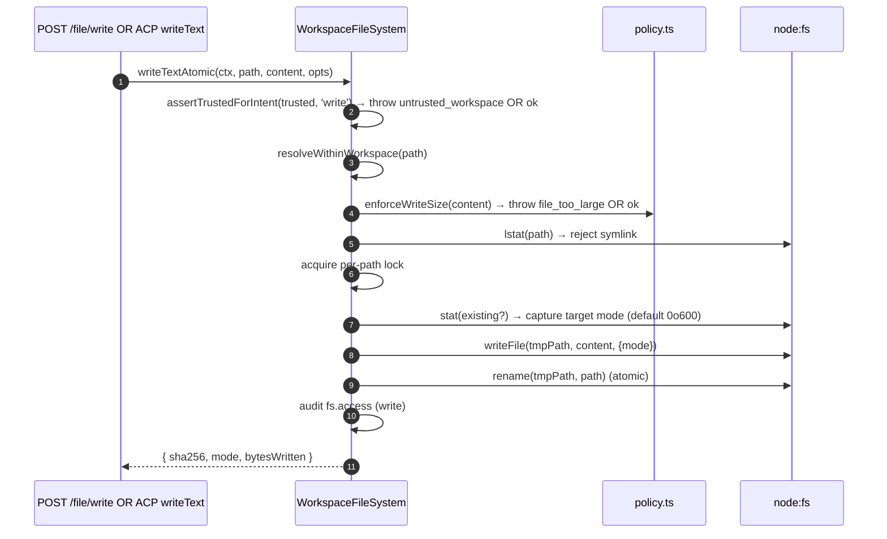
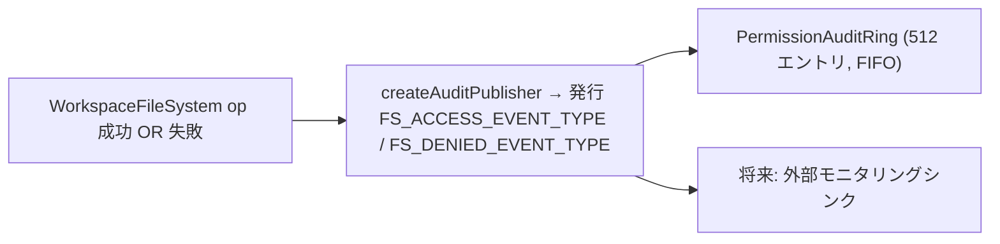

```md
# ワークスペースファイルシステム境界

## 概要

デーモンは、HTTP ルートや ACP 側のエージェントコールがホストのファイルシステムに直接アクセスすることを決して許しません。すべての読み取り、書き込み、リスト、glob、stat は `WorkspaceFileSystem` 境界（`packages/cli/src/serve/fs/`）を通過し、以下を提供します：

- **パス解決** — パスを正規化し、バインドされたワークスペースから逸脱するもの（シンボリックリンク経由も含む）を拒否します。
- **信頼ゲート** — ワークスペースが信頼されていない場合（`untrusted_workspace`）、書き込みを拒否します。
- **サイズ＆コンテンツポリシー** — 読み取り上限（`MAX_READ_BYTES = 256 KiB`）、書き込み上限（`MAX_WRITE_BYTES = 5 MiB`）、バイナリ検出。
- **アトミック性** — 書き込み後にリネームし、ターゲットのモードを保存、新しいファイルのデフォルトは `0o600`。
- **監査** — すべてのアクセス／拒否は、`PermissionAuditRing` / モニタリングのための構造化イベントを発行します。
- **型付きエラー** — 閉じた `FsErrorKind` ユニオンを HTTP ステータスにマッピングします。

HTTP ファイルルート（`GET /file`、`GET /file/bytes`、`POST /file/write`、`POST /file/edit`、`GET /list`、`GET /glob`、`GET /stat`）と ACP 側の `BridgeFileSystem` アダプタ（エージェント駆動の `readTextFile` / `writeTextFile` コールが同じゲートを通過するようにする）は、両方ともこの境界を通過します。

## 責務

- ユーザー指定のパスを、境界内で安全に使用できるブランド化された `ResolvedPath` 値に解決します。
- バインドされたワークスペース外のパス（`path_outside_workspace`）と、ターゲットがシンボリックリンクであるパス（`symlink_escape`）を拒否します。
- `MAX_READ_BYTES` を超える読み取り、`MAX_WRITE_BYTES` を超える書き込み、およびバイナリファイル（`binary_file`）を拒否します。
- ワークスペースが信頼されていない場合（`untrusted_workspace`）、`assertTrustedForIntent(trusted, intent)` によってゲート制御される書き込み/編集を拒否します。
- `.gitignore` / `.qwenignore` パターンを `shouldIgnore` を介して尊重します。
- アトミックな書き込み後のリネームとターゲットモードの保存を実行します。新しいファイルのデフォルトモードは `0o600` です。
- すべての操作で `fs.access` / `fs.denied` 監査イベントを発行します。
- すべての失敗を、種類と HTTP ステータスを持つ `FsError` にマッピングします。ルートハンドラはこれらを統一的にシリアライズします。

## アーキテクチャ

### モジュール構成

| ファイル                     | 目的                                                                                                                                                                                                                                                   |
| ------------------------ | ----------------------------------------------------------------------------------------------------------------------------------------------------------------------------------------------------------------------------------------------------- |
| `paths.ts`               | `canonicalizeWorkspace`、`resolveWithinWorkspace`、`hasSuspiciousPathPattern`、ブランド化された `ResolvedPath`、`Intent` ユニオン（`read \| write \| list \| stat \| glob`）。                                                                                      |
| `policy.ts`              | `MAX_READ_BYTES`、`MAX_WRITE_BYTES`、`BINARY_PROBE_BYTES`、`assertTrustedForIntent`、`detectBinary`、`enforceReadBytesSize`、`enforceReadSize`、`enforceWriteSize`、`shouldIgnore`。                                                                   |
| `audit.ts`               | `FS_ACCESS_EVENT_TYPE`、`FS_DENIED_EVENT_TYPE`、`createAuditPublisher`、監査ペイロード型。                                                                                                                                                          |
| `errors.ts`              | `FsError` クラス、`isFsError`、`FsErrorKind` ユニオン（14種類）、`FsErrorStatus` ユニオン（`400 / 403 / 404 / 409 / 413 / 422 / 500 / 503`）。                                                                                                                |
| `workspace-file-system.ts` | `createWorkspaceFileSystemFactory`、`WorkspaceFileSystem`（読み取り/書き込み/リストを実行するオーケストレーター）、`WriteMode`、`ContentHash`、`FsEntry`、`FsStat`、`ListOptions`、`GlobOptions`、`ReadTextOptions`、`ReadBytesOptions`、`WriteTextAtomicOptions`。 |

### `FsErrorKind` 分類

| 種類                     | デフォルトHTTP | 意味                                                                                                                                                                                       |
| ------------------------ | ------------ | --------------------------------------------------------------------------------------------------------------------------------------------------------------------------------------------- |
| `path_outside_workspace` | 400          | 解決されたパスがバインドされたワークスペース外。                                                                                                                                                 |
| `symlink_escape`         | 400          | ターゲットがシンボリックリンク（PR 18 + PR 20 の保守的な姿勢に基づき拒否）。                                                                                                                    |
| `path_not_found`         | 404          | `ENOENT`。                                                                                                                                                                                     |
| `binary_file`            | 422          | テキストルートでコンテンツがバイナリと検出された。                                                                                                                                                       |
| `file_too_large`         | 413          | `MAX_READ_BYTES` または `MAX_WRITE_BYTES` を超過。                                                                                                                                                  |
| `hash_mismatch`          | 409          | 楽観的同時実行制御の `expectedSha256` が失敗。                                                                                                                                               |
| `file_already_exists`    | 409          | 既存ファイルに対する `mode: 'create'`。                                                                                                                                                    |
| `text_not_found`         | 422          | `POST /file/edit` の検索文字列がファイル内に見つからない。                                                                                                                                         |
| `ambiguous_text_match`   | 422          | 1つだけ必要な場合に複数のマッチがあった。                                                                                                                                               |
| `untrusted_workspace`    | 403          | 信頼されていないワークスペースでの書き込み試行。                                                                                                                                                    |
| `permission_denied`      | 403          | OSレベルの `EACCES` / `EPERM`。                                                                                                                                                                  |
| `io_error`               | 503          | `ENOSPC` / `EIO` / `EBUSY` / `ETXTBSY` / `ENAMETOOLONG` / `EMFILE` / `ENFILE`。**`permission_denied` とは区別される**ため、モニタリングパイプラインが「ディスクフル」でセキュリティ対応者にページングすることはありません。 |
| `internal_error`         | 500          | 境界に到達した非errnoエラー（`TypeError`、プログラマのバグ）。                                                                                                                      |
| `parse_error`            | 400 / 422    | リクエストボディのパースエラー（400）またはサービスレベルの不変条件違反（422）。                                                                                                                       |

### `BridgeFileSystem`（ACP側アダプタ）

`packages/acp-bridge/src/bridgeFileSystem.ts` で定義:

```ts
interface BridgeFileSystem {
  readText(params: ReadTextFileRequest): Promise<ReadTextFileResponse>;
  writeText(params: WriteTextFileRequest): Promise<WriteTextFileResponse>;
}
```

これは、ACP `readTextFile` / `writeTextFile` の注入ポイントです。ブリッジテストや Mode A 組み込み呼び出し元は、`BridgeOptions` でこれを省略できます。その場合、`BridgeClient` はインラインの `fs.readFile` / `fs.writeFile` プロキシにフォールバックします（F1 以前の動作を維持）。本番の `qwen serve` は、`createBridgeFileSystemAdapter(fsFactory)`（`packages/cli/src/serve/bridge-file-system-adapter.ts`）を介して `BridgeFileSystem` を配線するため、エージェント側の ACP 書き込みは、HTTP ルートが使用するものと同じ TOCTOU、シンボリックリンク、信頼ゲート、監査ゲートを取得します。

アダプタが必ず複製しなければならない2つの防御ゲート（アダプタが注入されるとインラインプロキシが完全にバイパスされるため）:

1. **通常ファイル以外を拒否** — ソケット / パイプ / キャラクタデバイス / procfs / sysfs エントリは、`stats.size === 0` にもかかわらず無制限のデータをストリーミングする可能性があります。インラインパスは、メッセージ内に `describeStatKind(stats)` を含めてスローします。
2. **バッファサイズを制限** `READ_FILE_SIZE_CAP = 100 MiB`。500 MB のログに対する小さな `{ line: 1, limit: 10 }` リクエストは、10行を返すためだけに 500 MB の RSS を消費することになります。

アダプタはさらに、`WorkspaceFileSystem.writeTextOverwrite`（PR 18 プリミティブ）を使用して、アトミックなテンポラリファイル・アンド・リネーム書き込みを、モード保存、`0o600` デフォルト、パスごとのロック内でのシンボリックリンク拒否とともに行います。これは、**F1 以前のインラインプロキシからの逸脱**です。以前はシンボリックリンクを解決し、そのターゲットに書き込んでいました。シンボリックリンクされた dotfile を経由して書き込んでいたエージェントは、解決されたパスを直接指定する必要があります。

### ACP ワイヤ上の FsError 保存

`BridgeFileSystem` アダプタが `FsError`（`kind: 'untrusted_workspace'` / `'symlink_escape'` / `'file_too_large'` など）をスローすると、ACP SDK のデフォルトの RPC エラーパスは `error.message` のみを汎用的な `-32603 "Internal error"` としてシリアライズします。`kind` / `status` / `hint` は削除されます。そのため、ダウンストリームのエージェント RPC クライアントは、人間可読なメッセージに対して正規表現マッチを行い、型付けされた UI（認証再試行 vs ファイルピッカー vs プロキシヒント）をディスパッチする必要があります。

`BridgeClient.writeTextFile` と `BridgeClient.readTextFile` は、FsError 形状のスローをキャッチし、ACP `RequestError` として再スローする薄いガード（`packages/acp-bridge/src/bridgeClient.ts`）をインストールします:

```ts
function isFsErrorShape(err: unknown): err is FsErrorShape {
  return (
    err instanceof Error &&
    err.name === 'FsError' &&
    typeof (err as { kind?: unknown }).kind === 'string'
  );
}

function preserveFsErrorOverAcp(err: unknown): never {
  if (isFsErrorShape(err)) {
    throw new RequestError(-32603, err.message, {
      errorKind: err.kind,
      ...(err.hint !== undefined ? { hint: err.hint } : {}),
      ...(err.status !== undefined ? { status: err.status } : {}),
    });
  }
  throw err;
}
```

エージェントの RPC クライアントは `data.errorKind`（閉じた `FsErrorKind` 値）とオプションの `data.hint`、`data.status` を受け取るため、SDK コンシューマはメッセージの正規表現マッチではなく、型付けされた enum で分岐できます。

2つの設計上の注意点:

- **インポートではなくダックタイピング** — `FsError` は `packages/cli/src/serve/fs/errors.ts` にあり、`BridgeClient` は `packages/acp-bridge` にあります。直接 `import { FsError }` すると依存関係が逆転します。ダックチェック（`name === 'FsError'` + `kind: string`）は、`mapDomainErrorToErrorKind`（`status.ts`）が `TrustGateError` / `SkillError` に対して同じクロスパッケージバンドリングの理由で既に行っていることと同様です。
- **JSON-RPC コードは -32603 のまま** — ブリッジは `FsError.kind` を JSON-RPC エラーコードの形状に確実にマッピングできないため、構造化された `data` フィールドが SDK コンシューマのためのセマンティック情報を運びます。ワイヤ上のステータスコード（`-32603` "internal error"）は変更されません。クライアントは `data.errorKind` でルーティングします。

### 信頼ゲート

`assertTrustedForIntent(trusted, intent)` は、呼び出し元によって注入された信頼ブール値を消費します。ポリシーレイヤーは `Config.isTrustedFolder()` を直接読み取りません。読み取り / リスト / stat / glob は常に許可されます（信頼は書き込みのみに適用されます）。信頼されていないワークスペースでの書き込みインテントは、`FsError('untrusted_workspace', ..., status: 403)` をスローします。信頼シグナルは `WorkspaceFileSystemFactoryDeps.trusted: boolean` を介して流入します。`runQwenServe` は `true` を渡します。これは、オペレーターが暗黙的に信頼するワークスペースに対してデーモンを起動するためです。`createServeApp`（`runQwenServe` なしの直接組み込み）はデフォルトで `false` になり、プロセスごとに1回警告します（[`02-serve-runtime.md`](./02-serve-runtime.md) を参照）。

## ワークフロー

### 読み取り

```mermaid
sequenceDiagram
    autonumber
    participant R as HTTP ルート OR BridgeFileSystem.readText
    participant FS as WorkspaceFileSystem
    participant POL as policy.ts
    participant FSP as node:fs

    R->>FS: readText(ctx, path, opts)
    FS->>FS: resolveWithinWorkspace(path) → ResolvedPath OR throw
    FS->>FSP: stat(path)
    FSP-->>FS: stats
    FS->>FS: reject if not regular file (describeStatKind)
    FS->>POL: enforceReadSize(stats.size, opts.maxBytes?)<br/>→ throw file_too_large OR slice plan
    FS->>FSP: readFile(path)
    FSP-->>FS: buffer
    FS->>POL: detectBinary(buffer)
    POL-->>FS: isBinary?
    FS->>FS: reject if binary; sha256 hash; truncate to line window
    FS->>FS: shouldIgnore? → annotate meta.matchedIgnore
    FS->>FS: audit fs.access
    FS-->>R: { content, sha256, truncated?, meta }
```

`readText` は、無視ルールのために読み取りをスキップしたり拒否したりしません。通常通りファイルを読み取り、マッチする無視分類を `meta.matchedIgnore` に記録します。`list` と `glob` は、`includeIgnored` が有効でない場合、無視された結果をフィルタリングします。

### 書き込み



アトミックな書き込み後リネームにより、書き込み中の SIGKILL / OOM がターゲットを切り詰めたままにすることを防ぎます。`mode: 'create'` は lstat で `file_already_exists` により中止します。`mode: 'overwrite'` は続行します。`expectedSha256` は楽観的同時実行制御を有効にします（不一致時は `hash_mismatch`）。

### `POST /file/edit`（単一テキスト置換）

書き込みに加えて2つの失敗モードを追加します:

- `text_not_found` (422) — 検索文字列がファイル内に見つからない。
- `ambiguous_text_match` (422) — 1つだけ必要な場合に複数のマッチがあった（ルートの契約）。

### 監査ファンアウト



`FS_ACCESS_EVENT_TYPE` / `FS_DENIED_EVENT_TYPE` は、コンテキスト（`ctx`）、パス、インテント、結果、errorKind?、bytesRead/written、sha256? を運びます。

## 状態とライフサイクル

- ファクトリはデーモン起動時に1回構築されます（`runQwenServe` → `resolveBridgeFsFactory` → アダプタ）。
- 各リクエストは `RequestContext` を構築し、その呼び出しのみのためにファクトリのオーケストレーターを呼び出します。長期生存するファイル単位の状態はありません。
- パスごとのロックは、書き込み操作の期間中のみ存続します（呼び出しをまたがるロックはありません。同じパスへの同時書き込みはロック上で競合し、直列化されます）。
- 監査リングは `runQwenServe` が所有し、権限監査パブリッシャーと共有されます。

## 依存関係

- `@qwen-code/qwen-code-core` — `Ignore`、`isBinaryFile`、`Config.isTrustedFolder()`。
- `node:fs`、`node:path`、`node:crypto`。
- `@qwen-code/acp-bridge` — ACP 側の `BridgeFileSystem` コントラクト。
- HTTP ルート: `packages/cli/src/serve/routes/workspace-file-read.ts`、`workspace-file-write.ts`。

## 設定

| ソース                                            | つまみ                                                                  | 効果                                                                                                            |
| ------------------------------------------------- | --------------------------------------------------------------------- | ----------------------------------------------------------------------------------------------------------------- |
| `WorkspaceFileSystemFactoryDeps.trusted: boolean` | コンストラクタ入力                                                     | 書き込みが許可されるかどうか。`runQwenServe` からのデフォルトは `true`、`createServeApp` からのデフォルトは `false`（警告あり）。 |
| 定数                                          | `MAX_READ_BYTES = 256 KiB`                                            | 読み取り上限。これを超えると `file_too_large`。                                                                             |
| 定数                                          | `MAX_WRITE_BYTES = 5 MiB`                                             | 書き込み上限。`express.json({ limit: '10mb' })` より小さいサイズに設定。                                                         |
| 定数                                          | `BINARY_PROBE_BYTES = 4096`                                           | コンテンツベースのバイナリ検出のためのサンプルサイズ。                                                                   |
| 機能タグ                                   | `workspace_file_read`、`workspace_file_bytes`、`workspace_file_write` | [`11-capabilities-versioning.md`](./11-capabilities-versioning.md) を参照。                                           |
| ワークスペースファイル                                   | `.gitignore`、`.qwenignore`                                           | 無視されたパスは `shouldIgnore` から `ignored: true` として表示される。                                                     |

## 注意点と既知の制限

- **シンボリックリンクは拒否され、追跡されない。** これは、F1 以前のインライン `BridgeClient.writeTextFile` プロキシ（シンボリックリンクを解決していた）からの逸脱です。シンボリックリンクされた dotfile を通じて書き込むエージェントは、解決されたパスを直接指定する必要があります。
- **`io_error` と `permission_denied` は区別されます。** 混同しないでください。モニタリングパイプラインはアラートのために `errorKind` をキーにしています。ENOSPC を permission_denied に含めると、`df -h` の問題でセキュリティ対応者にページングが行われることになります。
- **新しいファイルのモードは `0o600` がデフォルトであり、umask のデフォルトではありません。** write システムコールの `mode` 引数は umask をバイパスします。公開ファイルを書き込むエージェントは、明示的にモードオーバーライドを渡す必要があります。
- **`createServeApp` のデフォルト `trusted: false`** は、カスタム `fsFactory` や `bridge` を注入しない組み込み者に対して、ACP 書き込みを `untrusted_workspace` でサイレントに拒否します。最初の1回だけ stderr に警告が出力され、以降の呼び出し元にはリマインダーは表示されません。[`02-serve-runtime.md`](./02-serve-runtime.md) を参照してください。
- **読み取り上限はデコード前に適用されます。** `MAX_READ_BYTES + 1` のファイルは、リクエストが10行だけを欲しい場合でも拒否されます。これは、基礎となる `readFileWithLineAndLimit` がスライス前にファイル全体をメモリに読み込むためです。
- **`BridgeFileSystem` アダプタは、両方のインラインプロキシゲート（非通常ファイル拒否 + バッファサイズ上限）を複製する必要があります。** アダプタが注入されると、インラインパスは完全にバイパスされます。

## 参考資料

- `packages/cli/src/serve/fs/index.ts`（バレル）
- `packages/cli/src/serve/fs/paths.ts`
- `packages/cli/src/serve/fs/policy.ts`
- `packages/cli/src/serve/fs/errors.ts`
- `packages/cli/src/serve/fs/audit.ts`
- `packages/cli/src/serve/fs/workspace-file-system.ts`
- `packages/cli/src/serve/bridge-file-system-adapter.ts`
- `packages/acp-bridge/src/bridgeFileSystem.ts`
- HTTP ルートリファレンス: [`../qwen-serve-protocol.md`](../qwen-serve-protocol.md).
```